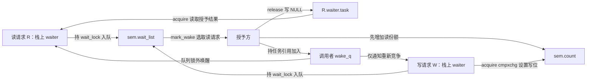
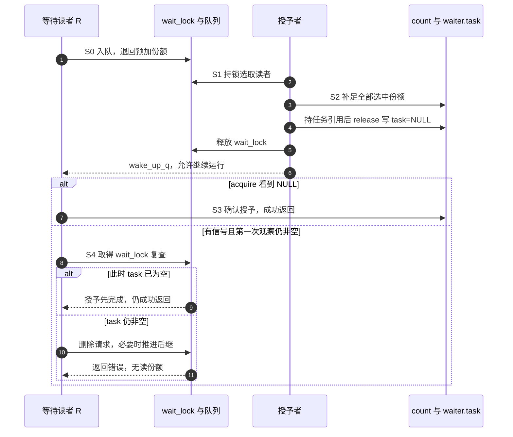

# 第1章\_Linux\_6.12\_rwsem慢路径源码实现

## 1.1\_实现讲解边界

[模块导读](../../../navigation/P03_Linux_6.12_mutex与rwsem模块源码概念导读.md#3.4_rwsem完整调用链)已经把读者份额与写者独占分开；[对象布局](../../include/linux/rwsem.h.md#1.2_非RT对象的状态落点)说明了 count、owner 与 wait_list。现在要回答：一个栈上请求怎样得到份额，收到信号时又怎样安全退出？

本篇依据 NXP 官方 linux-imx 固定提交 dfaf2136deb2af2e60b994421281ba42f1c087e0，Linux 6.12.20、标签 lf-6.12.20-2.0.0。上游文件 kernel/locking/rwsem.c 的 blob 为 2bbb6eca51445bdf434ba579ced4beddafbc52ca，完整身份见[源码基线](../../../../linux/SOURCE_BASELINE.md)。代码按完整类型与函数抽取，中文 Doxygen 为仓库补充，英文原注释保留。范围是非 PREEMPT_RT 实现；owner 自旋内部、公共 down/up 包装与架构原子操作不在本篇逐句展开，不能把这些函数当作独立可编译程序。

## 1.2\_状态地址与统一阶段

count 的低位包含写占有位 RWSEM_WRITER_LOCKED、等待位 RWSEM_FLAG_WAITERS 和交接位 RWSEM_FLAG_HANDOFF；读份额从第 8 位起计数，增加一个 RWSEM_READER_BIAS 就登记一份。RWSEM_LOCK_MASK 合并读写占有部分，RWSEM_WRITER_MASK 在此版本就是写占有位；HANDOFF 需要在相应分支单独检查。owner 的读持有提示也不能代替 count 判断份额。

本协议由几组正交状态组成：共享 count 的份额与标志、共享等待链表、每个 waiter 的任务指针与请求类型、任务调度状态，以及释放者临时 wake_q 中的任务引用。下图把写入与读取落到具体地址。



| 阶段 | 进入触发与写入者 | 状态转换和后续读取者 |
| --- | --- | --- |
| S0 登记 | 快路径或可选尝试没有取得的请求者 | 栈上 waiter 写入身份、类型、期限，持 wait_lock 发布到 wait_list |
| S1 选取 | 释放者或慢路径参与者发现可推进队列 | mark_wake 读队首类型；写者只加入 wake_q，读者进入批量授予 |
| S2 预授 | 授予者选出读者 | 先补齐 count 中全部选中份额，再 release 清各 waiter.task |
| S3 接收/争取 | 读者 acquire 看到 NULL；写者重新运行 | 读者可成功返回；写者仍须成功设置写位并摘队 |
| S4 取消 | 未取得请求遇到允许打断的信号 | 持 wait_lock 复查或删除；若移除队首，尝试推进剩余请求 |
| S5 交付 | 成功或错误已经确定 | 恢复运行状态；栈节点不再留给共享队列，返回 sem 或错误指针 |

S0 不是必经阶段，读慢路径开头仍可能利用已经登记的份额立即成功。S2 只属于读者：写者没有一个“由唤醒方先授予写位”的对称步骤。理解这一差别后，再读函数中的成功与错误标签。

## 1.3\_等待记录与登记删除

```c
/** @brief 区分读写请求的类型枚举（仓库补充阅读说明）。 */
enum rwsem_waiter_type {
	RWSEM_WAITING_FOR_WRITE,
	RWSEM_WAITING_FOR_READ
};
```
```c
/** @brief 共享队列引用的栈上等待记录（仓库补充阅读说明）。 */
struct rwsem_waiter {
	struct list_head list;
	struct task_struct *task;
	enum rwsem_waiter_type type;
	unsigned long timeout;
	bool handoff_set;
};
```
```c
/** @brief 限制本轮可以推进哪类请求（仓库补充阅读说明）。 */
enum rwsem_wake_type {
	RWSEM_WAKE_ANY,		/* Wake whatever's at head of wait list */
	RWSEM_WAKE_READERS,	/* Wake readers only */
	RWSEM_WAKE_READ_OWNED	/* Waker thread holds the read lock */
};
```

timeout 是 jiffies 时钟域中的期限，入队时取当前值加 RWSEM_WAIT_TIMEOUT；该常量按 HZ 计算至少约 4 ms 的等待量，不是承诺任务将在固定时间取得。handoff_set 记录等待协议中的交接状态，不是功能持锁证明。MAX_READERS_WAKEUP 为 0x100，即每次最多选 256 个读请求。

```c
/** @brief 持 wait_lock 把请求追加到队尾（仓库补充阅读说明）。 */
static inline void
rwsem_add_waiter(struct rw_semaphore *sem, struct rwsem_waiter *waiter)
{
	lockdep_assert_held(&sem->wait_lock);
	list_add_tail(&waiter->list, &sem->wait_list);
	/* caller will set RWSEM_FLAG_WAITERS */
}
```
```c
/** @brief 摘除请求，队列为空时清等待与交接标志（仓库补充阅读说明）。 */
static inline bool
rwsem_del_waiter(struct rw_semaphore *sem, struct rwsem_waiter *waiter)
{
	lockdep_assert_held(&sem->wait_lock);
	list_del(&waiter->list);
	if (likely(!list_empty(&sem->wait_list)))
		return true;

	atomic_long_andnot(RWSEM_FLAG_HANDOFF | RWSEM_FLAG_WAITERS, &sem->count);
	return false;
}
```

add_waiter 不替调用者设置 WAITERS，调用者要把队列发布与 count 修正合起来看。del_waiter 返回的是“队列是否仍非空”，不是“是否删除成功”。若仍有其他节点，它保留队列协议；若空了，则清两个协议位，而不随意抹掉正在生效的读写份额。

## 1.4\_mark\_wake先记账再发布

先预测一个具体队列：R1、W1、R2 都在等待，当前队首是读者。此实现扫描整个队列，跳过写者，把 R1、R2 移到本地 wlist，W1 留在原队列；不是遇到第一个写者就停止扫描。限额限制一次处理量，不构成跨版本的业务排序契约。

```c
/** @brief 在队列锁内选取等待者，对读者先授份额后发布完成（仓库补充阅读说明）。 */
static void rwsem_mark_wake(struct rw_semaphore *sem,
			    enum rwsem_wake_type wake_type,
			    struct wake_q_head *wake_q)
{
	struct rwsem_waiter *waiter, *tmp;
	long oldcount, woken = 0, adjustment = 0;
	struct list_head wlist;

	lockdep_assert_held(&sem->wait_lock);

	/*
	 * Take a peek at the queue head waiter such that we can determine
	 * the wakeup(s) to perform.
	 */
	waiter = rwsem_first_waiter(sem);

	if (waiter->type == RWSEM_WAITING_FOR_WRITE) {
		if (wake_type == RWSEM_WAKE_ANY) {
			/*
			 * Mark writer at the front of the queue for wakeup.
			 * Until the task is actually later awoken later by
			 * the caller, other writers are able to steal it.
			 * Readers, on the other hand, will block as they
			 * will notice the queued writer.
			 */
			wake_q_add(wake_q, waiter->task);
			lockevent_inc(rwsem_wake_writer);
		}

		return;
	}

	/*
	 * No reader wakeup if there are too many of them already.
	 */
	if (unlikely(atomic_long_read(&sem->count) < 0))
		return;

	/*
	 * Writers might steal the lock before we grant it to the next reader.
	 * We prefer to do the first reader grant before counting readers
	 * so we can bail out early if a writer stole the lock.
	 */
	if (wake_type != RWSEM_WAKE_READ_OWNED) {
		struct task_struct *owner;

		adjustment = RWSEM_READER_BIAS;
		oldcount = atomic_long_fetch_add(adjustment, &sem->count);
		if (unlikely(oldcount & RWSEM_WRITER_MASK)) {
			/*
			 * When we've been waiting "too" long (for writers
			 * to give up the lock), request a HANDOFF to
			 * force the issue.
			 */
			if (time_after(jiffies, waiter->timeout)) {
				if (!(oldcount & RWSEM_FLAG_HANDOFF)) {
					adjustment -= RWSEM_FLAG_HANDOFF;
					lockevent_inc(rwsem_rlock_handoff);
				}
				waiter->handoff_set = true;
			}

			atomic_long_add(-adjustment, &sem->count);
			return;
		}
		/*
		 * Set it to reader-owned to give spinners an early
		 * indication that readers now have the lock.
		 * The reader nonspinnable bit seen at slowpath entry of
		 * the reader is copied over.
		 */
		owner = waiter->task;
		__rwsem_set_reader_owned(sem, owner);
	}

	/*
	 * Grant up to MAX_READERS_WAKEUP read locks to all the readers in the
	 * queue. We know that the woken will be at least 1 as we accounted
	 * for above. Note we increment the 'active part' of the count by the
	 * number of readers before waking any processes up.
	 *
	 * This is an adaptation of the phase-fair R/W locks where at the
	 * reader phase (first waiter is a reader), all readers are eligible
	 * to acquire the lock at the same time irrespective of their order
	 * in the queue. The writers acquire the lock according to their
	 * order in the queue.
	 *
	 * We have to do wakeup in 2 passes to prevent the possibility that
	 * the reader count may be decremented before it is incremented. It
	 * is because the to-be-woken waiter may not have slept yet. So it
	 * may see waiter->task got cleared, finish its critical section and
	 * do an unlock before the reader count increment.
	 *
	 * 1) Collect the read-waiters in a separate list, count them and
	 *    fully increment the reader count in rwsem.
	 * 2) For each waiters in the new list, clear waiter->task and
	 *    put them into wake_q to be woken up later.
	 */
	INIT_LIST_HEAD(&wlist);
	list_for_each_entry_safe(waiter, tmp, &sem->wait_list, list) {
		if (waiter->type == RWSEM_WAITING_FOR_WRITE)
			continue;

		woken++;
		list_move_tail(&waiter->list, &wlist);

		/*
		 * Limit # of readers that can be woken up per wakeup call.
		 */
		if (unlikely(woken >= MAX_READERS_WAKEUP))
			break;
	}

	adjustment = woken * RWSEM_READER_BIAS - adjustment;
	lockevent_cond_inc(rwsem_wake_reader, woken);

	oldcount = atomic_long_read(&sem->count);
	if (list_empty(&sem->wait_list)) {
		/*
		 * Combined with list_move_tail() above, this implies
		 * rwsem_del_waiter().
		 */
		adjustment -= RWSEM_FLAG_WAITERS;
		if (oldcount & RWSEM_FLAG_HANDOFF)
			adjustment -= RWSEM_FLAG_HANDOFF;
	} else if (woken) {
		/*
		 * When we've woken a reader, we no longer need to force
		 * writers to give up the lock and we can clear HANDOFF.
		 */
		if (oldcount & RWSEM_FLAG_HANDOFF)
			adjustment -= RWSEM_FLAG_HANDOFF;
	}

	if (adjustment)
		atomic_long_add(adjustment, &sem->count);

	/* 2nd pass */
	list_for_each_entry_safe(waiter, tmp, &wlist, list) {
		struct task_struct *tsk;

		tsk = waiter->task;
		get_task_struct(tsk);

		/*
		 * Ensure calling get_task_struct() before setting the reader
		 * waiter to nil such that rwsem_down_read_slowpath() cannot
		 * race with do_exit() by always holding a reference count
		 * to the task to wakeup.
		 */
		smp_store_release(&waiter->task, NULL);
		/*
		 * Ensure issuing the wakeup (either by us or someone else)
		 * after setting the reader waiter to nil.
		 */
		wake_q_add_safe(wake_q, tsk);
	}
}
```

函数有三处需要停下来计算。

第一处是写者分支：wake_q_add 只安排唤醒，随后直接返回。没有设置写位，没有把它从 wait_list 删除；唤醒后仍由写者争取占有。读者分支则先检查 count 的最高保护位，count 为负时不再批量放行，避免继续扩大读计数。

第二处是首次预加。调用者不是 RWSEM_WAKE_READ_OWNED 时，先尝试加一份，借旧 count 判断有没有写占有挡住本次授予。受阻时退回预加；若超出期限且还没有 HANDOFF，则把本次回退量调整为“退读份额但留下交接请求”。所以代码里 adjustment 减去 HANDOFF 再取负，并非在倒扣某个任务的身份。已有读占有的调用者则不需要这个首次试探。

第三处是两遍发布。第一遍把选中读者移入 wlist 并统计 woken，计算总份额减去已经预加的那一份；若未预加，则补足全部选中份额。同时根据原队列是否为空决定清 WAITERS，并处理 HANDOFF。第二遍才逐个清 waiter.task。假设顺序反过来，R1 可能还没真正睡下，看到自己的 task 为 NULL 后立刻执行临界区并 up_read；它将减去一份尚未登记的计数。先授予再发布就是为消除这条反例。

发布前还先 get_task_struct：一旦清了 task，读者可能继续执行甚至退出，而唤醒动作还没完成。临时任务引用使后续 wake_q 不依赖读者还停在原处；wake_q_add_safe 接手这个引用。保存到 tsk 后，清 task 之后不再依赖该 waiter 的字段。这个对象寿命协议与 count 的读锁份额是两件事。

## 1.5\_读者等待与信号复查

读慢路径收到的 count 来自先前获取尝试，已经包含本请求预加的一份。因此 adjustment 初始为负的 RWSEM_READER_BIAS：真正排队时要退掉这份“正在尝试”的计数，否则等待者会被错误计为持有者。反之，若开头条件允许直接成功，就保留该份额而不先入队。

```c
/** @brief 读者直接取得或排队，按授予标记决定成功与取消（仓库补充阅读说明）。 */
static struct rw_semaphore __sched *
rwsem_down_read_slowpath(struct rw_semaphore *sem, long count, unsigned int state)
{
	long adjustment = -RWSEM_READER_BIAS;
	long rcnt = (count >> RWSEM_READER_SHIFT);
	struct rwsem_waiter waiter;
	DEFINE_WAKE_Q(wake_q);

	/*
	 * To prevent a constant stream of readers from starving a sleeping
	 * writer, don't attempt optimistic lock stealing if the lock is
	 * very likely owned by readers.
	 */
	if ((atomic_long_read(&sem->owner) & RWSEM_READER_OWNED) &&
	    (rcnt > 1) && !(count & RWSEM_WRITER_LOCKED))
		goto queue;

	/*
	 * Reader optimistic lock stealing.
	 */
	if (!(count & (RWSEM_WRITER_LOCKED | RWSEM_FLAG_HANDOFF))) {
		rwsem_set_reader_owned(sem);
		lockevent_inc(rwsem_rlock_steal);

		/*
		 * Wake up other readers in the wait queue if it is
		 * the first reader.
		 */
		if ((rcnt == 1) && (count & RWSEM_FLAG_WAITERS)) {
			raw_spin_lock_irq(&sem->wait_lock);
			if (!list_empty(&sem->wait_list))
				rwsem_mark_wake(sem, RWSEM_WAKE_READ_OWNED,
						&wake_q);
			raw_spin_unlock_irq(&sem->wait_lock);
			wake_up_q(&wake_q);
		}
		return sem;
	}

queue:
	waiter.task = current;
	waiter.type = RWSEM_WAITING_FOR_READ;
	waiter.timeout = jiffies + RWSEM_WAIT_TIMEOUT;
	waiter.handoff_set = false;

	raw_spin_lock_irq(&sem->wait_lock);
	if (list_empty(&sem->wait_list)) {
		/*
		 * In case the wait queue is empty and the lock isn't owned
		 * by a writer, this reader can exit the slowpath and return
		 * immediately as its RWSEM_READER_BIAS has already been set
		 * in the count.
		 */
		if (!(atomic_long_read(&sem->count) & RWSEM_WRITER_MASK)) {
			/* Provide lock ACQUIRE */
			smp_acquire__after_ctrl_dep();
			raw_spin_unlock_irq(&sem->wait_lock);
			rwsem_set_reader_owned(sem);
			lockevent_inc(rwsem_rlock_fast);
			return sem;
		}
		adjustment += RWSEM_FLAG_WAITERS;
	}
	rwsem_add_waiter(sem, &waiter);

	/* we're now waiting on the lock, but no longer actively locking */
	count = atomic_long_add_return(adjustment, &sem->count);

	rwsem_cond_wake_waiter(sem, count, &wake_q);
	raw_spin_unlock_irq(&sem->wait_lock);

	if (!wake_q_empty(&wake_q))
		wake_up_q(&wake_q);

	trace_contention_begin(sem, LCB_F_READ);

	/* wait to be given the lock */
	for (;;) {
		set_current_state(state);
		if (!smp_load_acquire(&waiter.task)) {
			/* Matches rwsem_mark_wake()'s smp_store_release(). */
			break;
		}
		if (signal_pending_state(state, current)) {
			raw_spin_lock_irq(&sem->wait_lock);
			if (waiter.task)
				goto out_nolock;
			raw_spin_unlock_irq(&sem->wait_lock);
			/* Ordered by sem->wait_lock against rwsem_mark_wake(). */
			break;
		}
		schedule_preempt_disabled();
		lockevent_inc(rwsem_sleep_reader);
	}

	__set_current_state(TASK_RUNNING);
	lockevent_inc(rwsem_rlock);
	trace_contention_end(sem, 0);
	return sem;

out_nolock:
	rwsem_del_wake_waiter(sem, &waiter, &wake_q);
	__set_current_state(TASK_RUNNING);
	lockevent_inc(rwsem_rlock_fail);
	trace_contention_end(sem, -EINTR);
	return ERR_PTR(-EINTR);
}
```

等待循环读取的是 waiter.task，不是反复竞争 count：NULL 代表授予方已经替它记入份额。正常路径用 smp_load_acquire 对应 mark_wake 的 smp_store_release；信号路径在 wait_lock 下再读一次，利用同一把锁与授予动作串行化。

于是“信号已经到来”不能单独决定失败。若复查发现 task 仍非空，才能进入删除；若已经为 NULL，读份额已授予，应成功返回，由调用者随后按正常持锁规则释放。否则将产生一个没人负责归还的份额。



## 1.6\_写者唤醒后仍须取得

写者的真正取得点在下面的 acquire cmpxchg。先读队首与 HANDOFF：若队首已经登记 handoff_set，非队首必须让步。没有占有时设置写位、清 HANDOFF，必要时清 WAITERS；成功后摘掉自己的节点并更新 owner。

```c
/** @brief 尝试设置写位，或在受阻且满足条件时请求交接（仓库补充阅读说明）。 */
static inline bool rwsem_try_write_lock(struct rw_semaphore *sem,
					struct rwsem_waiter *waiter)
{
	struct rwsem_waiter *first = rwsem_first_waiter(sem);
	long count, new;

	lockdep_assert_held(&sem->wait_lock);

	count = atomic_long_read(&sem->count);
	do {
		bool has_handoff = !!(count & RWSEM_FLAG_HANDOFF);

		if (has_handoff) {
			/*
			 * Honor handoff bit and yield only when the first
			 * waiter is the one that set it. Otherwisee, we
			 * still try to acquire the rwsem.
			 */
			if (first->handoff_set && (waiter != first))
				return false;
		}

		new = count;

		if (count & RWSEM_LOCK_MASK) {
			/*
			 * A waiter (first or not) can set the handoff bit
			 * if it is an RT task or wait in the wait queue
			 * for too long.
			 */
			if (has_handoff || (!rt_or_dl_task(waiter->task) &&
					    !time_after(jiffies, waiter->timeout)))
				return false;

			new |= RWSEM_FLAG_HANDOFF;
		} else {
			new |= RWSEM_WRITER_LOCKED;
			new &= ~RWSEM_FLAG_HANDOFF;

			if (list_is_singular(&sem->wait_list))
				new &= ~RWSEM_FLAG_WAITERS;
		}
	} while (!atomic_long_try_cmpxchg_acquire(&sem->count, &count, new));

	/*
	 * We have either acquired the lock with handoff bit cleared or set
	 * the handoff bit. Only the first waiter can have its handoff_set
	 * set here to enable optimistic spinning in slowpath loop.
	 */
	if (new & RWSEM_FLAG_HANDOFF) {
		first->handoff_set = true;
		lockevent_inc(rwsem_wlock_handoff);
		return false;
	}

	/*
	 * Have rwsem_try_write_lock() fully imply rwsem_del_waiter() on
	 * success.
	 */
	list_del(&waiter->list);
	rwsem_set_owner(sem);
	return true;
}
```

有占有时，满足实时/截止期限任务或等待超时条件的等待者可以请求 HANDOFF；原文注释与具体代码要一起读，不能一概声称“仅队首能发起此次原子置位”。成功设置 HANDOFF 后，代码把 first->handoff_set 置真，返回 false：和 mutex 一样，请求成功不是取得成功。这里的实时任务类别也不等于启用了 PREEMPT_RT 内核配置。

```c
/** @brief 写请求入队后循环争取占有，并在失败取消时清理（仓库补充阅读说明）。 */
static struct rw_semaphore __sched *
rwsem_down_write_slowpath(struct rw_semaphore *sem, int state)
{
	struct rwsem_waiter waiter;
	DEFINE_WAKE_Q(wake_q);

	/* do optimistic spinning and steal lock if possible */
	if (rwsem_can_spin_on_owner(sem) && rwsem_optimistic_spin(sem)) {
		/* rwsem_optimistic_spin() implies ACQUIRE on success */
		return sem;
	}

	/*
	 * Optimistic spinning failed, proceed to the slowpath
	 * and block until we can acquire the sem.
	 */
	waiter.task = current;
	waiter.type = RWSEM_WAITING_FOR_WRITE;
	waiter.timeout = jiffies + RWSEM_WAIT_TIMEOUT;
	waiter.handoff_set = false;

	raw_spin_lock_irq(&sem->wait_lock);
	rwsem_add_waiter(sem, &waiter);

	/* we're now waiting on the lock */
	if (rwsem_first_waiter(sem) != &waiter) {
		rwsem_cond_wake_waiter(sem, atomic_long_read(&sem->count),
				       &wake_q);
		if (!wake_q_empty(&wake_q)) {
			/*
			 * We want to minimize wait_lock hold time especially
			 * when a large number of readers are to be woken up.
			 */
			raw_spin_unlock_irq(&sem->wait_lock);
			wake_up_q(&wake_q);
			raw_spin_lock_irq(&sem->wait_lock);
		}
	} else {
		atomic_long_or(RWSEM_FLAG_WAITERS, &sem->count);
	}

	/* wait until we successfully acquire the lock */
	set_current_state(state);
	trace_contention_begin(sem, LCB_F_WRITE);

	for (;;) {
		if (rwsem_try_write_lock(sem, &waiter)) {
			/* rwsem_try_write_lock() implies ACQUIRE on success */
			break;
		}

		raw_spin_unlock_irq(&sem->wait_lock);

		if (signal_pending_state(state, current))
			goto out_nolock;

		/*
		 * After setting the handoff bit and failing to acquire
		 * the lock, attempt to spin on owner to accelerate lock
		 * transfer. If the previous owner is a on-cpu writer and it
		 * has just released the lock, OWNER_NULL will be returned.
		 * In this case, we attempt to acquire the lock again
		 * without sleeping.
		 */
		if (waiter.handoff_set) {
			enum owner_state owner_state;

			owner_state = rwsem_spin_on_owner(sem);
			if (owner_state == OWNER_NULL)
				goto trylock_again;
		}

		schedule_preempt_disabled();
		lockevent_inc(rwsem_sleep_writer);
		set_current_state(state);
trylock_again:
		raw_spin_lock_irq(&sem->wait_lock);
	}
	__set_current_state(TASK_RUNNING);
	raw_spin_unlock_irq(&sem->wait_lock);
	lockevent_inc(rwsem_wlock);
	trace_contention_end(sem, 0);
	return sem;

out_nolock:
	__set_current_state(TASK_RUNNING);
	raw_spin_lock_irq(&sem->wait_lock);
	rwsem_del_wake_waiter(sem, &waiter, &wake_q);
	lockevent_inc(rwsem_wlock_fail);
	trace_contention_end(sem, -EINTR);
	return ERR_PTR(-EINTR);
}
```

写者不等待自己的 task 被清空。每轮持 wait_lock 调用 try_write_lock；失败才释放队列锁并检查信号，必要时等待。handoff_set 为真时可尝试观察 owner 加速交接；OWNER_NULL 只让它跳回再次取得队列锁、重新争取，并不直接成功返回。

成功分支已经由 try_write_lock 摘队，外层只恢复任务状态并退出。错误分支则重新取得 wait_lock，调用统一删除与后继推进函数。不能照抄读者的 NULL 授予判断来取消写者，因为写路径根本没有那条授予协议。

## 1.7\_取消如何让后继继续

读写慢路径中的条件推进先依据 count 选择允许的唤醒类别；仍有写占有时不放行，有读者时只尝试读者，完全没有占有时才允许队首写者参与。这个辅助函数不因 HANDOFF 单独返回；交接请求的兑现要继续看 mark_wake 与写者取得路径。

```c
/** @brief 按当前占有状态选择读者或任意队首推进（仓库补充阅读说明）。 */
static inline void rwsem_cond_wake_waiter(struct rw_semaphore *sem, long count,
					  struct wake_q_head *wake_q)
{
	enum rwsem_wake_type wake_type;

	if (count & RWSEM_WRITER_MASK)
		return;

	if (count & RWSEM_READER_MASK) {
		wake_type = RWSEM_WAKE_READERS;
	} else {
		wake_type = RWSEM_WAKE_ANY;
		clear_nonspinnable(sem);
	}
	rwsem_mark_wake(sem, wake_type, wake_q);
}
```
```c
/** @brief 取消本节点，必要时推进后继并在锁外执行唤醒（仓库补充阅读说明）。 */
static inline void
rwsem_del_wake_waiter(struct rw_semaphore *sem, struct rwsem_waiter *waiter,
		      struct wake_q_head *wake_q)
		      __releases(&sem->wait_lock)
{
	bool first = rwsem_first_waiter(sem) == waiter;

	wake_q_init(wake_q);

	/*
	 * If the wait_list isn't empty and the waiter to be deleted is
	 * the first waiter, we wake up the remaining waiters as they may
	 * be eligible to acquire or spin on the lock.
	 */
	if (rwsem_del_waiter(sem, waiter) && first)
		rwsem_mark_wake(sem, RWSEM_WAKE_ANY, wake_q);
	raw_spin_unlock_irq(&sem->wait_lock);
	if (!wake_q_empty(wake_q))
		wake_up_q(wake_q);
}
```

del_wake_waiter 的入口已经持有 wait_lock，出口却已经释放它；源码的 __releases 注解正提醒调用者这个不对称契约。先记住被删除者是否队首，再删除；只有仍有节点且刚删除队首时才尝试 mark_wake。这样，原先挡在队首后面的可运行请求不会只因前任退出就无人推进。实际 wake_up_q 留在 raw 锁外，缩短串行化范围。

## 1.8\_预测练习与证据边界

1. 队列 R1、W1、R2，选取未达上限：第一遍结束后谁还在 wait_list，count 应为哪些新读者保留份额？
2. 把清 task 移到 count 增加之前：构造 R1 没有真正睡下便完成 up_read 的时间线，指出哪个计数先后关系被破坏。
3. 信号到达后读者首次看到 task 非空，取得 wait_lock 后却看到 NULL：应成功还是失败？谁负责最终释放？
4. 写者收到 wake 后被另一个竞争者先取得：为什么不违反本函数的返回契约？
5. 删除队首与删除队尾为什么触发不同的后继推进？调用者返回后还能不能再次解 wait_lock？

对照要点：第 1 题 W1 留队，R1/R2 获得份额；第 2 题归还早于记入；第 3 题成功，调用者负责 up_read；第 4 题 wake 从未承诺写位已授予；第 5 题队首退出可能解除队列阻挡，辅助函数已经解锁，不能重复解锁。

本篇覆盖登记、选取、预授、接收、写竞争与取消的八个完整函数；没有展开 owner 自旋内部、所有公共接口和体系结构原子指令。当前核对工作配置非 SMP、PREEMPT_NONE，未启用 owner 自旋；源码静态比对不代表目标内核编译、信号竞争或吞吐测试已经执行。

总索引：[锁源码总阅读索引](../../../navigation/P01_Linux_6.12_锁源码总阅读索引.md#1.6_建议阅读顺序)。

模块导读：[mutex 与 rwsem](../../../navigation/P03_Linux_6.12_mutex与rwsem模块源码概念导读.md#3.4_rwsem完整调用链)。

上一篇：[mutex 交接实现](mutex.c.md)。
