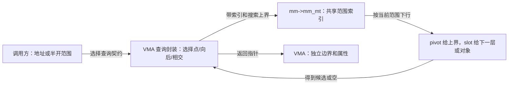

# 第2章\_范围契约与查询入口

## 2.1\_同一地址可以提出不同问题

设 G=[0x50000000,0x50010000)，H=[0x50010000,0x50030000)。同一地址空间的 mm_struct 拥有 mm_mt 索引，索引最终关联独立的 vm_area_struct；调用方提供地址或范围，得到的是对象指针，不是物理页号。

三个查询任务分别是“此处是谁”“此处或后面最近的是谁”“在给定范围内最先相交的是谁”。地址位于 G 前面时，第一种返回空、第二种返回 G，第三种还需判断查询上界是否已经越过 G 的起点。背景模型见 [P14](../../../../knowledge/linux/data_structures/红黑树_rb-tree/P14_Maple_Tree_与_VMA_管理.md#14.9.3_运行G与H的区间模型)，版本总入口见[阅读索引](P01_Linux_6.12_Maple范围源码阅读索引.md#1.2_按读者问题进入证据)。

## 2.2\_先核对区间再核对容量

[include/linux/mm_types.h](../../linux/include/linux/mm_types.h)声明 VMA 的 vm_start/vm_end，mm_mt 则保存地址空间的索引。VMA 终点不包含；进入 Maple 时使用闭区间末端 end-1，所以必须先排除空区间。通用索引可以到 ULONG_MAX，不能不检查溢出就执行 last+1。

[include/linux/maple_tree.h](../../linux/include/linux/maple_tree.h)在范围布局前说明：pivot 包含同号槽的上界。maple_range_64 使用 pivot 和 slot 数组；maple_arange_64 额外保存 gap 汇总，记录孩子范围中最大的空区间。后者为寻找足够大空洞提供排除条件，同时占用节点空间。

固定头文件的 64 位或 BUILD_VDSO32_64 分支给出 16/10 槽数组上限，普通 32 位分支给出 32/21；dense 节点是另一布局，不应用这组数字。字段使用 unsigned long，名字中的 64 不覆盖 C 类型与构建配置。有效数据终点和节点类型继续限制实际使用槽数，本模块不将数组上限当作恒定分支数。

## 2.3\_按封装协作而不是名字猜语义

[vma_lookup](../source_explanations/include/linux/mm.h.md#1.2_vma_lookup只查询当前地址)使用 mtree_load，只在指定索引取得 entry。[find_vma](../source_explanations/mm/mmap.c.md#1.2_find_vma与上界)把局部 index 初始化为地址，再让 mt_find 向后搜索到 ULONG_MAX；index 由本次调用拥有，内部更新不会把调用方的地址变量改掉。

[find_vma_intersection](../source_explanations/mm/mmap.c.md#1.3_find_vma_intersection翻译排除式终点)把相同搜索的上界限定为 end_addr-1。它不会越过这个边界去寻找更远对象，但不负责替调用方证明输入范围合法。

[find_vma_prev](../source_explanations/mm/mmap.c.md#1.4_find_vma_prev保持两个结果)建立局部 VMA iterator，先读取当前位置，再移动游标找前驱；若原位置为空，才继续找下一对象。返回值和 pprev 是两个独立结果，不能把函数解释成“只返回前驱”。

普通 Maple 查询与高级 mas 操作的区分见[固定文档](../../linux/Documentation/core-api/maple_tree.rst)：前者封装常用操作，后者将状态与同步管理更多交给调用方。游标不是索引永久拥有的共享节点；只改变游标位置不等于改变 VMA 集合。

## 2.4\_返回指针的使用期限

mmap.c 的两个向后查询使用 mmap_assert_locked；find_vma_prev 的上游说明明确依赖外部 mmap 锁。断言检查的是调用约定，不是自动获取锁。mm_mt 的外部锁关联由 kernel/fork.c 初始化，MM_MT_FLAGS 在 mm_types.h 中选择空洞汇总、外部锁及 RCU 模式。

树的初始化、外部锁描述和模式切换另沿[树模式导读](P03_树对象与模式选择.md#3.2_从未发布到受保护使用)定位唯一实现；它们不代替这里的返回对象协议。

普通 mtree_load 在函数内部进入 RCU 不能替返回对象自动取得长期引用。调用方仍需保持适当的 mmap 锁或走对应版本允许的 VMA 稳定协议。知识正文的[锁下观察周期](../../../../knowledge/linux/data_structures/红黑树_rb-tree/P14_Maple_Tree_与_VMA_管理.md#14.11.1_复杂并发场景_page_fault_读路径与_munmap_写路径)展示默认路径，不把本地游标、树节点生命期与 VMA 属性锁混为一个状态机。

固定 mm/memory.c 中的 lock_vma_under_rcu 由 CONFIG_PER_VMA_LOCK 控制，除树查询外还需稳定候选及检查边界；本次配置未启用，不据此声称目标正在执行它。本模块不逐句展开该分支，也不承诺一次返回可以跨任意解锁点继续使用。
