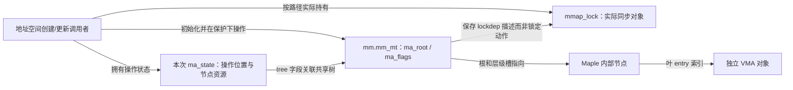
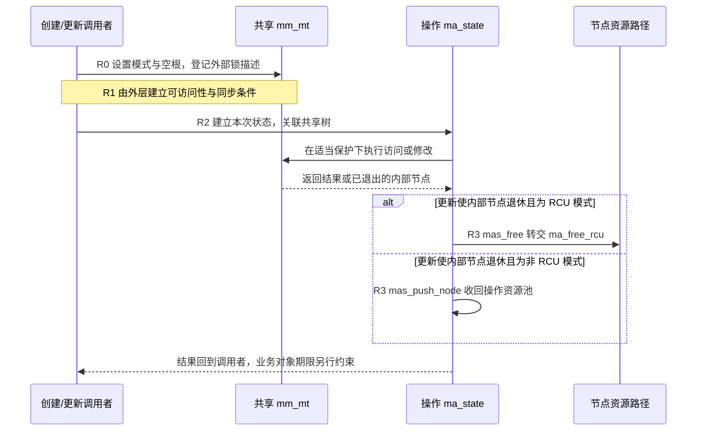

# 第3章\_树对象与模式选择

## 3.1\_同一范围为何需要三种所有者

共享范围索引、一次操作的位置和索引到的业务对象有不同期限。mm_struct 拥有 mm_mt，Maple 管理内部节点，ma_state 由当前操作持有，VMA 则是独立对象。下面按固定 Linux 6.12.20 的外层生命周期组织源码，不把一个模式位当成完整同步协议。基线见[总索引](P01_Linux_6.12_Maple范围源码阅读索引.md#1.1_从地址查询进入版本证据)，知识模型见[P15 树对象](../../../../knowledge/linux/data_structures/红黑树_rb-tree/P15_Linux_6.12_Maple_Tree_源码结构与_API_分层.md#15.3_struct_maple_tree_树对象本身)。

## 3.2\_从未发布到受保护使用

这不是单一位值能表达的状态机：树表示、锁持有、节点资源归属和对象寿命是正交状态。R0～R3 仅标记一条外层操作过程；它们不是新增内核字段，也不意味着每次读取都会初始化或退休节点。

| 阶段 | 写入者与存储位置 | 后续读取者与退出条件 |
| --- | --- | --- |
| R0 创建 | mm_init 选择模式，mt_init_flags 写共享 ma_flags、空 ma_root；外部模式跳过内部锁初始化 | 创建者继续登记外部锁描述；树尚未交给正常并发调用者 |
| R1 建立使用条件 | 外层生命周期使 mm 可被合法使用，调用者按路径取得 mmap 锁或建立允许的读侧协议 | Maple API 可读取模式和根；本节不展开 mm 的引用发布全过程 |
| R2 完成一次访问/修改 | 操作私有 ma_state 记录位置；受保护的更新路径修改树节点与入口 | 后续查询沿共享入口观察结构；返回的 entry 仍受业务对象协议约束 |
| R3 内部节点退休 | 具体更新先使旧节点退出；mas_free 读取模式，转交 RCU 回收或本次操作资源池 | 资源何时真正释放/复用由所选路径处理；这一步不释放 VMA 本身 |

R0 的唯一字段和函数见[树定义及模式位](../source_explanations/include/linux/maple_tree.h.md#1.2_共享树字段与模式位)、[初始化](../source_explanations/include/linux/maple_tree.h.md#1.3_初始化先选择锁模式再建立空根)。VMA 的三项能力由[MM_MT_FLAGS](../source_explanations/include/linux/mm_types.h.md#1.2_VMA树的三项模式)组合，外部描述由[mt_set_external_lock](../source_explanations/include/linux/maple_tree.h.md#1.4_外部锁登记不是取得锁)关联；固定 kernel/fork.c 的 mm_init 先后使用这两项，不取得覆盖后续所有操作的长锁。

图中退休分支不是每次 API 的固定尾声，具体算法决定是否以及何时有节点退出；它只把同一个模式读取点的资源选择放回操作背景。详细语句见[mas_free](../source_explanations/lib/maple_tree.c.md#1.2_退休节点根据模式选择去向)，没有借这一短函数宣称所有写路径与 RCU 回收均已覆盖。

## 3.3\_清除模式之前还缺什么证据

[mt_in_rcu、mt_clear_in_rcu 与 mt_set_in_rcu](../source_explanations/include/linux/maple_tree.h.md#1.5_RCU模式读写不代替生命周期协议)读取或改写模式，内部锁或外部锁检查只处理相应写者约定。函数没有等待宽限期；不能由“已持有写锁”推出无锁读者已经全部退出。

固定 mm/mmap.c 的 exit_mmap 在最后用户已离开、地址空间即将拆除的上下文中清除模式。它说明调用者必须先具备更大生命周期条件，不给活跃树提供任意清位后立即复用的许可。CONFIG_LOCKDEP 关闭也只去掉描述和检查，不去掉外部同步责任；CONFIG_MAPLE_RCU_DISABLED 则是 mt_in_rcu 的独立构建分支，不能与目标当前配置混用。

本模块进行了固定对象比对和静态分支核对；未运行 Maple 核心、真实 mmap/munmap、目标并发读写或回收压力测试。继续阅读节点和游标时，应分别追踪状态地址与保护范围，不把 VMA 指针返回当成长引用。
