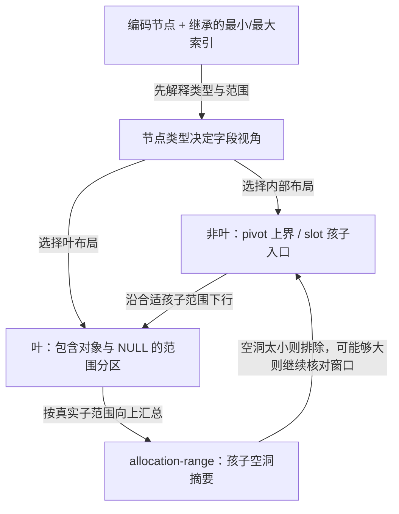

# 第4章\_节点布局与范围分区

## 4.1\_从根入口进入哪个布局

共享树的根可能是直接 entry，也可能引出编码节点。这里只讨论进入节点之后的布局责任，前提与模式见[树对象导读](P03_树对象与模式选择.md#3.2_从未发布到受保护使用)。固定版本见[总索引](P01_Linux_6.12_Maple范围源码阅读索引.md#1.1_从地址查询进入版本证据)，贯穿实例和完整 C++ 范围程序见[P38](../../../../knowledge/linux/data_structures/红黑树_rb-tree/P38_Maple节点中的范围与空洞.md#38.5_运行包含空槽的分区程序)。

不要由指针类型名字直接解引用任一 union 成员。先确定当前节点类型和继承的索引范围，再选择 slot/pivot/gap 的解释。叶 slot 保存 entry，非叶 slot 保存下一层编码入口；NULL entry 对应空范围，在概念图里也不能被省略成相邻对象直接接续。

## 4.2\_按问题读取布局

| 问题 | 固定实现位置 | 必须保留的边界 |
| --- | --- | --- |
| 当前分支有多少数组槽 | [容量常量](../source_explanations/include/linux/maple_tree.h.md#1.6_构建条件决定数组容量) | 按 CONFIG_64BIT 或 BUILD_VDSO32_64 条件选择，不把名字 _64 当作配置 |
| pivot、slot 与 metadata 怎样共用存储 | [范围结构](../source_explanations/include/linux/maple_tree.h.md#1.7_范围布局与元数据) | 最后范围界可隐含；声明容量与有效数据终点不同 |
| 为什么 gap 使槽数减少 | [arange 结构](../source_explanations/include/linux/maple_tree.h.md#1.7_范围布局与元数据) | gap 保存子范围信息，判断窗口内可用地址还需要继续查找 |
| 为什么看到 rcu 和 alloc 成员 | [节点容器](../source_explanations/include/linux/maple_tree.h.md#1.8_容器复用与节点资源) | 它们属于不同生命周期视角，不与活动范围布局同时解释 |
| 256 字节对齐从哪里来 | [缓存初始化](../source_explanations/lib/maple_tree.c.md#1.3_节点缓存按实际结构大小申请对齐) | 实际参数是 sizeof(maple_node)，不能由局部注释代替 ABI 核对 |

图中汇总箭头描述所需信息方向，不声称每次点查都会重新计算 gap。修改相关范围时才需相应维护；完整更新、传播与搜索算法还未在本模块逐句展开。原 A～G 之间的六个间隔只说明输入地址图，不能直接当成某个真实内部节点的六个 gap 槽。

## 4.3\_布局证据与运行模型各自证明什么

固定 include/linux/maple_tree.h 与 lib/maple_tree.c 使用总索引所列官方提交；数组、结构和缓存初始化语句与固定文件比对。为解释 arange 的局部 240 字节注释，提取相关定义并显式适配 __rcu/rcu_head，在 ARM32 与 x86_64 freestanding 前端检查大小：maple_node 和 range 为 256；arange 在两种目标下分别为 256 和 248。未将这一适配检查称为完整目标内核编译。

P38 的程序另外验证包含式上界、NULL 分区与裁剪窗口的 first-fit。它没有真实 Maple 节点、RCU、摘要传播或动态重平衡。布局检查回答“字节如何安排”，宿主程序回答“这些范围规则如何影响结果”，两者都不能替代内核并发和性能验证。
