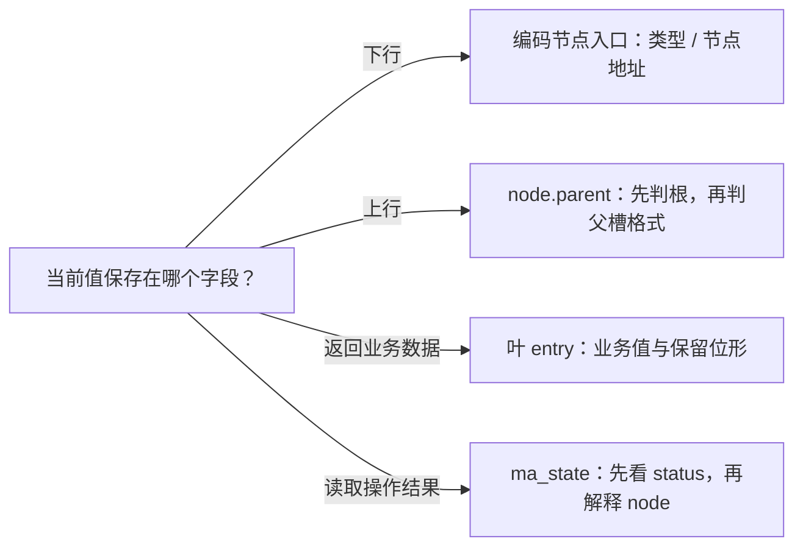

# 第5章\_字段编码与状态分工

## 5.1\_先认存储位置再认低位

[节点布局](P04_节点布局与范围分区.md#4.2_按问题读取布局)说明 node 的字节安排；本模块区分进入该节点的编码入口、节点内 parent、用户 entry 和调用者状态。固定版本仍由[总索引](P01_Linux_6.12_Maple范围源码阅读索引.md#1.1_从地址查询进入版本证据)定位，完整整数实验见[P15 编码单元](../../../../knowledge/linux/data_structures/红黑树_rb-tree/P15_Linux_6.12_Maple_Tree_源码结构与_API_分层.md#15.5.4_用定宽整数观察错误掩码)。

256 字节对齐属于内部节点，不属于所有相关对象。根的 parent 关联树对象，叶 entry 可关联 VMA；把所有地址统一清低八位，可能把另一个对象的有效地址位清掉。这里的解码 helper 均依赖合法字段与存活条件，不能用来检测任意坏指针。

## 5.2\_同一数值先按存储位置解读

| 存储与读取任务 | 唯一实现 | 不能混用的含义 |
| --- | --- | --- |
| 下行编码节点及共享根入口 | [节点类型与入口](../source_explanations/lib/maple_tree.c.md#1.4_编码节点保存类型而不是父槽) | 类型位不是父槽；移除根入口 bit 1 不等于恢复裸节点 |
| 当前节点的 parent | [父关系与根例外](../source_explanations/lib/maple_tree.c.md#1.5_父关系编码与根例外) | 非根父槽采用独立掩码，根 bit 0 关联树对象 |
| 叶中的用户 entry | [小值保留检查](../source_explanations/lib/maple_tree.c.md#1.6_保留entry与操作错误分别判断)及[value 辅助](../source_explanations/include/linux/xarray.h.md#1.2_整数值使用低位标记并限制有效位宽) | 非保留不等于有效指针，value 编码限制有效位宽 |
| ma_state 的 node/status | [错误载荷与状态](../source_explanations/include/linux/maple_tree.h.md#1.9_错误载荷与独立状态) | mas_set_err 写两个字段，mas_is_err 检查 status |

这不是一种状态机的四个阶段，而是四处不同存储的解释契约。错误写入是有限的一次操作：mas_set_err 将错误整数编码进 node，再将 status 设为 ma_error，后续 mas_is_err 读取状态；它没有替调用者处理错误，也没有使状态可被别的线程无保护地共享。

## 5.3\_注释与当前表达式不一致时如何取证

固定头的旧 parent 注释提过四位槽号，当前 lib/maple_tree.c 的 0xF8 掩码覆盖五位；MA_ERROR 使用先转无符号再左移，不能照旧英文注释中的右移写成执行行为。原始源码不改，讲解同时保留版本、定义位置与差异理由。

本批逐字核对十六个函数和五组常量/宏，新增的 xarray.h blob 在 Linux 基线登记。C11 模型只运行 32/64 位整数算术、根掩码反例和有限往返，不产生内核地址，不验证 RCU 或真实对象有效性。完整 ma_state 查询周期仍由后续单元展开。
