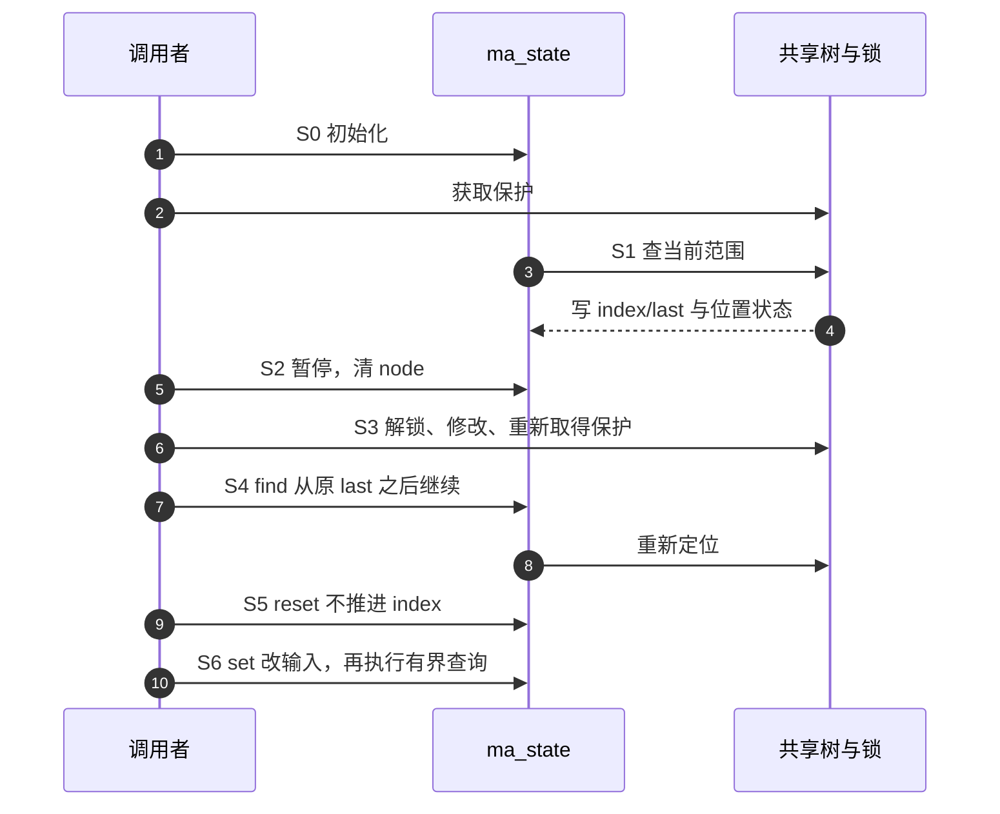

# 第6章\_操作游标与暂停继续

## 6.1\_状态属于当前操作

ma_state 的 tree 关联共享索引，index/last、位置字段和 status 属于当前操作，alloc 则记录其节点资源。它们是正交状态；不能只读一个枚举就断言位置或资源有效。知识模型与完整私有模块见[P39](../../../../knowledge/linux/data_structures/红黑树_rb-tree/P39_Maple操作游标的暂停与继续.md#39.3_沿S0到S6比较暂停与重置)，固定版本沿[总索引](P01_Linux_6.12_Maple范围源码阅读索引.md#1.1_从地址查询进入版本证据)。

## 6.2\_沿一次遍历追踪状态

| 阶段 | 参与函数与地址 | 唯一实现 |
| --- | --- | --- |
| S0 建立请求 | MA_STATE 初始化调用者变量，mas_init 则清零并设置输入 | [字段和初始化](../source_explanations/include/linux/maple_tree.h.md#1.10_操作状态与初始化) |
| S1 从根定位 | mas_start 读取共享根并写操作位置，mas_state_walk 选择内层路径，mas_walk 处理重走与根边界 | [根入口](../source_explanations/lib/maple_tree.c.md#1.7_从操作状态选择树入口)、[walk](../source_explanations/lib/maple_tree.c.md#1.8_从根定位与walk重走) |
| S2 暂停 | mas_pause 写 status/node，保留 index/last；锁仍由调用者释放 | [暂停](../source_explanations/lib/maple_tree.c.md#1.9_暂停继续与有界find) |
| S3 修改共享树 | 实验调用普通 store；内部树更新而旧游标位置失效 | 本模块不展开完整 store 算法 |
| S4 重新建立保护并继续 | mas_find_setup 检查上界、从上次 last+1 重走，mas_find 在需要时取后一个非空槽 | [有界 find](../source_explanations/lib/maple_tree.c.md#1.9_暂停继续与有界find) |
| S5 重置 | mas_reset 保留 index/last，只清位置入口与状态 | [重置](../source_explanations/include/linux/maple_tree.h.md#1.11_重置与重新指定范围) |
| S6 改请求与到达上界 | mas_set 重新指定输入；find 的早退或下一槽分支分别处理状态 | [范围设置](../source_explanations/include/linux/maple_tree.h.md#1.11_重置与重新指定范围) |

VMA 的[vma_iter_invalidate](../source_explanations/include/linux/mm.h.md#1.3_VMA游标失效调用暂停)只包装 mas_pause。暂停不是一个自动解锁操作；后续 API 如何解释 pause 才决定继续位置。reset 与 pause 保留相同的范围字段，并不因此具有相同的下一次查询行为。

该图描述私有模块中的顺序操作，不是完整并发内存模型。解锁期间的树可以变化，重新定位不保证跨修改的一致快照、固定对象列表或每对象恰好访问一次。

## 6.3\_不能由注释或返回空推断状态

固定 mas_walk 的条件使用 `!active || !start`，合法状态不能同时为 active 和 start，因此此处先转 start。mas_find 的下一槽分支在返回前设回 active；active 且 last 已到 max 的早退也可以返回 NULL 并保持 active。ma_error 在 setup 中早退，恢复仍由调用者处理。

普通 mtree_load 走的 mtree_lookup_walk 明确不维护完整游标状态；高级查询的 index/last 结果契约不能外推给它。P15 的八段 VMA 场景已保留查询结果对照，并撤去对快速点查 node/offset 的错误承诺。

十三函数和两枚举、状态结构、初始化宏按固定文件核对。私有模块通过 ARM 前端，348 个消费头文件的非生成部分与官方固定提交一致；宿主只执行固定控制函数，树行走明确使用范围模型，并检查四个 store 失败出口。未执行目标 Kbuild、MODPOST、装卸、RCU 或并发压力，不能称为完整 Maple 实验验证。
