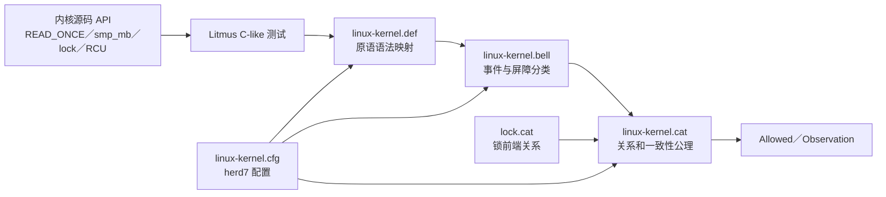

# 第1章\_Linux\_6.12\_LKMM\_源码与模型导读

## 1.1\_版本和研究边界

本章证据来自 NXP 官方 [`linux-imx`](https://github.com/nxp-imx/linux-imx) 仓库发布标签 `lf-6.12.20-2.0.0`、提交 `dfaf2136deb2af2e60b994421281ba42f1c087e0` 对应的 Linux 6.12.20。本地工作树位置不属于证据身份，统一来源和配置边界见 [Linux 源码阅读基线](../linux/SOURCE_BASELINE.md)。

保存文件保持原 Linux 相对路径，公共模型位于 `tools/memory-model/`。本章回答：Linux API 怎样进入 LKMM 事件，模型文件怎样组织关系和公理，herd7 怎样消费配置。跨版本稳定的机制结论仍由[Linux 内存顺序专题](../../../knowledge/linux/memory_ordering/大纲.md)维护。

## 1.2\_从源码接口到模型判定的完整链



每层职责独立：`.def` 不决定结果是否允许，`.bell` 不写完整一致性公理，`.cfg` 不包含模型本体。

## 1.3\_源码侧访问和屏障定义

### 1.3.1\_READ\_ONCE\_WRITE\_ONCE

[`include/asm-generic/rwonce.h`](../linux/include/asm-generic/rwonce.h) 定义 ONCE 的公共访问形态和大小检查。关键事实：

- `__READ_ONCE()` / `__WRITE_ONCE()` 通过 volatile 类型访问约束编译器；
- 外层宏执行 `compiletime_assert_rwonce_type()`；
- 接受 64 位大小不等于所有 32 位架构保证不撕裂；
- ONCE 的主要用途包括跨执行上下文通信和与显式顺序原语组合。

[`include/linux/compiler.h`](../linux/include/linux/compiler.h) 提供 `barrier()`、`data_race()` 等编译器层接口；[`include/linux/compiler_types.h`](../linux/include/linux/compiler_types.h) 提供类型和编译器属性基础。

### 1.3.2\_通用屏障

[`include/asm-generic/barrier.h`](../linux/include/asm-generic/barrier.h) 分为：

- `__smp_*` 的架构底层接口和缺省回退；
- 带 KCSAN hooks 的公共 `smp_*` 封装；
- `CONFIG_SMP=n` 时的编译器屏障退化；
- release/acquire、atomic 前后屏障和控制依赖补强接口。

公共回退用 `__smp_mb() + WRITE_ONCE()` 表达 store-release，用 `READ_ONCE() + __smp_mb()` 表达 load-acquire；架构可以覆盖为更精确实现。

### 1.3.3\_ARMv7\_映射

[`arch/arm/include/asm/barrier.h`](../linux/arch/arm/include/asm/barrier.h) 在 ARMv7 SMP 下定义：

```c
#define __smp_mb()  dmb(ish)
#define __smp_rmb() __smp_mb()
#define __smp_wmb() dmb(ishst)
```

并分别处理 `mb/rmb/wmb`、`dma_rmb/dma_wmb`、`CONFIG_ARM_HEAVY_MB` 等边界。知识正文只能把它写成“Linux 6.12.20 ARMv7 基线的具体映射”，不能外推到 ARM64、RISC-V 或 x86。

## 1.4\_linux\_kernel\_def\_把原语翻译成事件

[`linux-kernel.def`](../linux/tools/memory-model/linux-kernel.def) 使用 herd7 宏语法定义：

```text
READ_ONCE(X)              → once Load
WRITE_ONCE(X,V)           → once Store
smp_store_release(X,V)    → release Store
smp_load_acquire(X)       → acquire Load
smp_mb/rmb/wmb()          → 对应 fence
rcu_assign_pointer(X,V)   → release Store
rcu_dereference(X)        → once Load
```

同一文件还映射原子交换、锁、RCU/SRCU 等测试可用原语。这里表达“测试语法产生哪些事件标签”，不等价于实际 C 宏展开，也不模拟编译器汇编生成。

## 1.5\_linux\_kernel\_bell\_给事件分类

[`linux-kernel.bell`](../linux/tools/memory-model/linux-kernel.bell) 声明：

- Accesses：`once`、`release`、`acquire`、RMW 等类别；
- Barriers：`wmb/rmb/mb`、atomic 前后屏障、锁、RCU/SRCU 等；
- 指令类别与事件标记；
- RCU 读侧嵌套分析。

herd7 先根据这些分类识别哪些事件可以进入后续 `cat` 关系。若新 Linux API 未在 `.def/.bell` 中表达，Litmus 不能仅凭函数名称理解它。

## 1.6\_linux\_kernel\_cat\_怎样组织公理

[`linux-kernel.cat`](../linux/tools/memory-model/linux-kernel.cat) 包含或构造：

- 基础 `po/rf/co/fr` 及相关派生关系；
- acquire/release、fence、dependency、atomic 等顺序；
- happens-before（`hb`）；
- propagation（`prop`）与累积传播；
- RCU/SRCU 相关关系；
- coherence、atomic、hb、propagation、rcu 等一致性检查。

模型把“允许执行”定义为同时满足这些公理的关系图。研究时不要只查某个宏字符串，而要沿：事件标签 → 参与的关系 → 最终 acyclic/irreflexive 等约束追踪。

## 1.7\_lock\_cat\_为什么独立

[`lock.cat`](../linux/tools/memory-model/lock.cat) 为锁 acquisition/release 建立前端分析和匹配关系，并检查自死锁等问题。`linux-kernel.cat` include 它以获得锁相关执行关系。

锁不是简单 fence：模型需要识别哪次 acquire 与哪些 release 可能对应，以及互斥对读取来源和一致性序的约束。将锁在 Litmus 中替换成 `smp_mb()` 会验证一个不同程序。

## 1.8\_linux\_kernel\_cfg\_为什么要求正确工作目录

[`linux-kernel.cfg`](../linux/tools/memory-model/linux-kernel.cfg) 使用相对路径指定：

```text
macros linux-kernel.def
bell linux-kernel.bell
model linux-kernel.cat
```

因此从其他目录直接运行 herd7 时可能找不到 include。配套实验让 `cwd` 固定在模型目录，再传入 Litmus 的绝对路径：

```bash
cd research/source_reading/linux/tools/memory-model
herd7 -conf linux-kernel.cfg /absolute/path/to/test.litmus
```

## 1.9\_沿\_MP\_测试追踪一次判定

以实验中的 `MP+pooncerelease+poacquireonce.litmus` 为例：

1. `.def` 把 `WRITE_ONCE(buf)` 映射为 once Write；
2. 把 `smp_store_release(flag)` 映射为 release Write；
3. 把 `smp_load_acquire(flag)` 映射为 acquire Read；
4. `.bell` 给事件标记访问类别；
5. 寄存器条件选择 Rflag 从发布 Write 取值，Rbuf 从初始写取值；
6. `.cat` 组合 release/acquire、`po/rf/fr/co` 形成顺序环；
7. 坏结果违反模型约束，Observation 为 `Never`。

无序版本把两端换成 ONCE，关键 release/acquire 边消失，坏结果为 `Sometimes`。成对测试证明变化来自哪一类模型边。

## 1.10\_RCU\_模型能证明什么

LKMM 能把 RCU 读侧区间、`synchronize_rcu()`、指针发布/取得等纳入关系图。例如 `MP+onceassign+derefonce` 验证取得新 RCU 指针后不能看到对象初始化前的旧值。

但模型不会替真实代码验证：

- 指针是否在 RCU 读侧外逃逸；
- 回调是否在正确 GP 后执行；
- kref 与 root/子块所有权是否正确；
- 内存分配复用和所有错误路径；
- 当前 Tree RCU 实现的性能与进展性。

这些属于 [RCU 专题](../../../knowledge/linux/synchronization/rcu/大纲.md)和具体源码导读。

## 1.11\_官方文档证据

- [`Documentation/memory-barriers.txt`](../linux/Documentation/memory-barriers.txt)：Linux 屏障、依赖、锁、等待、I/O 和体系结构边界；
- [`Documentation/atomic_t.txt`](../linux/Documentation/atomic_t.txt)：atomic API、RMW、顺序后缀和失败路径；
- [`tools/memory-model/README`](../linux/tools/memory-model/README)：herd7/klitmus7 需求和基本运行方法；
- [`tools/memory-model/Documentation/simple.txt`](../linux/tools/memory-model/Documentation/simple.txt)：优先使用锁、per-CPU 和封装原语的工程路线；
- [`tools/memory-model/Documentation/litmus-tests.txt`](../linux/tools/memory-model/Documentation/litmus-tests.txt)：Litmus 语法、用法和限制。

## 1.12\_模型限制

Linux 6.12 Litmus 文档明确说明，工具不准确模拟任意编译器优化，不支持同一变量多访问宽度、通用异常/中断、MMIO/DMA、自修改代码、动态内存分配以及所有原子变体。

因此证据链必须组合：

```text
ONCE/屏障源码定义
→ 编译器反汇编
→ LKMM Litmus
→ 目标架构实现
→ 必要时 klitmus7/硬件运行
→ 真实子系统状态机与生命周期审查
```

## 1.13\_更新流程

升级 Linux 基线时：

1. 记录新版本和原始位置；
2. 比较 `rwonce.h`、通用/目标架构 barrier 定义；
3. 比较 `linux-kernel.def/.bell/.cat/.cfg/lock.cat`；
4. 阅读 model README 对 herdtools7 版本的新要求；
5. 重新运行配套 manifest 全部 Litmus；
6. 重新生成 GCC/Clang/ARM 反汇编记录；
7. 更新知识正文中的版本映射，但不把版本细节写成跨版本机制。

## 1.14\_配套入口

- [READ_ONCE 编译器访问实验](../../../labs/kernel/memory_ordering/P01_READ_ONCE_编译器访问实验/README.md)
- [访问宽度、对齐与 ARM 反汇编实验](../../../labs/foundations/computer_architecture/memory_ordering/P01_访问宽度_对齐与ARM反汇编/README.md)
- [LKMM Litmus 消息传递与屏障实验](../../../labs/kernel/memory_ordering/P02_LKMM_Litmus_消息传递与屏障/README.md)

## 1.15\_本章验收

1. 能说明 `.def/.bell/.cat/.cfg/lock.cat` 的独立职责。
2. 能从一个 Linux API 追到 Litmus 事件标签和模型关系。
3. 能解释为什么 cfg 需要模型目录作为工作目录。
4. 能沿 MP 成对测试解释 Sometimes→Never 的变化。
5. 能列出 LKMM 不建模的编译器、撕裂、I/O 和生命周期边界。
6. 能按版本升级流程重新核对源码、模型、工具和实验。
