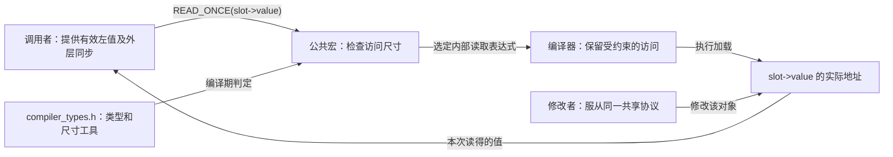
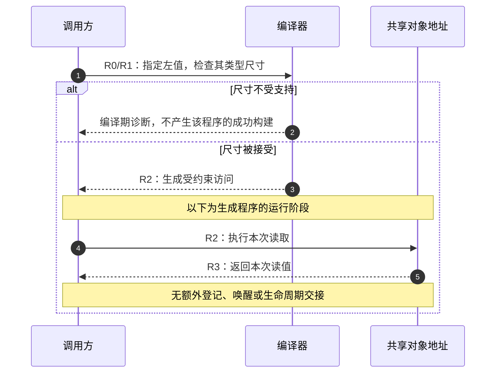

# 第2章\_单次访问与类型边界导读

## 2.1\_从一个读取现场进入头文件

在[编译器访问正文](../../../../knowledge/linux/synchronization_and_asynchrony/synchronization/memory_ordering/P02_编译器共享访问与READ_WRITE_ONCE.md#2.3.1_完整编译材料)中，我们已经看到：程序写了两个普通读取，编译器未必留下两次访问；给访问加上约束，也不会自动取得另一线程的所有更新。本章沿一个现场继续追问：内核执行 `value = READ_ONCE(slot->value)` 时，究竟检查什么类型，访问哪个地址，结果又带来哪些保证？

这里研究的是编译器接口模块。READ_ONCE没有等待者列表、版本计数器，也不会发通知。它把调用者指定的对象交给编译器，以特定的访问形态读取；是否可以在此时使用该地址、是否需要取得初始化顺序，仍由外层协议决定。读完后应能从一次公共调用追到类型检查和访问表达式，并说明为什么“编译成功”和“并发正确”是两件事。

版本为NXP官方linux-imx、标签lf-6.12.20-2.0.0、固定提交dfaf2136deb2af2e60b994421281ba42f1c087e0，Linux 6.12.20；见[总索引](P01_Linux_6.12_LKMM_源码与模型导读.md#1.1_版本和研究边界)。以下默认研究通用rwonce头文件。当前ARM树未提供自己的asm/rwonce.h，通用必选头清单包含rwonce.h；其他架构可能覆盖内部读取形式，不能从通用定义推断全部架构生成同一条指令。

## 2.2\_参与者并不是一套运行时状态机

先把编译期与运行期分开。类型判断发生在编译阶段，不会在每次读取前执行一个运行时大小分支。运行时共享状态仍是 `slot->value` 所在内存；宏没有另外分配一份“ONCE状态”。

例如 `slot` 是一根早已悬空的指针，尺寸检查仍可能完全通过。检查知道的是表达式类型，不知道内存已经被谁释放。又如两个参与者分别读取计数、加一、写回，ONCE可以保留各次访问，却没有把读—改—写组合为不可分割操作；二者仍可能读到同一旧值并覆盖彼此的加一。

## 2.3\_一条访问怎样闭合

用R0～R3标出同一个读取现场。它们是 **源码追踪阶段**，不是内核保存的四个状态值。

| 阶段 | 发生的动作 | 结果与后续责任 |
| --- | --- | --- |
| R0 | 调用方选定 `slot->value` 左值 | 地址有效性、对齐、存活期由调用方已有协议保证 |
| R1 | 编译器展开公共宏，按表达式类型检查尺寸 | 接受本机char/short/int/long的尺寸，另允许long long尺寸；不检查整个并发协议 |
| R2 | 内部表达式取对象地址，经const volatile类型指针读取 | volatile约束该次编译器访问；架构生成何种指令另查 |
| R3 | 读取结果交回调用方 | 得到的是一个值；没有自动获得对象引用或发布取得关系 |

写入沿同样的R0/R1准备路径进入受约束的存储。WRITE_ONCE的值参数是待写值，不是比较期望值；宏不检查当前值是否仍等于先前读取的值，因此不能替代cmpxchg。

不要把R1误读成“所有被接受尺寸都在所有CPU上原子”。固定源码明确允许32位机器上的64位访问，且指出某些组合仍可能分成两次32位访问。一个值可能通过大小门槛，却尚未获得不撕裂保证；是否存在对应单次原子机器访问，要继续结合目标架构、对齐及具体生成代码。

## 2.4\_三个近似名称为何不能互换

公共READ_ONCE先检查尺寸；内部__READ_ONCE省去了这层门槛。把调用名改短，不会让一个大结构体突然成为原子快照。若一次结构体读取拆成多个机器访问，修改者可在中间写入，所得字段可能来自不同轮次。解决方案应回到锁、序列计数器或不可变对象协议，而非绕过检查。

READ_ONCE_NOCHECK是另一类有意限制检查的接口：只接受一个unsigned long的大小，调用专门的辅助函数读取，再转回表达式类型。名称后缀NOCHECK表示这里有意抑制特定检测，不代表调用者可以忽略全部前提。其用途涉及栈回溯等特殊读取；是否抑制地址、竞态或未初始化检测，由辅助函数属性和构建分支共同决定。它不是“检查器没报告，所以这次读取安全”的捷径。

read_word_at_a_time更容易误判。KASAN（Kernel Address Sanitizer）是内核地址访问检测器。该函数先对起始地址显式做一字节的KASAN读取检查，再执行普通unsigned long读取。被显式检查的大小与实际读取大小不同，而且普通读取没有ONCE的volatile访问形态。这个函数服务于特定按字处理路径；不能把它当成通用共享变量轮询，也不能据此任意越过对象边界或映射边界。

这些特殊入口没有把高频通知换成后台通信，因为普通ONCE本来就没有通知协议。被省去的是尺寸门槛或某些检测插桩，不是远端CPU的参与责任；共享协议所需的锁、屏障、依赖、引用和退出同步依然由调用者建立。

## 2.5\_按问题进入唯一实现

实现讲解按上游文件位置保存，以下每一组只在一个标题下展开：

| 当前问题 | 唯一实现入口 |
| --- | --- |
| 类型怎样去除限定，尺寸如何通过门槛 | [类型工具与尺寸检查](../source_explanations/include/asm-generic/rwonce.h.md#1.2_类型工具与尺寸门槛) |
| 公共读取如何交给内部访问表达式 | [READ_ONCE与内部读取](../source_explanations/include/asm-generic/rwonce.h.md#1.3_READ_ONCE与内部读取) |
| 写入为什么不是条件更新 | [WRITE_ONCE与内部写入](../source_explanations/include/asm-generic/rwonce.h.md#1.4_WRITE_ONCE与内部写入) |
| NOCHECK究竟改变了什么 | [机器字读取与检测边界](../source_explanations/include/asm-generic/rwonce.h.md#1.5_机器字读取与检测边界) |
| 按字读取为什么只显式检查一字节 | [read_word_at_a_time](../source_explanations/include/asm-generic/rwonce.h.md#1.6_read_word_at_a_time的检查尺寸) |

对照正文已有的完整七函数C材料，先预测普通双读和受约束双读的汇编差异，再进入类型与访问表达式。该材料用于编译器观察；GNU C宏、Linux并发契约与标准C/C++线程模型仍需分开，不能把共享普通变量加volatile直接拿来替代标准原子线程同步。

## 2.6\_带着边界继续读屏障

现在已经找到对象地址和访问形态，仍不能推出“读到flag以后必然看见先前初始化的全部字段”。这是顺序关系的问题，继续读[SMP屏障配置模块](P03_SMP屏障的配置与调用层次.md#3.1_同一个调用为什么走两条路径)，再由总索引进入发布取得等相邻原语。

先自己回答三问：12字节结构体应通过当前公共尺寸门槛吗？64位类型通过32位目标的门槛后，能否直接宣布无撕裂？把READ_ONCE改成NOCHECK能否解决悬空指针？前两问分别检查接口接纳范围与机器访问保证，第三问检查对象寿命；答案依次为不能、不能、不能，理由属于三个不同层次。
