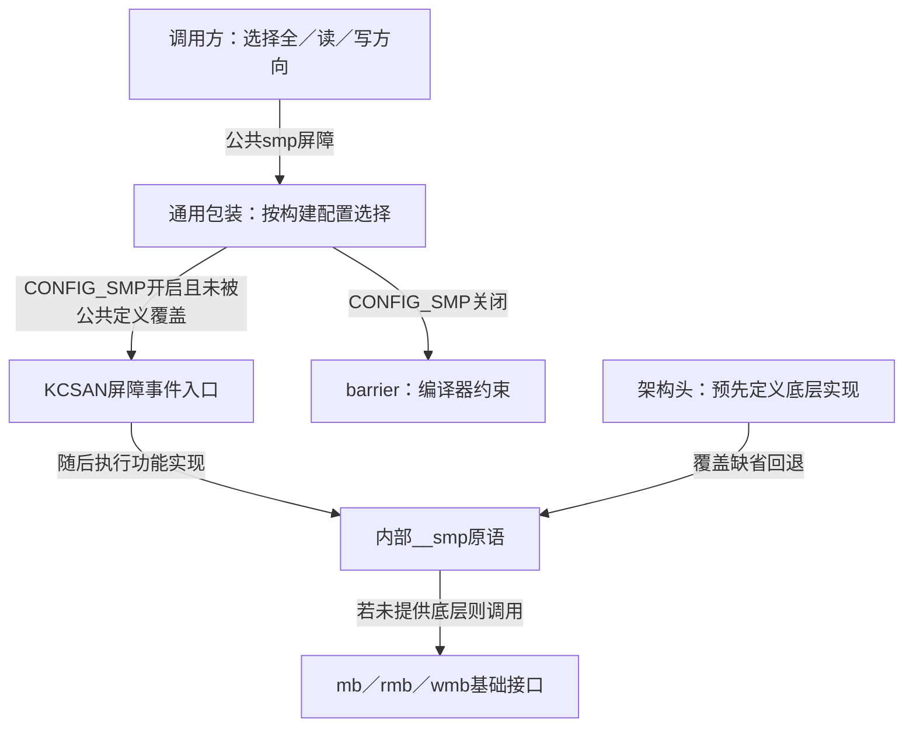
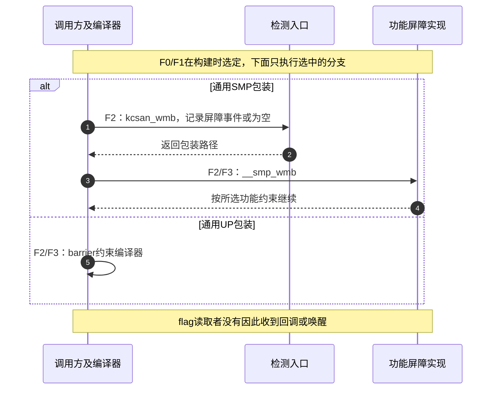

# 第3章\_SMP屏障的配置与调用层次

## 3.1\_同一个调用为什么走两条路径

上一模块已经说明ONCE保留指定对象的访问，却不自动排列周围的全部访问。[屏障方向正文](../../../../knowledge/linux/synchronization_and_asynchrony/synchronization/memory_ordering/P03_Linux_SMP屏障与顺序域.md#3.1_先按同步域分类)进一步建立了需要什么顺序。现在打开通用头文件，读者会发现内部__smp_mb存在，公共smp_mb却可能只剩编译器屏障：这不是把同一个实现写错两遍，而是两层接口承担不同的配置选择。

本章只追踪公共smp_mb、smp_rmb、smp_wmb三种屏障，回答谁选分支、检查器怎样接入、实际约束交给谁。发布取得、条件等待、原子操作辅助屏障和设备I/O不在本模块展开；它们不能仅靠替换一个函数名推导出来。

源码固定为NXP官方linux-imx的dfaf2136deb2af2e60b994421281ba42f1c087e0，发布标签lf-6.12.20-2.0.0，Linux 6.12.20，入口见[总索引](P01_Linux_6.12_LKMM_源码与模型导读.md#1.3.2_通用屏障)。默认先沿通用SMP分支阅读：CONFIG_SMP是构建时是否启用对称多处理（Symmetric Multiprocessing）的配置开关。当前目标实际没有启用它，随后再比较UP（Uniprocessor，单处理器）分支；不能把下文SMP路径记成当前目标已运行。

## 3.2\_把功能动作与检查记录分开

设线程在flag写入前需要排好数据写入，它调用的是公共屏障；检查器可能记录这里发生了顺序约束，硬件实际需要的动作则来自底层实现。这是两条职责，不能用其中一条代替另一条。

KCSAN（Kernel Concurrency Sanitizer）是内核并发访问检测器。这里的kcsan_mb/rmb/wmb是告知检查器屏障事件的接口，不是向业务消费者发送“数据准备好”通知。它们是否产生检测动作，要看弱内存检查及插桩配置；即使退为空，所需的功能屏障也不能随之删除。

屏障本身没有一个共享“完成位”。软件层面处理的是编译器对访问的安排和目标指令要求的顺序，参与线程仍靠原来的flag等业务地址通信。图中的KCSAN入口操作检测侧状态，而不是给flag的消费者唤醒；本模块不把检测器内部状态误列为功能协议的组成部分。

## 3.3\_一次公共屏障的路径

下面用F0～F3追踪一条smp_wmb调用。这是编译选择与生成程序的执行路径，不是保存于内核对象中的状态机。

| 阶段 | 负责者与动作 | 下一步依据 |
| --- | --- | --- |
| F0 | 架构头可先定义公共或内部原语 | 通用头的ifndef仅补足尚未定义的接口 |
| F1 | 预处理器依据CONFIG_SMP选择公共实现 | SMP进入检测入口加内部原语，UP选择编译器屏障 |
| F2 | 生成程序在调用位置执行所选包装 | SMP按程序顺序先到kcsan_wmb，再到__smp_wmb |
| F3 | 底层约束兑现后沿本线程后续代码继续 | 没有通用消费者确认、对象引用或业务完成回报 |

完整定义在[三种公共SMP屏障的唯一实现](../source_explanations/include/asm-generic/barrier.h.md#1.3_三种公共SMP屏障的配置分支)。mb、rmb、wmb分别表达全方向、读方向和写方向的约束；具体可排列的访问组合仍按正文契约，不因为某个架构把读屏障实现得更强，就把所有调用都改成读屏障。

## 3.4\_UP为什么不能删掉全部屏障

UP分支减少的是本机多个处理器之间的顺序需求；编译器仍可能重排或合并不同位置的普通访问，所以公共SMP接口保留barrier。该定义用带memory clobber的空汇编约束编译器，空字符串并不表示整个程序中的访问顺序毫无要求。

但设备不是另一个需要CONFIG_SMP才存在的内核CPU。单处理器也可以与DMA设备并行，MMIO还可能有缓冲和总线约束。因此通用头没有把mb、dma_wmb等接口全部归入这条UP退化路径；本机UP也不能证明所有外部参与者都是单线程。虚拟机与多处理器宿主通信时另有virt接口，同样不能只看客体CPU个数。

ARM头中的内部__smp_mb定义存在，与当前公共smp_mb是否选择它是两回事。只有沿F0/F1看完公共入口，才能判断一条调用走到哪里。这里没有执行ARM指令，也没有据宿主预处理结果证明目标硬件顺序。

## 3.5\_把配置比较变成可检验问题

先对同一份宏定义作三种预测：关闭CONFIG_SMP时，公共三屏障是否还经过kcsan入口？打开后，检测入口与功能屏障谁在前？若架构已经定义公共smp_mb，通用头是否再次套一层检测包装？

按代码分别得到“不经过这组SMP包装里的检测入口”“检测入口在前”“不会再次定义”。最后一问尤其重要：通用包装只能说明使用该包装的架构，不能替所有覆盖实现宣称同一插桩路径。改变配置时，应比较实际预处理结果和目标实现，而不是从符号名字猜测。

三种屏障的方向选择已在知识正文由完整C方向模型说明；该模型只模拟所声明的规则，不执行这些宏。现在能追踪公共包装，并未证明发布取得或原子操作强化路径；继续从[总索引](P01_Linux_6.12_LKMM_源码与模型导读.md#1.3.2_通用屏障)查相邻入口。
