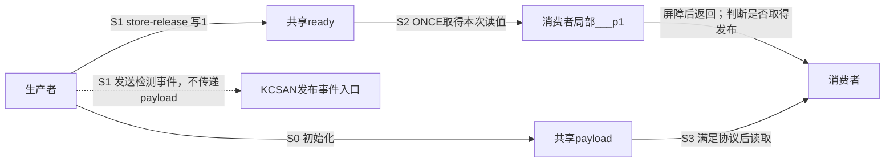
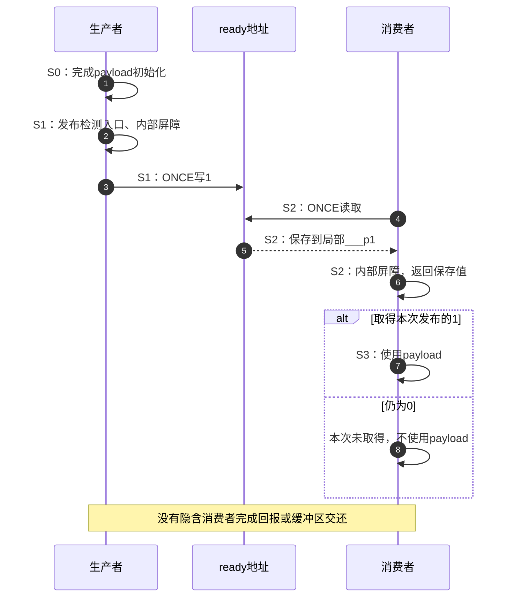

# 第4章\_发布取得的访问与配置导读

## 4.1\_把屏障绑定到一次访问

上一模块找到了公共SMP屏障的配置选择。现在回到[发布协议正文](../../../../knowledge/linux/synchronization_and_asynchrony/synchronization/memory_ordering/P04_release_acquire_发布协议.md#4.1_从裸标志改造成有状态的交付协议)：生产者先写payload，再向ready写1；消费者读到这次ready=1后才使用payload。只有一名生产者，载荷只写一次，双方退出前对象不回收。这些已经建立的前提不因换一个宏而消失。

接下来追踪的不是“再放一条屏障”，而是顺序怎样与发布位置的那次读写绑定。通用store-release把屏障放在写前，通用load-acquire先取值再执行屏障；读出的值必须保存到局部对象，不能执行完屏障后再任意重读一个新值。

本章固定NXP官方linux-imx发布标签lf-6.12.20-2.0.0、提交dfaf2136deb2af2e60b994421281ba42f1c087e0，Linux 6.12.20，见[总索引](P01_Linux_6.12_LKMM_源码与模型导读.md#1.3.2_通用屏障)。先追通用SMP内部回退，再比较公共包装与UP分支；架构覆盖时必须重新读取对应实现。当前目标仍为UP，下面两CPU协议是所研究的SMP契约，不是当前目标执行记录。

## 4.2\_状态仍在业务对象中

生产者写payload和ready，消费者读ready并在协议允许时读payload。编译器展开的宏没有创建额外的发布对象，也没有把payload复制到检查器中。load-acquire里的局部___p1只保存一次读取结果；它属于该次调用展开，不是多个CPU共同维护的确认位。

KCSAN是前一模块已介绍的内核并发检测器。生产者的公共包装进入kcsan_release，记录发布侧事件后继续功能路径；虚线把检测事件与共享业务地址的读写分开。消费者没有一个对称的通用kcsan_acquire调用，不能为了图形对称而虚构它。

## 4.3\_让实现回到同一组S阶段

继续沿用知识正文的S0～S3，避免把同一个发布过程画成另一套无法对照的状态机。

| 阶段 | 通用SMP回退中的动作 | 状态地址与下一位读取者 |
| --- | --- | --- |
| S0 准备 | 调用方完成载荷写入，取得发布资格 | payload仍由协议限制访问 |
| S1 发布 | 公共包装进入kcsan_release，内部先检查类型，再执行__smp_mb与ONCE写 | ready被写为1，供消费者读取；类型断言发生于编译期 |
| S2 取得 | ONCE读ready到局部___p1，编译期检查类型，运行时执行__smp_mb并返回已保存值 | 消费者依据该值决定是否消费，不发生第二次ready读取 |
| S3 消费 | 调用方仅在取得协议认可的值后访问payload | 此后是否允许复用或回收，仍取决于外层协议 |

这条时间线解释一次成功取得，不保证第一次读一定成功。acquire不是等待接口，读0时也会返回；若调用方需要等待、超时或取消，应另建对应协议。若相同值被多次写入，不能只看“读到1”就辨认任意代际，本章的一次发布前提正是为了先排除该歧义。

## 4.4\_同名公共接口的两组实现

SMP公共store-release先进入发布检测入口，再调用内部实现；公共load-acquire直接调用内部实现。底层使用__smp_mb，不是再次调用带公共包装的smp_mb；因此不能按“源码出现全屏障”就补出两侧相同的检测调用序列。

UP公共分支则直接使用“barrier后ONCE写”和“ONCE读后barrier”。编译器约束仍保持所需方向，但不经过本节的SMP内部回退；这也解释了为什么不能把“内部函数存在”当成“当前公共调用执行它”。唯一代码见[发布取得的公共配置分支](../source_explanations/include/asm-generic/barrier.h.md#1.7_发布取得的公共配置分支)。

尺寸门槛还有一个容易漏掉的差别。SMP内部回退调用compiletime_assert_atomic_type，只接纳__native_word认可的尺寸；UP公共分支没有这一条额外断言，仍受READ_ONCE/WRITE_ONCE自己的尺寸门槛限制。后者还允许long long大小。因而在long为4字节的构建中，一个8字节访问可能在UP路径被接纳、在SMP通用回退被拒绝。编译成功不能用来证明将来切换SMP后的可用性，更不能推出目标架构上无撕裂。

## 4.5\_检查调用现场而非只背宏体

先在进入store-release之前完成payload准备，再把已确定的发布值交给宏。通用回退把值参数放在屏障后的赋值表达式里；它不是一个承诺先求完所有实参再执行函数体的普通C函数。不要把准备载荷藏在值参数的带副作用求值中，再把它误算成位于该屏障之前的S0。

继续检查三件事：返回的是一次读值还是重新取值？类型断言是否随配置变化？这次取得是否包含缓冲区复用资格？本实现依次回答“保存的那次读值”“是，公共路径不同”“不包含”。前两问由[内部回退](../source_explanations/include/asm-generic/barrier.h.md#1.6_发布取得的内部回退)核对，最后一问回到知识正文的完整单槽交还程序。

现在可以从公共调用追到原对象的一次读写，并说明编译、检测和业务协议各承担哪项责任。store_mb与原子操作前后强化还涉及不同方向和作用范围，继续从[总索引](P01_Linux_6.12_LKMM_源码与模型导读.md#1.3.2_通用屏障)进入，不能把它们一概视为release的别名。
