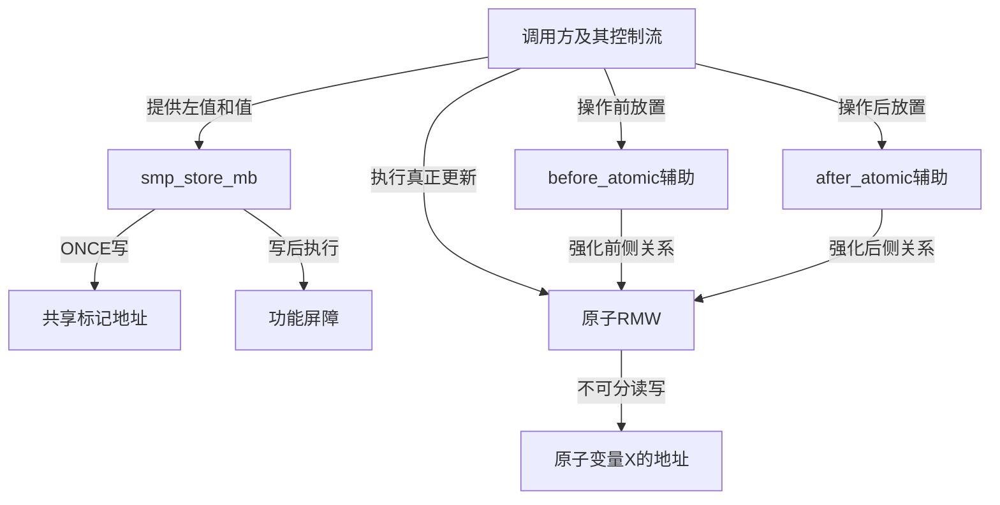
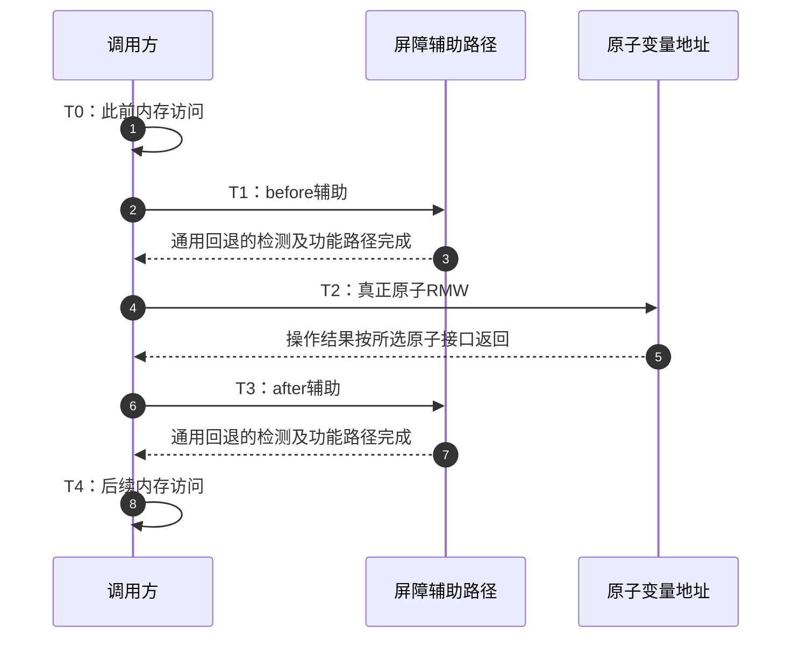

# 第5章\_存储后屏障与原子强化导读

## 5.1\_屏障位于写前还是写后

上一模块闭合了一次发布取得。现在遇到smp_store_mb，它的名字里同样有store，却不能直接替换store-release。发布回退是“内部屏障→写发布位置”，存储后屏障回退是“写指定位置→内部屏障”。它们把屏障放在不同一侧，解决的顺序问题也不同。

设一段双CPU协议要求本CPU先标记自己正在参与，再读取对方状态。只把自己的标记写成release，主要约束的是更早的访问到这次写，不能据此建立这次写到后续读取的全方向约束；smp_store_mb把本次写放到后面的全屏障之前，才与这个局部需求相符。另一CPU仍须有匹配的协议，单侧调用不等于整个双方算法已经正确。

同样，非返回值的原子更新可以保证读—改—写不可分，却未必为旁边普通访问提供所需顺序；本章再追踪两个atomic前后强化接口。本章承接[原子顺序正文](../../../../knowledge/linux/synchronization_and_asynchrony/synchronization/memory_ordering/P06_原子RMW_顺序后缀与条件成功.md#6.8_before_after_atomic_屏障只补缺的一侧)，固定证据仍为NXP官方dfaf2136deb2af2e60b994421281ba42f1c087e0、lf-6.12.20-2.0.0、Linux 6.12.20，见[总索引](P01_Linux_6.12_LKMM_源码与模型导读.md#1.3.2_通用屏障)。

## 5.2\_三个入口各自接在哪里

仍先沿SMP通用回退，再比较UP分支；当前目标是UP，不把研究中的两CPU契约写成已经运行的实验。

smp_store_mb接收对象左值和写值，在一个调用内包含那次ONCE写。两个atomic辅助屏障则没有对象参数，它们自己不读取、增加或比较原子变量；调用者必须把它们放在合适的原子读—改—写操作旁边。RMW（Read-Modify-Write）在此指一次不可分的读—改—写，不能拿atomic_read或atomic_set这样的单独访问代替。

图中两个强化箭头表达调用者建立的顺序关系，不表示辅助宏回调RMW。辅助宏没有保存“下一次原子操作地址”，也没有在运行时寻找与自己配对的操作。正因为配对属于源码位置和契约，随意在二者之间插入访问会改变可证明的范围。

## 5.3\_按一条原子操作周期阅读

选择“先访问普通内存，再做relaxed原子RMW，最后继续访问”的场景。T0～T4标注的是调用者的一段操作周期；只有业务地址和原子变量保存功能状态，阶段号不进入内核字段。

| 阶段 | 执行动作 | 通用SMP回退的责任 |
| --- | --- | --- |
| T0 | 调用方执行此前的内存访问 | 这些访问需要位于before辅助之前 |
| T1 | smp_mb__before_atomic | 公共检测入口后进入内部全屏障回退 |
| T2 | 调用方执行原子RMW | 原子操作自身负责不可分更新；辅助宏不替它执行 |
| T3 | smp_mb__after_atomic | 公共检测入口后进入内部全屏障回退 |
| T4 | 调用方执行后续内存访问 | 这些访问需要位于after辅助之后 |

固定atomic_t文档规定：before辅助把它之前的访问排在RMW本身及RMW之后的访问之前；after辅助把它之后的访问排在RMW本身及RMW之前的访问之后。**辅助与RMW之间夹入的访问不在相应保证内**，所以建议紧邻放置。具体声明见[原始atomic_t文档](../../linux/Documentation/atomic_t.txt)，实现见[唯一辅助包装](../source_explanations/include/asm-generic/barrier.h.md#1.10_存储后屏障与atomic辅助的公共路径)。

例如T1后、T2前新插入一次普通写，不能因为通用回退恰好执行了全屏障，就把这次写也算作before辅助已约束的“此前访问”。架构优化后辅助可能为空，而真正顺序由RMW指令承担；代码应遵循接口契约，不能依赖某次展开偶然更强。

## 5.4\_空辅助为什么不等于无顺序

通用内部before/after回退都调用__smp_mb；架构若已有足够强的原子操作，可以覆盖辅助实现，避免重复付出屏障成本。被省去的工作由原子实现已提供的顺序承担，不是由另一个CPU发来确认，更不是某种后台轮询。

因此不能把辅助单独当作任意位置的全屏障使用。它需要与适用的RMW构成整体；也不能把它简化为release或acquire的别名，固定文档明确给出更强的排序范围。若一次操作本来就有合适的完整顺序，直接使用对应原子接口通常比手工拼三段更清楚，具体性能仍由实现与负载决定。

当前UP公共分支对smp_store_mb采用“ONCE写→barrier”，两个辅助退为barrier；不进入SMP内部回退。该配置下的日志只能确认调用路径，不能验证真正跨CPU约束，也不能把原子变量的值变化当作其他对象的生命期保护。

## 5.5\_用三个反例检查边界

若想发布此前payload，能否把store-release机械换成store_mb？不能；两者屏障位置相反，不能直接保留原证明。若想让atomic_set更强，能否在旁边放before_atomic就结束？不能；该辅助的契约针对RMW。若在before辅助与RMW之间加一条写，能否把它算作已受前侧约束？仍不能；它落在文档明确排除的间隙。

这三问分别检验方向、适用操作和覆盖范围。回看[内部回退](../source_explanations/include/asm-generic/barrier.h.md#1.9_存储后屏障与atomic辅助的内部回退)再核对[公共配置](../source_explanations/include/asm-generic/barrier.h.md#1.10_存储后屏障与atomic辅助的公共路径)，可以解释代码为什么这么展开；真正选择原子接口时仍应回到知识正文的应用契约。下一步的[条件加载](P06_条件加载与控制依赖导读.md#6.1_一次取得还不能等待条件成立)涉及轮询与控制依赖，不能从本章屏障位置直接推出等待行为。
