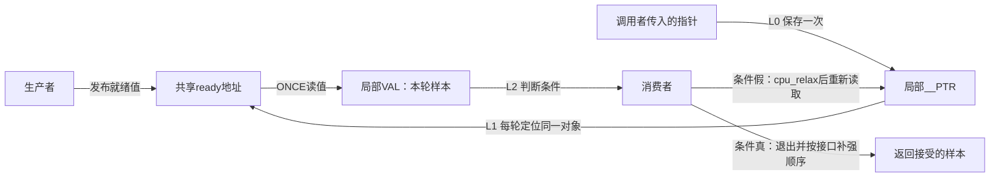
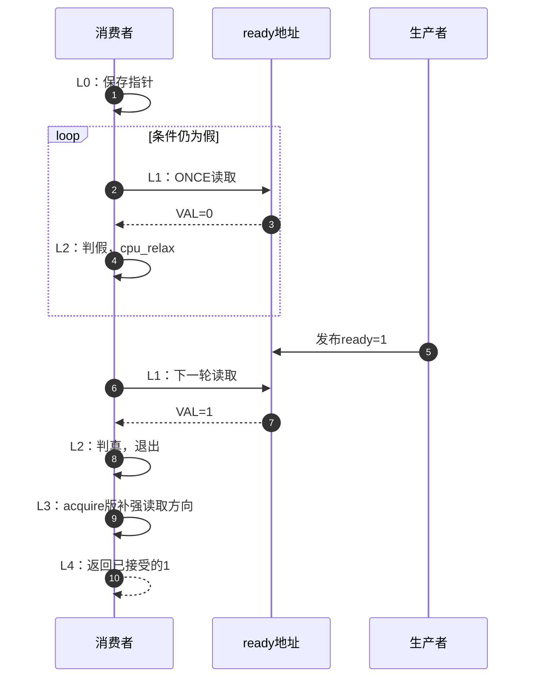

# 第6章\_条件加载与控制依赖导读

## 6.1\_一次取得还不能等待条件成立

前面已经追踪load-acquire：它读取并返回一个值，即使值仍为0也会返回。若调用者确实需要等待ready变为1，就还缺少“重新读取并判断”的控制流。本章研究通用条件加载宏怎样完成这个循环，以及取得版为何把顺序补强放在退出循环之后。

先保持一次发布的前提：生产者准备payload，再发布ready；消费者只有在取得对应发布后才使用payload；对象在双方退出以前保持有效。这里的等待采用主动轮询，没有睡眠队列、唤醒回调或超时参数。选择这种接口已经意味着调用方必须评估等待长度、生产者能否前进以及对象生命期。

源码来自NXP官方linux-imx固定提交dfaf2136deb2af2e60b994421281ba42f1c087e0、标签lf-6.12.20-2.0.0、Linux 6.12.20，入口见[总索引](P01_Linux_6.12_LKMM_源码与模型导读.md#1.3.2_通用屏障)。默认沿通用实现，架构覆盖不能从这段代码直接推断；当前目标UP配置也不等于本章两CPU协议已经实际运行。

## 6.2\_把共享位置与局部样本分开

smp_cond_load_relaxed接收指针和条件表达式。调用开始时把指针保存到局部__PTR；循环从这个固定地址读取，把本轮结果放入局部VAL，再让条件表达式检查VAL。调用者通常写 `VAL == 1`，这个名字由宏提供，不是某个全局变量。

生产者不会收到“我正在等”的登记。消费者靠主动读取共享地址获得进展信息，cpu_relax也不负责替它通知生产者。原子性、顺序与等待是不同问题：relaxed循环保留每轮ONCE访问，却不自行赋予退出后的载荷读取acquire保证。

## 6.3\_一轮轮询与一次成功退出

| 阶段 | 谁做什么 | 状态与转移 |
| --- | --- | --- |
| L0 | 消费者保存传入指针 | __PTR在这次调用内指向同一等待对象 |
| L1 | 消费者ONCE读目标 | 本轮VAL被更新为读值 |
| L2 | 消费者用VAL判定条件 | 假则cpu_relax后回L1；真则退出循环 |
| L3 | acquire版执行控制依赖后的补强 | 通用回退为smp_rmb；relaxed版没有此步 |
| L4 | 返回接受的样本 | acquire版保存到_val后返回，不重读目标 |

如果入口时条件已经满足，只发生一次读取，没有cpu_relax，取得版仍执行L3。如果条件一直不满足，宏本身不会到达L3/L4。它没有内置次数上限、时钟判断或取消路径，不能把多次未变化解释成会自动超时。

## 6.4\_为何退出后还需要补强

[控制依赖正文](../../../../knowledge/linux/synchronization_and_asynchrony/synchronization/memory_ordering/P05_数据依赖_控制依赖与RCU取得.md#5.5_控制依赖为什么不能排序任意后续_Load)已经区分“读→受条件控制的写”与“读→后续读”。条件退出可以贡献前一种关系，却不能单独排列所有后续读取。通用smp_acquire__after_ctrl_dep补上读方向，使已成立的控制依赖与补强合起来满足取得要求。

该辅助自己不读取ready，也不制造条件分支。调用方必须让退出依赖目标读值；不能把恒真条件或无关对象状态当作已经证明的控制依赖。优先把判定写成VAL上的简单条件，避免把额外读写副作用藏入每轮都会执行的表达式。完整实现见[条件加载唯一讲解](../source_explanations/include/asm-generic/barrier.h.md#1.12_条件加载与控制依赖补强)。

cpu_relax也不能替代L3。固定ARM实现通常映射为编译器barrier，ARMv6或相应勘误配置另有屏障及nop序列；都不能仅凭名称理解成让任务睡眠。当前章节不据宿主循环记录证明ARM指令效果。

## 6.5\_进展与退出仍由调用者负责

设消费者持有生产者必须取得的锁，再一直等生产者把ready写1：循环再规范也没有人能够修改该地址。失败原因不是漏了一条读屏障，而是等待方阻止了条件成立。关中断、抢占限制和相同执行上下文也应分别检查，不能假设生产者总能并行推进。

同样，等待期间不能让ready对象被回收。宏没有取得引用，也没有在退出后归还引用；长期等待是否合适、何时换成可睡眠等待、如何取消，属于外层协议。仅当生产者和消费者的前提都成立时，L0～L4才是一条有意义的成功路径。

用样本序列0、0、1做预测：通用relaxed版读三次、放松两次；acquire版还在退出后补强一次。把第三个样本也改为0不会产生“失败返回值”，只会继续循环。这些预测可检验展开路径，但不能代替Linux内存模型或真实调度进展验证。

下一步进入[ARM配置边界](P07_ARM屏障与配置边界导读.md#7.1_单核为什么仍需要设备方向的顺序)，核对公共屏障在当前架构具体采用什么动作。
