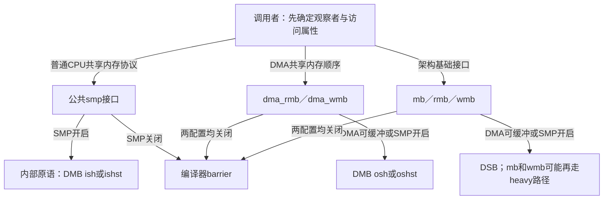
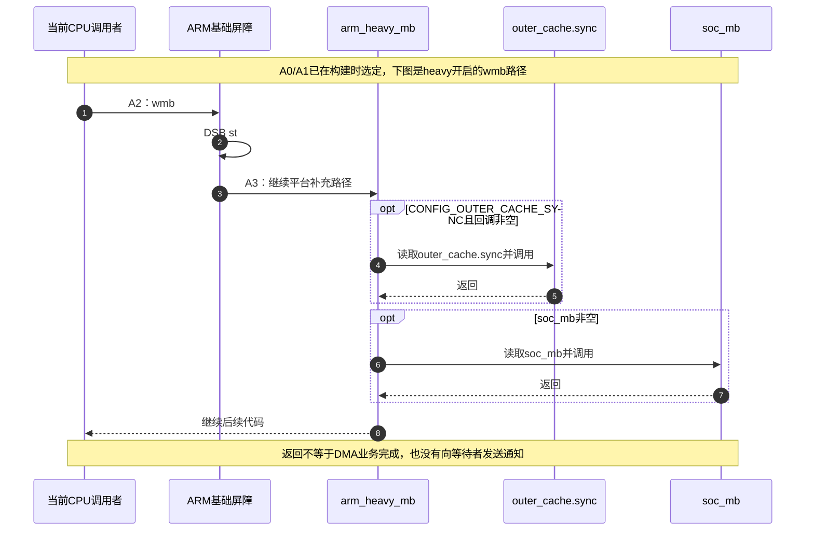

# 第7章\_ARM屏障与配置边界导读

## 7.1\_单核为什么仍需要设备方向的顺序

[公共包装模块](P03_SMP屏障的配置与调用层次.md#3.4_UP为什么不能删掉全部屏障)已经说明，关闭CONFIG_SMP时，公共smp屏障可以只保留编译器约束。现在设单核CPU先准备一个DMA描述符，再交给设备处理。CPU只有一个，设备却可以独立读取内存；删除第二个CPU并没有删除这个观察者。要理解实际生成什么指令，必须分别跟踪公共SMP接口、架构基础接口和DMA接口。

本章固定NXP官方linux-imx提交dfaf2136deb2af2e60b994421281ba42f1c087e0，Linux 6.12.20，只展开ARMv7映射。版本入口见[总索引](P01_Linux_6.12_LKMM_源码与模型导读.md#1.3.3_ARMv7_映射)。ARM是体系结构家族，ARMv7是本次指令分支；i.MX6ULL是目标SoC，不能把它们当作同一级产品分类，也不能把下述映射推广到ARM64。

CONFIG_SMP决定公共smp包装是否采用处理器间屏障；CONFIG_ARM_DMA_MEM_BUFFERABLE参与基础和DMA屏障的选择；CONFIG_ARM_HEAVY_MB再决定某些基础屏障是否调用平台补充路径。这是三条配置轴，不是三种可任选的“屏障等级”。当前工作树配置为UP、ARM_DMA_MEM_BUFFERABLE=y、ARM_HEAVY_MB=y；它是读取到的配置快照，不是固定提交天然附带的唯一配置，更不是板上执行记录。

## 7.2\_先分清指令方向和观察范围

DMB（Data Memory Barrier）用于建立架构规定的内存访问顺序；DSB（Data Synchronization Barrier）还涉及所选范围内访问的完成要求。这里的完成是架构层含义，不能读成设备已经完成了一项业务。DMA缓冲区所有权、缓存维护和设备完成通知仍由各自协议负责。

ARM指令的选项同时影响范围与方向。ish表示内部可共享域，osh表示外部可共享域，后缀st选择写方向。域是系统内存属性和互连配置下的架构范围，不是根据“内”“外”两个中文字就能画出的芯片边界。固定源码把SMP内部原语映射到ish/ishst，把DMA读写接口映射到osh/oshst；这说明两类接口表达的观察关系不同，不意味着调用dma_wmb就完成了DMA映射或数据搬运。



图中没有消费者应答箭头：屏障不向另一个线程或设备发送业务消息。业务状态仍放在描述符、标志或设备寄存器中；调用者必须使用适合该地址类型的访问接口。MMIO accessor不能用普通指针写加一条屏障随意替代。

## 7.3\_沿一条调用走完配置与运行路径

沿用F0～F3公共包装阶段，并把本章的架构落点记为A0～A3。它们是阅读与执行阶段，不是一个新建的内核共享状态机。

| 阶段 | 动作与负责者 | 形成的结果 |
| --- | --- | --- |
| A0，对应F0 | 预处理ARM头，定义内部SMP和基础/DMA接口，再包含通用头 | 通用头只补足未定义入口 |
| A1，对应F1 | 预处理器分别读取三条配置轴 | 为当前编译单元选择实际宏展开 |
| A2，对应F2 | 调用位置执行所选指令或编译器屏障 | 屏障不另建描述符，不写业务完成位 |
| A3，对应F3 | 若基础接口选中heavy路径，在DSB后调用arm_heavy_mb | 条件调用已安装的平台回调，然后继续本调用者 |

当前配置下，smp_wmb退为barrier；dma_wmb选择DMB oshst；wmb选择DSB st加heavy调用。三条结论可以同时成立。rmb采用DSB，但没有走同一个heavy包装，不能因为它也叫屏障就补画一个不存在的回调。

heavy函数还有CONFIG_OUTER_CACHE_SYNC构建开关，决定是否包含外部缓存同步钩子。这个开关与回调指针是否非空是两道不同条件：代码被编入，不等于平台一定安装了回调。



宏的唯一实现见[ARM映射](../source_explanations/arch/arm/include/asm/barrier.h.md#1.2_基础与DMA接口的配置选择)；回调次序和地址见[flush.c实现](../source_explanations/arch/arm/mm/flush.c.md#1.1_DSB之后还有什么)。outer_cache.sync是外部缓存操作表中的函数指针，soc_mb是全局函数指针；该函数读取它们，不负责注册、并发更换或等待回调出现。固定树中平台初始化可能安装soc_mb，但不能从通用声明断定当前i.MX目标已经安装某个其他SoC的回调。

## 7.4\_用同一调用示例比较配置

先预测下面三行生成什么，再查看目标汇编：

```c
/* 独立检查映射的三个调用点，不是完整DMA驱动协议。 */
void cpu_order(void) { smp_wmb(); }
void dma_order(void) { dma_wmb(); }
void platform_order(void) { wmb(); }
```

| 配置 | cpu_order | dma_order | platform_order |
| --- | --- | --- | --- |
| SMP=n，DMA可缓冲=n | 编译器约束 | 编译器约束 | 编译器约束 |
| SMP=n，DMA可缓冲=y，heavy=n | 编译器约束 | DMB oshst | DSB st |
| SMP=n，DMA可缓冲=y，heavy=y | 编译器约束 | DMB oshst | DSB st后调用heavy函数 |
| SMP=y，heavy=n | DMB ishst，公共包装另有检测入口 | DMB oshst | DSB st |

这里的检测入口是否产生代码还受KCSAN配置影响。本批用固定头与中文注释节选分别做ARMv7交叉编译，检测依赖在夹具中置空；汇编检查只验证选择和指令序列。它不证明一块开发板的缓存属性、外设连接、回调安装状态或硬件顺序。

练习一：保持UP，仅打开DMA可缓冲选项，为什么三个函数里只有后两个改变？因为两个配置条件来自不同接口族，而不是编译器突然发现第二个CPU。练习二：打开heavy后，为什么dma_order仍没有heavy调用？因为它直接使用DMB，不经过__arm_heavy_mb。练习三：见到DSB返回就释放DMA缓冲区，缺了什么？缺设备完成与所有权归还证据，指令不能替业务协议生成这些证据。

现在已经能从公共名字走到这个ARMv7分支的实际动作。下一步回到[模型入口](P01_Linux_6.12_LKMM_源码与模型导读.md#1.4_linux_kernel_def_把原语翻译成事件)，区分LKMM事件标签与这些真实指令；模型里的一条fence不等于逐条执行了本章汇编。
