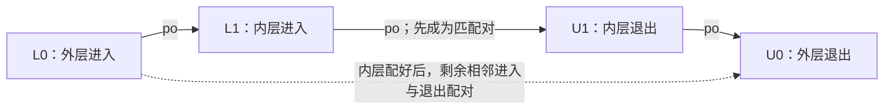

# 第8章\_LKMM输入\_分类与工具配置

本模块沿[总阅读索引](P01_Linux_6.12_LKMM_源码与模型导读.md#1.2_从源码接口到模型判定的完整链)进入，固定NXP官方linux-imx提交dfaf2136deb2af2e60b994421281ba42f1c087e0，Linux 6.12.20。前一模块已核对ARM指令映射，现在转向工具怎样解释模型输入；两者是独立证据层。

## 8.1\_linux\_kernel\_def\_把原语翻译成事件

[`linux-kernel.def`](../../linux/tools/memory-model/linux-kernel.def) 使用 herd7 宏语法定义：

```text
READ_ONCE(X)              → once Load
WRITE_ONCE(X,V)           → once Store
smp_store_release(X,V)    → release Store
smp_load_acquire(X)       → acquire Load
smp_mb/rmb/wmb()          → 对应 fence
rcu_assign_pointer(X,V)   → release Store
rcu_dereference(X)        → once Load
```

同一文件还映射原子交换、锁、RCU/SRCU等测试可用原语。这里表达“测试语法产生哪些事件标签”，不等价于实际C宏展开，也不模拟编译器汇编生成。上一节的ARM宏由C编译器展开为指令；这一节的定义由herd7前端用于解释Litmus输入。两个处理器面对相似的名字，却不消费同一种文件。

### 8.1.1\_用一次发布示例核对地址和标签

先打开[已有MP材料](../../../../labs/kernel/memory_ordering/P02_LKMM_Litmus_消息传递与屏障/tests/MP+pooncerelease+poacquireonce.litmus)。它使用下面这组完整参与者和结果条件；这是Litmus的C-like输入，不是可直接交给普通C编译器的完整程序：

```text
C MP+pooncerelease+poacquireonce

{}

P0(int *buf, int *flag)
{
    WRITE_ONCE(*buf, 1);
    smp_store_release(flag, 1);
}

P1(int *buf, int *flag)
{
    int r0;
    int r1;

    r0 = smp_load_acquire(flag);
    r1 = READ_ONCE(*buf);
}

exists (1:r0=1 /\ 1:r1=0)
```

这里P0/P1表示模型参与者，形参使两者访问相同的buf和flag位置。r0/r1属于P1的局部结果，不是供P0轮询的共享完成位。末尾exists请求查找“P1读到flag=1但buf=0”的候选执行；它既不是程序中的if，也不是已经得到的实验答案。

按模型定义逐次代入，得到四个访问事件：

| 调用位置 | 共享位置 | 模型访问与标签 | 后续追问 |
| --- | --- | --- | --- |
| P0第一句 | buf所指对象 | once写，值1 | 与发布写之间有什么顺序？ |
| P0第二句 | flag所指对象 | release写，值1 | P1的哪一次读取自它？ |
| P1第一句 | flag所指对象 | acquire读，结果保存到r0 | 取得之后怎样限制buf读取？ |
| P1第二句 | buf所指对象 | once读，结果保存到r1 | 若读到初始0，会形成什么关系？ |

注意调用形式的差异：ONCE接受对象表达式，测试传入*buf；release/acquire接受指针，测试传入flag，由定义里的解引用进入共享对象。把smp_load_acquire(flag)机械改写成smp_load_acquire(*flag)，并不是“强调读值”，而是改变了实参角色。阅读版本映射时，先核对对象和指针，再谈标签。

表中的release/acquire是事件属性，不是新建了一个“屏障对象”。在这份定义中，store-release形成一次带release标记的写，而smp_store_mb表达一次once写再加mb屏障事件。因此不能仅凭两个调用都含有顺序保证，就预期它们生成相同的事件结构。

### 8.1.2\_有标签还不等于已有证明

前端得到访问位置、值和标签以后，还要为候选执行确定读取来源、一致性序等关系，最后由公理判断是否合法。一个acquire读若没有取到所需发布写，就不能仅凭名字构成那一轮消息发布证据；模型输入也没有替应用保证对象一直存活。

做两项纸上修改：把发布取得两句换成WRITE_ONCE(*flag,1)与READ_ONCE(*flag)，两位置和读写数量没变，变化的是顺序标签；把smp_store_release换成smp_store_mb，则还改变了事件结构。前一种可与无序MP材料比较，后一种应重新追踪关系，不能沿用原证明。

原子交换、条件交换和锁的映射同样先交给herd7相应前端原语。尤其是cmpxchg上的mb标签，不能单凭.def这一行就宣称失败路径也具有成功RMW的全部顺序：是否写入、RMW配对和哪些关系被保留，还取决于操作结果与模型后续处理。下一节先看事件分类，[MP判定路径](P09_LKMM公理_锁关系与验证边界.md#9.3_沿_MP_测试追踪一次判定)再沿同一坏结果追踪实际需要的回边。

## 8.2\_linux\_kernel\_bell\_给事件分类

前一节已经得到带标签的访问事件，但标签不能直接回答“哪些读可以被rmb排列”“哪次RCU退出对应哪次进入”。[`linux-kernel.bell`](../../linux/tools/memory-model/linux-kernel.bell)提供事件分类，还构造读侧配对、标记访问集合和依赖传播关系；只把它称为标签清单，会漏掉模型进入公理以前已经完成的工作。

### 8.2.1\_把指令种类和顺序标签分开

固定文件的Accesses枚举包含once、release、acquire和noreturn。读事件允许once/acquire/noreturn，写事件允许once/release，RMW一栏则列出once/acquire/release。RMW是读改写事件类别，不能误写成Accesses枚举中另一个同级标签。noreturn用于不返回结果的RMW的读取部分，也不表示这次操作没有读内存。

Barriers枚举另外列出wmb、rmb、mb、编译器barrier、RCU进入/退出/等待以及atomic和锁相关的辅助屏障。这里的after-spinlock是辅助屏障标签，不是把spin_lock操作本身简化成fence。可睡眠RCU（Sleepable RCU，SRCU）又有专门的事件类别；锁的LKR/LKW分别表示成功获取锁的读取和写入部分，具体配对要沿lock.cat阅读，不能因为都与同步有关就塞进一个标签列表。

回到MP的四个访问：buf写是带once标记的写，flag写是带release标记的写，flag读带acquire，buf读带once。后续关系据此筛选端点。若把所有访问都笼统叫“原子事件”，就看不见release/acquire为何进入不同的关系，也无法解释换回ONCE后哪些边消失。

### 8.2.2\_先配对读侧区间再讨论宽限期

RCU模型要知道一个读侧区间从哪里开始、在哪里结束。设同一参与者按程序顺序出现L0、L1、U1、U0，L表示进入，U表示退出：直觉上应先配内层L1→U1，再配外层L0→U0。不能简单地把每个进入连到其后的所有退出，否则外层可能被误认为在内层退出时就结束。

固定bell里的rcu-rscs采用递归关系：先从尚未匹配的进入/退出事件中找相邻的一对进入→退出，把这对加入matched；随后从未匹配集合里排除它们，再继续建立外层配对。这里的“递归”描述模型关系的求解，不是Linux运行时维护了一张名叫matched的全局表。



可以手算三个输入：L0、U0产生一对；L0、L1、U1、U0产生内外两对；L0、L1、U1只产生内层一对，L0仍没有退出。源码随后分别检查未配对进入和退出，并给出unmatched-rcu-lock/unlock标志。不能把带异常标志的输入，当成正常RCU程序证明已经成立。

SRCU配对不能只抄这套括号规则。它还要考虑相同srcu_struct位置，以及进入返回的索引怎样经数据流抵达退出；固定文件用数据依赖和读取来源传递该值，检查多重匹配和不同值匹配。对象位置相同但索引来自另一轮，不足以让读侧区间合法。文件也检查在RCU临界区内出现synchronize_srcu的非法睡眠情形。

以上均为工具中的事件与关系，不是实际任务或CPU之间的通知流程。真实RCU/SRCU怎样登记状态和完成等待，应回到对应实现专题；bell既不执行宽限期线程，也不证明它一定取得调度机会。

### 8.2.3\_Marked不是手写ONCE的同义词

文件随后定义Marked和Plain集合。Marked不只包含Once、Release和Acquire，还纳入初始写、RMW端点、锁事件、SRCU读侧事件以及非内存事件等；Plain是内存事件中扣除Marked后的部分。因此普通赋值不能单凭语法外观归类，初始化事件也不能随意当成未经标记的并发写。

这一分类会影响后面的关系构造。例如cat定义rmb关系时排除Noreturn中的读，说明“只要出现读事件，rmb就一视同仁”不符合此版本模型。这里先建立分类，[关系模块](P09_LKMM公理_锁关系与验证边界.md#9.1.2_顺序与传播要沿端点追踪)再看它怎样改变关系端点，不从名字直接猜保证。

bell末尾还扩展addr、ctrl和data依赖：数据经同一参与者内的读取来源传递时，依赖可以穿过中间访问继续传播；SRCU退出被显式排除在相应传递步骤之外。此处不是把所有程序顺序都变成依赖，也不是跨任意线程的rf都可以搬来充当本地数据流。需要核对具体中间事件及rfi条件。

练习：把上一节MP的buf访问改成普通访问，不能只删一个显示标签然后照搬全由Marked端点构成的证明；要继续核对Plain规则和数据竞争诊断。反过来，保留四个ONCE/release/acquire访问，只改结果谓词，则分类没有改变，改变的是要查找的候选执行。先分清“换程序”和“换查询”，才能理解工具给出的答案究竟回答哪个问题。

## 8.3\_linux\_kernel\_cfg\_为什么要求正确工作目录

[`linux-kernel.cfg`](../../linux/tools/memory-model/linux-kernel.cfg) 使用相对路径指定：

```text
macros linux-kernel.def
bell linux-kernel.bell
model linux-kernel.cat
```

因此从其他目录直接运行herd7时可能找不到include。[Bash实验入口](../../../../labs/kernel/memory_ordering/P02_LKMM_Litmus_消息传递与屏障/README.md#1.5_运行全部测试)将工作目录固定在模型目录，再传入Litmus绝对路径；清单为manifest.tsv，生成记录包含工具版本、模型/输入摘要、进程退出码与两路完整输出。静态检查和工具替身协议检查均不算herd7模型结果：

```bash
cd research/source_reading/linux/tools/memory-model
herd7 -conf linux-kernel.cfg /absolute/path/to/test.litmus
```

这条命令的路径是占位示意，实际执行应使用上面的实验入口或替换成真实材料路径。固定模型README要求工具单独安装，同时提醒新版本不保证永远兼容旧模型；“工具版本更高”不是可以省略模型身份记录的理由。herd7检查模型候选执行，klitmus7则把测试转成要在目标内核构建和运行的材料，两者不是同一个验证步骤。

配置文件后半还有graph、fontsize、edgeattr等绘图选项。例如showinitwrites=false改变初始写是否显示，不会从判定所需的执行关系中删除初始写；hb显示为某种颜色也不产生一条hb边。阅读图时不能把隐藏的初始化事件误判为“模型没有初始化”。

模型文件还有传递依赖：linux-kernel.cat包含lock.cat，lock.cat又使用工具库提供的cross.cat和cos-opt.cat，分别参与组合选择和一致性序生成。因此保存本仓库的五份模型配置文件，不等于已保存完整herdtools运行环境。若报找不到包含文件，应核对模型目录与工具安装的库搜索范围，不应删除include来让命令勉强通过；那会改成另一套模型。

验证记录至少分三层：进程是否成功加载输入并结束、是否输出预期测试名与Observation、该Observation是否满足清单要求。退出码0不能独自替代后两项，源码文件哈希一致也不能替代任何一次实际判定。本轮未执行herd7，后文Never仍是固定模型推导出的预期，不是本机运行结果。


下一篇：[公理、锁关系与验证边界](P09_LKMM公理_锁关系与验证边界.md#9.1_linux_kernel_cat_怎样组织公理)。
