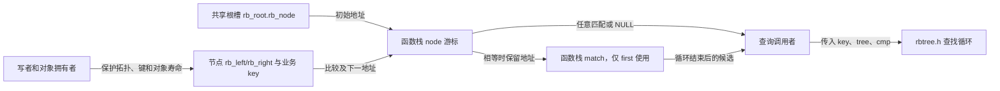
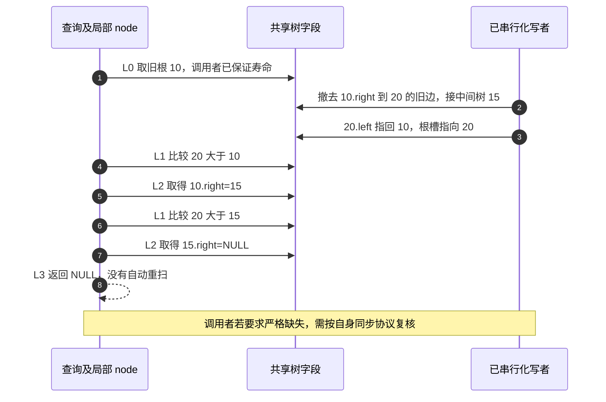

# 第2章\_查找路径与返回边界导读

[P10 教材](../../../../knowledge/linux/data_structures/红黑树_rb-tree/P10_Linux_6.12_内核_rbtree_查找_插入与旋转修复.md#10.2_rbtree_查找逻辑_手写_search_与内核辅助接口)已经用 A/B/C 说明：相等节点插入时向右，旋转后仍可出现在左侧。进入源码时应带着“从哪里继续找、候选保存在哪里”这两个问题。本篇按固定版本组织函数协作，不重复展开函数体。

## 2.1\_谁保存状态谁决定答案

`rb_root.rb_node` 是整棵树的共享入口，内嵌 `rb_node` 的 `rb_left/rb_right` 保存孩子地址。`cmp` 是调用者提供的比较函数：负数向左，正数向右，零表示这次查询匹配。key 通常在外围业务对象中；树节点本身没有通用 key 字段。

这些局部变量不是任务登记表，也不是分布式完成状态。一次普通调用由单个读者推进；跨执行者共享的是根、节点字段和对象寿命。函数不把游标上报写者，写者也不会在旋转后通知它更换起点。

## 2.2\_按一次查找定位源码

以查询 10 为例，把一次调用划成四步，而不是记一组相似函数名：

| 阶段 | 进入与写入 | 后续读取及退出 |
| --- | --- | --- |
| L0 取入口 | 本调用把 tree->rb_node 复制到局部 node；first 另将 match 置空 | node 为空就退出；并不验证整棵树 |
| L1 比较 | cmp 读取业务 key，比较值 c 留在本调用 | c 决定排除左侧、右侧还是得到匹配 |
| L2 推进或留候选 | 普通 find 在 c=0 返回；first 在 c=0 写 match 后向左；其余更新 node | 下一轮回 L1，树字段没有被查询修改 |
| L3 返回 | 交还 node、match 或 NULL | 调用者仍负责返回后的保护或持有权 |

[`rb_find()`](../source_explanations/include/linux/rbtree.h.md#1.1_rb_find的任意匹配)闭合最短路径；[`rb_find_first()`](../source_explanations/include/linux/rbtree.h.md#1.2_rb_find_first的候选保存)只增加一个局部候选。最左匹配不等于最小 key，也不自动等于最早插入的业务身份；它是当前排序中这个查询等价区间的第一个。

固定语句没有查找预算或结构验证。循环终止依赖输入树及允许的修改方式，不能把“最终会结束”扩展到任意损坏指针图。

## 2.3\_等价区间与后继协作

在静止树中，中序的 10/A、10/B、10/C、20/D 形成连续的同键区间。first 给 A，[`rb_next_match()`](../source_explanations/include/linux/rbtree.h.md#1.3_rb_next_match与匹配遍历宏)先调用 lib/rbtree.c 的 rb_next 得到中序后继，再判断它是否仍在查询组内；得到 D 后停止。`rb_for_each` 只把这两步拼为循环，不会访问所有不同 key 的组。

若建树按 (start, end) 排序，只查 start 仍可形成连续区间；只查 end 则未必。比较关系必须足以排除整棵子树。另一个边界是后继会使用父指针，向下查找的并发论证不能直接移到这条路径。rb_next 的具体父链实现由后续遍历单元处理，本批只依赖其稳定树上的中序后继接口契约。

读源码时先定位 first 的 match，再跟到 next_match 的后继检查，最后看宏的初始化/推进表达式；不要从宏名猜测它会加锁或检查对象是否已经删除。

## 2.4\_旋转期间沿什么路径继续

[`rb_find_rcu()`](../source_explanations/include/linux/rbtree.h.md#1.4_rb_find_rcu的孩子读取与缺失边界)沿用 L0～L3，只将 L2 的孩子读取换成 rcu_dereference_raw。首次取根仍是普通表达式，没有函数内的 rcu_read_lock，没有序列验证和重扫。

lib/rbtree.c 开头的注释要求孩子写入使用 WRITE_ONCE，并要求程序顺序不形成临时环；这两件事共同服务于有限的向下路径。它同时指出旋转并不原子，可能漏掉整个子树，并把父指针循环检查排除在此论证之外。找到有效匹配仍要求业务比较与对象寿命有效，不能用这些语句证明已经取得引用。

这个反例对应教材的 S1～S3：S0/S4 属于调用者寿命保护和结果处置，L0～L3 才是函数内部查找。完整 C 程序在[路径实验](../../../../knowledge/linux/data_structures/红黑树_rb-tree/P10_Linux_6.12_内核_rbtree_查找_插入与旋转修复.md#10.2.10_用完整C程序观察相等节点和旧路径)串行重放，不能据此声称 ARM 上的内存序已经验证。

## 2.5\_返回以后还缺什么

先决定业务接受任意匹配、最左匹配还是严格缺失，再决定保护方式。完整锁覆盖查找最容易获得稳定拓扑；需要无读锁查询时，应单独证明写侧串行化、节点发布、键稳定、旧读者寿命和假阴性可接受性。命中后若离开保护区继续使用，必须另行取得合法持有权或复制数据。以上职责不会因选择 first、RCU 或遍历宏而消失。

返回[总索引](P01_Linux_6.12_rbtree源码阅读索引.md#1.2_按问题选择源码入口)或[源码大纲](../大纲.md#1.1_从查询承诺进入实现)。
