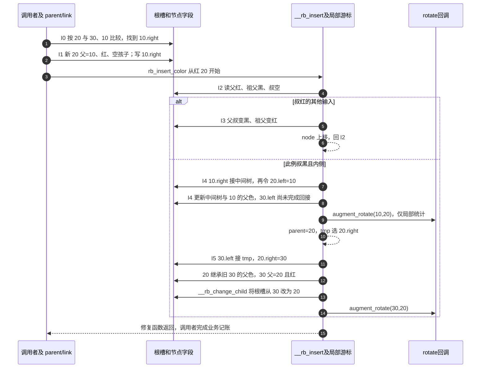

# 第3章\_红叶接入与冲突修复导读

[P10 插入单元](../../../../knowledge/linux/data_structures/红黑树_rb-tree/P10_Linux_6.12_内核_rbtree_查找_插入与旋转修复.md#10.3_rbtree_插入前半段_搜索落点与_rb_link_node%28%29)从查找变为修改：同一比较过程走到 NULL 后，不再只报告不存在，而是要把新对象写入那个空槽。接入红叶不增加路径黑数，却可能与红父冲突。本篇追踪这些责任在固定 Linux 文件中如何交接；红黑理论沿用 P07，本篇不重新推导整套平衡树。

## 3.1\_空槽与修复游标各归谁所有

先取普通、写侧已串行化的路径。调用者拥有业务对象及排序键；rb_node 只是内嵌连接。搜索中的 link 是地址的地址，指向 root->rb_node 或某个父节点的 rb_left/rb_right；它本身在本调用栈上，被它指向的槽才是共享树状态。

本次插入不是多个 CPU 汇报完成的分布式状态机：只有获得写侧保护的调用者推进。对象字段中的结构与颜色是相互关联的状态，局部游标只说明当前正在修复哪里。rbtree 不维护每 CPU 插入登记，不主动通知其他读者改入口。

## 3.2\_一轮插入怎样推进

用 30、10、20 的 LR 输入：前两个节点已经构成根 30 黑、左孩子 10 红；新 20 从 30 向左、再从 10 向右找到空槽。按下列同一组阶段阅读，其他两级方向只改变镜像或跳过 I4。

| 阶段 | 写入者和地址 | 退出与后续读取 |
| --- | --- | --- |
| I0 私有准备与搜索 | 调用者初始化业务对象，局部 parent/link 沿排序路径更新 | 找到空槽才继续；重复按业务规则处理 |
| I1 红叶接入 | link_node 写新节点父色、空孩子，再写 *link | 新节点已经可达，但红黑性质可能尚未恢复 |
| I2 判定是否需要修复 | 核心读取 node/parent；根变黑退出，父黑直接退出 | 父红则原合法树保证黑祖父存在 |
| I3 叔红上推 | 核心写父叔为黑、祖父为红，局部 node 上移 | 回 I2；此时没有旋转 |
| I4 叔黑内侧预处理 | 核心先撤旧边、反接局部边，改中间节点和下沉节点父色，再同步回调 | 全部父槽尚未闭合；调整局部 parent/tmp 后进入 I5 |
| I5 外侧收尾 | 核心改祖父两侧连接；收尾函数交接父色并写外部槽，再同步回调 | 本次修复结束，调用者继续业务状态更新 |

具体语句按职责进入：[挂接与发布](../source_explanations/include/linux/rbtree.h.md#1.5_红叶挂接与发布)、[完整修复分支](../source_explanations/lib/rbtree.c.md#1.3_插入修复的两侧分支)、[父色与根槽收尾](../source_explanations/lib/rbtree.c.md#1.2_父槽与颜色收尾)。上图 I4 不能理解成另一个通用单旋已经完全返回；上游为紧接的 I5 保留中间态。若直接外插，则从 I2 进入 I5，省去第一旋。

## 3.3\_回调不等于整个操作完成

普通树通过[包装入口](../source_explanations/lib/rbtree.c.md#1.4_普通与增广入口)传入空回调；增强树传入维护局部统计的回调。它是修复过程中的同步函数调用，不是另一个任务收到的“树已稳定”通知。尤其 I4 时，不能随意沿父链扫描或发布完成状态。

有些插入只经历 I1/I2，没有旋转，自然不会调用 rotate。因而把“业务成员数加一”放到 rotate 中也不成立：有的插入零次，有的插入两次回调。成员数应由业务插入成功路径处理，子树增强值还需要其专门的路径更新协议。

[rb_add](../source_explanations/include/linux/rbtree.h.md#1.6_不查重的rb_add)把 I0～I5 包起来但不查重；[find_add 两变体](../source_explanations/include/linux/rbtree.h.md#1.7_查重后插入与RCU发布变体)在命中时返回已有节点。写者必须理解哪个对象已经入树，不能释放错对象。

## 3.4\_通过哪些观察检查理解

[完整模块](../../../../knowledge/linux/data_structures/红黑树_rb-tree/P10_Linux_6.12_内核_rbtree_查找_插入与旋转修复.md#10.4.15_在内核模块中观察五组插入)分别提交 LL、LR、RR、RL 三键输入，再增加叔红输入，输出根、父键和颜色。先预测根是否变化、红冲突是否靠染色上推，再读日志。该模块的节点与根只在初始化的一个私有函数内存活，没有其他读者，所以无须为这个封闭观察增加共享树锁；这不是省略生产代码同步责任的许可。

这些函数不含内存申请或锁获取失败分支。它们的危险边界来自前提：非法成员、坏父链、排序错误、多个写者和悬空对象。观察程序不能验证这些任意错误输入；实际依赖的编译和运行范围以教材及工作记录为准。

返回[总索引](P01_Linux_6.12_rbtree源码阅读索引.md#1.2_按问题选择源码入口)或[大纲](../大纲.md#1.1_从查询承诺进入实现)。
