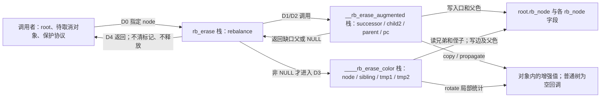
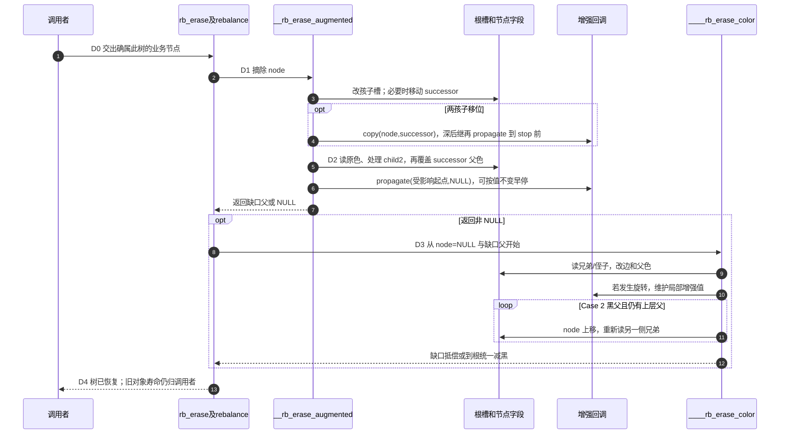

# 第4章\_对象摘除与缺黑修复导读

上一模块已经让红叶成为合法成员。现在取消一个地址已被业务识别的请求，不能把“改变树中位置”误作“改变对象身份”。先读[P11 删除周期](../../../../knowledge/linux/data_structures/红黑树_rb-tree/P11_Linux_6.12_内核_rbtree_删除与缺黑修复.md#11.1.3_一轮取消经过哪些状态)，本页把 D0～D4 落到固定版本的栈变量、节点字段和函数协作，不重复逐句函数体。

## 4.1\_谁拥有地址和颜色

root 保存入口，嵌入业务对象的 rb_node 保存父色与左右孩子；调用栈的 rebalance 表示仍需处理的缺口父节点。增强值是业务选择的子树摘要，例如节点数，和普通红黑颜色是两套状态。copy/propagate/rotate 是当前写者同步调用的维护函数，不是另一 CPU 的异步消息。

整个周期依赖调用者已串行化写入并保持相关对象存活。库没有记录“这个节点属于哪棵树”的身份标签，也不会从错误对象重新搜索正确树。具体入口在[普通删除及辅助](../source_explanations/lib/rbtree.c.md#1.6_删除入口与黑色位辅助)。

## 4.2\_从对象到缺黑父槽

D1 的目标是把指定 node 摘掉，不是随便删一个等价 key。单孩子可直接接替外部槽；两孩子则选右子树最左对象 successor。直接右孩子为后继时，移位后的 successor.right 是原位置的继续；深后继则由其原 parent.left 接 child2。两种情况都保留其他业务对象的地址。

D2 必须读原位置的颜色。后继将继承 node 的父色，因此先检查 successor 是否原为黑色，再覆盖打包字段；反过来会把“新位置颜色”误当“被拿走的黑贡献”。child2 存在时为红，染黑可抵偿；没有 child2 且原位置黑，则返回缺口父节点。唯一黑根被删为空树时返回 NULL。

第 4 步和第 10 步不是“操作完成”通知。深后继的 stop 对象及 Case 3 的新局部根尚有未收尾的父色，回调只可执行其协议允许的局部工作。第 5 步强调颜色读取先于覆盖，第 7 步把局部判断交给入口，第 13 步才结束库操作；业务释放还要等自己的持有权条件。完整结构实现见[唯一摘除标题](../source_explanations/include/linux/rbtree_augmented.h.md#1.3_结构摘除与缺黑父槽)。

## 4.3\_转换与上推怎样结束

D3 固定缺黑侧 N、父 P、兄弟 S。左缺时近侄是 S.left、远侄是 S.right；右缺时两者互换。“近/远”是相对缺口的方向，不是节点自身的固定属性。

四种情形是带依赖的转换：红兄弟先换成黑兄弟；黑兄弟双黑侄只能一起减黑，红父可补、黑父要上推；近侄红而远侄黑先改成可收尾形状；有可用的远侧贡献后旋转并改父色，局部结束。只有上推会重新进入循环，缺口每次向根靠近；到根时各路径统一少一黑，也可结束。

[完整四类及镜像实现](../source_explanations/lib/rbtree.c.md#1.5_缺黑修复的四种转换)特别区分 Case 3 抽象图和实际字段：此时旧 S 仍黑、新局部根仍红，父色赋值留给 Case 4。不要用“回调发生了”推断整个树已恢复，也不要用旋转次数记账删除成员。

## 4.4\_怎样观察地址身份与退出条件

[P11 完整模块](../../../../knowledge/linux/data_structures/红黑树_rb-tree/P11_Linux_6.12_内核_rbtree_删除与缺黑修复.md#11.3.12_用完整模块观察取消请求)使用数组对象身份，打印保留下来的数组下标和键，删除后再观察清标记前后的差别。它不发布根，没有别的读者，故可直接检查返回后的成员集合。

宿主 C 算法检查另以固定核心语句、Windows 位宽适配和局部增强计数覆盖删除排列；它不能证明实际 Linux ABI、RCU、弱内存序或性能。目标模块尚未 Kbuild/装卸/运行，不能将预测日志记作观测。版本与范围见[Linux 删除证据](../../linux/SOURCE_BASELINE.md#1.22_rbtree删除与缺黑状态证据)。

返回[源码总索引](P01_Linux_6.12_rbtree源码阅读索引.md#1.2_按问题选择源码入口)或[大纲](../大纲.md#1.1_从查询承诺进入实现)。下一步沿[有序推进与整树销毁](P05_有序推进与整树销毁导读.md#5.2_同一中序关系如何跨过删除)区分“当前已删”和“还能沿哪条关系继续”；若成员数不变而对象地址变化，继续[同键替换](P06_同键替换与旧对象退出导读.md#6.2_一轮替换怎样交接入口)。

与普通单旋返回条件的比较见[完成边界](../../../../knowledge/linux/data_structures/红黑树_rb-tree/P29_普通旋转与Linux修复的完成边界.md#29.2.7_删除修复中的旋转_直接写在_rb_erase_color%28%29_的_case_里)，尤其区分 Case 3 回调时的实际颜色与抽象“近红变远红”图。
