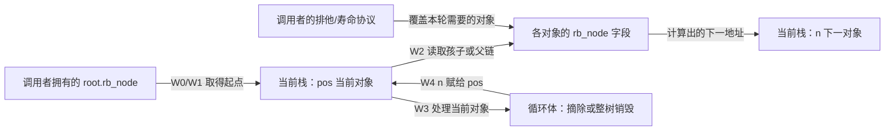
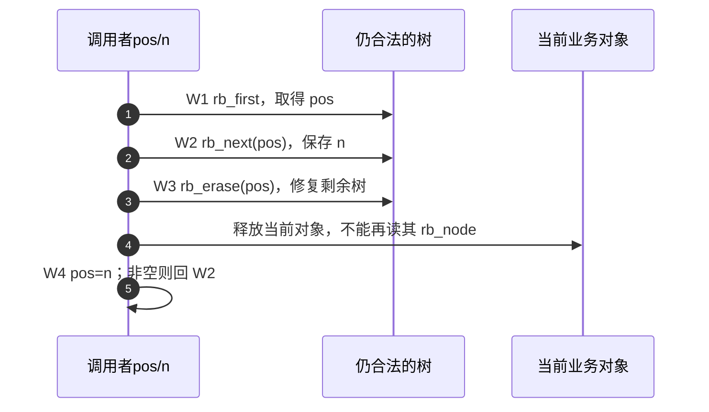
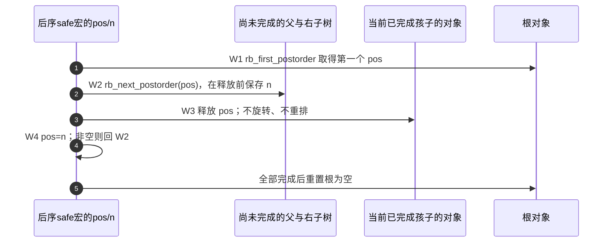

# 第5章\_有序推进与整树销毁导读

删除已经保证留下的树仍有序，但“继续走向下一个对象”还要决定什么叫下一。中序按 key 次序推进，后序在孩子结束后处理父。两者都能提前保存一个地址，却不能因变量都叫 next 就套用同一修改规则。本页按[P11 遍历](../../../../knowledge/linux/data_structures/红黑树_rb-tree/P11_Linux_6.12_内核_rbtree_删除_遍历与替换.md#11.4_rbtree_遍历接口)的两项任务定位固定实现。

## 5.1\_拓扑与游标分别保存在哪

树的父/孩子关系在对象内，根保存在 rb_root；pos 与 n 是调用者栈中的当前和下一游标。对象是否仍存活属于调用者的资源协议，safe 宏没有把引用写进对象，也没有阻止其他执行者释放 n。

这是拓扑、游标和寿命三组状态，不是节点内自带的“迭代器状态机”。W0 建立保护和有效根，W1 取得当前，W2 在当前仍可读时保存下一，W3 执行业务，W4 推进。具体实现见[中序函数](../source_explanations/lib/rbtree.c.md#1.7_中序端点与父链推进)与[后序函数](../source_explanations/lib/rbtree.c.md#1.8_后序推进只跨向未完成部分)。

## 5.2\_同一中序关系如何跨过删除

rb_next 有右子树就找其最左对象，否则沿父链越过右孩子关系，直到第一次由左侧到达父。它不比较颜色，也不比较 key；排序规则已经体现在树形里。后继可与当前同键，所以“下一对象”比“下一个更大键”准确。

下面调用者独占树，只删除当前对象，下一对象全程存活。排序修复会旋转但不改变幸存对象的中序关系；因此原后继的地址仍是下次应处理的对象。若期间替换/删除了保存的 n，或另一个写者插入新对象，下面的证明便不成立。

第 2 步必须早于第 3、4 步；第 5 步是使用已经保存的地址，不会自动从根重新找到它。每轮删除都有平衡成本，整个取消过程不再等同于只读的一轮 O(n) 遍历。先读[中序端点与父链](../source_explanations/lib/rbtree.c.md#1.7_中序端点与父链推进)，再回到[删除入口](../source_explanations/lib/rbtree.c.md#1.6_删除入口与黑色位辅助)。

## 5.3\_整树销毁为何不用逐个平衡

如果已经排除外部使用者，目标是回收整棵私有树，那么每处理一个对象都重新平衡剩余树并无必要。后序先完成孩子，当前节点的下一位置只依赖尚活父节点及尚未完成的右子树。循环体可释放当前对象，不能在这个算法里调用 rb_erase 改变剩余完成次序。

第 3 步之后，旧父的孩子字段可能仍留着已释放地址，但后序推进不再下行进入已经完成的孩子；它只比较关系或进入未完成右子树。第 5 步之前不能把正在销毁的根交给普通查找者，整个过程需要排他寿命条件。safe 保护的是“当前对象可在循环体失效”，没有替调用者建立并发安全或有效剩余树。

四键 10、20、30、40 的反例中，原后序为 10、40、30、20。先存 40 再删除 10 会旋转，使 20 成为 30 的左孩子；从已保存的 40 接着走，后面只到 30，漏掉 20。完整状态变化在教材中逐步画出；宏见[两个游标](../source_explanations/include/linux/rbtree.h.md#1.9_后序safe的两个局部游标)。

## 5.4\_输入边界与验证职责

rb_first/last 接受有效根对象，其内部根指针可空。rb_next/prev 要求非 NULL 且存活节点，游离标记不是空指针保护；rb_next_postorder 则显式允许 NULL。没有一个函数会锁树、检查任意损坏父链或取得对象引用。

[完整模块](../../../../knowledge/linux/data_structures/红黑树_rb-tree/P11_Linux_6.12_内核_rbtree_删除_遍历与替换.md#11.4.9_运行完整遍历与销毁模块)与宿主/ARM 的有限证据见[基线记录](../../linux/SOURCE_BASELINE.md#1.23_rbtree遍历与整树销毁证据)，目标运行尚未完成；固定身份始终以[总索引](P01_Linux_6.12_rbtree源码阅读索引.md#1.1_固定提交与阅读边界)为准。回到[删除模块](P04_对象摘除与缺黑修复导读.md#4.4_怎样观察地址身份与退出条件)区分摘除与寿命，再继续对象替换的独立任务。

成员数不变而对象地址改变时，下一步读[同键替换模块](P06_同键替换与旧对象退出导读.md#6.1_地址身份与排序位置)：保存旧地址不表示旧对象仍能充当当前树的遍历游标。
