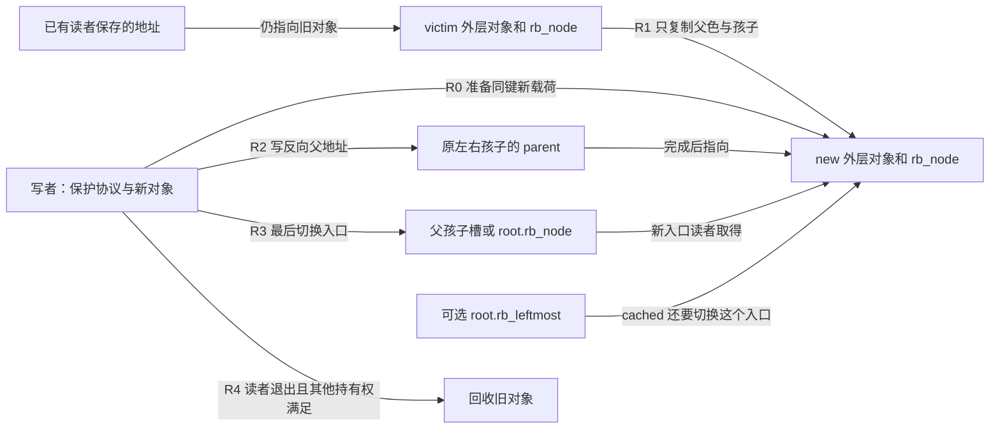
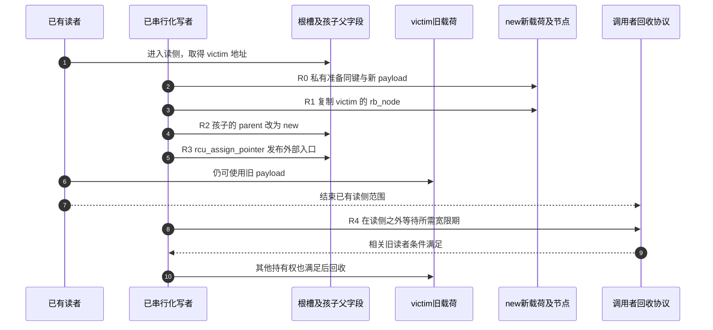

# 第6章\_同键替换与旧对象退出导读

中序遍历保存的是对象地址；同键换成另一个地址后，原游标不会自动变成新对象。现在要把请求 20 的新载荷放进原位置，同时让已有读者完成旧视图。本页承接[P11 替换](../../../../knowledge/linux/data_structures/红黑树_rb-tree/P11_Linux_6.12_内核_rbtree_删除_遍历与替换.md#11.5_rb_replace_node%28%29_与_rb_replace_node_rcu%28%29)，按固定版本追踪结构交接，RCU 通用实现仍沿原专题。

## 6.1\_地址身份与排序位置

new 与 victim 是不同业务对象，key 应按树的完整比较规则等价；payload 可以不同。节点结构复制不会复制外层 payload、引用计数、链表身份或增强统计。拓扑、业务载荷、局部临时父地址、读者持有权是不同组状态，R0～R4 是讲解阶段，不是某个 rb_node 字段。

源码职责分开核对：[普通/RCU 替换](../source_explanations/lib/rbtree.c.md#1.9_同键替换的普通与RCU入口)、[保色改父](../source_explanations/include/linux/rbtree_augmented.h.md#1.4_保持颜色的父地址替换)、[RCU 外部槽发布](../source_explanations/include/linux/rbtree_augmented.h.md#1.5_RCU外部入口发布)。普通路径由调用者排除会观察中间态的读写者，函数自己不取锁。

## 6.2\_一轮替换怎样交接入口

下面固定 RCU 向下读取场景：写者已串行化，读者进入匹配读侧范围并通过相应取得接口读入口，新旧对象都活到各自读者结束。这里不承诺父链遍历获得快照，也没有把 rb_find_rcu 的初次普通取根表达式自动改成另一读取协议。

第 4 步早于第 5 步，说明父链与入口不是原子地一起变化；第 6 步仍用旧地址，说明发布不会撤销已取得的指针。第 8 步不能放在自己仍持有的读侧范围内，第 9 步也不能代替外部引用计数的释放。新读者通过匹配协议看到 new 时，能读取 R0/R1 已准备的载荷和前向结构；这项发布保证不等于整个树的所有方向形成一个同时快照。

普通替换执行相同的结构 R1/R2 和普通外部槽写入，由调用者的排他范围完成可见性交接；它不因为没有 RCU 后缀就自动使旧对象无人使用。具体写槽语句和可修改边界见[唯一替换实现](../source_explanations/lib/rbtree.c.md#1.9_同键替换的普通与RCU入口)。

## 6.3\_附加入口与回收条件

cached 包装在普通 R1 之前更新 rb_leftmost。若读者能绕开写者保护直接读缓存，可能先看到 new 地址，而其 rb_node 尚未复制。因此该包装须覆盖整个操作的保护；不能只把内部 rb_replace_node 改成 RCU 版就宣布缓存也安全。固定头文件中没有现成的 cached RCU 合并替换接口，详见[缓存唯一实现](../source_explanations/include/linux/rbtree.h.md#1.10_替换时的最左缓存入口)。

增强树又是另一项职责。rb_node 的赋值不含外层摘要字段；同键但 payload 参与统计时，调用者还须计算新子树值并维护受影响祖先。外部引用、其他索引和锁也不会因一个树入口切换自动迁移。

旧节点字段和游离标记都不自动清理。不能仅见 RB_EMPTY_NODE 为假就继续把 old 当作当前树成员，也不能在旧读者需要字段时急着清标记。是否回收依据所有可达入口和持有权，而不是仅看根已改到 new。

## 6.4\_用有限观察检查交接

[完整模块](../../../../knowledge/linux/data_structures/红黑树_rb-tree/P11_Linux_6.12_内核_rbtree_删除_遍历与替换.md#11.5.7_运行同键替换观察模块)分别替换普通根和 cached 最左对象，观察新 payload 不被节点赋值覆盖、旧对象字段未清以及孩子 parent 的新地址。RCU 部分在同一任务中保存旧视图后执行替换，结束读侧后才等待并回收；它没有并发写者或压力负载。

[固定证据与验证范围](../../linux/SOURCE_BASELINE.md#1.24_rbtree同键替换与旧对象退出证据)区分实际 ARM 语法、宿主位宽和接口适配，以及尚未执行的目标装卸。RCU 基础先读[总阅读索引](../../rcu/navigation/P01_Linux_6.12_RCU源码总阅读索引.md#1.6_建议的源码阅读顺序)，本页只组织容器交接，不复制另一套 RCU 实现。返回[rbtree 总索引](P01_Linux_6.12_rbtree源码阅读索引.md#1.2_按问题选择源码入口)。
