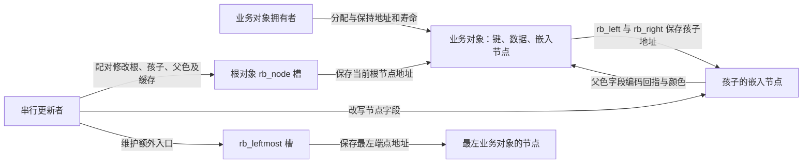
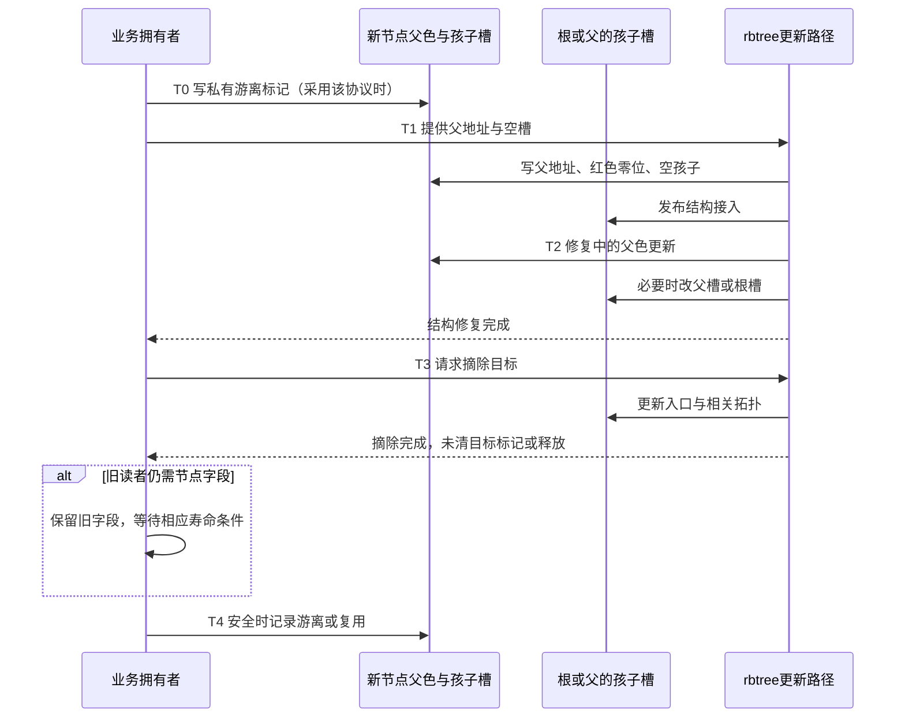

# 第7章\_节点布局与编码状态导读

[P08 教材](../../../../knowledge/linux/data_structures/红黑树_rb-tree/P08_Linux_6.12_内核_rbtree_基础结构与工程模型.md#8.2.5_rbtree_在内核中的工程定位)已经把业务排序与树表示分开。本篇进入[固定版本](P01_Linux_6.12_rbtree源码阅读索引.md#1.1_固定提交与阅读边界)，回答状态实际保存在哪、谁写它、读取前需要哪些条件。这里组织源码入口，不展开宏体。

## 7.1\_先识别三个存储对象

外围业务对象保存键和数据，其内嵌 `rb_node` 保存树链接。根对象位于独立存储中，指向某个嵌入节点；缓存根还保存另一个最左端点入口。根槽、孩子槽和孩子自己的父色槽互相独立，一次赋值不会自动写另两个位置。

分别读[节点与对齐](../source_explanations/include/linux/rbtree_types.h.md#1.1_rb_node的三个字段与对齐)、[普通根](../source_explanations/include/linux/rbtree_types.h.md#1.2_rb_root保存外部入口槽)、[缓存根](../source_explanations/include/linux/rbtree_types.h.md#1.3_rb_root_cached增加一个最左入口)。图中的树节点地址不一定等于业务对象首地址；[业务地址还原](../source_explanations/include/linux/rbtree.h.md#1.11_父地址与业务地址的两种还原)需要正确的类型和成员名。

## 7.2\_沿一个节点的成员周期读写字段

成员关系、颜色/父链、对象寿命是不同维度。以下阶段假设单个更新者或已持有调用者规定的保护；不是 Linux 自动维护的一枚通用状态枚举，也不是 RCU 回收周期的完整替代。

| 阶段 | 谁触发，写到哪里 | 后续读取与退出条件 |
| --- | --- | --- |
| T0 私有准备 | 业务分配对象；若采用游离约定，写节点父色字段为自身地址 | 此时只把它作为约定标记读，不把低位读出的零当成有效在树红节点 |
| T1 接入 | 搜索确定父与空槽，rb_link_node 覆盖新节点父色、清孩子并写入外部槽 | 父色低位此时为红 0；转入修复，不向无保护观察者承诺完整稳定态 |
| T2 修复与使用 | 修复者写父色及前向链接，必要时写根槽；根最终为黑 | 普通取父清低两位，测色取最低位；比较与对象寿命仍由业务保护 |
| T3 摘除 | rb_erase 更新其他节点和入口，不负责自动写回目标游离标记 | 已从树摘除不代表目标字段已清，更不代表外部读者已退出 |
| T4 记录与退出 | 调用者确认不再需要旧字段后按协议清标记；寿命条件满足后才回收 | 可复用或销毁；不能让标记检查替代引用、锁或回收条件 |

T1 的完整状态推进见[插入模块](P03_红叶接入与冲突修复导读.md#3.2_一轮插入怎样推进)，T3 的目标/后继差别见[删除模块](P04_对象摘除与缺黑修复导读.md#4.2_从对象到缺黑父槽)。T2 的一次父色写入与保持颜色换父分别由[打包写入](../source_explanations/include/linux/rbtree_augmented.h.md#1.1_父色打包写入)和[保色换父](../source_explanations/include/linux/rbtree_augmented.h.md#1.4_保持颜色的父地址替换)实现；它们并不自动改写前向槽。

## 7.3\_不要从一组位推出另一种状态

固定版本红为 0、黑为 1，取父去掉低两位，颜色只看最低位。不能把第二低位自行命名为“已挂入”或其他通用状态。游离标记是 **整个字段等于自身地址**，而非额外设置某个低位；其低颜色位虽然为零，但在 T0/T4 不能当成真实在树红节点。实现语句集中在[颜色宏](../source_explanations/include/linux/rbtree_augmented.h.md#1.6_颜色位与父地址掩码)与[空状态约定](../source_explanations/include/linux/rbtree.h.md#1.8_游离标记不等于成员搜索)。

父为空的黑根，其打包值为 1，而非 0。直接把这个整数当父地址会得到错误地址；通过取父掩码才得到空父。读取颜色辅助宏前也必须已有有效节点，不能因为理论上空叶子为黑就把 NULL 直接交给会解引用节点的测色宏。

最后运行[整数编码实验](../../../../knowledge/linux/data_structures/红黑树_rb-tree/P08_Linux_6.12_内核_rbtree_基础结构与工程模型.md#8.4.3_为什么颜色可以使用指针低位存储)：区分对齐、位宽、颜色与游离四个条件。该模型不执行目标指针转换或并发读写；它不能替代实际 ABI 和同步验证。返回[总索引](P01_Linux_6.12_rbtree源码阅读索引.md#1.2_按问题选择源码入口)。
