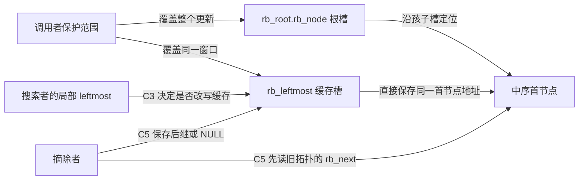
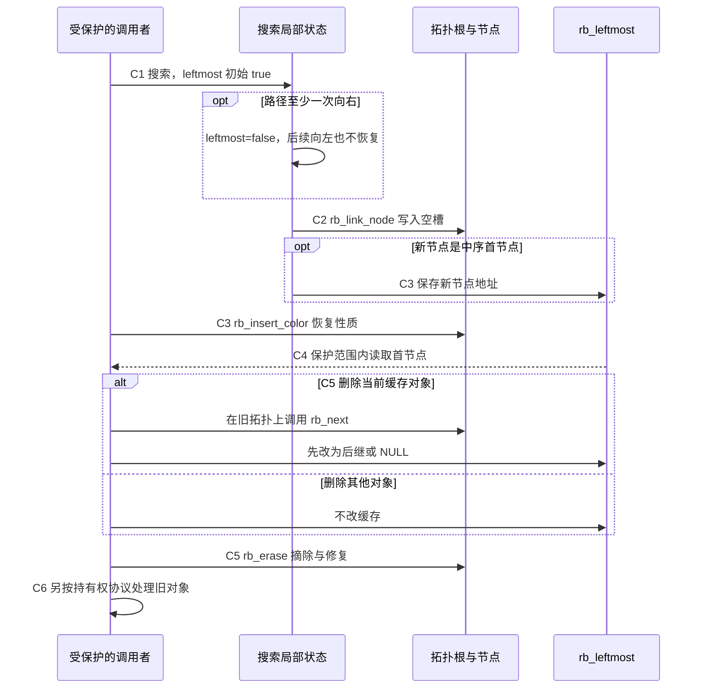

# 第8章\_最左缓存与结构更新导读

[P12 缓存单元](../../../../knowledge/linux/data_structures/红黑树_rb-tree/P12_Linux_6.12_内核_rbtree_工程扩展_并发与验证.md#12.2_cached_rbtree_struct_rb_root_cached)已解释频繁取首为什么要增加入口。本篇按[固定版本索引](P01_Linux_6.12_rbtree源码阅读索引.md#1.1_固定提交与阅读边界)定位这些入口的真实更新顺序，不重新展开宏体或整个树算法。

## 8.1\_一个根对象中的两个入口

`root->rb_root.rb_node` 是拓扑入口，`root->rb_leftmost` 是中序首节点的快捷入口。它们可以指向不同节点；最左对象与根对象不是同一含义。两个槽独立存储，修复者更新树形时不会自动找到并重写另一个槽。调用者的保护须覆盖拓扑与缓存共同变化的窗口。

类型位置见[缓存根](../source_explanations/include/linux/rbtree_types.h.md#1.3_rb_root_cached增加一个最左入口)。空根的两个入口同时为空；清空内部普通根、覆盖外层结构或复制根对象的边界先由[P08 根值实验](../../../../knowledge/linux/data_structures/红黑树_rb-tree/P08_Linux_6.12_内核_rbtree_基础结构与工程模型.md#2%29_观察根值复制与对象存活)回顾。

## 8.2\_沿接入与摘除跟踪C0到C6

拓扑、缓存、对象寿命是正交状态。C0～C6 是阅读阶段，不是内核新增枚举。稳定观察点要求缓存等于当前树的中序首节点地址；更新中间态只对持有相应保护的更新者可见。

| 阶段 | 写入者与具体地址 | 后续读者和退出条件 |
| --- | --- | --- |
| C0 私有初始化 | 调用者初始化普通根与 rb_leftmost 都为空 | 首次搜索可开始；未发布的对象由调用者持有 |
| C1 搜索 | rb_add_cached 维护局部 link、parent、leftmost；第一次向右把 leftmost 置 false | 到达空槽；该布尔值描述实际插入位置，不能由数值最小近似替代 |
| C2 挂接 | rb_link_node 写新节点字段与 link 所指的根/孩子槽 | 拓扑接入，缓存可能仍是旧值，树性质尚未修复 |
| C3 缓存与修复 | rb_insert_color_cached 按 leftmost 写 rb_leftmost，然后调用普通修复 | 修复返回后才能进入稳定观察点；缓存写入本身不是完成通知 |
| C4 使用 | rb_first_cached 只读取缓存槽，普通 rb_first 则从根下行 | 对象有效性和读侧同步仍由业务保证 |
| C5 摘除 | rb_erase_cached 若删中缓存，先用旧节点计算后继并写缓存，再调用 rb_erase | 当前节点必须确属这棵树；树修复后缓存与拓扑重新对应 |
| C6 退出 | 调用者处理摘下对象的其他入口与持有权 | 不能由缓存改指别处就立即释放仍有旧读者的对象 |

C1～C3 的唯一实现分别是[辅助搜索](../source_explanations/include/linux/rbtree.h.md#1.15_辅助插入如何产生最左标志)与[缓存插入](../source_explanations/include/linux/rbtree.h.md#1.13_缓存写入先于插入修复)。C4 进入[直接取首](../source_explanations/include/linux/rbtree.h.md#1.12_缓存取首只读取入口)，C5 进入[缓存删除](../source_explanations/include/linux/rbtree.h.md#1.14_缓存删除先取后继)。普通插入和删除内部仍由已有模块负责；缓存层没有重新实现旋转。

## 8.3\_返回值与故障观察

rb_add_cached 返回新节点或 NULL，表示是否新成首节点，不表示插入成功与失败。rb_erase_cached 只有删中旧首节点时才返回其新后继；删除非首节点返回 NULL，删除最后节点也返回 NULL。因此不能拿这个返回值统一当成“删除后的当前最小对象”。正确受保护的缓存读取仍是 rb_first_cached。

普通删除可以恢复红黑性质却留下一枚过时缓存；只验键序、父链、红红和黑高会漏掉这条额外不变量。用[P12 完整缓存模块](../../../../knowledge/linux/data_structures/红黑树_rb-tree/P12_Linux_6.12_内核_rbtree_工程扩展_并发与验证.md#%281%29_运行缓存一致性实验)按数组存活对象独立预测首地址，再分别对照树下行与缓存。实验中的故障对象都仍存活，不能照搬成生产中解引用过期指针的诊断方法。

同键替换还要更新缓存对象身份，已有[缓存替换唯一实现](../source_explanations/include/linux/rbtree.h.md#1.10_替换时的最左缓存入口)和[替换模块](P06_同键替换与旧对象退出导读.md#6.3_附加入口与回收条件)说明普通与 RCU 边界。本模块不把这些入口组合成未经证明的无锁 cached API。返回[总索引](P01_Linux_6.12_rbtree源码阅读索引.md#1.2_按问题选择源码入口)。
