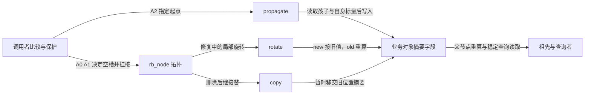
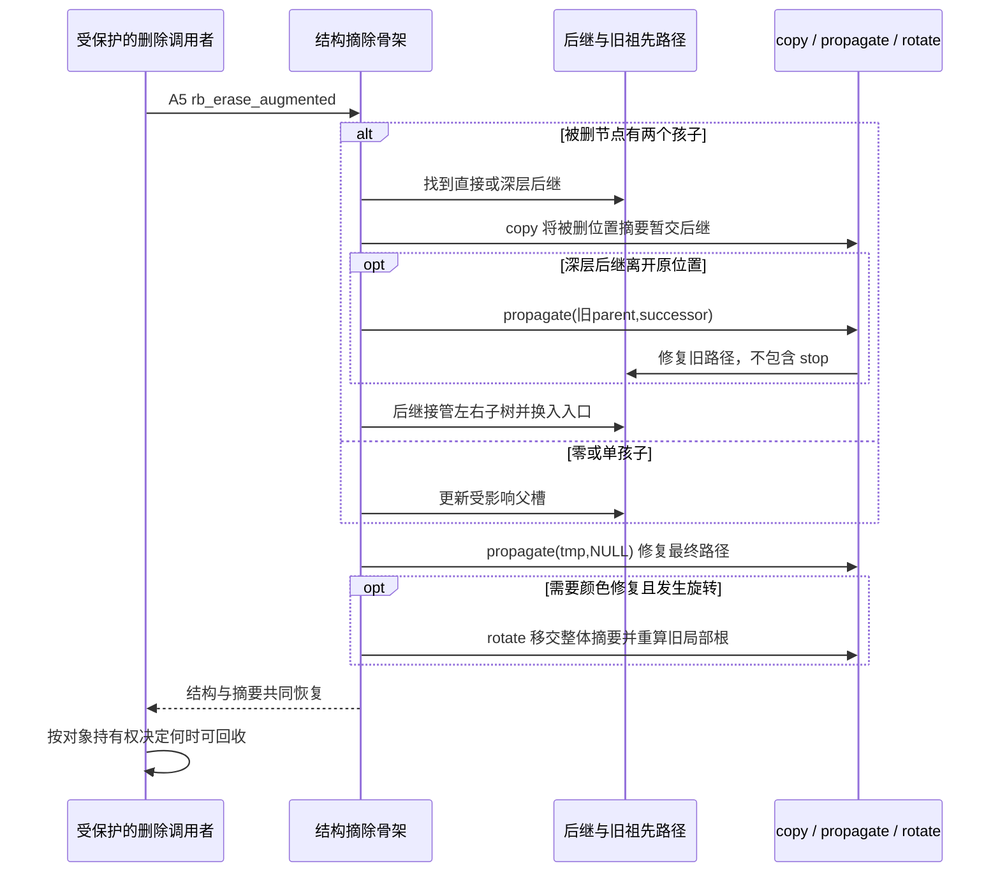

# 第9章\_子树摘要与增强回调导读

[P12 增强单元](../../../../knowledge/linux/data_structures/红黑树_rb-tree/P12_Linux_6.12_内核_rbtree_工程扩展_并发与验证.md#12.3_augmented_rbtree_增强红黑树)已用区间查询推出摘要，本篇依据[固定版本索引](P01_Linux_6.12_rbtree源码阅读索引.md#1.1_固定提交与阅读边界)定位 Linux 6.12.20 的回调触发与字段落点。这里组织阅读次序，宏体和函数体只在实现层展开。

## 9.1\_内核提供事件而业务定义摘要

rb_node 中没有通用的 subtree_last 字段。它由业务结构体持有，回调通过具体 rb 成员还原业务对象，读取自己的原始标量和孩子的摘要，再写自己的摘要。红黑树公共代码只知道何时发生结构变化；回调表把业务规则接到这些变化点。

三组状态——拓扑与颜色、业务载荷、聚合字段——正交存在。A0～A5 是完整操作的阅读阶段，不是内核枚举。当前模块不建立新并发协议：调用者必须保护整个变化窗口；回调中的局部正确不表示所有外部读者已可进入。

## 9.2\_沿A0到A5维护同一份摘要

| 阶段 | 写入位置、写入者与读者 | 退出条件 |
| --- | --- | --- |
| A0 私有准备与搜索 | 调用者填原始范围，维护局部 link/parent；失败前不改祖先 | 有效范围且策略允许接入 |
| A1 初始化和挂接 | 调用者写叶子 subtree_last；rb_link_node 写 rb 字段及空槽 | 新叶子摘要有效，祖先尚待维护 |
| A2 向上传播 | propagate 读取孩子摘要与自身 last，写当前摘要，随后由父重算读取 | 到 stop 之前、根以上或结果未变停止 |
| A3 结构修复 | 修复函数更改父子/颜色；rotate 把 old 摘要移交 new 并重算 old | 修复返回，旋转相关摘要对应新树形 |
| A4 稳定使用 | 查询读取起点、末端和子树摘要；原始 last 变化时从本节点返回 A2 | 整组不变量成立才允许受保护的查询 |
| A5 摘除与退出 | 删除骨架 copy/propagate，必要时旋转回调收尾；调用者另管寿命 | 被删贡献移除、余树摘要正确；回收取决于持有协议 |

A1～A3 先读[增强插入包装](../source_explanations/include/linux/rbtree_augmented.h.md#1.10_增强插入只接入旋转回调)，确认它只传入 rotate，再读[辅助插入](../source_explanations/include/linux/rbtree_augmented.h.md#1.11_缓存增强插入的挂接与传播)中接入之后的 propagate。公共包装没有替业务完成 A0、叶子摘要初始化或失败回滚。

A2 的停止规则在[通用模板](../source_explanations/include/linux/rbtree_augmented.h.md#1.8_通用模板的停止与移交)，标量最大值在[最大值生成器](../source_explanations/include/linux/rbtree_augmented.h.md#1.9_从本节点标量生成最大值)。计算器必须能够比较旧缓存和重新计算值；提前改写缓存会让“未变”判断失去需要传播的信息。

A5 与既有[删除 D0～D4](P04_对象摘除与缺黑修复导读.md#4.2_从对象到缺黑父槽)是同一操作的不同观察面。深层后继先离开旧位置，再接管新位置；前一段传播止于 successor 之前，后一段才从接管完的 successor 上推。对应唯一代码是[结构摘除](../source_explanations/include/linux/rbtree_augmented.h.md#1.3_结构摘除与缺黑父槽)与[两段删除收尾](../source_explanations/include/linux/rbtree_augmented.h.md#1.12_增强删除的两段收尾)。不要复制这段大函数到本导读形成第二处实现展开。

## 9.3\_用故障预测检验回调契约

copy 的临时结果可能仍包含被删对象贡献；rotate 的复制则依赖前后覆盖的是同一对象集合。这两个“复制”虽然都写一个摘要字段，所处阶段和完成含义不同。最大值满足旋转的集合不变性，树高等依赖形状的统计不自动满足。

[完整区间模块](../../../../knowledge/linux/data_structures/红黑树_rb-tree/P12_Linux_6.12_内核_rbtree_工程扩展_并发与验证.md#%281%29_运行完整区间摘要实验)对照原始载荷检查每个摘要，并用点查询看到错误后果。单路径、不回溯的查询对过低和过高摘要都可能漏报，不能由“上界偏大比较保守”直接推断安全。宿主有限枚举与 ARM 前端通过不代替目标构建、装卸或并发验证。

[有界快照检查器](../../../../knowledge/linux/data_structures/红黑树_rb-tree/P12_Linux_6.12_内核_rbtree_工程扩展_并发与验证.md#%281%29_运行有界快照检查器)继续区分原始载荷重算、已存摘要和独立业务成员预期。应在整次操作稳定点检查，不能在 copy 的临时接替状态要求整树已经满足最终摘要；模型不读取未知内核地址。

返回[总索引](P01_Linux_6.12_rbtree源码阅读索引.md#1.2_按问题选择源码入口)。最左缓存是额外入口，与每节点摘要可同时存在，组合包装仍须满足[缓存 C0～C6](P08_最左缓存与结构更新导读.md#8.2_沿接入与摘除跟踪C0到C6)的独立不变量。
