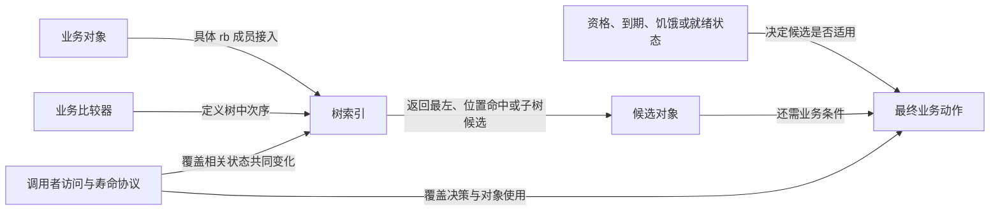

# 第10章\_内核调用场景与选择边界导读

[P12 场景单元](../../../../knowledge/linux/data_structures/红黑树_rb-tree/P12_Linux_6.12_内核_rbtree_工程扩展_并发与验证.md#12.8_Linux_rbtree_在内核中的典型使用场景)已经建立缓存、增强、访问窗口与检查边界。现在沿[固定版本索引](P01_Linux_6.12_rbtree源码阅读索引.md#1.1_固定提交与阅读边界)，看不同使用者把这些部件放在哪里。本页只组织数据结构调用任务，不是定时器、调度器、块层或 epoll 的完整教材。

## 10.1\_先分开索引与决策

一个 rb_root 出现在子系统里，只能证明那里存在一棵树。接下来需要分别追踪：业务对象是谁、嵌入成员是什么、比较器按什么排序、业务最终如何选择、哪些旁路状态也参与决策。

## 10.2\_按排序键和业务问题逐项阅读

| 场景 | 对象、入口与排序 | 业务问题及额外状态 | 具体实现入口 |
| --- | --- | --- | --- |
| 通用 timerqueue / hrtimer | timerqueue_node.node，timerqueue_head.rb_root；expires | 快速取得最早到期对象；是否已到期、硬件时钟重编程和 base lock 属于调用层 | [比较/插入](../source_explanations/lib/timerqueue.c.md#1.1_到期时间决定比较顺序)、[删除返回](../source_explanations/lib/timerqueue.c.md#1.3_删除返回余队列是否非空)、[取首](../source_explanations/include/linux/timerqueue.h.md#1.1_从缓存取最早节点) |
| 公平调度实体 | sched_entity.run_node，cfs_rq.tasks_timeline；deadline | 在资格约束下选择虚拟截止时间较早的候选；vruntime、子树 min_vruntime、当前实体和特性分支参与 | [排序](../source_explanations/kernel/sched/fair.c.md#1.1_树按虚拟截止时间比较)、[资格](../source_explanations/kernel/sched/fair.c.md#1.2_资格由虚拟运行时间另行判定)、[候选选择](../source_explanations/kernel/sched/fair.c.md#1.4_先取合格候选再与当前实体比较) |
| 块请求位置索引 | request.rb_node，mq-deadline 中按方向/优先级组织的 sort_list；blk_rq_pos | 查位置和邻近请求；分发还受 FIFO 到期、批次、读写方向及饥饿条件影响 | [位置接入](../source_explanations/block/elevator.c.md#1.1_按逻辑扇区接入请求)、[查找与删除](../source_explanations/block/elevator.c.md#1.2_请求摘除与位置查找) |
| epoll 注册集合 | epitem.rbn，eventpoll.rbr；file 与 fd 复合键 | 根据文件对象和描述符找到注册项；rdllist/ovflist 承担就绪交付状态 | [复合键](../source_explanations/fs/eventpoll.c.md#1.1_文件对象与描述符组成键)、[查找](../source_explanations/fs/eventpoll.c.md#1.2_持有注册互斥锁后查找)、[插入](../source_explanations/fs/eventpoll.c.md#1.3_注册树的缓存插入) |

timerqueue_add 的 true 表示本次新成最早到期对象，timerqueue_del 的 true 表示删后队列非空，二者不是同一个“操作成功”位；更不能把 timerqueue_del 的返回含义套回 rb_erase_cached。hrtimer 的 enqueue_hrtimer 写 active_bases、state 后调用 timerqueue_add，函数注释要求持有 base lock。按期限排序的是队列，触发时机和时钟设备仍在 hrtimer 更完整的路径中。

公平调度先读 entity_before，再读 vruntime_eligible 和 pick_eevdf。这样会先发现“deadline 决定次序、vruntime 判断资格”这两个轴，而不是沿旧印象把 tasks_timeline 解释成当前版的 vruntime 排序。接着看[入队/出队包装](../source_explanations/kernel/sched/fair.c.md#1.3_入队和出队组合缓存与增强)，把增强摘要接回前文 A0～A5。固定文件还维护 min_slice 等调度状态，本页不将它们压成一份完整时间片或公平性证明。

块层需再到 block/mq-deadline.c 的 __dd_dispatch_request：先处理已有 dispatch、批次或方向条件，然后才在 FIFO 超时和下一个位置候选之间作选择。因此读完 elv_rb_find，不能宣称已经读完“下一条 I/O 怎样决定”。同样，ep_find 的源码前置条件是 ep->mtx 已持有；eventpoll.rbr 与受另一把锁保护的就绪列表不能混成一棵按就绪时间输出的树。

## 10.3\_范围容器的两个不同契约

固定 include/linux/interval_tree_generic.h 的 INTERVAL_TREE_DEFINE 使用子树最大 last 摘要、cached 根和闭区间相交条件，lib/interval_tree.c 为 interval_tree_node 实例化它。与本章的唯一起点点查询示例相比，通用区间树支持不同区间重叠及相交迭代，不应把教学示例的重复起点拒绝政策当作内核通用契约。这里没有复制整份宏体；基本增强回调仍在[唯一增强实现](../source_explanations/include/linux/rbtree_augmented.h.md#1.8_通用模板的停止与移交)展开，进一步阅读可按[固定证据清单](../../linux/SOURCE_BASELINE.md#1.35_rbtree实际调用场景证据)中的上游位置定位。

VMA 的范围存储则沿[Maple 固定阅读索引](../../maple_tree/navigation/P01_Linux_6.12_Maple范围源码阅读索引.md#1.2_按读者问题进入证据)和[P14 范围实例](../../../../knowledge/linux/data_structures/红黑树_rb-tree/P14_Maple_Tree_与_VMA_管理.md#14.1_一个地址为什么需要三种查询)。它处理地址空间里非重叠范围的映射与空洞，不是所有任意重叠区间查询的替代品，更不是公平调度算法的别名。

本批按不可变 Git 对象只读核对十个应用文件；完整文件名和 blob 见[证据清单](../../linux/SOURCE_BASELINE.md#1.35_rbtree实际调用场景证据)。十八个实际展开函数逐字匹配，未编译或运行这些完整子系统，不把调用位置当作性能或目标运行证据。返回[总索引](P01_Linux_6.12_rbtree源码阅读索引.md#1.2_按问题选择源码入口)。
