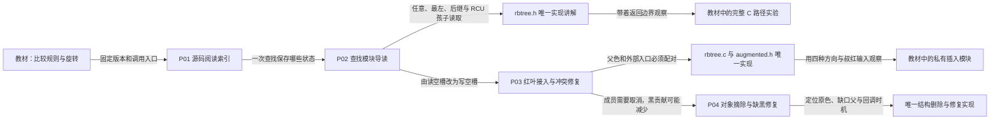

# 第1章\_rbtree源码阅读路线

已经理解搜索树排序与红黑平衡后，这组文档回答特定版本怎样兑现查找、红叶接入和冲突修复。当前已落地查询、插入和删除模块；遍历/替换的原文仍可沿固定源码访问，不把尚未整理的函数列成空章节。

## 1.1\_从查询承诺进入实现

| 入口 | 本篇任务 | 前置和下一步 |
| --- | --- | --- |
| [总阅读索引](navigation/P01_Linux_6.12_rbtree源码阅读索引.md#1.1_固定提交与阅读边界) | 固定提交与实际已落地模块 | 由教材进入，选择查找导读 |
| [查找模块](navigation/P02_查找路径与返回边界导读.md#2.1_谁保存状态谁决定答案) | 定位共享树、局部游标、比较与寿命责任 | 依赖 P09/P10 的业务模型，接到唯一实现 |
| [查找实现](source_explanations/include/linux/rbtree.h.md#1.1_rb_find的任意匹配) | 四个函数与遍历宏的真实语句 | 各节回链模块；不展开 rb_next 的父链实现 |
| [C 路径实验](../../../knowledge/linux/data_structures/红黑树_rb-tree/P10_Linux_6.12_内核_rbtree_查找与返回边界.md#10.2.10_用完整C程序观察相等节点和旧路径) | 观察重复键、旧入口漏查与错误改边 | 串行模型，不是内核或弱内存序实测 |
| [插入模块](navigation/P03_红叶接入与冲突修复导读.md#3.2_一轮插入怎样推进) | 串起空槽、红叶、上推、旋转和回调 | 承接查询与红黑理论，进入实际修复语句 |
| [修复实现](source_explanations/lib/rbtree.c.md#1.3_插入修复的两侧分支)与[父槽实现](source_explanations/include/linux/rbtree_augmented.h.md#1.2_替换父节点或根的入口槽) | 唯一展开功能状态变化 | 继续[私有模块观察](../../../knowledge/linux/data_structures/红黑树_rb-tree/P26_Linux红叶接入与插入修复.md#26.3.15_在内核模块中观察五组插入)，尚不冒充目标已运行 |
| [删除模块](navigation/P04_对象摘除与缺黑修复导读.md#4.2_从对象到缺黑父槽) | 以同一对象地址串起 D0～D4，定位缺黑父槽与同步回调 | 依赖插入和黑高；进入[结构摘除](source_explanations/include/linux/rbtree_augmented.h.md#1.3_结构摘除与缺黑父槽)与[缺黑修复](source_explanations/lib/rbtree.c.md#1.5_缺黑修复的四种转换)，再运行取消模块 |

知识正文负责建立可迁移的机制模型，本组负责固定源码位置与语句边界。共同术语不使两层互为镜像；只有具体函数体在一个实现标题下展开。
