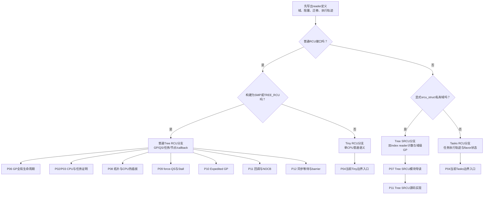

# 第1章\_Linux\_6.12\_RCU源码总阅读索引

## 1.1\_版本边界与总索引职责

本索引对应 NXP Linux 6.12.20、提交 `dfaf2136deb2af2e60b994421281ba42f1c087e0`。它只负责先判断 RCU 家族，再把读者送入独立的模块概念导读和函数实现讲解；不再把普通 Tree RCU、SRCU、Tasks RCU 和 Tiny RCU 写成一条连续状态机。

当前保存配置启用 `CONFIG_TREE_RCU=y` 与 `CONFIG_PREEMPT_RCU=y`，因此普通 Tree RCU 的具体运行分支以抢占式 reader 跟踪为主。Tree SRCU 是另一套私有域实现，不因同处 `kernel/rcu/` 或名字里都有 `Tree` 就共享普通 `rcu_state`。

跨版本概念先从 [RCU 专题大纲](../../../../knowledge/linux/synchronization/rcu/大纲.md#1.1_专题定位)进入。实现家族的稳定选择模型见 [RCU 实现家族与内核配置](../../../../knowledge/linux/synchronization/rcu/P22_RCU_实现家族与内核配置.md#22.2_三个正交维度)。

## 1.2\_第一步必须先判断正在读哪一种RCU

| 家族/实现 | reader是谁 | reader能否主动阻塞 | GP 等待的证据 | 主要入口 |
| --- | --- | --- | --- | --- |
| 普通 Tree RCU | 使用普通 RCU 读侧接口的执行现场 | 否 | CPU QS/EQS；`PREEMPT_RCU` 下再加被抢占任务债务 | `rcu_read_lock()`、`synchronize_rcu()`、`call_rcu()` |
| Tree SRCU | 指定 `srcu_struct` 私有域中的显式 reader | 是 | 双 index 的全 CPU 累计进入/退出计数 | `srcu_read_lock(ssp)`、`synchronize_srcu(ssp)`、`call_srcu(ssp, ...)` |
| Tasks RCU 家族 | 特定任务执行轨迹或显式 trace reader | 取决于 flavor 契约 | 任务扫描、holdout、显式 reader 与必要 IPI | `synchronize_rcu_tasks*()`、`call_rcu_tasks*()` |
| Tiny RCU | 单 CPU 构建中的普通 RCU reader | 仍按普通 RCU 接口契约 | 唯一 CPU 的 QS 与回调阶段 | 调用点仍使用普通 RCU API，由 Kconfig 选择底层实现 |

最容易产生误解的是下面这句话：

> `PREEMPT_RCU` 的 reader **可被调度器抢占**，不等于 reader **可主动睡眠**。

前者由 `task_struct` 与 `rcu_node` blocked-task 状态保存读者债务；后者意味着 reader 主动等待 mutex、I/O 或 completion，需要 SRCU 等明确允许阻塞的机制。把两者都简称“可睡眠/可调度”会直接选错 API 和 GP 证明。

## 1.3\_四条源码阅读分支

图中 P04 目前仍同时承担 Tasks 与 Tiny 的边界导航，这是后续要拆分的源码研究欠账；两者在正文 P22/P24 已明确不是同一种 reader 语义。本轮不得因此把它们的状态机写进普通 Tree RCU 或 SRCU 分支。

## 1.4\_公共接口与检查层先独立出来

以下文件包含多个 RCU 家族可能复用的接口框架、序列辅助或检查适配，但“文件共用”不等于“功能状态机共用”：

| 文件 | 公共职责 | 阅读约束 |
| --- | --- | --- |
| [`include/linux/rcupdate.h`](../../linux/include/linux/rcupdate.h) | 普通 RCU API、指针发布/取得、读侧标记、`kfree_rcu()` | 区分功能语句、Sparse 注解与 Lockdep hook |
| [`include/linux/rculist.h`](../../linux/include/linux/rculist.h) | list/hlist 的 RCU 发布、删除和遍历 | 调用者仍要提供正确的保护域条件 |
| [`kernel/rcu/update.c`](../../linux/kernel/rcu/update.c) | 通用等待 callback、RCU 初始化、Lockdep maps 与查询 | 函数名中的 acquire/release 不代表业务对象已经取得/释放 |
| [`kernel/rcu/rcu.h`](../../linux/kernel/rcu/rcu.h) | `rcu_seq_*` 等 RCU 内部公共辅助 | 序列算法可复用，具体序列属于哪个域仍由拥有者决定 |

公共接口、Sparse 与检查适配的函数体从 [RCU 公共接口与检查机制源码详解](../source_explanations/P01_Linux_6.12_RCU_公共接口与检查机制源码详解.md#1.2_接口与源码索引)进入。RCU Lockdep实例怎样映射到通用 Lockdep 框架，从 [RCU Lockdep适配模块源码概念导读](P05_Linux_6.12_RCU_Lockdep适配模块源码概念导读.md#5.1_模块问题与实现所有权)进入。

## 1.5\_普通Tree\_RCU分支

### 1.5.1\_核心文件地图

| 文件 | 普通 Tree RCU 职责 |
| --- | --- |
| [`kernel/rcu/tree.h`](../../linux/kernel/rcu/tree.h) | `rcu_data`、`rcu_node`、`rcu_state` 与普通 GP 控制字段 |
| [`kernel/rcu/tree.c`](../../linux/kernel/rcu/tree.c) | GP 请求与线程、QS 汇聚、FQS、cleanup、callback core |
| [`kernel/rcu/tree_plugin.h`](../../linux/kernel/rcu/tree_plugin.h) | `PREEMPT_RCU` 与非抢占配置的读侧、调度 QS、blocked task 和 boost |
| [`include/linux/rcu_segcblist.h`](../../linux/include/linux/rcu_segcblist.h)、[`kernel/rcu/rcu_segcblist.c`](../../linux/kernel/rcu/rcu_segcblist.c) | 普通 callback 的代际分段 |
| [`kernel/rcu/tree_exp.h`](../../linux/kernel/rcu/tree_exp.h) | expedited GP 控制路径 |
| [`kernel/rcu/tree_nocb.h`](../../linux/kernel/rcu/tree_nocb.h) | callback offload 与 NOCB 执行者 |
| [`kernel/rcu/tree_stall.h`](../../linux/kernel/rcu/tree_stall.h) | 普通 Tree RCU stall 检测与诊断 |

### 1.5.2\_状态层次不是reader计数树

- `rcu_data` 保存每 CPU 的本地代际观察、QS 债务和 callback；
- `rcu_node` 保存一组 CPU/子节点的分层证明债务与 GP 需求；
- `rcu_state` 保存全局物理 GP 序列、长期 GP kthread、命令和整棵节点树；
- `CONFIG_PREEMPT_RCU` 还把被抢占 reader 保存到每任务字段和叶节点 blocked-task 链表。

普通 Tree RCU 不在 reader 每次进入时向 GP kthread登记一个 reader 对象。正常通信由调度、EQS、任务阻塞/退出和 per-CPU core 在关键事件上形成证据，再沿 `rcu_node` 汇聚。

### 1.5.3\_模块入口

| 阅读任务 | 模块导读 | 函数实现 |
| --- | --- | --- |
| GP 请求、长期 GP kthread、init/FQS/cleanup | [P06 GP 全局生命周期](P06_Linux_6.12_Tree_RCU_GP全局生命周期模块源码概念导读.md#6.1_模块问题与版本边界) | [P05 GP 全局生命周期源码实现](../source_explanations/P05_Linux_6.12_Tree_RCU_GP全局生命周期源码实现.md#5.2_源码符号覆盖账本) |
| 非抢占 CPU QS 与树形报告 | [P02 非抢占式 Tree RCU](P02_Linux_6.12_非抢占式_Tree_RCU_模块源码概念导读.md#2.1_证据目标和配置边界) | [P02 非抢占关键函数](../source_explanations/P02_Linux_6.12_非抢占式_Tree_RCU_关键函数源码实现.md#2.2_函数实现索引) |
| 抢占任务债务与 CPU 债务合流 | [P03 抢占式 Tree RCU](P03_Linux_6.12_抢占式_Tree_RCU_模块源码概念导读.md#3.1_取证问题) | [P03 抢占关键函数](../source_explanations/P03_Linux_6.12_抢占式_Tree_RCU_关键函数源码实现.md#3.2_任务与节点的共享状态实现) |
| 静态树、CPU参与集合与 hotplug callback 迁移 | [P08 拓扑与 CPU 热插拔](P08_Linux_6.12_Tree_RCU_拓扑与CPU热插拔模块源码概念导读.md#8.1_本模块究竟解决什么问题) | [P06 拓扑与 CPU 热插拔源码实现](../source_explanations/P06_Linux_6.12_Tree_RCU_拓扑与CPU热插拔源码实现.md#6.2_源码符号覆盖账本) |
| watching 隐式 QS、FQS 催促与 stall 分类 | [P09 force-QS 与 Stall](P09_Linux_6.12_Tree_RCU_force_QS与Stall模块源码概念导读.md#9.1_为什么GP已经在等还要有force_QS) | [P07 force-QS 与 Stall 源码实现](../source_explanations/P07_Linux_6.12_Tree_RCU_force_QS与Stall源码实现.md#7.2_源码符号覆盖账本) |
| 独立 expedited GP 证明通道 | [P10 Expedited GP](P10_Linux_6.12_Tree_RCU_Expedited_GP模块源码概念导读.md#10.1_Expedited不是普通GP的加速档) | [P08 Expedited GP 源码实现](../source_explanations/P08_Linux_6.12_Tree_RCU_Expedited_GP源码实现.md#8.2_源码符号覆盖账本) |
| callback 分段、批处理与 NOCB 卸载 | [P11 回调与 NOCB](P11_Linux_6.12_Tree_RCU_回调与NOCB模块源码概念导读.md#11.1_GP完成为什么还不等于callback执行) | [P09 回调与 NOCB 源码实现](../source_explanations/P09_Linux_6.12_Tree_RCU_回调与NOCB源码实现.md#9.2_源码符号覆盖账本) |
| `synchronize_rcu()` 等待对象与 `rcu_barrier()` 哨兵证明 | [P12 同步等待与 rcu_barrier](P12_Linux_6.12_Tree_RCU_同步等待与rcu_barrier模块源码概念导读.md#12.1_等RCU至少有三种不同对象) | [P10 同步等待与 rcu_barrier 源码实现](../source_explanations/P10_Linux_6.12_Tree_RCU_同步等待与rcu_barrier源码实现.md#10.2_源码符号覆盖账本) |

这七个模块不是把 `struct rcu_state` 字段按声明顺序切块，而是按独立完成条件分工：普通 GP、CPU/任务 QS、CPU 生命周期、活性催促、expedited 证明、callback 执行、同步/barrier 等待各自拥有不同状态机。跨模块调用只链接唯一实现标题，不复制函数体。

## 1.6\_Tree\_SRCU分支

### 1.6.1\_核心文件地图

| 文件 | Tree SRCU 职责 |
| --- | --- |
| [`include/linux/srcu.h`](../../linux/include/linux/srcu.h) | `srcu_read_lock/unlock()`、`srcu_dereference()` 与同步/异步接口 |
| [`include/linux/srcutree.h`](../../linux/include/linux/srcutree.h) | `srcu_struct`、`srcu_usage`、`srcu_data`、`srcu_node` 和域级状态 |
| [`kernel/rcu/srcutree.c`](../../linux/kernel/rcu/srcutree.c) | 读计数、双 index 扫描、域级 GP work、callback 和同步等待 |

Tree SRCU 的“Tree”主要服务于每域 callback 需求和规模扩展。读者证明仍是指定域中每 CPU 双 index 累计进入/退出的全局配平，不是普通 Tree RCU 的 `qsmask` 清位。

### 1.6.2\_独立入口

- 稳定机制：[SRCU 私有域与双 index 状态机](../../../../knowledge/linux/synchronization/rcu/P23_SRCU_私有域与双_index_状态机.md#23.1_问题场景_注销监听器时不能释放正在睡眠的回调对象)；
- 版本模块导读：[Linux 6.12 Tree SRCU 模块源码概念导读](P07_Linux_6.12_Tree_SRCU模块源码概念导读.md#7.1_先分清Tree_RCU与Tree_SRCU)；
- 唯一实现讲解：[Linux 6.12 Tree SRCU 源码实现](../source_explanations/P11_Linux_6.12_Tree_SRCU源码实现.md#11.2_源码符号覆盖账本)。

Tree SRCU 的 reader 计数、双扫描、callback 需求漏斗、每域 work、同步等待和 barrier 已由 P11 按函数唯一展开。阅读时仍不能跳到普通 Tree RCU GP 实现寻找同名阶段。

## 1.7\_Tasks与Tiny分支

Tasks RCU 等待的是任务执行轨迹，Tiny RCU 是单 CPU 构建对普通 RCU 的底层简化。它们既不是彼此的变体档位，也不是 SRCU：

- Tasks/Tasks Rude/Tasks Trace 的 reader 定义、扫描和 holdout 路径不同；
- Tiny RCU 的调用点仍使用普通 RCU API，只是不需要多 CPU `rcu_node` 汇聚树；
- 一种 flavor 的 GP 完成，不能据名字推导另一种 flavor 也已完成。

稳定边界见 [RCU 实现家族与内核配置](../../../../knowledge/linux/synchronization/rcu/P22_RCU_实现家族与内核配置.md#22.6_Tasks_RCU家族等待的是任务执行轨迹)和 [Tasks RCU 与 Tiny RCU 实现边界](../../../../knowledge/linux/synchronization/rcu/P24_Tasks_RCU与Tiny_RCU实现边界.md#24.1_Tasks_RCU与_Tiny_RCU实现边界)。当前版本化入口见 [Tasks RCU 与 Tiny RCU 模块源码概念导读](P04_Linux_6.12_Tasks_RCU与Tiny_RCU模块源码概念导读.md#4.1_Linux_6.12_Tasks_RCU与_Tiny_RCU模块源码概念导读)，后续应按两种读者任务继续拆分。

## 1.8\_检查机制不能替代功能状态机

阅读任何分支都要把三层证据分开：

| 层 | 例子 | 能证明什么 |
| --- | --- | --- |
| 功能状态 | `gp_seq/qsmask`、SRCU 双 index、Tasks holdout | 该 flavor 的真实安全与进展条件 |
| 静态类型 | `__rcu`、`rcu_check_sparse()` | 已覆盖源码中的指针访问域错误 |
| 动态检查 | `rcu_lock_map`、`srcu_struct.dep_map`、`RCU_LOCKDEP_WARN()` | 已执行路径中的上下文和配对误用 |

检查配置关闭、容量耗尽、路径未执行或缺少 hook 时，“未告警”都不能提升成功能正确性证明。RCU Lockdep具体实现见 [RCU Lockdep适配层源码实现](../source_explanations/P04_Linux_6.12_RCU_Lockdep适配层源码实现.md#4.2_源码符号覆盖账本)。

## 1.9\_建议的源码阅读顺序

1. 先读本章 1.2，写下当前问题的 reader、保护域、主动阻塞和部署条件；没有这一步，不进入函数名搜索。
2. 普通 Tree RCU：先读 [P08 拓扑与 CPU 热插拔](P08_Linux_6.12_Tree_RCU_拓扑与CPU热插拔模块源码概念导读.md#8.2_先定义六个容易被默认理解的名词)，弄清 CPU 位落在哪个叶、current/next 集合如何交接。
3. 再沿 [P06 GP 模块导读](P06_Linux_6.12_Tree_RCU_GP全局生命周期模块源码概念导读.md#6.2_先把四个对象摆到源码现场)掌握需求、长期 GP kthread、init/FQS/cleanup 和物理 GP 序列。
4. 根据配置选择 [非抢占式导读](P02_Linux_6.12_非抢占式_Tree_RCU_模块源码概念导读.md#2.1_证据目标和配置边界)或 [抢占式导读](P03_Linux_6.12_抢占式_Tree_RCU_模块源码概念导读.md#3.1_取证问题)，追 CPU/任务证据怎样进入根完成条件。
5. 沿 [P09 force-QS 与 Stall](P09_Linux_6.12_Tree_RCU_force_QS与Stall模块源码概念导读.md#9.3_状态地址和通信关系)补齐正常等待、远端被动观察、resched 催促和诊断慢路径。
6. 单独进入 [P10 Expedited GP](P10_Linux_6.12_Tree_RCU_Expedited_GP模块源码概念导读.md#10.3_角色状态与通信)，不要把其 sequence、mask、IPI 和 leader 混进普通 GP kthread。
7. 沿 [P11 回调与 NOCB](P11_Linux_6.12_Tree_RCU_回调与NOCB模块源码概念导读.md#11.3_三条数据流必须同时看)追踪 enqueue、目标 GP、DONE 与实际执行；最后读 [P12 同步等待与 barrier](P12_Linux_6.12_Tree_RCU_同步等待与rcu_barrier模块源码概念导读.md#12.1_等RCU至少有三种不同对象)，区分 reader 完成和 callback 执行完成。
8. Tree SRCU：从 [独立模块导读](P07_Linux_6.12_Tree_SRCU模块源码概念导读.md#7.1_先分清Tree_RCU与Tree_SRCU)进入，先读 `srcu.h` 契约与 `srcutree.h` 对象层次，再沿 [Tree SRCU 源码实现](../source_explanations/P11_Linux_6.12_Tree_SRCU源码实现.md#11.4_reader进入退出写的是累计账本)追踪读者账本、双扫描、callback 漏斗、每域 work 和等待交付。
9. Tasks/Tiny：只有 reader 语义或构建条件确实落在该分支时，才进入 [当前边界导读](P04_Linux_6.12_Tasks_RCU与Tiny_RCU模块源码概念导读.md#4.1_Linux_6.12_Tasks_RCU与_Tiny_RCU模块源码概念导读)。
10. 任一分支遇到公共指针宏、Sparse 或 Lockdep 时，再进入 P01/P04 实现讲解；不要让检查层打断功能状态机，也不要用检查函数名推断功能动作。

## 1.10\_总索引验收

1. 能在读源码前判断当前讨论的是普通 RCU、SRCU、Tasks 还是部署层 Tiny。
2. 能解释 `PREEMPT_RCU` 为什么不等于 SRCU 的 sleepable reader。
3. 能指出普通 Tree RCU 的全局 `rcu_state` 与 SRCU 每个 `srcu_struct` 私有域不是同一 GP。
4. 能说明普通 `rcu_node.qsmask` 与 SRCU 双 index 累计计数分别证明什么。
5. 能从 GP、QS、任务债务、SRCU 或检查机制目标进入唯一模块导读，而不是在一个总文件里混读函数。
6. 能从拓扑、普通 GP、QS、FQS、expedited、callback/NOCB、同步/barrier 任一专有名词进入独立模块导读和唯一函数实现标题。
7. 能说明 GP 完成、同步等待者返回、callback 成熟和 callback 实际执行是四个不同状态点。

专题入口：[RCU 专题大纲](../../../../knowledge/linux/synchronization/rcu/大纲.md#1.1_专题定位)。
