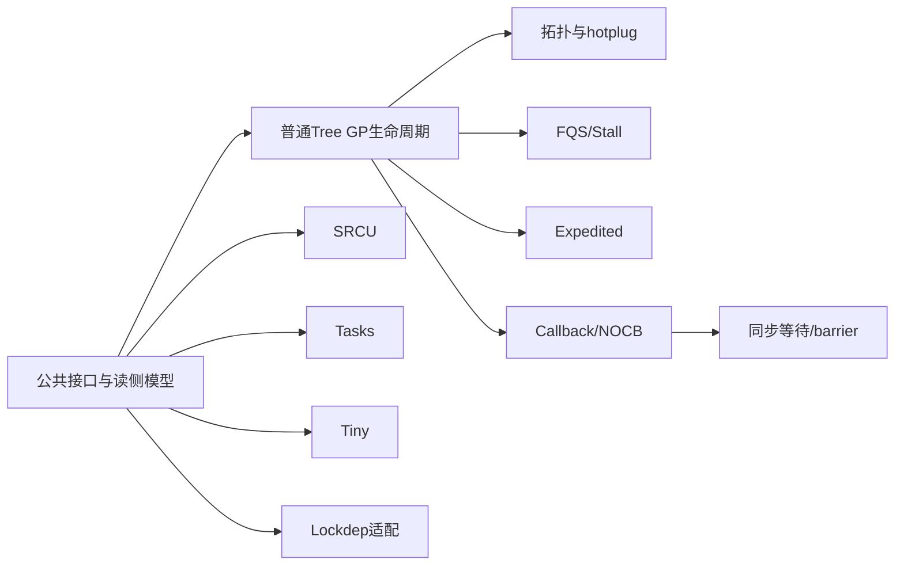

# 第1章\_Linux\_6.12\_RCU源码总阅读索引

## 1.1\_版本边界与总索引职责

本目录以 NXP `linux-imx` 官方发布标签 `lf-6.12.20-2.0.0`、提交 `dfaf2136deb2af2e60b994421281ba42f1c087e0`、Linux 6.12.20 为固定源码身份。既有 RCU 配置快照确认 `CONFIG_TREE_RCU=y`、`CONFIG_PREEMPT_RCU=y`；其他配置分支属于同一固定源码的条件阅读，不伪装成该快照的运行结果。

总索引承担三项职责：先建立分类坐标；按功能模块选择概念导读；再从模块导读进入具体宏、字段和函数体的唯一实现标题。它不复制知识正文，也不把文件列表冒充机制解释。

完整源码身份、保存规则和哈希证据见 [Linux 源码阅读基线](../../linux/SOURCE_BASELINE.md#1.5.1_RCU家族证据)。跨版本机制和应用主线从 [RCU 专题大纲](../../../../knowledge/linux/synchronization_and_asynchrony/synchronization/rcu/大纲.md#1.1_专题定位)进入。

## 1.2\_先建立源码分类坐标

| 轴 | 先问什么 | Linux 6.12 主要位置 |
| --- | --- | --- |
| 保护域 | 普通对象 reader、SRCU 私有域还是任务 / trace 轨迹 | `tree*`、`srcutree.c`、`tasks.h` |
| 底层实现 | 普通 RCU 在 [SMP 构建](../../../../knowledge/foundations/computer_architecture/cache_coherence/P01_缓存一致性问题与缓存行.md#1.1.3_Linux中的CONFIG_SMP表示构建能力)上走 Tree，还是在 `CONFIG_SMP=n`、`!PREEMPT_RCU` 构建中走 Tiny | `tree.c` / `tiny.c` 与 Kconfig |
| Tree 读侧模型 | reader 被抢占时只欠 CPU 证据，还是增加任务债务 | `tree_plugin.h`、`sched.h` |
| GP 策略 | normal 还是 expedited | `tree.c` / `tree_exp.h` |
| callback 策略 | 普通 per-CPU 还是 NOCB | `tree.c`、`tree_nocb.h`、`rcu_segcblist.c` |
| 检查层 | 功能状态还是 Lockdep/Sparse 影子状态 | `update.c`、`rcupdate.h`、`Kconfig.debug` |

不要从某个函数名反推整套类别。`rcu_read_lock_sched()` 是普通 RCU 的上下文包装；NOCB 改 callback 执行位置；PREEMPT_RCU 改被抢占 reader 的债务保存；它们不会各自创建一套完整 GP 系统。

## 1.3\_模块主轴与配置比较轴



普通 Tree RCU 的非抢占 / 抢占分支只在 A 以及节点完成条件中比较。GP、callback、barrier、NOCB 等公共模块不按配置复制整条调用链。

## 1.4\_模块概念导读入口

| 顺序 | 模块导读 | 读者任务 | 对应知识正文 |
| --- | --- | --- | --- |
| P02 | [公共接口与读侧模型](P02_Linux_6.12_RCU公共接口与读侧模型模块源码概念导读.md#2.1_模块问题与配置边界) | 公共 API 在哪里分流；CPU 债务与任务债务怎样比较并合流 | [P03 公共接口闭环](../../../../knowledge/linux/synchronization_and_asynchrony/synchronization/rcu/P03_RCU_通用API与最小使用闭环.md#3.3_完整同步实现)、[P06 R0～R7 读侧阶段](../../../../knowledge/linux/synchronization_and_asynchrony/synchronization/rcu/P06_Tree_RCU_读侧执行模型与配置差异.md#6.6_一组统一阶段怎样覆盖两种配置) |
| P03 | [Tree RCU GP 全局生命周期](P03_Linux_6.12_Tree_RCU_GP全局生命周期模块源码概念导读.md#3.1_模块问题与版本边界) | 请求漏斗、长期 GP kthread、S0～S9 和完成发布 | [P05 公共 S0～S9](../../../../knowledge/linux/synchronization_and_asynchrony/synchronization/rcu/P05_Tree_RCU_公共骨架与完整周期.md#5.5_S0到S9的一次完整周期)、[P08 物理 GP 生命周期](../../../../knowledge/linux/synchronization_and_asynchrony/synchronization/rcu/P08_Tree_RCU_GP请求与全局生命周期.md#8.9_S0到S10_一轮物理GP的统一生命周期) |
| P04 | [拓扑与 CPU 热插拔](P04_Linux_6.12_Tree_RCU_拓扑与CPU热插拔模块源码概念导读.md#4.1_本模块究竟解决什么问题) | 静态树、CPU 参与集合和 callback 所有权怎样交接 | P07、P10、P17 |
| P05 | [force-QS 与 Stall](P05_Linux_6.12_Tree_RCU_force_QS与Stall模块源码概念导读.md#5.1_为什么GP已经在等还要有force_QS) | 被动观察、催促和三类 stall 时间线 | P14 |
| P06 | [Expedited GP](P06_Linux_6.12_Tree_RCU_Expedited_GP模块源码概念导读.md#6.1_Expedited不是普通GP的加速档) | 独立序列、漏斗、CPU 选择、IPI 与共享安全条件 | P15 |
| P07 | [Callback 与 NOCB](P07_Linux_6.12_Tree_RCU_回调与NOCB模块源码概念导读.md#7.1_GP完成为什么还不等于callback执行) | 分段、执行、bypass 和 GP/CB 线程交接 | P11、P12、P16 |
| P08 | [同步等待与 rcu_barrier](P08_Linux_6.12_Tree_RCU_同步等待与rcu_barrier模块源码概念导读.md#8.1_等RCU至少有三种不同对象) | 等 GP、等一个 callback 与等历史 callback 的区别 | P13 |
| P09 | [Tree SRCU](P09_Linux_6.12_Tree_SRCU模块源码概念导读.md#9.1_先分清Tree_RCU与Tree_SRCU) | 私有域、双 index reader 证明和 callback 需求树 | P18 |
| P10 | [Tasks RCU](P10_Linux_6.12_Tasks_RCU模块源码概念导读.md#10.1_模块问题与三个flavor) | 共享控制骨架与 Tasks/Rude/Trace 的 flavor 证据 | P19 |
| P11 | [Tiny RCU](P11_Linux_6.12_Tiny_RCU模块源码概念导读.md#11.1_模块问题与单CPU前提) | 单 CPU 怎样保留普通 RCU 的 QS 与 callback 边界 | P20 |
| P12 | [RCU Lockdep 适配](P12_Linux_6.12_RCU_Lockdep适配模块源码概念导读.md#12.1_模块问题与实现所有权) | 功能状态、检查器影子状态和配置退化 | P23、P24 |

表中“对应知识正文”只是读者任务映射，不要求两层文档逐句同步。知识正文建立稳定因果模型；模块导读固定版本化文件、状态地址和函数协作。

## 1.5\_唯一实现讲解入口

| 实现文档 | 唯一展开范围 |
| --- | --- |
| [P01 公共接口与检查机制](../source_explanations/P01_Linux_6.12_RCU_公共接口与检查机制源码详解.md#1.2_接口与源码索引) | 发布、取得、同步入口、Sparse 与 RCU Lockdep 宏 |
| [P02 CPU QS 与节点汇聚](../source_explanations/P02_Linux_6.12_Tree_RCU_等待桥_QS与节点汇聚关键函数源码实现.md#2.1_实现讲解边界与入口) | GP 变化感知、CPU QS 和节点上报 |
| [P03 抢占读者债务](../source_explanations/P03_Linux_6.12_Tree_RCU_抢占读者债务关键函数源码实现.md#3.1_实现讲解边界与入口) | 任务嵌套、blocked-task 登记和清债 |
| [P04 RCU Lockdep 适配层](../source_explanations/P04_Linux_6.12_RCU_Lockdep适配层源码实现.md#4.1_实现所有权与读者目标) | map 定义、acquire/release、查询与 callback 上下文 |
| [P05 GP 全局生命周期](../source_explanations/P05_Linux_6.12_Tree_RCU_GP全局生命周期源码实现.md#5.2_源码符号覆盖账本) | 请求、线程、init、FQS、cleanup 与序列 |
| [P06 拓扑与 CPU 热插拔](../source_explanations/P06_Linux_6.12_Tree_RCU_拓扑与CPU热插拔源码实现.md#6.2_源码符号覆盖账本) | 节点构建、参与集合和 callback 迁移 |
| [P07 force-QS 与 Stall](../source_explanations/P07_Linux_6.12_Tree_RCU_force_QS与Stall源码实现.md#7.2_源码符号覆盖账本) | watching 快照、FQS 扫描和 stall 检测 |
| [P08 Expedited GP](../source_explanations/P08_Linux_6.12_Tree_RCU_Expedited_GP源码实现.md#8.2_源码符号覆盖账本) | expedited 序列、漏斗、CPU 选择、handler 与等待 |
| [P09 Callback 与 NOCB](../source_explanations/P09_Linux_6.12_Tree_RCU_回调与NOCB源码实现.md#9.2_源码符号覆盖账本) | 分段队列、batch、bypass 和双线程 |
| [P10 同步等待与 barrier](../source_explanations/P10_Linux_6.12_Tree_RCU_同步等待与rcu_barrier源码实现.md#10.2_源码符号覆盖账本) | `synchronize_rcu()`、哨兵、entrain 与全队列扫描 |
| [P11 Tree SRCU](../source_explanations/P11_Linux_6.12_Tree_SRCU源码实现.md#11.2_源码符号覆盖账本) | reader 累计账本、双扫描、callback 与 barrier |

P02 与 P03 是同一读侧模块中的公共 CPU 路径和 PREEMPT_RCU 增量，不是非抢占 / 抢占两套完整系统。

## 1.6\_建议的源码阅读顺序

首次阅读普通 Tree RCU：

```text
知识正文P01-P06
    → 本索引P01
    → P02公共接口与读侧模型
    → P03 GP生命周期
    → P04拓扑与hotplug
    → P07 callback/NOCB
    → P08同步等待/barrier
    → 按问题选P05/P06慢路径
```

比较其他家族时，从分类坐标直接进入 P09 SRCU、P10 Tasks 或 P11 Tiny，不必先读完普通 Tree 的所有优化模块。

## 1.7\_实验与观察入口

[晚到读者与抢占读者实验](../../../../labs/kernel/rcu/P01_晚到读者与抢占读者/README.md#1.1_实验要回答的两个问题)对应 P02 的两个结论，并可选观察抢占任务登记 / 清债和 GP event。实验没有覆盖 callback、NOCB、hotplug 和 stall 的完整运行闭环；对这些模块，本目录只提供版本化源码和 trace 入口，不夸大为已完成实验。

## 1.8\_总索引验收

开始追源码前，应能回答：

1. 当前调用点属于普通 RCU、SRCU 还是 Tasks 域；
2. Tree/Tiny 与 PREEMPT_RCU 分别在哪条轴；
3. 当前问题属于 reader、GP、汇聚、callback、等待还是慢路径模块；
4. 需要的是模块协作导读，还是某个函数体的唯一实现讲解；
5. 目标配置与固定源码基线能支持哪些结论。

无法回答时先回到 1.2 节分类，不要从 `kernel/rcu/` 的任意搜索结果开始拼调用链。

## 1.9\_职责边界

总索引只负责分流读者任务，不承担某个函数体的第二份解释。模块导读必须先就地讲清参与者、状态地址和调用协作；实现文档再提供裁剪源码、中文 Doxygen、上下文和副作用。若某个函数尚无唯一实现标题，应明确记录证据缺口，不能用一串原始源码链接替代讲解。
