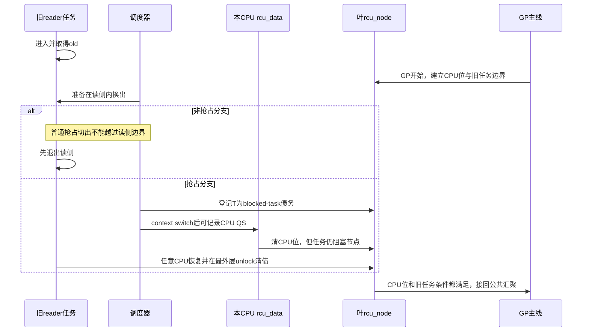

# 第2章\_Linux\_6.12\_RCU公共接口与读侧模型模块源码概念导读

## 2.1\_模块问题与配置边界

本篇回答一个版本化源码阅读问题：普通 RCU 的公共 API 在 Linux 6.12.20 中从哪里进入，Tree RCU 的非抢占 / 抢占读侧分支各增加什么状态，又怎样重新接回共同的 CPU QS、节点汇聚和 GP 完成主线。

它不会按配置各复制一次 `synchronize_rcu()`、GP kthread、callback 和 `rcu_barrier()`。那些公共模块分别进入 P03～P08；本篇只组织公共接口、读侧进入/退出、context switch 和 blocked-task 债务。

源码身份固定为：

| 项目 | 边界 |
| --- | --- |
| 官方仓库 | `https://github.com/nxp-imx/linux-imx.git` |
| 发布标签 / 提交 | `lf-6.12.20-2.0.0` / `dfaf2136deb2af2e60b994421281ba42f1c087e0` |
| 内核版本 | Linux 6.12.20 |
| 已核对 RCU 配置快照 | `CONFIG_TREE_RCU=y`、`CONFIG_PREEMPT_RCU=y` |

非抢占分支用于比较 `!CONFIG_PREEMPT_RCU` 源码条件，不表示该已核对运行配置实际走该分支。完整身份和文件哈希边界见 [Linux 源码阅读基线](../../linux/SOURCE_BASELINE.md#1.5.1_RCU家族证据)。

## 2.2\_先固定公共调用场景

```c
/* reader：公共接口不暴露Tree/Tiny和抢占分支。 */
rcu_read_lock();
obj = rcu_dereference(active_obj);
use(obj);
rcu_read_unlock();

/* writer：公共同步语义。 */
old = rcu_replace_pointer(active_obj, new_obj, true);
synchronize_rcu();
kfree(old);
```

源码阅读要分清两条线：

1. **对象协议线**：发布、取得和回收契约由公共头文件与调用者代码建立；
2. **证明实现线**：Tree RCU 根据构建配置用 CPU 债务，或 CPU + 被抢占任务债务证明旧 reader 结束。

`rcu_dereference()` 返回的仍是同一个对象地址；本篇不会把它误写成对象副本。若指针要离开读侧，需要上层生命周期协议，见知识正文的 [RCU、kref 与复合对象生命周期](../../../../knowledge/linux/synchronization_and_asynchrony/synchronization/rcu/P21_RCU_kref与复合对象生命周期.md#21.1_先按分配与所有权拓扑选模板)。

## 2.3\_源码文件与实现所有权

| 文件 | 本模块中的职责 | 不应从这里推出什么 |
| --- | --- | --- |
| `include/linux/rcupdate.h` | 公共读侧包装、发布/取得、Sparse 与部分 Lockdep 桥接 | 不包含完整 Tree GP 状态机 |
| `kernel/rcu/update.c` | 通用初始化、等待桥、读侧状态查询和检查 map | 不代表所有 callback 都在这里执行 |
| `kernel/rcu/tree_plugin.h` | PREEMPT_RCU 与非 PREEMPT_RCU 插件分支、调度 QS、blocked task | 不拥有全局 GP 请求主循环 |
| `include/linux/sched.h` | 抢占 reader 的每任务字段 | 字段存在不等于任务已登记到节点 |
| `kernel/rcu/tree.c` | context-switch 接口、CPU QS 上报和公共 Tree 主线 | 不应把所有配置差异都归到同一函数体 |
| `kernel/rcu/tree.h` | `rcu_data`、`rcu_node`、`rcu_state` 的结构定义 | 结构声明本身不能证明状态顺序 |

推荐先读公共接口，再看 `tree_plugin.h` 的配置分支，最后追 `tree.c` 如何消费两种分支产生的证据。

## 2.4\_共同职责与差异矩阵

| 子模块 | 共同输入 | 非抢占分支 | 抢占分支 | 共同出口 |
| --- | --- | --- | --- | --- |
| 读侧进入 | `rcu_read_lock()` | 通过禁止普通抢占维持 CPU 不变量 | 增加当前任务嵌套状态 | reader 可安全取得当前对象 |
| 读侧退出 | `rcu_read_unlock()` | 恢复抢占条件 | 最外层退出可能走特殊清债 | reader 不再使用临时旧指针 |
| context switch | 当前任务将离开 CPU | 读侧内不会被普通抢占切走 | 若切出旧 reader，先登记到叶节点 | CPU 之后可以形成本地 QS |
| CPU 上报 | `rcu_data` 已记录 QS | 清节点 CPU 位 | 同样清 CPU 位，但不得越过旧任务集合 | 进入 `rcu_node` 公共汇聚 |
| 节点门控 | CPU 位已清 | `qsmask==0` 可继续传播 | 还要求本轮 `gp_tasks` 为空 | 共同向父节点 / 根传播 |

源码阅读只在差异列展开条件分支，公共出口不再复制。

## 2.5\_非抢占分支的最小调用链

非抢占普通读侧把“任务是否仍持有旧指针”压缩成 CPU 不变量：任务若还在读侧，普通抢占不能把它换出，因此一个发生在 GP 边界之后的合法 CPU QS 足以排除该 CPU 上的既有旧 reader。

阅读顺序：

```text
rcu_read_lock()/unlock的非PREEMPT_RCU分支
    → 调度或EQS路径形成本地QS
    → rcu_qs()记录本CPU证据
    → rcu_report_qs_rdp()进入叶节点
    → rcu_report_qs_rnp()沿树汇聚
```

本分支不维护一张普通 reader 任务表。GP 开始时建立的是保守 CPU 债务，随后由事件排除旧 reader 的可能性。

## 2.6\_抢占分支为什么必须增加任务债务

抢占式 reader 可以在临界区内被换出，所以 context switch 前必须判断当前任务是否持有旧读侧债务。若是，源码将任务和叶节点连接起来：

```text
current->RCU读侧嵌套状态
    +
current->登记节点/链表位置
    +
rcu_node.blkd_tasks与gp_tasks边界
```

阅读顺序：

```text
__rcu_read_lock()维护任务嵌套
    → rcu_note_context_switch()进入插件钩子
    → rcu_preempt_ctxt_queue()把任务登记到叶节点
    → CPU仍可单独报告自己的QS
    → 节点同时检查qsmask和gp_tasks
    → 任务在任意CPU最外层unlock
    → 从原登记节点删除并恢复传播
```

任务迁移不改变债务归属：任务字段保存原登记节点，unlock 不根据当前 CPU 猜测应该修改哪片 `blkd_tasks`。

## 2.7\_GP开始前后被抢占的任务怎样分界

共享 blocked-task 链表可能同时包含不同代际的 reader。实现不能把 GP 开始后才被抢占的新 reader 误算成本轮旧债务，也不能漏掉 GP 开始前已经被换出的旧 reader。

因此节点除了链表头，还需要本轮边界指针：

- 任务入队时根据当前 GP 状态决定它是否阻塞当前轮；
- GP 初始化时接管边界前已经登记的旧任务；
- 任务删除时更新边界，并判断当前轮旧任务集合是否归零；
- CPU 报告路径即使看到 `qsmask==0`，也要同时检查 blocked-reader 条件。

这是一组代际边界，而不是“链表空才结束所有 GP”的简单规则。

## 2.8\_端到端状态与通信



正常路径主要通过每任务、每 CPU 和节点共享状态通信；没有为每个 reader 广播 IPI。FQS、resched、IPI 和 boost 属于长时间无进展时的慢路径，由 P05/P06 对应模块解释。

## 2.9\_唯一实现讲解入口

| 实现问题 | 唯一展开位置 |
| --- | --- |
| 公共发布、取得、同步等待入口与检查分支 | [RCU 公共接口与检查机制源码详解](../source_explanations/P01_Linux_6.12_RCU_公共接口与检查机制源码详解.md#1.2_接口与源码索引) |
| 非抢占 CPU QS 与节点上报 | [Tree RCU CPU QS 与节点汇聚关键函数源码实现](../source_explanations/P02_Linux_6.12_Tree_RCU_等待桥_QS与节点汇聚关键函数源码实现.md#2.1_实现讲解边界与入口) |
| 抢占读侧嵌套、任务登记、迁移后清债 | [Tree RCU 抢占读者债务关键函数源码实现](../source_explanations/P03_Linux_6.12_Tree_RCU_抢占读者债务关键函数源码实现.md#3.1_实现讲解边界与入口) |

这三篇实现文档按函数所有权拆分，不代表三套完整 RCU：P01 是公共接口，P02 是 CPU QS / 公共汇聚，P03 只展开 PREEMPT_RCU 增量。

## 2.10\_实验和源码结论怎样配对

[晚到读者与抢占读者实验](../../../../labs/kernel/rcu/P01_晚到读者与抢占读者/README.md#1.1_实验要回答的两个问题)提供两类可观察证据：晚到任务只取得新代际；已取得旧对象的 reader 被非自愿抢占后，GP 仍等待最外层 unlock。

可选 trace 将 `rcu_preempt_task`、`rcu_unlock_preempted_task` 和 GP event 对齐。trace 事件缺失只说明配置或观测入口不足，不能反证源码状态机不存在。

## 2.11\_建议阅读顺序与验收

1. 先从 `rcupdate.h` 判断调用点使用哪个公共接口和保护域；
2. 再从 Kconfig 判断 Tree/Tiny 与 PREEMPT_RCU 分支；
3. 只追本篇模块的 reader / context-switch / QS 入口；
4. 遇到 GP、callback、barrier 或 FQS 时转到对应模块导读；
5. 需要核对函数体时才进入 2.9 节的唯一实现标题。

完成后应能画出两种配置在同一个模块矩阵中的差异，并明确指出它们在哪个节点条件重新合流，而不是背两条重复的完整调用链。

上一篇：[Linux 6.12 RCU 源码总阅读索引](P01_Linux_6.12_RCU源码总阅读索引.md)。

下一篇：[Tree RCU GP 全局生命周期模块源码概念导读](P03_Linux_6.12_Tree_RCU_GP全局生命周期模块源码概念导读.md)。
