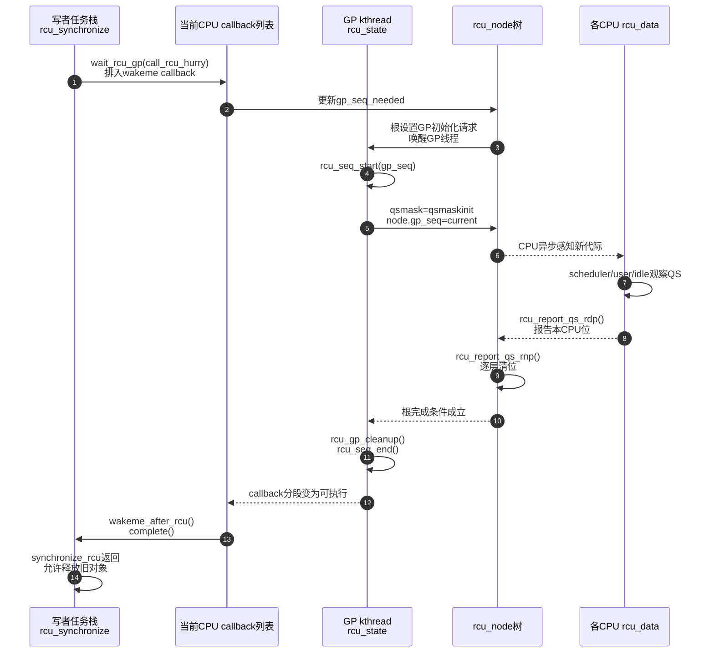

# 第2章\_Linux\_6.12\_非抢占式\_Tree\_RCU\_模块源码概念导读

## 2.1\_证据目标和配置边界

本章不是另一篇 RCU 教程，而是[非抢占式 Tree RCU 源码同步机制](../../../../knowledge/linux/synchronization/rcu/P06_非抢占式_Tree_RCU_源码同步机制.md)的版本化取证记录。目标是让每个抽象箭头都能落到 Linux 6.12.20 的文件、字段和函数。

已核对源码快照的顶层 `Makefile` 给出 `6.12.20`，对应 `.config` 启用了 `CONFIG_PREEMPT_RCU=y`。因此非抢占实现不能直接拿该配置生成的镜像运行验证；本章读取同一源码中 `tree_plugin.h` 的 `#else /* CONFIG_PREEMPT_RCU */` 和 `rcupdate.h` 的非抢占配置分支。

仓库保存的以下原始源码已与 NXP 官方 `linux-imx` 仓库发布标签 `lf-6.12.20-2.0.0`、提交 `dfaf2136deb2af2e60b994421281ba42f1c087e0` 对应文件逐一核对，SHA-256 一致；本地工作树位置不作为证据身份，统一记录见 [Linux 源码阅读基线](../../linux/SOURCE_BASELINE.md)：

- [`kernel/rcu/tree.c`](../../linux/kernel/rcu/tree.c)
- [`kernel/rcu/tree.h`](../../linux/kernel/rcu/tree.h)
- [`kernel/rcu/tree_plugin.h`](../../linux/kernel/rcu/tree_plugin.h)
- [`kernel/rcu/update.c`](../../linux/kernel/rcu/update.c)
- [`include/linux/rcupdate.h`](../../linux/include/linux/rcupdate.h)

行号用于本次 6.12.20 快照定位；跨版本阅读应以函数和字段为稳定入口，不应把行号当 API。

## 2.2\_先固定一段应用代码

```c
mutex_lock(&update_lock);
old_obj = rcu_replace_pointer(global_ptr, new_obj,
			      lockdep_is_held(&update_lock));
mutex_unlock(&update_lock);
synchronize_rcu();
kfree(old_obj);
```

`update_lock` 串行化多个更新者，并让 Lockdep 能在已覆盖的运行路径上核对 `rcu_replace_pointer()` 的保护声明。`synchronize_rcu()` 放在解锁之后，避免让其他更新者无谓地陪同等待 GP。

需要证明的不是“源码里存在 `synchronize_rcu()`”，而是：

```text
调用线程如何提交等待
    → 哪个执行上下文开始GP
    → 等待集合写到哪里
    → CPU怎样感知代际并产生QS
    → 本地证据怎样进入共享树
    → 根节点怎样得出完成结论
    → 原调用线程怎样醒来
```

## 2.3\_源码文件与状态所有权

| 层 | 字段或对象 | 6.12.20 位置 | 写入者 |
| --- | --- | --- | --- |
| 等待调用 | 栈上 `struct rcu_synchronize`、`completion`、`rcu_head` | `include/linux/rcupdate_wait.h:16-33` | 调用 `synchronize_rcu()` 的任务与回调执行器 |
| 全局 GP | `rcu_state.gp_seq/gp_flags/gp_wq/gp_kthread` | `kernel/rcu/tree.h::struct rcu_state` | GP kthread、GP 请求路径 |
| 树节点 | `rcu_node.gp_seq/qsmask/qsmaskinit/qsmaskinitnext` | `tree.h:41-59` | GP 初始化与 QS 汇聚路径 |
| 每 CPU | `rcu_data.gp_seq/cpu_no_qs/core_needs_qs/mynode/grpmask` | `tree.h:178-190` | 本 CPU RCU core 与节点传播路径 |
| EQS/watching | `context_tracking.state`、`CT_RCU_WATCHING` | `kernel/context_tracking.c`、`include/linux/context_tracking_state.h` | user/idle/异常出入路径 |
| 回调等待 | 每 CPU `rcu_segcblist` | `tree.h::rcu_data.cblist` | `call_rcu`、GP 加速和 callback 批处理 |

注意 6.12.20 的 dynticks watching 主状态已经在 context tracking 状态中；不能照搬 5.10，把 `dynticks_nesting` 和 `atomic_t dynticks` 写成当前 `rcu_data` 字段。

## 2.4\_调用链A\_默认synchronize\_rcu如何等待

### 2.4.1\_入口选择

`kernel/rcu/tree.c:4096` 的 `synchronize_rcu()` 先做 lockdep/合法性检查，然后进入 `synchronize_rcu_normal()`。6.12.20 普通路径受 `rcu_normal_wake_from_gp` 控制：

```text
默认值0
    → wait_rcu_gp(call_rcu_hurry)

非默认直接唤醒优化
    → rcu_sr_normal_add_req()
    → start_poll_synchronize_rcu()
    → 等待GP cleanup批量完成请求
```

正文默认机制必须先解释默认值 0 的 callback 路径，不能把可选优化写成唯一实现。

### 2.4.2\_栈上等待对象

`include/linux/rcupdate_wait.h:16-33` 定义 `struct rcu_synchronize` 和 `wait_rcu_gp()` 宏。宏在调用者栈上建立一个或多个等待对象，再调用 `kernel/rcu/update.c:411::__wait_rcu_gp()`。

`__wait_rcu_gp()` 对每个对象：

1. 初始化 completion；
2. 通过传入的 `call_rcu_hurry()` 排队 `rcu_head`；
3. 等待 completion。

GP 结束、回调可执行时，`update.c:402::wakeme_after_rcu()` 从 `rcu_head` 找回栈上对象并调用 `complete()`。所以同步等待者的“唤醒通知”是 callback 完成，不是 GP kthread 直接扫描任意睡眠任务。

### 2.4.3\_回调怎样提出GP需求

`call_rcu_hurry()` 最终进入 `__call_rcu_common()`，把 callback 放到当前 CPU 的分段列表。回调加速路径沿叶节点向根更新 `gp_seq_needed`；根节点若发现需要新 GP，就设置 `RCU_GP_FLAG_INIT` 并唤醒 `rcu_gp_kthread`。

这段因果关系是：

```text
synchronize_rcu等待者
    → 排入一个在GP后完成的callback
    → callback需要未来GP
    → 节点gp_seq_needed把需求汇聚到根
    → gp_flags唤醒GP kthread
```

不是“同步调用者自己接管全局 RCU 树并逐 CPU 轮询”。

## 2.5\_调用链B\_GP开始并建立保守等待集合

`kernel/rcu/tree.c:2221::rcu_gp_kthread()` 的循环按以下顺序推进：

```text
等待GP请求
    → rcu_gp_init()
    → rcu_gp_fqs_loop()
    → rcu_gp_cleanup()
```

`tree.c:1796::rcu_gp_init()` 首先用 `rcu_seq_start(&rcu_state.gp_seq)` 开始新代际。完成 CPU hotplug 协调后，它广度优先遍历 `rcu_node` 树，在各节点锁下从 `qsmaskinit` 生成本轮 `qsmask`，并公布节点代际。对应实现和逐句中文注释见 [`rcu_gp_init()` 建立本轮等待集合](../source_explanations/P02_Linux_6.12_非抢占式_Tree_RCU_关键函数源码实现.md#2.4_rcu_gp_init建立本轮等待集合)。

叶节点 `qsmaskinit` 的每一位对应相关 CPU；上层节点位对应子节点。这里没有先查询哪个任务读了 `old_obj`。所有相关 CPU 被保守纳入，之后谁能立即证明自己已经在 EQS，谁就能很快清位。

## 2.6\_调用链C\_CPU感知新GP

`tree.c:1265::__note_gp_changes()` 在叶节点锁保护下比较节点与本 CPU 代际。看到新 GP 后，它更新：

```text
rdp->gp_seq = rnp->gp_seq
rdp->cpu_no_qs.b.norm = 叶qsmask中是否仍有rdp->grpmask
rdp->core_needs_qs = 同一债务的core处理标记
```

因此 GP 初始化节点状态与每 CPU 真正感知之间允许有窗口。代际比较使旧 GP 的迟到报告不能误清新 GP 的位。

本地状态的语义不是“本 CPU 有 reader”，而是“本 CPU 对当前代际还没有提供足够 QS 证明”。

## 2.7\_调用链D\_上下文切换怎样产生普通QS

`kernel/sched/core.c:6615::__schedule()` 在关本地中断后调用 `rcu_note_context_switch(preempt)`。在 `!CONFIG_PREEMPT_RCU` 分支中，该调度钩子通过 `rcu_qs()` 清除本 CPU 的普通 QS 债务。两个函数的实现见 [`rcu_note_context_switch()` 与 `rcu_qs()` 记录静止态](../source_explanations/P02_Linux_6.12_非抢占式_Tree_RCU_关键函数源码实现.md#2.6_rcu_note_context_switch与rcu_qs记录静止态)。

其安全依据来自 `include/linux/rcupdate.h:91-101` 的非抢占读侧封装：读侧进入禁止抢占，最外层退出恢复抢占。带 Doxygen 阅读说明和中文注释的源码见 [`__rcu_read_lock()` 与 `__rcu_read_unlock()` 实现](../source_explanations/P02_Linux_6.12_非抢占式_Tree_RCU_关键函数源码实现.md#2.6_rcu_note_context_switch与rcu_qs记录静止态)。

一个合法普通 reader 不能在禁抢占读侧内被普通调度切走。因此 GP 开始以后的真实 context switch 足以证明该 CPU 上 GP 开始前的普通旧读侧已经结束。

普通 `rcu_read_unlock()` 只重新允许调度；真正 QS 通常由后续 scheduler/user/idle/offline 路径产生。`CONFIG_RCU_STRICT_GRACE_PERIOD` 是刻意增加报告动作和开销的测试/严格例外，不能用于描述默认快路径。

## 2.8\_调用链E\_user和idle怎样提供EQS证据

Linux 6.12.20 的关键入口是：

| 场景 | 入口 | 源码位置 |
| --- | --- | --- |
| idle 进入/退出 | `ct_idle_enter()` / `ct_idle_exit()` | `kernel/context_tracking.c:317/333` |
| user 进入/退出 | `__ct_user_enter()` / `__ct_user_exit()` | `context_tracking.c:468/610` |
| watching 状态改变 | `ct_kernel_exit_state()` / `ct_kernel_enter_state()` | `context_tracking.c:81/101` |

这些路径更新每 CPU `context_tracking.state` 中的 `CT_RCU_WATCHING` 状态。GP 的强制扫描通过 `rcu_watching_snap_save()`、`rcu_watching_snap_recheck()` 和 `rcu_watching_snap_stopped_since()` 读取代际快照，证明 CPU 自某个观察点以来一直不在普通内核 RCU watching 区，或者已经越过一次 EQS 边界。

这是一条 **共享状态被动观察** 路径，不要求 idle CPU 为每个 GP 主动执行 reader 解登记。CPU 退出 EQS 时仍要重新进入 watching，以免内核读侧在未跟踪状态下运行。

## 2.9\_调用链F\_本地QS怎样进入rcu\_node树

本地 `cpu_no_qs.b.norm=false` 只是第一阶段。每 CPU `tree.c:2787::rcu_core()` 调用：

```text
rcu_check_quiescent_state(rdp)
    → 必要时__note_gp_changes()
    → 检查core_needs_qs与cpu_no_qs
    → rcu_report_qs_rdp(rdp)
```

`tree.c:2393::rcu_report_qs_rdp()` 在叶节点锁下重新校验：

```text
CPU报告的gp_seq仍等于节点gp_seq
叶qsmask中CPU位仍然存在
本地cpu_no_qs已经表示观察到QS
```

验证通过后清 `core_needs_qs`，并调用 `tree.c:2289::rcu_report_qs_rnp()`。这就是“本地观察到 QS”与“共享 `qsmask` 清位”之间允许存在异步窗口的源码位置。

## 2.10\_调用链G\_节点证据怎样逐层汇聚

`rcu_report_qs_rnp(mask, rnp, gps, flags)` 在当前节点锁下执行：

1. 比较 `rnp->gp_seq` 与报告代际 `gps`，拒绝过期报告；
2. 确认当前 `mask` 尚在 `qsmask` 中；
3. `qsmask &= ~mask`；
4. 若当前节点仍有其他位，结束本次传播；
5. 若清零，把当前节点 `grpmask` 作为父节点待清位继续循环；
6. 到根节点后调用 `rcu_report_qs_rsp()` 唤醒 GP 推进逻辑。

所以每个 CPU 不直接争用一个全局 CPU 位图。缓存一致性成本先集中在叶节点锁和缓存行，再沿树逐层收敛；只有某个节点从非零变零时才触及上一层。

## 2.11\_调用链H\_GP完成怎样回到同步写者

GP kthread 的 FQS 循环看到根完成条件成立后，进入 `tree.c:2100::rcu_gp_cleanup()`：

1. 计算结束后的 `new_gp_seq`；
2. 广度优先更新各 `rcu_node.gp_seq`；
3. `rcu_seq_end(&rcu_state.gp_seq)` 结束全局代际；
4. 让每 CPU callback 分段状态看到 GP 完成；
5. 唤醒需要执行 callback 的 RCU core/nocb 上下文。

默认 `synchronize_rcu()` 等待 callback 在可执行阶段调用 `wakeme_after_rcu()`，后者 `complete()` 栈上等待对象，原写者才返回并执行 `kfree(old_obj)`。

完整通信方向如下：



## 2.12\_Linux\_5.10对照点

Linux 5.10 的 GP 树与普通同步主线已经具备相同骨架，但阅读时有两个明显版本差异：

1. 5.10 的 EQS/dynticks 状态仍主要位于 `rcu_data.dynticks_nesting`、`dynticks_nmi_nesting` 与 `atomic_t dynticks`，典型函数名包括 `rcu_eqs_enter()`、`rcu_idle_enter()`、`rcu_user_enter()`、`rcu_momentary_dyntick_idle()`；6.12 已迁到通用 context tracking 状态与 `ct_*` 入口。
2. 6.12 的 `rcu_state.srs_next`、等待尾指针和 cleanup work 支持普通同步等待者的直接批处理优化；5.10 不应查找这些字段，默认从该版 `synchronize_rcu()` 的 callback 等待链追踪。

不能只比较同名函数是否存在，还要比较状态到底存放在哪个结构、由哪个上下文更新。

## 2.13\_公共接口源码讲解入口

本章只保留非抢占式 Tree RCU 特有的 GP、QS、树形汇聚与等待者唤醒调用链。演示代码涉及的公共接口只在[公共接口与检查机制源码详解](../source_explanations/P01_Linux_6.12_RCU_公共接口与检查机制源码详解.md#1.1_源码详解边界与引用入口)展开一次：

- [`rcu_replace_pointer()`](../source_explanations/P01_Linux_6.12_RCU_公共接口与检查机制源码详解.md#1.3_rcu_replace_pointer接口实现)
- [`rcu_dereference_protected()`](../source_explanations/P01_Linux_6.12_RCU_公共接口与检查机制源码详解.md#1.5_rcu_dereference_protected功能与检查路径)
- [`synchronize_rcu()`](../source_explanations/P01_Linux_6.12_RCU_公共接口与检查机制源码详解.md#1.4_synchronize_rcu接口实现)
- [`RCU_LOCKDEP_WARN()`](../source_explanations/P01_Linux_6.12_RCU_公共接口与检查机制源码详解.md#1.7_RCU_LOCKDEP_WARN检查适配层)

## 2.14\_复核清单

完成本章源码阅读后，应能回答：

1. `synchronize_rcu()` 的调用者睡在哪里，谁调用 `complete()`？
2. `gp_seq_needed`、`gp_flags` 与 GP kthread 的关系是什么？
3. `qsmaskinit` 和 `qsmask` 为什么不能都解释成“当前 reader 集合”？
4. `rdp->cpu_no_qs=false` 后，为什么叶节点位可能暂时仍为一？
5. 过期 CPU 报告由哪个代际检查拒绝？
6. 非抢占读侧为什么允许 scheduler context switch 成为证明边界？
7. user/idle 的证明是主动逐 GP 上报，还是 watching 状态的快照观察？
8. 根完成以后，同步写者为什么不是由 `rcu_report_qs_rnp()` 直接唤醒？

阅读索引：[Linux 6.12 Tree RCU 与 SRCU 源码导读](P01_Linux_6.12_Tree_RCU_与_SRCU_源码导读.md)。

下一篇：[Linux 6.12 抢占式 Tree RCU 模块源码概念导读](P03_Linux_6.12_抢占式_Tree_RCU_模块源码概念导读.md)。
