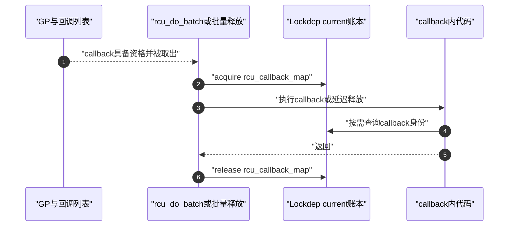

# 第5章\_Linux\_6.12\_RCU\_Lockdep适配模块源码概念导读

## 5.1\_模块问题与实现所有权

本模块回答一个交叉问题：RCU 没有实体 mutex，却为什么会出现 `rcu_lock_map`、`rcu_bh_lock_map`、`rcu_sched_lock_map` 和 `rcu_callback_map`，这些对象怎样把 RCU 调用条件交给 Lockdep 检查？

实现所有权分成两层：

| 层次 | 负责回答 | 权威入口 |
| --- | --- | --- |
| Lockdep 通用框架 | map 怎样映射到 lock class，acquire/release 怎样维护 `current->held_locks[]`，查询怎样匹配实例 | [Linux 6.12 Lockdep 源码导读](../../lockdep/navigation/P01_Linux_6.12_Lockdep源码导读.md#1.1_基线与阅读目标) |
| RCU 适配层 | 四个 map 为什么分开、参数怎样选择、在哪些 RCU 路径登记、由哪些 RCU 条件消费 | [RCU Lockdep适配层源码实现](../source_explanations/P04_Linux_6.12_RCU_Lockdep适配层源码实现.md#4.1_实现所有权与读者目标) |

前缀 `lockdep` 表明使用的框架，不等于全部内容都归 Lockdep 专题。通用算法只在 Lockdep 展开一次，RCU 实例和接入时序只在 RCU 展开一次。

## 5.2\_先区分功能状态与检查影子状态

同一次 `rcu_read_lock()` 同时推进两条不同因果链：

```text
功能路径
    → __rcu_read_lock()、preempt_disable()或local_bh_disable()
    → 建立当前RCU实现真正依赖的读侧约束

检查路径
    → rcu_lock_acquire(&对应map)
    → Lockdep在current账本登记逻辑范围
    → 后续held查询、断言或RCU_LOCKDEP_WARN消费
```

功能路径决定 RCU 正确性；检查路径只验证已经执行到的调用协议。map 不是锁字，不会排斥其他 CPU，也不参与 GP、QS、回调成熟或对象释放。

callback 形成第三个阶段：它既不是 reader 进入，也不是 GP 协调。GP 已完成并且 callback 真正开始执行时，`rcu_callback_map` 才把“当前正处于 RCU 延迟动作范围”登记给 Lockdep。

## 5.3\_参与者、状态地址与通信方向

| 参与者 | 状态位置 | 写入或登记动作 | 读取或消费动作 |
| --- | --- | --- | --- |
| RCU 公共 inline API | `include/linux/rcupdate.h` | 在功能动作内侧调用 acquire/release | 不保存共享功能状态 |
| 四个全局 map | `kernel/rcu/update.c` | 静态 key、名称和 wait type 建立稳定身份 | 地址传给 Lockdep 和查询调用点 |
| 当前任务 | `current->held_locks[]` | Lockdep acquire 写入、release 删除 | `lock_is_held()` 按 map 实例扫描 |
| RCU held 查询 | `kernel/rcu/update.c` | 不写状态 | 组合 map、抢占/BH、watching 和 online 条件 |
| RCU 告警与断言 | `rcupdate.h`、`tree.c` 等 | 命中时写告警一次性状态 | 消费 held 谓词或业务锁条件 |
| callback 执行者 | `rcu_do_batch()`、批量释放路径 | callback 前 acquire、返回后 release | callback 内部受保护条件查询 |

map 的全局地址提供身份，真正随进入/退出变化的当前影子状态位于任务的 held stack。多个任务可以同时记录指向同一个 RCU map 的 held record，不发生互斥。

## 5.4\_三条调用链怎样闭环

### 5.4.1\_读侧登记链


普通、BH 和 sched 三种 API 使用不同 map，因为精确断言必须区分调用者经过了哪一种入口。嵌套范围需要 acquire/release 逐层配对，不能压成一个布尔位。

具体参数和源代码顺序见 [`rcu_lock_acquire()` 与 `rcu_lock_release()`](../source_explanations/P04_Linux_6.12_RCU_Lockdep适配层源码实现.md#4.4.1_rcu_lock_acquire和rcu_lock_release包装参数)。

### 5.4.2\_查询与告警链

```text
RCU访问器、断言或同步等待入口
    → 先判断Lockdep是否可依赖、CPU是否watching/online
    → 查询精确map或读取可证明的功能上下文
    → RCU_LOCKDEP_WARN或WARN_ON_ONCE报告已覆盖违规
```

`rcu_read_lock_held()`、`rcu_read_lock_bh_held()` 和 `rcu_read_lock_sched_held()` 不使用完全相同的最终条件。它们是在不同 API 语义下给出调试答案，不是读取同一个 RCU 功能布尔值。

具体分支见 [held查询怎样消费三种读侧map](../source_explanations/P04_Linux_6.12_RCU_Lockdep适配层源码实现.md#4.6_held查询怎样消费三种读侧map)，公共告警宏见 [`RCU_LOCKDEP_WARN()` 检查适配层](../source_explanations/P01_Linux_6.12_RCU_公共接口与检查机制源码详解.md#1.6_RCU_LOCKDEP_WARN检查适配层)。

### 5.4.3\_callback上下文链



callback map 只证明当前路径经过了 RCU 的延迟动作执行包装。对象为什么可以访问仍由该子系统的入口封闭、GP 和对象状态协议证明。

具体源码、Maple Tree 消费点和修改风险见 [`rcu_callback_map` 怎样标记延迟动作上下文](../source_explanations/P04_Linux_6.12_RCU_Lockdep适配层源码实现.md#4.7_rcu_callback_map怎样标记延迟动作上下文)。

## 5.5\_配置怎样改变检查能力

```text
PROVE_LOCKING
    ├→ LOCKDEP
    ├→ DEBUG_LOCK_ALLOC
    └→ PROVE_RCU
```

不能把这些配置视为一个开关：

- `DEBUG_LOCK_ALLOC=y` 时四个 map 和 acquire/release tracking 可以存在；
- `PROVE_RCU=y` 时 `RCU_LOCKDEP_WARN()` 才执行相应 RCU 动态检查；
- `DEBUG_LOCK_ALLOC=n` 时 map 定义消失，事件 wrapper 为空操作，held 查询使用保守 inline；
- 关闭检查不改变 RCU 功能契约，也不能用“查询返回 1”证明真实读侧存在。

完整配置矩阵见 [配置关闭时对象和查询怎样退化](../source_explanations/P04_Linux_6.12_RCU_Lockdep适配层源码实现.md#4.8_配置关闭时对象和查询怎样退化)。

## 5.6\_建议阅读顺序与修改目标

1. 先读本章 5.1～5.3，分清实现所有权、功能状态和检查影子状态；
2. 进入[声明、定义、key与静态生命期](../source_explanations/P04_Linux_6.12_RCU_Lockdep适配层源码实现.md#4.3_声明定义key与静态生命期)，理解四个全局身份为什么分开；
3. 阅读[进入与退出怎样写入检查器影子状态](../source_explanations/P04_Linux_6.12_RCU_Lockdep适配层源码实现.md#4.4_进入与退出怎样写入检查器影子状态)，逐项核对 wrapper 参数和事件顺序；
4. 阅读[四个map怎样落到Lockdep当前账本](../source_explanations/P04_Linux_6.12_RCU_Lockdep适配层源码实现.md#4.5_四个map怎样落到Lockdep当前账本)，再跳转 Lockdep 通用 held-stack 实现；
5. 分别追踪[读侧查询](../source_explanations/P04_Linux_6.12_RCU_Lockdep适配层源码实现.md#4.6_held查询怎样消费三种读侧map)与[callback 上下文](../source_explanations/P04_Linux_6.12_RCU_Lockdep适配层源码实现.md#4.7_rcu_callback_map怎样标记延迟动作上下文)；
6. 最后使用[修改影响矩阵](../source_explanations/P04_Linux_6.12_RCU_Lockdep适配层源码实现.md#4.9_修改RCU适配层时必须保持什么)，判断新增域、改 wait type、改事件顺序或改配置分支会影响哪些调用方和验证。

读完后不应只会说“RCU 接入 Lockdep”，而应能从一个 map 的 `extern` 追到定义、key、事件登记、current 影子记录、查询消费者和关闭配置，并能预测局部修改的影响范围。

## 5.7\_边界与后续阅读

本章没有展开：

- Lockdep lock class 注册、依赖图、链缓存和 held stack 的通用函数体；这些内容回到 Lockdep 源码专题；
- RCU GP、QS 和 callback 资格算法；这些内容回到 Tree RCU 模块导读和关键函数实现；
- Sparse `__rcu` address space；它属于编译期类型检查，不是运行时 map，`__CHECKER__` 与 `rcu_check_sparse()` 的唯一实现讲解见[静态类型桥接实现](../source_explanations/P01_Linux_6.12_RCU_公共接口与检查机制源码详解.md#1.3.3_rcu_check_sparse静态类型桥接)；
- Maple Tree dead node 的完整生命周期；这里只展示它怎样消费 callback 身份。

总阅读索引：[Linux 6.12 RCU 源码总阅读索引](P01_Linux_6.12_RCU源码总阅读索引.md#1.9_建议的源码阅读顺序)。

具体实现：[Linux 6.12 RCU Lockdep适配层源码实现](../source_explanations/P04_Linux_6.12_RCU_Lockdep适配层源码实现.md#4.1_实现所有权与读者目标)。

稳定知识：[RCU 类型语义、Sparse 与 Lockdep](../../../../knowledge/linux/synchronization/rcu/P26_RCU_类型语义_Sparse与Lockdep.md#26.1.5_Lockdep检查的是哪一个运行时条件)。
