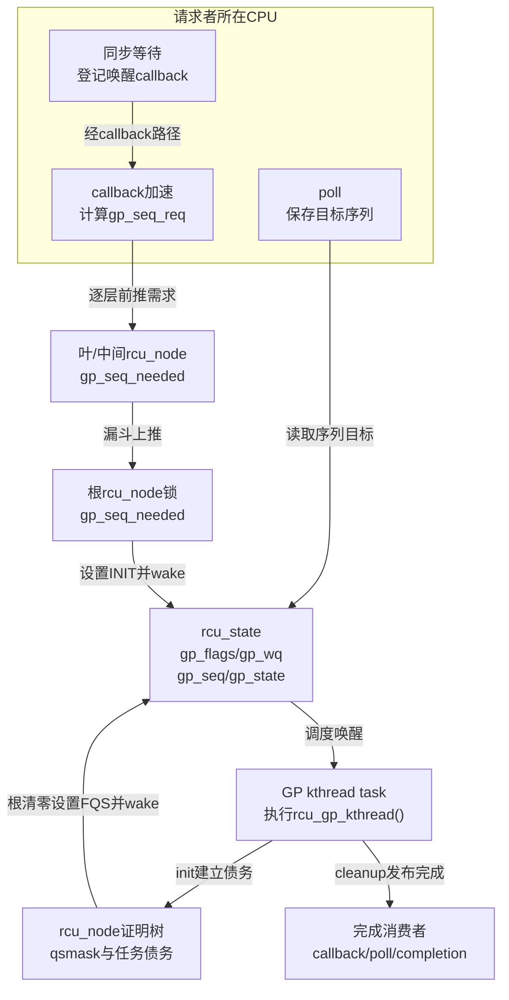

# 第6章\_Linux\_6.12\_Tree\_RCU\_GP全局生命周期模块源码概念导读

## 6.1\_模块问题与版本边界

本章回答“普通 Tree RCU 怎样把许多 GP 需求合并成串行的物理 GP，并由一个长期 GP kthread 完成开始、等待和 cleanup”。对应源码基线为 NXP Linux 6.12.20、提交 `dfaf2136deb2af2e60b994421281ba42f1c087e0`，配置边界为 `CONFIG_TREE_RCU=y` 与 `CONFIG_PREEMPT_RCU=y`。

先读稳定机制正文的 [GP 究竟是什么](../../../../knowledge/linux/synchronization/rcu/P12_Tree_RCU_GP请求与全局生命周期.md#12.1_本章先回答GP究竟是什么)，再用本章定位文件、对象、状态和阅读顺序。具体宏体与函数体只在 [GP 全局生命周期源码实现](../source_explanations/P05_Linux_6.12_Tree_RCU_GP全局生命周期源码实现.md#5.2_源码符号覆盖账本)唯一展开。

本章不讲 SRCU GP。SRCU 的 reader 是指定 `srcu_struct` 私有域中的双 index 计数，不读写普通 `rcu_state.gp_kthread`；应转入 [Tree SRCU 模块源码概念导读](P07_Linux_6.12_Tree_SRCU模块源码概念导读.md#7.1_先分清Tree_RCU与Tree_SRCU)。

## 6.2\_先把四个对象摆到源码现场

| 对象 | 源码身份 | 生命周期 | 作用 |
| --- | --- | --- | --- |
| GP 请求 | `gp_seq_needed` 与 `gp_flags` 中的目标/命令 | 从请求产生到目标代际满足 | 声明“至少需要完成到哪里” |
| 物理 GP | 一次 `rcu_seq_start()` 到 `rcu_seq_end()` | 单轮 | 执行全局安全证明 |
| GP kthread 任务 | `rcu_state.gp_kthread` 指向的 `task_struct` | 初始化后长期存在 | 串行推进许多物理 GP |
| GP kthread 入口 | `rcu_gp_kthread()` 函数 | 线程整个运行期反复调用 | 等请求、init、FQS、cleanup |

所以 `gp_kthread` 既可能指一个字段中的任务指针，也可能出现在入口函数名中。阅读时必须写清“任务对象”还是“执行函数”。源码没有每个 GP 一个 `gp_thread` 的对象模型。

## 6.3\_源码文件与状态所有权

| 上游相对位置 | 关键对象或函数 | 本模块职责 |
| --- | --- | --- |
| [`kernel/rcu/tree.h`](../../linux/kernel/rcu/tree.h) | `struct rcu_state`、`RCU_GP_FLAG_*`、`RCU_GP_*` | 全局线程指针、等待队列、命令和观察阶段 |
| [`kernel/rcu/rcu.h`](../../linux/kernel/rcu/rcu.h) | `rcu_seq_start/end/snap/done()` | 代际开始、完成和目标判断 |
| [`kernel/rcu/tree.c`](../../linux/kernel/rcu/tree.c) | `rcu_state`、spawn、request、wake、init、FQS、cleanup、主循环 | 普通 Tree RCU GP 控制主线 |
| [`kernel/rcu/update.c`](../../linux/kernel/rcu/update.c) | `__wait_rcu_gp()`、`wakeme_after_rcu()` | 默认同步等待怎样接入 callback 完成边界 |
| [`include/linux/rcu_segcblist.h`](../../linux/include/linux/rcu_segcblist.h) | callback 分段结构 | callback 怎样保存目标代际；详细状态机另见 P17 |

全局 `gp_seq/gp_kthread/gp_wq/gp_flags/gp_state` 位于 `rcu_state`。源码注释把这组字段放在根 `rcu_node` 锁保护区内；请求漏斗中的每层 `gp_seq_needed` 则由对应节点锁保护。GP kthread 不是唯一写者：请求 CPU 会写需求和 INIT 命令，最后一条根报告会写 FQS 命令，GP kthread消费命令并写物理代际与观察阶段。

### 6.3.1\_先通过rcu\_state阅读门再追字段

`struct rcu_state` 还包含 `rcu_barrier()`、expedited GP、FQS/stall、CPU hotplug、同步等待者批处理和 NOCB 配置字段。它是多个子机制的全局汇合地址，不是一轮普通 GP 的单一状态机。阅读本模块时按下面的门分流：

| 当前看到的字段 | 先回答的问题 | 去向 |
| --- | --- | --- |
| `gp_seq/gp_kthread/gp_wq/gp_flags/gp_state` | 普通物理 GP 怎样被请求和推进 | 本模块与 P05 实现讲解 |
| `node[]/level[]/ncpus/n_online_cpus` | 树和 CPU 集合怎样建立 | P11/P14/P21 |
| `gp_seq_polled*`、`srs_*` | poll 或同步等待者怎样消费 GP 完成 | P12/P20 |
| `cbovld*`、`jiffies_*`、`gp_activity*` | FQS 节奏、过载与 stall 怎样观察活性 | P15/P18 |
| `barrier_*` | 怎样等待此前 callback 实际执行 | P20 |
| `exp_*`、`expedited_*` | 加速 GP 的独立证明通道 | P16 |
| `nocb_*` | callback offload 配置怎样协调 | P19 |

完整逐字段读写账本和几处源码短注释的误读纠正，见 [`rcu_state` 完整字段域与权威去向](../source_explanations/P05_Linux_6.12_Tree_RCU_GP全局生命周期源码实现.md#5.3.1_完整字段域与权威去向)。模块导读只沿普通 GP 所需字段前进，不把其他子状态机重新展开一遍。



## 6.4\_S0到S9\_源码调用阶段

| 阶段 | 主要函数 | 状态流 | 阅读问题 |
| --- | --- | --- | --- |
| S0 创建 | `rcu_spawn_gp_kthread()` | 新 `task_struct` → `rcu_state.gp_kthread` | 为什么线程只创建一次 |
| S1 提交 | callback acceleration → `rcu_start_this_gp()` | `gp_seq_req` → 各层 `gp_seq_needed` | 请求怎样合并 |
| S2 唤醒 | `rcu_gp_kthread_wake()` | `gp_flags` 已有命令 → `swake_up_one(gp_wq)` | 共享状态与唤醒怎样配对 |
| S3 接受 | `rcu_gp_kthread()` 内层等待 | `WAIT_GPS→DONE_GPS` | 为什么伪唤醒要重试 |
| S4 开始 | `rcu_gp_init()` | `rcu_seq_start()`、hotplug 集合、`qsmask` | 怎样封闭本轮等待集合 |
| S5 等待 | `rcu_gp_fqs_loop()` | `WAIT_FQS↔DOING_FQS` | 正常证据不足时怎样重试 |
| S6 汇聚 | `rcu_report_qs_rdp/rnp()` | per-CPU 证据 → 节点位清零 | 怎样形成根结论 |
| S7 根通知 | `rcu_report_qs_rsp()` | `gp_flags|=FQS` → wake | 为什么这里只叫醒而不 cleanup |
| S8 发布 | `rcu_gp_cleanup()` | 节点完成值 → 全局 `rcu_seq_end()` | 为什么先节点后全局 |
| S9 后继 | `rcu_future_gp_cleanup()` 与 INIT 保留 | 未满足 `gp_seq_needed` → 下一轮 | 太晚请求怎样进入 N+1 |

这些阶段只有一条物理 GP 控制主线，但它们依赖请求、证明和交付三组外围状态。不要把函数调用顺序误读成所有状态都由 GP kthread 私有保存。

## 6.5\_线程怎样创建并安全发布

初始化阶段的主线是：

```text
early_initcall(rcu_spawn_gp_kthread)
    → kthread_create(rcu_gp_kthread, ...)
    → 可选设置SCHED_FIFO优先级
    → 根节点锁下更新活动时间
    → smp_store_release(&rcu_state.gp_kthread, task)
    → wake_up_process(task)
```

源码在发布指针前先重置 `gp_activity/gp_req_activity`，再用 release store 写 `gp_kthread`，明确约束这些写入不能跑到任务指针发布之后。请求路径读取指针主要用于判断任务是否已经存在并可唤醒；不能只凭一个 `READ_ONCE(gp_kthread)` 擅自扩张成对任意初始化字段的 acquire 契约。线程创建后会一直存在，后续每轮 GP 只改变它处理的状态，不重新分配任务对象。

这段初始化还会创建 NOCB、boost/core 与 expedited 执行者。它们的名字都与 RCU 有关，但职责不同；不能把 `rcu_spawn_gp_kthread()` 理解为“创建一个线程执行全部 RCU 工作”。

具体源码见 [`rcu_spawn_gp_kthread()` 创建并发布长期任务](../source_explanations/P05_Linux_6.12_Tree_RCU_GP全局生命周期源码实现.md#5.5_rcu_spawn_gp_kthread创建并发布长期任务)。

## 6.6\_请求漏斗为什么不是全局热锁

`rcu_start_this_gp()` 从请求 CPU 的叶节点开始。每到一层，它都先判断：

1. 这一层是否已经记录相同或更远的 `gp_seq_needed`；
2. 请求的代际是否已经开始；
3. 非叶层是否已经观察到一轮进行中的 GP。

任一条件成立都可提前退出，因为已有状态足以保证后续 init 或 cleanup 看见需求。只有尚未被覆盖的请求才继续获取父节点锁，最后到根设置 INIT。因此许多 CPU 请求同一代际时，后来的请求往往停在叶或中间节点，不必全部写根缓存行。

请求路径返回 true 只表示“调用者有理由唤醒 GP kthread”，不表示 GP 已经开始。具体实现见 [`rcu_start_this_gp()` 漏斗记录未来需求](../source_explanations/P05_Linux_6.12_Tree_RCU_GP全局生命周期源码实现.md#5.6_rcu_start_this_gp漏斗记录未来需求)。

## 6.7\_一次唤醒怎样进入主循环和初始化

`rcu_gp_kthread_wake()` 先检查任务指针、命令状态和是否需要避免普通进程上下文中的自唤醒，再写调试时间并唤醒 `gp_wq`。等待队列只负责把线程从睡眠改成可运行；何时真正运行由调度器决定，所以“wake”与“立即开始 GP”不是同一事件。

主循环有内外两层：内层等待 INIT 并反复调用 `rcu_gp_init()`，只有返回 true 才进入外层本轮 FQS 与 cleanup。若是伪唤醒或请求已经被别处满足，init 返回 false，线程回到等待。

`rcu_gp_init()` 随后：

1. 在根锁下消费 `gp_flags` 并确认没有普通 GP 正在进行；
2. `rcu_seq_start(&rcu_state.gp_seq)` 发布新代际开始；
3. 协调 hotplug，把下一轮在线集合转成本轮稳定集合；
4. 广度优先遍历节点，从 `qsmaskinit` 建立 `qsmask`；
5. 在抢占配置下把 GP 前已阻塞任务接入任务债务；
6. 将节点 `gp_seq` 与全局代际对齐。

广度优先初始化期间，其他 CPU 主要从叶节点观察代际。同一个 GP kthread 同时负责完成整个初始化和后续等待，因此初始化尚未结束时不会有另一条控制主线越过它完成本轮 GP。

具体实现见 [`rcu_gp_kthread()` 串联一轮物理 GP](../source_explanations/P05_Linux_6.12_Tree_RCU_GP全局生命周期源码实现.md#5.8_rcu_gp_kthread串联一轮物理GP)和 [`rcu_gp_init()` 开始代际并建立证明债务](../source_explanations/P05_Linux_6.12_Tree_RCU_GP全局生命周期源码实现.md#5.9_rcu_gp_init开始代际并建立证明债务)。

## 6.8\_FQS循环和根完成通知怎样协作

`rcu_gp_fqs_loop()` 在 `gp_wq` 上进行带超时等待，唤醒原因可能是：

- 根节点已经没有 CPU/任务债务；
- 到了下一次 FQS 扫描时机；
- 外部路径设置 `RCU_GP_FLAG_FQS`；
- callback 过载要求更快扫描；
- 信号或伪唤醒等需要重新检查的事件。

每次醒来都重新读取根条件。FQS 只能观察 EQS、设置 urgent/resched、发送必要探测或启动 boost，不能凭超时把未知参与者判为安全。

当 `rcu_report_qs_rnp()` 清到根时，它调用 `rcu_report_qs_rsp()`：设置 FQS 位、释放根锁、唤醒 GP kthread。这里不直接调用 cleanup，是因为最后报告者可能处在中断、softirq 或其他不适合执行全树 cleanup 的上下文，而且全局发布仍必须由串行控制线程完成。

具体实现见 [FQS 循环与根完成通知](../source_explanations/P05_Linux_6.12_Tree_RCU_GP全局生命周期源码实现.md#5.10_FQS循环与根完成通知)。

## 6.9\_cleanup为什么先写节点再结束全局序列

根债务清零以后，外部 CPU 仍暂时看到全局 GP 处于进行中。`rcu_gp_cleanup()` 先计算完成后的 `new_gp_seq`，再广度优先写入各 `rcu_node.gp_seq`，使各 CPU 有机会推进 callback，并检查每个节点是否还记录更远需求。

全树节点都发布完成值以后，函数才在根锁下对 `rcu_state.gp_seq` 执行真正的 `rcu_seq_end()`。这样下一轮开始不可能出现在某个节点仍保留上一轮进行中值之前。

cleanup 随后检查 `gp_seq_needed`。若还有需求，保留或重建 INIT；主循环下一次迭代会直接处理后继 GP。最后，完成值再由各 CPU core、callback 分段、poll 或直接等待批次消费。

具体实现见 [`rcu_gp_cleanup()` 发布完成并承接下一代](../source_explanations/P05_Linux_6.12_Tree_RCU_GP全局生命周期源码实现.md#5.11_rcu_gp_cleanup发布完成并承接下一代)。

## 6.10\_明确不属于普通GP\_kthread的工作

| 工作 | 实际执行者 | GP kthread提供的只是什么 |
| --- | --- | --- |
| reader 进入/退出 | 当前任务/CPU 的读侧接口 | 无逐 reader 调用 |
| 记录普通调度 QS | scheduler 钩子与本 CPU 状态 | 预先建立该 CPU 的本轮债务 |
| 逐层上报 QS | 本 CPU `rcu_core()` 与节点汇聚路径 | 等待根结论 |
| 实际调用普通 callback | softirq、`rcuc` 或 NOCB CB kthread 等 | 发布 callback 所需 GP 已完成 |
| 执行业务 `kfree(old)` | 同步 writer 返回后或业务 callback | 提供安全时间边界 |
| SRCU 双 index 扫描 | 指定 SRCU 域的 work/状态机 | 不参与 |

这张边界表可以防止“看到 RCU 线程就把所有异步动作归给它”的阅读错误。

## 6.11\_建议阅读顺序

1. 在 `tree.h` 区分 `gp_kthread` 任务指针、`gp_wq`、`gp_flags`、`gp_state` 和 `gp_seq`。
2. 在 `rcu.h` 阅读 `rcu_seq_start/end/snap/done()`，先理解序列契约，再看具体低位布局。
3. 阅读 `rcu_spawn_gp_kthread()`，确认线程只创建一次并 release 发布。
4. 阅读 `rcu_start_this_gp()` 与 `rcu_gp_kthread_wake()`，画出请求 CPU 到全局线程的通信方向。
5. 阅读 `rcu_gp_kthread()`，确认 `rcu_gp_init()` 返回 true 的分支才进入 FQS/cleanup。
6. 阅读 `rcu_gp_init()`，把 hotplug 集合、CPU `qsmask` 与抢占任务边界放在同一阶段。
7. 阅读 `rcu_gp_fqs_loop()` 和 `rcu_report_qs_rsp()`，区分催促、根通知与安全证明。
8. 阅读 `rcu_gp_cleanup()`，确认节点完成发布、全局结束和下一代请求的顺序。
9. 若调用路径使用 poll 或 `rcu_normal_wake_from_gp`，继续阅读 [poll 公共序列](../source_explanations/P05_Linux_6.12_Tree_RCU_GP全局生命周期源码实现.md#5.11.1_poll公共序列怎样由普通与expedited_GP共同推进)和 [SRS 等待者批处理](../source_explanations/P05_Linux_6.12_Tree_RCU_GP全局生命周期源码实现.md#5.11.2_SRS怎样批量交付同步等待者)，不要从字段名字猜交付模型。
10. 最后回到 P17/P18，观察完成代际怎样变成 callback 实际执行，而不是把两者合并。

## 6.12\_源码阅读验收

1. 能说明 GP、GP 请求、物理 GP 和 GP kthread 是四个什么对象。
2. 能指出 GP kthread 的 `task_struct` 指针、等待队列、命令和阶段分别保存在哪里。
3. 能解释为什么多个 callback 请求可以在叶/中间节点提前合并。
4. 能说明 `gp_flags` 为什么不是完成证明，`gp_state` 为什么不是安全债务。
5. 能画出请求唤醒、根完成唤醒和 callback 唤醒三条不同通信路径。
6. 能解释 cleanup 为什么先发布节点完成值，再结束全局 `gp_seq`。
7. 能说明普通与 expedited GP 怎样共同推进 `gp_seq_polled`，又不会互相错误结束观察区间。
8. 能说明 `srs_wait_nodes[]` 为什么是批次分隔节点，而不是同步调用者对象池。
9. 能明确普通 Tree RCU GP kthread不拥有 SRCU、Tasks、NOCB callback 执行状态机。

总阅读索引：[Linux 6.12 RCU 源码总阅读索引](P01_Linux_6.12_RCU源码总阅读索引.md#1.9_建议的源码阅读顺序)。
