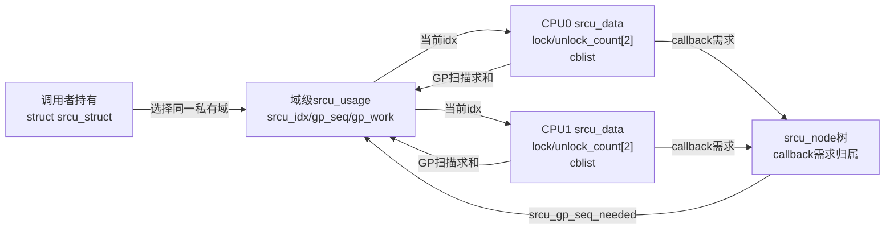
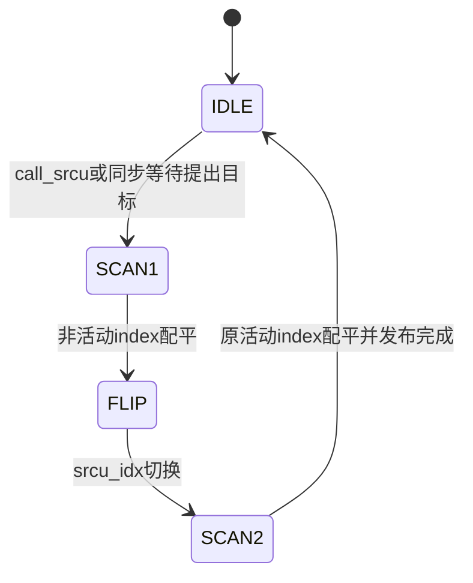
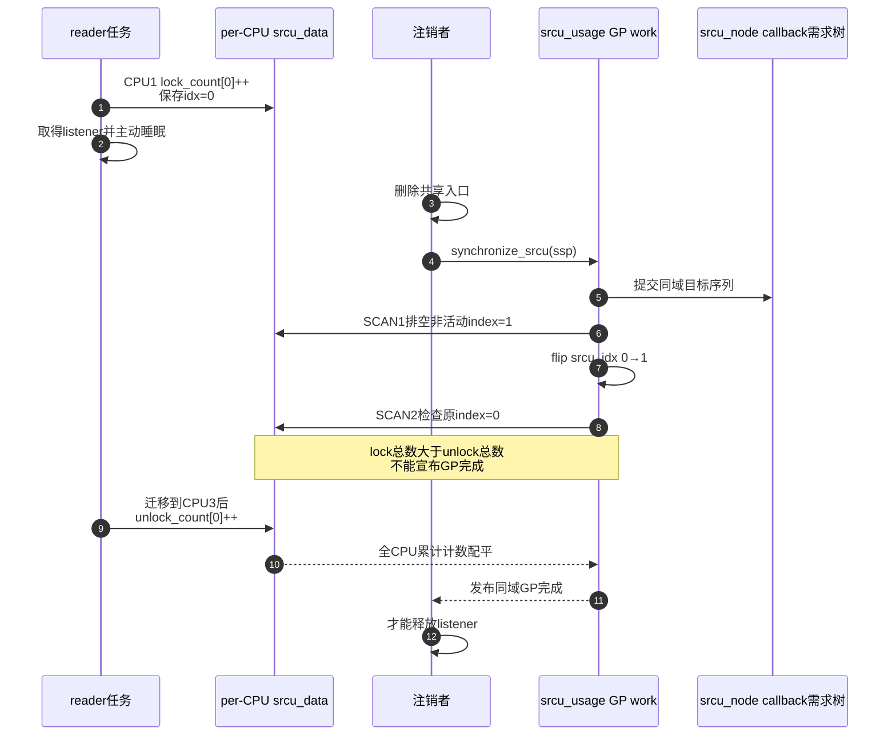

# 第7章\_Linux\_6.12\_Tree\_SRCU模块源码概念导读

## 7.1\_先分清Tree\_RCU与Tree\_SRCU

名字里都有 `Tree`，不表示它们共享同一套 reader 或 GP 状态机：

| 问题 | 普通 Tree RCU | Tree SRCU |
| --- | --- | --- |
| 保护域 | 系统普通 RCU 域 | 每个 `struct srcu_struct` 定义一个私有域 |
| 读侧接口 | `rcu_read_lock()/unlock()` | `srcu_read_lock(ssp)` 返回 `idx`，退出必须带回同一 `ssp/idx` |
| 主动睡眠 | 普通读侧禁止 | 允许 |
| 读者证明 | CPU QS/EQS，加必要的被抢占任务债务 | 所有 CPU 上指定 index 的累计进入/退出总数相等 |
| GP 控制 | 全局 `rcu_state` 与长期 `rcu_gp_kthread()` | 每个域的 `srcu_usage`、延迟 work 与双扫描状态 |
| 等待范围 | 普通 RCU 域中的旧 reader | 只等待指定 `srcu_struct` 中的旧 reader |

`CONFIG_PREEMPT_RCU` 只表示普通 Tree RCU reader 可以被调度器抢占，并由任务债务继续跟踪；它不允许 reader 主动等待 mutex、I/O 或 completion。源码注释中的 Sleepable RCU 指的是 SRCU 的调用契约。表中普通 Tree RCU 一列的长期控制任务和每轮 GP 状态机统一见 [普通 GP 全局生命周期源码实现](../source_explanations/P05_Linux_6.12_Tree_RCU_GP全局生命周期源码实现.md#5.13_端到端源码时序)，本章不借用该实现充当 SRCU 证据。

稳定机制、应用代码和双 index 推导见 [SRCU 私有域与双 index 状态机](../../../../knowledge/linux/synchronization_and_asynchrony/synchronization/rcu/P23_SRCU_私有域与双_index_状态机.md#23.1_问题场景_注销监听器时不能释放正在睡眠的回调对象)。本章只组织 Linux 6.12.20 的源码对象和阅读顺序，不展开完整函数体。

## 7.2\_为什么SRCU不能复用普通GP证明

假设任务在 CPU1 调用 `srcu_read_lock()`，在临界区内等待 I/O，随后被唤醒并迁移到 CPU3 退出。普通 Tree RCU 的 CPU QS 只能说明 CPU1 或 CPU3 经过了某个执行边界，不能凭该边界判断这个可睡眠逻辑 reader 已退出。

SRCU 把证明改为：

```text
CPU1：lock_count[idx] += 1
        ↓ 任务睡眠、被唤醒并迁移
CPU3：unlock_count[idx] += 1

GP扫描：Σlock_count[idx] == Σunlock_count[idx]
```

所以 SRCU 每次读侧进入/退出都写指定域的 per-CPU 累计计数。它用读侧记账换取睡眠、迁移和私有域能力；不能把普通 Tree RCU“reader 正常不写全局共享状态”的性能结论直接套给 SRCU。

## 7.3\_源码文件和对象层次

| 上游相对位置 | 主要对象 | 阅读任务 |
| --- | --- | --- |
| [`include/linux/srcu.h`](../../linux/include/linux/srcu.h) | `srcu_read_lock/unlock()`、`srcu_dereference()`、同步接口 | 先确定调用契约、同域和 `idx` 配对 |
| [`include/linux/srcutree.h`](../../linux/include/linux/srcutree.h) | `srcu_struct`、`srcu_usage`、`srcu_data`、`srcu_node` | 区分域入口、域级 GP、每 CPU 计数与回调需求树 |
| [`kernel/rcu/srcutree.c`](../../linux/kernel/rcu/srcutree.c) | 初始化、读计数、双扫描、GP work、callback 与同步等待 | 追踪一轮私有域 GP |

`srcu_struct` 是调用者持有的域入口；内部 `srcu_usage` 保存域级 GP 序列、目标、互斥和 work；每 CPU `srcu_data` 保存两组累计计数与 callback；`srcu_node` 主要汇聚 callback GP 需求和归属，不是普通 Tree RCU 的 `qsmask` 证明树。



## 7.4\_SRCU也是多组正交状态

| 状态轴 | 地址 | 写入者 | 读取者 | 含义 |
| --- | --- | --- | --- | --- |
| 域当前 index | `srcu_struct.srcu_idx` | GP work | 新 reader | 新进入读者选哪组计数 |
| reader 进入/退出 | `srcu_data.srcu_lock_count[2]`、`srcu_unlock_count[2]` | reader 当前 CPU | GP 扫描 | 每组累计进入与退出 |
| 域级 GP | `srcu_usage.srcu_gp_seq`、`srcu_gp_seq_needed` | GP work与请求漏斗 | callback、poll、同步等待 | 当前代际与未来目标 |
| callback 需求 | `srcu_data.srcu_cblist`、`srcu_node.srcu_have_cbs[]` | `call_srcu()` 与漏斗路径 | GP work | 哪些 callback 等哪一代 |
| GP 串行执行 | `srcu_usage.srcu_gp_mutex`、work | SRCU GP work | 同域推进路径 | 同一域双扫描不能并行交错 |

`srcu_idx` 不是 reader 数量；某一 CPU 的 lock/unlock 差也不一定单独归零，因为 reader 可以迁移。必须在同一 index 上跨所有 CPU 求和。

## 7.5\_读侧调用链怎样支持睡眠和迁移

阅读 `srcu_read_lock()` 时按下列顺序追踪：

```text
srcu_read_lock(ssp)
    → __srcu_read_lock(ssp)
    → 读取srcu_idx低位
    → 当前CPU的srcu_lock_count[idx]累计加一
    → 内存屏障
    → 返回idx

srcu_read_unlock(ssp, idx)
    → __srcu_read_unlock(ssp, idx)
    → 内存屏障
    → 当前CPU的srcu_unlock_count[idx]累计加一
```

进入和退出都是累计加一，而不是要求在进入 CPU 的同一个变量上加一/减一。这是迁移后仍能全局配平的关键。`idx` 必须由当前这次 lock 返回，并传给同一域的 unlock；用错域或 index 会破坏证明。

普通 `srcu_read_lock()` 还有执行上下文配对约束：不能由一个任务进入、让另一个任务或 IRQ handler 代为退出。NMI-safe 变体另有明确接口，不能仅凭计数实现猜测普通接口也跨上下文安全。

## 7.6\_双index为什么要扫描两次

一组计数无法把删除前 reader 与删除后不断到来的 reader 分开。SRCU 用两组累计计数，并把一轮 GP 分成：

```text
SCAN1：排空当前非活动index
    → flip srcu_idx，让新reader改用另一组
SCAN2：排空翻转前的活动index
    → 本轮旧reader全部退出
```

第一遍不能删除，因为 reader 可能已经读取旧 `srcu_idx`，却在增加计数之前被长时间延迟。SCAN1、屏障与 flip 先把这类滞后观察者收束到安全边界，SCAN2 才排空删除边界前的主要 reader 集合。



这里的 `SCAN1/SCAN2` 属于 SRCU 域级 GP 状态。不能映射成普通 Tree RCU 的 `WAIT_FQS/DOING_FQS`，也没有普通 `rcu_node.qsmask` 清位过程。

## 7.7\_callback需求树不等于reader证明树

`call_srcu()` 把 callback 放入本 CPU `srcu_data.srcu_cblist`，`srcu_gp_start_if_needed()` 和 `srcu_funnel_gp_start()` 把目标代际沿 `srcu_node` 汇聚到域级状态。

这棵 `srcu_node` 树帮助分散 callback 需求，提升大系统扩展性；reader 是否退出仍通过扫描所有 `srcu_data` 的累计计数求和判断。若把 SRCU 的 `srcu_node` 类比成普通 Tree RCU 的 `qsmask` 证明树，就会误判字段所有权和通信方向。

`synchronize_srcu()` 与 `call_srcu()` 的交付方式也不同：前者等待同域 GP 结论，后者立即返回并让 callback 以后执行。GP 完成同样不表示所有旧 callback 已经执行；域销毁还要满足 `srcu_barrier()` 和无使用者等生命周期条件。

## 7.8\_端到端时序\_睡眠reader怎样阻止注销



## 7.9\_源码阅读顺序与证据边界

1. 先读 `srcu.h` 的接口注释，确认可睡眠、`ssp/idx` 配对和等待调用上下文。
2. 再读 `srcutree.h`，画出 `srcu_struct→srcu_usage/srcu_data/srcu_node` 所有权。
3. 阅读 `__srcu_read_lock()` 与 `__srcu_read_unlock()`，确认迁移后为何还能累计配平。
4. 阅读扫描辅助函数，找出全 CPU lock/unlock 求和，而不是寻找 `qsmask`。
5. 阅读 `srcu_gp_start()`、`srcu_flip()`、`srcu_advance_state()` 与 `srcu_gp_end()`，把 SCAN1/flip/SCAN2 放进统一周期。
6. 阅读 `call_srcu()`、`srcu_gp_start_if_needed()` 和 `srcu_funnel_gp_start()`，区分 callback 需求树与 reader 计数证明。
7. 最后阅读 `synchronize_srcu()` 的普通、idle heuristic 和 expedited 分支，不把一个分支写成永远固定的调用链。

对应的唯一函数体讲解是 [Linux 6.12 Tree SRCU 源码实现](../source_explanations/P11_Linux_6.12_Tree_SRCU源码实现.md#11.2_源码符号覆盖账本)：

- 读侧进入/退出和全 CPU 求和见 [reader 累计账本](../source_explanations/P11_Linux_6.12_Tree_SRCU源码实现.md#11.4_reader进入退出写的是累计账本)与 [零 reader 证据](../source_explanations/P11_Linux_6.12_Tree_SRCU源码实现.md#11.5_GP怎样从分散累计值构造零reader证据)；
- `SCAN1→flip→SCAN2` 见 [双扫描 GP 状态机](../source_explanations/P11_Linux_6.12_Tree_SRCU源码实现.md#11.6_双扫描GP状态机怎样推进)；
- callback 入队、目标序列与 `srcu_node` 漏斗见 [callback 请求实现](../source_explanations/P11_Linux_6.12_Tree_SRCU源码实现.md#11.7_callback怎样登记并提出GP需求)；
- GP 完成、callback work、同步等待与 barrier 见 [完成交付](../source_explanations/P11_Linux_6.12_Tree_SRCU源码实现.md#11.8_GP完成怎样交付callback并承接下一代)、[同步等待](../source_explanations/P11_Linux_6.12_Tree_SRCU源码实现.md#11.9_synchronize_srcu怎样把异步callback变成同步等待)和 [SRCU barrier](../source_explanations/P11_Linux_6.12_Tree_SRCU源码实现.md#11.10_srcu_barrier为什么要在每条非空队列后追加哨兵)。

这些链接的职责是让模块问题直达唯一实现标题；遇到裁剪掉的尺寸转换、调试或自适应延时分支，再从实现讲解回到固定版本源文件核对。不能临时借用普通 Tree RCU GP 实现充当 SRCU 证据。

## 7.10\_源码阅读验收

1. 能解释普通 Tree RCU 可抢占 reader 与 SRCU 可睡眠 reader 的区别。
2. 能指出 SRCU 私有域、域级 GP、每 CPU 计数和 callback 需求树分别保存在哪里。
3. 能说明 reader 迁移后为什么用累计进入/退出求和仍能配平。
4. 能说明为什么需要 SCAN1、flip、SCAN2，而不是只扫描当前 index 一次。
5. 能解释 `srcu_node` 为什么不承担普通 `qsmask` 那种 reader 证明。
6. 能说明 `synchronize_rcu()` 为什么不能替代 `synchronize_srcu(ssp)`。
7. 能从 `__call_srcu()` 一直追到 `srcu_gp_end()`、`srcu_invoke_callbacks()` 和同步等待者被唤醒。

总阅读索引：[Linux 6.12 RCU 源码总阅读索引](P01_Linux_6.12_RCU源码总阅读索引.md#1.9_建议的源码阅读顺序)。

唯一实现讲解：[Linux 6.12 Tree SRCU 源码实现](../source_explanations/P11_Linux_6.12_Tree_SRCU源码实现.md#11.1_实现所有权与版本边界)。
