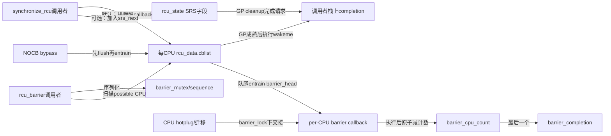
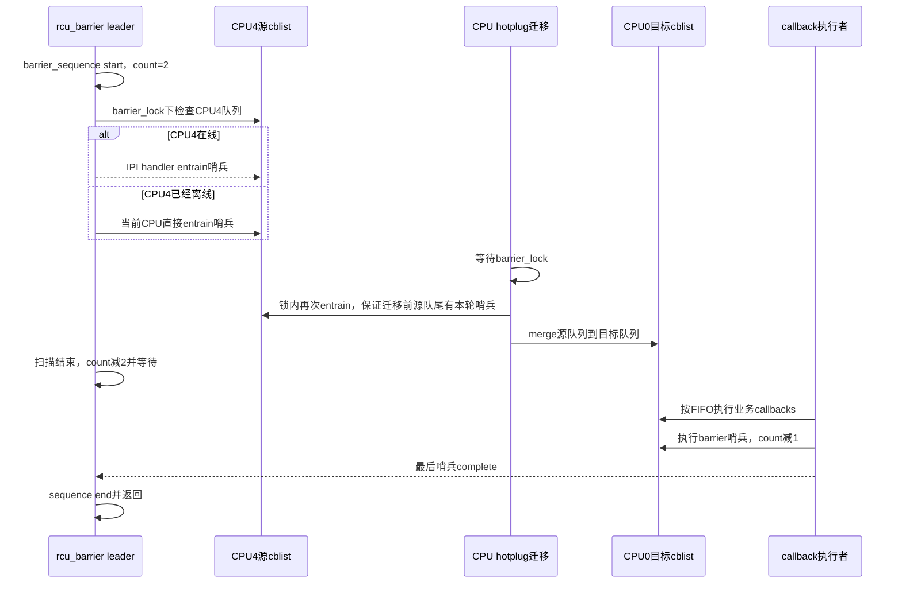

# 第8章\_Linux\_6.12\_Tree\_RCU\_同步等待与rcu\_barrier模块源码概念导读

## 8.1\_等RCU至少有三种不同对象

调用者说“等 RCU 完成”时，源码可能等待完全不同的事实：

| 接口/机制 | 等待对象 | 返回时能证明 | 不能证明 |
| --- | --- | --- | --- |
| `synchronize_rcu()` | 调用前存在的普通 RCU reader | 一轮合格 GP 覆盖调用点 | 之前排队的 callback 都已执行 |
| poll synchronize API | cookie 对应的 GP 完成状态 | 调用者检查到目标序列已完成 | 自动阻塞、callback 已执行 |
| `rcu_barrier()` | 调用前已经排队的普通 `call_rcu()` callback | 每条相关 per-CPU 队列前序 callback 已实际被调用 | 必然新启动或完成一轮 GP |

模块卸载最容易暴露这个差异：如果 callback 函数位于即将卸载的模块代码中，只等一个新 GP 不够，因为旧 callback 可能已经安全成熟却仍排在执行队列中。此时必须用 `rcu_barrier()` 等它们实际经过执行点。

稳定机制见 [Tree RCU 同步等待与 rcu_barrier](../../../../knowledge/linux/synchronization_and_asynchrony/synchronization/rcu/P13_Tree_RCU_同步等待与rcu_barrier.md#13.2_模块卸载场景暴露三种不同等待)。

## 8.2\_同步等待的两个实现分支

固定版本中 `synchronize_rcu_normal()` 有两个内部分支：

- 默认 `rcu_normal_wake_from_gp=0`：在调用者栈上建立 `struct rcu_synchronize`，通过 `call_rcu_hurry()` 排入一个唤醒 callback，调用者睡在自己的 completion；callback 执行 `wakeme_after_rcu()` 后唤醒它。
- 可选直接 GP wake 分支：调用者把栈上请求无锁加入 `rcu_state.srs_next`，GP init 用 dummy wait-head 划定本轮截止点，GP cleanup/工作队列完成对应请求。

两者等待的 API 语义相同，但“谁唤醒调用者”不同：默认分支必须等专用 callback 被执行，直接分支由 GP cleanup 直接完成请求。SRS 的[请求划批](../source_explanations/P05_Linux_6.12_Tree_RCU_GP全局生命周期源码实现.md#5.13_SRS怎样登记请求并冻结本轮批次)和 [cleanup/workqueue 交付](../source_explanations/P05_Linux_6.12_Tree_RCU_GP全局生命周期源码实现.md#5.14_SRS怎样在cleanup与workqueue之间交付等待者)已由 P05 唯一展开，本章不复制其函数体。

## 8.3\_rcu\_barrier的哨兵证明

`rcu_barrier()` 不逐个记录所有业务 callback。它对每个仍有 callback 的 `rcu_data.cblist` 在队尾 **entrain 一个专用 barrier callback**：

1. 队列是 FIFO 且分段语义保持顺序；
2. 哨兵只有在前序 callback 已经被逐项调用后才可能执行；
3. 每个实际排入的哨兵把全局计数加一；
4. 哨兵执行时计数减一，最后一个完成全局 completion；
5. 调用者等 completion，所以取得“所有被覆盖队列的前序 callback 已执行”的证明。

这是一种 **把全局集合完成问题转换成每队列尾哨兵完成问题** 的算法。它依赖 callback 队列顺序、hotplug 迁移不丢哨兵、NOCB bypass 先 flush，以及 barrier 本轮序列不会与另一轮混淆。

## 8.4\_角色状态与地址

| 状态 | 写入者 | 读取者 | 作用 |
| --- | --- | --- | --- |
| 调用者栈上 `rcu_synchronize` | `synchronize_rcu_normal()` | `wakeme_after_rcu()` 或 SRS cleanup | 单个等待者生命周期 |
| `barrier_mutex` | barrier 调用者 | 其他 barrier 调用者 | 串行全局 barrier 轮次，允许 follower early exit |
| `barrier_sequence` | 当前 barrier leader | barrier 调用者、per-CPU snapshot | 轮次开始/结束与覆盖检查 |
| `barrier_lock` | barrier、handler、migration/hotplug | 同上 | 让扫描、哨兵登记和队列迁移形成原子交界 |
| `barrier_cpu_count` | leader 初始化、entrain、哨兵 callback | completion 判定 | 实际已登记但未执行的哨兵数量加两个临时引用 |
| `barrier_completion` | leader 初始化、最后哨兵 | barrier leader | 等全部哨兵执行 |
| `rdp->barrier_head` | entrain | callback 执行者 | 每 CPU 预分配哨兵，避免 barrier 临时分配 |
| `rdp->barrier_seq_snap` | barrier/entrain | barrier 扫描 | 该 CPU 队列是否已处理本轮 |

`barrier_seq_snap` 位于 `struct rcu_data`，不是 `struct rcu_state`。`barrier_lock` 的全局性来自它要同时保护全局轮次与所有 per-CPU snapshot/队列交界。

## 8.5\_为什么计数初始值是2

Barrier leader 初始化 completion 后把 `barrier_cpu_count` 设为 2，而不是 0。扫描期间，新排入的哨兵可能立即执行；如果从 0 开始，它可能在 leader 尚未遍历完其他 CPU 时把计数减到 0 并错误完成。

两个临时引用让“扫描者尚未结束登记阶段”本身也计入未完成工作。全部 CPU 扫描完后 leader 一次性 `atomic_sub_and_test(2)`：

- 若没有任何哨兵，计数从 2 到 0，立即完成；
- 若有 N 个哨兵，计数从 `N+2` 到 N，只有每个哨兵都减一后才到 0。

这里的 2 不是 CPU 数，也不是两个固定 callback，而是登记阶段的防过早完成护栏。

## 8.6\_在线离线与NOCB为何不能分开处理

在线 CPU 的队列可能正由该 CPU 的中断/core 修改，barrier 用 `smp_call_function_single()` 让目标 CPU 在本地 IRQ 上下文、`barrier_lock` 下登记哨兵。离线但仍有队列的非 NOCB CPU不能接收 IPI，于是当前 CPU直接在同一锁下 entrain。

CPU 此时还可能与 callback migration 交错。如果迁移在 barrier 扫描“看过源队列”之后把未覆盖 callback 移到目标队列，而目标队列也已看过，就会漏等。迁移路径因此也拿 `barrier_lock`，并在搬运前对源队列调用 `rcu_barrier_entrain()`。

NOCB 的 callback 可能暂存在 bypass，哨兵若直接进 cblist 尾部而旧 callback 仍在 bypass，FIFO 证明会颠倒。`rcu_barrier_entrain()` 先 flush bypass，再 entrain 哨兵，并在从空变非空时唤醒 NOCB GP thread。

## 8.7\_S0到S10\_一轮rcu\_barrier

| 阶段 | 动作 | 状态/通信 | 退出条件 |
| --- | --- | --- | --- |
| S0 snapshot | 调用者取得 barrier sequence cookie | `rcu_seq_snap()` | 可检测前一 leader 是否已覆盖本调用 |
| S1 serialize | 获取 `barrier_mutex` | 睡眠 mutex | 单 leader |
| S2 follower check | 再查 sequence | done 则内存屏障后返回 | 无需重复扫描 |
| S3 begin | 在 `barrier_lock` 下 start sequence | `barrier_sequence` | 本轮全局身份建立 |
| S4 guard refs | completion init、count=2 | 原子计数 | 登记期不会过早到零 |
| S5 scan | 遍历 possible CPU | per-CPU snapshot、队列长度 | 每个队列已处理本轮 |
| S6 entrain | flush bypass、队尾挂哨兵 | callback FIFO | 覆盖该队列所有前序 callback |
| S7 close registration | count减2 | 原子完成检查 | 只剩真实哨兵计数 |
| S8 wait invoke | 睡 completion | callback 执行者逐个减计数 | 所有哨兵执行 |
| S9 end | end sequence、更新 per-CPU snapshot | `rcu_seq_end()` | 完成证据发布 |
| S10 release | 释放 mutex | 唤醒后续 barrier | 下一轮可开始 |

## 8.8\_端到端时序\_扫描期间CPU下线并迁移

## 8.9\_源码入口与唯一实现标题

| 阅读目标 | 源文件 | 唯一实现讲解 |
| --- | --- | --- |
| 公开 `synchronize_rcu()` 分流 | [`kernel/rcu/tree.c`](../../linux/kernel/rcu/tree.c) | [P10：同步等待分流](../source_explanations/P10_Linux_6.12_Tree_RCU_同步等待与rcu_barrier源码实现.md#10.4_synchronize_rcu怎样选择普通expedited或早期空GP) |
| 默认 callback wake bridge | [`kernel/rcu/update.c`](../../linux/kernel/rcu/update.c)、[`tree.c`](../../linux/kernel/rcu/tree.c) | [P02：`wakeme_after_rcu()`](../source_explanations/P02_Linux_6.12_Tree_RCU_等待桥_QS与节点汇聚关键函数源码实现.md#2.3___wait_rcu_gp与wakeme_after_rcu连接等待者) 与 [P10：默认等待对象](../source_explanations/P10_Linux_6.12_Tree_RCU_同步等待与rcu_barrier源码实现.md#10.5_默认分支为何等待调用者自己的completion) |
| SRS 直接 GP wake | [`kernel/rcu/tree.c`](../../linux/kernel/rcu/tree.c) | [P05：SRS 完成交付](../source_explanations/P05_Linux_6.12_Tree_RCU_GP全局生命周期源码实现.md#5.14_SRS怎样在cleanup与workqueue之间交付等待者) |
| barrier callback 与 entrain | [`kernel/rcu/tree.c`](../../linux/kernel/rcu/tree.c) | [P10：哨兵证明](../source_explanations/P10_Linux_6.12_Tree_RCU_同步等待与rcu_barrier源码实现.md#10.6_barrier_callback与entrain如何证明队列前序已执行) |
| 全局 barrier 扫描与计数 | [`kernel/rcu/tree.c`](../../linux/kernel/rcu/tree.c) | [P10：`rcu_barrier()`](../source_explanations/P10_Linux_6.12_Tree_RCU_同步等待与rcu_barrier源码实现.md#10.8_rcu_barrier怎样扫描所有队列并等待真实执行) |
| hotplug/migration 竞态 | [`kernel/rcu/tree.c`](../../linux/kernel/rcu/tree.c) | [P10：`barrier_lock`](../source_explanations/P10_Linux_6.12_Tree_RCU_同步等待与rcu_barrier源码实现.md#10.7_barrier_lock怎样封住CPU热插拔与迁移竞态) |

## 8.10\_选择边界与验收

- 需要让调用前 reader 退出：`synchronize_rcu()`；
- 不能阻塞、稍后自行查询 GP：poll synchronize API；
- 需要确保已排队 callback 函数不再引用模块代码/资源：`rcu_barrier()`；
- 批量对象可以同步等待一次后直接释放：不要再为同一批对象同时排回收 callback；
- 任何同步接口都不能在它自身等待的普通 RCU reader 临界区内调用。

验收时应能解释：多等一轮 GP 为什么不等于旧 callback 已执行；barrier 哨兵为什么必须在每条队列尾部；count=2 解决什么竞态；NOCB bypass 为何先 flush；CPU 迁移为何必须与 barrier 扫描共享一把锁；并发 barrier follower 如何利用 sequence 早退。

总入口：[Linux 6.12 RCU 源码总阅读索引](P01_Linux_6.12_RCU源码总阅读索引.md#1.4_模块概念导读入口)。
