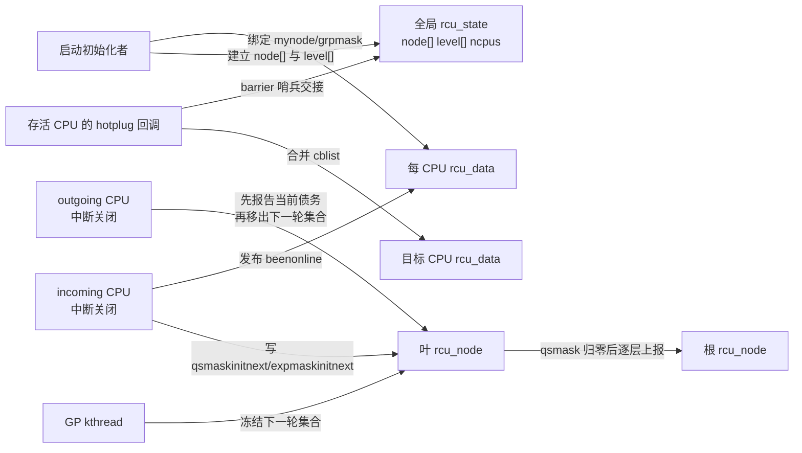
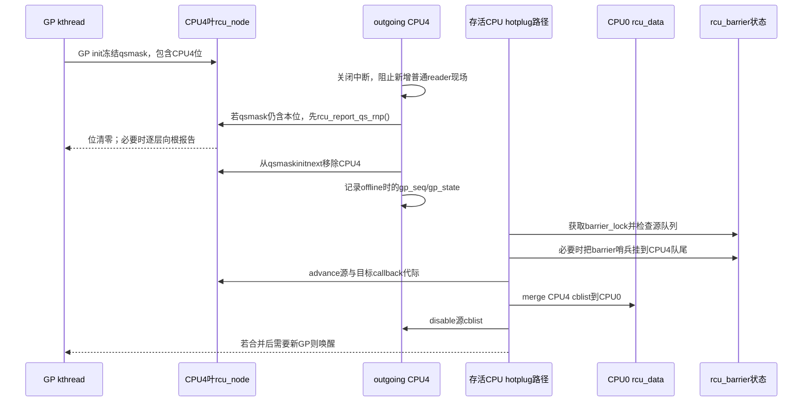

# 第8章\_Linux\_6.12\_Tree\_RCU\_拓扑与CPU热插拔模块源码概念导读

## 8.1\_本模块究竟解决什么问题

普通 Tree RCU 要把很多 CPU 的局部 QS 证据汇聚成一次全局 GP 完成结论。源码首先必须回答三个问题：

1. 每个 CPU 的证据应该写入哪一个叶 `rcu_node`、哪一位；
2. 当前 GP 已经冻结的参与集合，与 CPU 上下线为下一轮准备的集合怎样隔离；
3. CPU 离线以后，留在该 CPU 上的 callback、barrier 哨兵和被抢占 reader 债务由谁继续承担。

这三个问题共同构成 **Tree RCU 拓扑与 CPU 参与生命周期**。它不是普通 GP 主线程的一个小分支，也不是“热插拔时把一个位清零”这么简单。拓扑在启动阶段建立；CPU 参与集合在每次上线、下线和 GP 初始化之间交接；callback 所有权还要在 CPU 真正死亡以后迁移。

稳定机制模型先读 [Tree RCU 初始化、拓扑与执行上下文](../../../../knowledge/linux/synchronization_and_asynchrony/synchronization/rcu/P11_Tree_RCU_初始化_拓扑与执行上下文.md#11.1_具体问题_CPU的QS究竟要写进哪一个节点) 和 [Tree RCU CPU 热插拔与回调迁移](../../../../knowledge/linux/synchronization_and_asynchrony/synchronization/rcu/P21_Tree_RCU_CPU热插拔与回调迁移.md#21.1_场景_CPU4在GP中途下线)。本章只负责 Linux 6.12.20 的模块边界、状态地址和源码阅读顺序。

## 8.2\_先定义六个容易被默认理解的名词

| 名词 | 在本模块中的准确含义 | 不能误解成 |
| --- | --- | --- |
| RCU topology | `rcu_state.node[]` 及 `level[]` 构成的固定汇聚树 | Linux 调度域或 NUMA 拓扑的直接镜像 |
| possible CPU | 启动配置允许存在、因而预先拥有 `rcu_data` 与叶节点位的 CPU | 当前正在运行的 CPU |
| online CPU | 已进入 RCU 参与协议、可运行普通 RCU reader 的 CPU | 必然属于当前正在进行的 GP 快照 |
| current-GP mask | GP 初始化时从下一轮集合冻结出的 `qsmask` | 随 CPU 上下线实时变化的在线掩码 |
| next-GP mask | `qsmaskinitnext` 等为未来 GP 保存的参与集合 | 当前 GP 尚未报告 QS 的 CPU 集合 |
| callback migration | 把离线 CPU 的分段 callback 队列合并到当前 CPU，保留代际语义 | 重新调用所有 callback 或只改队列头指针 |

`ncpus` 与 `n_online_cpus` 也必须分开：固定版本中，前者由 CPU starting 路径以 release 语义发布“expedited 初始化树是否见过新 CPU”的变化；后者记录 RCU 当前 online CPU 数。它们都不是当前普通 GP 的权威完成条件。

## 8.3\_参与者状态地址与所有权

| 状态地址 | 主要写入者 | 主要读取者 | 同步边界 |
| --- | --- | --- | --- |
| `rcu_state.node[]/level[]` | `rcu_init_one()` | 所有树遍历与每 CPU 绑定路径 | 启动期建立，运行期拓扑形状不变 |
| `rdp->mynode/grpmask` | `rcu_init_one()`、boot per-CPU 初始化 | QS、FQS、hotplug、callback 路径 | CPU 启动前确定 |
| `rnp->qsmaskinitnext` | CPU starting/dead 路径 | 下一次 `rcu_gp_init()` | `ofl_lock`、叶锁；barrier 交界还用 `barrier_lock` |
| `rnp->qsmaskinit/qsmask` | GP 初始化 | QS 上报、FQS、stall | 节点锁；一轮 GP 内是冻结债务 |
| `rnp->expmaskinitnext/expmaskinit/expmask` | CPU starting 只增 ever-online 基础位；expedited reset/报告推进后两者 | expedited CPU 选择和报告 | 各节点锁，另由 `ncpus` 检测是否出现从未加入过的新 CPU |
| `rdp->cblist` | `call_rcu()`、GP 推进、执行与迁移路径 | core、NOCB、barrier | 本地 IRQ/NOCB 锁、节点锁、`barrier_lock` 按操作组合 |
| `rnp->blkd_tasks` | 抢占式 reader 阻塞/解阻路径 | 普通与 expedited GP | 叶节点锁；CPU 离线不能删除任务债务 |

## 8.4\_它是三组相互交接的状态机

### 8.4.1\_拓扑构造状态机

`rcu_init_one()` 从叶层向根层初始化每个 `rcu_node`，但 `node[]` 在内存中采用紧密数组的“heap form”，不是动态分配堆。`level[i]` 指向第 `i` 层在 `node[]` 中的首节点；每个节点保存自己覆盖的 CPU 范围 `grplo..grphi`、父指针、在父节点中的 `grpmask`。

随后所有 possible CPU 取得一个固定的 `rdp->mynode` 和 `rdp->grpmask`。运行期 CPU 上下线不会重建整棵树，只改变参与位和 per-CPU 生命周期。

### 8.4.2\_CPU参与集合状态机

CPU starting 只把 CPU 加入 `qsmaskinitnext`。当前 GP 若已开始，新 CPU 不应凭空成为该轮必须等待的新债务；下一次 GP init 才把 next 集合传播并冻结成当前 `qsmask`。

CPU dead 的普通 GP 顺序相反：如果当前 `qsmask` 仍在等它，必须先把这份当前债务作为 QS 报告；然后再从 `qsmaskinitnext` 移除，避免下一轮继续等待已经不存在的 CPU。这里若先删 next 位、后处理 current 位，当前 GP 可能永久等待；若把上线 CPU直接加入 current 位，已经接近完成的 GP 会被晚到 CPU 改写证明集合。

Expedited 的基础位采用另一策略：`expmaskinitnext` 不在 CPU offline 时清除，而保存“曾经 online 的 CPU”并集；每轮 CPU selection 再识别当前 offline CPU并直接报告。这样重新上线不必反复向上重建初始化树。`ncpus` 也只在首次把一个 CPU 位加入这个并集时增长。

### 8.4.3\_回调所有权状态机

非 NOCB CPU 离线后，`rdp->cblist` 不能留在不再运行 core 的 CPU 上。迁移路径先与 `rcu_barrier()` 序列化，必要时把 barrier 哨兵 entrain 到源队列，再把源、目标队列各自推进到最新可知 GP 代际，最后执行 `rcu_segcblist_merge()`。

NOCB CPU 的 callback 本来就由 offload kthread 管理，因此 hotplug 迁移路径直接返回；这不表示 callback 被丢弃，而是其执行所有权没有随物理 CPU 下线消失。

## 8.5\_S0到S10\_一颗CPU从预留位置到离线清理

| 阶段 | 触发 | 写入地址 | 后续读取者 | 退出条件 |
| --- | --- | --- | --- | --- |
| S0 possible | 启动枚举 | `rcu_data[cpu]` 存在 | 初始化路径 | CPU 获得固定 per-CPU 槽位 |
| S1 bind | `rcu_init_one()` | `mynode/grpmask` | 全部本地 RCU 路径 | CPU 位映射确定 |
| S2 prepare | CPUHP prepare | per-CPU GP/callback/core 状态 | incoming CPU 与 core | 本地数据可安全使用 |
| S3 starting | incoming CPU、中断关闭 | `qsmaskinitnext`、`expmaskinitnext`、`ncpus` | 下一轮 GP/expedited reset | `beenonline` release 发布 |
| S4 GP snapshot | 普通 GP init | `qsmaskinit/qsmask` | QS、FQS、stall | 当前轮参与集合冻结 |
| S5 reader/QS | CPU 运行 | `rdp` 本地证据、节点清位 | 根完成路径 | 当前 CPU 债务清除 |
| S6 offline begin | CPUHP offline | `ffmask`、tick 依赖 | FQS/hotplug | 不再作为正常未来执行者 |
| S7 report dead | outgoing CPU、中断关闭 | 当前 `qsmask` 与普通 `qsmaskinitnext` | 当前/下一轮普通 GP | 当前债务处理完且普通 next 位移除；expedited ever-online 位保留 |
| S8 migrate | 存活 CPU | 源/目标 `cblist`、barrier 哨兵 | callback core/barrier | 非 offload callback 全部转移 |
| S9 dead | CPUHP dead | `n_online_cpus` | 诊断与全局策略 | RCU online 计数递减 |
| S10 reusable | 后续重新上线 | 从 S2 重新进入 | 同上 | 不重建静态树 |

## 8.6\_端到端时序\_GP中途CPU4下线

被抢占 reader 是关键分支：任务可能在 CPU4 上进入普通 RCU 临界区，随后被抢占并迁移到其他 CPU。CPU4 下线只清 CPU 位，不能清 `blkd_tasks` 中的任务债务；该任务最终解阻时仍沿其记录的叶节点路径报告。

## 8.7\_正常路径特殊路径与强制慢路径

| 路径 | 发生频率 | 通信方式 | 不变量 |
| --- | --- | --- | --- |
| 启动拓扑构造 | 每次启动一次 | 直接初始化共享数组和 per-CPU 指针 | 运行期树形状稳定 |
| CPU 上线/下线 | 稀有控制路径 | `ofl_lock`、节点锁、release 发布 | current 与 next 集合不混用 |
| callback 迁移 | CPU 下线慢路径 | `barrier_lock`、NOCB/节点锁、链表合并、GP 唤醒 | 已排队 callback 不丢、不提前执行 |
| expedited 新 CPU 接入 | 下一次 expedited reset | `ncpus` acquire/release、节点锁 | 只传播真正新增的 CPU 位 |
| 异常旧代际/计数回绕 | hotplug 交界 | GP 序列修正辅助 | 不能把旧代际误报成当前 QS |

## 8.8\_源码文件地图与唯一实现入口

| 阅读目标 | 源文件 | 唯一实现讲解 |
| --- | --- | --- |
| `node[]/level[]`、父子关系与 CPU 绑定 | [`kernel/rcu/tree.c`](../../linux/kernel/rcu/tree.c)、[`tree.h`](../../linux/kernel/rcu/tree.h) | [P06：`rcu_init_one()`](../source_explanations/P06_Linux_6.12_Tree_RCU_拓扑与CPU热插拔源码实现.md#6.4_rcu_init_one建立固定汇聚树并绑定每CPU叶节点) |
| boot per-CPU 初值与 CPU prepare | [`kernel/rcu/tree.c`](../../linux/kernel/rcu/tree.c) | [P06：boot 与 prepare](../source_explanations/P06_Linux_6.12_Tree_RCU_拓扑与CPU热插拔源码实现.md#6.5_boot初始化与prepare为何仍未让CPU加入当前GP) |
| CPU starting/dead 的 current/next 交接 | [`kernel/rcu/tree.c`](../../linux/kernel/rcu/tree.c) | [P06：starting/dead](../source_explanations/P06_Linux_6.12_Tree_RCU_拓扑与CPU热插拔源码实现.md#6.6_report_cpu_starting与report_cpu_dead怎样隔离当前轮和下一轮) |
| callback 迁移与 barrier 交界 | [`kernel/rcu/tree.c`](../../linux/kernel/rcu/tree.c) | [P06：callback migration](../source_explanations/P06_Linux_6.12_Tree_RCU_拓扑与CPU热插拔源码实现.md#6.7_rcutree_migrate_callbacks保留callback代际与barrier证明) |
| GP init 如何消费 next 集合 | [`kernel/rcu/tree.c`](../../linux/kernel/rcu/tree.c) | [P05：`rcu_gp_init()`](../source_explanations/P05_Linux_6.12_Tree_RCU_GP全局生命周期源码实现.md#5.9_rcu_gp_init开始代际并建立证明债务) |
| `rcu_barrier()` 如何与迁移互锁 | [`kernel/rcu/tree.c`](../../linux/kernel/rcu/tree.c) | [P10：barrier 与 hotplug 交界](../source_explanations/P10_Linux_6.12_Tree_RCU_同步等待与rcu_barrier源码实现.md#10.7_barrier_lock怎样封住CPU热插拔与迁移竞态) |

## 8.9\_建议阅读顺序与验收

1. 先在 `tree.h` 找到 `rcu_state.node[]/level[]`、`rcu_node.qsmask*` 和 `rcu_data.mynode/grpmask`；
2. 再读 `rcu_init_one()`，只回答静态地址怎样建立；
3. 沿 `rcutree_prepare_cpu()` 到 `rcutree_report_cpu_starting()`，区分“数据准备好”和“加入未来参与集合”；
4. 回到普通 GP `rcu_gp_init()`，观察 next 集合何时变成 current 债务；
5. 最后沿 `rcutree_report_cpu_dead()` 与 `rcutree_migrate_callbacks()`，分别追踪证明债务和 callback 所有权。

验收时应能不看函数名回答：CPU4 在 GP 中途上线为何不加入该轮；CPU4 在 GP 中途离线为何必须先还当前债务；被抢占 reader 为什么不随 CPU 位清除；`barrier_lock` 为什么出现在 callback 迁移而不是 QS 证明中。

总入口：[Linux 6.12 RCU 源码总阅读索引](P01_Linux_6.12_RCU源码总阅读索引.md#1.5_普通Tree_RCU分支)。
