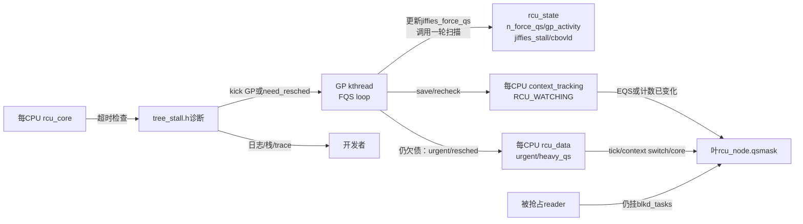
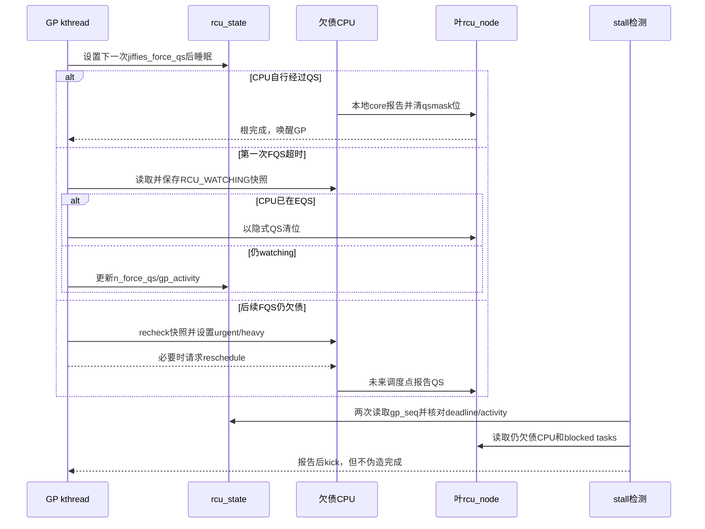

# 第9章\_Linux\_6.12\_Tree\_RCU\_force\_QS与Stall模块源码概念导读

## 9.1\_为什么GP已经在等还要有force\_QS

普通 GP 开始以后，根 `qsmask` 不归零就不能完成。但“不归零”至少可能来自四类完全不同的原因：

- CPU 已经进入 idle/user/EQS，只是本地没有走普通主动上报路径；
- CPU 尚未经历 QS，需要设置 urgent 标志或请求 reschedule；
- CPU 位已经清空，但被抢占 reader 仍挂在 `blkd_tasks`；
- QS 证据已经齐全，GP kthread、timer 或唤醒链本身却长期没有运行。

`force-QS` 的职责是 **重新检查、催促并汇聚已有的合法 QS 证据**。它不能宣布一个仍在旧 reader 中的 CPU 已安全。Stall 子系统则在等待超过阈值后对“谁还欠债、哪一个执行者不动、timer 是否失效”做诊断和有限催促；它也不能绕过 GP 正确性条件。

稳定机制见 [Tree RCU force-QS、迟延与 Stall](../../../../knowledge/linux/synchronization_and_asynchrony/synchronization/rcu/P15_Tree_RCU_force_QS迟延与Stall.md#15.1_Tree_RCU_force_QS迟延与_Stall)。普通 GP 主循环本体仍由 [GP 全局生命周期模块导读](P06_Linux_6.12_Tree_RCU_GP全局生命周期模块源码概念导读.md#6.1_模块问题与版本边界)负责，本章不复制 `rcu_gp_fqs_loop()`。

## 9.2\_六个专有名词先消歧

| 名词 | 准确定义 | 常见误读 |
| --- | --- | --- |
| FQS | force quiescent state，一轮“检查隐式证据并必要时催促”的扫描 | 强制把任意 CPU 直接标记为 QS |
| implicit QS | 由 idle/EQS、离线或 watching 计数变化证明 CPU 不再持有旧普通 reader | 没看见 reader 所以猜测安全 |
| watching snapshot | 对目标 CPU context-tracking `RCU_WATCHING` 计数的快照 | reader 嵌套计数 |
| urgent QS | 在 `rcu_data` 上请求目标 CPU 尽快经过可报告点 | 立即产生一条完成消息 |
| self-detected stall | 欠债 CPU 在本地 core 检测到自己超时 | GP kthread主动扫描所有 CPU 后统一报告 |
| other-CPU stall | 某个 CPU 发现其他 CPU/任务仍欠债 | 一定说明欠债 CPU 死锁 |

Stall 是 **症状分类器**，不是原因判决器。日志里的 `kthread starved`、`timer wakeup didn't happen`、CPU/任务列表、callback 数量分别来自不同状态地址；不能把所有 stall 都归结为“reader 太长”。

## 9.3\_状态地址和通信关系

| 状态 | 写入者 | 读取者 | 语义 |
| --- | --- | --- | --- |
| `rcu_state.n_force_qs` | 每轮 `rcu_gp_fqs()` | per-CPU 积压节流与 trace | FQS 轮数，不是 QS 数量 |
| `gp_activity/gp_req_activity` | GP、请求与 FQS 路径 | GP-start stall 与 starvation 检查 | 最近“机器有动作”的时间证据 |
| `jiffies_force_qs` | `rcu_gp_fqs_loop()` | wait timer 与 stall timer 检查 | 下一次 FQS 目标时刻 |
| `gp_start/gp_end/gp_max` | GP init/cleanup | stall、trace、统计 | GP 时间边界，不参与正确性证明 |
| `jiffies_stall/nr_fqs_jiffies_stall` | GP 初始化、FQS、stall reset | `check_cpu_stall()` | 防陈旧 jiffies 与下一次诊断阈值 |
| `cbovld/cbovldnext` | 叶扫描与 callback 过载检查 | FQS 节奏、urgent QS | callback 压力信号，不是 callback 完成证据 |
| `rdp->watching_snap` | 第一次 FQS 保存 | 后续 FQS recheck | 目标 CPU 是否经过 EQS 的比较基准 |
| `rdp->rcu_urgent_qs/rcu_need_heavy_qs` | FQS | tick、调度与 cond_resched 路径 | 请求目标 CPU 尽快协作 |

## 9.4\_FQS是两阶段远端观察而不是无条件IPI

第一次 FQS 对仍欠债 CPU 保存 `RCU_WATCHING` 快照：若 CPU 此刻已经在 EQS，可立即把它作为隐式 QS；否则只记录比较基准。后续 FQS 再读计数：若 CPU 从 watching 进入过 EQS、已经离线或处于可证明的特殊状态，扫描返回正值并清叶位；若尚未安全但已超过催促阈值，返回负值并在释放节点锁后 `resched_cpu()`。

因此正常 FQS 不等于每轮向所有 CPU 广播 IPI：

- 首选共享 context-tracking 状态的远端读取；
- 对已进入 EQS/离线的 CPU，被动证明即可；
- 对长期在内核态运行的 CPU设置 per-CPU urgent/heavy 标志；
- 必要时才通过 reschedule IPI/调度请求形成未来 QS；
- 对被抢占 reader，进入 boost 或继续等待任务解阻，不能靠 CPU 位替代任务债务。

## 9.5\_Stall检测由三条时间线组成

### 9.5.1\_GP已经开始但证明债务不归零

`check_cpu_stall()` 读取两次 `gp_seq`，中间读取 `jiffies_stall` 与 `gp_start`，并配合启动/结束路径相反顺序的屏障，尽量排除跨代际拼接出的假阳性。若本 CPU 的叶位仍欠债，可能 self-detect；否则它可能打印其他叶位和 blocked task。

### 9.5.2\_有人请求GP但GP根本没有开始

`rcu_check_gp_start_stall()` 比较根 `gp_seq` 与 `gp_seq_needed`，并检查 `gp_req_activity/gp_activity`。这条路径回答“需求已经登记，为什么 GP kthread 仍在 idle”，与“GP 进行中欠 QS”是两种故障。

### 9.5.3\_GP执行者或timer没有获得运行机会

`rcu_check_gp_kthread_starvation()` 根据 `gp_activity` 和 GP kthread 状态报告饥饿；`rcu_check_gp_kthread_expired_fqs_timer()` 结合 `gp_state == RCU_GP_WAIT_FQS` 与过期的 `jiffies_force_qs` 判断 timer 唤醒可能丢失。它们诊断的是控制执行者，不是 reader 本身。

## 9.6\_S0到S9\_从被动等待到诊断

| 阶段 | 进入触发 | 状态动作 | 通信 | 退出条件 |
| --- | --- | --- | --- | --- |
| S0 GP started | `rcu_gp_init()` | 写 `gp_start/jiffies_stall` | 全局共享状态 | 当前债务建立 |
| S1 passive wait | FQS loop sleep | 等根完成或 timer/flag | swait/timer | 完成或超时 |
| S2 first FQS | 首次超时 | 保存 watching snapshot | 远端共享读取 | 已在 EQS 的位清除 |
| S3 recheck | 后续超时 | 比较 snapshot、检查 offline | 远端共享读取 | 经历 EQS 的位清除 |
| S4 urge | 内核态欠债过久 | 设置 urgent/heavy | per-CPU 状态 | 目标 CPU 观察请求 |
| S5 resched | 更重催促 | 请求目标 CPU 调度 | resched IPI/need_resched | 未来上下文切换形成 QS |
| S6 task branch | CPU位清但任务欠债 | boost/等待 blocked task | 节点链表、调度 | 任务退出旧 reader |
| S7 threshold | 超过 stall deadline | 一致性快照与类型判断 | 每 CPU core | 选 self/other/control 故障 |
| S8 report | 确认仍超时 | 日志、trace、栈、callback数量 | 可观察输出 | 开发者取得诊断 |
| S9 recovery kick | 报告后 | wake GP、force QS、need_resched | 唤醒/催促 | 仍必须回到合法 QS 完成条件 |

## 9.7\_正常路径与慢路径时序

## 9.8\_源码入口与唯一实现标题

| 问题 | 源文件 | 唯一实现讲解 |
| --- | --- | --- |
| GP 主循环如何安排 FQS | [`kernel/rcu/tree.c`](../../linux/kernel/rcu/tree.c) | [P05：`rcu_gp_fqs_loop()`](../source_explanations/P05_Linux_6.12_Tree_RCU_GP全局生命周期源码实现.md#5.10_FQS循环与根完成通知) |
| 第一次 save 与后续 recheck | [`kernel/rcu/tree.c`](../../linux/kernel/rcu/tree.c) | [P07：watching 快照](../source_explanations/P07_Linux_6.12_Tree_RCU_force_QS与Stall源码实现.md#7.4_watching快照怎样把EQS变成隐式QS证据) |
| 叶节点扫描、boost、清位与 resched | [`kernel/rcu/tree.c`](../../linux/kernel/rcu/tree.c) | [P07：`force_qs_rnp()`](../source_explanations/P07_Linux_6.12_Tree_RCU_force_QS与Stall源码实现.md#7.5_force_qs_rnp把远端观察任务债务和resched放进同一轮) |
| FQS 全局节奏字段 | [`kernel/rcu/tree.c`](../../linux/kernel/rcu/tree.c) | [P07：`rcu_gp_fqs()`](../source_explanations/P07_Linux_6.12_Tree_RCU_force_QS与Stall源码实现.md#7.6_rcu_gp_fqs更新节奏并选择save或recheck) |
| GP 未启动、GP kthread 饥饿、timer 过期 | [`kernel/rcu/tree_stall.h`](../../linux/kernel/rcu/tree_stall.h) | [P07：三类控制故障](../source_explanations/P07_Linux_6.12_Tree_RCU_force_QS与Stall源码实现.md#7.7_三类stall为什么必须读取不同状态) |
| self/other CPU stall | [`kernel/rcu/tree_stall.h`](../../linux/kernel/rcu/tree_stall.h) | [P07：`check_cpu_stall()`](../source_explanations/P07_Linux_6.12_Tree_RCU_force_QS与Stall源码实现.md#7.8_check_cpu_stall怎样避免跨GP拼出假阳性) |

## 9.9\_验收边界

读完应能解释：第一次 FQS 为什么不能只检查一个布尔值；watching counter 变化为什么可证明旧 reader 不存在；negative recheck 返回为何只触发 resched 而不清位；CPU 位归零为何仍可能等待 blocked task；GP 未启动 stall、QS stall、GP kthread starvation 和 timer 失效分别读取哪些状态。

最重要的不变量是：**任何催促和诊断最终都必须回到真实 QS/任务解阻证据，force 与 stall 不拥有绕过证明条件的通道。**

总入口：[Linux 6.12 RCU 源码总阅读索引](P01_Linux_6.12_RCU源码总阅读索引.md#1.5_普通Tree_RCU分支)。
