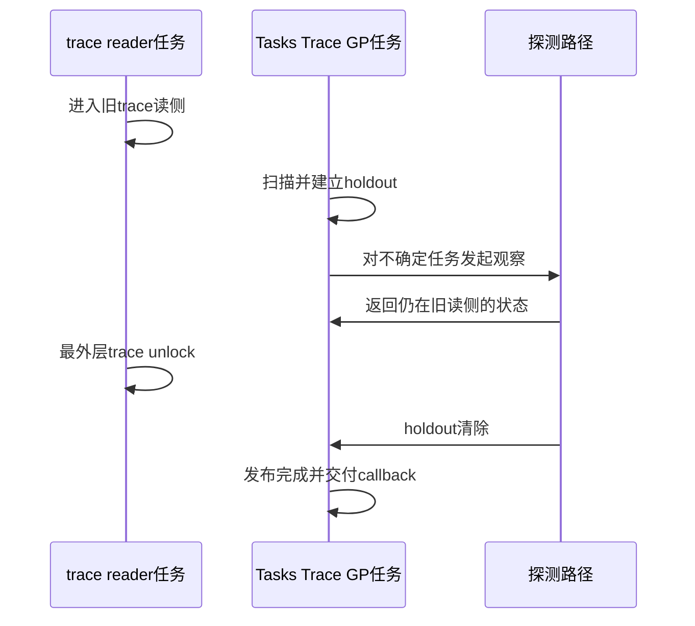

# 第10章\_Linux\_6.12\_Tasks\_RCU模块源码概念导读

## 10.1\_模块问题与三个flavor

本篇只读 `kernel/rcu/tasks.h` 中 Tasks、Tasks Rude 与 Tasks Trace 的共享控制骨架和 flavor 差异。它们保护任务 / trace 执行轨迹，不属于普通 Tree/Tiny 的对象 reader 证明；Tiny RCU 在 P11 独立阅读。

| flavor | 旧集合 | 主要完成证据 |
| --- | --- | --- |
| Tasks | GP 边界前可能仍在旧代码轨迹中的任务 | 自愿切换、user、idle 等任务边界 |
| Tasks Rude | 在线 CPU 上可能存在的旧执行 | 主动跨 CPU 调度边界 |
| Tasks Trace | 显式 trace reader | 每任务 trace 状态退出与必要探测 |

## 10.2\_共享对象与函数插槽

`struct rcu_tasks` 保存长期 GP 任务、callback 队列、等待和 flavor 特定函数插槽。阅读时应先区分：

- 共享骨架负责接收需求、启动 GP、周期扫描和交付 callback；
- flavor 钩子负责定义旧集合、holdout 检查和完成条件；
- 每 CPU callback 队列不等于普通 Tree RCU 的 `rcu_data.cblist`；
- 同名“GP kthread”只说明长期执行者形态相似，不说明保护域相同。

## 10.3\_经典Tasks的扫描链

建议沿下面问题读，而不是逐个搜索 `tasks` 名字：

```text
同步/异步调用提出需求
    → 对应rcu_tasks控制对象唤醒GP任务
    → 扫描边界前既有任务
    → 建立仍不能排除的holdout
    → 周期检查自然任务边界
    → holdout归零后发布完成并推进callback
```

排队但尚未进入旧代码轨迹的未来任务不属于旧集合；“任务存在”不能代替“任务已经执行受保护旧路径”。

## 10.4\_Tasks\_Rude的主动路径

Tasks Rude 通过跨在线 CPU 的调度动作制造边界。源码阅读应记录：谁发起调度工作、每个 CPU 在什么上下文执行、调用者怎样等待全部动作完成，以及这一主动路径怎样回到共享 callback 交付。

它用系统扰动换取更直接的观察边界，不应被描述成经典 Tasks 的无条件快路径。

## 10.5\_Tasks\_Trace的每任务状态与探测

Tasks Trace reader 可以跨阻塞，所以普通“发生过自愿切换”不能自动清债。源码需要保存每任务 trace 嵌套、更新观察状态，并在被动读取不足时选择更主动的探测。



## 10.6\_模块状态与通信表

| 状态 | 写入者 | 读取者 | 通信方式 |
| --- | --- | --- | --- |
| flavor GP 请求 / 序列 | 同步者、callback 生产者 | 对应 GP kthread | 共享状态 + 唤醒 |
| 每 CPU callback 队列 | 调用该 flavor API 的 CPU | GP / callback 交付路径 | per-CPU 队列 |
| 任务 holdout / trace 状态 | 任务执行、扫描与探测路径 | GP kthread | 任务字段 + 共享列表 / 扫描 |
| Rude CPU 完成 | 每 CPU 调度工作 | 发起者 | completion 类同步 |

## 10.7\_源码位置与证据边界

- `kernel/rcu/tasks.h`：三种 flavor 的共享控制对象、GP 主循环、扫描与 callback 管理；
- `include/linux/rcupdate.h` 等公共头文件：公开 Tasks API；
- `include/linux/sched.h`：相关每任务状态；
- BPF/ftrace 调用方：说明具体更新为什么选择某个 flavor。

仓库当前没有为 `tasks.h` 的每个函数体建立独立实现讲解。本导读只组织模块职责和阅读顺序，不把未建立的逐行证据伪装成精确锚点。

## 10.8\_建议阅读顺序与验收

1. 从调用方确认它等待的是对象 reader 还是旧代码轨迹；
2. 识别调用的是 Tasks、Rude 还是 Trace；
3. 阅读共享 `rcu_tasks` 控制骨架；
4. 只进入对应 flavor 的扫描、holdout 和完成函数；
5. 回到 callback 交付，确认 GP 完成怎样通知等待者。

完成后应能解释三种 flavor 共享什么、仅在哪些证明模块分叉，以及为什么任何一种都不能替代普通 RCU、SRCU 或 kref 的生命周期条件。

上一篇：[Tree SRCU 模块源码概念导读](P09_Linux_6.12_Tree_SRCU模块源码概念导读.md)。

下一篇：[Tiny RCU 模块源码概念导读](P11_Linux_6.12_Tiny_RCU模块源码概念导读.md)。
