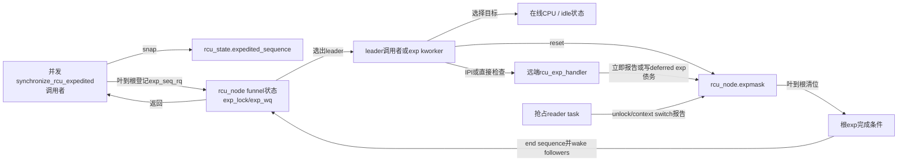
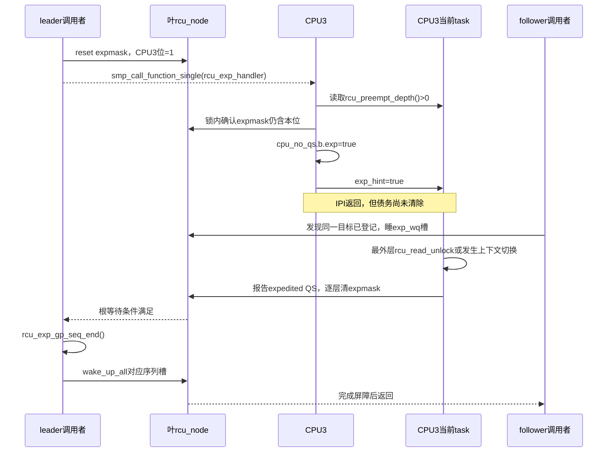

# 第10章\_Linux\_6.12\_Tree\_RCU\_Expedited\_GP模块源码概念导读

## 10.1\_Expedited不是普通GP的加速档

`synchronize_rcu_expedited()` 与 `synchronize_rcu()` 提供相同类型的普通 RCU reader 覆盖保证，但 Linux 6.12.20 使用一条 **独立的控制与证明通道**：

- 独立全局序列 `rcu_state.expedited_sequence`；
- 独立节点债务 `rcu_node.expmask` 和被抢占任务边界 `exp_tasks`；
- 独立 leader/follower 漏斗锁、等待队列和 wake mutex；
- 主动选择 CPU，并在需要时发送 IPI 或迫使 tick/reschedule；
- 不等待普通 GP kthread 把 `gp_seq` 推进一轮。

它改变的是取得 QS 证据的控制路径与等待延迟，不改变“所有调用前旧 reader 必须结束”的语义。稳定模型先读 [Tree RCU Expedited GP](../../../../knowledge/linux/synchronization_and_asynchrony/synchronization/rcu/P16_Tree_RCU_Expedited_GP.md#16.1_场景_控制路径愿意用系统扰动换更短等待)；若普通 GP 控制主线还不清楚，先用 [普通 GP 端到端源码时序](../source_explanations/P05_Linux_6.12_Tree_RCU_GP全局生命周期源码实现.md#5.13_端到端源码时序)建立比较基线，再读本章的独立 sequence、worker 和 IPI 路径。

## 10.2\_八个必须先知道的词

| 名词 | 精确定义 | 不能理解成 |
| --- | --- | --- |
| expedited sequence | 此实现自己的一轮开始/结束序列 | 普通 `gp_seq` 的别名 |
| leader | 穿过漏斗并持有 `exp_mutex`、真正驱动本轮的人 | 固定的 expedited kthread |
| follower | 发现同一或更新一轮正在进行、等待并复用其证明的调用者 | 不参与同步的无条件早退者 |
| funnel lock | 从叶到根登记请求、局部等待，最终串行 leader 的分层合并协议 | 一把普通全局 spinlock |
| `expmaskinitnext` | CPU starting 单调加入的 ever-online 候选位，offline 时不清除 | 当前轮债务或实时 online mask |
| `expmask` | 本轮 expedited 仍欠 CPU/QS 的节点位 | 普通 GP `qsmask` |
| `exp_tasks` | 本轮仍可能阻塞 expedited 完成的抢占 reader 分界 | 节点全部 blocked task 的副本链表 |
| selection | 根据在线、idle、NO_HZ、任务状态选择直接报告、IPI 或延后报告 | 向所有 possible CPU 无条件广播 |

固定提交里的 `rcu_state.expedited_need_qs` 只有字段声明，没有活动读写路径。当前完成条件不能从这个字段注释推导；权威证据是节点 `expmask/exp_tasks` 与根等待条件。

## 10.3\_角色状态与通信

| 状态地址 | 写入者 | 读取者 | 同步方式 |
| --- | --- | --- | --- |
| `rcu_state.expedited_sequence` | leader begin/end | 所有调用者与 poll 公共序列 | `rcu_seq_*`、内存屏障 |
| `rcu_state.exp_mutex` | leader 候选 | leader/follower | mutex，串行真实 expedited 轮 |
| `rcu_state.exp_wake_mutex` | 完成与唤醒路径 | 下一 leader | 防止上一轮唤醒与下一轮重叠 |
| `rnp->exp_seq_rq` | 漏斗登记者/结束路径 | follower | `exp_lock`、`exp_wq[4]` |
| `rnp->expmaskinitnext` | CPU starting 单调加位 | expedited hotplug reset | 节点锁；离线 CPU 留给每轮 selection 识别 |
| `rnp->expmaskinit` | hotplug reset | 每轮 reset | 节点锁、`ncpus` 快速判断 |
| `rnp->expmask` | 本轮 reset、CPU/任务报告 | wait/diagnosis | 节点锁 |
| `rdp->cpu_no_qs.b.exp` | handler/报告路径 | unlock、context switch | per-CPU 状态与节点锁交接 |
| `task->rcu_read_unlock_special.b.exp_hint` | PREEMPT handler | reader unlock 特殊路径 | 任务迁移后仍能兑现债务 |

## 10.4\_为什么需要漏斗而不是只有exp\_mutex

如果所有并发调用者都直接争用一把全局 mutex，高并发控制路径会让同一缓存行在全系统迁移。漏斗先在调用者所在叶节点登记目标序列：

1. 若该序列已经完成，直接以完成屏障返回；
2. 若本节点已有等于或更新的请求，调用者睡在该节点按序列槽选择的 `exp_wq`；
3. 否则把 `exp_seq_rq` 推进并向父节点继续；
4. 只有穿过根的人争用 `exp_mutex`；
5. leader 完成后逐节点推进 request counter 并唤醒 follower。

这减少了全局 mutex 竞争，但增加了节点状态、四槽等待队列、序列回绕处理和完成唤醒复杂度。Follower 复用的前提不是“同时调用”，而是已完成的那一轮确实覆盖它取得 snapshot 时点。

## 10.5\_CPU选择不是无条件广播IPI

每轮先把 `expmaskinit` 复制到 `expmask`，再按叶节点检查目标 CPU：

- CPU 已离线或在可证明的 idle/EQS 状态：直接报告相应位；
- CPU 在线且需要远端动作：尝试 `smp_call_function_single()`；
- NO_HZ_FULL CPU 可能需要强制 tick 以提供进展点；
- IPI 到达时若不在普通 reader 且上下文允许，立即清 expedited 债务；
- 若当前处于普通 reader，记录 `cpu_no_qs.b.exp` 与 task `exp_hint`，由未来 unlock/调度路径报告；
- IPI 竞争中 CPU 下线，选择路径重新检查并报告离线位。

所以 IPI 是 **促使目标 CPU 建立可验证状态转换** 的消息，不是“收到 IPI 就代表旧 reader 已结束”的确认包。

## 10.6\_S0到S10\_一次expedited生命周期

| 阶段 | 触发与执行者 | 写入状态 | 通信/等待 | 退出条件 |
| --- | --- | --- | --- | --- |
| S0 snapshot | 每个调用者 | 读取目标 `s` | sequence snapshot | 得到最早合格完成值 |
| S1 funnel | 调用者 | `exp_seq_rq` | 节点锁/等待队列 | 成为 follower 或继续向根 |
| S2 leader | 根胜出者 | 持 `exp_mutex`、开始 sequence | mutex | 确认尚无人完成目标 |
| S3 hotplug reset | leader | `expmaskinit` | `ncpus` acquire、节点锁 | 新 CPU 位传播完成 |
| S4 round reset | leader | `expmask=expmaskinit` | 广度树遍历 | 当前债务建立 |
| S5 select | leader/kworker | CPU 目标集合 | 每叶 work，可并行 | offline/idle位先清理 |
| S6 remote action | IPI handler | 立即报告或 per-CPU/task deferred 位 | IPI、need_resched/tick | 每个目标取得未来报告路径 |
| S7 aggregate | CPU/task报告者 | 逐层清 `expmask`/`exp_tasks` | 节点锁、根 wake | 根无 CPU/任务债务 |
| S8 end | leader | 结束 sequence | `exp_wake_mutex`、屏障 | 本轮完成可见 |
| S9 followers wake | leader | 推进节点 request counter | `wake_up_all()` | 所有覆盖调用者可返回 |
| S10 next leader | 上一 leader | 释放 `exp_mutex` | mutex | 下一轮才可开始 |

## 10.7\_端到端时序\_IPI遇到被抢占reader

任务可能在 handler 以后迁移，所以只在 `rdp` 上留一个 CPU 本地位不够；task 上的 `exp_hint` 把“未来 unlock 必须检查 expedited 债务”带到新 CPU。

## 10.8\_与普通GP共享什么不共享什么

| 维度 | 普通 GP | Expedited GP | 是否共享 |
| --- | --- | --- | --- |
| reader 语义 | 普通 RCU reader | 同一类 reader | 共享契约 |
| 权威序列 | `gp_seq` | `expedited_sequence` | 不共享 |
| CPU 债务 | `qsmask` | `expmask` | 不共享 |
| 抢占任务 | `blkd_tasks` 的普通 GP 边界 | 同一链表上的 `exp_tasks` 边界 | 共享任务容器，不共享轮次边界 |
| 控制执行者 | 长期 GP kthread | leader + exp kworker/远端 handler | 不共享 |
| poll API | `gp_seq_polled_snap` | `gp_seq_polled_exp_snap` | 共同推进公共 poll 观察序列 |
| 内存安全结果 | 覆盖调用前旧 reader | 覆盖调用前旧 reader | 同语义，不同证明通道 |

## 10.9\_源码入口与唯一实现标题

| 阅读目标 | 源文件 | 唯一实现讲解 |
| --- | --- | --- |
| expedited sequence 与公共 poll 交接 | [`kernel/rcu/tree_exp.h`](../../linux/kernel/rcu/tree_exp.h) | [P08：sequence](../source_explanations/P08_Linux_6.12_Tree_RCU_Expedited_GP源码实现.md#8.4_expedited_sequence怎样独立计代并共同推进poll观察) |
| funnel leader/follower | [`kernel/rcu/tree_exp.h`](../../linux/kernel/rcu/tree_exp.h) | [P08：`exp_funnel_lock()`](../source_explanations/P08_Linux_6.12_Tree_RCU_Expedited_GP源码实现.md#8.5_exp_funnel_lock怎样合并并发调用者) |
| hotplug reset 与本轮 `expmask` | [`kernel/rcu/tree_exp.h`](../../linux/kernel/rcu/tree_exp.h) | [P08：reset tree](../source_explanations/P08_Linux_6.12_Tree_RCU_Expedited_GP源码实现.md#8.6_sync_exp_reset_tree怎样建立本轮债务) |
| CPU selection 与并行 leaf work | [`kernel/rcu/tree_exp.h`](../../linux/kernel/rcu/tree_exp.h) | [P08：select CPUs](../source_explanations/P08_Linux_6.12_Tree_RCU_Expedited_GP源码实现.md#8.7_sync_rcu_exp_select_cpus为什么不是无条件广播) |
| PREEMPT_RCU 远端 handler | [`kernel/rcu/tree_exp.h`](../../linux/kernel/rcu/tree_exp.h) | [P08：`rcu_exp_handler()`](../source_explanations/P08_Linux_6.12_Tree_RCU_Expedited_GP源码实现.md#8.8_rcu_exp_handler把IPI转换为立即或延期证明) |
| 完成、wake follower 与公开 API | [`kernel/rcu/tree_exp.h`](../../linux/kernel/rcu/tree_exp.h) | [P08：wait/wake/API](../source_explanations/P08_Linux_6.12_Tree_RCU_Expedited_GP源码实现.md#8.9_wait_wake与公开API怎样关闭一轮) |

## 10.10\_代价边界与验收

Expedited 用 IPI、强制 tick/reschedule、额外节点锁、work/kworker 和系统范围扫描换取更短的典型等待；它不提供固定 deadline，也不适合普通热路径循环调用。`rcu_gp_is_normal()` 还可能把公开 expedited API 回退到普通等待，因此 API 名字不能代替运行策略检查。

读完应能回答：为什么 follower 可以复用 leader；`exp_wake_mutex` 为什么在 sequence end 周围；CPU 收到 IPI 后为何可能仍欠债；`expmask` 与 `qsmask` 为什么不能相互清位；`ncpus_snap` 为什么只用于新增 CPU 的 expedited 初始化传播。

总入口：[Linux 6.12 RCU 源码总阅读索引](P01_Linux_6.12_RCU源码总阅读索引.md#1.5_普通Tree_RCU分支)。
