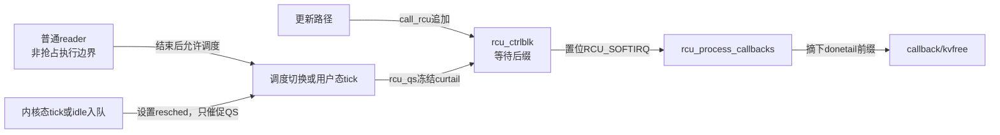

# 第11章\_Linux\_6.12\_Tiny\_RCU模块源码概念导读

## 11.1\_模块问题与当前配置前提

本篇只组织 `kernel/rcu/tiny.c` 在单 CPU、非 PREEMPT_RCU 构建中的角色、状态、通信和阅读顺序。它不展开函数体；逐句实现统一进入 [Linux 6.12 Tiny RCU 源码实现](../source_explanations/P13_Linux_6.12_Tiny_RCU源码实现.md#13.1_实现所有权与本章读者任务)。

Tiny 是普通 RCU 的构建期后端，不是 Tasks flavor，也不是应用运行时选择的轻量模式。它删除的是跨 CPU 证明汇聚，保留的是旧 reader 时间边界、callback 成熟和结果交付。

先把本篇反复使用的配置与源码名称落到具体类型。`CONFIG_PREEMPT_NONE_BUILD`、`CONFIG_PREEMPT_NONE`、`CONFIG_TINY_RCU`、`CONFIG_SMP`、`CONFIG_PROVE_LOCKING` 和 `CONFIG_PROVE_RCU` 都是 **Kconfig 配置符号**，不是 C 变量；它们的生成值决定当前构建选择的抢占模型、普通 RCU 后端和验证能力。**API（Application Programming Interface，应用程序编程接口）** 是调用者可依赖的公共接口；**QS（Quiescent State，静止态）** 是足以排除本轮旧 reader 的证明事件。`rcu_node` 是 Tree RCU 使用的结构体类型，Tiny 不实例化这棵汇聚树；`curtail` 与 `donetail` 是 Tiny 全局控制块中的指针字段，分别标记当前队尾槽位和成熟前缀边界。`kvfree()` 与 `rcu_reclaim_tiny()` 都是函数，前者释放内存，后者分派一个成熟回调的实际回收动作；`rcu_barrier()` 是等待既有异步 RCU callback 已经执行完毕的公共函数。

2026-09-05 已重新核对目标工作树的 `.config`、`include/config/auto.conf` 与 `include/generated/autoconf.h`；生成结果来自当前工作树中尚未提交的 `arch/arm/configs/imx_v7_test_defconfig` 差量：

```text
CONFIG_PREEMPT_NONE_BUILD=y
CONFIG_PREEMPT_NONE=y
CONFIG_TINY_RCU=y
# CONFIG_SMP is not set
CONFIG_PROVE_LOCKING=y
CONFIG_PROVE_RCU=y
```

因此本篇不再只是条件分支阅读，而是当前构建实际选择的普通 RCU 路径。`arch/arm/configs/imx_v7_test_defconfig` 不必直接写隐藏符号 `CONFIG_TINY_RCU`；实际选择必须以 Kconfig 求解后的生成配置为准。[`CONFIG_SMP` 的构建含义](../../../../knowledge/foundations/computer_architecture/cache_coherence/P01_缓存一致性问题与缓存行.md#1.1.3_Linux中的CONFIG_SMP表示构建能力)仍是理解该前提的入口。

## 11.2\_公共接口怎样落到Tiny

应用仍从 `include/linux/rcupdate.h` 调用普通 `rcu_read_lock()`、`call_rcu()` 和 `synchronize_rcu()`。Kconfig 与 Makefile 让 `tiny.o` 提供这些同名后端符号，不是某个对象在运行时选择 Tiny，也不会在 Tiny 函数返回后继续执行 Tree 的同名函数。

阅读时先从公共 API 确认语义，再进入 Tiny 的本地回调控制状态，避免把实现短小误读为契约为空。配置与链接选择的唯一实现讲解见 [13.3 配置怎样在链接期选择 Tiny](../source_explanations/P13_Linux_6.12_Tiny_RCU源码实现.md#13.3_配置怎样在链接期选择Tiny)。

## 11.3\_角色状态与通信关系

| 状态地址 | 所有者 | 写入事件 | 后续读取者 |
| --- | --- | --- | --- |
| 当前执行轨迹的非抢占边界 | 当前任务/中断上下文 | `rcu_read_lock()` / `rcu_read_unlock()` | 调度切换路径 |
| `rcu_ctrlblk.rcucblist` | Tiny 全局控制块 | `call_rcu()` 间接追加；softirq 改写共享头 | `rcu_process_callbacks()` |
| `rcu_ctrlblk.donetail` | Tiny 全局控制块 | 合法 QS 冻结当前队尾；softirq 摘链后重置 | `rcu_qs()` 与 `rcu_process_callbacks()` |
| `rcu_ctrlblk.curtail` | Tiny 全局控制块 | 每次 callback 入队后前移；队列被取空时由 softirq 重置 | 后续 `call_rcu()`、`rcu_qs()` 与 `rcu_process_callbacks()` |
| `rcu_ctrlblk.gp_seq` | Tiny 全局控制块 | `rcu_qs()`、`synchronize_rcu()` | poll API |
| 本 CPU `RCU_SOFTIRQ` pending 位 | softirq 核心 | `rcu_qs()` 置位 | softirq 调度与 `rcu_process_callbacks()` |



没有 `rcu_node` 树不等于没有状态机。Tiny 把 reader 证明放在本地执行约束，把 callback 代际放在两个二级指针，把完成交付放在 softirq pending 位。

## 11.4\_一次callback完整周期

| 阶段 | 本模块发生什么 | 不能提前得出的结论 |
| --- | --- | --- |
| T0 | 唯一 CPU 上的旧 reader 正在使用旧对象 | 单 CPU 不等于没有旧 reader |
| T1 | `call_rcu()` 只把 callback 追加到 `curtail` | callback 尚未成熟 |
| T2 | 调度切换或用户态 tick 调用 `rcu_qs()` | QS 只证明调用前批次安全 |
| T3 | `donetail=curtail` 并置位 `RCU_SOFTIRQ` | callback 还没实际执行 |
| T4 | softirq 摘下 `donetail` 之前的成熟前缀 | QS 后新入队项仍留在等待后缀 |
| T5 | `rcu_reclaim_tiny()` 调用 callback 或 `kvfree()` | 现在才完成异步回收结果交付 |

端到端函数与指针变化见 [13.11 一次异步回收的统一阶段](../source_explanations/P13_Linux_6.12_Tiny_RCU源码实现.md#13.11_一次异步回收的统一阶段)。

## 11.5\_只看Tiny时的源码阅读顺序

1. [13.3 配置与链接选择](../source_explanations/P13_Linux_6.12_Tiny_RCU源码实现.md#13.3_配置怎样在链接期选择Tiny)：先确认当前构建确实链接 `tiny.o`；
2. [13.4 单 CPU 的真实交错](../source_explanations/P13_Linux_6.12_Tiny_RCU源码实现.md#13.4_单CPU仍然会出现旧reader与更新者的时间交错)：先看到为什么 callback 不能立即运行；
3. [13.5 reader 边界](../source_explanations/P13_Linux_6.12_Tiny_RCU源码实现.md#13.5_reader不登记名单但不能跨过调度边界)：确认非抢占执行约束怎样变成 QS 前提；
4. [13.6 控制块](../source_explanations/P13_Linux_6.12_Tiny_RCU源码实现.md#13.6_一个链表和两个二级指针怎样表达三种状态)：画出 `rcucblist`、`donetail` 和 `curtail`；
5. [13.7～13.10 入队、QS 与 softirq](../source_explanations/P13_Linux_6.12_Tiny_RCU源码实现.md#13.7_call_rcu只入队不宣布安全)：沿实际运行链追一次 callback；
6. [13.12 同步与 poll](../source_explanations/P13_Linux_6.12_Tiny_RCU源码实现.md#13.12_synchronize_rcu立即返回不等于没有宽限期语义)：解释同步路径为何能退化；
7. [13.13 barrier](../source_explanations/P13_Linux_6.12_Tiny_RCU源码实现.md#13.13_rcu_barrier等待的是旧callback实际执行)：区分等 reader 与等 callback；
8. [13.14 初始化](../source_explanations/P13_Linux_6.12_Tiny_RCU源码实现.md#13.14_rcu_init的三个动作不是Tiny的全部实现)：最后再看为什么 `rcu_init()` 很短。

## 11.6\_Bear跳转与验收

Bear 更新后，先在 `compile_commands.json` 中确认 `kernel/rcu/tiny.c` 出现而 `kernel/rcu/tree.c` 不出现，再从 `call_rcu()` 依次跳到 `curtail`、`rcu_qs()`、`donetail`、`raise_softirq_irqoff()` 和 `rcu_process_callbacks()`。命令与预期见 [13.16 用 Bear 和构建产物核对实际编译路径](../source_explanations/P13_Linux_6.12_Tiny_RCU源码实现.md#13.16_用Bear和构建产物核对实际编译路径)。

完成后应能独立回答：

1. 硬中断为什么能让单 CPU 上仍然出现“更新者已经入队、旧 reader 尚未结束”的交错；
2. `donetail` 和 `curtail` 各自指向哪个槽位，为什么不能合成一个布尔标志；
3. 内核态 tick 为什么只请求调度而不能直接报告 QS；
4. 为什么 `synchronize_rcu()` 可以立即返回，而 `rcu_barrier()` 仍要等待 softirq；
5. 为什么 `rcu_init()` 中的 early test 只是辅助动作，不是 Tiny RCU 的运行主体。

上一篇：[Tasks RCU 模块源码概念导读](P10_Linux_6.12_Tasks_RCU模块源码概念导读.md)。

下一篇：[RCU Lockdep 适配模块源码概念导读](P12_Linux_6.12_RCU_Lockdep适配模块源码概念导读.md)。
