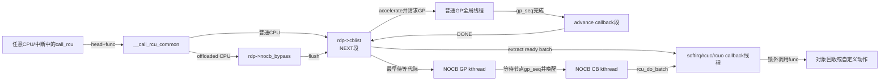
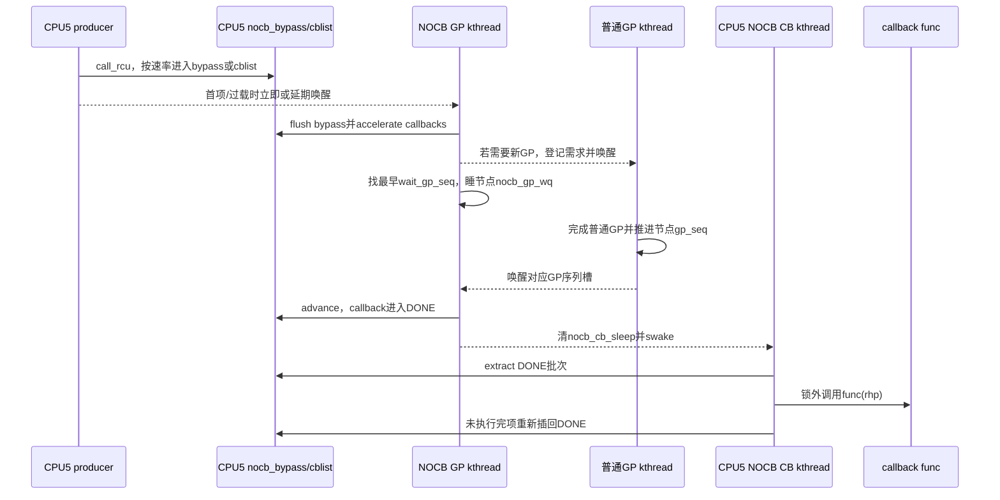

# 第11章\_Linux\_6.12\_Tree\_RCU\_回调与NOCB模块源码概念导读

## 11.1\_GP完成为什么还不等于callback执行

`call_rcu(head, func)` 建立的是一条异步生命周期：先把 callback 加入某个每 CPU 队列，之后为它绑定目标 GP；目标 GP 完成以后，它才从“等待证明”变成“允许执行”；最后还要由 softirq、`rcuc` 或 NOCB callback kthread 真正调用 `func()`。

因此必须区分四个时刻：

1. enqueue：`call_rcu()` 返回，callback 已被内核接管；
2. classified：callback 已绑定需要等待的 GP 代际；
3. ready：该 GP 已完成，callback 移到 DONE 段；
4. invoked：执行者已经实际调用 `func()`。

普通 GP 只负责第 2 到第 3 步的安全证明，不负责保证第 4 步立即发生。NOCB 改变 callback 的推进和执行者，不改变 callback 必须等目标 GP 的条件。

稳定机制分别见 [rcu_segcblist 回调状态机](../../../../knowledge/linux/synchronization/rcu/P17_Tree_RCU_rcu_segcblist回调状态机.md#17.1_场景_三个callback对应哪一轮GP)、[回调执行、批处理与限流](../../../../knowledge/linux/synchronization/rcu/P18_Tree_RCU_回调执行_批处理与限流.md#18.1_场景_一次GP后突然成熟五万个callback) 和 [NOCB 回调卸载](../../../../knowledge/linux/synchronization/rcu/P19_Tree_RCU_NOCB回调卸载.md#19.1_场景_隔离CPU不希望执行回调批次)。

## 11.2\_十个术语先建立地址感

| 术语 | 精确定义 | 不是 |
| --- | --- | --- |
| callback | 嵌入对象中的 `rcu_head` 加函数指针 | 独立分配的 RCU 线程任务 |
| `rcu_segcblist` | 一条链表加四个尾指针/代际元数据形成的分段状态机 | 四条互不相关链表 |
| NEXT | 新 enqueue、尚未完成精确代际分类的段 | 下一轮 GP 一定执行的段 |
| NEXT_READY | 已分配目标 GP、等待该 GP 的段 | 已可调用函数的段 |
| WAIT | 已等待一个确定 GP 但还未成熟的段 | 睡眠等待队列 |
| DONE | GP 证明已满足、允许执行的 callback 段 | 函数已经调用完的 callback |
| accelerate | 给新 callback 绑定尽可能早的安全 GP，并提出 GP 请求 | 跳过 GP |
| advance | 用已完成的节点 GP 序列把 callback 推入 DONE，再重新分类剩余项 | 执行 callback |
| NOCB | no-CBs/offloaded callback 处理模式 | CPU 不参与普通 RCU GP |
| bypass | callback 洪峰时绕开高竞争 `cblist/nocb_lock` 的暂存队列 | 第二套权威 GP 代际队列 |

`rcu_state.nocb_mutex/nocb_is_setup` 只协调 NOCB 配置和动态转换；callback 的高频状态主要位于每 CPU `rcu_data`，不是全局 `rcu_state`。

## 11.3\_三条数据流必须同时看

数据流一是 callback 节点从 producer 到队列；数据流二是 GP 代际从全局/节点序列进入 callback 分段；数据流三是执行权从本地 core 或 NOCB GP 线程交给 callback 执行者。只追 `call_rcu()` 调用链会漏掉后两条。

## 11.4\_状态所有权表

| 状态地址 | 所有者/写入者 | 读取者 | 保护与通信 |
| --- | --- | --- | --- |
| `rcu_head.next/func` | callback producer，随后转交 RCU | 队列与最终执行者 | enqueue 前由调用者独占；queue 后不得复用 |
| `rdp->cblist` | 对应 CPU 的 callback 子系统 | core、NOCB、barrier、hotplug | 本地 IRQ 禁用；offload 时加 `nocb_lock` |
| `rdp->nocb_bypass` | offloaded CPU producer | NOCB GP kthread/flush 路径 | `nocb_bypass_lock` 与长度计数 |
| `rnp->gp_seq` | 普通 GP cleanup | `rcu_advance_cbs()`、NOCB wait | 节点锁或有序读取 |
| `rnp->gp_seq_needed` | accelerate/request 路径 | GP kthread | 节点树需求漏斗 |
| `rdp->nocb_gp_wq[]` | GP cleanup/wait path | NOCB GP kthread | swait、按代际槽选择 |
| `rdp->nocb_cb_wq` | NOCB GP kthread | NOCB callback kthread | swait + `nocb_cb_sleep` |
| `rdp->blimit`、全局批次时间参数 | core/调优接口 | `rcu_do_batch()` | 限制一次执行占用，不改变安全资格 |
| `rcu_state.cbovld*` | callback 压力聚合/FQS | GP/FQS/diagnostics | 活性反馈，不是 callback 代际 |

## 11.5\_普通callback状态机

### 11.5.1\_enqueue只进入NEXT

`__call_rcu_common()` 检查重复排队、保存 `func`、关闭本地 IRQ并取得当前 CPU 的 `rcu_data`。普通 CPU 通过 `call_rcu_core()` 把节点入 `cblist`；offloaded CPU 改走 NOCB 入口。高频 enqueue 不获取根锁，因为每个 producer 若都争用全局 GP 状态会破坏扩展性。

### 11.5.2\_accelerate把局部callback需求送到GP树

`rcu_accelerate_cbs()` 在叶节点锁下取得 `rcu_state.gp_seq` snapshot，把未分类 callback 绑定到最早安全目标；若这个目标比节点已知需求更远，调用 `rcu_start_this_gp()` 沿 `gp_seq_needed` 漏斗登记并请求唤醒 GP kthread。

### 11.5.3\_advance只改变资格不执行函数

当 `rnp->gp_seq` 前进，`rcu_advance_cbs()` 先用 `rcu_segcblist_advance()` 把已满足目标的 callback 推到 DONE，再调用 accelerate 给仍在 NEXT 的项分类。它是幂等的，因此 local core、GP cleanup、NOCB GP thread、hotplug migration 都可在适当锁下调用。

### 11.5.4\_batch在锁外执行

`rcu_do_batch()` 先在 IRQ/NOCB 锁保护下抽取 DONE 段，释放队列锁后逐项清 debug 状态并调用 `func()`，最后重新加锁把因数量/时间限额未执行完的项插回 DONE。锁外执行防止任意 callback 函数把高频队列锁长期占住，也允许 callback 自己继续 `call_rcu()`；相应代价是必须单独维护抽取列表、长度和 requeue 不变量。

## 11.6\_NOCB为何拆成GP线程与CB线程

NOCB GP kthread 负责一组 `rcu_data`：刷新 bypass、advance callback、找出最早尚需等待的 GP 序列、睡在节点 NOCB GP waitqueue，成熟后唤醒各 CPU callback kthread。每 CPU NOCB callback kthread 只负责 `rcu_do_batch()` 和再次睡眠。

这样隔离 CPU 不再执行 callback 批次，但仍可能：

- 运行普通 RCU reader；
- 产生 QS/EQS 证据；
- 调用 `call_rcu()` 成为 producer；
- 接受必要的 GP/expedited 催促。

所以 NOCB 是 **callback execution offload**，不是 reader offload 或 GP participant removal。

## 11.7\_bypass把什么成本挪到哪里

高 callback 速率下，所有 producer 直接争 `nocb_lock` 会造成缓存行迁移。bypass 允许 producer 把节点暂存到更轻量的 `nocb_bypass`；但它不能无限期独立存在，因为：

- GP 代际仍由 `cblist` 分段表达；
- `rcu_barrier()` 必须看见所有 callback；
- 如果 `cblist` 为空而 GP thread 无限睡眠，bypass callback 会被搁浅。

因此源码按每 jiffy 速率、bypass 年龄、长度和 lazy/non-lazy 组合选择直接 cblist、flush 后入 cblist、或继续 bypass；首次 bypass 项、lazy 转 non-lazy、队列过载还要唤醒或设置 timer。被移除的 producer 锁竞争，换成了 flush、计数一致性、deferred wake 和 timer 状态机。

## 11.8\_S0到S11\_一次callback完整生命周期

| 阶段 | 状态地址 | 写入者 | 完成条件 |
| --- | --- | --- | --- |
| S0 caller owns | 对象内 `rcu_head` | 调用者 | 尚未 queue |
| S1 enqueue | `func/next`、NEXT 或 bypass | `call_rcu()` | RCU 接管节点 |
| S2 flush | bypass → cblist | producer/NOCB GP thread | callback 进入权威分段链 |
| S3 classify | segment tail + GP seq | accelerate | 已绑定目标 GP |
| S4 request | 节点 `gp_seq_needed`、全局 flags | accelerate/request | GP 执行者已可见需求 |
| S5 wait GP | `WAIT/NEXT_READY` | 队列状态机 | 目标节点序列完成 |
| S6 advance | callback → DONE | core/NOCB/cleanup | 具备执行资格 |
| S7 schedule executor | softirq/rcuc 或 NOCB cb wq | core/NOCB GP thread | 执行者被唤醒 |
| S8 extract | 临时 `rcu_cblist` | `rcu_do_batch()` | 从共享队列移出 ready 批次 |
| S9 invoke | `func(rhp)` | callback 执行者 | 用户 callback 返回 |
| S10 requeue remainder | DONE 段 | `rcu_do_batch()` | 超预算项重新可见 |
| S11 caller reuses/frees | 业务对象 | callback 函数/后续代码 | 必须遵守具体对象生命周期 |

## 11.9\_端到端时序\_offloaded CPU产生callback

## 11.10\_配置切换与热插拔边界

`rcu_nocb_cpu_offload()/deoffload()` 在固定版本只允许目标 CPU offline 时转换，使用 `cpus_read_lock()`、全局 `nocb_mutex`、组 GP kthread mutex、per-CPU `nocb_lock` 和 `nocb_state_wq` 完成所有权交接。它不是简单翻转 `SEGCBLIST_OFFLOADED`：转换必须确保 producer 看到新模式以前，旧执行者已停止访问该 `rdp`，还要 park/unpark callback kthread。

CPU hotplug 的普通 callback 迁移见 [拓扑与 CPU 热插拔模块导读](P08_Linux_6.12_Tree_RCU_拓扑与CPU热插拔模块源码概念导读.md#8.4.3_回调所有权状态机)。NOCB `rdp` 不走普通迁移，因为其 kthread 所有权仍存在。

## 11.11\_源码入口与唯一实现标题

| 阅读目标 | 源文件 | 唯一实现讲解 |
| --- | --- | --- |
| `call_rcu()` 分流与普通 enqueue | [`kernel/rcu/tree.c`](../../linux/kernel/rcu/tree.c) | [P09：enqueue](../source_explanations/P09_Linux_6.12_Tree_RCU_回调与NOCB源码实现.md#9.4_call_rcu怎样把所有权交给每CPU队列) |
| callback accelerate/advance | [`kernel/rcu/tree.c`](../../linux/kernel/rcu/tree.c)、[`rcu_segcblist.c`](../../linux/kernel/rcu/rcu_segcblist.c) | [P09：代际推进](../source_explanations/P09_Linux_6.12_Tree_RCU_回调与NOCB源码实现.md#9.5_accelerate与advance怎样连接callback和GP) |
| DONE 抽取、锁外执行与限流 | [`kernel/rcu/tree.c`](../../linux/kernel/rcu/tree.c) | [P09：`rcu_do_batch()`](../source_explanations/P09_Linux_6.12_Tree_RCU_回调与NOCB源码实现.md#9.6_rcu_do_batch为何先抽取再锁外执行) |
| normal core 选择 softirq/rcuc | [`kernel/rcu/tree.c`](../../linux/kernel/rcu/tree.c) | [P09：core 执行者](../source_explanations/P09_Linux_6.12_Tree_RCU_回调与NOCB源码实现.md#9.7_普通CPU怎样选择softirq或rcuc执行者) |
| bypass/flush/wake | [`kernel/rcu/tree_nocb.h`](../../linux/kernel/rcu/tree_nocb.h) | [P09：NOCB producer](../source_explanations/P09_Linux_6.12_Tree_RCU_回调与NOCB源码实现.md#9.8_nocb_bypass怎样降低生产者锁竞争又避免搁浅) |
| NOCB GP 与 callback kthread | [`kernel/rcu/tree_nocb.h`](../../linux/kernel/rcu/tree_nocb.h) | [P09：两个执行者](../source_explanations/P09_Linux_6.12_Tree_RCU_回调与NOCB源码实现.md#9.9_nocb_gp与cb线程如何交接成熟callback) |
| 动态 offload/deoffload | [`kernel/rcu/tree_nocb.h`](../../linux/kernel/rcu/tree_nocb.h) | [P09：转换](../source_explanations/P09_Linux_6.12_Tree_RCU_回调与NOCB源码实现.md#9.10_动态offload为何只允许offline_CPU并等待状态交接) |

## 11.12\_验收不变量

读完应能从任意 `rcu_head` 指出：当前所有者是谁、位于 bypass 还是 cblist 哪个段、目标 GP 从哪里读取、谁提出 GP 请求、谁把它推进 DONE、谁实际调用函数。还应能说明 NOCB 没有移除哪些 CPU 职责、bypass 为什么必须 flush、`rcu_do_batch()` 为什么要在锁外调用未知函数、批次限流为什么只影响延迟不影响安全资格。

总入口：[Linux 6.12 RCU 源码总阅读索引](P01_Linux_6.12_RCU源码总阅读索引.md#1.5_普通Tree_RCU分支)。
