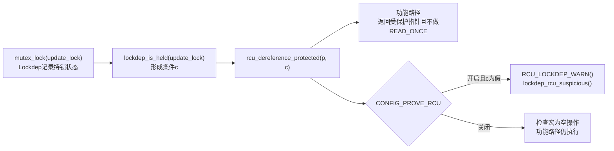

# 第1章\_Linux\_6.12\_RCU\_公共接口与检查机制源码详解

## 1.1\_源码详解边界与引用入口

本章是 `navigation/P01` 阅读索引下“公共接口与检查机制”的具体实现讲解。navigation 文档负责解释 RCU 子功能、模块边界和调用链；这里只保存 Linux 6.12.20 的宏体、函数体、配置分支、中文 Doxygen 阅读说明和实现原理。

| 引用入口 | 本次使用范围 |
| --- | --- |
| [P01 RCU 源码阅读索引](../navigation/P01_Linux_6.12_Tree_RCU_与_SRCU_源码导读.md#1.9_建议的源码阅读顺序) | 按功能类别发现本章并进入具体接口 |
| [P06 非抢占式 Tree RCU 更新者场景](../../../../knowledge/linux/synchronization/rcu/P06_非抢占式_Tree_RCU_源码同步机制.md#6.1_源码边界与贯穿场景) | 替换入口、等待旧 reader 并回收旧对象 |
| [P26 RCU 类型语义、Sparse 与 Lockdep](../../../../knowledge/linux/synchronization/rcu/P26_RCU_类型语义_Sparse与Lockdep.md#26.1.5_Lockdep检查的是哪一个运行时条件) | 区分静态类型检查、动态上下文检查与功能保证 |
| [P02 非抢占式 Tree RCU 模块源码概念导读](../navigation/P02_Linux_6.12_非抢占式_Tree_RCU_模块源码概念导读.md#2.2_先固定一段应用代码) | 把公共接口接回 GP、QS、树形汇聚和等待者唤醒主线 |

下面的代码均从已核对快照裁剪。`/** ... */` 是本仓库补充的中文 Doxygen 阅读说明，不是上游原注释；完整原文和许可证边界以链接的源码文件为准。

## 1.2\_接口与源码索引

| 接口或检查点 | 仓库中的版本化源码 | 调用场景中的作用 | 使用到的机制 |
| --- | --- | --- | --- |
| [`rcu_replace_pointer()`](#1.3_rcu_replace_pointer接口实现) | [`include/linux/rcupdate.h`](../../linux/include/linux/rcupdate.h) | 取得旧入口并发布新入口 | 更新侧受保护读取、release 发布、GNU statement expression |
| [`rcu_assign_pointer()`](#1.3.1_rcu_assign_pointer发布实现) | [`include/linux/rcupdate.h`](../../linux/include/linux/rcupdate.h) | 发布新入口 | 常量 `NULL` 的 `WRITE_ONCE()` 快路、其他值的 release store |
| [`rcu_dereference()`](#1.3.2_rcu_dereference取得实现) | [`include/linux/rcupdate.h`](../../linux/include/linux/rcupdate.h) | 在读侧取得被 RCU 保护的入口 | `READ_ONCE()`、依赖顺序、Sparse 与 Lockdep 检查 |
| [`rcu_check_sparse()`](#1.3.3_rcu_check_sparse静态类型桥接) | [`include/linux/rcupdate.h`](../../linux/include/linux/rcupdate.h) | 把 RCU 宏参数送入 Sparse address-space 类型检查 | `__CHECKER__` 配置分支、`typeof()`、`__rcu`；普通编译器分支为空 |
| [`rcu_dereference_protected()`](#1.5_rcu_dereference_protected功能与检查路径) | [`include/linux/rcupdate.h`](../../linux/include/linux/rcupdate.h) | 在更新锁已阻止并发修改时读取旧值 | Lockdep 条件、Sparse address-space 检查；刻意省略 `READ_ONCE()` |
| [`synchronize_rcu()`](#1.4_synchronize_rcu接口实现) | [`kernel/rcu/tree.c`](../../linux/kernel/rcu/tree.c) | 等待边界前的普通 RCU reader 结束 | 阻塞式 GP、普通/加速分支、读侧自等待检查 |
| [`RCU_LOCKDEP_WARN()`](#1.6_RCU_LOCKDEP_WARN检查适配层) | [`include/linux/rcupdate.h`](../../linux/include/linux/rcupdate.h) | 把 RCU 调用约束接入 Lockdep 诊断 | `CONFIG_PROVE_RCU`、一次性告警、动态路径覆盖 |
| [RCU Lockdep适配层](P04_Linux_6.12_RCU_Lockdep适配层源码实现.md#4.2_源码符号覆盖账本) | [`rcupdate.h`](../../linux/include/linux/rcupdate.h)、[`update.c`](../../linux/kernel/rcu/update.c) 与 [`tree.c`](../../linux/kernel/rcu/tree.c) | 分别解释普通/BH/sched/callback四个逻辑身份 | 声明、定义、key、wait type、事件配对、查询、配置退化与修改边界 |

若省略这张索引，读者容易把 `rcu_replace_pointer()`、GP 等待和 Lockdep 告警误认为一个不可分割的动作。实际上它们分别承担入口更新、旧读者边界和调试诊断。

## 1.3\_rcu\_replace\_pointer接口实现

[`include/linux/rcupdate.h`](../../linux/include/linux/rcupdate.h) 中的核心实现为：

```c
/**
 * @brief 在更新侧保护条件下取得旧指针，再按 RCU 发布契约写入新指针。
 * @param rcu_ptr 被 RCU 保护的入口指针。
 * @param ptr 要发布的新指针。
 * @param c 调用者已阻止并发更新的可检查条件。
 * @return 替换前的旧指针。
 */
#define rcu_replace_pointer(rcu_ptr, ptr, c)                         \
({                                                                   \
	typeof(ptr) __tmp =                                               \
		rcu_dereference_protected((rcu_ptr), (c)); /* 更新锁内取旧值。 */ \
	rcu_assign_pointer((rcu_ptr), (ptr));          /* release发布新值。 */ \
	__tmp;                                        /* 表达式结果为旧值。 */ \
})
```

**实现原理：** 这个宏组合了三件事：

1. `rcu_dereference_protected()` 在调用者提供的保护条件下取得旧指针；
2. `rcu_assign_pointer()` 发布新指针，使后来 reader 能按 RCU 发布/取得契约观察新对象初始化；
3. GNU C statement expression 让最后的 `__tmp` 成为宏返回值。

它 **没有** 等待宽限期，也没有释放旧对象。调用者仍须在取消发布后执行 `synchronize_rcu()` 或安排合适的 RCU callback，并确保旧对象只有一个最终释放出口。

第三个参数不是同步原语，而是一条可检查的声明：

```c
lockdep_is_held(&update_lock)
```

表示“这里之所以允许更新侧受保护读取，是因为当前路径持有 `update_lock`”。写成常量 `1` 仍然要求调用者自己证明安全，但放弃了 Lockdep 对该理由的动态核对。

### 1.3.1\_rcu\_assign\_pointer发布实现

```c
/**
 * @brief 按 RCU 发布契约写入新指针。
 * @param p 带 __rcu 标注的入口指针。
 * @param v 要发布的新值。
 * @note 本 Doxygen 说明由仓库补充；宏体裁剪自 include/linux/rcupdate.h。
 */
#define rcu_assign_pointer(p, v)                                      \
do {                                                                  \
	uintptr_t _r_a_p__v = (uintptr_t)(v);                           \
	/* 静态检查入口是否带 RCU 类型标注。 */                         \
	rcu_check_sparse(p, __rcu);                                     \
	                                                                    \
	/* 常量 NULL 不需要发布对象初始化；其他值使用 release store。 */ \
	if (__builtin_constant_p(v) && (_r_a_p__v) == (uintptr_t)NULL)   \
		WRITE_ONCE((p), (typeof(p))(_r_a_p__v));                  \
	else                                                              \
		smp_store_release(&p, RCU_INITIALIZER((typeof(p))_r_a_p__v)); \
} while (0)
```

**实现原理：** 非 `NULL` 发布使用 release store，禁止对象初始化写越过入口发布；编译期常量 `NULL` 不需要携带对象初始化的发布关系，所以只用 `WRITE_ONCE()`。这只建立新入口的发布顺序，不等待旧 reader，也不回收旧对象。

### 1.3.2\_rcu\_dereference取得实现

```c
/**
 * @brief 在普通 RCU 读侧取得入口，并执行类型和动态上下文检查。
 * @param p 要读取的 __rcu 指针。
 * @return 一次读取到的普通内核指针值。
 * @note 本 Doxygen 说明由仓库补充；宏体裁剪自 include/linux/rcupdate.h。
 */
#define __rcu_dereference_check(p, local, c, space)                   \
({                                                                     \
	/* READ_ONCE 防止编译器合并或重新取值，并保留依赖顺序的起点。 */ \
	typeof(*p) *local = (typeof(*p) *__force)READ_ONCE(p);          \
	RCU_LOCKDEP_WARN(!(c), "suspicious rcu_dereference_check() usage"); \
	rcu_check_sparse(p, space);                                     \
	((typeof(*p) __force __kernel *)(local));                        \
})

#define rcu_dereference_check(p, c)                                  \
	__rcu_dereference_check((p), __UNIQUE_ID(rcu),                \
				(c) || rcu_read_lock_held(), __rcu)

#define rcu_dereference(p) rcu_dereference_check(p, 0)
```

**实现原理：** `rcu_dereference()` 把显式附加条件固定为 0，因而动态检查依赖 `rcu_read_lock_held()`；真正取得指针的是一次 `READ_ONCE()`。它既不复制对象也不增加引用计数，返回后的对象生命期仍由调用者所在的 RCU 读侧临界区约束。

### 1.3.3\_rcu\_check\_sparse静态类型桥接

[`include/linux/rcupdate.h`](../../linux/include/linux/rcupdate.h) 用预处理分支把同一个 RCU 公共宏交给两种完全不同的构建环境：

```c
#ifdef __CHECKER__
/**
 * @brief 把参数的实际指针类型与调用者要求的 address space 放进同一表达式。
 * @param p RCU 公共宏正在检查的指针入口。
 * @param space 期望的 Sparse address space，例如 __rcu。
 * @note 本 Doxygen 说明由仓库补充；宏体裁剪自 include/linux/rcupdate.h。
 */
#define rcu_check_sparse(p, space) \
	((void)(((typeof(*p) space *)p) == p))
#else
/**
 * @brief 普通编译器构建中的空分支，不生成运行时代码。
 */
#define rcu_check_sparse(p, space)
#endif
```

**实现原理：** 调用 Sparse 分析器时，它会定义 `__CHECKER__` 并解析预处理后的 C 翻译单元。调用 `rcu_check_sparse(p, __rcu)` 后，`typeof(*p) __rcu *` 构造期望类型，比较表达式迫使 Sparse 核对它与 `p` 的实际 address space 是否兼容，最外层 `(void)` 再丢弃没有业务意义的比较结果。工具识别的是 `__rcu` 展开的 `noderef`、`address_space` 和表达式类型，不是 `rcu_check_sparse` 这个名字。

| 构建环境 | 宏展开 | 状态变化 | 能形成的证据 |
| --- | --- | --- | --- |
| Sparse 定义 `__CHECKER__` | address-space 类型比较表达式 | 只产生分析器内部类型约束，不修改目标程序状态 | 已分析调用点的 RCU 指针类型是否兼容 |
| 普通 GCC/Clang 构建 | 空宏 | 无运行时状态、无指令、无链接对象 | 不能声称已经运行 Sparse |

`__CHECKER__` 不是 Kconfig，`rcu_check_sparse()` 也不是静态断言的运行时版本。它不能确认 current 是否处于 RCU 读侧、对象是否仍存活或 GP 是否完成；这些问题分别交给 Lockdep 运行时条件、对象所有权和 RCU 功能协议。

**可修改性说明：** 这段桥接被 `rcu_assign_pointer()`、`RCU_INIT_POINTER()`、`rcu_dereference*()` 和 `unrcu_pointer()` 等公共入口复用。修改 `space` 的施加位置、删除比较表达式或在普通编译器分支求值参数，都会同时改变大量调用方的诊断或生成代码边界。复核时至少准备一个正确的 `__rcu` 入口和一个故意缺少 `__rcu` 的入口，运行 `make C=2 M=<目标目录>`，确认前者通过、后者出现 different address spaces 诊断；普通 `make` 或运行时无告警不能替代这项验证。稳定语义与实验命令见 [RCU 类型语义、Sparse 与 Lockdep](../../../../knowledge/linux/synchronization/rcu/P26_RCU_类型语义_Sparse与Lockdep.md#26.1.4_Sparse具体检查什么)。

## 1.4\_synchronize\_rcu接口实现

[`kernel/rcu/tree.c`](../../linux/kernel/rcu/tree.c) 的入口先运行检查路径，再进入真正的 GP 等待路径：

```c
/**
 * @brief 阻塞当前任务，直到调用边界前的普通 RCU reader 全部退出。
 * @return 无返回值。
 * @pre 必须在可阻塞上下文调用，且不得位于受本次等待的 RCU 读侧内。
 */
void synchronize_rcu(void)
{
	unsigned long flags;
	struct rcu_node *rnp;

	/* 检查路径：在受本次GP等待的RCU读侧中调用会形成非法自等待。 */
	RCU_LOCKDEP_WARN(lock_is_held(&rcu_bh_lock_map) ||
			 lock_is_held(&rcu_lock_map) ||
			 lock_is_held(&rcu_sched_lock_map),
			 "Illegal synchronize_rcu() in RCU read-side critical section");

	/* 功能路径：普通Tree RCU在这里选择普通或显式加速GP。 */
	if (!rcu_blocking_is_gp()) {
		if (rcu_gp_is_expedited())
			synchronize_rcu_expedited();
		else
			synchronize_rcu_normal();
		return;
	}

	/* 后续是 !PREEMPT && !SMP 的退化路径，不是关联调用链的四 CPU 场景。 */
	/* ... */
}
```

**实现原理：** `RCU_LOCKDEP_WARN()` 先核对调用上下文，功能分支再根据当前模式进入普通或 expedited GP。告警与否不改变 GP 的安全条件。调试检查关闭时，合法调用仍必须满足“可阻塞上下文且不在受等待读侧内”的接口契约。

普通分支随后进入[P02 非抢占式 Tree RCU 模块源码概念导读](../navigation/P02_Linux_6.12_非抢占式_Tree_RCU_模块源码概念导读.md#2.4_调用链A_默认synchronize_rcu如何等待)已经归纳的 callback、GP kthread、QS 汇聚和 completion 唤醒链。不能因为入口附近出现 Lockdep 宏，就把动态检查描述成宽限期算法的一部分。

## 1.5\_rcu\_dereference\_protected功能与检查路径

[`include/linux/rcupdate.h`](../../linux/include/linux/rcupdate.h) 把受保护读取、动态条件检查和 Sparse 类型检查并列放进同一个宏：

```c
/**
 * @brief 在调用者声明的更新侧保护条件下取得 __rcu 指针。
 * @param p 要读取的 RCU 指针。
 * @param local 用于 Sparse 类型检查的唯一局部标识。
 * @param c 并发更新已被阻止的可检查条件。
 * @param space Sparse address space 标记。
 * @return 受调用者保护的指针值。
 */
#define __rcu_dereference_protected(p, local, c, space)              \
({                                                                   \
	RCU_LOCKDEP_WARN(!(c),                                            \
		"suspicious rcu_dereference_protected() usage"); /* 动态检查。 */ \
	rcu_check_sparse(p, space);                         /* 静态类型检查。 */ \
	((typeof(*p) __force __kernel *)(p));               /* 返回受保护指针。 */ \
})

#define rcu_dereference_protected(p, c) \
	__rcu_dereference_protected((p), __UNIQUE_ID(rcu), (c), __rcu)
```

**实现原理：** 这三条路径的职责不能互换：

| 路径 | 直接作用 | 不提供的保证 |
| --- | --- | --- |
| 返回 `(p)` | 在更新被阻止时取得指针；本原语刻意不做 `READ_ONCE()` | 不会阻止并发更新，也不延长对象生命期 |
| `rcu_check_sparse()` | Sparse 在编译期核对 `__rcu` address space | 不知道当前任务是否真的持锁 |
| `RCU_LOCKDEP_WARN(!(c), ...)` | 在启用检查且运行到该路径时验证调用者声明 | 不建立发布顺序、GP 或最终释放关系 |

调用方与检查框架之间的连接如下：



## 1.6\_RCU\_LOCKDEP\_WARN检查适配层

`CONFIG_PROVE_RCU` 与 Lockdep 证明配置的选择关系见 [`kernel/rcu/Kconfig.debug`](../../linux/kernel/rcu/Kconfig.debug)。`CONFIG_PROVE_RCU=y` 时，[`include/linux/rcupdate.h`](../../linux/include/linux/rcupdate.h) 中的实现会在检查框架可用、条件为真且本调用点尚未告警时报告：

```c
/**
 * @brief 将一条 RCU 调用约束接入 Lockdep 诊断路径。
 * @param c 运行时判定为真时应报告的违规条件。
 * @param s 告警文本。
 * @note 它只报告已执行到的违规路径，不建立任何同步保证。
 */
#define RCU_LOCKDEP_WARN(c, s)                                      \
	do {                                                             \
		static bool __section(".data..unlikely") __warned;             \
		if (debug_lockdep_rcu_enabled() && (c) &&                     \
		    debug_lockdep_rcu_enabled() && !__warned) {               \
			__warned = true;                                           \
			lockdep_rcu_suspicious(__FILE__, __LINE__, s);              \
		}                                                              \
	} while (0)
```

**实现原理：** 两次 `debug_lockdep_rcu_enabled()` 检查分别避免早期启动/检查器未就绪和检查过程中 Lockdep 被并发关闭造成的误报。`kernel/rcu/update.c` 中该函数还要求 RCU scheduler 已进入可检查阶段、`debug_locks` 仍开启，且当前任务没有处于 Lockdep 递归路径。每个宏展开点还有自己的静态 `__warned`；首次命中后将其置位，因此后续同一调用点不重复打印，`lockdep_rcu_suspicious()` 只负责输出报告。

`CONFIG_PROVE_RCU=n` 时，同名宏变为：

```c
/**
 * @brief CONFIG_PROVE_RCU 关闭时的零运行时诊断开销实现。
 */
#define RCU_LOCKDEP_WARN(c, s) do { } while (0 && (c))
```

常量假的短路表达式使条件不在运行时执行，因此没有相应诊断开销；同一调用点的功能实现仍由宏后面的代码继续完成。这个空操作分支表达的是“关闭动态检查”，不是“调用约束消失”。

因此应把源码分成两条并行证据链：

```text
功能机制：发布新入口 → 等待旧reader → 允许回收旧对象
检查机制：记录锁/读侧状态 → 核对调用条件 → 对已覆盖违规路径报警
```

Lockdep 是动态检查：未执行到的错误路径不会被观察；`rcu_replace_pointer(..., 1)` 也不会凭空得到保护证明。类型、运行时上下文和对象生命周期仍分别需要 Sparse、Lockdep/`CONFIG_PROVE_RCU`、KASAN/KCSAN、压力测试以及人工所有权与 GP 证明共同覆盖。稳定的能力边界见 [RCU 类型语义、Sparse 与 Lockdep](../../../../knowledge/linux/synchronization/rcu/P26_RCU_类型语义_Sparse与Lockdep.md#26.1.5_Lockdep检查的是哪一个运行时条件)，故障诊断组合见 [RCU 调试、验证与集成误用](../../../../knowledge/linux/synchronization/rcu/P27_RCU_调试验证与集成误用.md#27.5.5_D4_根据状态链选择动态检查器)。


## 1.7\_复核问题

1. `rcu_check_sparse()` 为什么不是 Sparse 关键字，普通编译器分支又为什么不能形成静态检查证据？
2. `rcu_replace_pointer()` 的第三个参数表达什么，为什么优先使用可检查条件而不是常量 `1`？
3. `RCU_LOCKDEP_WARN()` 关闭后，哪些功能路径仍然执行，哪些诊断能力消失？
4. Lockdep 通过为什么仍不能证明旧对象已经安全回收？

阅读索引：[Linux 6.12 Tree RCU 与 SRCU 源码导读](../navigation/P01_Linux_6.12_Tree_RCU_与_SRCU_源码导读.md)。

关联模块概念导读：[Linux 6.12 非抢占式 Tree RCU 模块源码概念导读](../navigation/P02_Linux_6.12_非抢占式_Tree_RCU_模块源码概念导读.md)。
