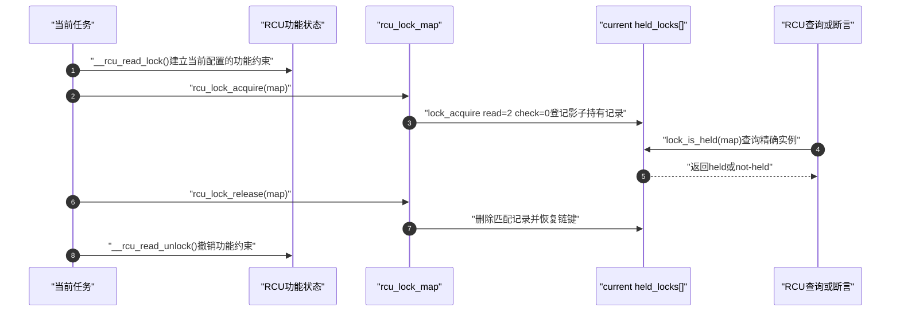
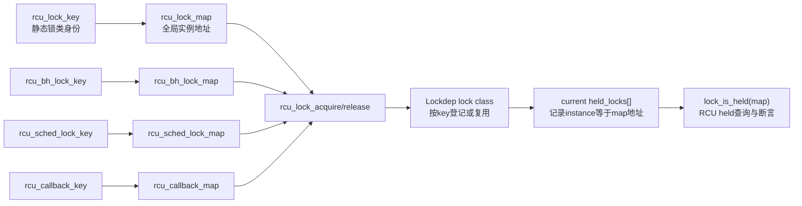
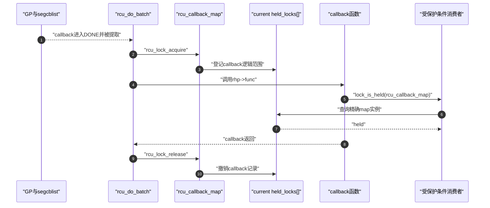

# 第4章\_Linux\_6.12\_RCU\_Lockdep适配层源码实现

## 4.1\_实现所有权与读者目标

本章只解释 **RCU 怎样使用 Lockdep**，不复制 Lockdep 核心算法，也不把四个 `lockdep_map` 误写成真正提供互斥的锁。

| 实现问题 | 权威位置 |
| --- | --- |
| `lockdep_map`、key、lock class 和 class cache 的通用含义 | [`lock_class_key` 与 `lockdep_map` 身份结构](../../lockdep/source_explanations/P01_Linux_6.12_Lockdep身份与锁类源码实现.md#1.2_lock_class_key与lockdep_map身份结构) |
| acquire 怎样写入 `current->held_locks[]`，release 怎样撤销当前记录 | [`lock_acquire()` 事件入口](../../lockdep/source_explanations/P02_Linux_6.12_Lockdep取得释放与持锁账本源码实现.md#2.3_lock_acquire事件入口)与 [`__lock_acquire()` 取得状态提交](../../lockdep/source_explanations/P02_Linux_6.12_Lockdep取得释放与持锁账本源码实现.md#2.4___lock_acquire取得状态提交) |
| `lock_is_held()` 怎样查询当前任务的影子持有记录 | [`lock_is_held_type()` 当前持锁查询](../../lockdep/source_explanations/P04_Linux_6.12_Lockdep查询注解与配置源码实现.md#4.2_lock_is_held_type当前持锁查询) |
| RCU Lockdep适配模块的参与者、状态和三条调用链 | [Linux 6.12 RCU Lockdep适配模块源码概念导读](../navigation/P05_Linux_6.12_RCU_Lockdep适配模块源码概念导读.md#5.1_模块问题与实现所有权) |
| RCU 为什么需要四个虚拟 map、怎样登记和消费它们 | **本章** |

RCU 稳定机制入口见 [RCU 类型语义、Sparse 与 Lockdep](../../../../knowledge/linux/synchronization_and_asynchrony/synchronization/rcu/P26_RCU_类型语义_Sparse与Lockdep.md#26.1.5_Lockdep检查的是哪一个运行时条件)，版本化源码总入口见 [Linux 6.12 RCU 源码总阅读索引](../navigation/P01_Linux_6.12_RCU源码总阅读索引.md#1.9_建议的源码阅读顺序)。Lockdep 侧怎样看待 RCU 这种逻辑保护域，见 [RCU 与子系统检查适配](../../../../knowledge/linux/synchronization_and_asynchrony/synchronization/lockdep/P07_RCU与子系统检查适配.md#7.5_从通用Lockdep到RCU实现的证据边界)。

本章使用 NXP Linux 6.12.20、提交 `dfaf2136deb2af2e60b994421281ba42f1c087e0` 的已核对源码副本。基线只确认 `CONFIG_TREE_RCU=y` 与 `CONFIG_PREEMPT_RCU=y`，没有确认目标板启用 `CONFIG_PROVE_LOCKING`、`CONFIG_DEBUG_LOCK_ALLOC` 或 `CONFIG_PROVE_RCU`；因此下面解释的是该版本的 **可选检查分支**，不宣称目标板正在运行它。

## 4.2\_源码符号覆盖账本

四个名字共享 `lockdep_map` 类型，但它们表示四种不同的 RCU 逻辑范围：

| 符号 | RCU 专属身份 | 登记入口 | 撤销入口 | 主要消费者 | 功能状态还是检查状态 |
| --- | --- | --- | --- | --- | --- |
| `rcu_lock_map` | 普通 `rcu_read_lock()` 读侧范围 | `rcu_read_lock()` | `rcu_read_unlock()` | `rcu_read_lock_held()`、断言、自等待检查 | 当前任务的 Lockdep 影子状态 |
| `rcu_bh_lock_map` | `rcu_read_lock_bh()` 读侧范围 | `rcu_read_lock_bh()` | `rcu_read_unlock_bh()` | any-held、断言、睡眠与自等待检查 | 当前任务的 Lockdep 影子状态 |
| `rcu_sched_lock_map` | `rcu_read_lock_sched()` 读侧范围 | `rcu_read_lock_sched()` | `rcu_read_unlock_sched()` | sched-held、any-held、断言、自等待检查 | 当前任务的 Lockdep 影子状态 |
| `rcu_callback_map` | 正在调用 RCU callback 或执行 RCU 延迟释放 | `rcu_do_batch()` 等 callback 执行路径 | 对应 callback 返回之后 | callback 内部的保护条件，例如 Maple Tree dead-node walk | 当前任务的 Lockdep 影子状态 |

**实现原理：** RCU 用全局 map 地址表达稳定逻辑身份，用 `rcu_lock_acquire()`/`rcu_lock_release()` 把进入和退出事件投影到 `current->held_locks[]`，再由 held 查询、断言或保护条件消费。RCU 功能状态与 Lockdep 影子状态并行推进，前者建立正确性，后者验证已经覆盖的调用协议。

这四个对象都 **不保存 RCU 功能状态**：

- 不禁止两个 CPU 同时进入 RCU 读侧；
- 不推进 `gp_seq`，不清 `qsmask`，不报告 QS；
- 不等待宽限期，不使 callback 获得执行资格；
- 不替代 `preempt_disable()`、`local_bh_disable()` 或 PREEMPT_RCU 的嵌套计数。

它们只给通用 Lockdep 一个稳定地址，用这个地址把“当前任务进入了哪一种 RCU 逻辑范围”投影到检查器的 held-lock 账本。

## 4.3\_声明定义key与静态生命期

### 4.3.1\_四个extern声明为什么放在公共头文件

[`include/linux/rcupdate.h`](../../linux/include/linux/rcupdate.h) 无条件声明四个对象：

```c
/**
 * @brief 向其他翻译单元公开四个 RCU Lockdep 逻辑身份。
 * @note 本 Doxygen 说明由仓库补充；声明本身不分配功能锁。
 */
extern struct lockdep_map rcu_lock_map;
extern struct lockdep_map rcu_bh_lock_map;
extern struct lockdep_map rcu_sched_lock_map;
extern struct lockdep_map rcu_callback_map;
```

`extern` 只告诉编译器“定义位于其他翻译单元”。公共 RCU inline API、`tree.c`、`srcutree.c` 和子系统调用点都可以取得同一个 map 地址；真正的存储由 `kernel/rcu/update.c` 在检查配置下提供。

声明无条件存在，而定义受 `CONFIG_DEBUG_LOCK_ALLOC` 控制并不矛盾。配置关闭时，`rcu_lock_acquire()`、`rcu_lock_release()` 和相关告警宏退化为空操作或保守 inline，编译结果不会生成对这些对象的有效引用，因此链接器不需要不存在的定义。若新增一条配置关闭后仍直接取 `&rcu_lock_map` 的代码路径，就会破坏这个不变量并暴露为链接错误。

### 4.3.2\_四个key和map怎样定义

[`kernel/rcu/update.c`](../../linux/kernel/rcu/update.c) 在 `CONFIG_DEBUG_LOCK_ALLOC` 分支中定义四个永久静态 key 和四个全局 map：

```c
/**
 * @brief 普通RCU读侧的Lockdep身份。
 * @note key具有静态生命期，map地址作为实例身份导出给其他翻译单元。
 */
static struct lock_class_key rcu_lock_key;
struct lockdep_map rcu_lock_map = {
	.name = "rcu_read_lock",
	.key = &rcu_lock_key,
	.wait_type_outer = LD_WAIT_FREE,
	.wait_type_inner = LD_WAIT_CONFIG,
};
EXPORT_SYMBOL_GPL(rcu_lock_map);

/** @brief BH RCU读侧的独立Lockdep身份。 */
static struct lock_class_key rcu_bh_lock_key;
struct lockdep_map rcu_bh_lock_map = {
	.name = "rcu_read_lock_bh",
	.key = &rcu_bh_lock_key,
	.wait_type_outer = LD_WAIT_FREE,
	.wait_type_inner = LD_WAIT_CONFIG,
};
EXPORT_SYMBOL_GPL(rcu_bh_lock_map);

/** @brief sched RCU读侧的独立Lockdep身份。 */
static struct lock_class_key rcu_sched_lock_key;
struct lockdep_map rcu_sched_lock_map = {
	.name = "rcu_read_lock_sched",
	.key = &rcu_sched_lock_key,
	.wait_type_outer = LD_WAIT_FREE,
	.wait_type_inner = LD_WAIT_SPIN,
};
EXPORT_SYMBOL_GPL(rcu_sched_lock_map);

/** @brief RCU callback正在执行的Lockdep上下文身份。 */
static struct lock_class_key rcu_callback_key;
struct lockdep_map rcu_callback_map =
	STATIC_LOCKDEP_MAP_INIT("rcu_callback", &rcu_callback_key);
EXPORT_SYMBOL_GPL(rcu_callback_map);
```

四个 key 必须分开。如果复用同一个 key，Lockdep 会把不同 RCU 逻辑域归入同一锁类，查询和诊断就失去区分能力。key 和 map 都具有内核全生命周期，因而不会出现历史锁类仍引用已经释放身份的问题。

`EXPORT_SYMBOL_GPL()` 与 `extern` 的职责不同：前者把已定义对象加入 GPL-only 内核符号导出表，允许符合条件的模块引用；后者只完成 C 语言编译期声明。删除导出不会改变内核内建调用点，却可能破坏外部 GPL 模块的链接。

### 4.3.3\_wait_type_outer和wait_type_inner为何不同

Lockdep 的 `wait_type_outer` 表示“这个 map 可以在哪种等待上下文中取得”，`wait_type_inner` 表示“持有它以后向内层代码呈现什么等待上下文”。通用枚举和检查算法归 [`lockdep_map` 身份结构](../../lockdep/source_explanations/P01_Linux_6.12_Lockdep身份与锁类源码实现.md#1.2_lock_class_key与lockdep_map身份结构) 与 Lockdep 核心所有；RCU 在这里负责选择符合自身执行约束的参数。

| map | outer | inner | RCU 侧理由 |
| --- | --- | --- | --- |
| 普通 RCU | `LD_WAIT_FREE` | `LD_WAIT_CONFIG` | 进入动作本身不等待，可从严格上下文进入；PREEMPT_RT 隐含 PREEMPT_RCU，因此内部约束按配置变化 |
| RCU-bh | `LD_WAIT_FREE` | `LD_WAIT_CONFIG` | 进入动作本身不等待；PREEMPT_RT 下 BH 可以线程化/可抢占，不能永久写死为 raw-spin 语义 |
| RCU-sched | `LD_WAIT_FREE` | `LD_WAIT_SPIN` | 入口执行 `preempt_disable()`，持有期间呈现非睡眠的 spin 等待边界 |
| RCU callback | 默认 0，即 `LD_WAIT_INV` | 默认 0，即 `LD_WAIT_INV` | `STATIC_LOCKDEP_MAP_INIT()` 这里只建立名称和 key；本 map 用作 callback 上下文令牌，不参与等待上下文建模 |

`outer=LD_WAIT_FREE` 不是“读侧内部可以任意睡眠”。它只说明进入这个虚拟范围本身不会等待；真正允许的内层行为由 `inner`、当前更严格的外层上下文和 RCU 功能契约共同约束。Lockdep 的 `check_wait_context()` 会在整条 held stack 中保留最严格上下文，RCU map 不会把 raw-spin 或 IRQ 上下文放宽。

## 4.4\_进入与退出怎样写入检查器影子状态

### 4.4.1\_rcu_lock_acquire和rcu_lock_release包装参数

[`include/linux/rcupdate.h`](../../linux/include/linux/rcupdate.h) 将通用 Lockdep 事件包装成 RCU 专用入口：

```c
/**
 * @brief 把进入RCU逻辑范围登记到当前任务的Lockdep账本。
 * @param map 四个RCU map之一，或其他RCU域自己的dep_map。
 */
static inline void rcu_lock_acquire(struct lockdep_map *map)
{
	lock_acquire(map, 0, 0, 2, 0, NULL, _THIS_IP_);
}

/**
 * @brief 撤销与map匹配的当前Lockdep持有记录。
 */
static inline void rcu_lock_release(struct lockdep_map *map)
{
	lock_release(map, _THIS_IP_);
}
```

`lock_acquire()` 的每个参数都有具体含义：

| 参数 | RCU传值 | 结果 |
| --- | --- | --- |
| `subclass` | `0` | 使用默认 subclass |
| `trylock` | `0` | 普通登记；相邻的 `rcu_try_lock_acquire()` 才传 `1` |
| `read` | `2` | 按允许同实例递归的 read-acquire 建模，适配嵌套 RCU 读侧 |
| `check` | `0` | 只要求简单检查与 held-stack 维护，不进行普通锁那套完整依赖链验证 |
| `nest_lock` | `NULL` | 没有外部嵌套锁实例 |
| `ip` | `_THIS_IP_` | 保存实际登记调用点，供失配诊断使用 |

`read=2` 只改变 Lockdep 对嵌套和依赖类型的建模，不会使 RCU reader 获得共享锁，也不会维护 RCU 的功能嵌套计数。`check=0` 仍会经过 map 注册、wait-context 检查和 held record 提交；只是 `validate_chain()` 不执行完整依赖图验证。

相邻的 `rcu_try_lock_acquire()` 把 `trylock` 改为 1，Linux 6.12 的已保存源码中由 NMI-safe SRCU 读侧入口使用。四个全局 map 的常规路径使用 `rcu_lock_acquire()`，因此本章不把 SRCU 域实例的生命期重复展开。

### 4.4.2\_三种读侧API为何按这个顺序配对

公共读侧包装把功能动作和检查动作并列放置：

```c
/** @brief 普通RCU读侧：先进入功能范围，再登记检查范围。 */
static __always_inline void rcu_read_lock(void)
{
	__rcu_read_lock();
	__acquire(RCU);
	rcu_lock_acquire(&rcu_lock_map);
	RCU_LOCKDEP_WARN(!rcu_is_watching(),
			 "rcu_read_lock() used illegally while idle");
}

/** @brief 普通RCU退出：先撤销检查范围，再离开功能范围。 */
static inline void rcu_read_unlock(void)
{
	RCU_LOCKDEP_WARN(!rcu_is_watching(),
			 "rcu_read_unlock() used illegally while idle");
	rcu_lock_release(&rcu_lock_map); /* 保留acquire信息供release失配诊断。 */
	__release(RCU);
	__rcu_read_unlock();
}
```

BH 和 sched 变体遵循同一配对结构：

```text
rcu_read_lock_bh()
    → local_bh_disable()                 功能约束
    → rcu_lock_acquire(rcu_bh_lock_map)  检查影子状态

rcu_read_unlock_bh()
    → rcu_lock_release(rcu_bh_lock_map)  撤销影子状态
    → local_bh_enable()                  撤销功能约束

rcu_read_lock_sched()
    → preempt_disable()                     功能约束
    → rcu_lock_acquire(rcu_sched_lock_map)  检查影子状态

rcu_read_unlock_sched()
    → rcu_lock_release(rcu_sched_lock_map)  撤销影子状态
    → preempt_enable()                      撤销功能约束
```

进入时先建立功能约束，退出时最后撤销功能约束，使检查事件始终被实际 RCU 范围包住。将 acquire 提到功能入口之前，会制造“检查器认为已进入、功能状态尚未建立”的窗口；将 release 放到功能退出之后，则会制造相反窗口。正常执行也许暂时看不出错误，但断言、递归诊断或中断嵌套观察到的状态会失真。

### 4.4.3\_普通读侧的端到端检查时序



这张图刻意画出两条状态轴：`F` 是 RCU 正确性依赖的功能状态，`H` 是 Lockdep 的当前影子状态。只有两条轴的事件顺序和配对忠实，查询结果才具有诊断意义。

## 4.5\_四个map怎样落到Lockdep当前账本

### 4.5.1\_对象关系与状态地址



首次遇到某个 map 时，Lockdep 可由 key 建立或查找对应 lock class；每次进入则把具体 `map` 地址写进当前任务的 `held_lock.instance`。查询按 map 实例匹配当前账本，不是读取 map 内部的“已加锁位”。

所以 `struct lockdep_map` 的全局对象本身基本是 **身份载体**：状态变化主要发生在 `current->held_locks[]` 和 Lockdep 全局类/历史结构中。两个任务同时进入普通 RCU 读侧时，它们各自拥有一条指向同一个 `rcu_lock_map` 的 current 记录，不会争抢 map，也不会互相阻塞。

### 4.5.2\_嵌套读侧为何不能只用一个布尔值

普通 RCU 读侧允许嵌套：

```text
rcu_read_lock()
    rcu_read_lock()
    rcu_read_unlock()
rcu_read_unlock()
```

`read=2` 告诉 Lockdep这是允许同实例递归的 read-acquire。每次 acquire/release 仍必须配对；若只维护一个布尔值，内层 unlock 会过早把外层范围清掉。功能侧也有自己的嵌套规则，两边必须分别正确，不能靠 Lockdep 记录代替功能计数。

进入和退出还必须发生在同一执行上下文。上游 `rcu_read_lock_held()` 注释明确指出：不能在 IRQ handler 中进入后回到进程上下文退出。map 是全局身份，并不意味着 held record 可以跨任务或跨不匹配的上下文迁移。

## 4.6\_held查询怎样消费三种读侧map

### 4.6.1\_rcu_read_lock_held_common先决定能否相信Lockdep

[`kernel/rcu/update.c`](../../linux/kernel/rcu/update.c) 先用公共前置函数处理检查器不可用、EQS 和 CPU offline：

```c
/**
 * @brief 决定调用者应使用保守答案，还是继续查询Lockdep map。
 * @param ret 需要提前返回时保存最佳猜测。
 * @return true表示直接返回*ret；false表示继续查询Lockdep。
 */
static bool rcu_read_lock_held_common(bool *ret)
{
	if (!debug_lockdep_rcu_enabled()) {
		*ret = true;   /* 检查器不可靠时保守地认为保护成立，避免误报。 */
		return true;
	}
	if (!rcu_is_watching()) {
		*ret = false;  /* EQS中不能合法声称普通RCU读侧。 */
		return true;
	}
	if (!rcu_lockdep_current_cpu_online()) {
		*ret = false;  /* RCU视角离线CPU同样不允许进入。 */
		return true;
	}
	return false;
}
```

这说明 `*_held()` 是 **调试谓词**，不是绝对精确的功能状态读取器。早期启动、Lockdep 已关闭或检查器递归时，它宁可返回保守的 true 以避免虚假告警；只有检查器可依赖时才查询 map。EQS 和 offline 判断则防止把非法上下文误报成合法读侧。

### 4.6.2\_四个查询为何不都直接读取同一个map

```c
int rcu_read_lock_held(void)
{
	bool ret;

	if (rcu_read_lock_held_common(&ret))
		return ret;
	return lock_is_held(&rcu_lock_map);
}

int rcu_read_lock_sched_held(void)
{
	bool ret;

	if (rcu_read_lock_held_common(&ret))
		return ret;
	return lock_is_held(&rcu_sched_lock_map) || !preemptible();
}

int rcu_read_lock_bh_held(void)
{
	bool ret;

	if (rcu_read_lock_held_common(&ret))
		return ret;
	return in_softirq() || irqs_disabled();
}
```

普通查询必须看到精确的 `rcu_lock_map` 记录。sched 查询还接受功能上下文可直接证明的 `!preemptible()`。BH 查询最终使用 `in_softirq() || irqs_disabled()`，而不是直接查询 `rcu_bh_lock_map`；上游注释说明这条功能上下文判断同时覆盖启用与关闭 `CONFIG_PROVE_RCU` 的情形。`rcu_bh_lock_map` 仍然用于精确断言、any-held 和失配诊断，不能因此删除。

`rcu_read_lock_any_held()` 依次检查三个 map，最后用 `!preemptible()` 作为更宽的功能上下文证据：

```c
if (lock_is_held(&rcu_lock_map) ||
    lock_is_held(&rcu_bh_lock_map) ||
    lock_is_held(&rcu_sched_lock_map))
	return 1;
return !preemptible();
```

`rcu_callback_map` 不属于任何 reader-held 查询。callback 已经过 GP 并进入延迟动作执行阶段，它与“当前正在借用受 RCU 保护对象的 reader”是不同逻辑域。

### 4.6.3\_断言和自等待检查怎样使用map

RCU 公共头文件和同步等待入口直接查询 map：

```text
lockdep_assert_in_rcu_read_lock()
    → lock_is_held(rcu_lock_map)

lockdep_assert_in_rcu_read_lock_bh()
    → lock_is_held(rcu_bh_lock_map)

lockdep_assert_in_rcu_read_lock_sched()
    → lock_is_held(rcu_sched_lock_map)

synchronize_rcu()
    → 三个map任一held时由RCU_LOCKDEP_WARN报告非法自等待
```

精确断言故意要求调用者实际经过相应 RCU API。例如仅执行 `local_bh_disable()` 不等于调用了 `rcu_read_lock_bh()`，因此 `lockdep_assert_in_rcu_read_lock_bh()` 仍要求 `rcu_bh_lock_map` 记录。相反，`rcu_read_lock_bh_held()` 作为较宽的调试谓词接受功能上下文。两组接口的证明目标不同，不能因为返回条件相似就合并。

`synchronize_rcu()` 的三-map 检查只负责报告已经执行到的非法自等待调用。真正阻塞、推进 GP 和唤醒等待者的功能链仍由 [`synchronize_rcu()` 接口实现](P01_Linux_6.12_RCU_公共接口与检查机制源码详解.md#1.4_synchronize_rcu接口实现)和[非抢占式 Tree RCU 关键函数](P02_Linux_6.12_非抢占式_Tree_RCU_关键函数源码实现.md#2.3___wait_rcu_gp与wakeme_after_rcu连接等待者)承担。

## 4.7\_rcu_callback_map怎样标记延迟动作上下文

### 4.7.1\_为什么callback需要第四个逻辑身份

普通、BH 和 sched map 表示 reader 范围，`rcu_callback_map` 表示“当前正在由 RCU callback 执行路径调用延迟动作”。它解决的问题不是等待旧 reader，而是让 callback 内部代码能够把“GP 已经完成并且我正处于 RCU 交付的延迟执行范围”作为可动态检查的调用条件之一。

[`kernel/rcu/tree.c`](../../linux/kernel/rcu/tree.c) 的普通 callback 批处理路径在真正调用 `rhp->func` 前后配对：

```c
/**
 * @brief 在callback函数真正执行期间登记rcu_callback_map。
 * @note 省略了批量预算、trace和debug代码，未改变事件顺序。
 */
for (; rhp; rhp = rcu_cblist_dequeue(&rcl)) {
	rcu_callback_t f;

	rcu_lock_acquire(&rcu_callback_map);
	f = rhp->func;
	WRITE_ONCE(rhp->func, (rcu_callback_t)0L);
	f(rhp);
	rcu_lock_release(&rcu_callback_map);
	/* ...批量限流与让出判断... */
}
```

同一文件的批量 `kfree_rcu` 与 `kvfree_rcu` 实际释放路径也在释放动作前后取得和释放 `rcu_callback_map`。这使普通函数 callback 和优化后的直接释放路径对检查器呈现一致的“RCU 延迟动作正在执行”身份。

### 4.7.2\_MapleTree怎样消费callback身份

仓库已保存的 [`lib/maple_tree.c`](../../linux/lib/maple_tree.c) 在 callback 清理 dead node 的遍历中使用：

```c
next = rcu_dereference_protected(slots[offset],
				 lock_is_held(&rcu_callback_map));
```

这里的 `lock_is_held(&rcu_callback_map)` 是传给 `rcu_dereference_protected()` 的 **可检查保护理由**。它只能证明当前路径确实由带 annotation 的 RCU callback 执行范围调用；dead node 为什么可以在该阶段被受保护地遍历，还依赖 Maple Tree 自己的对象状态、入口封闭和 callback 生命周期协议。map 不会自动锁住 `slots`，也不会为任意 callback 内的任意指针提供安全性。

### 4.7.3\_callback执行时序



`rcu_callback_map` 的进入点必须在 callback 之前，退出点必须在 callback 返回之后。若只包住 trace 或 debug 调用，callback 内的保护条件会错误失败；若 release 遗漏，后续同一任务执行的无关代码会错误地被认为仍在 callback 范围内。

## 4.8\_配置关闭时对象和查询怎样退化

### 4.8.1\_Kconfig依赖链

Linux 6.12 的关系为：

```text
CONFIG_PROVE_LOCKING=y
    ├→ select CONFIG_LOCKDEP
    ├→ select CONFIG_DEBUG_LOCK_ALLOC
    └→ kernel/rcu/Kconfig.debug令CONFIG_PROVE_RCU=y
```

`CONFIG_DEBUG_LOCK_ALLOC` 也可能由其他调试功能选择，因此“map 和 held tracking 存在”与“`RCU_LOCKDEP_WARN()` 启用”不能压成同一个布尔条件。

| 配置组合 | 四个map定义 | acquire/release | `RCU_LOCKDEP_WARN()` | held查询 |
| --- | --- | --- | --- | --- |
| `PROVE_LOCKING=y` | 存在 | 写入/撤销 Lockdep 当前账本 | `PROVE_RCU=y`，执行动态检查 | 检查器可用时查询 map/功能上下文 |
| `DEBUG_LOCK_ALLOC=y`、`PROVE_RCU=n` | 存在 | 仍可维护当前账本 | 空操作 | out-of-line 查询仍按其实现给出调试答案 |
| `DEBUG_LOCK_ALLOC=n` | 不定义 | 三个 wrapper 均为空操作 | 不可能形成完整 PROVE_RCU 路径 | 使用头文件中的保守 inline 回退 |

### 4.8.2\_无DEBUG_LOCK_ALLOC时为何返回保守值

头文件中的退化分支为：

```c
#define rcu_lock_acquire(a)       do { } while (0)
#define rcu_try_lock_acquire(a)   do { } while (0)
#define rcu_lock_release(a)       do { } while (0)

static inline int rcu_read_lock_held(void)       { return 1; }
static inline int rcu_read_lock_bh_held(void)    { return 1; }
static inline int rcu_read_lock_sched_held(void) { return !preemptible(); }
static inline int rcu_read_lock_any_held(void)   { return !preemptible(); }
static inline int debug_lockdep_rcu_enabled(void) { return 0; }
```

普通与 BH 查询返回 1 是为了让依赖这些谓词的调试条件在没有检查器时不产生虚假违规；这不是宣称当前真的处于读侧。sched/any 仍可从 `preemptible()` 得到一个功能上下文近似。关闭配置后失去的是动态证明能力，不是 RCU API 契约。

## 4.9\_修改RCU适配层时必须保持什么

### 4.9.1\_修改影响矩阵

| 修改点 | 必须保持的不变量 | 必查位置 |
| --- | --- | --- |
| 新增或拆分 map | 每个逻辑域拥有稳定且正确粒度的 key；身份不过宽也不过窄 | `rcupdate.h` 声明、`update.c` 定义/导出、全部 acquire/release 与查询消费者 |
| 改 wait type | outer 表达可进入上下文，inner 表达持有期间约束；不能让 RCU map 放宽更严格外层 | PREEMPT_RT 与非 RT、hardirq/softirq、raw spin 和睡眠锁组合 |
| 改读侧 wrapper 顺序 | 功能进入先于检查登记；检查撤销先于功能退出；所有异常/嵌套路径配对 | 普通、BH、sched 三组 API 及 tracing/noinstr 变体 |
| 改 callback 包围范围 | 所有实际 callback/延迟释放动作在 map 范围内，限流和下一项处理不应继承上一项的错误状态 | `rcu_do_batch()`、批量 kfree、kvfree、NOCB 最终调用链 |
| 改 held 查询 | 明确它要精确 API 身份还是功能上下文近似；保留 early boot、EQS、offline 和 checker-disabled 边界 | `rcu_read_lock_held_common()`、四个 `*_held()`、断言与告警调用点 |
| 改配置分支 | 配置关闭后不得留下 map 符号引用；保守返回不能被误写成功能事实 | `CONFIG_DEBUG_LOCK_ALLOC`、`CONFIG_PROVE_LOCKING`、`CONFIG_PROVE_RCU` |
| 改导出 | 区分内建调用与外部 GPL 模块 ABI 影响 | 四个 `EXPORT_SYMBOL_GPL()` 与模块调用方 |

### 4.9.2\_新增第五个逻辑域的最小闭环

若未来为新的 RCU 逻辑域增加 map，不能只复制一条 `extern`。至少完成：

1. 决定它是否真是独立身份，还是应复用已有域；
2. 定义静态生命期 key、map 名称和准确 wait type；
3. 在所有成功入口登记，在所有正常、失败和回滚出口释放；
4. 决定嵌套是否允许，以及 `read`/`trylock`/`check` 参数；
5. 指定谁消费该身份：held 查询、断言、`*_protected()` 条件还是非法调用告警；
6. 提供 `DEBUG_LOCK_ALLOC=n` 的零引用退化路径；
7. 检查是否需要 GPL 导出；
8. 覆盖嵌套、失配释放、错误上下文、检查器关闭和目标调用路径。

### 4.9.3\_建议的验证矩阵

修改外部 Linux 源码时至少在匹配工作树中验证：

```text
构建A：PROVE_LOCKING=y、PROVE_RCU=y
    → 合法普通/BH/sched读侧不告警
    → 故意失配或在读侧调用synchronize_rcu产生预期告警
    → callback消费者能观察到rcu_callback_map

构建B：DEBUG_LOCK_ALLOC=n
    → 不出现四个map的未定义符号
    → 功能RCU读侧、GP和callback行为保持不变

构建C：PREEMPT_RT与非RT（若修改wait type）
    → 等待上下文诊断符合各自功能约束

运行覆盖：嵌套读侧、IRQ/BH边界、普通callback、NOCB、批量kfree/kvfree
    → acquire/release深度最终回到入口前状态
```

本仓库知识整理任务不修改外部源码树，也未在本次执行这些内核构建；上表是读者实际修改 Linux 源码后的验证要求。

## 4.10\_本章结论与复核问题

四个对象不是四把 RCU 功能锁，而是四个 **RCU 专属 Lockdep 身份**。RCU 负责选择身份、wait type、事件位置和消费者；Lockdep 负责把事件变成 current 影子记录、锁类和查询结果。两层缺一不可，但实现所有权不能混在同一篇里重复维护。

复核时应能回答：

1. `extern`、全局定义、静态 key 和 `EXPORT_SYMBOL_GPL()` 各自解决什么问题？
2. 为什么普通/BH/sched map 需要不同名称和 key，为什么 callback 不能复用 reader map？
3. `read=2`、`check=0` 和三个 wait type 参数分别怎样改变 Lockdep 建模？
4. 为什么 `rcu_read_lock_bh_held()` 不直接查询 `rcu_bh_lock_map`，但 BH map 仍不可删除？
5. `rcu_callback_map` 能证明什么，为什么它不能单独证明 callback 中任意指针访问安全？
6. 若把 `rcu_lock_release()` 移到功能退出之后，哪些检查窗口会失真？
7. `CONFIG_DEBUG_LOCK_ALLOC=n` 时为什么不会产生四个 extern 的链接错误？

源码总入口：[Linux 6.12 RCU 源码总阅读索引](../navigation/P01_Linux_6.12_RCU源码总阅读索引.md#1.9_建议的源码阅读顺序)。

RCU 稳定知识入口：[RCU 类型语义、Sparse 与 Lockdep](../../../../knowledge/linux/synchronization_and_asynchrony/synchronization/rcu/P26_RCU_类型语义_Sparse与Lockdep.md#26.1.5_Lockdep检查的是哪一个运行时条件)。

Lockdep 通用实现入口：[Linux 6.12 Lockdep 源码导读](../../lockdep/navigation/P01_Linux_6.12_Lockdep源码导读.md#1.1_基线与阅读目标)。
