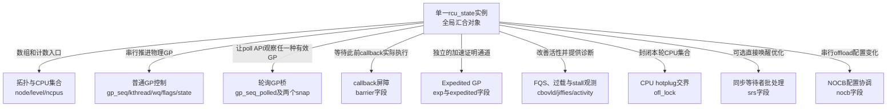
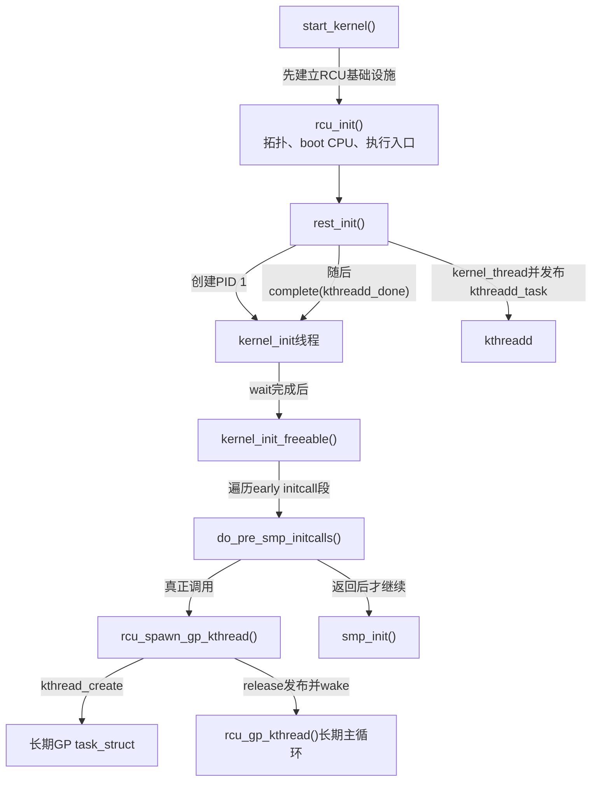
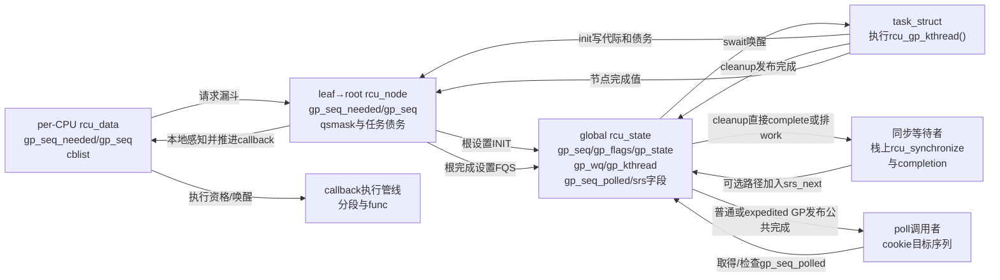
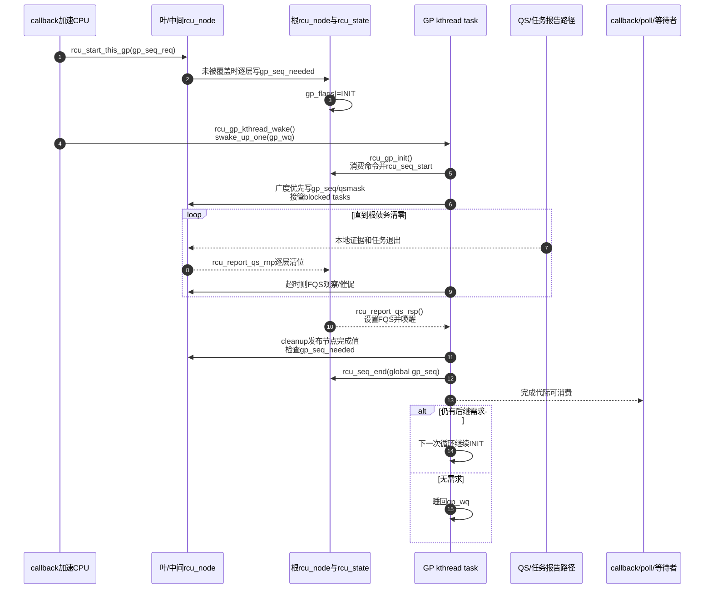

# 第5章\_Linux\_6.12\_Tree\_RCU\_GP全局生命周期源码实现

## 5.1\_实现所有权与关联入口

本章是 Linux 6.12.20 普通 Tree RCU GP 全局控制实现的唯一函数体讲解，负责从内核启动期注册并创建 GP kthread，到 `rcu_state` 的 GP 控制字段、`rcu_seq_*`、需求漏斗、唤醒、主循环、init、FQS **调度循环** 和 cleanup。CPU 怎样产生并逐层报告 QS，仍由 [非抢占式 Tree RCU 关键函数源码实现](P02_Linux_6.12_非抢占式_Tree_RCU_关键函数源码实现.md#2.2_函数实现索引)负责；被抢占 reader 怎样进入任务债务，仍由 [抢占式 Tree RCU 关键函数源码实现](P03_Linux_6.12_抢占式_Tree_RCU_关键函数源码实现.md#3.2_任务与节点的共享状态实现)负责；watching snapshot、叶扫描、urgent/resched 和 stall 分类由 [force-QS 与 Stall 源码实现](P07_Linux_6.12_Tree_RCU_force_QS与Stall源码实现.md#7.2_源码符号覆盖账本)唯一展开。

模块协作、参与者与阅读顺序见 [GP 全局生命周期模块源码概念导读](../navigation/P06_Linux_6.12_Tree_RCU_GP全局生命周期模块源码概念导读.md#6.3_源码文件与状态所有权)，跨版本概念见 [Tree RCU GP 请求与全局生命周期](../../../../knowledge/linux/synchronization_and_asynchrony/synchronization/rcu/P12_Tree_RCU_GP请求与全局生命周期.md#12.2_六个必须分开的专有名词)。

下列 `/** ... */` 块都是本仓库为阅读补充的中文 Doxygen 说明，不是上游源码原注释。RCU 函数体裁剪自仓库保存并经固定提交核对的文件；启动调度顺序另外对照同一不可变提交的官方 [`init/main.c`](https://github.com/nxp-imx/linux-imx/blob/dfaf2136deb2af2e60b994421281ba42f1c087e0/init/main.c)。只删除不改变主状态机的 trace、torture、重复诊断，以及已明确转入独立章节的 NOCB/boost/strict 测试细节，所有影响启动次序、请求、CPU 集合、证明债务、完成发布和等待者交付的动作都保留或在紧邻小节展开。完整实现仍以链接的固定源码文件为准。

每个源码标题都按同一组 **实现原理** 复核：进入前持有什么锁或代际，语句写入哪个具体地址，谁在后续路径读取，以及该顺序防止哪一种请求丢失、跨代报告或完成发布竞态。

## 5.2\_源码符号覆盖账本

| 符号 | 上游相对位置 | 唯一讲解标题 | 状态副作用 |
| --- | --- | --- | --- |
| `struct rcu_state` 全字段域、全局 `rcu_state` 实例、`RCU_GP_*` | [`kernel/rcu/tree.h`](../../linux/kernel/rcu/tree.h)、[`kernel/rcu/tree.c`](../../linux/kernel/rcu/tree.c) | [5.3](#5.3_rcu_state把线程命令代际和等待队列放在一起) | 分流九个子机制，定义普通 GP 的任务、命令、阶段与序列地址，并建立各域初值 |
| `rcu_seq_start/end/snap/done()` | [`kernel/rcu/rcu.h`](../../linux/kernel/rcu/rcu.h) | [5.4](#5.4_rcu_seq辅助函数怎样维护开始目标与完成) | 推进代际并约束发布顺序 |
| `early_initcall()`、`do_pre_smp_initcalls()`、`kernel_init_freeable()` | [`include/linux/init.h`](../../linux/include/linux/init.h)、[`init/main.c`](https://github.com/nxp-imx/linux-imx/blob/dfaf2136deb2af2e60b994421281ba42f1c087e0/init/main.c#L1369-L1573) | [5.5.1](#5.5.1_先从内核启动链定位early_initcall) | 把链接期登记的 early initcall 放到 `kthreadd` 就绪后、SMP 启动前分派 |
| `rcu_spawn_gp_kthread()` | [`kernel/rcu/tree.c`](../../linux/kernel/rcu/tree.c) | [5.5.2](#5.5.2_rcu_spawn_gp_kthread怎样创建并发布任务) | 创建并 release 发布 GP 任务 |
| `rcu_start_this_gp()` | [`kernel/rcu/tree.c`](../../linux/kernel/rcu/tree.c) | [5.6](#5.6_rcu_start_this_gp漏斗记录未来需求) | 前推 `gp_seq_needed`、设置 INIT |
| `rcu_gp_kthread_wake()` | [`kernel/rcu/tree.c`](../../linux/kernel/rcu/tree.c) | [5.7](#5.7_rcu_gp_kthread_wake把共享命令变成调度唤醒) | 唤醒 `gp_wq` 并记录诊断值 |
| `rcu_gp_kthread()` | [`kernel/rcu/tree.c`](../../linux/kernel/rcu/tree.c) | [5.8](#5.8_rcu_gp_kthread串联一轮物理GP) | 串联等待、init、FQS、cleanup |
| `rcu_gp_init()` | [`kernel/rcu/tree.c`](../../linux/kernel/rcu/tree.c) | [5.9](#5.9_rcu_gp_init开始代际并建立证明债务) | 开始全局/节点代际并建立等待集合 |
| `rcu_gp_fqs_loop()`、`rcu_report_qs_rsp()` | [`kernel/rcu/tree.c`](../../linux/kernel/rcu/tree.c) | [5.10](#5.10_FQS循环与根完成通知) | 等待/催促证据并在根完成时唤醒 |
| `rcu_gp_cleanup()` | [`kernel/rcu/tree.c`](../../linux/kernel/rcu/tree.c) | [5.11](#5.11_rcu_gp_cleanup发布完成并承接下一代) | 发布节点/全局完成并保留后继请求 |
| `rcu_poll_gp_seq_start/end()` | [`kernel/rcu/tree.c`](../../linux/kernel/rcu/tree.c) | [5.11.1](#5.11.1_poll公共序列怎样由普通与expedited_GP共同推进) | 把两类真实 GP 映射为 poll API 的公共完成证据 |
| `synchronize_rcu_normal()`、`rcu_sr_is/get/put_wait_head()`、`rcu_sr_normal_add_req/gp_init/complete/gp_cleanup/cleanup_work()` | [`kernel/rcu/tree.c`](../../linux/kernel/rcu/tree.c) | [5.11.2](#5.11.2_SRS怎样批量交付同步等待者) | 可选地用 dummy 节点把栈上等待者按物理 GP 划批、限额完成并异步清尾 |

以后修改 GP 相关文档时，先查本表。其他正文或模块导读只解释调用上下文与结论，不再复制这些函数体。

## 5.3\_rcu\_state把线程命令代际和等待队列放在一起

`struct rcu_state` 可以称为 **普通 Tree RCU 的单一全局汇合对象**，但不能把它理解成“全部 RCU 状态都在这里”。真正的 reader/QS 债务仍分散在每任务字段、每 CPU `rcu_data` 和每节点 `rcu_node` 中；`rcu_state` 保存树形拓扑入口、全局代际、控制执行者，以及若干跨 CPU 子机制的全局协调状态。

更重要的是：这个结构不是一个大状态机。源码把九组生命周期不同、锁不同、写入者不同的状态共址在同一个 C 结构体中。阅读字段声明以前必须先分域：



### 5.3.1\_完整字段域与权威去向

| 功能域 | 字段 | 谁写、谁读或由什么同步 | 本专题中的权威去向 |
| --- | --- | --- | --- |
| 树形拓扑 | `node[]`、`level[]` | 启动阶段建立；各 `rcu_node` 后续由自己的锁保护 | [P06 拓扑与 CPU 热插拔源码实现](P06_Linux_6.12_Tree_RCU_拓扑与CPU热插拔源码实现.md#6.4_rcu_init_one建立固定汇聚树并绑定每CPU叶节点)、[P14 分层汇聚正文](../../../../knowledge/linux/synchronization_and_asynchrony/synchronization/rcu/P14_Tree_RCU_rcu_node树与分层汇聚.md#14.2_一棵八CPU教学树) |
| CPU 集合摘要 | `ncpus`、`n_online_cpus` | CPU bring-up/hotplug 写；前者只在 CPU 首次加入 expedited ever-online 集合时增长，后者记录当前 RCU online CPU 数并兼作早期初始化判断 | [P06 starting/dead 实现](P06_Linux_6.12_Tree_RCU_拓扑与CPU热插拔源码实现.md#6.6_report_cpu_starting与report_cpu_dead怎样隔离当前轮和下一轮)、[P08 模块导读](../navigation/P08_Linux_6.12_Tree_RCU_拓扑与CPU热插拔模块源码概念导读.md#8.4_它是三组相互交接的状态机) |
| 普通 GP 权威代际与执行者 | `gp_seq`、`gp_max`、`gp_kthread`、`gp_wq`、`gp_flags`、`gp_state`、`gp_wake_time`、`gp_wake_seq` | GP kthread、请求者和根完成路径协作；根锁保护控制决策，诊断字段还使用 `READ_ONCE/WRITE_ONCE` 跨上下文观察 | 本节以及 [5.5～5.11](#5.5_rcu_spawn_gp_kthread创建并发布长期任务) |
| poll API 的公共 GP 观察序列 | `gp_seq_polled`、`gp_seq_polled_snap`、`gp_seq_polled_exp_snap` | 普通 GP 与 expedited GP 开始/结束路径在根锁下更新；poll 调用者只取目标并检查完成 | [P12 轮询接口](../../../../knowledge/linux/synchronization_and_asynchrony/synchronization/rcu/P12_Tree_RCU_GP请求与全局生命周期.md#12.6.3_轮询接口保存的是目标序列)、本节下表 |
| `rcu_barrier()` | `barrier_mutex`、`barrier_cpu_count`、`barrier_completion`、`barrier_sequence`、`barrier_lock` | barrier 调用者、每 CPU 哨兵 callback、hotplug/迁移路径协作；它等待 callback 实际执行，不是普通 GP 的完成状态 | [P10 同步等待与 barrier 源码实现](P10_Linux_6.12_Tree_RCU_同步等待与rcu_barrier源码实现.md#10.6_barrier_callback与entrain如何证明队列前序已执行) |
| Expedited GP | `exp_mutex`、`exp_wake_mutex`、`expedited_sequence`、`expedited_need_qs`、`expedited_wq`、`ncpus_snap` | expedited leader、叶选择 work、CPU/任务报告路径与 follower 协作；不由普通 GP kthread推进；固定提交的 `expedited_need_qs` 无活动访问 | [P08 Expedited GP 源码实现](P08_Linux_6.12_Tree_RCU_Expedited_GP源码实现.md#8.3_权威完成条件) |
| callback 过载、FQS 与 stall 观测 | `cbovld`、`cbovldnext`、`jiffies_force_qs`、`jiffies_kick_kthreads`、`n_force_qs`、`gp_start`、`gp_end`、`gp_activity`、`gp_req_activity`、`jiffies_stall`、`nr_fqs_jiffies_stall`、`jiffies_resched`、`n_force_qs_gpstart` | GP/FQS 路径写节奏与活动时间，stall 检测读取；只能改善活性或诊断，不能替代 QS 证据 | [P07 force-QS 与 Stall 源码实现](P07_Linux_6.12_Tree_RCU_force_QS与Stall源码实现.md#7.2_源码符号覆盖账本)、[P18 callback 积压正文](../../../../knowledge/linux/synchronization_and_asynchrony/synchronization/rcu/P18_Tree_RCU_回调执行_批处理与限流.md#18.10_回调积压的因果链) |
| 名称与 trace 身份 | `name`、`abbr` | 静态初始化，日志与 trace 消费 | 只承担诊断标识，不参与安全证明 |
| CPU offline/GP 初始化互斥 | `ofl_lock` | GP pre-init、CPU starting/dying 路径共同获取 | [P06 hotplug 实现](P06_Linux_6.12_Tree_RCU_拓扑与CPU热插拔源码实现.md#6.6_report_cpu_starting与report_cpu_dead怎样隔离当前轮和下一轮)、[5.9 GP init](#5.9_rcu_gp_init开始代际并建立证明债务) |
| `synchronize_rcu()` 可选直接等待批次 | `srs_next`、`srs_wait_tail`、`srs_done_tail`、`srs_wait_nodes[]`、`srs_cleanup_work`、`srs_cleanups_pending` | 调用者无锁加入，GP init 划定批次，cleanup/workqueue 完成等待者 | [P12 同步请求分支](../../../../knowledge/linux/synchronization_and_asynchrony/synchronization/rcu/P12_Tree_RCU_GP请求与全局生命周期.md#12.6.1_默认同步等待也先登记callback)、[P20 等待对象](../../../../knowledge/linux/synchronization_and_asynchrony/synchronization/rcu/P20_Tree_RCU_同步等待与rcu_barrier.md#20.1.4_默认synchronize_rcu的等待对象) |
| NOCB 配置协调 | `nocb_mutex`、`nocb_is_setup` | offload/deoffload、启动和 shrinker 相关路径读取或串行修改；只在 `CONFIG_RCU_NOCB_CPU` 下存在 | [P09 callback 与 NOCB 源码实现](P09_Linux_6.12_Tree_RCU_回调与NOCB源码实现.md#9.10_动态offload为何只允许offline_CPU并等待状态交接) |

这张表的阅读规则是：**第一次只沿当前问题所在的行继续读。** 研究普通 GP kthread 时需要普通 GP、poll、部分 FQS/hotplug/SRS 字段；`barrier`、expedited 和 NOCB 字段虽然物理上相邻，却属于别的子状态机，不应插入普通 GP 主循环硬背。

### 5.3.2\_本章实际展开的普通GP字段

```c
/**
 * @brief 普通 Tree RCU 的全局 GP 控制字段。
 * @note 本说明由仓库补充；字段裁剪自 kernel/rcu/tree.h。
 */
struct rcu_state {
	struct rcu_node node[NUM_RCU_NODES]; /* 分层证明与需求树。 */
	struct rcu_node *level[RCU_NUM_LVLS + 1];

	/* 下列字段由根 rcu_node 的锁保护。 */
	unsigned long gp_seq;              /* 权威 GP 序列。 */
	unsigned long gp_max;              /* 已观察到的最长普通 GP 时长。 */
	struct task_struct *gp_kthread;    /* 长期 GP 内核任务。 */
	struct swait_queue_head gp_wq;     /* GP 任务睡眠的位置。 */
	short gp_flags;                    /* 请求者交给任务的命令。 */
	short gp_state;                    /* 任务当前观察/睡眠阶段。 */
	unsigned long gp_wake_time;        /* 最近唤醒时间，仅供观察。 */
	unsigned long gp_wake_seq;         /* 唤醒时的 gp_seq 快照。 */
	unsigned long gp_seq_polled;       /* poll API 共用的 GP 观察序列。 */
	unsigned long gp_seq_polled_snap;  /* 普通 GP 对上述序列的开始快照。 */
	unsigned long gp_seq_polled_exp_snap; /* expedited GP 的开始快照。 */

	/* 省略：本章不展开的 barrier、expedited、NOCB 等子状态机。 */
};

/* gp_flags：命令原因，可以按位组合。 */
#define RCU_GP_FLAG_INIT 0x1 /* 需要初始化新 GP。 */
#define RCU_GP_FLAG_FQS  0x2 /* 需要重新检查/强制 QS。 */
#define RCU_GP_FLAG_OVLD 0x4 /* callback 过载。 */

/* gp_state：GP kthread 的观察阶段，不是安全证明。 */
#define RCU_GP_IDLE       0
#define RCU_GP_WAIT_GPS   1
#define RCU_GP_DONE_GPS   2
#define RCU_GP_ONOFF      3
#define RCU_GP_INIT       4
#define RCU_GP_WAIT_FQS   5
#define RCU_GP_DOING_FQS  6
#define RCU_GP_CLEANUP    7
#define RCU_GP_CLEANED    8
```

同一结构中放置这些字段，是为了让根锁串行化全局控制决策，不表示它们属于同一种状态：

- `gp_seq` 回答物理代际；
- `gp_kthread` 回答谁推进；
- `gp_wq` 回答推进者在哪里睡；
- `gp_flags` 回答为什么应该醒；
- `gp_state` 回答它当前处在哪个观察阶段。

`gp_state=RCU_GP_CLEANUP` 不能证明安全。安全条件仍来自根 `qsmask` 和必要的 blocked reader 状态；这里只是主循环在调用 cleanup 前写出的诊断值。

| 字段 | 精确问题 | 写入与消费关系 |
| --- | --- | --- |
| `gp_seq` | 普通物理 GP 的权威代际是否开始/完成 | GP kthread 用 `rcu_seq_start/end()` 写；节点、本地 CPU、callback 与 poll 路径比较 |
| `gp_max` | 到目前为止观察到的最长普通 GP 用了多少 jiffies | cleanup 用 `gp_end-gp_start` 更新；stall 输出读取；它不控制下一轮超时 |
| `gp_kthread` | 哪个长期 `task_struct` 执行普通 GP 主循环 | 初始化发布；请求/唤醒路径读取 |
| `gp_wq` | GP kthread 因等待请求或下一次 FQS 时机睡在哪里 | 主循环等待；请求者和根完成路径唤醒 |
| `gp_flags` | 当前有哪些命令原因需要主循环重新检查 | 请求漏斗写 INIT，根完成/外部 FQS 写 FQS，过载路径携带 OVLD；主循环消费 |
| `gp_state` | GP kthread 当前处于哪个可观察执行阶段 | GP kthread写，stall/trace 读；不表示安全债务是否清零 |
| `gp_wake_time/gp_wake_seq` | 最近一次尝试唤醒发生在何时、当时看见哪个 `gp_seq` | `rcu_gp_kthread_wake()` 写，stall 诊断读；不构成唤醒成功或 GP 完成证明 |
| `gp_seq_polled` | poll API 能否证明自 cookie 以后至少有一轮合格 GP 完成 | 普通或 expedited GP 可以共同推进这条观察序列 |
| `gp_seq_polled_snap` | 当前普通 GP 是否正是打开公共 poll 观察区间的那一轮 | 普通 GP 开始保存，cleanup 结束；只有快照仍匹配才结束公共序列 |
| `gp_seq_polled_exp_snap` | 当前 expedited GP 是否正是打开公共 poll 观察区间的那一轮 | expedited 开始/结束路径对应更新；防止两类 GP 互相错误关闭同一观察区间 |

### 5.3.3\_六个不能从字段名字和分组注释直接推出的结论

1. `gp_seq` 只编码 **代际计数和是否处于进行中状态**，不编码 `WAIT_GPS→INIT→WAIT_FQS→CLEANUP` 的完整阶段；完整线程观察阶段在 `gp_state`。
2. 注释中的 tree in `"heap" form` 指 `node[]` 采用类似堆的紧密数组布局，不是 `kmalloc()` 动态内存堆。`level[i]` 指向第 `i` 层在 `node[]` 中的第一个节点。
3. `barrier_lock` 的上游短注释写“protects `->barrier_seq_snap`”，但 `barrier_seq_snap` 位于每 CPU `rcu_data`，不是 `rcu_state` 的遗漏字段；这把锁还把 barrier 哨兵登记与 CPU hotplug/callback 迁移序列化。
4. 固定提交中 `expedited_need_qs` 只有结构体声明，没有活动写入者或读取者。不能仅凭“# CPUs left to check in”注释虚构一条原子递减算法；当前 expedited 完成条件实际由 `rcu_node.expmask/exp_tasks` 和等待队列检查。
5. `srs_wait_nodes[]` 是 GP 批次之间使用的预分配 **dummy wait-head 分隔节点**，不是为每个 `synchronize_rcu()` 调用者预分配的等待对象池；调用者自己的 `struct rcu_synchronize` 仍承载 completion。
6. “以下字段由根 `rcu_node` 锁保护”的分组注释不能代替逐访问核对。权威代际与请求决策依赖根锁，但 `gp_state`、`gp_wake_time/gp_wake_seq` 等观察字段还会在未持根锁的路径使用 `READ_ONCE/WRITE_ONCE`。它们允许诊断快照有时间差，不能被当成锁保护下的一致事务。

因此，“把整段结构体逐字段翻译成中文”只能得到查询索引，不能替代机制解释。字段的意义必须由初始化、写入者、读取者和完成条件共同确定。

### 5.3.4\_唯一全局实例怎样给各子机制建立初值

`tree.h` 只声明结构布局，真正的普通 Tree RCU 全局实例定义在 `kernel/rcu/tree.c`：

```c
/**
 * @brief 创建普通 Tree RCU 的唯一全局汇合实例并初始化跨生命周期对象。
 * @note 中文说明由仓库补充；源码裁剪自 kernel/rcu/tree.c。
 */
static struct rcu_state rcu_state = {
	.level = { &rcu_state.node[0] },
	.gp_state = RCU_GP_IDLE,
	.gp_seq = (0UL - 300UL) << RCU_SEQ_CTR_SHIFT,
	.barrier_mutex = __MUTEX_INITIALIZER(rcu_state.barrier_mutex),
	.barrier_lock = __RAW_SPIN_LOCK_UNLOCKED(rcu_state.barrier_lock),
	.name = RCU_NAME,
	.abbr = RCU_ABBR,
	.exp_mutex = __MUTEX_INITIALIZER(rcu_state.exp_mutex),
	.exp_wake_mutex = __MUTEX_INITIALIZER(rcu_state.exp_wake_mutex),
	.ofl_lock = __ARCH_SPIN_LOCK_UNLOCKED,
	.srs_cleanup_work = __WORK_INITIALIZER(
		rcu_state.srs_cleanup_work,
		rcu_sr_normal_gp_cleanup_work),
	.srs_cleanups_pending = ATOMIC_INIT(0),
#ifdef CONFIG_RCU_NOCB_CPU
	.nocb_mutex = __MUTEX_INITIALIZER(rcu_state.nocb_mutex),
#endif
};
```

这段初始化进一步证明了“共址不等于同一状态机”：普通 GP 阶段、barrier 锁、expedited 锁、hotplug 锁、SRS work 和可选 NOCB mutex 在编译期分别建立自己的初值。`RCU_SEQ_CTR_SHIFT` 是 `rcu_seq` 内部计数部分的位移，不是 GP 数量；`(0UL-300UL)` 是当前实现选择的有偏初始序列值，正文不从这个常量猜测 API 语义。后续 `rcu_init_one()`、CPU bring-up 与线程创建还会继续填充拓扑、在线集合和执行者。

## 5.4\_rcu\_seq辅助函数怎样维护开始目标与完成

```c
/**
 * @brief 发布一轮更新侧操作开始。
 * @param sp 指向权威序列。
 * @pre 调用者已经防止冲突更新。
 * @note 裁剪自 kernel/rcu/rcu.h；中文说明由仓库补充。
 */
static inline void rcu_seq_start(unsigned long *sp)
{
	WRITE_ONCE(*sp, *sp + 1);
	/* 开始值必须先于本轮后续状态初始化被观察到。 */
	smp_mb();
	WARN_ON_ONCE(rcu_seq_state(*sp) != 1);
}

/**
 * @brief 在本轮全部完成动作之后发布完成序列。
 */
static inline void rcu_seq_end(unsigned long *sp)
{
	/* 本轮状态写入不能越过完成值发布。 */
	smp_mb();
	WARN_ON_ONCE(!rcu_seq_state(*sp));
	WRITE_ONCE(*sp, rcu_seq_endval(sp));
}

/**
 * @brief 取得“从当前时刻起完整经过一轮”所需的最早目标。
 */
static inline unsigned long rcu_seq_snap(unsigned long *sp)
{
	unsigned long s;

	s = (READ_ONCE(*sp) + 2 * RCU_SEQ_STATE_MASK + 1) &
	    ~RCU_SEQ_STATE_MASK;
	smp_mb(); /* 取目标不能与后续临界区事件混在一起。 */
	return s;
}

/**
 * @brief 判断权威序列是否已经达到先前保存的目标。
 */
static inline bool rcu_seq_done(unsigned long *sp, unsigned long s)
{
	return ULONG_CMP_GE(READ_ONCE(*sp), s);
}
```

`rcu_seq_start()` 与 `rcu_seq_end()` 两侧的屏障把“序列状态”和“本轮实际初始化/完成写入”绑定成发布顺序。`rcu_seq_snap()` 返回的是目标值，不创建 GP；是否需要唤醒推进路径仍由调用者结合当前请求状态决定。

源码还提供回绕安全比较、`rcu_seq_started()`、`rcu_seq_completed_gp()` 等辅助函数。模块代码应调用辅助函数，不能在外部复制低位算法。

## 5.5\_rcu\_spawn\_gp\_kthread创建并发布长期任务

### 5.5.1\_先从内核启动链定位early\_initcall

若还没有建立源码目录位置感，可先用 [Linux kernel 目录结构说明](../../../../knowledge/linux/architecture/source_tree/Linux_kernel_目录结构说明.md)定位 `/init` 与 `init/main.c`；本节只放大其中与 GP kthread 创建直接相关的启动链，不重复通用启动教程。

`early_initcall(rcu_spawn_gp_kthread)` **不是在这一行立即调用函数**。它先借助 [`include/linux/init.h`](../../linux/include/linux/init.h) 的宏，把函数入口登记到 early initcall 链接段；启动代码以后遍历这个段，才真正调用 `rcu_spawn_gp_kthread()`：

```c
/* 上游宏的结构化裁剪；中文注释由本仓库补充。 */
#define __define_initcall(fn, id) \
	___define_initcall(fn, id, .initcall##id) /* 把函数入口放入对应initcall段。 */

/* early initcall只用于内建代码，并在SMP初始化前运行。 */
#define early_initcall(fn) __define_initcall(fn, early)
```

Linux 6.12.20 的真实启动顺序必须分成两个 RCU 事件看。第一个事件是 [`start_kernel()` 里的 `rcu_init()`](https://github.com/nxp-imx/linux-imx/blob/dfaf2136deb2af2e60b994421281ba42f1c087e0/init/main.c#L985-L1013)：它先建立 Tree RCU 几何、节点、boot CPU 状态、softirq/workqueue 等基础设施，**此时还没有创建普通 GP kthread**。第二个事件发生在 `rest_init()` 以后：启动路径先把 `kthreadd` 建好，再由 PID 1 的 `kernel_init` 线程分派 early initcalls。

[`init/main.c`](https://github.com/nxp-imx/linux-imx/blob/dfaf2136deb2af2e60b994421281ba42f1c087e0/init/main.c#L699-L739) 与 [`kernel_init_freeable()`](https://github.com/nxp-imx/linux-imx/blob/dfaf2136deb2af2e60b994421281ba42f1c087e0/init/main.c#L1460-L1573) 给出的关键先后关系是：

```c
/* 官方固定提交的结构化调用顺序裁剪；省略号与中文注释由本仓库补充。 */
rest_init()
{
	user_mode_thread(kernel_init, ...); /* 创建PID 1。 */
	kernel_thread(kthreadd, ...);       /* 建立内核线程创建基础设施。 */
	complete(&kthreadd_done);
}

kernel_init()
{
	wait_for_completion(&kthreadd_done); /* 不让initcall早于kthreadd。 */
	kernel_init_freeable();
}

kernel_init_freeable()
{
	workqueue_init();
	rcu_init_tasks_generic();
	do_pre_smp_initcalls();             /* 分派early initcall段。 */
	smp_init();
}
```

`do_pre_smp_initcalls()` 从 `__initcall_start` 遍历到 `__initcall0_start`，逐项调用 `do_one_initcall()`。`rcu_spawn_gp_kthread()` 正是因为登记在这段里，才在 **`kthreadd` 已就绪、SMP bring-up 尚未开始** 的窗口执行；这也解释了 `tree.c` 中“pre-SMP initcall，预期只有一个 online CPU”的检查。完整因果链如下：



因此不能把 `rcu_init()`、`early_initcall(...)` 和 `rcu_spawn_gp_kthread()` 压成一句“RCU 初始化时创建线程”：

- `rcu_init()` 是 `start_kernel()` 中的早期基础设施初始化；
- `early_initcall(...)` 是链接期登记规则；
- `do_pre_smp_initcalls()` 是运行期分派者；
- `rcu_spawn_gp_kthread()` 才是一次性的创建函数；
- `rcu_gp_kthread()` 是创建后跨越许多 GP 长期运行的入口。

`rcu_spawn_gp_kthread()` 自身标为 `__init`，启动完成后它的代码可以随 init memory 一起释放；它创建的 `task_struct`、`rcu_state.gp_kthread` 指针和未标 `__init` 的 `rcu_gp_kthread()` 主循环却继续存在。**创建函数的代码生命周期短，不等于被创建任务的生命周期短。**

### 5.5.2\_rcu\_spawn\_gp\_kthread怎样创建并发布任务

```c
/**
 * @brief 创建普通 Tree RCU GP kthread，并发布其 task_struct 指针。
 * @return 初始化调用始终返回 0；创建失败会告警。
 * @note 本 Doxygen 由仓库补充；函数裁剪自 kernel/rcu/tree.c。
 */
static int __init rcu_spawn_gp_kthread(void)
{
	unsigned long flags;
	struct rcu_node *rnp;
	struct task_struct *t;

	rcu_scheduler_fully_active = 1;
	t = kthread_create(rcu_gp_kthread, NULL, "%s", rcu_state.name);
	if (WARN_ONCE(IS_ERR(t),
		    "%s: Could not start grace-period kthread, OOM is now expected behavior\n",
		    __func__))
		return 0;

	/* 省略：可选 kthread_prio/SCHED_FIFO 设置。 */
	rnp = rcu_get_root();
	raw_spin_lock_irqsave_rcu_node(rnp, flags);
	WRITE_ONCE(rcu_state.gp_activity, jiffies);
	WRITE_ONCE(rcu_state.gp_req_activity, jiffies);
	/* 活动时间写入必须排在任务指针发布之前。 */
	smp_store_release(&rcu_state.gp_kthread, t);
	raw_spin_unlock_irqrestore_rcu_node(rnp, flags);
	wake_up_process(t);

	/* 省略：NOCB、节点boost、core与expedited执行者创建。 */
	return 0;
}
early_initcall(rcu_spawn_gp_kthread);
```

`kthread_create()` 返回一个尚未运行入口主体的任务，`wake_up_process()` 使其可运行。发布到 `rcu_state.gp_kthread` 发生在二者之间，并使用 release 语义，使此前 `gp_activity/gp_req_activity` 的重置不能排到指针发布之后。请求路径用 `READ_ONCE()` 检查任务是否存在；这里不要把 release store 单独解释成“任意读者都获得了所有初始化字段的 acquire 快照”。请求若在线程创建前到达，会保留请求状态但不能唤醒空指针；线程发布和启动以后再消费。

任务对象的生命周期跨越许多 GP。主循环结束条件是系统生命周期，而不是某个请求完成，因此入口标为 `__noreturn`。到这里，启动期一次性创建已经结束；从下一节开始，所有请求都复用同一个长期任务。

## 5.6\_rcu\_start\_this\_gp漏斗记录未来需求

```c
/**
 * @brief 从请求 CPU 的叶节点向根漏斗记录目标 GP。
 * @param rnp_start 请求 CPU 所属叶节点；进入时已持有其锁。
 * @param rdp 请求 CPU 的 per-CPU RCU 状态。
 * @param gp_seq_req callback 至少需要的目标序列。
 * @return 调用者是否应在退出锁区后唤醒 GP kthread。
 */
static bool rcu_start_this_gp(struct rcu_node *rnp_start,
			      struct rcu_data *rdp,
			      unsigned long gp_seq_req)
{
	bool ret = false;
	struct rcu_node *rnp;

	raw_lockdep_assert_held_rcu_node(rnp_start);
	for (rnp = rnp_start; ; rnp = rnp->parent) {
		if (rnp != rnp_start)
			raw_spin_lock_rcu_node(rnp);
		/* 已记录、已开始或上层已有进行中 GP 时停止上推。 */
		if (ULONG_CMP_GE(rnp->gp_seq_needed, gp_seq_req) ||
		    rcu_seq_started(&rnp->gp_seq, gp_seq_req) ||
		    (rnp != rnp_start &&
		     rcu_seq_state(rcu_seq_current(&rnp->gp_seq))))
			goto unlock_out;

		WRITE_ONCE(rnp->gp_seq_needed, gp_seq_req);
		/* 当前 GP 的 cleanup 会扫描这项未来需求。 */
		if (rcu_seq_state(rcu_seq_current(&rnp->gp_seq)))
			goto unlock_out;

		if (rnp != rnp_start && rnp->parent != NULL)
			raw_spin_unlock_rcu_node(rnp);
		if (!rnp->parent)
			break;
	}

	if (rcu_gp_in_progress())
		goto unlock_out;
	WRITE_ONCE(rcu_state.gp_flags,
		   rcu_state.gp_flags | RCU_GP_FLAG_INIT);
	WRITE_ONCE(rcu_state.gp_req_activity, jiffies);
	if (READ_ONCE(rcu_state.gp_kthread))
		ret = true; /* 调用者负责实际 wake。 */

unlock_out:
	/* 把更远的已知需求回写叶节点与本地状态。 */
	if (ULONG_CMP_LT(gp_seq_req, rnp->gp_seq_needed)) {
		WRITE_ONCE(rnp_start->gp_seq_needed, rnp->gp_seq_needed);
		WRITE_ONCE(rdp->gp_seq_needed, rnp->gp_seq_needed);
	}
	if (rnp != rnp_start)
		raw_spin_unlock_rcu_node(rnp);
	return ret;
}
```

函数不直接调用 `rcu_gp_kthread_wake()`，因为调用者进入时必须持有叶节点锁，返回后还要按调用上下文正确释放锁。把“记录请求”和“执行唤醒”拆开，可以避免在不合适的锁状态下触发调度唤醒。

提前退出是扩展性的核心：一条已有的更强 `gp_seq_needed` 能代表多个较弱请求。代价是节点之间保存重复的目标快照，cleanup 必须遍历这些状态并处理迟到请求。

## 5.7\_rcu\_gp\_kthread\_wake把共享命令变成调度唤醒

```c
/**
 * @brief 在确有命令且任务已经存在时唤醒 GP kthread。
 * @note 本 Doxygen 由仓库补充；函数裁剪自 kernel/rcu/tree.c。
 */
static void rcu_gp_kthread_wake(void)
{
	struct task_struct *t = READ_ONCE(rcu_state.gp_kthread);

	/* 普通进程上下文中不必自唤醒；中断/softirq例外防止临睡竞态。 */
	if ((current == t && !in_hardirq() && !in_serving_softirq()) ||
	    !READ_ONCE(rcu_state.gp_flags) || !t)
		return;
	WRITE_ONCE(rcu_state.gp_wake_time, jiffies);
	WRITE_ONCE(rcu_state.gp_wake_seq, READ_ONCE(rcu_state.gp_seq));
	swake_up_one_online(&rcu_state.gp_wq);
}
```

正确顺序是“先写命令，再唤醒”。等待队列不携带请求内容；线程醒后仍以 `gp_flags`、根条件和代际为准。多个 CPU 竞争唤醒时，丢失一个冗余 wake 不等于丢失请求，因为请求已经保存在共享状态中。

`swake_up_one_online()` 还处理调用 CPU 已离线的热插拔边界，必要时通过在线 housekeeping CPU 执行唤醒。那是唤醒可达性的特殊路径，不改变 GP 的安全条件。

## 5.8\_rcu\_gp\_kthread串联一轮物理GP

```c
/**
 * @brief 普通 Tree RCU GP kthread 的长期主循环。
 * @return 不返回。
 * @note 本 Doxygen 由仓库补充；函数裁剪自 kernel/rcu/tree.c。
 */
static int __noreturn rcu_gp_kthread(void *unused)
{
	rcu_bind_gp_kthread();
	for (;;) {
		/* 内层只负责得到一次成功的 GP 初始化。 */
		for (;;) {
			WRITE_ONCE(rcu_state.gp_state, RCU_GP_WAIT_GPS);
			swait_event_idle_exclusive(
				rcu_state.gp_wq,
				READ_ONCE(rcu_state.gp_flags) &
				RCU_GP_FLAG_INIT);
			WRITE_ONCE(rcu_state.gp_state, RCU_GP_DONE_GPS);
			if (rcu_gp_init())
				break; /* true：本轮已经成功开始。 */
			cond_resched_tasks_rcu_qs();
		}

		rcu_gp_fqs_loop();
		WRITE_ONCE(rcu_state.gp_state, RCU_GP_CLEANUP);
		rcu_gp_cleanup();
		WRITE_ONCE(rcu_state.gp_state, RCU_GP_CLEANED);
	}
}
```

最容易读反的是 `if (rcu_gp_init()) break;`：true 表示新 GP 已开始，因此退出的是 **内层请求等待循环**，随后必须执行 FQS 和 cleanup；false 才回内层继续等。任何把 true 分支写成外层 `continue` 的伪代码都会跳过本轮核心阶段。

`rcu_bind_gp_kthread()` 处理 affinity/housekeeping 约束，但任务仍是调度实体，不拥有专用 CPU。`cond_resched_tasks_rcu_qs()` 让长期控制循环也遵守调度与 Tasks RCU 进展要求。

## 5.9\_rcu\_gp\_init开始代际并建立证明债务

```c
/**
 * @brief 消费 INIT 请求、开始新代际并为全树建立本轮证明债务。
 * @return 成功开始新 GP 返回 true；伪唤醒或冲突状态返回 false。
 */
static noinline_for_stack bool rcu_gp_init(void)
{
	unsigned long flags;
	unsigned long oldmask;
	unsigned long mask;
	struct rcu_data *rdp;
	struct rcu_node *rnp = rcu_get_root();
	bool start_new_poll;

	WRITE_ONCE(rcu_state.gp_activity, jiffies);
	raw_spin_lock_irq_rcu_node(rnp);
	if (!rcu_state.gp_flags) {
		raw_spin_unlock_irq_rcu_node(rnp);
		return false; /* 伪唤醒。 */
	}
	WRITE_ONCE(rcu_state.gp_flags, 0); /* 消费本次命令。 */
	if (WARN_ON_ONCE(rcu_gp_in_progress())) {
		raw_spin_unlock_irq_rcu_node(rnp);
		return false;
	}

	record_gp_stall_check_time();
	rcu_seq_start(&rcu_state.gp_seq);
	start_new_poll = rcu_sr_normal_gp_init();
	rcu_poll_gp_seq_start(&rcu_state.gp_seq_polled_snap);
	raw_spin_unlock_irq_rcu_node(rnp);
	/* dummy wait-head耗尽时另提一轮poll请求，以便以后重试分批。 */
	if (start_new_poll)
		(void)start_poll_synchronize_rcu();

	WRITE_ONCE(rcu_state.gp_state, RCU_GP_ONOFF);
	rcu_for_each_leaf_node(rnp) {
		local_irq_disable();
		arch_spin_lock(&rcu_state.ofl_lock);
		raw_spin_lock_rcu_node(rnp);
		if (rnp->qsmaskinit == rnp->qsmaskinitnext &&
		    !rnp->wait_blkd_tasks) {
			raw_spin_unlock_rcu_node(rnp);
			arch_spin_unlock(&rcu_state.ofl_lock);
			local_irq_enable();
			continue;
		}

		oldmask = rnp->qsmaskinit;
		rnp->qsmaskinit = rnp->qsmaskinitnext;
		/* 叶由空变非空或反向变化时，把“子树是否参与”传播到父层。 */
		if (!oldmask != !rnp->qsmaskinit) {
			if (!oldmask) {
				if (!rnp->wait_blkd_tasks)
					rcu_init_new_rnp(rnp);
			} else if (rcu_preempt_has_tasks(rnp)) {
				rnp->wait_blkd_tasks = true;
			} else {
				rcu_cleanup_dead_rnp(rnp);
			}
		}
		/* CPU全部离线时，旧blocked task债务仍能单独保留该叶分支。 */
		if (rnp->wait_blkd_tasks &&
		    (!rcu_preempt_has_tasks(rnp) || rnp->qsmaskinit)) {
			rnp->wait_blkd_tasks = false;
			if (!rnp->qsmaskinit)
				rcu_cleanup_dead_rnp(rnp);
		}
		raw_spin_unlock_rcu_node(rnp);
		arch_spin_unlock(&rcu_state.ofl_lock);
		local_irq_enable();
	}

	WRITE_ONCE(rcu_state.gp_state, RCU_GP_INIT);
	rcu_for_each_node_breadth_first(rnp) {
		raw_spin_lock_irqsave_rcu_node(rnp, flags);
		rdp = this_cpu_ptr(&rcu_data);
		/* 抢占分支把 GP 前已经阻塞的任务接入本轮。 */
		rcu_preempt_check_blocked_tasks(rnp);
		/* 从稳定参与集合复制本轮 CPU 债务。 */
		rnp->qsmask = rnp->qsmaskinit;
		WRITE_ONCE(rnp->gp_seq, rcu_state.gp_seq);
		if (rnp == rdp->mynode)
			(void)__note_gp_changes(rnp, rdp);

		/* 已离线 CPU 对本轮不再形成 CPU 债务。 */
		mask = rnp->qsmask & ~rnp->qsmaskinitnext;
		rnp->rcu_gp_init_mask = mask;
		if ((mask || rnp->wait_blkd_tasks) && rcu_is_leaf_node(rnp))
			rcu_report_qs_rnp(mask, rnp, rnp->gp_seq, flags);
		else
			raw_spin_unlock_irq_rcu_node(rnp);
		cond_resched_tasks_rcu_qs();
	}

	/* 省略：严格 GP 测试配置通知所有 CPU。 */
	return true;
}
```

init 依次形成两次冻结。`ONOFF` 阶段在 `ofl_lock + 叶锁` 下把持续变化的 `qsmaskinitnext` 收成稳定 `qsmaskinit`，并把“该叶是否有在线 CPU/遗留 blocked task”传播到父层；`INIT` 阶段才把稳定集合复制为本轮会逐位清除的 `qsmask`。其他 CPU 主要观察自己的叶节点；尚未初始化到某叶时，该叶仍表现为没有参与新 GP。GP 不能在初始化结束前完成，因为同一个 GP kthread 尚未进入 FQS/cleanup。

`rcu_preempt_check_blocked_tasks()` 出现在复制 `qsmask` 前，说明抢占任务债务和 CPU 债务在同一轮边界建立，但它们不是同一个位图。该函数体由抢占式实现文档唯一讲解。

## 5.10\_FQS循环与根完成通知

```c
/**
 * @brief 反复等待或催促真实 QS 证据，直到根完成条件成立。
 * @note 本 Doxygen 由仓库补充；函数裁剪自 kernel/rcu/tree.c。
 */
static noinline_for_stack void rcu_gp_fqs_loop(void)
{
	bool first_gp_fqs = true;
	int gf = 0;
	unsigned long j;
	int ret;
	struct rcu_node *rnp = rcu_get_root();

	j = READ_ONCE(jiffies_till_first_fqs);
	if (rcu_state.cbovld)
		gf = RCU_GP_FLAG_OVLD;
	ret = 0;
	for (;;) {
		if (rcu_state.cbovld) {
			j = (j + 2) / 3;
			if (j <= 0)
				j = 1;
		}
		if (!ret ||
		    time_before(jiffies + j, rcu_state.jiffies_force_qs)) {
			WRITE_ONCE(rcu_state.jiffies_force_qs, jiffies + j);
			/* FQS 到期值先于 WAIT_FQS 阶段发布，供 stall 检查。 */
			smp_wmb();
			WRITE_ONCE(rcu_state.jiffies_kick_kthreads,
				   jiffies + (j ? 3 * j : 2));
		}
		WRITE_ONCE(rcu_state.gp_state, RCU_GP_WAIT_FQS);
		(void)swait_event_idle_timeout_exclusive(
			rcu_state.gp_wq,
			rcu_gp_fqs_check_wake(&gf), j);
		/* 省略：torture 测试等待与 trace。 */
		WRITE_ONCE(rcu_state.gp_state, RCU_GP_DOING_FQS);

		/* 单节点树还必须直接检查本叶 blocked reader 债务。 */
		if (!READ_ONCE(rnp->qsmask) &&
		    !rcu_preempt_blocked_readers_cgp(rnp))
			break;

		if (!time_after(rcu_state.jiffies_force_qs, jiffies) ||
		    (gf & (RCU_GP_FLAG_FQS | RCU_GP_FLAG_OVLD))) {
			rcu_gp_fqs(first_gp_fqs);
			gf = 0;
			if (first_gp_fqs) {
				first_gp_fqs = false;
				gf = rcu_state.cbovld ? RCU_GP_FLAG_OVLD : 0;
			}
			cond_resched_tasks_rcu_qs();
			WRITE_ONCE(rcu_state.gp_activity, jiffies);
			ret = 0; /* 下一次执行完整等待。 */
			j = READ_ONCE(jiffies_till_next_fqs);
		} else {
			/* 信号或伪唤醒后保留原 FQS 到期时间。 */
			cond_resched_tasks_rcu_qs();
			WRITE_ONCE(rcu_state.gp_activity, jiffies);
			WARN_ON(signal_pending(current));
			ret = 1;
			j = jiffies;
			if (time_after(jiffies, rcu_state.jiffies_force_qs))
				j = 1;
			else
				j = rcu_state.jiffies_force_qs - j;
			gf = 0;
		}
	}
}

/**
 * @brief 根节点债务清零后，通知 GP kthread重新检查并 cleanup。
 * @param flags 进入时保存的中断状态；本函数释放根节点锁。
 */
static void rcu_report_qs_rsp(unsigned long flags)
	__releases(rcu_get_root()->lock)
{
	raw_lockdep_assert_held_rcu_node(rcu_get_root());
	WARN_ON_ONCE(!rcu_gp_in_progress());
	WRITE_ONCE(rcu_state.gp_flags,
		   rcu_state.gp_flags | RCU_GP_FLAG_FQS);
	raw_spin_unlock_irqrestore_rcu_node(rcu_get_root(), flags);
	rcu_gp_kthread_wake();
}
```

FQS 循环有两种正常离开睡眠的原因：到时间主动扫描，或根条件已经变化。无论哪一种都要重新读证明状态。`rcu_gp_fqs()` 可以保存/复查 watching 快照并催促 CPU，但真正退出循环仍以根债务清零为准。

`rcu_report_qs_rsp()` 设置 FQS 而非 INIT，因为当前物理 GP 已经存在；线程应从等待证据阶段醒来完成本轮，而不是开始另一轮。该函数释放根锁后再 wake，避免唤醒线程立刻争用仍被调用者持有的同一根锁。

## 5.11\_rcu\_gp\_cleanup发布完成并承接下一代

```c
/**
 * @brief 在根证明成立后发布节点与全局完成值，并保留后继请求。
 * @pre FQS 循环已经复核本轮 CPU/任务债务全部清零。
 */
static noinline void rcu_gp_cleanup(void)
{
	bool needgp = false;
	unsigned long gp_duration;
	unsigned long new_gp_seq;
	bool offloaded;
	struct rcu_data *rdp;
	struct rcu_node *rnp = rcu_get_root();

	WRITE_ONCE(rcu_state.gp_activity, jiffies);
	raw_spin_lock_irq_rcu_node(rnp);
	rcu_state.gp_end = jiffies;
	gp_duration = rcu_state.gp_end - rcu_state.gp_start;
	if (gp_duration > rcu_state.gp_max)
		rcu_state.gp_max = gp_duration;
	/* poll观察序列先结束，但普通gp_seq仍保持进行态。 */
	rcu_poll_gp_seq_end(&rcu_state.gp_seq_polled_snap);
	raw_spin_unlock_irq_rcu_node(rnp);

	/* 先计算完成值，但暂不结束全局权威序列。 */
	new_gp_seq = rcu_state.gp_seq;
	rcu_seq_end(&new_gp_seq);
	rcu_for_each_node_breadth_first(rnp) {
		raw_spin_lock_irq_rcu_node(rnp);
		WARN_ON_ONCE(rcu_preempt_blocked_readers_cgp(rnp));
		WARN_ON_ONCE(rnp->qsmask);
		WRITE_ONCE(rnp->gp_seq, new_gp_seq);
		if (!rnp->parent)
			smp_mb(); /* 约束 poll 失败观察。 */
		rdp = this_cpu_ptr(&rcu_data);
		if (rnp == rdp->mynode)
			needgp = __note_gp_changes(rnp, rdp) || needgp;
		/* 检查本节点是否还记录更远目标。 */
		needgp = rcu_future_gp_cleanup(rnp) || needgp;
		/* 省略：callback过载、NOCB和trace清理。 */
		raw_spin_unlock_irq_rcu_node(rnp);
		cond_resched_tasks_rcu_qs();
	}

	rnp = rcu_get_root();
	raw_spin_lock_irq_rcu_node(rnp);
	/* 所有节点完成值已可见，现在才结束全局权威序列。 */
	rcu_seq_end(&rcu_state.gp_seq);
	WRITE_ONCE(rcu_state.gp_state, RCU_GP_IDLE);

	/* 防止遍历期间到达的新需求被遗漏。 */
	if (!needgp && ULONG_CMP_LT(rnp->gp_seq, rnp->gp_seq_needed))
		needgp = true;
	/* 尽量由 callback 加速路径设置 INIT；offload CPU 不能无锁访问 cblist。 */
	offloaded = rcu_rdp_is_offloaded(rdp);
	if ((offloaded || !rcu_accelerate_cbs(rnp, rdp)) && needgp) {
		WRITE_ONCE(rcu_state.gp_flags, RCU_GP_FLAG_INIT);
		WRITE_ONCE(rcu_state.gp_req_activity, jiffies);
	} else {
		/* 无后继需求，或加速路径已经留下 INIT，只清其他原因位。 */
		WRITE_ONCE(rcu_state.gp_flags,
			   rcu_state.gp_flags & RCU_GP_FLAG_INIT);
	}
	raw_spin_unlock_irq_rcu_node(rnp);

	/* 现在直接同步等待批次才能收到旧GP的完成发布。 */
	rcu_sr_normal_gp_cleanup();
	/* 仅省略 CONFIG_RCU_STRICT_GRACE_PERIOD 的全CPU测试通知。 */
}
```

真实源码中 `rcu_accelerate_cbs()` 可能已经设置 INIT，NOCB CPU 还要避免在没有 `nocb_lock` 时直接访问 offload callback 列表。因此末尾分支比上面的主线裁剪更细；共同不变量是：仍有未来需求时，cleanup 必须确保 INIT 留给下一轮。

先节点后全局的发布顺序解决一个具体竞态：若全局先显示 N 完成并允许 N+1 开始，而某叶仍显示 N 进行中，该叶 CPU 的 callback 加速和 QS 代际判断会面对相互矛盾的状态。广度优先完成传播和锁/屏障把这个窗口封闭。

### 5.11.1\_poll公共序列怎样由普通与expedited\_GP共同推进

```c
/**
 * @brief 记录某一类真实 GP 已开始，并保存它打开的公共 poll 序列快照。
 * @param snap 普通 GP 或 expedited GP 各自的快照字段。
 * @pre 运行期调用者持有根 rcu_node 锁；早期启动按源码特例执行。
 */
static void rcu_poll_gp_seq_start(unsigned long *snap)
{
	/* 公共序列空闲时，由第一个真实 GP 打开进行中状态。 */
	if (!rcu_seq_state(rcu_state.gp_seq_polled))
		rcu_seq_start(&rcu_state.gp_seq_polled);

	/* 无论是否由本路径打开，都记录当前公共状态。 */
	*snap = rcu_state.gp_seq_polled;
}

/**
 * @brief 只有当前真实 GP 仍对应已保存快照时才结束公共 poll 序列。
 */
static void rcu_poll_gp_seq_end(unsigned long *snap)
{
	if (*snap && *snap == rcu_state.gp_seq_polled) {
		rcu_seq_end(&rcu_state.gp_seq_polled);
		rcu_state.gp_seq_polled_snap = 0;
		rcu_state.gp_seq_polled_exp_snap = 0;
	} else {
		*snap = 0; /* 另一条路径已经改变公共区间，本路径不能代替它结束。 */
	}
}
```

普通 `rcu_gp_init()/cleanup()` 传入 `gp_seq_polled_snap`，expedited 开始/结束路径传入 `gp_seq_polled_exp_snap`。假设普通 GP 先打开公共区间，expedited 随后保存同一个快照并先完成；expedited 可以合法结束公共序列，因为一轮真实 expedited GP 已经满足 poll 证明。普通 GP 稍后结束时发现自己的快照不再匹配，只清自己的快照而不会重复发布完成。

因此 `gp_seq_polled` 不是正在运行的某个 GP 对象，而是 **poll API 对“至少一轮合格 GP 已过去”的公共观察通道**。调用者取得 cookie 后仍要使用 `rcu_seq_done()` 一类辅助判断，不能比较三个 snap 字段猜测完成。

### 5.11.2\_SRS怎样批量交付同步等待者

`SRS` 是这组源码字段采用的内部前缀；源码没有为它声明可供 API 依赖的正式全称。本章把它称为 **同步等待者直接批处理分支**，避免杜撰缩写展开。该分支默认由模块参数 `rcu_normal_wake_from_gp=0` 关闭。

```c
/**
 * @brief 在默认 callback 等待与可选直接批处理之间选择。
 * @note 中文说明由仓库补充；源码裁剪自 kernel/rcu/tree.c，仅省略上游块注释。
 */
static void synchronize_rcu_normal(void)
{
	struct rcu_synchronize rs;

	trace_rcu_sr_normal(rcu_state.name, &rs.head, TPS("request"));
	if (!READ_ONCE(rcu_normal_wake_from_gp)) {
		wait_rcu_gp(call_rcu_hurry); /* 默认：用 callback 完成栈上 completion。 */
		goto trace_complete_out;
	}

	init_rcu_head_on_stack(&rs.head);
	init_completion(&rs.completion);
	if (IS_ENABLED(CONFIG_PROVE_RCU))
		rs.head.func = (void *)get_state_synchronize_rcu();
	rcu_sr_normal_add_req(&rs);
	(void)start_poll_synchronize_rcu(); /* 确保需要的 GP 会被推进。 */
	wait_for_completion(&rs.completion);
	destroy_rcu_head_on_stack(&rs.head);

trace_complete_out:
	trace_rcu_sr_normal(rcu_state.name, &rs.head, TPS("complete"));
}

/**
 * @brief 在可选直接等待分支中，把当前调用者的栈上请求加入全局入口。
 */
static void rcu_sr_normal_add_req(struct rcu_synchronize *rs)
{
	llist_add((struct llist_node *)&rs->head, &rcu_state.srs_next);
}

/** @brief 用地址范围区分固定dummy节点和调用者的栈上请求节点。 */
static bool rcu_sr_is_wait_head(struct llist_node *node)
{
	return &rcu_state.srs_wait_nodes[0].node <= node &&
		node <= &rcu_state.srs_wait_nodes[
			SR_NORMAL_GP_WAIT_HEAD_MAX - 1].node;
}

/** @brief 从固定数组借一个批次分隔dummy节点；它不承载调用者completion。 */
static struct llist_node *rcu_sr_get_wait_head(void)
{
	struct sr_wait_node *sr_wn;
	int i;

	for (i = 0; i < SR_NORMAL_GP_WAIT_HEAD_MAX; i++) {
		sr_wn = &rcu_state.srs_wait_nodes[i];
		if (!atomic_cmpxchg_acquire(&sr_wn->inuse, 0, 1))
			return &sr_wn->node;
	}
	return NULL;
}

/** @brief cleanup不再引用dummy节点后，以release语义归还。 */
static void rcu_sr_put_wait_head(struct llist_node *node)
{
	struct sr_wait_node *sr_wn =
		container_of(node, struct sr_wait_node, node);

	atomic_set_release(&sr_wn->inuse, 0);
}

/**
 * @brief GP init 用 dummy wait-head 锁存本轮要覆盖的请求批次。
 * @return dummy 节点暂时耗尽时，要求再启动一轮重试。
 */
static bool rcu_sr_normal_gp_init(void)
{
	struct llist_node *first = READ_ONCE(rcu_state.srs_next.first);
	struct llist_node *wait_head;

	if (!first || rcu_sr_is_wait_head(first))
		return false;
	wait_head = rcu_sr_get_wait_head();
	if (!wait_head)
		return true;
	llist_add(wait_head, &rcu_state.srs_next); /* 划定当前 GP 批次边界。 */
	WARN_ON_ONCE(rcu_state.srs_wait_tail != NULL);
	rcu_state.srs_wait_tail = wait_head;
	return false;
}
```

`synchronize_rcu_normal()` 在分支开启时先初始化调用者栈上的 `struct rcu_synchronize` 和 `completion`，再 `rcu_sr_normal_add_req(&rs)`、`start_poll_synchronize_rcu()`，最后睡在 **自己的 completion**。`srs_next` 只承载请求节点，不是调用者睡眠的等待队列。

`CONFIG_PROVE_RCU` 开启时，这条直接分支不会把 `head.func` 当 callback 函数调用，而是临时保存 `get_state_synchronize_rcu()` 的旧状态；`rcu_sr_normal_complete()` 在真正 `complete()` 前用它检查完整 GP 是否已经过去。该字段复用属于诊断证明，关闭 `CONFIG_PROVE_RCU` 不会移除 SRS 的功能等待协议。

cleanup 取得 `srs_wait_tail` 后完成有限数量调用者，把尚未完成的批次通过 release store 交给 `srs_done_tail`，再由 `srs_cleanup_work` 继续处理：

```c
/** @brief 把llist请求节点还原为调用者的栈对象并唤醒。 */
static void rcu_sr_normal_complete(struct llist_node *node)
{
	struct rcu_synchronize *rs = container_of(
		(struct rcu_head *)node, struct rcu_synchronize, head);
	unsigned long oldstate = (unsigned long)rs->head.func;

	WARN_ONCE(IS_ENABLED(CONFIG_PROVE_RCU) &&
		  !poll_state_synchronize_rcu(oldstate),
		  "A full grace period is not passed yet: %lu",
		  rcu_seq_diff(get_state_synchronize_rcu(), oldstate));
	complete(&rs->completion);
}

/** @brief GP cleanup 先限额交付本轮直接等待批次，再发布剩余尾部。 */
static void rcu_sr_normal_gp_cleanup(void)
{
	struct llist_node *wait_tail, *next = NULL, *rcu = NULL;
	int done = 0;

	wait_tail = rcu_state.srs_wait_tail;
	if (!wait_tail)
		return;
	rcu_state.srs_wait_tail = NULL;

	llist_for_each_safe(rcu, next, wait_tail->next) {
		if (rcu_sr_is_wait_head(rcu))
			break;
		rcu_sr_normal_complete(rcu);
		wait_tail->next = next;
		if (++done == SR_MAX_USERS_WAKE_FROM_GP)
			break;
	}

	/* 没有并发cleanup work时，可在fastpath归还相邻dummy节点。 */
	if (wait_tail->next && wait_tail->next->next == NULL &&
	    rcu_sr_is_wait_head(wait_tail->next) &&
	    !atomic_read_acquire(&rcu_state.srs_cleanups_pending)) {
		rcu_sr_put_wait_head(wait_tail->next);
		wait_tail->next = NULL;
	}
	smp_store_release(&rcu_state.srs_done_tail, wait_tail);
	if (wait_tail->next) {
		atomic_inc(&rcu_state.srs_cleanups_pending);
		if (!queue_work(sync_wq, &rcu_state.srs_cleanup_work))
			atomic_dec(&rcu_state.srs_cleanups_pending);
	}
}

/** @brief 异步完成限额以后剩余的调用者，并归还旧dummy节点。 */
static void rcu_sr_normal_gp_cleanup_work(struct work_struct *work)
{
	struct llist_node *done, *rcu, *next, *head;

	done = smp_load_acquire(&rcu_state.srs_done_tail);
	if (WARN_ON_ONCE(!done))
		return;
	head = done->next;
	done->next = NULL;
	llist_for_each_safe(rcu, next, head) {
		if (!rcu_sr_is_wait_head(rcu)) {
			rcu_sr_normal_complete(rcu);
			continue;
		}
		rcu_sr_put_wait_head(rcu);
	}
	atomic_dec_return_release(&rcu_state.srs_cleanups_pending);
}
```

预分配的 `srs_wait_nodes[]` 只提供 dummy 分隔节点，并用 `inuse` 原子状态借出/归还。它解决“并发调用者不断无锁加入时，GP init 怎样冻结本轮截止位置”的问题。修改这条路径必须同时保持：栈上请求在 completion 前仍存活、dummy 节点不会过早复用、`srs_done_tail` 的 release/acquire 交接以及 workqueue 单实例执行语义。

## 5.12\_对象关系图\_哪些地址承载通信



图中没有 reader 直接向 `task_struct` 发消息的边。高频 reader 路径的低开销正来自通信改写：正常 reader 不逐次登记到 GP kthread；scheduler、context tracking 和任务退出路径在必要事件上形成证据，节点树再把局部证据压成根结论。

## 5.13\_端到端源码时序

下图从 **任务已经按 [5.5.1](#5.5.1_先从内核启动链定位early_initcall) 完成启动和发布** 的时刻开始，描述任意一轮普通物理 GP。它不是另一条线程创建时序。



## 5.14\_修改边界与实现复核

修改这一组实现时必须同时检查：

1. `rcu_init()` 与 GP kthread 创建是否仍被当成两个启动事件，early initcall 是否保持在 `kthreadd` 就绪后、SMP bring-up 前运行；
2. `__init` 创建函数被释放以后，长期 `task_struct`、发布指针与 `rcu_gp_kthread()` 主循环是否仍有完整生命周期；
3. 请求是否在 wake 之前写入受保护共享状态，多个 wake 竞争时是否仍不会丢需求；
4. `rcu_gp_init()` 的成功/失败语义是否与主循环分支一致；
5. hotplug 参与集合是否在本轮边界封闭，不能把中途上线 CPU 无协议加入历史集合；
6. CPU `qsmask` 与抢占任务债务是否都参与根完成条件；
7. FQS 是否只改善观察和活性，没有用超时替代安全证明；
8. cleanup 是否先发布所有节点完成值，再结束全局序列；
9. cleanup 遍历期间到达的下一代需求是否仍能留下 INIT；
10. `gp_seq_polled` 是否只由匹配的普通/expedited 快照结束，交叠 GP 是否会重复或漏发完成；
11. SRS 栈上等待对象、dummy 分隔节点、done-tail 交接与 cleanup work 的生命期是否仍闭合；
12. callback 获得执行资格与 callback 已实际执行是否继续分开；
13. 普通、expedited、SRCU、Tasks 与 NOCB GP 相关执行者是否没有被误合并。

读者若能从 `call_rcu()` 的目标序列出发，依次指出叶/根请求字段、唤醒队列、长期任务、证明债务、完成序列和 callback 消费地址，就已经能够按状态所有权阅读这一模块，而不是只背函数调用链。

总阅读索引：[Linux 6.12 RCU 源码总阅读索引](../navigation/P01_Linux_6.12_RCU源码总阅读索引.md#1.9_建议的源码阅读顺序)。
