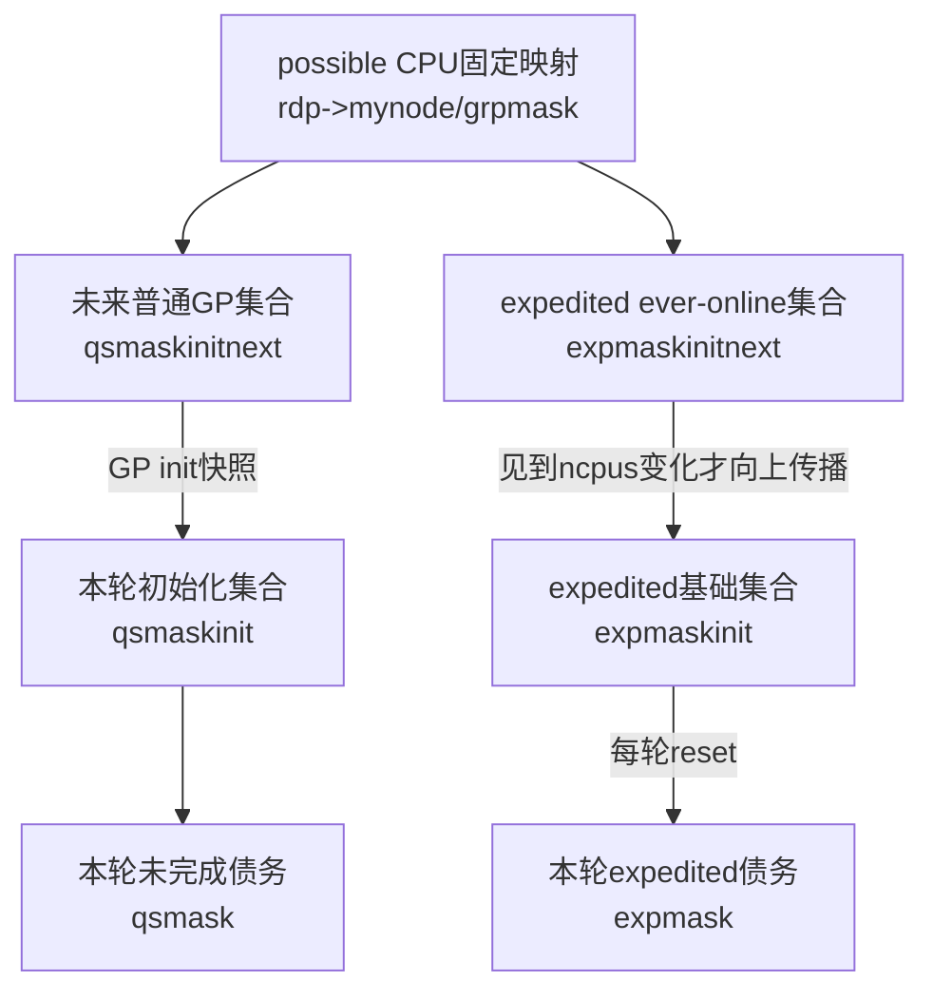
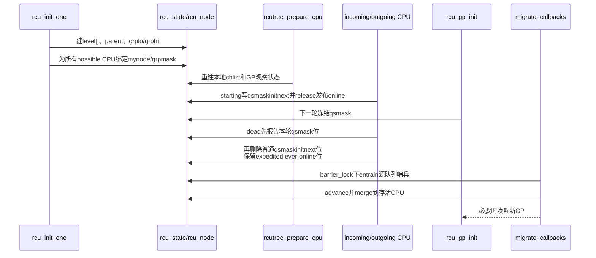

# 第6章\_Linux\_6.12\_Tree\_RCU\_拓扑与CPU热插拔源码实现

## 6.1\_实现所有权与版本边界

本章是 Linux 6.12.20 Tree RCU **静态汇聚树建立、CPU 参与集合交接与非 NOCB callback 迁移** 的唯一函数体讲解。普通 GP 如何把 `qsmaskinitnext` 冻结为本轮 `qsmask` 由 [P05 `rcu_gp_init()`](P05_Linux_6.12_Tree_RCU_GP全局生命周期源码实现.md#5.9_rcu_gp_init开始代际并建立证明债务)展开；`rcu_barrier()` 自己的扫描算法由 [P10 同步等待与 barrier 源码实现](P10_Linux_6.12_Tree_RCU_同步等待与rcu_barrier源码实现.md#10.8_rcu_barrier怎样扫描所有队列并等待真实执行)展开。本章只在 callback 迁移处说明为何调用其入口，不重复函数体。

源码基线：NXP `linux-imx`，标签 `lf-6.12.20-2.0.0`，提交 `dfaf2136deb2af2e60b994421281ba42f1c087e0`，配置包含 `CONFIG_TREE_RCU=y`、`CONFIG_PREEMPT_RCU=y`。上游相对位置为 [`kernel/rcu/tree.c`](../../linux/kernel/rcu/tree.c)、[`kernel/rcu/tree.h`](../../linux/kernel/rcu/tree.h) 和 [`include/linux/rcutree.h`](../../linux/include/linux/rcutree.h)。

先读模块模型：[拓扑与 CPU 热插拔模块源码概念导读](../navigation/P08_Linux_6.12_Tree_RCU_拓扑与CPU热插拔模块源码概念导读.md#8.1_本模块究竟解决什么问题)。稳定知识正文：[P11 初始化与拓扑](../../../../knowledge/linux/synchronization_and_asynchrony/synchronization/rcu/P11_Tree_RCU_初始化_拓扑与执行上下文.md#11.3_S0到S6_拓扑建立的统一阶段)、[P21 CPU 热插拔](../../../../knowledge/linux/synchronization_and_asynchrony/synchronization/rcu/P21_Tree_RCU_CPU热插拔与回调迁移.md#21.6_S0到S9_CPU4离线周期)。

## 6.2\_源码符号覆盖账本

| 唯一展开符号 | 上游位置 | 本章标题 | 关键副作用 |
| --- | --- | --- | --- |
| `rcu_init_one()` | `kernel/rcu/tree.c` | [6.4](#6.4_rcu_init_one建立固定汇聚树并绑定每CPU叶节点) | 建 `level[]`、初始化每个节点、绑定所有 possible CPU |
| `rcu_boot_init_percpu_data()` | 同上 | [6.5](#6.5_boot初始化与prepare为何仍未让CPU加入当前GP) | 建 per-CPU 位、barrier/GP 快照与 NOCB 初值 |
| `rcutree_prepare_cpu()` | 同上 | [6.5](#6.5_boot初始化与prepare为何仍未让CPU加入当前GP) | 恢复 cblist、本地 GP/core 状态、创建相关 kthread |
| `rcutree_report_cpu_starting()` | 同上 | [6.6](#6.6_report_cpu_starting与report_cpu_dead怎样隔离当前轮和下一轮) | 加入未来普通/expedited 参与集合并发布 online 初值 |
| `rcutree_report_cpu_dead()` | 同上 | [6.6](#6.6_report_cpu_starting与report_cpu_dead怎样隔离当前轮和下一轮) | 还清当前债务、移出未来集合、记录 offline 边界 |
| `rcutree_migrate_callbacks()` | 同上 | [6.7](#6.7_rcutree_migrate_callbacks保留callback代际与barrier证明) | entrain barrier、推进并合并分段队列、必要时唤醒 GP |
| `rcutree_dead_cpu()`、`rcutree_dying_cpu()`、`rcutree_offline_cpu()` | 同上 | [6.8](#6.8_CPUHP其余回调分别更新什么) | 计数、trace、FQS mask/tick 依赖收尾 |

`rcu_gp_init()`、`rcu_report_qs_rnp()`、`rcu_barrier_entrain()`、`rcu_advance_cbs()` 只作为跨模块被调用者出现；函数体分别归 P05、P02、P10、P09。

## 6.3\_实现前先把三套位图摆在一起



普通 GP 的 CPU online/offline 路径会增删 `qsmaskinitnext`；expedited 的 `expmaskinitnext` 只在 CPU 首次 online 时加位，offline 不清，形成 ever-online 并集。普通/expedited 各自的轮次初始化再建立本轮债务，expedited selection 会把当前 offline CPU 作为已满足处理。这个边界正是热插拔不直接改写正在进行证明的原因。

## 6.4\_rcu\_init\_one建立固定汇聚树并绑定每CPU叶节点

```c
/**
 * @brief 建立 Tree RCU 固定 rcu_node 汇聚树并绑定每个 possible CPU。
 * @note 中文 Doxygen 与行内说明由本仓库补充；源码裁剪自 kernel/rcu/tree.c。
 * @post level[] 指向各层首节点；每个 rcu_data 拥有固定 mynode/grpmask。
 */
static void __init rcu_init_one(void)
{
	int levelspread[RCU_NUM_LVLS];
	int cpustride = 1;
	int i, j;
	struct rcu_node *rnp;

	/* level[i] 不是独立分配，而是指向 node[] 内第 i 层首元素。 */
	for (i = 1; i < rcu_num_lvls; i++)
		rcu_state.level[i] =
			rcu_state.level[i - 1] + num_rcu_lvl[i - 1];
	rcu_init_levelspread(levelspread, num_rcu_lvl);

	/* 从叶到根计算每个节点覆盖的 CPU 范围和父节点位。 */
	for (i = rcu_num_lvls - 1; i >= 0; i--) {
		cpustride *= levelspread[i];
		rnp = rcu_state.level[i];
		for (j = 0; j < num_rcu_lvl[i]; j++, rnp++) {
			raw_spin_lock_init(&ACCESS_PRIVATE(rnp, lock));
			raw_spin_lock_init(&rnp->fqslock);
			rnp->gp_seq = rcu_state.gp_seq;
			rnp->gp_seq_needed = rcu_state.gp_seq;
			rnp->completedqs = rcu_state.gp_seq;
			rnp->qsmask = 0;
			rnp->qsmaskinit = 0;
			rnp->grplo = j * cpustride;
			rnp->grphi = (j + 1) * cpustride - 1;
			if (rnp->grphi >= nr_cpu_ids)
				rnp->grphi = nr_cpu_ids - 1;
			if (i == 0) {
				rnp->grpmask = 0;
				rnp->parent = NULL;
			} else {
				rnp->grpnum = j % levelspread[i - 1];
				rnp->grpmask = BIT(rnp->grpnum);
				rnp->parent = rcu_state.level[i - 1] +
					      j / levelspread[i - 1];
			}
			INIT_LIST_HEAD(&rnp->blkd_tasks);
			/* 省略：NOCB、expedited waitqueue/work 与 boost 初始化。 */
		}
	}

	rnp = rcu_first_leaf_node();
	for_each_possible_cpu(i) {
		while (i > rnp->grphi)
			rnp++;
		per_cpu_ptr(&rcu_data, i)->mynode = rnp;
		rcu_boot_init_percpu_data(i);
	}
}
```

实现原理：`node[]` 的数组位置保存树形层次，`parent/grpmask` 保存向上一层报告所需的地址和位。CPU 本地 QS 不需要搜索整棵树：`rdp->mynode` 直接定位叶，`rdp->grpmask` 直接给出本节点位；叶节点完成以后再用 `rnp->parent/rnp->grpmask` 逐层传播。

`for_each_possible_cpu()` 在启动时为尚未 online 的 CPU也建立映射，因此 hotplug 不需要运行期分配节点或改父子拓扑。代价是 `node[]` 与全部 `rcu_data` 按 possible CPU 规模预留。

## 6.5\_boot初始化与prepare为何仍未让CPU加入当前GP

```c
/**
 * @brief 为一个 possible CPU 建立启动期本地 RCU 初值。
 * @param cpu 目标 CPU 编号。
 * @note 本说明由仓库补充；源码裁剪自 kernel/rcu/tree.c。
 */
static void __init rcu_boot_init_percpu_data(int cpu)
{
	struct rcu_data *rdp = per_cpu_ptr(&rcu_data, cpu);

	rdp->grpmask = leaf_node_cpu_bit(rdp->mynode, cpu);
	rdp->barrier_seq_snap = rcu_state.barrier_sequence;
	rdp->rcu_ofl_gp_seq = rcu_state.gp_seq;
	rdp->rcu_ofl_gp_state = RCU_GP_CLEANED;
	rdp->rcu_onl_gp_seq = rcu_state.gp_seq;
	rdp->rcu_onl_gp_state = RCU_GP_CLEANED;
	rdp->last_sched_clock = jiffies;
	rdp->cpu = cpu;
	rcu_boot_init_nocb_percpu_data(rdp);
}

/**
 * @brief 在 CPU 真正进入前重建其本地 core、callback 与 GP 观察状态。
 * @return 成功返回 0。
 * @note 本函数不把 CPU 直接加入正在进行的 GP。
 */
int rcutree_prepare_cpu(unsigned int cpu)
{
	struct rcu_data *rdp = per_cpu_ptr(&rcu_data, cpu);
	struct rcu_node *rnp = rdp->mynode;

	/* 省略：根锁下重置 FQS 计数、context tracking 和 batch limit。 */
	if (!rcu_segcblist_is_enabled(&rdp->cblist))
		rcu_segcblist_init(&rdp->cblist);

	raw_spin_lock_rcu_node(rnp);
	rdp->gp_seq = READ_ONCE(rnp->gp_seq);
	rdp->gp_seq_needed = rdp->gp_seq;
	rdp->cpu_no_qs.b.norm = true;
	rdp->core_needs_qs = false;
	rdp->rcu_iw_pending = false;
	rdp->rcu_iw = IRQ_WORK_INIT_HARD(rcu_iw_handler);
	raw_spin_unlock_rcu_node(rnp);

	rcu_spawn_rnp_kthreads(rnp);
	rcu_spawn_cpu_nocb_kthread(cpu);
	return 0;
}
```

实现原理：prepare 解决“该 CPU 的本地对象现在可以被后续路径使用”，starting 才解决“该 CPU 何时进入未来 RCU 参与集合”。二者分开是因为 prepare 在控制 CPU 上、incoming CPU 尚未出现；starting 在 incoming CPU 自己、精确的 IRQ-disabled 位置执行。把两者合并会让参与位发布早于 CPU 上下文和内存顺序准备完成。

## 6.6\_report\_cpu\_starting与report\_cpu\_dead怎样隔离当前轮和下一轮

### 6.6.1\_starting只写下一轮集合

```c
/**
 * @brief incoming CPU 在启用中断前加入未来普通/expedited GP 集合。
 * @note 本说明由仓库补充；源码裁剪自 kernel/rcu/tree.c。
 */
void rcutree_report_cpu_starting(unsigned int cpu)
{
	struct rcu_data *rdp = per_cpu_ptr(&rcu_data, cpu);
	struct rcu_node *rnp = rdp->mynode;
	unsigned long mask = rdp->grpmask;
	bool newcpu;

	lockdep_assert_irqs_disabled();
	if (rdp->cpu_started)
		return;
	rdp->cpu_started = true;

	arch_spin_lock(&rcu_state.ofl_lock);
	rcu_watching_online();
	raw_spin_lock(&rcu_state.barrier_lock);
	raw_spin_lock_rcu_node(rnp);
	WRITE_ONCE(rnp->qsmaskinitnext, rnp->qsmaskinitnext | mask);
	raw_spin_unlock(&rcu_state.barrier_lock);

	newcpu = !(rnp->expmaskinitnext & mask);
	rnp->expmaskinitnext |= mask;
	smp_store_release(&rcu_state.ncpus, rcu_state.ncpus + newcpu);

	rdp->rcu_onl_gp_seq = READ_ONCE(rcu_state.gp_seq);
	rdp->rcu_onl_gp_state = READ_ONCE(rcu_state.gp_state);
	/* 若异常发现当前 qsmask 含 incoming 位，真实源码保存 flags 后报告。 */
	if (WARN_ON_ONCE(rnp->qsmask & mask)) {
		unsigned long flags;

		local_irq_save(flags);
		rcu_disable_urgency_upon_qs(rdp);
		rcu_report_qs_rnp(mask, rnp, rnp->gp_seq, flags);
	} else {
		raw_spin_unlock_rcu_node(rnp);
	}
	arch_spin_unlock(&rcu_state.ofl_lock);

	smp_store_release(&rdp->beenonline, true);
	smp_mb(); /* 后续 reader 使用不得越过上述初始化。 */
}
```

`barrier_lock` 在这里保护的是 per-CPU callback/barrier 生命周期交界，不是普通 QS 汇聚的常规锁。`ofl_lock` 则与 GP pre-init 互斥，避免 GP 正在从 next 集合构造 current 集合时 hotplug 同时改写。

### 6.6.2\_dead先还当前债务再移出未来集合

```c
/**
 * @brief outgoing CPU 在中断保持关闭的精确死亡点报告 RCU 状态。
 * @note 本说明由仓库补充；源码裁剪自 kernel/rcu/tree.c。
 */
void rcutree_report_cpu_dead(void)
{
	struct rcu_data *rdp = this_cpu_ptr(&rcu_data);
	struct rcu_node *rnp = rdp->mynode;
	unsigned long mask = rdp->grpmask;
	unsigned long flags;

	lockdep_assert_irqs_disabled();
	do_nocb_deferred_wakeup(rdp);
	rcu_preempt_deferred_qs(current);

	arch_spin_lock(&rcu_state.ofl_lock);
	raw_spin_lock_irqsave_rcu_node(rnp, flags);
	rdp->rcu_ofl_gp_seq = READ_ONCE(rcu_state.gp_seq);
	rdp->rcu_ofl_gp_state = READ_ONCE(rcu_state.gp_state);

	if (rnp->qsmask & mask) {
		rcu_disable_urgency_upon_qs(rdp);
		/* 先清本轮债务；该调用会释放节点锁。 */
		rcu_report_qs_rnp(mask, rnp, rnp->gp_seq, flags);
		raw_spin_lock_irqsave_rcu_node(rnp, flags);
	}

	/* 再从未来普通 GP 集合移除。expedited ever-online 位不在这里清除。 */
	WRITE_ONCE(rnp->qsmaskinitnext, rnp->qsmaskinitnext & ~mask);
	raw_spin_unlock_irqrestore_rcu_node(rnp, flags);
	arch_spin_unlock(&rcu_state.ofl_lock);
	rdp->cpu_started = false;
}
```

上面裁剪保留了顺序不变量；固定源码还在 `barrier_lock`、watching offline、expedited 清理和节点传播上执行更多动作。不能把裁剪当可编译替代实现。

实现原理：中断从进入这段路径到 CPU死亡都必须保持关闭，否则 CPU 已经从普通 next mask 移除后，中断仍可能开启一个新的普通 RCU reader，破坏“离线 CPU 不再产生新旧 reader”的证明。当前 `qsmask` 位先报告，是为了让正在进行的 GP 不等待一个即将消失的执行者；普通 next 位随后删除，是为了未来普通 GP 不再纳入它。Expedited 的 `expmaskinitnext` 刻意不清，selection 会按实时 online 状态消除离线位。

## 6.7\_rcutree\_migrate\_callbacks保留callback代际与barrier证明

```c
/**
 * @brief 把已死亡非 NOCB CPU 的 callback 队列迁移到当前存活 CPU。
 * @param cpu 源 CPU。
 * @note 本说明由仓库补充；源码裁剪自 kernel/rcu/tree.c。
 */
void rcutree_migrate_callbacks(int cpu)
{
	struct rcu_data *rdp = per_cpu_ptr(&rcu_data, cpu);
	struct rcu_data *my_rdp;
	struct rcu_node *my_rnp;
	unsigned long flags;
	bool needwake;

	if (rcu_rdp_is_offloaded(rdp))
		return; /* NOCB执行所有权没有依赖源CPU本地core。 */

	raw_spin_lock_irqsave(&rcu_state.barrier_lock, flags);
	if (rcu_segcblist_empty(&rdp->cblist)) {
		raw_spin_unlock_irqrestore(&rcu_state.barrier_lock, flags);
		return;
	}

	rcu_barrier_entrain(rdp); /* 迁移前封住正在进行的barrier扫描。 */
	my_rdp = this_cpu_ptr(&rcu_data);
	my_rnp = my_rdp->mynode;
	rcu_nocb_lock(my_rdp);
	WARN_ON_ONCE(!rcu_nocb_flush_bypass(my_rdp, NULL, jiffies, false));
	raw_spin_lock_rcu_node(my_rnp);

	/* 先利用已完成 GP 推进两边分段，再保持段语义合并。 */
	needwake = rcu_advance_cbs(my_rnp, rdp) ||
		   rcu_advance_cbs(my_rnp, my_rdp);
	rcu_segcblist_merge(&my_rdp->cblist, &rdp->cblist);
	raw_spin_unlock(&rcu_state.barrier_lock); /* IRQ 仍关闭。 */
	needwake = needwake || rcu_advance_cbs(my_rnp, my_rdp);
	rcu_segcblist_disable(&rdp->cblist);

	check_cb_ovld_locked(my_rdp, my_rnp);
	if (rcu_rdp_is_offloaded(my_rdp)) {
		raw_spin_unlock_rcu_node(my_rnp); /* IRQ 仍关闭。 */
		__call_rcu_nocb_wake(my_rdp, true, flags);
	} else {
		rcu_nocb_unlock(my_rdp); /* IRQ 仍关闭。 */
		raw_spin_unlock_rcu_node(my_rnp); /* IRQ 仍关闭。 */
	}
	local_irq_restore(flags);
	if (needwake)
		rcu_gp_kthread_wake();
}
```

实现原理：直接把一条单链表接到另一条尾部不足以保存 DONE/WAIT/NEXT 的分界和目标 GP。`rcu_segcblist_merge()` 在两边已根据目标节点最新 GP 推进以后合并分段状态；源 `cblist` 随后 disable，阻止未来 producer 误用死亡 CPU 的普通队列。

`barrier_entrain(rdp)` 必须发生在搬运前且持 `barrier_lock`：若 barrier 已经扫描过源 CPU、迁移又把业务 callback 搬到已扫描过的目标 CPU，没有源队尾哨兵就会漏等这批 callback。

## 6.8\_CPUHP其余回调分别更新什么

| 函数 | 生命周期时点 | 关键动作 | 不负责 |
| --- | --- | --- | --- |
| `rcutree_offline_cpu()` | 离线早期，CPU仍可运行 | 清 `ffmask`、设置 tick 依赖、调整 affinity | 清 current GP 债务 |
| `rcutree_dying_cpu()` | 接近死亡 | 根据 `qsmask` 记录 `cpuofl`/`cpuofl-bgp` trace | callback 迁移 |
| `rcutree_report_cpu_dead()` | outgoing CPU 精确死亡点 | QS/next mask/expedited/watching 交接 | 全局 online 数收尾 |
| `rcutree_migrate_callbacks()` | stop-machine 后由存活 CPU执行 | 搬迁非 NOCB callback | NOCB callback 搬迁 |
| `rcutree_dead_cpu()` | CPU 完全移除后的 process context | `n_online_cpus--`、清 tick 依赖 | 改静态 `node[]` 拓扑 |

## 6.9\_锁顺序与修改边界

本模块不是靠一把“RCU 全局锁”完成：

- `ofl_lock`：把 GP pre-init 与 CPU starting/dead 的参与集合交接串行化；
- `rnp->lock`：保护具体节点 mask、序列和 blocked task；
- `barrier_lock`：保护 barrier 轮次、per-CPU snapshot 与 callback 迁移交界；
- `nocb_lock`：目标 `rdp` 处于 offload 协议时保护 cblist/bypass；
- IRQ disabled：保证本 CPU 在生命周期切换期间不会插入新的本地 reader/callback 竞态。

修改 hotplug 路径至少要复核：current/next 顺序、被抢占任务不随 CPU 位消失、barrier 哨兵不漏、NOCB 不误迁移、callback segment 长度一致、`beenonline/ncpus` 的 release/acquire 配对，以及节点锁与 `ofl_lock/barrier_lock` 的既有顺序。

## 6.10\_源码时序总图



## 6.11\_验证清单

1. `node[]`、`level[]`、`parent/grpmask` 能形成从 CPU 到根的确定路径；
2. possible CPU 在启动期都有 `mynode/grpmask`，上线不重建树；
3. starting 正常路径只加普通 next，不给 current `qsmask` 新增债务；expedited ever-online 位只增不减；
4. dead 路径在移出普通 next 前处理 current 位，且不错误清除 `expmaskinitnext`；
5. `blkd_tasks` 的任务债务没有因 CPU 位清除而丢失；
6. 非 NOCB callback 迁移前 entrain barrier，合并后源队列 disable；
7. NOCB `rdp` 不进入普通迁移；
8. 新 CPU 对 expedited 初始化的发布由 `ncpus` release/acquire 观察，而不是从 `n_online_cpus` 猜测；
9. 文档未把本机路径写成源码身份，也未重复 P02/P05/P09/P10 的函数体。

总索引：[Linux 6.12 RCU 源码总阅读索引](../navigation/P01_Linux_6.12_RCU源码总阅读索引.md#1.5.3_模块入口)。
