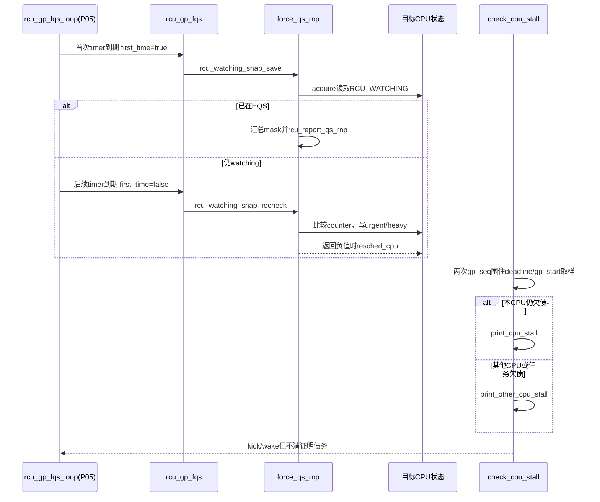

# 第7章\_Linux\_6.12\_Tree\_RCU\_force\_QS与Stall源码实现

## 7.1\_实现所有权与版本边界

本章唯一展开 FQS 的远端 watching 观察、叶扫描/催促和 stall 分类实现。`rcu_gp_fqs_loop()` 的 sleep/timer/flag 主循环已经由 [P05 GP 全局生命周期源码实现](P05_Linux_6.12_Tree_RCU_GP全局生命周期源码实现.md#5.10_FQS循环与根完成通知)负责，本章只从其调用的 `rcu_gp_fqs()` 开始，不复制主循环。

源码基线为 NXP Linux 6.12.20 固定提交 `dfaf2136deb2af2e60b994421281ba42f1c087e0`。上游相对位置：[`kernel/rcu/tree.c`](../../linux/kernel/rcu/tree.c)、[`kernel/rcu/tree_stall.h`](../../linux/kernel/rcu/tree_stall.h)、[`kernel/rcu/tree.h`](../../linux/kernel/rcu/tree.h)。配置边界包含 `CONFIG_TREE_RCU=y`、`CONFIG_PREEMPT_RCU=y`；stall 的部分检查还受 `CONFIG_PROVE_RCU`、`CONFIG_IRQ_WORK`、`CONFIG_RCU_CPU_STALL_CPUTIME` 等控制。

概念入口：[force-QS 与 Stall 模块源码概念导读](../navigation/P09_Linux_6.12_Tree_RCU_force_QS与Stall模块源码概念导读.md#9.1_为什么GP已经在等还要有force_QS)。稳定正文：[Tree RCU force-QS、迟延与 Stall](../../../../knowledge/linux/synchronization_and_asynchrony/synchronization/rcu/P15_Tree_RCU_force_QS迟延与Stall.md#15.1_Tree_RCU_force_QS迟延与_Stall)。

## 7.2\_源码符号覆盖账本

| 唯一展开符号 | 源文件 | 本章标题 | 状态副作用 |
| --- | --- | --- | --- |
| `rcu_watching_snap_save()` | `tree.c` | [7.4](#7.4_watching快照怎样把EQS变成隐式QS证据) | 保存远端 watching counter，识别已在 EQS 的 CPU |
| `rcu_watching_snap_recheck()` | `tree.c` | [7.4](#7.4_watching快照怎样把EQS变成隐式QS证据) | 比较 EQS、设置 urgent/heavy，返回是否 resched |
| `force_qs_rnp()` | `tree.c` | [7.5](#7.5_force_qs_rnp把远端观察任务债务和resched放进同一轮) | 遍历叶、清隐式 QS 位、boost task、发 resched |
| `rcu_gp_fqs()` | `tree.c` | [7.6](#7.6_rcu_gp_fqs更新节奏并选择save或recheck) | 更新 FQS/activity/stall 时间并清 FQS flag |
| `rcu_check_gp_start_stall()` | `tree_stall.h` | [7.7](#7.7_三类stall为什么必须读取不同状态) | 检测已请求但 GP 未启动 |
| `rcu_check_gp_kthread_starvation()` | `tree_stall.h` | [7.7](#7.7_三类stall为什么必须读取不同状态) | 检测 GP kthread 长期未获运行 |
| `rcu_check_gp_kthread_expired_fqs_timer()` | `tree_stall.h` | [7.7](#7.7_三类stall为什么必须读取不同状态) | 检测 WAIT_FQS timer 到期却未唤醒 |
| `check_cpu_stall()` | `tree_stall.h` | [7.8](#7.8_check_cpu_stall怎样避免跨GP拼出假阳性) | 一致性快照、自检/他检分类、报告节流 |

`print_cpu_stall()`、`print_other_cpu_stall()` 作为日志格式与恢复动作的消费者只说明调用关系，不逐行复制；`rcu_report_qs_rnp()` 和 priority boost 实现归 P02/P03。

## 7.3\_返回值是扫描协议不是普通布尔值

`force_qs_rnp()` 接收 `int (*f)(struct rcu_data *)`，回调结果有三值语义：

| 返回值 | `force_qs_rnp()` 动作 | 正确性含义 |
| --- | --- | --- |
| `> 0` | 把 CPU 位加入 `mask`，稍后调用 `rcu_report_qs_rnp()` | 已有合法隐式 QS/离线证据 |
| `0` | 保留 `qsmask` 位 | 尚无证据，也暂不发 resched |
| `< 0` | 把 CPU 位加入 `rsmask`，释放节点锁后 `resched_cpu()` | 仅请求未来调度；当前债务仍保留 |

把 `<0` 误当“失败即清位”会破坏 GP 安全，把 `>0` 误当“远端 CPU 主动回复”则会掩盖共享 context-tracking 状态的被动证明方式。

## 7.4\_watching快照怎样把EQS变成隐式QS证据

### 7.4.1\_第一次保存

```c
/**
 * @brief 保存目标 CPU 的 RCU_WATCHING counter，并识别已经处于 EQS 的 CPU。
 * @return 已在 EQS 返回 1，否则返回 0。
 * @note 中文 Doxygen 与注释由仓库补充；源码裁剪自 kernel/rcu/tree.c。
 */
static int rcu_watching_snap_save(struct rcu_data *rdp)
{
	/* acquire 与 GP 开始、节点锁链共同建立跨 CPU 内存顺序。 */
	rdp->watching_snap = ct_rcu_watching_cpu_acquire(rdp->cpu);
	if (rcu_watching_snap_in_eqs(rdp->watching_snap)) {
		trace_rcu_fqs(rcu_state.name, rdp->gp_seq,
			      rdp->cpu, TPS("dti"));
		rcu_gpnum_ovf(rdp->mynode, rdp);
		return 1;
	}
	return 0;
}
```

如果 snapshot 表示目标 CPU 当前在 idle/EQS 且没有活动 IRQ/NMI，CPU 不可能仍持有 GP 开始前的普通 reader，因此可直接作为隐式 QS。这里读取的是 context-tracking 状态，不是访问远端 `rcu_read_lock()` 嵌套计数。

### 7.4.2\_后续比较与催促

```c
/**
 * @brief 重查目标 CPU 是否自 snapshot 以后进入过 EQS，并必要时催促。
 * @return 正值表示已有 QS；零表示继续等；负值表示需要 resched。
 * @note 本说明由仓库补充；源码裁剪自 kernel/rcu/tree.c。
 */
static int rcu_watching_snap_recheck(struct rcu_data *rdp)
{
	unsigned long jtsq;
	int ret = 0;

	if (rcu_watching_snap_stopped_since(rdp, rdp->watching_snap)) {
		trace_rcu_fqs(rcu_state.name, rdp->gp_seq,
			      rdp->cpu, TPS("dti"));
		rcu_gpnum_ovf(rdp->mynode, rdp);
		return 1;
	}

	/* 理论上 offline CPU 应已由 hotplug/GP init 报告；告警后解开债务。 */
	if (WARN_ON_ONCE(!rcu_rdp_cpu_online(rdp)))
		return 1;

	jtsq = READ_ONCE(jiffies_to_sched_qs);
	if (!READ_ONCE(rdp->rcu_need_heavy_qs) &&
	    (time_after(jiffies, rcu_state.gp_start + jtsq * 2) ||
	     time_after(jiffies, rcu_state.jiffies_resched) ||
	     rcu_state.cbovld)) {
		WRITE_ONCE(rdp->rcu_need_heavy_qs, true);
		smp_store_release(&rdp->rcu_urgent_qs, true);
	} else if (time_after(jiffies, rcu_state.gp_start + jtsq)) {
		WRITE_ONCE(rdp->rcu_urgent_qs, true);
	}

	if (tick_nohz_full_cpu(rdp->cpu) &&
	    (time_after(jiffies,
			READ_ONCE(rdp->last_fqs_resched) + jtsq * 3) ||
	     rcu_state.cbovld)) {
		WRITE_ONCE(rdp->rcu_urgent_qs, true);
		WRITE_ONCE(rdp->last_fqs_resched, jiffies);
		ret = -1;
	}

	/* 省略：半程 stall 后更频繁 resched、irq_work 与 CPU-time snapshot。 */
	return ret;
}
```

实现原理：watching counter 通过进入/退出 EQS 的状态转换形成可比较代际。若 counter 自第一次 snapshot 后发生足以证明“停止 watching”的变化，那么 GP 开始前的 reader 不可能跨过该 EQS 仍然存活；若没变化，只能请求未来调度/EQS，不能伪造完成。

`rcu_need_heavy_qs` 先写、`rcu_urgent_qs` 再 release 发布，使目标 CPU观察 urgent 时不会错过前者。NO_HZ_FULL CPU可能长期内核态且没有 scheduler tick，仅设置普通标志未必被及时观察，所以返回 `-1` 让上层发 resched。

## 7.5\_force\_qs\_rnp把远端观察任务债务和resched放进同一轮

```c
/**
 * @brief 对仍欠普通 QS 的所有叶节点 CPU执行一次指定观察函数。
 * @param f 首轮 save 或后续 recheck。
 * @note 本说明由仓库补充；源码裁剪自 kernel/rcu/tree.c。
 */
static void force_qs_rnp(int (*f)(struct rcu_data *rdp))
{
	int cpu;
	unsigned long flags;
	struct rcu_node *rnp;

	rcu_state.cbovld = rcu_state.cbovldnext;
	rcu_state.cbovldnext = false;
	rcu_for_each_leaf_node(rnp) {
		unsigned long mask = 0;
		unsigned long rsmask = 0;

		cond_resched_tasks_rcu_qs();
		raw_spin_lock_irqsave_rcu_node(rnp, flags);
		rcu_state.cbovldnext |= !!rnp->cbovldmask;

		if (rnp->qsmask == 0) {
			if (rcu_preempt_blocked_readers_cgp(rnp)) {
				rcu_initiate_boost(rnp, flags); /* 函数释放节点锁。 */
				continue;
			}
			raw_spin_unlock_irqrestore_rcu_node(rnp, flags);
			continue;
		}

		for_each_leaf_node_cpu_mask(rnp, cpu, rnp->qsmask) {
			struct rcu_data *rdp = per_cpu_ptr(&rcu_data, cpu);
			int ret = f(rdp);

			if (ret > 0) {
				mask |= rdp->grpmask;
				rcu_disable_urgency_upon_qs(rdp);
			}
			if (ret < 0)
				rsmask |= rdp->grpmask;
		}

		if (mask)
			rcu_report_qs_rnp(mask, rnp, rnp->gp_seq, flags);
		else
			raw_spin_unlock_irqrestore_rcu_node(rnp, flags);

		/* resched 放到节点锁外，避免在锁内发送跨 CPU 调度请求。 */
		for_each_leaf_node_cpu_mask(rnp, cpu, rsmask)
			resched_cpu(cpu);
	}
}
```

实现原理：同一轮把三类债务分流。`qsmask != 0` 时逐 CPU寻找隐式 QS；`qsmask == 0` 但有 blocked reader 时进入 task boost；无 CPU、无 task 债务才跳过。`rcu_report_qs_rnp()` 可能沿树上报并释放叶锁，所以代码不能在其后继续当作仍持锁。

## 7.6\_rcu\_gp\_fqs更新节奏并选择save或recheck

```c
/**
 * @brief 执行一轮 FQS，并维护全局活性/诊断时钟。
 * @param first_time 当前 GP 是否第一次 FQS。
 * @note 本说明由仓库补充；源码裁剪自 kernel/rcu/tree.c。
 */
static void rcu_gp_fqs(bool first_time)
{
	int nr_fqs = READ_ONCE(rcu_state.nr_fqs_jiffies_stall);
	struct rcu_node *rnp = rcu_get_root();

	WRITE_ONCE(rcu_state.gp_activity, jiffies);
	WRITE_ONCE(rcu_state.n_force_qs, rcu_state.n_force_qs + 1);

	if (nr_fqs) {
		if (nr_fqs == 1)
			WRITE_ONCE(rcu_state.jiffies_stall,
				   jiffies + rcu_jiffies_till_stall_check());
		WRITE_ONCE(rcu_state.nr_fqs_jiffies_stall, --nr_fqs);
	}

	if (first_time)
		force_qs_rnp(rcu_watching_snap_save);
	else
		force_qs_rnp(rcu_watching_snap_recheck);

	if (READ_ONCE(rcu_state.gp_flags) & RCU_GP_FLAG_FQS) {
		raw_spin_lock_irq_rcu_node(rnp);
		WRITE_ONCE(rcu_state.gp_flags,
			   rcu_state.gp_flags & ~RCU_GP_FLAG_FQS);
		raw_spin_unlock_irq_rcu_node(rnp);
	}
}
```

`nr_fqs_jiffies_stall` 使 stall reset 后先等若干次真正观察到 jiffies 前进的 FQS，再重建 deadline，避免系统长时间停 tick 后立即用陈旧时间报告假 stall。清 `RCU_GP_FLAG_FQS` 只是消费外部“尽快做一次扫描”的命令，不会清 INIT 或宣布 GP 完成。

## 7.7\_三类stall为什么必须读取不同状态

### 7.7.1\_需求存在但GP未开始

```c
/**
 * @brief 检测根节点已有 gp_seq_needed，但 GP kthread 长期未开始新轮次。
 * @note 本说明由仓库补充；源码裁剪自 kernel/rcu/tree_stall.h。
 */
static void rcu_check_gp_start_stall(struct rcu_node *rnp,
				     struct rcu_data *rdp,
				     const unsigned long delay)
{
	struct rcu_node *root = rcu_get_root();
	static atomic_t warned = ATOMIC_INIT(0);
	unsigned long j;

	if (!IS_ENABLED(CONFIG_PROVE_RCU) || rcu_gp_in_progress() ||
	    ULONG_CMP_GE(READ_ONCE(root->gp_seq),
			 READ_ONCE(root->gp_seq_needed)) ||
	    !smp_load_acquire(&rcu_state.gp_kthread))
		return;
	j = jiffies;
	if (time_before(j, READ_ONCE(rcu_state.gp_req_activity) + delay) ||
	    time_before(j, READ_ONCE(rcu_state.gp_activity) + delay) ||
	    atomic_read(&warned))
		return;

	/* 真实源码随后在叶锁和根锁下双重复检，再告警并打印线程。 */
}
```

这是 request/control-path stall：根需求超前且两种 activity 都过旧。它不检查 `qsmask`，因为 GP 尚未开始，当前根本没有新一轮 QS 债务。

### 7.7.2\_GP kthread长期未运行

`rcu_check_gp_kthread_starvation()` 调用 `rcu_is_gp_kthread_starving()`，打印当前代际、`gp_flags`、诊断 `gp_state`、任务 `__state` 与所在 CPU，并尝试 `wake_up_process(gpk)`。如果线程最后位于 offline CPU 或其 CPU 位已经不欠 QS，还会提供不同栈线索。

### 7.7.3\_FQS timer已经过期但线程仍睡

```c
static void rcu_check_gp_kthread_expired_fqs_timer(void)
{
	struct task_struct *gpk = rcu_state.gp_kthread;
	short gp_state;
	unsigned long jiffies_fqs;

	/* acquire 与 FQS loop 发布 WAIT_FQS/timer 的屏障配对。 */
	gp_state = smp_load_acquire(&rcu_state.gp_state);
	jiffies_fqs = READ_ONCE(rcu_state.jiffies_force_qs);
	if (gp_state == RCU_GP_WAIT_FQS &&
	    time_after(jiffies, jiffies_fqs + RCU_STALL_MIGHT_MIN) &&
	    gpk && !READ_ONCE(gpk->on_rq)) {
		/* 真实源码打印 timer softirq、task state 与目标 CPU。 */
	}
}
```

这条路径需要 `gp_state`，但只把它当诊断相位。`gp_state` 不是权威 GP 代际或完成标志；只有组合 `WAIT_FQS + 过期 timer + kthread不在runqueue` 才指向 timer/wakeup 问题。

## 7.8\_check\_cpu\_stall怎样避免跨GP拼出假阳性

```c
/**
 * @brief 在每 CPU core 路径检查当前普通 GP 是否超过 stall deadline。
 * @param rdp 当前 CPU 的 RCU 状态。
 * @note 本说明由仓库补充；源码裁剪自 kernel/rcu/tree_stall.h。
 */
static void check_cpu_stall(struct rcu_data *rdp)
{
	unsigned long gs1, gs2, gps, j, jn, js;
	struct rcu_node *rnp;
	bool self_detected;

	lockdep_assert_irqs_disabled();
	if ((rcu_stall_is_suppressed() && !READ_ONCE(rcu_kick_kthreads)) ||
	    !rcu_gp_in_progress())
		return;
	rcu_stall_kick_kthreads();
	if (READ_ONCE(rcu_state.nr_fqs_jiffies_stall) > 0)
		return;

	j = jiffies;
	gs1 = READ_ONCE(rcu_state.gp_seq);
	smp_rmb();
	js = READ_ONCE(rcu_state.jiffies_stall);
	smp_rmb();
	gps = READ_ONCE(rcu_state.gp_start);
	smp_rmb();
	gs2 = READ_ONCE(rcu_state.gp_seq);
	if (gs1 != gs2 || ULONG_CMP_LT(j, js) || ULONG_CMP_GE(gps, js))
		return;

	rnp = rdp->mynode;
	jn = jiffies + ULONG_MAX / 2;
	self_detected = READ_ONCE(rnp->qsmask) & rdp->grpmask;
	if (rcu_gp_in_progress() &&
	    (self_detected || ULONG_CMP_GE(j, js + RCU_STALL_RAT_DELAY)) &&
	    cmpxchg(&rcu_state.jiffies_stall, js, jn) == js) {
		if (self_detected)
			print_cpu_stall(gps);
		else
			print_other_cpu_stall(gs2, gps);
		/* 真实源码还处理 VM pause、notifier、ftrace dump 与下次 deadline。 */
	}
}
```

实现原理：检测者按 `gp_seq → deadline → gp_start → gp_seq` 取样，GP 初始化/cleanup 以相反顺序和屏障发布。如果取样中间跨过轮次，前后 sequence 不同，直接丢弃；如果 deadline 尚未到或 `gp_start` 与 deadline 组合不合理，也不报告。`cmpxchg(jiffies_stall, js, jn)` 再让同一轮并发检测者只有一个赢得报告权，避免所有 CPU同时刷屏。

Self/other 分类只说明谁发现、当前 CPU 位是否仍欠债：other 路径随后遍历所有叶 `qsmask` 和 blocked task；二者都会补查 GP kthread starvation/timer，并可能 kick FQS，但不改根完成条件。

## 7.9\_端到端源码时序



## 7.10\_修改与验证边界

修改本模块至少验证：

1. save 与 recheck 必须针对同一 CPU、同一 GP 的 snapshot；
2. `>0/0/<0` 三值返回未被压缩成错误布尔语义；
3. resched 在节点锁外发送，正值才进入 QS mask；
4. CPU 位为零但 blocked reader 存在时仍进入 boost/等待；
5. urgent/heavy 的发布顺序与目标读取路径一致；
6. `nr_fqs_jiffies_stall` reset 窗口防止陈旧 jiffies 假阳性；
7. stall 取样的 sequence 屏障和 `cmpxchg` 节流没有被“简化”；
8. request-not-started、QS debt、kthread starvation、timer expiry 的日志没有混成一个原因；
9. `gp_state` 只作为诊断相位，没有替代 `gp_seq/qsmask` 权威状态；
10. force/stall 恢复动作最终仍等待合法 QS/任务退出。

总索引：[Linux 6.12 RCU 源码总阅读索引](../navigation/P01_Linux_6.12_RCU源码总阅读索引.md#1.5.3_模块入口)。
