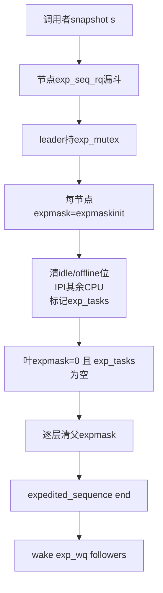
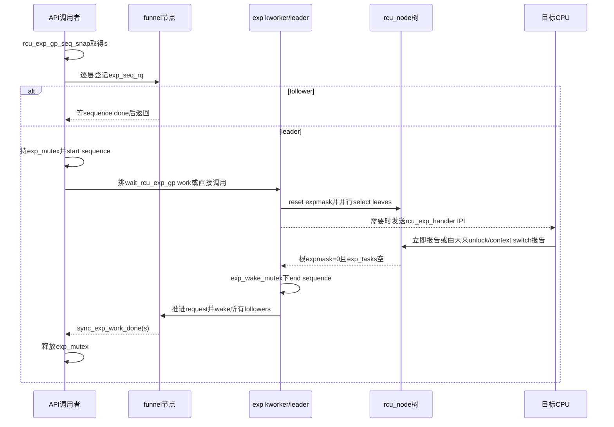

# 第8章\_Linux\_6.12\_Tree\_RCU\_Expedited\_GP源码实现

## 8.1\_实现所有权与版本边界

本章是 Linux 6.12.20 普通 Tree RCU expedited GP 的 sequence、漏斗合并、树重置、CPU selection、远端 handler 和完成唤醒的唯一函数体讲解。普通 GP 的长期 `gp_kthread`、`gp_seq` 和控制主线由 [P05 GP 全局生命周期源码实现](P05_Linux_6.12_Tree_RCU_GP全局生命周期源码实现.md#5.13_端到端源码时序)负责，普通 CPU `qsmask` 汇聚由 P02负责；被抢占 reader 通用入链与解阻由 P03负责。本章只解释这些状态怎样被 expedited 的 `expmask/exp_tasks` 观察，不重复通用函数体。

源码基线：NXP `linux-imx` 固定提交 `dfaf2136deb2af2e60b994421281ba42f1c087e0`，Linux 6.12.20，配置包含 `CONFIG_TREE_RCU=y`、`CONFIG_PREEMPT_RCU=y`。上游相对位置主要是 [`kernel/rcu/tree_exp.h`](../../linux/kernel/rcu/tree_exp.h)，状态声明在 [`kernel/rcu/tree.h`](../../linux/kernel/rcu/tree.h)，PREEMPT reader 特殊路径还与 [`kernel/rcu/tree_plugin.h`](../../linux/kernel/rcu/tree_plugin.h) 协作。

概念入口：[Expedited GP 模块源码概念导读](../navigation/P10_Linux_6.12_Tree_RCU_Expedited_GP模块源码概念导读.md#10.1_Expedited不是普通GP的加速档)。稳定正文：[Tree RCU Expedited GP](../../../../knowledge/linux/synchronization_and_asynchrony/synchronization/rcu/P16_Tree_RCU_Expedited_GP.md#16.2_它不是普通GP的超时开关)。

## 8.2\_源码符号覆盖账本

| 唯一展开符号 | 本章标题 | 核心副作用 |
| --- | --- | --- |
| `rcu_exp_gp_seq_start/end/snap/done()` | [8.4](#8.4_expedited_sequence怎样独立计代并共同推进poll观察) | 推进独立 expedited sequence 和公共 poll 观察 |
| `exp_funnel_lock()` | [8.5](#8.5_exp_funnel_lock怎样合并并发调用者) | follower 局部等待或选出单 leader |
| `sync_exp_reset_tree_hotplug()`、`sync_exp_reset_tree()` | [8.6](#8.6_sync_exp_reset_tree怎样建立本轮债务) | 传播新 CPU ever-online 位并建立本轮 `expmask` |
| `__sync_rcu_exp_select_node_cpus()`、`sync_rcu_exp_select_cpus()` | [8.7](#8.7_sync_rcu_exp_select_cpus为什么不是无条件广播) | idle/offline 直接报告，其他 CPU IPI，建立 `exp_tasks` |
| `rcu_exp_handler()` | [8.8](#8.8_rcu_exp_handler把IPI转换为立即或延期证明) | 立即清 CPU 位或写 per-CPU/task 延期债务 |
| `synchronize_rcu_expedited_wait_once/wait()` | [8.9](#8.9_wait_wake与公开API怎样关闭一轮) | 等根完成、强制 tick、报告 expedited stall |
| `rcu_exp_wait_wake()`、`rcu_exp_sel_wait_wake()` | [8.9](#8.9_wait_wake与公开API怎样关闭一轮) | 结束 sequence、推进节点 request、唤醒 followers |
| `synchronize_rcu_expedited()` | [8.9](#8.9_wait_wake与公开API怎样关闭一轮) | API 分流、leader work、最终返回 |

`__rcu_report_exp_rnp()` 的逐层清位与 PREEMPT task 通用解阻细节不在本章重复；本章解释其输入输出地址。

## 8.3\_权威完成条件



固定提交中的 `rcu_state.expedited_need_qs` 没有活动读写者，不能当完成条件。等待函数实际检查根节点 `sync_rcu_exp_done_unlocked(root)`，其依据是 `expmask` 与 `exp_tasks`。

## 8.4\_expedited\_sequence怎样独立计代并共同推进poll观察

```c
/**
 * @brief 发布一轮 expedited GP 开始。
 * @note 中文 Doxygen 与注释由仓库补充；源码裁剪自 kernel/rcu/tree_exp.h。
 */
static void rcu_exp_gp_seq_start(void)
{
	rcu_seq_start(&rcu_state.expedited_sequence);
	/* 与普通 GP 共享 poll API 的“至少一轮合格GP”观察通道。 */
	rcu_poll_gp_seq_start_unlocked(
		&rcu_state.gp_seq_polled_exp_snap);
}

/** @brief 先发布公共 poll 完成，再结束独立 expedited sequence。 */
static void rcu_exp_gp_seq_end(void)
{
	rcu_poll_gp_seq_end_unlocked(
		&rcu_state.gp_seq_polled_exp_snap);
	rcu_seq_end(&rcu_state.expedited_sequence);
	smp_mb(); /* 串行连续 expedited GP。 */
}

/** @brief 取得调用点之后最早可接受的 expedited 完成值。 */
static unsigned long rcu_exp_gp_seq_snap(void)
{
	unsigned long s;

	smp_mb(); /* 调用者先前修改先于其他 CPU观察本轮。 */
	s = rcu_seq_snap(&rcu_state.expedited_sequence);
	trace_rcu_exp_grace_period(rcu_state.name, s, TPS("snap"));
	return s;
}

static bool rcu_exp_gp_seq_done(unsigned long s)
{
	return rcu_seq_done(&rcu_state.expedited_sequence, s);
}
```

实现原理：调用者 snapshot 的不是“当前 GP 编号”，而是一个目标值；只要 sequence 已越过该目标，就存在一轮完整 expedited GP 覆盖 snapshot。`gp_seq_polled_exp_snap` 只把这次真实 GP 同步到 poll 公共观察序列，不把普通和 expedited 权威 sequence 合并。

## 8.5\_exp\_funnel\_lock怎样合并并发调用者

```c
/**
 * @brief 沿当前 CPU 的叶节点向根登记 expedited 请求并选 leader。
 * @param s 调用者的目标 sequence。
 * @return true 表示别人已完成本调用；false 表示本调用持 exp_mutex 成为 leader。
 */
static bool exp_funnel_lock(unsigned long s)
{
	struct rcu_data *rdp = per_cpu_ptr(&rcu_data,
					   raw_smp_processor_id());
	struct rcu_node *rnp = rdp->mynode;
	struct rcu_node *root = rcu_get_root();

	if (ULONG_CMP_LT(READ_ONCE(rnp->exp_seq_rq), s) &&
	    (rnp == root ||
	     ULONG_CMP_LT(READ_ONCE(root->exp_seq_rq), s)) &&
	    mutex_trylock(&rcu_state.exp_mutex))
		goto fastpath;

	for (; rnp != NULL; rnp = rnp->parent) {
		if (sync_exp_work_done(s))
			return true;

		spin_lock(&rnp->exp_lock);
		if (ULONG_CMP_GE(rnp->exp_seq_rq, s)) {
			spin_unlock(&rnp->exp_lock);
			wait_event(rnp->exp_wq[rcu_seq_ctr(s) & 0x3],
				   sync_exp_work_done(s));
			return true;
		}
		WRITE_ONCE(rnp->exp_seq_rq, s);
		spin_unlock(&rnp->exp_lock);
	}
	mutex_lock(&rcu_state.exp_mutex);

fastpath:
	if (sync_exp_work_done(s)) {
		mutex_unlock(&rcu_state.exp_mutex);
		return true;
	}
	rcu_exp_gp_seq_start();
	return false;
}
```

实现原理：节点 `exp_seq_rq` 表示本子树已经有人承担至少目标 `s` 的工作。后来者在最近节点等待，避免所有 CPU直接争全局 mutex。四个 `exp_wq` 槽由 sequence counter 低位选择，允许相邻轮次等待者隔离；正确性仍由 `sync_exp_work_done(s)` 的 sequence 判断提供，槽位本身不是完成证据。

Fastpath 的 `mutex_trylock()` 只是低竞争优化，仍在开始前二次检查 done，封住“检查后、拿锁前另一个 leader 已完成”的竞态。

## 8.6\_sync\_exp\_reset\_tree怎样建立本轮债务

### 8.6.1\_只在出现新CPU时传播ever-online基础位

```c
/**
 * @brief 把 CPU starting 新增的 expmaskinitnext 位传播到 expedited 初始化树。
 * @note offline 不清 expmaskinitnext，因此多数调用走无工作 fastpath。
 */
static void sync_exp_reset_tree_hotplug(void)
{
	int ncpus = smp_load_acquire(&rcu_state.ncpus);
	struct rcu_node *rnp;

	if (likely(ncpus == rcu_state.ncpus_snap))
		return;
	rcu_state.ncpus_snap = ncpus;

	rcu_for_each_leaf_node(rnp) {
		unsigned long oldmask;
		unsigned long flags;

		raw_spin_lock_irqsave_rcu_node(rnp, flags);
		if (rnp->expmaskinit == rnp->expmaskinitnext) {
			raw_spin_unlock_irqrestore_rcu_node(rnp, flags);
			continue;
		}
		oldmask = rnp->expmaskinit;
		rnp->expmaskinit = rnp->expmaskinitnext;
		raw_spin_unlock_irqrestore_rcu_node(rnp, flags);

		/* 叶此前已经非空，父层早已有该子树位，无需重复传播。 */
		if (oldmask)
			continue;

		/* 叶首次从空变非空，沿父链逐层发布对应 grpmask。 */
		{
			bool done = false;
			unsigned long mask = rnp->grpmask;
			struct rcu_node *rnp_up = rnp->parent;

			while (rnp_up) {
				raw_spin_lock_irqsave_rcu_node(rnp_up, flags);
				if (rnp_up->expmaskinit)
					done = true;
				rnp_up->expmaskinit |= mask;
				raw_spin_unlock_irqrestore_rcu_node(rnp_up, flags);
				if (done)
					break;
				mask = rnp_up->grpmask;
				rnp_up = rnp_up->parent;
			}
		}
	}
}
```

关键事实是 `ncpus` 由 CPU starting 对“从未加入 ever-online 集合”的 CPU release 增长，reset acquire 观察；CPU offline 不减少，所以没有每轮重建整棵初始化树的成本。父节点一旦已有任意子树位，再新增同一非空子树中的 CPU也无需继续向上传播。

### 8.6.2\_每轮复制为当前债务

```c
/** @brief 为一轮 expedited GP 重置所有节点当前 expmask。 */
static void sync_exp_reset_tree(void)
{
	unsigned long flags;
	struct rcu_node *rnp;

	sync_exp_reset_tree_hotplug();
	rcu_for_each_node_breadth_first(rnp) {
		raw_spin_lock_irqsave_rcu_node(rnp, flags);
		WARN_ON_ONCE(rnp->expmask);
		WRITE_ONCE(rnp->expmask, rnp->expmaskinit);
		raw_spin_unlock_irqrestore_rcu_node(rnp, flags);
	}
}
```

`WARN_ON_ONCE(rnp->expmask)` 检查上一轮是否真的清空；新轮不能覆盖未完成债务。Breadth-first 重置后，CPU selection 会马上消除当前 offline/idle 位。

## 8.7\_sync\_rcu\_exp\_select\_cpus为什么不是无条件广播

### 8.7.1\_每叶节点分类

```c
/**
 * @brief 为一个叶节点分类立即可报告 CPU、需 IPI CPU和被抢占任务债务。
 * @note 本说明由仓库补充；源码裁剪自 kernel/rcu/tree_exp.h。
 */
static void __sync_rcu_exp_select_node_cpus(struct rcu_exp_work *rewp)
{
	struct rcu_node *rnp = container_of(rewp, struct rcu_node, rew);
	unsigned long mask_ofl_test = 0;
	unsigned long mask_ofl_ipi;
	unsigned long flags;
	int ret;
	int cpu;

	raw_spin_lock_irqsave_rcu_node(rnp, flags);
	for_each_leaf_node_cpu_mask(rnp, cpu, rnp->expmask) {
		struct rcu_data *rdp = per_cpu_ptr(&rcu_data, cpu);
		unsigned long mask = rdp->grpmask;
		int snap;

		if (raw_smp_processor_id() == cpu ||
		    !(rnp->qsmaskinitnext & mask)) {
			mask_ofl_test |= mask; /* 当前执行 CPU 或 offline。 */
		} else {
			snap = ct_rcu_watching_cpu_acquire(cpu);
			if (rcu_watching_snap_in_eqs(snap))
				mask_ofl_test |= mask;
			else
				rdp->exp_watching_snap = snap;
		}
	}
	mask_ofl_ipi = rnp->expmask & ~mask_ofl_test;
	if (rcu_preempt_has_tasks(rnp))
		WRITE_ONCE(rnp->exp_tasks, rnp->blkd_tasks.next);
	raw_spin_unlock_irqrestore_rcu_node(rnp, flags);

	for_each_leaf_node_cpu_mask(rnp, cpu, mask_ofl_ipi) {
		struct rcu_data *rdp = per_cpu_ptr(&rcu_data, cpu);
		unsigned long mask = rdp->grpmask;

retry_ipi:
		/* CPU若在首次快照后经过EQS，不必再打IPI。 */
		if (rcu_watching_snap_stopped_since(
				rdp, rdp->exp_watching_snap)) {
			mask_ofl_test |= mask;
			continue;
		}
		/* get_cpu()同时钉住当前CPU，封住迁移判断竞态。 */
		if (get_cpu() == cpu) {
			mask_ofl_test |= mask;
			put_cpu();
			continue;
		}
		ret = smp_call_function_single(cpu, rcu_exp_handler, NULL, 0);
		put_cpu();
		if (!ret)
			continue; /* handler负责立即报告或登记延期债务。 */

		/* IPI失败可能只是与hotplug并发，必须在节点锁下重判。 */
		raw_spin_lock_irqsave_rcu_node(rnp, flags);
		if ((rnp->qsmaskinitnext & mask) &&
		    (rnp->expmask & mask)) {
			raw_spin_unlock_irqrestore_rcu_node(rnp, flags);
			schedule_timeout_idle(1);
			goto retry_ipi;
		}
		if (rnp->expmask & mask)
			mask_ofl_test |= mask;
		raw_spin_unlock_irqrestore_rcu_node(rnp, flags);
	}
	if (mask_ofl_test)
		rcu_report_exp_cpu_mult(rnp, mask_ofl_test, false);
}
```

当前 CPU 被直接计入 `mask_ofl_test`，因为 leader/worker 自己正在 process context 中执行，已在调用点之后形成合格调度边界；offline 判断使用普通 RCU 的实时 `qsmaskinitnext`，不是 ever-online 的 `expmaskinitnext`。

`exp_tasks` 指向 `blkd_tasks` 中本轮边界。后续新增 blocked task 是否阻塞本轮，还与 `expmask` 位清除时点和 PREEMPT 入链协议共同决定；它不是复制一条新任务链。

### 8.7.2\_并行叶work只优化扫描延迟

```c
static void sync_rcu_exp_select_cpus(void)
{
	struct rcu_node *rnp;

	sync_exp_reset_tree();
	rcu_for_each_leaf_node(rnp) {
		rnp->exp_need_flush = false;
		if (!READ_ONCE(rnp->expmask))
			continue;
		if (!rcu_exp_par_worker_started(rnp) ||
		    rcu_scheduler_active != RCU_SCHEDULER_RUNNING ||
		    rcu_is_last_leaf_node(rnp)) {
			sync_rcu_exp_select_node_cpus(&rnp->rew.rew_work);
			continue;
		}
		sync_rcu_exp_select_cpus_queue_work(rnp);
		rnp->exp_need_flush = true;
	}
	rcu_for_each_leaf_node(rnp)
		if (rnp->exp_need_flush)
			sync_rcu_exp_select_cpus_flush_work(rnp);
}
```

每叶 kworker 可以并行做 CPU 分类，但 leader 必须 flush 所有已排 work 后才进入等待。最后一个叶由当前执行者直接处理，避免把全部工作都排走后自己空等；早期启动/worker未创建时也直接调用。并行只影响 selection 延迟，不改变节点锁下的 `expmask` 权威状态。

## 8.8\_rcu\_exp\_handler把IPI转换为立即或延期证明

```c
/**
 * @brief PREEMPT_RCU 配置下的远端 expedited IPI handler。
 * @note 本说明由仓库补充；源码裁剪自 kernel/rcu/tree_exp.h。
 */
static void rcu_exp_handler(void *unused)
{
	int depth = rcu_preempt_depth();
	struct rcu_data *rdp = this_cpu_ptr(&rcu_data);
	struct rcu_node *rnp = rdp->mynode;
	struct task_struct *t = current;
	unsigned long flags;

	if (!depth) {
		if (!(preempt_count() & (PREEMPT_MASK | SOFTIRQ_MASK)) ||
		    rcu_is_cpu_rrupt_from_idle()) {
			rcu_report_exp_rdp(rdp);
		} else {
			WRITE_ONCE(rdp->cpu_no_qs.b.exp, true);
			set_tsk_need_resched(t);
			set_preempt_need_resched();
		}
		return;
	}

	if (depth > 0) {
		raw_spin_lock_irqsave_rcu_node(rnp, flags);
		if (rnp->expmask & rdp->grpmask) {
			WRITE_ONCE(rdp->cpu_no_qs.b.exp, true);
			t->rcu_read_unlock_special.b.exp_hint = true;
		}
		raw_spin_unlock_irqrestore_rcu_node(rnp, flags);
		return;
	}
	WARN_ON_ONCE(1);
}
```

实现原理：不在 reader 中且上下文允许时，handler 直接报告 CPU 位；若 preempt/BH 上下文不允许立即作为 QS，只设置本地债务和 need-resched；若在普通 reader 中，除 per-CPU 位外还给 task 写 `exp_hint`，保证任务迁移后未来最外层 unlock 仍检查 expedited 报告。

锁内重查 `expmask` 必不可少：IPI 发出到到达之间，其他路径可能已报告该位或轮次已完成。对已完成的旧轮再写 task hint 会污染下一轮特殊处理。

## 8.9\_wait\_wake与公开API怎样关闭一轮

### 8.9.1\_等待根条件与慢路径

```c
static bool synchronize_rcu_expedited_wait_once(long tlimit)
{
	struct rcu_node *root = rcu_get_root();
	int t;

	t = swait_event_timeout_exclusive(
		rcu_state.expedited_wq,
		sync_rcu_exp_done_unlocked(root), tlimit);
	if (t > 0 || sync_rcu_exp_done_unlocked(root))
		return true;
	WARN_ON(t < 0);
	return false;
}
```

完整 `synchronize_rcu_expedited_wait()` 先短等；NO_HZ_FULL 且启动结束后，会给仍欠债 CPU 设置 `TICK_DEP_BIT_RCU_EXP` 强制 tick，再继续等；超过 expedited stall 周期则打印每个叶 `expmask/exp_tasks`、CPU online/初始化/deferred 状态和任务栈。所有慢路径仍以根 done 条件返回。

### 8.9.2\_结束sequence并唤醒follower

```c
/** @brief 等本轮完成，发布 sequence end，并唤醒所有节点 follower。 */
static void rcu_exp_wait_wake(unsigned long s)
{
	struct rcu_node *rnp;

	synchronize_rcu_expedited_wait();
	mutex_lock(&rcu_state.exp_wake_mutex);
	rcu_exp_gp_seq_end();

	rcu_for_each_node_breadth_first(rnp) {
		if (ULONG_CMP_LT(READ_ONCE(rnp->exp_seq_rq), s)) {
			spin_lock(&rnp->exp_lock);
			if (ULONG_CMP_LT(rnp->exp_seq_rq, s))
				WRITE_ONCE(rnp->exp_seq_rq, s);
			spin_unlock(&rnp->exp_lock);
		}
		smp_mb();
		wake_up_all(&rnp->exp_wq[rcu_seq_ctr(s) & 0x3]);
	}
	mutex_unlock(&rcu_state.exp_wake_mutex);
}
```

`exp_wake_mutex` 让“上一轮结束并遍历唤醒 follower”与下一轮开始串行，防止下一 leader 重用节点 request/wait 槽时上一 leader 仍在唤醒。节点 request counter 在 wake 前至少推进到 `s`，follower 醒来后再用 sequence done 判断。

### 8.9.3\_公开API分流

```c
/**
 * @brief 等待一轮 expedited 普通 RCU GP。
 * @note 本说明由仓库补充；源码裁剪自 kernel/rcu/tree_exp.h。
 */
void synchronize_rcu_expedited(void)
{
	unsigned long flags;
	struct rcu_exp_work rew;
	struct rcu_node *rnp;
	unsigned long s;

	RCU_LOCKDEP_WARN(lock_is_held(&rcu_bh_lock_map) ||
			 lock_is_held(&rcu_lock_map) ||
			 lock_is_held(&rcu_sched_lock_map),
			 "Illegal synchronize_rcu_expedited() in RCU read-side critical section");

	if (rcu_blocking_is_gp()) {
		rcu_poll_gp_seq_start_unlocked(
			&rcu_state.gp_seq_polled_exp_snap);
		rcu_poll_gp_seq_end_unlocked(
			&rcu_state.gp_seq_polled_exp_snap);
		local_irq_save(flags);
		WARN_ON_ONCE(num_online_cpus() > 1);
		rcu_state.expedited_sequence +=
			(1 << RCU_SEQ_CTR_SHIFT);
		local_irq_restore(flags);
		return;
	}
	if (rcu_gp_is_normal()) {
		synchronize_rcu_normal();
		return;
	}

	s = rcu_exp_gp_seq_snap();
	if (exp_funnel_lock(s))
		return;

	if (unlikely(rcu_scheduler_active == RCU_SCHEDULER_INIT ||
		     !rcu_exp_worker_started())) {
		rcu_exp_sel_wait_wake(s);
	} else {
		rew.rew_s = s;
		synchronize_rcu_expedited_queue_work(&rew);
	}

	rnp = rcu_get_root();
	wait_event(rnp->exp_wq[rcu_seq_ctr(s) & 0x3],
		   sync_exp_work_done(s));
	mutex_unlock(&rcu_state.exp_mutex);
}
```

公开调用者成为 leader 后不一定自己做 scan/wait：运行期把 `rew` 排给全局 expedited GP kworker，但调用者栈上的 work 对象在最后 wait 之前始终存活。早期启动没有 worker 时直接执行。无论哪条路径，最终调用者都等自己的 snapshot 完成后才释放 `exp_mutex`。

## 8.10\_源码端到端时序



## 8.11\_修改与验证边界

1. 普通 `gp_seq/qsmask` 与 expedited `sequence/expmask` 不能交叉清位；
2. `expmaskinitnext` 是 ever-online 位并集，offline 由 selection 消除，不能当实时 online mask；
3. follower 必须由 sequence done 覆盖 snapshot，不能只因发现一个 leader 就返回；
4. `exp_mutex` 串行 leader，`exp_wake_mutex` 串行完成唤醒与下一轮；
5. selection 发送 IPI 前后必须重查 EQS 与 hotplug；
6. IPI handler 在 reader 中只能登记 future report，不能立即清债；
7. 任务迁移依赖 task `exp_hint`，不能只保留 per-CPU 位；
8. 根完成条件同时检查 CPU 位和 task 边界；
9. NO_HZ_FULL 强制 tick与stall打印属于活性慢路径，不改变正确性；
10. 固定提交未使用 `expedited_need_qs`，不得凭注释补写不存在的递减算法。

总索引：[Linux 6.12 RCU 源码总阅读索引](../navigation/P01_Linux_6.12_RCU源码总阅读索引.md#1.5.3_模块入口)。
