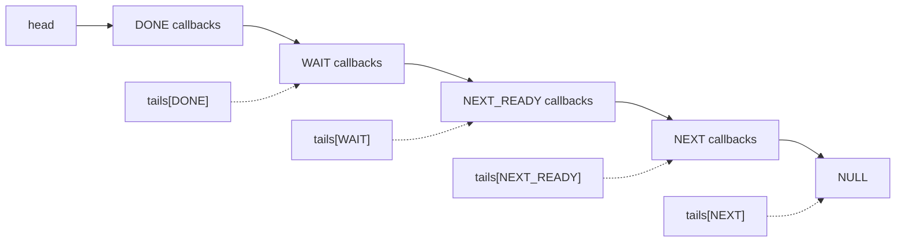
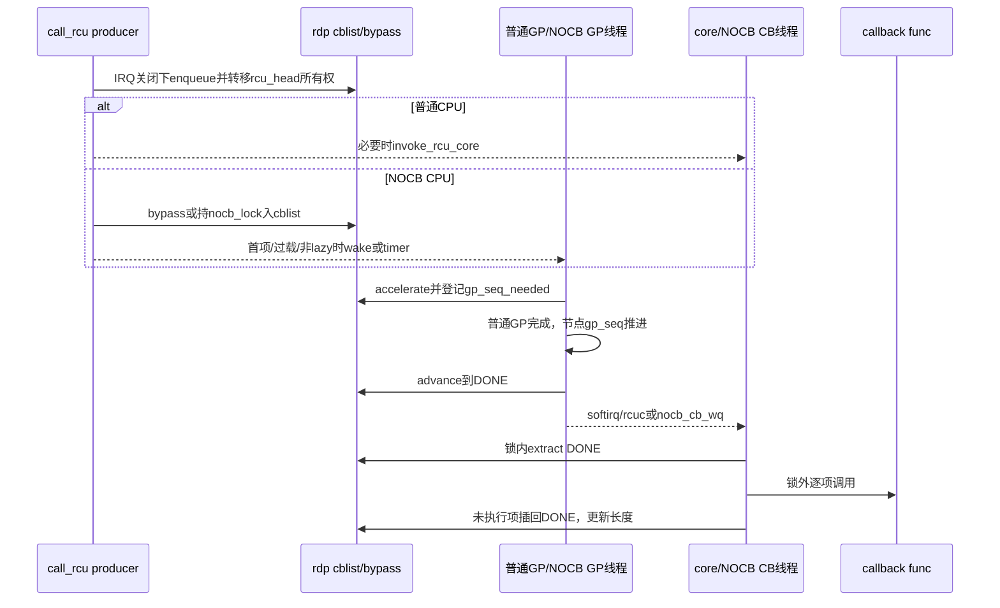

# 第9章\_Linux\_6.12\_Tree\_RCU\_回调与NOCB源码实现

## 9.1\_实现所有权与版本边界

本章唯一展开 Linux 6.12.20 普通 Tree RCU callback 从 enqueue、分段、绑定 GP、成熟、批处理执行，到 NOCB bypass/GP thread/CB thread 和动态 offload 的源码实现。普通 GP 的长期任务、请求、init/FQS/cleanup 由 [P05 GP 全局生命周期源码实现](P05_Linux_6.12_Tree_RCU_GP全局生命周期源码实现.md#5.16_端到端源码时序)唯一展开；本章只解释 callback 怎样提出需求和消费完成代际。`rcu_barrier_entrain()` 也操作 callback 分段，但其哨兵证明由 P10唯一展开；CPU offline 队列 merge 由 P06唯一展开。

源码基线：NXP `linux-imx` 固定提交 `dfaf2136deb2af2e60b994421281ba42f1c087e0`，配置包含 `CONFIG_TREE_RCU=y`、`CONFIG_PREEMPT_RCU=y`；NOCB 分支仅在 `CONFIG_RCU_NOCB_CPU` 下存在，lazy callback 还受 `CONFIG_RCU_LAZY` 控制。

上游相对位置：[`kernel/rcu/tree.c`](../../linux/kernel/rcu/tree.c)、[`kernel/rcu/tree_nocb.h`](../../linux/kernel/rcu/tree_nocb.h)、[`kernel/rcu/rcu_segcblist.c`](../../linux/kernel/rcu/rcu_segcblist.c)、[`include/linux/rcu_segcblist.h`](../../linux/include/linux/rcu_segcblist.h)。

概念入口：[回调与 NOCB 模块源码概念导读](../navigation/P07_Linux_6.12_Tree_RCU_回调与NOCB模块源码概念导读.md#7.1_GP完成为什么还不等于callback执行)。稳定正文：[P11 callback 分段](../../../../knowledge/linux/synchronization_and_asynchrony/synchronization/rcu/P11_Tree_RCU_rcu_segcblist回调状态机.md#11.2_四段不是四条链表)、[P12 批处理](../../../../knowledge/linux/synchronization_and_asynchrony/synchronization/rcu/P12_Tree_RCU_回调执行_批处理与限流.md#12.2_先区分四个时刻)、[P16 NOCB](../../../../knowledge/linux/synchronization_and_asynchrony/synchronization/rcu/P16_Tree_RCU_NOCB回调卸载.md#16.2_卸载前后责任对比)。

## 9.2\_源码符号覆盖账本

| 唯一展开符号 | 源文件 | 本章标题 | 作用 |
| --- | --- | --- | --- |
| `__call_rcu_common()`、`call_rcu()` | `tree.c` | [9.4](#9.4_call_rcu怎样把所有权交给每CPU队列) | 校验、取得 per-CPU 队列、普通/NOCB 分流 |
| `rcutree_enqueue()`、`call_rcu_core()` | `tree.c` | [9.4](#9.4_call_rcu怎样把所有权交给每CPU队列) | 普通 CPU enqueue 与 core/FQS 触发 |
| `rcu_segcblist_enqueue/accelerate/advance()` | `rcu_segcblist.c` | [9.5](#9.5_accelerate与advance怎样连接callback和GP) | 单链表分段、目标 GP 赋值、成熟推进 |
| `rcu_accelerate_cbs()`、`rcu_advance_cbs()` | `tree.c` | [9.5](#9.5_accelerate与advance怎样连接callback和GP) | 把分段算法接到全局/节点 GP 序列 |
| `rcu_do_batch()` | `tree.c` | [9.6](#9.6_rcu_do_batch为何先抽取再锁外执行) | 抽取 DONE、锁外调用、预算与 requeue |
| `invoke_rcu_core()`、`rcu_cpu_kthread()` | `tree.c` | [9.7](#9.7_普通CPU怎样选择softirq或rcuc执行者) | softirq/rcuc 执行者选择 |
| `rcu_nocb_try_bypass()`、`call_rcu_nocb()` | `tree_nocb.h` | [9.8](#9.8_nocb_bypass怎样降低生产者锁竞争又避免搁浅) | producer 速率分流、flush 和 wake |
| `nocb_gp_wait()`、`rcu_nocb_gp_kthread()` | `tree_nocb.h` | [9.9](#9.9_NOCB_GP线程怎样推进队列并等待最早目标代际) | 组级 callback GP 观察与成熟推进 |
| `nocb_cb_wait()`、`rcu_nocb_cb_kthread()` | `tree_nocb.h` | [9.10](#9.10_NOCB_CB线程只执行成熟批次) | 每 CPU callback 执行 |
| `rcu_nocb_cpu_offload/deoffload()` | `tree_nocb.h` | [9.10](#9.11_动态offload为何只允许offline_CPU并等待状态交接) | 动态执行所有权转换 |

`call_rcu()` 的公共 API 契约在 P01有索引，但函数体主线只在本章展开；P10只链接本章，不复制。

## 9.3\_一条链表怎样表达四段



`tails[i]` 是指向“该段末尾 `next` 槽”的指针，不是最后一个 callback 本身；空段可与相邻段共享同一个 tail 地址。`gp_seq[i]` 只对等待段有意义。移动段常常只需重写 tail 指针和长度，而不逐节点遍历，这正是 `rcu_segcblist` 的性能价值，也是它最容易被误读的地方。

**实现原理总纲：** 高频 producer 只把节点交给每 CPU 队列；`accelerate` 才把局部 callback 需求发布到 GP 树；`advance` 把已完成代际转成 DONE 资格；core 或 NOCB callback kthread 最后在共享锁外执行函数。NOCB 只替换后两步的执行者和唤醒路径，不替换普通 GP 的安全证明。

## 9.4\_call\_rcu怎样把所有权交给每CPU队列

公共入口先校验 `rcu_head`、保存函数并选择普通或 NOCB 路径；普通路径随后把节点挂入本 CPU 分段链表并触发 core。两步合起来才完成从调用者到 RCU callback 子系统的所有权转移。

### 9.4.1\_公共分流

```c
/**
 * @brief 把一个 rcu_head 交给当前 CPU 的普通或 NOCB callback 路径。
 * @param head 嵌入业务对象、queue 后由 RCU 拥有的节点。
 * @param func GP 后执行的函数。
 * @param lazy_in 是否允许 lazy 策略。
 * @note 中文 Doxygen 与注释由仓库补充；源码裁剪自 kernel/rcu/tree.c。
 */
static void __call_rcu_common(struct rcu_head *head,
			      rcu_callback_t func, bool lazy_in)
{
	unsigned long flags;
	struct rcu_data *rdp;
	bool lazy;

	WARN_ON_ONCE((unsigned long)head & (sizeof(void *) - 1));
	if (debug_rcu_head_queue(head)) {
		/* 真实源码把疑似重复queue改为泄漏回调，避免双重释放。 */
		WRITE_ONCE(head->func, rcu_leak_callback);
		return;
	}
	head->func = func;
	head->next = NULL;
	kasan_record_aux_stack_noalloc(head);

	local_irq_save(flags);
	rdp = this_cpu_ptr(&rcu_data);
	lazy = lazy_in && !rcu_async_should_hurry();
	if (unlikely(!rcu_segcblist_is_enabled(&rdp->cblist))) {
		if (rcu_segcblist_empty(&rdp->cblist))
			rcu_segcblist_init(&rdp->cblist);
	}
	check_cb_ovld(rdp);

	if (unlikely(rcu_rdp_is_offloaded(rdp)))
		call_rcu_nocb(rdp, head, func, flags, lazy);
	else
		call_rcu_core(rdp, head, func, flags);
	local_irq_restore(flags);
}

void call_rcu(struct rcu_head *head, rcu_callback_t func)
{
	__call_rcu_common(head, func, enable_rcu_lazy);
}
```

本地 IRQ 保存有两个作用：固定 `this_cpu_ptr()` 对应 CPU，并防止本 CPU 中断同时修改普通 callback 队列。它不是 GP 锁。调用返回后，调用者不能再次 queue、释放或修改 `head`，直到 callback 被执行并把所有权按业务协议归还。

### 9.4.2\_普通CPU\_enqueue和core触发

```c
static void rcutree_enqueue(struct rcu_data *rdp,
			    struct rcu_head *head,
			    rcu_callback_t func)
{
	rcu_segcblist_enqueue(&rdp->cblist, head);
	/* 省略：kvfree与普通callback trace。 */
}

static void call_rcu_core(struct rcu_data *rdp,
			  struct rcu_head *head,
			  rcu_callback_t func,
			  unsigned long flags)
{
	rcutree_enqueue(rdp, head, func);
	if (!rcu_is_watching())
		invoke_rcu_core();
	if (irqs_disabled_flags(flags) || cpu_is_offline(smp_processor_id()))
		return;

	if (unlikely(rcu_segcblist_n_cbs(&rdp->cblist) >
		     rdp->qlen_last_fqs_check + qhimark)) {
		note_gp_changes(rdp);
		if (!rcu_gp_in_progress())
			rcu_accelerate_cbs_unlocked(rdp->mynode, rdp);
		/* 真实源码还按n_force_qs迟滞决定是否force QS。 */
	}
}
```

enqueue 不必立刻拿节点锁给 callback 分配目标 GP；callback 洪峰时 core 路径才主动 accelerate/FQS，其他情况下后续 `rcu_core()` 或 NOCB GP 线程会分类。这把高频 producer 成本限制在 per-CPU 队列，代价是 callback 在 NEXT 段暂时只有保守信息。

## 9.5\_accelerate与advance怎样连接callback和GP

底层 `rcu_segcblist` 只维护段尾和目标序列，Tree RCU 包装层再把目标序列传播成全局 GP 需求。分开阅读这两层，才能区分局部队列重分类与跨 CPU 的 GP 请求通信。

### 9.5.1\_底层分段算法

```c
/**
 * @brief 把 seq 已覆盖的等待段推进 DONE，并压紧剩余段。
 * @note 本说明由仓库补充；源码裁剪自 kernel/rcu/rcu_segcblist.c。
 */
void rcu_segcblist_advance(struct rcu_segcblist *rsclp,
			   unsigned long seq)
{
	int i, j;

	if (rcu_segcblist_restempty(rsclp, RCU_DONE_TAIL))
		return;
	for (i = RCU_WAIT_TAIL; i < RCU_NEXT_TAIL; i++) {
		if (ULONG_CMP_LT(seq, rsclp->gp_seq[i]))
			break;
		WRITE_ONCE(rsclp->tails[RCU_DONE_TAIL], rsclp->tails[i]);
		rcu_segcblist_move_seglen(rsclp, i, RCU_DONE_TAIL);
	}
	if (i == RCU_WAIT_TAIL)
		return;
	for (j = RCU_WAIT_TAIL; j < i; j++)
		WRITE_ONCE(rsclp->tails[j], rsclp->tails[RCU_DONE_TAIL]);
	for (j = RCU_WAIT_TAIL; i < RCU_NEXT_TAIL; i++, j++) {
		if (rsclp->tails[j] == rsclp->tails[RCU_NEXT_TAIL])
			break;
		WRITE_ONCE(rsclp->tails[j], rsclp->tails[i]);
		rcu_segcblist_move_seglen(rsclp, i, j);
		rsclp->gp_seq[j] = rsclp->gp_seq[i];
	}
}

/**
 * @brief 把晚段与新 callback 合并到最早仍安全的目标 seq。
 * @return 是否还有 callback 需要等待 seq，供上层决定提出 GP 请求。
 */
bool rcu_segcblist_accelerate(struct rcu_segcblist *rsclp,
			      unsigned long seq)
{
	int i, j;

	if (rcu_segcblist_restempty(rsclp, RCU_DONE_TAIL))
		return false;
	for (i = RCU_NEXT_READY_TAIL; i > RCU_DONE_TAIL; i--)
		if (!rcu_segcblist_segempty(rsclp, i) &&
		    ULONG_CMP_LT(rsclp->gp_seq[i], seq))
			break;
	if (rcu_segcblist_restempty(rsclp, i) || ++i >= RCU_NEXT_TAIL)
		return false;
	for (j = i + 1; j <= RCU_NEXT_TAIL; j++)
		rcu_segcblist_move_seglen(rsclp, j, i);
	for (; i < RCU_NEXT_TAIL; i++) {
		WRITE_ONCE(rsclp->tails[i], rsclp->tails[RCU_NEXT_TAIL]);
		rsclp->gp_seq[i] = seq;
	}
	return true;
}
```

Advance 输入的是已经完成到哪里；accelerate 输入的是新 callback 最早应等待到哪里。前者向 DONE 移动，后者把 NEXT 向等待段压缩。两者都只改 tail/长度/代际元数据，不调用 callback。

### 9.5.2\_连接全局GP需求

```c
static bool rcu_accelerate_cbs(struct rcu_node *rnp,
			       struct rcu_data *rdp)
{
	unsigned long gp_seq_req;
	bool ret = false;

	if (!rcu_segcblist_pend_cbs(&rdp->cblist))
		return false;
	gp_seq_req = rcu_seq_snap(&rcu_state.gp_seq);
	if (rcu_segcblist_accelerate(&rdp->cblist, gp_seq_req))
		ret = rcu_start_this_gp(rnp, rdp, gp_seq_req);
	return ret;
}

static bool rcu_advance_cbs(struct rcu_node *rnp,
			    struct rcu_data *rdp)
{
	if (!rcu_segcblist_pend_cbs(&rdp->cblist))
		return false;
	rcu_segcblist_advance(&rdp->cblist, rnp->gp_seq);
	return rcu_accelerate_cbs(rnp, rdp);
}
```

调用者必须持叶节点锁并满足 callback list 的普通/NOCB 保护。`rcu_start_this_gp()` 返回是否需要唤醒全局 GP kthread；因此 accelerate 的返回值不是“callback 已加速成功”，而是控制执行者通信请求。请求怎样从叶节点漏斗汇聚、怎样唤醒长期任务并在 cleanup 发布 `rnp->gp_seq`，转入 [P05 的请求至完成实现](P05_Linux_6.12_Tree_RCU_GP全局生命周期源码实现.md#5.6_rcu_start_this_gp漏斗记录未来需求)，不在这里复制其函数体。

## 9.6\_rcu\_do\_batch为何先抽取再锁外执行

```c
/**
 * @brief 执行已经进入 DONE 段的一批 callback，并按数量/时间预算让出 CPU。
 * @note 本说明由仓库补充；源码裁剪自 kernel/rcu/tree.c。
 */
static void rcu_do_batch(struct rcu_data *rdp)
{
	long bl;
	long count = 0;
	int div;
	unsigned long flags;
	unsigned long jlimit;
	bool jlimit_check = false;
	long pending;
	struct rcu_cblist rcl = RCU_CBLIST_INITIALIZER(rcl);
	struct rcu_head *rhp;
	long tlimit = 0;

	if (!rcu_segcblist_ready_cbs(&rdp->cblist))
		return;

	rcu_nocb_lock_irqsave(rdp, flags);
	pending = rcu_segcblist_get_seglen(&rdp->cblist,
					   RCU_DONE_TAIL);
	div = READ_ONCE(rcu_divisor);
	div = div < 0 ? 7 :
	      div > sizeof(long) * 8 - 2 ? sizeof(long) * 8 - 2 : div;
	bl = max(rdp->blimit, pending >> div);
	if ((in_serving_softirq() ||
	     rdp->rcu_cpu_kthread_status == RCU_KTHREAD_RUNNING) &&
	    (IS_ENABLED(CONFIG_RCU_DOUBLE_CHECK_CB_TIME) ||
	     unlikely(bl > 100))) {
		const long npj = NSEC_PER_SEC / HZ;
		long rrn = READ_ONCE(rcu_resched_ns);

		rrn = rrn < NSEC_PER_MSEC ? NSEC_PER_MSEC :
		      rrn > NSEC_PER_SEC ? NSEC_PER_SEC : rrn;
		tlimit = local_clock() + rrn;
		jlimit = jiffies + (rrn + npj + 1) / npj;
		jlimit_check = true;
	}
	rcu_segcblist_extract_done_cbs(&rdp->cblist, &rcl);
	if (rcu_rdp_is_offloaded(rdp))
		rdp->qlen_last_fqs_check =
			rcu_segcblist_n_cbs(&rdp->cblist);
	rcu_nocb_unlock_irqrestore(rdp, flags);

	tick_dep_set_task(current, TICK_DEP_BIT_RCU);
	rhp = rcu_cblist_dequeue(&rcl);
	for (; rhp; rhp = rcu_cblist_dequeue(&rcl)) {
		rcu_callback_t f;

		count++;
		debug_rcu_head_unqueue(rhp);
		rcu_lock_acquire(&rcu_callback_map);
		f = rhp->func;
		debug_rcu_head_callback(rhp);
		WRITE_ONCE(rhp->func, (rcu_callback_t)0L);
		f(rhp); /* 未知业务函数在共享队列锁外运行。 */
		rcu_lock_release(&rcu_callback_map);

		if (in_serving_softirq()) {
			if (count >= bl &&
			    (need_resched() || !is_idle_task(current)))
				break;
			if (rcu_do_batch_check_time(count, tlimit,
						    jlimit_check, jlimit))
				break;
		} else {
			local_bh_enable();
			lockdep_assert_irqs_enabled();
			cond_resched_tasks_rcu_qs();
			lockdep_assert_irqs_enabled();
			local_bh_disable();
			if (rdp->rcu_cpu_kthread_status == RCU_KTHREAD_RUNNING &&
			    rcu_do_batch_check_time(count, tlimit,
						    jlimit_check, jlimit)) {
				rdp->rcu_cpu_has_work = 1;
				break;
			}
		}
	}

	rcu_nocb_lock_irqsave(rdp, flags);
	rdp->n_cbs_invoked += count;
	rcu_segcblist_insert_done_cbs(&rdp->cblist, &rcl);
	rcu_segcblist_add_len(&rdp->cblist, -count);

	count = rcu_segcblist_n_cbs(&rdp->cblist);
	if (rdp->blimit >= DEFAULT_MAX_RCU_BLIMIT && count <= qlowmark)
		rdp->blimit = blimit;
	if (count == 0 && rdp->qlen_last_fqs_check != 0) {
		rdp->qlen_last_fqs_check = 0;
		rdp->n_force_qs_snap = READ_ONCE(rcu_state.n_force_qs);
	} else if (count < rdp->qlen_last_fqs_check - qhimark) {
		rdp->qlen_last_fqs_check = count;
	}
	/* 省略 trace 与四项一致性 WARN，它们不改变队列状态。 */
	rcu_nocb_unlock_irqrestore(rdp, flags);
	tick_dep_clear_task(current, TICK_DEP_BIT_RCU);
}
```

该裁剪只移除了 trace、重复告警与不会改变控制结果的诊断语句；`divisor` 限界、两类执行上下文的停止条件、重排未执行项和长度结算均保持源码顺序。时间预算同时看 local clock 与 jiffies；softirq 需避免饿死其他 vector，rcuc/rcuo 可 `cond_resched_tasks_rcu_qs()`，但 rcuc 自身也可能延迟 QS，所以仍有时间上限。

抽取时保留共享队列 callback 总长度，实际执行后才减 `count`，因为 `rcu_barrier()` 在并发扫描时宁可保守地认为抽取中的 callback 仍未完成。未执行完的 `rcl` 插回 DONE 首部，保证仍具执行资格且不丢失。

## 9.7\_普通CPU怎样选择softirq或rcuc执行者

```c
static void invoke_rcu_core(void)
{
	if (!cpu_online(smp_processor_id()))
		return;
	if (use_softirq)
		raise_softirq(RCU_SOFTIRQ);
	else
		invoke_rcu_core_kthread();
}
```

`RCU_SOFTIRQ` 最终调用 `rcu_core()`；关闭 `use_softirq` 时，per-CPU `rcuc/%u` kthread 通过 `rcu_cpu_has_work` 唤醒并调用同一 core。`rcu_core()` 依次吸收 GP 变化、报告 deferred QS、推进 callback、检查 stall、调用 `rcu_do_batch()`，再处理 NOCB deferred wake。

因此“callback 在 softirq 执行”不是 Tree RCU 不变契约。正确说法是：非 offloaded callback 由每 CPU core 执行，具体执行上下文可配置为 RCU softirq 或 per-CPU rcuc kthread；offloaded callback 则由 rcuoc/CB kthread执行。

## 9.8\_nocb\_bypass怎样降低生产者锁竞争又避免搁浅

```c
/**
 * @brief 尝试把 offloaded CPU 的新 callback 放入 bypass，或先flush后走cblist。
 * @return true 表示本函数已经enqueue；false 表示调用者持nocb_lock去常规enqueue。
 * @note 本说明由仓库补充；源码裁剪自 kernel/rcu/tree_nocb.h。
 */
static bool rcu_nocb_try_bypass(struct rcu_data *rdp,
				struct rcu_head *rhp,
				bool *was_alldone,
				unsigned long flags,
				bool lazy)
{
	unsigned long c;
	unsigned long cur_gp_seq;
	unsigned long j = jiffies;
	long ncbs = rcu_cblist_n_cbs(&rdp->nocb_bypass);
	bool bypass_is_lazy = (ncbs == READ_ONCE(rdp->lazy_len));

	lockdep_assert_irqs_disabled();

	if (!rcu_rdp_is_offloaded(rdp)) {
		*was_alldone = !rcu_segcblist_pend_cbs(&rdp->cblist);
		return false;
	}
	if (rcu_scheduler_active != RCU_SCHEDULER_RUNNING) {
		rcu_nocb_lock(rdp);
		*was_alldone = !rcu_segcblist_pend_cbs(&rdp->cblist);
		return false;
	}

	/* 每个jiffy重新估计近期常规cblist enqueue速率。 */
	if (j == rdp->nocb_nobypass_last) {
		c = rdp->nocb_nobypass_count + 1;
	} else {
		WRITE_ONCE(rdp->nocb_nobypass_last, j);
		c = rdp->nocb_nobypass_count -
			nocb_nobypass_lim_per_jiffy;
		if (ULONG_CMP_LT(rdp->nocb_nobypass_count,
				 nocb_nobypass_lim_per_jiffy))
			c = 0;
		else if (c > nocb_nobypass_lim_per_jiffy)
			c = nocb_nobypass_lim_per_jiffy;
	}
	WRITE_ONCE(rdp->nocb_nobypass_count, c);

	/* 低速非lazy流量直接使用cblist，但先flush已有bypass保持顺序。 */
	if (rdp->nocb_nobypass_count < nocb_nobypass_lim_per_jiffy &&
	    !lazy) {
		rcu_nocb_lock(rdp);
		*was_alldone = !rcu_segcblist_pend_cbs(&rdp->cblist);
		WARN_ON_ONCE(!rcu_nocb_flush_bypass(rdp, NULL, j, false));
		WARN_ON_ONCE(rcu_cblist_n_cbs(&rdp->nocb_bypass));
		return false;
	}

	/* 普通项跨jiffy、lazy项超时或队列过长时flush。 */
	if ((ncbs && !bypass_is_lazy &&
	     j != READ_ONCE(rdp->nocb_bypass_first)) ||
	    (ncbs && bypass_is_lazy &&
	     time_after(j, READ_ONCE(rdp->nocb_bypass_first) +
			rcu_get_jiffies_lazy_flush())) ||
	    ncbs >= qhimark) {
		rcu_nocb_lock(rdp);
		*was_alldone = !rcu_segcblist_pend_cbs(&rdp->cblist);
		if (!rcu_nocb_flush_bypass(rdp, rhp, j, lazy)) {
			WARN_ON_ONCE(rcu_cblist_n_cbs(&rdp->nocb_bypass));
			return false;
		}
		if (j != rdp->nocb_gp_adv_time &&
		    rcu_segcblist_nextgp(&rdp->cblist, &cur_gp_seq) &&
		    rcu_seq_done(&rdp->mynode->gp_seq, cur_gp_seq)) {
			rcu_advance_cbs_nowake(rdp->mynode, rdp);
			rdp->nocb_gp_adv_time = j;
		}
		__call_rcu_nocb_wake(rdp, *was_alldone, flags);
		return true;
	}

	rcu_nocb_bypass_lock(rdp);
	ncbs = rcu_cblist_n_cbs(&rdp->nocb_bypass);
	rcu_segcblist_inc_len(&rdp->cblist); /* 必须先计入全队列长度。 */
	rcu_cblist_enqueue(&rdp->nocb_bypass, rhp);
	if (lazy)
		WRITE_ONCE(rdp->lazy_len, rdp->lazy_len + 1);
	if (!ncbs)
		WRITE_ONCE(rdp->nocb_bypass_first, j);
	rcu_nocb_bypass_unlock(rdp);

	/* 首项或lazy转非lazy时，确保GP线程不会无限睡眠。 */
	if (!ncbs || (bypass_is_lazy && !lazy)) {
		rcu_nocb_lock(rdp);
		if (!rcu_segcblist_pend_cbs(&rdp->cblist)) {
			__call_rcu_nocb_wake(rdp, true, flags);
		} else {
			rcu_nocb_unlock(rdp);
		}
	}
	return true;
}
```

该裁剪只移除了 trace；每 jiffy 速率、普通/lazy 年龄、`qhimark`、首次 bypass 和 `cblist` 是否全完成均保留。它们是可调优化，不是调用方契约。不可改变的不变量是：bypass 节点同时计入 `cblist` 总长度、flush 后才在权威分段链分类、首次/非lazy需求能唤醒或定时唤醒 GP thread。

`call_rcu_nocb()` 在 try-bypass 返回 false 时调用 `rcutree_enqueue()`，然后 `__call_rcu_nocb_wake()` 同时完成解锁和必要唤醒；这个 unusual ownership contract 是修改时常见漏锁点。

## 9.9\_NOCB\_GP线程怎样推进队列并等待最早目标代际

NOCB GP 线程负责刷新 bypass、推进各成员队列，并从仍未成熟的 callback 中汇总最早目标 GP。它只发布成熟资格和唤醒对应 CB 线程，不执行业务函数；下一节再沿 CB 线程消费 DONE 段。

```c
/**
 * @brief 扫描本 NOCB 组所有 rdp，flush/advance并等待最早目标GP。
 * @note 本说明由仓库补充；源码裁剪自 kernel/rcu/tree_nocb.h。
 */
static void nocb_gp_wait(struct rcu_data *my_rdp)
{
	bool bypass = false;
	int cpu = my_rdp->cpu;
	unsigned long flags;
	unsigned long j = jiffies;
	bool lazy = false;
	bool needwait_gp = false;
	unsigned long wait_gp_seq = 0;
	struct rcu_data *rdp, *rdp_toggling = NULL;

	list_for_each_entry(rdp, &my_rdp->nocb_head_rdp,
			    nocb_entry_rdp) {
		long bypass_ncbs;
		bool flush_bypass = false;
		long lazy_ncbs;
		struct rcu_node *rnp = rdp->mynode;
		unsigned long cur_gp_seq;
		bool needwake = false;
		bool needwake_gp = false;

		rcu_nocb_lock_irqsave(rdp, flags);
		bypass_ncbs = rcu_cblist_n_cbs(&rdp->nocb_bypass);
		lazy_ncbs = READ_ONCE(rdp->lazy_len);
		if (bypass_ncbs && lazy_ncbs == bypass_ncbs &&
		    (time_after(j, READ_ONCE(rdp->nocb_bypass_first) +
				rcu_get_jiffies_lazy_flush()) ||
		     bypass_ncbs > 2 * qhimark)) {
			flush_bypass = true;
		} else if (bypass_ncbs && lazy_ncbs != bypass_ncbs &&
			   (time_after(j,
				READ_ONCE(rdp->nocb_bypass_first) + 1) ||
			    bypass_ncbs > 2 * qhimark)) {
			flush_bypass = true;
		} else if (!bypass_ncbs &&
			   rcu_segcblist_empty(&rdp->cblist)) {
			rcu_nocb_unlock_irqrestore(rdp, flags);
			continue;
		}
		if (flush_bypass) {
			(void)rcu_nocb_try_flush_bypass(rdp, j);
			bypass_ncbs = rcu_cblist_n_cbs(&rdp->nocb_bypass);
			lazy_ncbs = READ_ONCE(rdp->lazy_len);
		}
		if (bypass_ncbs) {
			if (bypass_ncbs == lazy_ncbs)
				lazy = true;
			else
				bypass = true;
		}

		if (!rcu_segcblist_restempty(&rdp->cblist,
					     RCU_NEXT_READY_TAIL) ||
		    (rcu_segcblist_nextgp(&rdp->cblist, &cur_gp_seq) &&
		     rcu_seq_done(&rnp->gp_seq, cur_gp_seq))) {
			raw_spin_lock_rcu_node(rnp);
			needwake_gp = rcu_advance_cbs(rnp, rdp);
			raw_spin_unlock_rcu_node(rnp);
		}
		if (rcu_segcblist_nextgp(&rdp->cblist, &cur_gp_seq)) {
			if (!needwait_gp || ULONG_CMP_LT(cur_gp_seq, wait_gp_seq))
				wait_gp_seq = cur_gp_seq;
			needwait_gp = true;
		}
		if (rcu_segcblist_ready_cbs(&rdp->cblist)) {
			needwake = rdp->nocb_cb_sleep;
			WRITE_ONCE(rdp->nocb_cb_sleep, false);
		}
		rcu_nocb_unlock_irqrestore(rdp, flags);
		if (needwake) {
			swake_up_one(&rdp->nocb_cb_wq);
		}
		if (needwake_gp)
			rcu_gp_kthread_wake();
	}

	my_rdp->nocb_gp_bypass = bypass;
	my_rdp->nocb_gp_gp = needwait_gp;
	my_rdp->nocb_gp_seq = needwait_gp ? wait_gp_seq : 0;

	if (!rcu_nocb_poll) {
		if (lazy && !bypass)
			wake_nocb_gp_defer(my_rdp, RCU_NOCB_WAKE_LAZY,
					   TPS("WakeLazyIsDeferred"));
		else if (bypass)
			wake_nocb_gp_defer(my_rdp, RCU_NOCB_WAKE_BYPASS,
					   TPS("WakeBypassIsDeferred"));
	}

	if (rcu_nocb_poll) {
		if (list_empty(&my_rdp->nocb_head_rdp)) {
			raw_spin_lock_irqsave(&my_rdp->nocb_gp_lock, flags);
			if (!my_rdp->nocb_toggling_rdp)
				WRITE_ONCE(my_rdp->nocb_gp_sleep, true);
			raw_spin_unlock_irqrestore(&my_rdp->nocb_gp_lock,
						   flags);
			nocb_gp_sleep(my_rdp, cpu);
		} else {
			schedule_timeout_idle(1);
		}
	} else if (!needwait_gp) {
		nocb_gp_sleep(my_rdp, cpu);
	} else {
		swait_event_interruptible_exclusive(
			my_rdp->mynode->nocb_gp_wq[
				rcu_seq_ctr(wait_gp_seq) & 0x1],
			rcu_seq_done(&my_rdp->mynode->gp_seq, wait_gp_seq) ||
			!READ_ONCE(my_rdp->nocb_gp_sleep));
	}

	if (!rcu_nocb_poll) {
		raw_spin_lock_irqsave(&my_rdp->nocb_gp_lock, flags);
		rdp_toggling = my_rdp->nocb_toggling_rdp;
		if (rdp_toggling)
			my_rdp->nocb_toggling_rdp = NULL;
		if (my_rdp->nocb_defer_wakeup > RCU_NOCB_WAKE_NOT) {
			WRITE_ONCE(my_rdp->nocb_defer_wakeup,
				   RCU_NOCB_WAKE_NOT);
			del_timer(&my_rdp->nocb_timer);
		}
		WRITE_ONCE(my_rdp->nocb_gp_sleep, true);
		raw_spin_unlock_irqrestore(&my_rdp->nocb_gp_lock, flags);
	} else {
		rdp_toggling = READ_ONCE(my_rdp->nocb_toggling_rdp);
		if (rdp_toggling) {
			raw_spin_lock_irqsave(&my_rdp->nocb_gp_lock, flags);
			my_rdp->nocb_toggling_rdp = NULL;
			raw_spin_unlock_irqrestore(&my_rdp->nocb_gp_lock,
						   flags);
		}
	}
	if (rdp_toggling) {
		nocb_gp_toggle_rdp(my_rdp, rdp_toggling);
		swake_up_one(&rdp_toggling->nocb_state_wq);
	}
	my_rdp->nocb_gp_seq = -1;
}

static int rcu_nocb_gp_kthread(void *arg)
{
	struct rcu_data *rdp = arg;
	for (;;) {
		WRITE_ONCE(rdp->nocb_gp_loops, rdp->nocb_gp_loops + 1);
		nocb_gp_wait(rdp);
		cond_resched_tasks_rcu_qs();
	}
}
```

NOCB group 以 `my_rdp` 为组头，`nocb_head_rdp` 挂接该组负责的所有 `rdp`。扫描每个成员时，推进资格读取成员自己的 `rdp->mynode->gp_seq`；汇总出组内最早目标后，线程睡在组头 `my_rdp->mynode->nocb_gp_wq[]` 上。节点 `gp_seq` 都由同一轮全局 GP 推进，cleanup 会唤醒对应槽，因此这不是“拿组头节点替成员证明完成”，而是借组头 waitqueue 等待全局代际推进后重新扫描每个成员。

上面的裁剪只删除了 trace、告警与不改变状态的诊断语句，所有会改变 callback 归属、等待目标、group membership 和线程睡眠状态的动作都保留。`nocb_gp_sleep` 必须在 `nocb_gp_lock` 下重新置位；动态 offload/deoffload 则通过 `nocb_toggling_rdp` 把成员表修改交给 GP thread，并以 `nocb_state_wq` 回执完成，不能由控制路径直接并发改链表。

## 9.10\_NOCB\_CB线程只执行成熟批次

```c
static void nocb_cb_wait(struct rcu_data *rdp)
{
	struct rcu_segcblist *cblist = &rdp->cblist;
	unsigned long cur_gp_seq;
	unsigned long flags;
	bool needwake_gp = false;
	struct rcu_node *rnp = rdp->mynode;

	swait_event_interruptible_exclusive(
		rdp->nocb_cb_wq,
		!READ_ONCE(rdp->nocb_cb_sleep) || kthread_should_park());
	if (kthread_should_park()) {
		if (rdp->nocb_cb_sleep) {
			rcu_nocb_lock_irqsave(rdp, flags);
			WARN_ON_ONCE(rcu_segcblist_n_cbs(&rdp->cblist));
			rcu_nocb_unlock_irqrestore(rdp, flags);
			kthread_parkme();
		}
	}

	WARN_ON_ONCE(!rcu_rdp_is_offloaded(rdp));
	local_irq_save(flags);
	rcu_momentary_eqs();
	local_irq_restore(flags);
	local_bh_disable();
	rcu_do_batch(rdp);
	local_bh_enable();

	rcu_nocb_lock_irqsave(rdp, flags);
	if (rcu_segcblist_nextgp(cblist, &cur_gp_seq) &&
	    rcu_seq_done(&rnp->gp_seq, cur_gp_seq) &&
	    raw_spin_trylock_rcu_node(rnp)) {
		needwake_gp = rcu_advance_cbs(rdp->mynode, rdp);
		raw_spin_unlock_rcu_node(rnp);
	}
	if (!rcu_segcblist_ready_cbs(cblist))
		WRITE_ONCE(rdp->nocb_cb_sleep, true);
	else
		WRITE_ONCE(rdp->nocb_cb_sleep, false);
	rcu_nocb_unlock_irqrestore(rdp, flags);
	if (needwake_gp)
		rcu_gp_kthread_wake();
}

static int rcu_nocb_cb_kthread(void *arg)
{
	struct rcu_data *rdp = arg;
	for (;;) {
		nocb_cb_wait(rdp);
		cond_resched_tasks_rcu_qs();
	}
}
```

BH 禁用为 callback 提供与普通 softirq 路径一致的环境，并防止 offload 转换期间自重排 callback 在 softirq 和 kthread 两处并发执行。GP thread 不调用业务函数；CB thread 不负责全局 GP 证明，这个职责分离正是 NOCB 的核心。

## 9.11\_动态offload为何只允许offline\_CPU并等待状态交接

```c
int rcu_nocb_cpu_deoffload(int cpu)
{
	struct rcu_data *rdp = per_cpu_ptr(&rcu_data, cpu);
	int ret = 0;

	cpus_read_lock();
	mutex_lock(&rcu_state.nocb_mutex);
	if (rcu_rdp_is_offloaded(rdp)) {
		if (!cpu_online(cpu)) {
			ret = rcu_nocb_rdp_deoffload(rdp);
			if (!ret)
				cpumask_clear_cpu(cpu, rcu_nocb_mask);
		} else {
			ret = -EINVAL;
		}
	}
	mutex_unlock(&rcu_state.nocb_mutex);
	cpus_read_unlock();
	return ret;
}

int rcu_nocb_cpu_offload(int cpu)
{
	struct rcu_data *rdp = per_cpu_ptr(&rcu_data, cpu);
	int ret = 0;

	cpus_read_lock();
	mutex_lock(&rcu_state.nocb_mutex);
	if (!rcu_rdp_is_offloaded(rdp)) {
		if (!cpu_online(cpu)) {
			ret = rcu_nocb_rdp_offload(rdp);
			if (!ret)
				cpumask_set_cpu(cpu, rcu_nocb_mask);
		} else {
			ret = -EINVAL;
		}
	}
	mutex_unlock(&rcu_state.nocb_mutex);
	cpus_read_unlock();
	return ret;
}
```

内部 `rcu_nocb_rdp_offload/deoffload()` 还会在组 GP kthread mutex 和 per-CPU locks 下 queue toggle 请求，唤醒 GP thread，睡 `nocb_state_wq` 等 `SEGCBLIST_OFFLOADED` 与 kthread ownership 真正改变，然后 park/unpark callback kthread。只允许 offline CPU转换，避免在线 producer/core 在所有权切换中继续走旧模式。

`nocb_mutex` 也保护 `rcu_nocb_mask` 与 lazy shrinker 并发观察；`nocb_is_setup` 表示启动期 NOCB 全局设置状态，不是每 CPU offload flag。每 CPU权威模式仍在 segcblist flags 和 kthread/group 指针中。

## 9.12\_端到端源码时序



## 9.13\_修改与验证边界

1. Queue 后 `rcu_head` 所有权已经转移，debug double-queue 防线不能省略；
2. per-CPU producer 高频路径不应无故引入根锁；
3. `rcu_segcblist` 是一链四段，tail/seglen/gp_seq 必须同步维护；
4. accelerate 只分配安全目标并提出 GP，advance 只成熟 callback，两者都不执行函数；
5. `rcu_do_batch()` 只从 DONE 抽取，未知函数必须在共享队列锁外执行；
6. 抽取期间总长度保守保留，确保 barrier 不漏正在执行项；
7. bypass 长度同时计入 segcblist 总数，最终必须 flush 进入权威分段链；
8. NOCB GP thread 与 CB thread 的 waitqueue/睡眠标志交接不能丢 wake；
9. NOCB 只卸载 callback 处理，不移除 reader/QS/expedited 参与；
10. 动态 offload/deoffload 只在 offline CPU进行，并等待 kthread ownership 切换完成；
11. callback migration、barrier entrain、NOCB bypass flush 的锁顺序需跨 P06/P10共同复核；
12. 批处理数量/时间调优只影响延迟和占用，不能改变 DONE 安全资格。

总索引：[Linux 6.12 RCU 源码总阅读索引](../navigation/P01_Linux_6.12_RCU源码总阅读索引.md#1.4_模块概念导读入口)。
