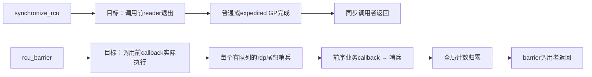
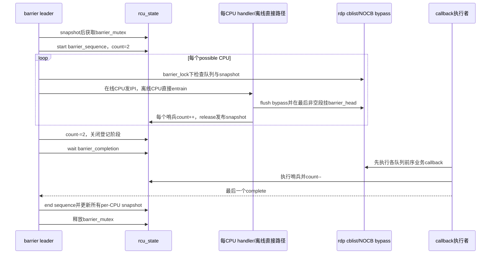

# 第10章\_Linux\_6.12\_Tree\_RCU\_同步等待与rcu\_barrier源码实现

## 10.1\_实现所有权与版本边界

本章唯一展开 `synchronize_rcu()` 的公开分流、默认/可选普通同步等待的对象边界，以及 `rcu_barrier()` 的 sequence、per-CPU 哨兵、计数、hotplug/NOCB 交界。

为了保持一个函数体一个权威位置：

- `wakeme_after_rcu()` 与通用 `__wait_rcu_gp()` 函数体仍由 [P02 等待桥](P02_Linux_6.12_非抢占式_Tree_RCU_关键函数源码实现.md#2.3___wait_rcu_gp与wakeme_after_rcu连接等待者)展开；
- SRS 直接 GP wake 的 `rcu_sr_normal_*()` 函数体仍由 [P05 SRS](P05_Linux_6.12_Tree_RCU_GP全局生命周期源码实现.md#5.11.2_SRS怎样批量交付同步等待者)展开；
- callback 分段、NOCB bypass 与执行由 [P09 callback/NOCB](P09_Linux_6.12_Tree_RCU_回调与NOCB源码实现.md#9.3_一条链表怎样表达四段)展开；
- 本章只在调用点解释它们如何组成同步/barrier 协议。

源码基线：NXP Linux 6.12.20 固定提交 `dfaf2136deb2af2e60b994421281ba42f1c087e0`，配置包含 `CONFIG_TREE_RCU=y`、`CONFIG_PREEMPT_RCU=y`。上游相对位置：[`kernel/rcu/tree.c`](../../linux/kernel/rcu/tree.c)、[`kernel/rcu/update.c`](../../linux/kernel/rcu/update.c)、[`kernel/rcu/tree.h`](../../linux/kernel/rcu/tree.h)。

概念入口：[同步等待与 rcu_barrier 模块源码概念导读](../navigation/P12_Linux_6.12_Tree_RCU_同步等待与rcu_barrier模块源码概念导读.md#12.1_等RCU至少有三种不同对象)。稳定正文：[Tree RCU 同步等待与 rcu_barrier](../../../../knowledge/linux/synchronization/rcu/P20_Tree_RCU_同步等待与rcu_barrier.md#20.1.2_四个相近接口等待什么)。

## 10.2\_源码符号覆盖账本

| 唯一展开符号 | 本章标题 | 核心副作用 |
| --- | --- | --- |
| `rcu_blocking_is_gp()`、`synchronize_rcu()` | [10.4](#10.4_synchronize_rcu怎样选择普通expedited或早期空GP) | 合法上下文检查、普通/expedited/早期退化分流 |
| `synchronize_rcu_normal()` 调用关系 | [10.5](#10.5_默认分支为何等待调用者自己的completion) | 在 P02 默认 callback wait 与 P05 SRS 唯一实现之间分流；本章不复制函数体 |
| `rcu_barrier_callback()` | [10.6](#10.6_barrier_callback与entrain如何证明队列前序已执行) | 哨兵执行、原子减计数、最后者 complete |
| `rcu_barrier_entrain()` | [10.6](#10.6_barrier_callback与entrain如何证明队列前序已执行) | flush bypass、队尾挂哨兵、更新 per-CPU snapshot |
| `rcu_barrier_handler()` | [10.7](#10.7_barrier_lock怎样封住CPU热插拔与迁移竞态) | 在线目标 CPU 本地 IRQ 上下文登记哨兵 |
| `rcu_barrier()` | [10.8](#10.8_rcu_barrier怎样扫描所有队列并等待真实执行) | leader/follower、全 CPU 扫描、登记期护栏与完成发布 |

## 10.3\_两个等待证明不能相互替代



Callback 可能在目标 GP 完成后因批处理预算、CPU 饥饿或 NOCB kthread 未运行而停留 DONE 段。再等一轮 GP只增加 reader 时间边界，不会强制 DONE callback 执行；因此模块代码卸载必须按 callback 实际执行证明选择 `rcu_barrier()`。

## 10.4\_synchronize\_rcu怎样选择普通expedited或早期空GP

```c
/**
 * @brief 判断当前启动状态是否允许阻塞操作本身充当退化 GP。
 * @note 中文 Doxygen 与注释由仓库补充；源码裁剪自 kernel/rcu/tree.c。
 */
static int rcu_blocking_is_gp(void)
{
	if (rcu_scheduler_active != RCU_SCHEDULER_INACTIVE) {
		might_sleep();
		return false;
	}
	return true;
}

/**
 * @brief 阻塞当前任务，直到调用点以前的普通 RCU reader 已退出。
 * @pre 可阻塞上下文，且不在受本次等待覆盖的普通 RCU 读侧中。
 * @note 本说明由仓库补充；源码裁剪自 kernel/rcu/tree.c。
 */
void synchronize_rcu(void)
{
	unsigned long flags;
	struct rcu_node *rnp;

	RCU_LOCKDEP_WARN(lock_is_held(&rcu_bh_lock_map) ||
			 lock_is_held(&rcu_lock_map) ||
			 lock_is_held(&rcu_sched_lock_map),
			 "Illegal synchronize_rcu() in RCU read-side critical section");

	if (!rcu_blocking_is_gp()) {
		if (rcu_gp_is_expedited())
			synchronize_rcu_expedited();
		else
			synchronize_rcu_normal();
		return;
	}

	/* !PREEMPT && !SMP 的早期启动退化分支。 */
	rcu_poll_gp_seq_start_unlocked(&rcu_state.gp_seq_polled_snap);
	rcu_poll_gp_seq_end_unlocked(&rcu_state.gp_seq_polled_snap);
	local_irq_save(flags);
	WARN_ON_ONCE(num_online_cpus() > 1);
	rcu_state.gp_seq += (1 << RCU_SEQ_CTR_SHIFT);
	for (rnp = this_cpu_ptr(&rcu_data)->mynode;
	     rnp;
	     rnp = rnp->parent)
		rnp->gp_seq_needed = rnp->gp_seq = rcu_state.gp_seq;
	local_irq_restore(flags);
}
```

实现原理：`rcu_scheduler_active == INACTIVE` 时系统还没有可并行调度的正常多任务环境，阻塞调用只可能与其他退化 GP 完全嵌套，所以源码直接推进 boot CPU可见的 sequence 与 poll 状态。调度器进入 INIT/RUNNING 后，这个捷径关闭，`might_sleep()` 同时执行上下文检查。

`rcu_gp_is_expedited()` 是全局运行策略，不表示调用者显式调用 expedited API；普通公开 API可能按策略转 expedited。两条路径语义相同但内部 proof channel 不同。

## 10.5\_默认分支为何等待调用者自己的completion

下面是调用关系示意，不是第二份裁剪源码；`synchronize_rcu_normal()` 的唯一函数体在 [P05 SRS 实现](P05_Linux_6.12_Tree_RCU_GP全局生命周期源码实现.md#5.11.2_SRS怎样批量交付同步等待者)：

```text
synchronize_rcu_normal()
├── rcu_normal_wake_from_gp == 0（默认）
│   └── wait_rcu_gp(call_rcu_hurry)
│       └── __wait_rcu_gp()建立栈上rcu_synchronize
│           └── callback执行wakeme_after_rcu()并complete
└── rcu_normal_wake_from_gp != 0（可选）
    ├── 初始化栈上head与completion
    ├── rcu_sr_normal_add_req()
    ├── start_poll_synchronize_rcu()提出GP需求
    └── GP init/cleanup按批次complete
```

默认分支 `wait_rcu_gp(call_rcu_hurry)` 展开为 `__wait_rcu_gp()`：调用者栈上 `rs.head` 被排入 callback 队列，`rs.completion` 只属于该调用者；callback 走到执行点后 `wakeme_after_rcu()` 用 `container_of()` 找回 `rs` 并 complete。因为函数一直睡到 callback 返回，栈对象不会提前失效。

默认分支实际比“只等 GP sequence”多走一步 callback 执行，但 API 契约仍只承诺 reader 覆盖，不承诺系统其他 callback 全部执行。专用唤醒 callback 只证明排在它自身前的相应队列进展，不能替代全 CPU `rcu_barrier()`。

可选 `rcu_normal_wake_from_gp=1` 分支不排 callback，而把 `rs` 加入 SRS 请求链；GP init 划定批次，cleanup/work 直接 complete。`start_poll_synchronize_rcu()` 负责确保有一轮 GP需求，SRS 请求链负责谁在完成点被唤醒。两个职责不能压成一个 sequence 比较。

## 10.6\_barrier\_callback与entrain如何证明队列前序已执行

### 10.6.1\_哨兵执行

```c
/**
 * @brief 每 CPU barrier 哨兵 callback；最后一个完成全局 barrier completion。
 * @note 本说明由仓库补充；源码裁剪自 kernel/rcu/tree.c。
 */
static void rcu_barrier_callback(struct rcu_head *rhp)
{
	unsigned long s = rcu_state.barrier_sequence;

	rhp->next = rhp; /* 标记该预分配哨兵已经执行，可供后续轮次复用。 */
	if (atomic_dec_and_test(&rcu_state.barrier_cpu_count)) {
		rcu_barrier_trace(TPS("LastCB"), -1, s);
		complete(&rcu_state.barrier_completion);
	} else {
		rcu_barrier_trace(TPS("CB"), -1, s);
	}
}
```

先 snapshot `barrier_sequence` 再减计数，是因为当前哨兵若不是最后一个，其他哨兵可能很快归零并让下一轮开始；trace 若后读全局 sequence 会把旧 callback 错记到新轮。

### 10.6.2\_队尾entrain

```c
/**
 * @brief 若本 rdp 有未执行 callback，给当前 barrier 轮次在其队尾挂哨兵。
 * @pre 持有 rcu_state.barrier_lock。
 * @note 本说明由仓库补充；源码裁剪自 kernel/rcu/tree.c。
 */
static void rcu_barrier_entrain(struct rcu_data *rdp)
{
	unsigned long gseq = READ_ONCE(rcu_state.barrier_sequence);
	unsigned long lseq = READ_ONCE(rdp->barrier_seq_snap);
	bool wake_nocb = false;
	bool was_alldone = false;

	lockdep_assert_held(&rcu_state.barrier_lock);
	if (rcu_seq_state(lseq) || !rcu_seq_state(gseq) ||
	    rcu_seq_ctr(lseq) != rcu_seq_ctr(gseq))
		return;

	rdp->barrier_head.func = rcu_barrier_callback;
	debug_rcu_head_queue(&rdp->barrier_head);
	rcu_nocb_lock(rdp);
	was_alldone = rcu_rdp_is_offloaded(rdp) &&
		      !rcu_segcblist_pend_cbs(&rdp->cblist);
	WARN_ON_ONCE(!rcu_nocb_flush_bypass(rdp, NULL, jiffies, false));
	wake_nocb = was_alldone &&
		    rcu_segcblist_pend_cbs(&rdp->cblist);

	if (rcu_segcblist_entrain(&rdp->cblist,
				  &rdp->barrier_head)) {
		atomic_inc(&rcu_state.barrier_cpu_count);
	} else {
		debug_rcu_head_unqueue(&rdp->barrier_head);
	}
	rcu_nocb_unlock(rdp);
	if (wake_nocb)
		wake_nocb_gp(rdp, false);
	smp_store_release(&rdp->barrier_seq_snap, gseq);
}
```

`rcu_segcblist_entrain()` 找到最后一个非空段，在该段尾插入哨兵并把后续共享 tail 全部指向新尾。因此无论旧 callback 还在 WAIT/NEXT 还是已在 DONE，哨兵都位于该队列所有既有 callback 后面。

NOCB bypass 必须先 flush：bypass 里的节点逻辑上更早，但不在分段链上；若先给 cblist 挂哨兵再 flush，业务 callback 可能排到哨兵之后而被漏等。`was_alldone/wake_nocb` 处理 flush 让空权威队列突然变非空时 GP thread 仍在无限睡眠的情况。

## 10.7\_barrier\_lock怎样封住CPU热插拔与迁移竞态

```c
/** @brief 在目标在线 CPU 的 cross-CPU IRQ 上下文登记本轮哨兵。 */
static void rcu_barrier_handler(void *cpu_in)
{
	uintptr_t cpu = (uintptr_t)cpu_in;
	struct rcu_data *rdp = per_cpu_ptr(&rcu_data, cpu);

	lockdep_assert_irqs_disabled();
	WARN_ON_ONCE(cpu != smp_processor_id());
	raw_spin_lock(&rcu_state.barrier_lock);
	rcu_barrier_entrain(rdp);
	raw_spin_unlock(&rcu_state.barrier_lock);
}
```

Barrier 扫描与 CPU lifecycle 存在两个危险窗口：

1. 扫描认为 CPU 在线，解锁后准备 IPI，CPU 同时下线；API 对 `smp_call_function_single()` 失败执行 sleep/retry，再以新状态重新判断；
2. 扫描已经处理源/目标队列，hotplug 随后迁移 callback；`rcutree_migrate_callbacks()` 同样持 `barrier_lock`，并在 merge 前调用 `rcu_barrier_entrain(source)`，保证搬走的 callback 后仍携带本轮哨兵。

`barrier_lock` 并不保护 callback 函数执行本身，也不是普通 GP 锁。它把“本轮是否已处理该 per-CPU 队列”的 snapshot、哨兵登记与队列所有权迁移放进同一串行历史。

## 10.8\_rcu\_barrier怎样扫描所有队列并等待真实执行

```c
/**
 * @brief 等待调用点以前已经排队的所有普通 call_rcu callback 实际执行。
 * @note 本说明由仓库补充；源码裁剪自 kernel/rcu/tree.c。
 */
void rcu_barrier(void)
{
	uintptr_t cpu;
	unsigned long flags;
	unsigned long gseq;
	struct rcu_data *rdp;
	unsigned long s = rcu_seq_snap(&rcu_state.barrier_sequence);

	mutex_lock(&rcu_state.barrier_mutex);
	if (rcu_seq_done(&rcu_state.barrier_sequence, s)) {
		smp_mb();
		mutex_unlock(&rcu_state.barrier_mutex);
		return;
	}

	raw_spin_lock_irqsave(&rcu_state.barrier_lock, flags);
	rcu_seq_start(&rcu_state.barrier_sequence);
	gseq = rcu_state.barrier_sequence;
	init_completion(&rcu_state.barrier_completion);
	atomic_set(&rcu_state.barrier_cpu_count, 2);
	raw_spin_unlock_irqrestore(&rcu_state.barrier_lock, flags);

	for_each_possible_cpu(cpu) {
		rdp = per_cpu_ptr(&rcu_data, cpu);
retry:
		if (smp_load_acquire(&rdp->barrier_seq_snap) == gseq)
			continue;
		raw_spin_lock_irqsave(&rcu_state.barrier_lock, flags);
		if (!rcu_segcblist_n_cbs(&rdp->cblist)) {
			WRITE_ONCE(rdp->barrier_seq_snap, gseq);
			raw_spin_unlock_irqrestore(&rcu_state.barrier_lock, flags);
			continue;
		}
		if (!rcu_rdp_cpu_online(rdp)) {
			rcu_barrier_entrain(rdp);
			raw_spin_unlock_irqrestore(&rcu_state.barrier_lock, flags);
			continue;
		}
		raw_spin_unlock_irqrestore(&rcu_state.barrier_lock, flags);
		if (smp_call_function_single(cpu, rcu_barrier_handler,
					     (void *)cpu, 1)) {
			schedule_timeout_uninterruptible(1);
			goto retry;
		}
	}

	if (atomic_sub_and_test(2, &rcu_state.barrier_cpu_count))
		complete(&rcu_state.barrier_completion);
	wait_for_completion(&rcu_state.barrier_completion);

	rcu_seq_end(&rcu_state.barrier_sequence);
	gseq = rcu_state.barrier_sequence;
	for_each_possible_cpu(cpu) {
		rdp = per_cpu_ptr(&rcu_data, cpu);
		WRITE_ONCE(rdp->barrier_seq_snap, gseq);
	}
	mutex_unlock(&rcu_state.barrier_mutex);
}
```

### 10.8.1\_leader与follower

每个调用者在拿 mutex 前 snapshot。若排队期间前一个 leader 已完成一轮覆盖该 snapshot，拿锁后二次 `rcu_seq_done()` 成功，follower 用 `smp_mb()` 取得完成顺序后早退。否则它成为新 leader。

### 10.8.2\_为什么初始计数为2

扫描尚未结束时，刚 entrain 的哨兵可能立即执行。如果计数从 0 起步，第一个 callback 会减到错误值或过早 complete。两个临时引用表示“登记阶段仍在进行”；每个真正哨兵再加一。扫描完统一减 2，剩余值恰是未执行哨兵数；没有任何 callback 时减 2 直接归零完成。

### 10.8.3\_为什么遍历possible CPU

Offline CPU 的非 NOCB callback 在某些 hotplug 窗口仍可能留在 per-CPU `cblist`，只遍历 online CPU会漏队列。对在线 CPU用 IPI在本地 IRQ 上下文登记，对离线 CPU在当前 CPU持锁直接登记；NOCB offloaded 队列虽对应 CPU offline/isolated，也由同一 per-CPU 项覆盖。

### 10.8.4\_完成发布

所有哨兵执行后，leader `rcu_seq_end()`，再把每 CPU snapshot 更新到 end 值。后续 barrier 调用可判断自己是否已被这一轮覆盖。`barrier_mutex` 一直持有到这些发布完成，防止下一 leader 复用 per-CPU 预分配 `barrier_head`。

## 10.9\_端到端源码时序



## 10.10\_修改与验证边界

1. `synchronize_rcu()` 与 `rcu_barrier()` 的等待对象不能互换；
2. 默认同步等待者的栈对象必须活到专用 callback complete；
3. SRS dummy 节点只划分批次，调用者仍睡自己的 completion；
4. barrier 每 CPU哨兵必须位于所有既有 callback 后方；
5. NOCB bypass 必须先 flush 再 entrain；
6. `barrier_cpu_count=2` 的登记阶段护栏不能改成从 0 起步；
7. 在线 IPI失败必须重试并重新观察 hotplug；
8. callback migration 必须与 barrier 扫描共享 `barrier_lock` 并先 entrain 源队列；
9. per-CPU `barrier_seq_snap` 的 release/acquire 用于本轮去重，字段不在 `rcu_state`；
10. follower early exit 必须基于 sequence 覆盖自己的 pre-mutex snapshot；
11. 结束 sequence 前必须已看到所有哨兵实际调用，不可用一轮额外 GP 代替；
12. 并发/错误验证至少覆盖空队列、普通队列、NOCB bypass、CPU offline 迁移、两个并发 barrier 和立即执行哨兵。

总索引：[Linux 6.12 RCU 源码总阅读索引](../navigation/P01_Linux_6.12_RCU源码总阅读索引.md#1.5.3_模块入口)。
