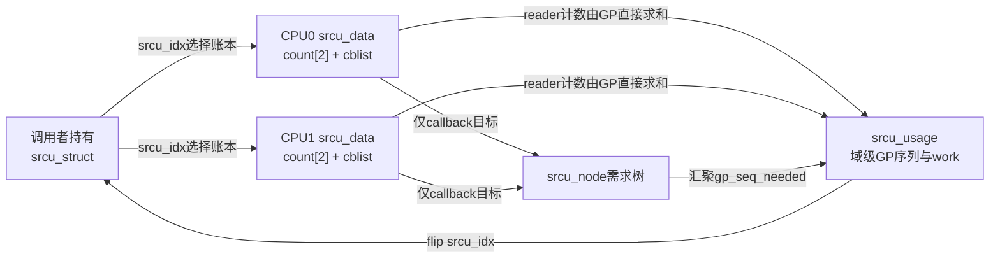
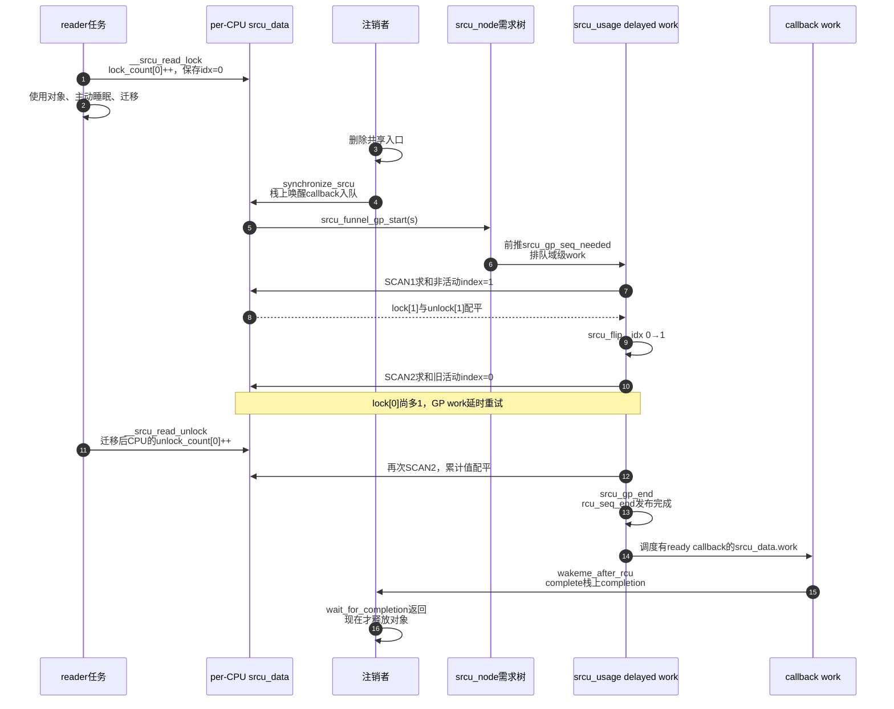

# 第11章\_Linux\_6.12\_Tree\_SRCU源码实现

## 11.1\_实现所有权与版本边界

本章是 Linux 6.12.20 Tree SRCU 核心状态机的唯一函数体讲解，负责把以下问题连成一轮可执行过程：

1. reader 进入和退出分别把债务写到哪里；
2. reader 睡眠、迁移以后，更新者怎样仍然判断旧 reader 已退出；
3. `call_srcu()` 怎样把 callback 和目标 GP 登记到当前 SRCU 私有域；
4. delayed work 怎样推进 `IDLE→SCAN1→flip→SCAN2→IDLE`；
5. GP 完成怎样使 callback 可执行，并怎样唤醒 `synchronize_srcu()`；
6. `srcu_barrier()` 为什么还要在每条 callback 队列尾部追加哨兵。

模块角色、普通 Tree RCU 与 Tree SRCU 的边界、建议阅读顺序见 [Tree SRCU 模块源码概念导读](../navigation/P09_Linux_6.12_Tree_SRCU模块源码概念导读.md#9.1_先分清Tree_RCU与Tree_SRCU)，跨版本稳定机制和应用选择见 [SRCU 私有域与双 index 状态机](../../../../knowledge/linux/synchronization_and_asynchrony/synchronization/rcu/P18_SRCU_私有域与双_index_状态机.md#18.1_问题场景_注销监听器时不能释放正在睡眠的回调对象)。对照表中的普通 Tree RCU 长期任务与普通 GP 生命周期由 [P05 GP 全局生命周期源码实现](P05_Linux_6.12_Tree_RCU_GP全局生命周期源码实现.md#5.16_端到端源码时序)唯一维护，本章不重复其函数体。

源码基线为 NXP Linux 6.12.20 固定提交 `dfaf2136deb2af2e60b994421281ba42f1c087e0`；实现选择为 `CONFIG_TREE_SRCU`。上游相对位置为 [`include/linux/srcu.h`](../../linux/include/linux/srcu.h)、[`include/linux/srcutree.h`](../../linux/include/linux/srcutree.h) 和 [`kernel/rcu/srcutree.c`](../../linux/kernel/rcu/srcutree.c)。本章中的 `/** ... */` 中文 Doxygen 和中文行内注释均由仓库补充，不是上游原注释；代码只裁剪与当前证明无关的 trace、调试、尺寸转换和自适应延时细节。

## 11.2\_源码符号覆盖账本

| 唯一展开符号 | 本章标题 | 主要状态副作用 |
| --- | --- | --- |
| `struct srcu_data/srcu_node/srcu_usage/srcu_struct`、`SRCU_STATE_*` | [11.3](#11.3_四层对象不是一棵reader证明树) | 定义私有域入口、per-CPU reader/callback 状态、callback 需求树与域级 GP 状态 |
| `__srcu_read_lock()`、`__srcu_read_unlock()` | [11.4](#11.4_reader进入退出写的是累计账本) | 选择 index，累计进入/退出，建立临界区边界 |
| `srcu_readers_lock_idx()`、`srcu_readers_unlock_idx()`、`srcu_readers_active_idx_check()` | [11.5](#11.5_GP怎样从分散累计值构造零reader证据) | 跨所有 possible CPU 求和并检查指定 index 是否曾经配平 |
| `srcu_gp_start()`、`srcu_flip()`、`srcu_advance_state()` | [11.6](#11.6_双扫描GP状态机怎样推进) | 开始 GP、排空非活动 index、翻转、排空旧活动 index |
| `srcu_gp_start_if_needed()`、`srcu_funnel_gp_start()`、`__call_srcu()` | [11.7](#11.7_callback怎样登记并提出GP需求) | callback 入队、分段加速、沿树汇聚目标、启动 GP work |
| `srcu_gp_end()`、`srcu_invoke_callbacks()`、`srcu_reschedule()`、`process_srcu()` | [11.8](#11.8_GP完成怎样交付callback并承接下一代) | 发布完成、调度对应 CPU callback work、执行 ready callback、继续或休眠 |
| `__synchronize_srcu()` | [11.9](#11.9_synchronize_srcu怎样把异步callback变成同步等待) | 栈上 completion callback 入队并阻塞当前任务 |
| `srcu_barrier_cb()`、`srcu_barrier_one_cpu()`、`srcu_barrier()` | [11.10](#11.10_srcu_barrier为什么要在每条非空队列后追加哨兵) | 给已有 callback 队列追加哨兵，等待调用前 callback 实际执行 |

以后解释这些函数体时应链接本表中的标题，不在稳定机制正文或模块导读中复制另一套实现。

本章复核每个函数的 **实现原理** 时统一追问四件事：进入前由哪把锁、哪次 index 选择或哪一代序列限定上下文；函数修改哪个具体地址；后续由哪个 reader、GP work、callback work 或等待者读取；这段顺序封住的是漏记 reader、丢失 GP 请求、跨代 callback，还是过早完成 barrier。后续各节都按这四项解释，不能用函数名直译代替状态与通信过程。

## 11.3\_四层对象不是一棵reader证明树

Tree SRCU 把 reader 累计值、callback 队列、需求汇聚和域级 GP 控制放在 per-CPU、节点、usage 与公开域四层对象中。先核对所有权，再解释 `srcu_gp_seq` 低位状态，避免把它们误画成普通 Tree RCU 的 `qsmask` 证明树。

### 11.3.1\_结构体之间的所有权

```c
/**
 * @brief 一个 SRCU 私有域在某个 CPU 上的 reader 账本和 callback 队列。
 * @note 本说明由仓库补充；字段裁剪自 include/linux/srcutree.h。
 */
struct srcu_data {
	atomic_long_t srcu_lock_count[2];   /* 本 CPU 上累计的进入次数。 */
	atomic_long_t srcu_unlock_count[2]; /* 本 CPU 上累计的退出次数。 */
	spinlock_t __private lock;
	struct rcu_segcblist srcu_cblist;   /* 本 CPU 的分段 callback 队列。 */
	unsigned long srcu_gp_seq_needed;   /* 该队列最远需要完成的普通目标。 */
	unsigned long srcu_gp_seq_needed_exp;
	struct work_struct work;            /* 执行 ready callback。 */
	struct rcu_head srcu_barrier_head;  /* barrier 专用队尾哨兵。 */
	struct srcu_node *mynode;
	unsigned long grpmask;
	int cpu;
	struct srcu_struct *ssp;
};

/**
 * @brief 大型 SRCU 域用于汇聚 callback 需求的节点。
 * @warning 它不保存 reader 的 lock/unlock 总数，也没有 Tree RCU qsmask。
 */
struct srcu_node {
	spinlock_t __private lock;
	unsigned long srcu_have_cbs[4];
	unsigned long srcu_data_have_cbs[4];
	unsigned long srcu_gp_seq_needed_exp;
	struct srcu_node *srcu_parent;
	int grplo;
	int grphi;
};

/**
 * @brief 一个 SRCU 私有域的更新侧控制状态。
 */
struct srcu_usage {
	struct srcu_node *node;
	struct srcu_node *level[RCU_NUM_LVLS + 1];
	struct mutex srcu_cb_mutex;
	spinlock_t __private lock;
	struct mutex srcu_gp_mutex;
	unsigned long srcu_gp_seq;
	unsigned long srcu_gp_seq_needed;
	unsigned long srcu_gp_seq_needed_exp;
	unsigned long srcu_barrier_seq;
	struct mutex srcu_barrier_mutex;
	struct completion srcu_barrier_completion;
	atomic_t srcu_barrier_cpu_cnt;
	struct delayed_work work;           /* 推进本域 GP。 */
	struct srcu_struct *srcu_ssp;
};

/**
 * @brief 调用者持有并传给全部 SRCU API 的私有域入口。
 */
struct srcu_struct {
	unsigned int srcu_idx;              /* 新 reader 当前选择的计数组。 */
	struct srcu_data __percpu *sda;
	struct lockdep_map dep_map;
	struct srcu_usage *srcu_sup;
};
```

这四层要回答四个不同问题：

| 地址 | 谁拥有/写入 | 后续谁读取 | 回答的问题 |
| --- | --- | --- | --- |
| `srcu_struct.srcu_idx` | 本域 GP work 翻转 | 新 reader | 新进入者记到哪一组账 |
| 每 CPU `srcu_data.*count[2]` | reader 在进入/退出时写当前 CPU | GP work 跨所有 CPU 求和 | 某 index 的累计债务是否配平 |
| `srcu_node.srcu_have_cbs[]` | callback 请求漏斗 | GP 完成和 callback 调度路径 | 哪些子树有等待某代 GP 的 callback |
| `srcu_usage.srcu_gp_seq*` | 请求路径与本域 GP work | GP work、callback、poll 和等待者 | 本域正在推进哪一代、还欠到哪一代 |



所以 `srcu_node` 不是“另一个 `rcu_node` reader 证明树”。reader 的安全证据没有逐节点清位，而是 GP work 直接读取所有 possible CPU 上同一 index 的累计值。

### 11.3.2\_域级GP的低位状态

```c
#define SRCU_STATE_IDLE  0
#define SRCU_STATE_SCAN1 1
#define SRCU_STATE_SCAN2 2
```

它们编码在 `srcu_usage.srcu_gp_seq` 的低位。这里没有普通 Tree RCU 的 `RCU_GP_WAIT_FQS`、`qsmask` 或长期 `rcu_gp_kthread()`：每个 SRCU 域用自己的 delayed work 周期性调用 `process_srcu()`。

## 11.4\_reader进入退出写的是累计账本

```c
/**
 * @brief 在当前 SRCU 域登记一个 reader，并返回本次使用的 index。
 * @return 必须原样传给同一域的 srcu_read_unlock()。
 * @note 本说明与中文注释由仓库补充；源码来自 kernel/rcu/srcutree.c。
 */
int __srcu_read_lock(struct srcu_struct *ssp)
{
	int idx;

	idx = READ_ONCE(ssp->srcu_idx) & 0x1;
	this_cpu_inc(ssp->sda->srcu_lock_count[idx].counter);
	smp_mb(); /* B：临界区访问不能泄漏到登记之前。 */
	return idx;
}

/**
 * @brief 在退出时，把同一 index 的累计退出次数记到当前 CPU。
 * @note 任务可能已经迁移，因此当前 CPU 不必是进入时的 CPU。
 */
void __srcu_read_unlock(struct srcu_struct *ssp, int idx)
{
	smp_mb(); /* C：临界区访问不能泄漏到退出登记之后。 */
	this_cpu_inc(ssp->sda->srcu_unlock_count[idx].counter);
}
```

这里使用两个单调累计量，而不是“进入加一、退出减一”的同一 per-CPU 活跃计数，原因是 reader 可以这样迁移：

```text
CPU1：lock_count[0] += 1
        ↓ 睡眠、唤醒、迁移
CPU3：unlock_count[0] += 1
```

此时 CPU1 的局部差值为 `+1`，CPU3 的局部差值为 `-1`，但全 CPU 总和仍然配平。安全判断只能使用：

```text
Σ所有CPU lock_count[idx] == Σ所有CPU unlock_count[idx]
```

`idx` 不是可选提示，而是债务身份。换域退出、拿当前 `srcu_idx` 代替原返回值，或让另一个执行上下文代为配对，都会破坏账本和 API 契约。

## 11.5\_GP怎样从分散累计值构造零reader证据

更新者按 index 汇总所有 possible CPU 的进入与退出累计值；相等只证明该次采样没有未归还 reader，还要经过内存序与双扫描状态机封住并发进入窗口。下面先看求和，再看采样成立后的边界。

### 11.5.1\_求和路径

```c
/** @brief 汇总指定 index 在所有 possible CPU 上的累计进入次数。 */
static unsigned long srcu_readers_lock_idx(struct srcu_struct *ssp, int idx)
{
	int cpu;
	unsigned long sum = 0;

	for_each_possible_cpu(cpu) {
		struct srcu_data *sdp = per_cpu_ptr(ssp->sda, cpu);

		sum += atomic_long_read(&sdp->srcu_lock_count[idx]);
	}
	return sum;
}

/** @brief 汇总指定 index 在所有 possible CPU 上的累计退出次数。 */
static unsigned long srcu_readers_unlock_idx(struct srcu_struct *ssp, int idx)
{
	int cpu;
	unsigned long sum = 0;

	for_each_possible_cpu(cpu) {
		struct srcu_data *sdp = per_cpu_ptr(ssp->sda, cpu);

		sum += atomic_long_read(&sdp->srcu_unlock_count[idx]);
	}
	return sum;
}

/**
 * @brief 检查指定 index 是否在本次检查区间内出现过零 reader 时刻。
 * @note A 与读侧 B/C 屏障共同封住临界区访问和计数观察顺序。
 */
static bool srcu_readers_active_idx_check(struct srcu_struct *ssp, int idx)
{
	unsigned long unlocks;

	unlocks = srcu_readers_unlock_idx(ssp, idx);
	smp_mb(); /* A：先看退出总数，再看进入总数。 */
	return srcu_readers_lock_idx(ssp, idx) == unlocks;
}
```

这不是把所有 per-CPU 值锁住以后取得的事务快照。判断成立的理由是：累计进入不会凭空减少，累计退出只能对应已经发生的进入；先读 unlock、经过全屏障、再读 lock，如果二者相等，就能证明在这段观察区间中存在一个该 index 无未偿债务的时刻。A/B/C 还把更新者 GP 前后的内存访问与 reader 临界区边界排序起来。

### 11.5.2\_为什么相等以后还不能立即完成整轮GP

reader 可能已经读取旧 `srcu_idx`，却在增加 `lock_count[old]` 前被抢占。一次扫描恰好相等，不足以说明这个“拿到旧票但尚未记账”的 reader 不会稍后出现。因此 SRCU 不是“一次求和相等就完成”，而是：

1. 先排空当前 **非活动** index；
2. 在屏障约束下翻转 `srcu_idx`；
3. 再排空翻转前的 **活动** index。

第一阶段封住从更早一次 flip 延迟而来的 index 使用者，第二阶段才等待本轮调用边界以前的主要 reader 集合。

## 11.6\_双扫描GP状态机怎样推进

一轮 GP 先排空当前非活动 index，再翻转新 reader 的 index，最后排空旧活动 index。`srcu_advance_state()` 用 delayed work 串联这些阶段，并在每次采样不成立时重新调度，而不是固定睡眠后猜测完成。

### 11.6.1\_开始与翻转

```c
/**
 * @brief 在持有域级 spinlock 时把空闲序列推进到 SCAN1。
 */
static void srcu_gp_start(struct srcu_struct *ssp)
{
	lockdep_assert_held(&ACCESS_PRIVATE(ssp->srcu_sup, lock));
	WARN_ON_ONCE(ULONG_CMP_GE(ssp->srcu_sup->srcu_gp_seq,
				  ssp->srcu_sup->srcu_gp_seq_needed));
	WRITE_ONCE(ssp->srcu_sup->srcu_gp_start, jiffies);
	WRITE_ONCE(ssp->srcu_sup->srcu_n_exp_nodelay, 0);
	smp_mb(); /* 先发布需要的目标，再开始物理 GP。 */
	rcu_seq_start(&ssp->srcu_sup->srcu_gp_seq);
	WARN_ON_ONCE(rcu_seq_state(ssp->srcu_sup->srcu_gp_seq) !=
		     SRCU_STATE_SCAN1);
}

/**
 * @brief 切换新 reader 使用的 index。
 * @note E/D 与 reader 的 B/C 屏障协作，避免 reader 跨越翻转边界漏记。
 */
static void srcu_flip(struct srcu_struct *ssp)
{
	smp_mb(); /* E */
	WRITE_ONCE(ssp->srcu_idx, ssp->srcu_idx + 1);
	smp_mb(); /* D */
}
```

`srcu_gp_seq_needed > srcu_gp_seq` 表示存在尚未兑现的目标；`rcu_seq_start()` 才表示一轮物理 GP 真正进入 SCAN1。`srcu_idx` 使用递增值而非只写 0/1，选择账本时才取低位；这也为批次观察保留了递增信息。

### 11.6.2\_srcu\_advance\_state串联SCAN1与SCAN2

```c
/**
 * @brief 推进一个 SRCU 私有域的双扫描 GP。
 * @pre srcu_gp_mutex 串行化同一域的扫描和 flip。
 * @note 本说明与中文注释由仓库补充；保留完整安全状态转换。
 */
static void srcu_advance_state(struct srcu_struct *ssp)
{
	int idx;

	mutex_lock(&ssp->srcu_sup->srcu_gp_mutex);

	idx = rcu_seq_state(smp_load_acquire(
					&ssp->srcu_sup->srcu_gp_seq));
	if (idx == SRCU_STATE_IDLE) {
		spin_lock_irq_rcu_node(ssp->srcu_sup);
		if (ULONG_CMP_GE(ssp->srcu_sup->srcu_gp_seq,
				 ssp->srcu_sup->srcu_gp_seq_needed)) {
			spin_unlock_irq_rcu_node(ssp->srcu_sup);
			mutex_unlock(&ssp->srcu_sup->srcu_gp_mutex);
			return; /* 没有未兑现目标。 */
		}
		idx = rcu_seq_state(READ_ONCE(ssp->srcu_sup->srcu_gp_seq));
		if (idx == SRCU_STATE_IDLE)
			srcu_gp_start(ssp);
		spin_unlock_irq_rcu_node(ssp->srcu_sup);
		if (idx != SRCU_STATE_IDLE) {
			mutex_unlock(&ssp->srcu_sup->srcu_gp_mutex);
			return; /* 另一路已经启动。 */
		}
	}

	if (rcu_seq_state(READ_ONCE(ssp->srcu_sup->srcu_gp_seq)) ==
	    SRCU_STATE_SCAN1) {
		idx = 1 ^ (ssp->srcu_idx & 1); /* 当前非活动组。 */
		if (!try_check_zero(ssp, idx, 1)) {
			mutex_unlock(&ssp->srcu_sup->srcu_gp_mutex);
			return; /* 仍有 reader，稍后由 work 重试。 */
		}
		srcu_flip(ssp);
		spin_lock_irq_rcu_node(ssp->srcu_sup);
		rcu_seq_set_state(&ssp->srcu_sup->srcu_gp_seq,
				  SRCU_STATE_SCAN2);
		ssp->srcu_sup->srcu_n_exp_nodelay = 0;
		spin_unlock_irq_rcu_node(ssp->srcu_sup);
	}

	if (rcu_seq_state(READ_ONCE(ssp->srcu_sup->srcu_gp_seq)) ==
	    SRCU_STATE_SCAN2) {
		idx = 1 ^ (ssp->srcu_idx & 1); /* flip 前的活动组。 */
		if (!try_check_zero(ssp, idx, 2)) {
			mutex_unlock(&ssp->srcu_sup->srcu_gp_mutex);
			return;
		}
		ssp->srcu_sup->srcu_n_exp_nodelay = 0;
		srcu_gp_end(ssp); /* 此函数释放 srcu_gp_mutex。 */
	}
}
```

统一状态周期如下：

| 阶段 | 写入地址 | 写入者 | 退出条件 | 下一位读取者 |
| --- | --- | --- | --- | --- |
| S0 请求 | `srcu_data/srcu_node/srcu_usage.srcu_gp_seq_needed` | `call_srcu()`/同步请求路径 | 域级目标大于已完成序列 | `process_srcu()` |
| S1 开始 | `srcu_usage.srcu_gp_seq=SCAN1` | `srcu_gp_start()` | 物理 GP 已标记进行中 | `srcu_advance_state()` |
| S2 SCAN1 | 所有 CPU 的非活动 `count[idx]` | reader 写、GP 读 | lock/unlock 总数配平 | `srcu_flip()` |
| S3 flip | `srcu_struct.srcu_idx` | GP work | 新 reader 改用另一组 | 新 reader 与 SCAN2 |
| S4 SCAN2 | 所有 CPU 的旧活动 `count[idx]` | reader 写、GP 读 | lock/unlock 总数配平 | `srcu_gp_end()` |
| S5 完成 | `srcu_usage.srcu_gp_seq`、callback 调度状态 | `srcu_gp_end()` | 完成发布且对应 callback work 已安排 | callback work/等待者/下一代请求 |

## 11.7\_callback怎样登记并提出GP需求

`call_srcu()` 先把 callback 交给调用 CPU 的分段队列，再把所需代际沿 SRCU 节点树汇聚到域级状态，必要时启动 GP work。局部 enqueue、目标绑定和全局唤醒是三个不同通信步骤。

### 11.7.1\_从公开call\_srcu进入本CPU队列

```c
/**
 * @brief 设置 callback 函数并把 callback 交给本域请求路径。
 */
static void __call_srcu(struct srcu_struct *ssp, struct rcu_head *rhp,
			rcu_callback_t func, bool do_norm)
{
	if (debug_rcu_head_queue(rhp)) {
		WRITE_ONCE(rhp->func, srcu_leak_callback);
		WARN_ONCE(1, "call_srcu(): Leaked duplicate callback\n");
		return;
	}
	rhp->func = func;
	(void)srcu_gp_start_if_needed(ssp, rhp, do_norm);
}
```

`do_norm=true` 表示普通请求，`false` 表示 expedited 请求。两者等待的是相同的旧 reader 安全条件，区别主要在重试延时和 expedited 目标传播，不是另一套 reader 证明。

### 11.7.2\_srcu\_gp\_start\_if\_needed完成四件事

该函数的完整实现较长，但不能压缩成“启动 GP”。它按固定顺序完成：

```c
/**
 * @brief 入队 callback、绑定目标代际并在必要时向上提交 GP 请求。
 * @return 本次请求必须等到的 rcu_seq 快照。
 * @note 省略初始化和尺寸转换分支；安全相关顺序保持不变。
 */
static unsigned long srcu_gp_start_if_needed(struct srcu_struct *ssp,
					     struct rcu_head *rhp,
					     bool do_norm)
{
	unsigned long flags;
	int idx;
	bool needexp = false;
	bool needgp = false;
	unsigned long s;
	struct srcu_data *sdp;
	struct srcu_node *sdp_mynode;
	int ss_state;

	check_init_srcu_struct(ssp);

	/* 防止取序列快照期间本域代际环绕。 */
	idx = __srcu_read_lock_nmisafe(ssp);
	ss_state = smp_load_acquire(&ssp->srcu_sup->srcu_size_state);
	if (ss_state < SRCU_SIZE_WAIT_CALL)
		sdp = per_cpu_ptr(ssp->sda, get_boot_cpu_id());
	else
		sdp = raw_cpu_ptr(ssp->sda);
	spin_lock_irqsave_sdp_contention(sdp, &flags);
	if (rhp)
		rcu_segcblist_enqueue(&sdp->srcu_cblist, rhp);

	/* 必须先 snap，再 advance，避免 callback 被加速到过远目标而卡住。 */
	s = rcu_seq_snap(&ssp->srcu_sup->srcu_gp_seq);
	if (rhp) {
		rcu_segcblist_advance(&sdp->srcu_cblist,
			rcu_seq_current(&ssp->srcu_sup->srcu_gp_seq));
		WARN_ON_ONCE(!rcu_segcblist_accelerate(&sdp->srcu_cblist, s));
	}
	if (ULONG_CMP_LT(sdp->srcu_gp_seq_needed, s)) {
		sdp->srcu_gp_seq_needed = s;
		needgp = true;
	}
	if (!do_norm && ULONG_CMP_LT(sdp->srcu_gp_seq_needed_exp, s)) {
		sdp->srcu_gp_seq_needed_exp = s;
		needexp = true;
	}
	spin_unlock_irqrestore_rcu_node(sdp, flags);

	if (ss_state < SRCU_SIZE_WAIT_BARRIER)
		sdp_mynode = NULL;
	else
		sdp_mynode = sdp->mynode;

	if (needgp)
		srcu_funnel_gp_start(ssp, sdp, s, do_norm);
	else if (needexp)
		srcu_funnel_exp_start(ssp, sdp_mynode, s);
	__srcu_read_unlock_nmisafe(ssp, idx);
	return s;
}
```

小域到大域的过渡完成以前，callback 暂放 boot CPU 的 `srcu_data`，并只在树可用以后使用 `sdp->mynode`。这条尺寸转换分支影响队列位置，却不改变 reader 证明。

四个动作不可乱序：

1. `enqueue` 把 callback 所有权交给 `srcu_cblist`；
2. `rcu_seq_snap()` 取得该 callback 的目标代际；
3. `advance/accelerate` 把 callback 移入匹配目标的分段；
4. 只有本地目标被前推时，才沿 `srcu_node` 漏斗向域级提交。

特别是 `snap` 必须早于 `advance`。若先尝试推进 callback，期间旧 GP 结束且新 GP 开始，随后取得的目标可能过远，刚入队 callback 又无法越过前面已有分段，最终形成永远留在 `RCU_NEXT_TAIL` 的“acceleration leak”。

### 11.7.3\_需求树怎样到达域级控制状态

```c
/**
 * @brief 把一个 srcu_data 的目标沿 callback 需求树漏斗到域级状态。
 * @note 已覆盖相同目标的请求可提前返回，由先到达者继续向上提交。
 */
static void srcu_funnel_gp_start(struct srcu_struct *ssp,
				 struct srcu_data *sdp,
				 unsigned long s, bool do_norm)
{
	unsigned long flags;
	int idx = rcu_seq_ctr(s) % ARRAY_SIZE(sdp->mynode->srcu_have_cbs);
	unsigned long sgsne;
	struct srcu_node *snp;
	struct srcu_node *snp_leaf;
	unsigned long snp_seq;
	struct srcu_usage *sup = ssp->srcu_sup;

	if (smp_load_acquire(&sup->srcu_size_state) < SRCU_SIZE_WAIT_BARRIER)
		snp_leaf = NULL;
	else
		snp_leaf = sdp->mynode;

	if (snp_leaf)
		for (snp = snp_leaf; snp != NULL; snp = snp->srcu_parent) {
			if (WARN_ON_ONCE(rcu_seq_done(&sup->srcu_gp_seq, s)) &&
			    snp != snp_leaf)
				return;
			spin_lock_irqsave_rcu_node(snp, flags);
			snp_seq = snp->srcu_have_cbs[idx];
			if (!srcu_invl_snp_seq(snp_seq) &&
			    ULONG_CMP_GE(snp_seq, s)) {
				if (snp == snp_leaf && snp_seq == s)
					snp->srcu_data_have_cbs[idx] |= sdp->grpmask;
				spin_unlock_irqrestore_rcu_node(snp, flags);
				if (snp == snp_leaf && snp_seq != s) {
					srcu_schedule_cbs_sdp(sdp,
							      do_norm ? SRCU_INTERVAL : 0);
					return;
				}
				if (!do_norm)
					srcu_funnel_exp_start(ssp, snp, s);
				return;
			}
			snp->srcu_have_cbs[idx] = s;
			if (snp == snp_leaf)
				snp->srcu_data_have_cbs[idx] |= sdp->grpmask;
			sgsne = snp->srcu_gp_seq_needed_exp;
			if (!do_norm &&
			    (srcu_invl_snp_seq(sgsne) || ULONG_CMP_LT(sgsne, s)))
				WRITE_ONCE(snp->srcu_gp_seq_needed_exp, s);
			spin_unlock_irqrestore_rcu_node(snp, flags);
		}

	spin_lock_irqsave_ssp_contention(ssp, &flags);
	if (ULONG_CMP_LT(sup->srcu_gp_seq_needed, s))
		smp_store_release(&sup->srcu_gp_seq_needed, s);
	if (!do_norm && ULONG_CMP_LT(sup->srcu_gp_seq_needed_exp, s))
		WRITE_ONCE(sup->srcu_gp_seq_needed_exp, s);

	if (!WARN_ON_ONCE(rcu_seq_done(&sup->srcu_gp_seq, s)) &&
	    rcu_seq_state(sup->srcu_gp_seq) == SRCU_STATE_IDLE) {
		srcu_gp_start(ssp);
		if (likely(srcu_init_done))
			queue_delayed_work(rcu_gp_wq, &sup->work,
					   !!srcu_get_delay(ssp));
		else if (list_empty(&sup->work.work.entry))
			list_add(&sup->work.work.entry, &srcu_boot_list);
	}
	spin_unlock_irqrestore_rcu_node(sup, flags);
}
```

这个循环从 `sdp->mynode` 向父节点逐层更新对应槽位的 `srcu_have_cbs[idx]`；在叶节点还把 `sdp->grpmask` 写入 `srcu_data_have_cbs[idx]`。若某层已经记录不早于 `s` 的目标，请求者停止向上争锁，由先到达者负责继续传播；若本地 callback 对应的 GP 已完成，则直接调度本 CPU callback work，不再制造多余 GP。

这条通信链是：

```text
call_srcu调用者
  → 当前CPU srcu_data.cblist / gp_seq_needed
  → srcu_node叶到根的需求槽位
  → srcu_usage.srcu_gp_seq_needed
  → srcu_usage.work
```

树只减少“许多 CPU 同时请求 GP”时对域级锁的竞争；GP 判断 reader 是否退出时仍直接扫描 per-CPU 计数。

## 11.8\_GP完成怎样交付callback并承接下一代

域级 GP 完成只发布代际并选择有工作的 CPU；每 CPU work 才推进并执行 ready callback，域级 work 随后根据剩余需求继续下一轮或休眠。三类执行上下文通过状态和 workqueue 交接，不能把 cleanup 当作 callback 已执行。

### 11.8.1\_srcu\_gp\_end先发布完成再选择有callback的CPU

`srcu_gp_end()` 在 SCAN2 已配平后执行，关键顺序是：

```c
/**
 * @brief 结束当前 SRCU GP，发布完成并调度有合格 callback 的 CPU。
 * @pre 当前状态为 SCAN2，且调用者持有 srcu_gp_mutex。
 * @note 展示完成发布与 callback 选择主干；尺寸转换和计数防环绕省略。
 */
static void srcu_gp_end(struct srcu_struct *ssp)
{
	unsigned long cbdelay = 1;
	bool cbs;
	bool last_lvl;
	unsigned long gpseq;
	int idx;
	unsigned long mask;
	unsigned long sgsne;
	struct srcu_node *snp;
	int ss_state;
	struct srcu_usage *sup = ssp->srcu_sup;

	mutex_lock(&sup->srcu_cb_mutex);
	spin_lock_irq_rcu_node(sup);
	idx = rcu_seq_state(sup->srcu_gp_seq);
	WARN_ON_ONCE(idx != SRCU_STATE_SCAN2);
	if (ULONG_CMP_LT(READ_ONCE(sup->srcu_gp_seq),
			 READ_ONCE(sup->srcu_gp_seq_needed_exp)))
		cbdelay = 0;
	rcu_seq_end(&sup->srcu_gp_seq);
	gpseq = rcu_seq_current(&sup->srcu_gp_seq);
	if (ULONG_CMP_LT(sup->srcu_gp_seq_needed_exp, gpseq))
		WRITE_ONCE(sup->srcu_gp_seq_needed_exp, gpseq);
	spin_unlock_irq_rcu_node(sup);
	mutex_unlock(&sup->srcu_gp_mutex);

	ss_state = smp_load_acquire(&sup->srcu_size_state);
	if (ss_state < SRCU_SIZE_WAIT_BARRIER) {
		srcu_schedule_cbs_sdp(per_cpu_ptr(ssp->sda, get_boot_cpu_id()),
				      cbdelay);
	} else {
		idx = rcu_seq_ctr(gpseq) % ARRAY_SIZE(snp->srcu_have_cbs);
		srcu_for_each_node_breadth_first(ssp, snp) {
			spin_lock_irq_rcu_node(snp);
			cbs = false;
			last_lvl = snp >= sup->level[rcu_num_lvls - 1];
			if (last_lvl)
				cbs = ss_state < SRCU_SIZE_BIG ||
				       snp->srcu_have_cbs[idx] == gpseq;
			snp->srcu_have_cbs[idx] = gpseq;
			rcu_seq_set_state(&snp->srcu_have_cbs[idx], 1);
			sgsne = snp->srcu_gp_seq_needed_exp;
			if (srcu_invl_snp_seq(sgsne) ||
			    ULONG_CMP_LT(sgsne, gpseq))
				WRITE_ONCE(snp->srcu_gp_seq_needed_exp, gpseq);
			mask = ss_state < SRCU_SIZE_BIG ?
			       ~0 : snp->srcu_data_have_cbs[idx];
			snp->srcu_data_have_cbs[idx] = 0;
			spin_unlock_irq_rcu_node(snp);
			if (cbs)
				srcu_schedule_cbs_snp(ssp, snp, mask, cbdelay);
		}
	}

	mutex_unlock(&sup->srcu_cb_mutex);

	spin_lock_irq_rcu_node(sup);
	gpseq = rcu_seq_current(&sup->srcu_gp_seq);
	if (!rcu_seq_state(gpseq) &&
	    ULONG_CMP_LT(gpseq, sup->srcu_gp_seq_needed)) {
		srcu_gp_start(ssp);
		spin_unlock_irq_rcu_node(sup);
		srcu_reschedule(ssp, 0);
	} else {
		spin_unlock_irq_rcu_node(sup);
	}
}
```

真实源码还在调度 callback 与检查下一代之间做低频计数防环绕，并在末尾推进小域到大域的尺寸状态；它们不改变上面展示的完成发布、按需求槽选择 callback CPU、再承接下一代的顺序。

`srcu_cb_mutex` 不是 reader 安全锁。它限制 callback 调度准备期间最多再启动一轮 GP，使四槽 `srcu_have_cbs[]` 能安全复用。真正的 GP 完成发布是 `rcu_seq_end(&sup->srcu_gp_seq)`。

### 11.8.2\_每CPUwork怎样执行ready\_callback

```c
/**
 * @brief 从一个 srcu_data 提取已经越过目标 GP 的 callback 并执行。
 */
static void srcu_invoke_callbacks(struct work_struct *work)
{
	long len;
	bool more;
	struct rcu_cblist ready_cbs;
	struct rcu_head *rhp;
	struct srcu_data *sdp = container_of(work, struct srcu_data, work);
	struct srcu_struct *ssp = sdp->ssp;

	rcu_cblist_init(&ready_cbs);
	spin_lock_irq_rcu_node(sdp);
	rcu_segcblist_advance(&sdp->srcu_cblist,
			      rcu_seq_current(&ssp->srcu_sup->srcu_gp_seq));
	if (sdp->srcu_cblist_invoking ||
	    !rcu_segcblist_ready_cbs(&sdp->srcu_cblist)) {
		spin_unlock_irq_rcu_node(sdp);
		return;
	}
	sdp->srcu_cblist_invoking = true;
	rcu_segcblist_extract_done_cbs(&sdp->srcu_cblist, &ready_cbs);
	len = ready_cbs.len;
	spin_unlock_irq_rcu_node(sdp);

	while ((rhp = rcu_cblist_dequeue(&ready_cbs)) != NULL) {
		local_bh_disable();
		rhp->func(rhp);
		local_bh_enable();
	}

	spin_lock_irq_rcu_node(sdp);
	rcu_segcblist_add_len(&sdp->srcu_cblist, -len);
	sdp->srcu_cblist_invoking = false;
	more = rcu_segcblist_ready_cbs(&sdp->srcu_cblist);
	spin_unlock_irq_rcu_node(sdp);
	if (more)
		srcu_schedule_cbs_sdp(sdp, 0);
}
```

“GP 已完成”和“callback 已执行”在两个不同时间点：`rcu_seq_end()` 先发布安全代际，per-CPU callback work 以后才提取 DONE 段并调用函数。这个间隙正是 `synchronize_srcu()` 与 `srcu_barrier()` 语义不同的原因。

### 11.8.3\_域级work怎样重试或休眠

```c
/** @brief delayed work 的入口：推进一次状态，再决定何时重试。 */
static void process_srcu(struct work_struct *work)
{
	unsigned long curdelay;
	unsigned long j;
	struct srcu_struct *ssp;
	struct srcu_usage *sup;

	sup = container_of(work, struct srcu_usage, work.work);
	ssp = sup->srcu_ssp;
	srcu_advance_state(ssp);
	curdelay = srcu_get_delay(ssp);
	if (curdelay) {
		WRITE_ONCE(sup->reschedule_count, 0);
	} else {
		j = jiffies;
		if (READ_ONCE(sup->reschedule_jiffies) == j) {
			WRITE_ONCE(sup->reschedule_count,
				   READ_ONCE(sup->reschedule_count) + 1);
			if (READ_ONCE(sup->reschedule_count) > srcu_max_nodelay)
				curdelay = 1;
		} else {
			WRITE_ONCE(sup->reschedule_count, 1);
			WRITE_ONCE(sup->reschedule_jiffies, j);
		}
	}
	srcu_reschedule(ssp, curdelay);
}
```

`srcu_get_delay()` 让 expedited 请求可以在短时间内零延时重试，也让遇到慢 reader 的普通路径逐渐增加间隔。即便持续取得零延时，`reschedule_count` 也会在同一 jiffy 超过 `srcu_max_nodelay` 后强制至少等待一个 jiffy，避免一个 SRCU 域在 workqueue 上无限忙循环。

```c
/**
 * @brief 根据域级目标决定停止、开始下一轮，或再次调度 GP work。
 */
static void srcu_reschedule(struct srcu_struct *ssp, unsigned long delay)
{
	bool pushgp = true;

	spin_lock_irq_rcu_node(ssp->srcu_sup);
	if (ULONG_CMP_GE(ssp->srcu_sup->srcu_gp_seq,
			 ssp->srcu_sup->srcu_gp_seq_needed)) {
		if (!WARN_ON_ONCE(rcu_seq_state(ssp->srcu_sup->srcu_gp_seq)))
			pushgp = false; /* 目标已兑现且状态为空闲。 */
	} else if (!rcu_seq_state(ssp->srcu_sup->srcu_gp_seq)) {
		srcu_gp_start(ssp); /* 仍有目标，开始下一轮。 */
	}
	spin_unlock_irq_rcu_node(ssp->srcu_sup);

	if (pushgp)
		queue_delayed_work(rcu_gp_wq, &ssp->srcu_sup->work, delay);
}
```

因此 SRCU 没有一个系统全局的 `gp_thread` 替每个域扫描，它使用全局 RCU workqueue 上的 **每域 delayed work**。目标已兑现且状态为空闲时，`pushgp=false` 让这条域级推进链自然休眠；下一个请求再负责重新排队。

## 11.9\_synchronize\_srcu怎样把异步callback变成同步等待

```c
/**
 * @brief 用一个栈上 completion callback 等待指定 SRCU 域的 GP。
 * @pre 可睡眠上下文，且不能位于会被本次等待覆盖的 RCU/SRCU 读侧。
 */
static void __synchronize_srcu(struct srcu_struct *ssp, bool do_norm)
{
	struct rcu_synchronize rcu;

	srcu_lock_sync(&ssp->dep_map);
	RCU_LOCKDEP_WARN(lockdep_is_held(ssp) ||
			 lock_is_held(&rcu_bh_lock_map) ||
			 lock_is_held(&rcu_lock_map) ||
			 lock_is_held(&rcu_sched_lock_map),
			 "Illegal synchronize_srcu() in read-side critical section");

	if (rcu_scheduler_active == RCU_SCHEDULER_INACTIVE)
		return;
	might_sleep();
	check_init_srcu_struct(ssp);
	init_completion(&rcu.completion);
	init_rcu_head_on_stack(&rcu.head);
	__call_srcu(ssp, &rcu.head, wakeme_after_rcu, do_norm);
	wait_for_completion(&rcu.completion);
	destroy_rcu_head_on_stack(&rcu.head);
	smp_mb(); /* 调用返回后的访问必须位于 GP 完成之后。 */
}
```

同步等待没有创建另一种 GP。它把 `wakeme_after_rcu` 当作普通 SRCU callback 登记：

```text
当前任务的栈上 rcu_synchronize
  → head进入本域srcu_cblist
  → 双扫描GP完成
  → srcu_invoke_callbacks调用wakeme_after_rcu
  → completion完成
  → wait_for_completion返回
```

所以在同一 `ssp` 的读侧调用 `synchronize_srcu(ssp)` 会等待自己归还的债务，构成自锁。`synchronize_rcu()` 也不能替代它，因为普通 Tree RCU 根本不读取该 `ssp->sda` 的计数。

## 11.10\_srcu\_barrier为什么要在每条非空队列后追加哨兵

`srcu_barrier()` 等的是调用前 callback 的实际执行，不是再完成一轮 SRCU GP。它对每条非空 per-CPU 队列追加哨兵，再用共享计数等待所有哨兵被各自 callback work 调用。

### 11.10.1\_哨兵证明的是callback执行顺序

```c
/** @brief 一个 CPU 的 barrier 哨兵执行后，归还全局等待计数。 */
static void srcu_barrier_cb(struct rcu_head *rhp)
{
	struct srcu_data *sdp;
	struct srcu_struct *ssp;

	rhp->next = rhp; /* 标记哨兵已经执行。 */
	sdp = container_of(rhp, struct srcu_data, srcu_barrier_head);
	ssp = sdp->ssp;
	if (atomic_dec_and_test(&ssp->srcu_sup->srcu_barrier_cpu_cnt))
		complete(&ssp->srcu_sup->srcu_barrier_completion);
}

/** @brief 仅在这个 srcu_data 已有 callback 时，把哨兵追加到队尾。 */
static void srcu_barrier_one_cpu(struct srcu_struct *ssp,
				 struct srcu_data *sdp)
{
	spin_lock_irq_rcu_node(sdp);
	atomic_inc(&ssp->srcu_sup->srcu_barrier_cpu_cnt);
	sdp->srcu_barrier_head.func = srcu_barrier_cb;
	if (!rcu_segcblist_entrain(&sdp->srcu_cblist,
				   &sdp->srcu_barrier_head))
		atomic_dec(&ssp->srcu_sup->srcu_barrier_cpu_cnt);
	spin_unlock_irq_rcu_node(sdp);
}
```

`rcu_segcblist_entrain()` 把哨兵放在队列中全部已有 callback 之后；空队列无需等待，因此入队失败时撤销计数。哨兵能执行，就证明该队列上调用 `srcu_barrier()` 前已经排队的 callback 都已经执行，而不只是它们对应的 GP 已结束。

### 11.10.2\_完整barrier控制流程

```c
/**
 * @brief 等待指定 SRCU 私有域中调用前已经排队的 callback 实际执行。
 */
void srcu_barrier(struct srcu_struct *ssp)
{
	int cpu;
	int idx;
	unsigned long s = rcu_seq_snap(&ssp->srcu_sup->srcu_barrier_seq);

	check_init_srcu_struct(ssp);
	mutex_lock(&ssp->srcu_sup->srcu_barrier_mutex);
	if (rcu_seq_done(&ssp->srcu_sup->srcu_barrier_seq, s)) {
		smp_mb();
		mutex_unlock(&ssp->srcu_sup->srcu_barrier_mutex);
		return; /* 更早进入的 barrier 已代为完成。 */
	}
	rcu_seq_start(&ssp->srcu_sup->srcu_barrier_seq);
	init_completion(&ssp->srcu_sup->srcu_barrier_completion);

	/* 初始 1 防止扫描尚未结束时某个哨兵先把计数减到零。 */
	atomic_set(&ssp->srcu_sup->srcu_barrier_cpu_cnt, 1);
	idx = __srcu_read_lock_nmisafe(ssp);
	if (smp_load_acquire(&ssp->srcu_sup->srcu_size_state) <
	    SRCU_SIZE_WAIT_BARRIER)
		srcu_barrier_one_cpu(ssp,
			per_cpu_ptr(ssp->sda, get_boot_cpu_id()));
	else
		for_each_possible_cpu(cpu)
			srcu_barrier_one_cpu(ssp, per_cpu_ptr(ssp->sda, cpu));
	__srcu_read_unlock_nmisafe(ssp, idx);

	if (atomic_dec_and_test(&ssp->srcu_sup->srcu_barrier_cpu_cnt))
		complete(&ssp->srcu_sup->srcu_barrier_completion);
	wait_for_completion(&ssp->srcu_sup->srcu_barrier_completion);
	rcu_seq_end(&ssp->srcu_sup->srcu_barrier_seq);
	mutex_unlock(&ssp->srcu_sup->srcu_barrier_mutex);
}
```

这里临时进入 NMI-safe SRCU 读侧，是为了让 SRCU 域的小域到大域转换和 callback 队列位置在扫描期间保持可用；它不是 barrier 要等待的业务 reader。`barrier_mutex + barrier_seq` 让并发 barrier 形成 leader/follower：较晚调用者发现快照已由前一位完成时，可以复用完成结论。

## 11.11\_一轮注销操作的端到端源码时序



这条时序同时显示了三种通信：

- reader 只写当前 CPU 的累计账本，GP work 主动扫描；
- callback 请求经 `srcu_node` 漏斗写到域级目标；
- 同步等待者通过普通 callback 和 completion 获知结果。

不存在“GP thread 直接通知每个 reader”的路径，也不存在普通 Tree RCU 的 CPU QS 上报树。

## 11.12\_实现不变量与常见误读

把 reader 计数、GP work 和 callback work 串起来以后，最终需要核对每层所有权、代际单调性和完成条件。下面先列必须同时成立的不变量，再与普通 Tree RCU 逐项对照，防止按相似函数名套模型。

### 11.12.1\_必须同时成立的实现不变量

1. 每次 unlock 必须归还同一 `ssp`、同一 lock 返回的 `idx`；全 CPU 总数相等才有意义。
2. `SCAN1` 检查 flip 前的非活动组，`SCAN2` 检查 flip 前的活动组；两次都不能省略。
3. `srcu_gp_mutex` 串行化本域扫描和 flip，`srcu_usage.lock` 保护域级目标/序列决策，两者职责不同。
4. `srcu_node` 只汇聚 callback GP 需求和归属，不能用它判断 reader 已退出。
5. `rcu_seq_end()` 只发布 GP 完成；callback 还要等 `srcu_invoke_callbacks()` 真正执行。
6. `synchronize_srcu()` 等调用边界前的 reader，`srcu_barrier()` 等调用边界前已排队 callback；销毁含异步 callback 的域时不能互换。

### 11.12.2\_与普通Tree\_RCU逐项对照

| 问题 | 普通 Tree RCU | Tree SRCU |
| --- | --- | --- |
| 域身份 | 系统普通 RCU 域 | 调用者传入的每个 `srcu_struct` 私有域 |
| reader 高频状态 | 普通路径主要依赖执行约束，抢占等分支另记任务债务 | 每次进入/退出都写域内 per-CPU 累计量 |
| reader 主动睡眠 | 禁止 | 允许 |
| 安全证据 | CPU QS/EQS 和必要的 blocked-task 债务 | 两次扫描中指定 index 的全 CPU累计进入/退出配平 |
| 需求汇聚树 | `rcu_node.gp_seq_needed` 与 `qsmask` 同处节点但职责分开 | `srcu_node` 汇聚 callback 目标，不保存 reader 证明 |
| GP 执行者 | 全局长期 `rcu_gp_kthread()` | 每个域的 `srcu_usage.work` 在 RCU workqueue 上运行 |
| 同步等待 | 普通 Tree RCU callback/SRS 等交付 | 栈上 SRCU callback + completion |
| callback barrier | `rcu_barrier()` | 仅扫描指定域队列的 `srcu_barrier(ssp)` |

源码阅读到这里，才能把“可睡眠 RCU”展开为可检查的实现结论：它不是给普通 Tree RCU reader 放宽一个调度限制，而是换成了私有域、读侧显式记账、双 index 扫描和每域 GP work 的另一套证明系统。

模块概念入口：[Tree SRCU 模块源码概念导读](../navigation/P09_Linux_6.12_Tree_SRCU模块源码概念导读.md#9.3_源码文件和对象层次)。

总阅读索引：[Linux 6.12 RCU 源码总阅读索引](../navigation/P01_Linux_6.12_RCU源码总阅读索引.md#1.6_建议的源码阅读顺序)。
