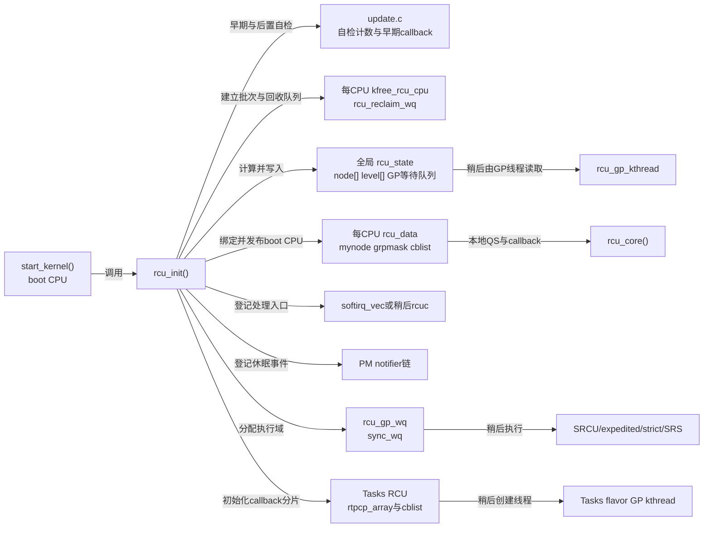
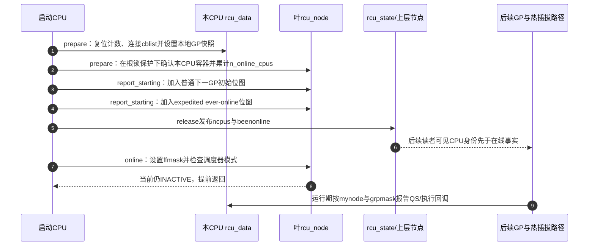
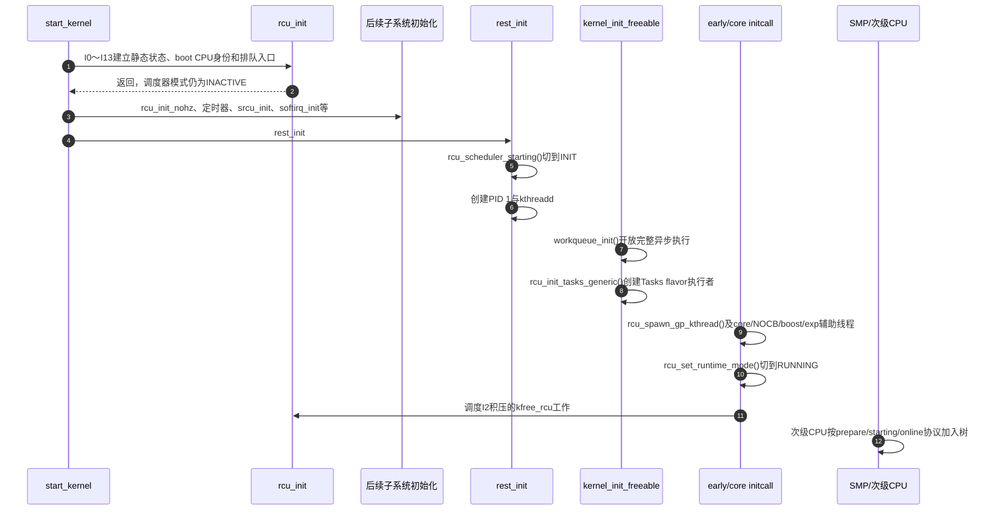

# 第12章\_Linux\_6.12\_Tree\_RCU\_rcu\_init启动初始化源码实现

## 12.1\_从start\_kernel里的一个调用固定本章任务

读-复制-更新（Read-Copy Update，RCU）是一类把读侧临时访问与更新后的延迟回收分开的同步机制。Tree RCU 是 Linux 普通 RCU 的一种实现家族专名；`Tree` 不是缩写，它表示该实现用分层 `rcu_node` 树汇聚许多中央处理器（Central Processing Unit，CPU）的完成证据。`rcu_init` 则是内核源码函数标识符，不存在需要展开的英文全称；本章讨论的是它在启动阶段怎样把静态初值变成可供后续 RCU 路径使用的基础设施。

下面的启动片段还会先用到四个简称：NOCB 是 no-callbacks 回调卸载策略；代码注释里的 GP/CB 分别是宽限期（grace period）与回调（callback）；HPC 是高性能计算（high-performance computing）。`CONFIG_RCU_NOCB_CPU` 是编译期启用 NOCB 基础设施的 Kconfig 布尔配置；`rcu_nocbs=` 与 `nohz_full=` 都是内核启动参数，前者直接选择回调卸载 CPU，后者选择 full-dynticks CPU 并把这些 CPU 纳入回调卸载集合；代码注释中的 `NO_HZ_FULL` 指的正是这种 full-dynticks 模式。

读者实际遇到它的位置不是 `kernel/rcu/` 目录的孤立函数，而是 [`init/main.c`](../../linux/init/main.c) 中的：

```c
workqueue_init_early();     /* 先建立工作队列的早期基础设施和系统工作队列；此时 worker 线程尚未开始执行工作。 */

rcu_init();                 /* 初始化普通 Tree RCU：建立分层树、启动 CPU 状态、回调承载物和后续异步处理入口。 */

trace_init();               /* 初始化内核跟踪事件基础设施；从这里之后，常规 trace event 才可使用。 */
context_tracking_init();    /* 初始化用户态、空闲态与内核态的上下文跟踪，为 RCU 识别扩展静止状态提供依据。 */
early_irq_init();           /* 初始化通用中断描述符以及中断子系统的早期管理结构。 */
init_IRQ();                 /* 执行体系结构相关的中断初始化，接通中断控制器与架构中断入口。 */
tick_init();                /* 初始化时钟滴答广播框架；具体时钟事件设备会在后续路径中注册。 */

/*
 * 初始化 Tree RCU 的 NOCB callback-offload 拓扑：
 * 识别需要避免本地执行 RCU 回调的 CPU（如 rcu_nocbs/nohz_full CPU），
 * 将其 per-CPU callback list 切换为 offloaded 模式，并建立 NOCB
 * GP/CB kthread 分组。
 *
 * 注意：NOCB 不改变 Tree RCU 的宽限期检测算法，
 * 只改变这些 CPU 的 RCU callback 推进/执行上下文，
 * 主要用于 NO_HZ_FULL、CPU isolation、HPC 和实时低抖动场景；
 * CONFIG_RCU_NOCB_CPU 未启用或最终 offload mask 为空时，不建立上述布局。
 */
rcu_init_nohz();

init_timers();              /* 初始化普通内核定时器的每 CPU 基座，并登记定时器软件中断处理函数。 */
srcu_init();                /* 完成可睡眠 RCU 的全局启动，使早期积压请求可转入正常延迟工作路径。 */
hrtimers_init();            /* 初始化高精度定时器的每 CPU 基座，并登记高精度定时器软件中断处理函数。 */
softirq_init();             /* 初始化 tasklet 队列并登记 tasklet 软件中断；RCU 软件中断入口已由 rcu_init() 登记。 */
```

只看这一个调用仍无法回答：

1. 链接到 `rcu_init()` 的究竟是 Tree RCU 还是 Tiny RCU，是否存在运行时类型分派；
2. 为什么函数能在中断、完整 workqueue、普通 GP 内核线程和第二颗 CPU 都未就绪时运行；
3. 它除了建 `rcu_node` 树，还初始化了哪些测试、延迟释放、softirq、休眠通知、每 CPU 状态、workqueue、回调过载阈值和 Tasks RCU 队列；
4. 哪些名字带有“init”，却明确不属于这个函数；
5. 任意一行被提前、删除或改成“失败后继续”会破坏哪条后续不变量。

本章在 Linux 6.12.20 固定源码上逐项回答这些问题。读完以后，读者应能从 `start_kernel()` 手工展开 `rcu_init()`，对每个直接动作说出 **写入地址、写入者、后续读取者、配置退化和启动时序约束**，并能判断一个初始化修改需要同步检查哪些后续消费者。

## 12.2\_术语入口与源码身份

本章会反复使用以下名称。它们属于不同类型，不能都当成“RCU 类型”：

`CONFIG_PREEMPT_RT` 是 Kconfig 配置符号；它表示目标内核是否启用实时抢占模型，并在本章相关分支中影响 RCU core 由 softirq 还是 `rcuc` 线程承载。这里只追踪该配置对 `rcu_init()` 事务的影响，不把实时抢占子系统本身并入本章。

| 名称 | 类型与朴素含义 | 当前职责 | 不能误解成 |
| --- | --- | --- | --- |
| 宽限期（Grace Period，GP） | 逻辑等待边界 | 证明边界以前的旧读侧访问已经结束 | <span style="color:gray;">~~固定时长、线程或 workqueue~~</span> |
| 静止状态（Quiescent State，QS） | CPU 或任务越过旧访问边界的证据 | 后续由每 CPU状态向节点树汇聚 | <span style="color:gray;">~~“CPU 没有任务”或休眠时间~~</span> |
| callback | GP 完成后才获得执行资格的延迟函数 | 承接对象释放、唤醒或其他延迟动作 | <span style="color:gray;">~~GP 本身~~</span> |
| boot CPU | 启动时唯一 online 的 CPU | 执行 `start_kernel()` 和本章全部初始化写入 | <span style="color:gray;">~~永远固定为逻辑 CPU0 的 API 契约~~</span> |
| per-CPU | 每个 possible CPU 都有独立槽位的存储模型 | 保存 `rcu_data`、`kfree_rcu` 批次等本地状态 | <span style="color:gray;">~~只有 online CPU 才分配~~</span> |
| `rcu_state` | Tree RCU 的唯一全局状态载体 | 保存 GP 代际、节点数组、等待队列和执行者入口 | <span style="color:gray;">~~“整个 RCU 只有一个状态机”~~</span> |
| `rcu_data` | 每 CPU Tree RCU 状态载体 | 保存叶节点地址、本地 QS、callback 与热插拔快照 | <span style="color:gray;">~~`rcu_node` 的动态副本~~</span> |
| `rcu_node` | 分层汇聚节点结构体 | 保存一组 CPU/子节点的证明债务、锁和慢路径状态 | <span style="color:gray;">~~调度域或非一致内存访问拓扑~~</span> |
| Kconfig | Linux 构建期配置系统专名 | 决定编译哪个实现文件和哪些条件分支 | <span style="color:gray;">~~启动后可任意切换的运行时参数~~</span> |
| `defconfig` / `.config` | 配置种子 / Kconfig 求解后的完整结果 | 前者只记录需要显式给出的输入，后者才记录本次构建最终启用的配置 | <span style="color:gray;">~~`defconfig` 没写就等于功能关闭~~</span> |
| softirq | 软件中断执行机制专名 | 在普通配置中承载 `rcu_core()` 本地推进 | <span style="color:gray;">~~一个长期内核任务~~</span> |
| workqueue | Linux 异步工作执行框架专名 | 承载延迟释放、SRCU、轮询 GP 和同步请求清理 | <span style="color:gray;">~~`rcu_init()` 当场执行工作项~~</span> |
| NOCB | “no callbacks” 回调卸载策略的历史简称 | 把指定 CPU 的 callback 推进/执行交给卸载线程 | <span style="color:gray;">~~新的保护域或第二棵普通 GP 树~~</span> |
| Tasks RCU | 以任务轨迹为证明对象的独立保护域家族 | 本函数末尾只建立其 callback 运输账本 | <span style="color:gray;">~~Tree RCU 的抢占配置~~</span> |

为避免源码标识符先于解释出现，下面先建立本章会直接追踪的符号类型账本；表中“宏、函数、字段、类型、变量、配置符号”是 C 源码角色，不是新的 RCU flavor：

| 符号 | 源码类型 | 本章所需朴素含义 |
| --- | --- | --- |
| `CONFIG_SMP`、`CONFIG_PREEMPT`、`CONFIG_PREEMPT_BUILD`、`CONFIG_PREEMPTION` | Kconfig 配置符号 | 分别表示多处理器构建、用户选择的完全可抢占模型、该模型的内部构建开关及其公共能力；它们会参与普通 RCU 实现的自动选择 |
| `CONFIG_TREE_RCU`、`CONFIG_PREEMPT_RCU`、`CONFIG_TINY_RCU` | Kconfig 配置符号 | 分别选择 Tree 实现、Tree 中可抢占读侧模型和单 CPU Tiny 实现 |
| `CONFIG_TREE_SRCU`、`CONFIG_NR_CPUS` | Kconfig 配置符号 | 分别控制 Tree SRCU 与静态最大 CPU 容量 |
| `CONFIG_RCU_BOOST`、`CONFIG_RCU_TORTURE_TEST` | Kconfig 配置符号 | 控制 reader priority boosting 与内建 RCU 压力测试分支 |
| `CONFIG_TASKS_RCU_GENERIC`、`CONFIG_TASKS_RCU` | Kconfig 配置符号 | 前者汇总 Tasks family 公共骨架，后者启用普通 Tasks RCU flavor |
| `WARN_ON`、`WARN_ON_ONCE`、`BUG_ON` | 诊断宏 | 条件为真时分别告警、一次性告警或触发不可继续的错误 |
| `WQ_MEM_RECLAIM`、`WQ_UNBOUND` | workqueue 标志宏 | 分别要求内存回收前进能力、允许工作不绑定提交 CPU |
| `GFP_KERNEL` | 内存分配标志宏 | 允许普通内核上下文睡眠式分配，本章调用现场可用 |
| 强制静止态扫描（Force Quiescent State，FQS） | RCU 慢路径专名 | 在被动证据迟迟不到时检查或催促参与者提供 QS |
| `DEFAULT_RCU_QOVLD_MULT`、`MSEC_PER_SEC`、`KFREE_N_BATCHES`、`FREE_N_CHANNELS` | 编译期常量宏 | 分别给出默认过载倍率、每秒毫秒数、释放批次数和释放通道数 |
| `RCU_NUM_LVLS`、`RCU_JIFFIES_TILL_FORCE_QS`、`RCU_JIFFIES_FQS_DIV`、`ULONG_MAX` | 容量/哨兵常量宏 | 限制静态树层数，派生 FQS 延迟，并用最大无符号长整型表示“未指定” |
| `INIT_RCU_WORK`、`INIT_WORK`、`INIT_DELAYED_WORK`、`INIT_LIST_HEAD` | 初始化宏 | 分别建立 RCU work、普通 work、延迟 work 和空双向链表头 |
| `IS_ENABLED`、`IS_BUILTIN` | 配置查询宏 | 在 C 表达式中判断配置是否启用、是否内建进内核 |
| `DIV_ROUND_UP` | 算术宏 | 执行向上取整除法，保证残余 CPU 仍分到一个节点 |
| `ACCESS_PRIVATE` | 封装访问宏 | 取得被上游标为 private 的锁字段，供同一实现内部初始化 |
| `WRITE_ONCE` | 单次访问宏 | 抑制编译器拆分/合并一次共享字段写入；它本身不是完整跨 CPU 发布协议 |
| `rcu_head`、`rcu_work`、`delayed_work` | 结构体类型 | 分别承载 callback 节点、等待 RCU 条件的 work 和带定时器的 work |
| `alloc_workqueue()`、`local_irq_disable()` | 函数接口 | 分别创建 workqueue 对象、关闭本地中断 |
| `rcu_barrier()`、`srcu_barrier()`、`synchronize_rcu_expedited()` | 同步函数接口 | 分别等待历史 callback 或等待加速 GP 边界 |
| `start_poll_synchronize_rcu_expedited()` | 轮询函数接口 | 返回可供以后检查的 GP cookie，并在条件具备时补排 expedited 工作 |
| `rcu_early_boot_tests()`、`rcu_test_sync_prims()` | 内部自检函数 | 分别在基础设施建立前后检查早期 RCU API 和同步原语契约，不承担正常 GP 推进 |
| `rcutree_prepare_cpu()`、`rcutree_report_cpu_starting()`、`rcutree_online_cpu()` | CPU 生命周期函数 | 依次准备私有容器、发布启动身份、启用在线期状态 |
| `tasks_cblist_init_generic()`、`cblist_init_generic()` | Tasks RCU 初始化函数 | 前者按配置分派 flavor，后者建立一个 flavor 的 per-CPU callback 分片 |
| `rcu_pm_notify()`、`rcu_init_one_nocb()` | 内部函数 | 分别处理 PM 事件、初始化节点的 NOCB 协调状态 |
| `pm_notifier()` | 条件登记宏 | `CONFIG_PM_SLEEP=y` 时生成并注册 notifier block，关闭配置时为空操作 |
| `kfree_rcu_scheduler_running()`、`rcu_set_runtime_mode()` | 后继阶段函数 | 分别接通早期延迟释放积压、把 RCU 切到完整运行模式 |
| `mynode`、`grpmask`、`parent`、`blkd_tasks`、`cbovldmask` | `rcu_data`/`rcu_node` 字段 | 保存叶节点地址、本节点位、父地址、阻塞 reader 链与 callback 过载位 |
| `exp_mutex`、`exp_poll_lock`、`expedited_wq` | expedited 状态字段 | 串行 expedited GP、保护 poll 请求、等待 expedited 状态推进 |
| `system_highpri_wq` | 全局 workqueue 变量 | 内核预建的高优先级工作队列，本章只借它立即补页 |
| `SRS` | 内部字段前缀专名 | 源码没有声明可供 API 依赖的英文全称；本章按行为称为“同步等待者直接批处理分支” |
| `INACTIVE`、`INIT`、`RUNNING` | RCU scheduler 模式枚举值名称 | 依次表示早期单任务阶段、调度器初始阶段和完整运行阶段 |
| 进程标识符（Process Identifier，PID） | 任务编号专名 | 后文 PID 1 指启动的第一个用户态祖先任务 |

源码身份为 NXP `linux-imx` 官方发布标签 `lf-6.12.20-2.0.0`，解引用提交 `dfaf2136deb2af2e60b994421281ba42f1c087e0`，Linux 6.12.20。本次会话重新核对官方标签，并将仓库保存的 `init/main.c`、`tree.c`、`tree.h`、`tree_plugin.h`、`tree_nocb.h`、`tree_exp.h`、`update.c`、`rcu.h` 与 `rcupdate.h` 的 Git blob 逐项和固定提交比较一致。

既有配置快照只确认 `CONFIG_TREE_RCU=y` 与 `CONFIG_PREEMPT_RCU=y`。本章以这个 **可抢占 Tree RCU** 历史快照解释真实结果；2026-09-05 重新核对的当前标准工作树已经改为 `CONFIG_TINY_RCU=y`、`CONFIG_SMP=n`、`CONFIG_PREEMPT_NONE=y`，其当前入口见 [Linux 6.12 Tiny RCU 源码实现](P13_Linux_6.12_Tiny_RCU源码实现.md#13.14_rcu_init的三个动作不是Tiny的全部实现)。未在各自快照中确认的分支不把“源码存在”伪装成“目标内核已经执行”。

关联入口：

| 入口 | 本章怎样复用 |
| --- | --- |
| [Linux 源码阅读基线](../../linux/SOURCE_BASELINE.md#1.5.1_RCU家族证据) | 固定官方远端、不可变提交、配置快照与仓库保存的源码证据 |
| [RCU 源码总阅读索引](../navigation/P01_Linux_6.12_RCU源码总阅读索引.md#1.2_先建立源码分类坐标) | 区分保护域、实现家族、读侧模型与运行策略 |
| [拓扑与 CPU 热插拔模块导读](../navigation/P04_Linux_6.12_Tree_RCU_拓扑与CPU热插拔模块源码概念导读.md#4.1_本模块究竟解决什么问题) | 追踪静态树和 CPU 参与集合的模块关系 |
| [GP 全局生命周期模块导读](../navigation/P03_Linux_6.12_Tree_RCU_GP全局生命周期模块源码概念导读.md#3.1_模块问题与版本边界) | 区分本章基础设施与稍后创建的 GP 内核线程 |
| [回调与 NOCB 模块导读](../navigation/P07_Linux_6.12_Tree_RCU_回调与NOCB模块源码概念导读.md#7.6_NOCB为何拆成GP线程与CB线程) | 从模块层理解 `rcu_init_nohz()` 建立的回调卸载组织关系 |
| [稳定机制正文 P07](../../../../knowledge/linux/synchronization_and_asynchrony/synchronization/rcu/P07_Tree_RCU_初始化_拓扑与执行上下文.md#7.1_具体问题_CPU的QS究竟要写进哪一个节点) | 建立跨版本的初始化、拓扑和执行上下文模型 |
| [稳定机制正文 P16](../../../../knowledge/linux/synchronization_and_asynchrony/synchronization/rcu/P16_Tree_RCU_NOCB回调卸载.md#16.2_卸载前后责任对比) | 区分 Tree RCU 宽限期算法、回调卸载策略与执行位置 |

## 12.3\_先证明当前调用解析为哪一种RCU

`rcu_init()` 声明于：`include/linux/rcupdate.h`：

```c
void rcu_init(void);
```

看到 `arch/arm/configs/imx_v7_test_defconfig` 没有 `CONFIG_TREE_RCU=y`，不能直接推出“这个内核没有配置 RCU”。这里必须依次区分 **配置种子、Kconfig 派生结果、最终链接对象** 三层证据。

### 12.3.1\_defconfig没有RCU行为什么仍会启用RCU

`defconfig` 不是最终配置的完整清单，而是交给 Kconfig 求解器的一组输入。执行：

```bash
make ARCH=arm imx_v7_test_defconfig
```

以后，Kconfig 还会应用依赖、`default` 和 `select`，最后把求解结果写入 `.config`；真正供后续构建规则读取的还包括由它生成的 `include/config/auto.conf`。因此，检查某个实现是否启用时，证据强弱依次是：

```text
最终 .config / include/config/auto.conf
    > Kconfig 的依赖、default 与 select 推导
    > defconfig 中是否出现同名字符串
```

`kernel/rcu/Kconfig` 中的 `TREE_RCU`、`PREEMPT_RCU` 和 `TINY_RCU` 都只有 `bool`，没有面向配置界面的提示字符串。这类 **隐藏配置符号** 不能由用户在菜单中直接勾选，通常由其他配置和 Kconfig 规则自动派生。“`defconfig` 没写 RCU”在这里往往正是正常现象，而不是 RCU 被关闭的证据。

固定提交中的标准 `arch/arm/configs/imx_v7_defconfig` 也能说明这种关系：它显式给出 `CONFIG_SMP=y` 与 `CONFIG_PREEMPT=y`，却没有显式写 `CONFIG_TREE_RCU=y`；Tree/Preempt RCU 由下面的隐藏规则派生。`imx_v7_test_defconfig` 不在本章固定提交的源码快照中，所以本章不把它的具体内容冒充成固定版本证据；若要确认开发工作树中这个自定义/后续配置的实际结果，必须在那棵源码树上重新生成并检查最终 `.config`。

### 12.3.2\_SMP与抢占模型怎样派生RCU实现

固定提交的 [`kernel/rcu/Kconfig`](../../linux/kernel/rcu/Kconfig) 给出三条关键规则。在 Kconfig 源文件中，`SMP`、`PREEMPTION`、`TREE_RCU`、`PREEMPT_RCU` 与 `TINY_RCU` 都是配置符号名称；写入生成的 `.config` 后才带 `CONFIG_` 前缀：

```kconfig
config TREE_RCU
    bool
    default y if SMP

config PREEMPT_RCU
    bool
    default y if PREEMPTION
    select TREE_RCU

config TINY_RCU
    bool
    default y if !PREEMPT_RCU && !SMP
```

`kernel/Kconfig.preempt` 又把用户选择的抢占模型接到内部公共能力；其中 `PREEMPT`、`PREEMPT_BUILD` 与 `PREEMPTION` 仍是 Kconfig 配置符号名称：

```kconfig
config PREEMPT_BUILD
    bool
    select PREEMPTION

config PREEMPT
    bool "Preemptible Kernel (Low-Latency Desktop)"
    select PREEMPT_BUILD
```

于是可以按因果关系，而不是按“文件里有没有 RCU 字样”，展开为：

```text
CONFIG_SMP=y
    → TREE_RCU 的 default 条件成立
    → CONFIG_TREE_RCU=y

CONFIG_PREEMPT=y
    → CONFIG_PREEMPT_BUILD=y
    → CONFIG_PREEMPTION=y
    → PREEMPT_RCU 的 default 条件成立
    → CONFIG_PREEMPT_RCU=y
    → select CONFIG_TREE_RCU=y

CONFIG_SMP=n 且 CONFIG_PREEMPT_RCU=n
    → TINY_RCU 的 default 条件成立
    → CONFIG_TINY_RCU=y
```

这里有两个容易混淆的结论：

1. 只要 `CONFIG_SMP=y`，即使没有启用可抢占 RCU，也会自动选择 Tree RCU；
2. 即使是单 CPU 构建，只要 `CONFIG_PREEMPTION=y` 使 `CONFIG_PREEMPT_RCU=y`，后者仍会选择 Tree RCU。只有 **非 SMP 且非 PREEMPT_RCU** 的构建才落入 Tiny RCU。

可以把常见结果压缩成下表：

| 求解条件 | 普通 RCU 后端 | 读侧模型 |
| --- | --- | --- |
| `CONFIG_SMP=y`，`CONFIG_PREEMPT_RCU=n` | Tree RCU | 不跟踪被抢占的普通 RCU reader |
| `CONFIG_PREEMPT_RCU=y`，无论是否 SMP | Tree RCU | 跟踪被抢占的普通 RCU reader |
| `CONFIG_SMP=n` 且 `CONFIG_PREEMPT_RCU=n` | Tiny RCU | 利用单 CPU、非可抢占条件简化普通 RCU |

### 12.3.3\_最终配置怎样决定链接哪个rcu\_init

若要核对 `imx_v7_test_defconfig`，应使用独立输出目录，避免覆盖开发工作树当前正在使用的 `.config`：

```bash
rcu_config_out=/tmp/imx_rcu_config_check
mkdir -p "$rcu_config_out"
make ARCH=arm O="$rcu_config_out" imx_v7_test_defconfig
grep -E '^(CONFIG_(SMP|PREEMPT|PREEMPT_BUILD|PREEMPTION|PREEMPT_RCU|TREE_RCU|TINY_RCU)=|# CONFIG_(SMP|PREEMPT|PREEMPT_BUILD|PREEMPTION|PREEMPT_RCU|TREE_RCU|TINY_RCU) is not set)' \
    "$rcu_config_out/.config"
```

若结果含有 `CONFIG_SMP=y`，至少应看到 `CONFIG_TREE_RCU=y`；若还含有 `CONFIG_PREEMPTION=y`，则应同时看到 `CONFIG_PREEMPT_RCU=y`；Tiny 分支应显示为未启用。这个实测结果才回答“这份板级配置最终选中了哪一种 RCU”。

随后，`kernel/rcu/Makefile` 根据已经求解的配置把不同目标文件链接进内核：

```makefile
obj-y += update.o sync.o
obj-$(CONFIG_TREE_SRCU) += srcutree.o
obj-$(CONFIG_TREE_RCU) += tree.o
obj-$(CONFIG_TINY_RCU) += tiny.o
```

RCU的类型判断发生在 **构建期链接**，分类型实现并引入相应的工程文件：

| 构建条件 | 提供 `rcu_init()` 的文件 | 这个函数建立什么 |
| --- | --- | --- |
| `CONFIG_TREE_RCU=y` | `kernel/rcu/tree.c` | 分层节点、每 CPU 状态、普通/expedited/NOCB/延迟释放等 Tree 基础设施 |
| `CONFIG_TINY_RCU=y` | `kernel/rcu/tiny.c` | 单 CPU 普通 RCU 的 softirq、早期测试和 Tasks callback 账本 |

`CONFIG_PREEMPT_RCU=y` 又会选择 `tree_plugin.h` 中的可抢占读侧分支，但仍然复用同一个 `tree.c::rcu_init()`、同一 `rcu_state` 和同一节点树。它改变的是被抢占 reader 的债务保存和节点完成条件，不会动态替换成另一套初始化入口。

本章既有配置快照已经独立确认 `CONFIG_PREEMPT_RCU=y` 与 `CONFIG_TREE_RCU=y`，所以沿以下编译链解释；这项结论来自最终配置快照，并不声称这两个符号必须逐字写在某个 `defconfig` 中：

```text
CONFIG_PREEMPT_RCU=y
    → 选择 CONFIG_TREE_RCU=y
    → kernel/rcu/tree.o 提供 rcu_init()
    → tree.c 末尾包含 tree_plugin.h
    → rcu_bootup_announce() 选择“Preemptible hierarchical RCU”分支
```

Tiny RCU 固定版本中的同名函数只有三个顶层动作：注册 `RCU_SOFTIRQ`、运行早期测试、初始化 Tasks callback 账本。这里说的只是 **`tiny.c::rcu_init()` 入口很短**，不是说 Tiny RCU 的全部工作只有一次串行测试。Tiny RCU 是针对非 SMP、非 PREEMPT_RCU 构建的完整替代后端：它利用同一时刻只有一个 CPU 执行内核代码的约束，省掉 Tree RCU 的多 CPU 分层汇聚状态，但仍要向内核其余子系统提供读侧契约、宽限期推进和 callback 延迟执行能力。单 CPU 上任务、中断和 softirq 仍会在时间上交错，更新后也仍可能需要等旧读侧使用结束再回收对象；被省掉的是 **跨 CPU 的证明汇聚成本**，不是 RCU 的生命周期语义。

因此，这段 Tiny 代码是 **互斥的替代实现证据**，不是当前 Tree RCU 调用接下来还会执行的第二段代码，也不是用来验证 Tree RCU 的串行测试框架。

## 12.4\_进入rcu\_init以前内核已经保证了什么

`start_kernel()` 的位置决定了本函数可以使用什么，也决定了它不能做什么。进入时已经成立：

1. `smp_setup_processor_id()`、`boot_cpu_init()` 已确定当前 boot CPU；
2. `setup_nr_cpu_ids()` 已把 `nr_cpu_ids` 收敛为本次启动实际需要覆盖的 possible CPU 上界；
3. `setup_per_cpu_areas()` 已建立 per-CPU 地址，因此可以遍历全部 possible CPU 的 `rcu_data` 和 `kfree_rcu` 槽位；
4. 命令行的 early 参数与普通内核参数已经解析，`rcutree.*` 参数已有最终启动值；
5. 页分配、slab 依赖和调度器基础结构已经建立；
6. `housekeeping_init()` 已确定隔离/housekeeping 边界；
7. `workqueue_init_early()` 已允许创建 workqueue 和排队/取消 work，但完整 worker 执行要等以后 `workqueue_init()`；
8. `local_irq_disable()` 以后中断一直关闭；online CPU 数应为一；尚未发生第一次任务上下文切换。

进入时仍然不成立：

- `rcu_state.node[]` 尚未按本次 `nr_cpu_ids` 建立有效父子关系；
- 普通 GP kthread、每 CPU `rcuc`、NOCB、boost 与 expedited worker 尚未创建；
- `rcu_scheduler_active` 仍为 `RCU_SCHEDULER_INACTIVE`；
- `rcu_init_nohz()`、`srcu_init()`、`softirq_init()` 尚未调用；
- 第二颗 CPU 尚未进入 RCU 参与协议。

这解释了为什么本函数可以无 CPU-hotplug 锁地写共享初始化状态，却不能当场依赖一个可调度的 RCU 内核线程推进工作。

## 12.5\_逐行展开rcu\_init的直接动作

下面的中文 Doxygen 和行内注释由本仓库补充，不是上游原文；函数语句保持 Linux 6.12.20 固定提交的原始顺序。

```c
/**
 * @brief 建立 Tree RCU 在 boot CPU 与 possible CPU 集合上的启动基础设施。
 * @context start_kernel()，中断关闭，仅 boot CPU online，调度器尚未进入运行模式。
 * @post 拓扑、每 CPU 地址、boot CPU 参与位和异步执行入口已经可供后续阶段消费。
 * @note 本函数不创建普通 GP kthread，也不完成 NO_HZ、SRCU 或 Tasks GP 线程启动。
 */
void __init rcu_init(void)
{
	int cpu = smp_processor_id();

	/* I1：在功能状态尚未完全建立时验证早期 RCU 契约。 */
	rcu_early_boot_tests();

	/* I2：建立 kfree_rcu()/kvfree_rcu() 的批处理与回收执行基础。 */
	kfree_rcu_batch_init();

	/* I3：报告实现/非默认配置，并规整公告路径中的少数启动参数。 */
	rcu_bootup_announce();
	/* I4：把后续RCU线程的优先级收敛到合法范围。 */
	sanitize_kthread_prio();

	/* I5～I6：计算运行期树几何，再把静态数组变成有效拓扑。 */
	rcu_init_geometry();
	rcu_init_one();
	if (dump_tree)
		rcu_dump_rcu_node_tree();

	/* I7：普通配置登记 softirq handler；RT 分支稍后使用 rcuc 线程。 */
	if (use_softirq)
		open_softirq(RCU_SOFTIRQ, rcu_core_si);

	/* I8：按 CONFIG_PM_SLEEP 注册真实 notifier，或编译为无动作。 */
	pm_notifier(rcu_pm_notify, 0);

	/* 此时仍只能有 boot CPU。 */
	WARN_ON(num_online_cpus() > 1);

	/* I9：准备 boot CPU、发布参与位，再完成 early-online 状态。 */
	rcutree_prepare_cpu(cpu);
	rcutree_report_cpu_starting(cpu);
	rcutree_online_cpu(cpu);

	/* I10：建立 SRCU/expedited/strict 与同步请求清理使用的 workqueue。 */
	rcu_gp_wq = alloc_workqueue("rcu_gp", WQ_MEM_RECLAIM, 0);
	WARN_ON(!rcu_gp_wq);
	sync_wq = alloc_workqueue("sync_wq", WQ_MEM_RECLAIM, 0);
	WARN_ON(!sync_wq);

	/* I10：节点锁已就绪以后，才开放 callback 过载检查阈值。 */
	if (qovld < 0)
		qovld_calc = DEFAULT_RCU_QOVLD_MULT * qhimark;
	else
		qovld_calc = qovld;

	/* I11：补发早于完整初始化出现的轮询式 expedited GP 请求。 */
	(void)start_poll_synchronize_rcu_expedited();

	/* I12：再次验证拓扑建立后的早期同步等待语义。 */
	rcu_test_sync_prims();

	/* I13：按实际启用的 Tasks flavor 建立 per-CPU callback 运输账本。 */
	tasks_cblist_init_generic();
}
```

这里不是一个单一状态机，而是八组正交状态按顺序汇合：测试生命状态、延迟释放批次、配置派生值、固定拓扑、每 CPU 参与状态、本地执行入口、workqueue 执行能力以及 Tasks callback 运输状态。某一组“初始化完成”不能替代另一组。

实现原理：先建立不会被后续并发重写的地址关系和门闩，再发布唯一启动 CPU 的参与身份，最后才开放可能异步执行或取得节点锁的路径。I0～I13 不是按功能目录随意排列，而是把每个消费者的前置状态压成一条可证明的偏序。



## 12.6\_I0到I13的初始化阶段账本

| 阶段 | 触发与写入地址 | 写入者 | 后续读取者 | 退出条件 |
| --- | --- | --- | --- | --- |
| I0 固定现场 | `cpu = smp_processor_id()` | boot CPU | 三个 boot CPU 生命周期调用 | 本次函数始终指向同一当前 CPU |
| I1 早期契约测试 | 自检计数、可选早期 callback/轮询 cookie | `rcu_early_boot_tests()` | late initcall 验证器、后续 callback 路径 | 早期 API 没有破坏未初始化状态 |
| I2 延迟释放基础 | `rcu_reclaim_wq`、每 CPU `krc`、shrinker | boot CPU | `kvfree_call_rcu()`、监控/回收 work、内存回收器 | 每个 possible CPU 批次对象可安全接收请求 |
| I3 配置公告 | 日志、NO_HZ 耐心值、Tasks stall 倍数 | `rcu_bootup_announce()` 调用链 | FQS/NOCB/Tasks 诊断 | 实现与异常配置已报告，公告路径参数已归一化 |
| I4 优先级净化 | `kthread_prio` | `sanitize_kthread_prio()` | 后续 RCU 线程创建 | 优先级满足配置相关下限与 `0～99` 上限 |
| I5 几何 | `rcu_num_lvls`、`num_rcu_lvl[]`、`rcu_num_nodes`、FQS 延时 | `rcu_init_geometry()` | `rcu_init_one()`、GP 与 FQS 路径 | 运行期层数覆盖全部 `nr_cpu_ids` |
| I6 拓扑与静态槽位 | `node[]/level[]`、节点锁/队列、`rdp->mynode/grpmask` | `rcu_init_one()` | QS、GP、NOCB、expedited、barrier | 每个 possible CPU 可 O(1) 定位叶节点 |
| I7 core执行入口 | `softirq_vec[RCU_SOFTIRQ]` 或明确不登记 | boot CPU | `raise_softirq()` 或稍后 `rcuc` | 对应配置的 core 入口选择已兑现 |
| I8 电源入口 | PM notifier 链或编译期空操作 | boot CPU | suspend/hibernate 通知 | 睡眠配置分支已登记或明确为空 |
| I9 boot CPU 接入 | `rdp` 快照/cblist、参与位、`ncpus`、`beenonline`、`ffmask` | boot CPU | 下一轮 GP、expedited、FQS、core | 私有容器、身份发布和在线状态三段完成 |
| I10 异步执行与过载门闩 | `rcu_gp_wq`、`sync_wq`、`qovld_calc` | boot CPU | SRCU、strict、exp poll、SRS cleanup、callback过载路径 | workqueue 对象已分配且节点锁可供过载检查；执行仍等待完整 workqueue 阶段 |
| I11 早期轮询补发 | `rnp->exp_seq_poll_rq`、`exp_poll_wq` work | boot CPU | `sync_rcu_do_polled_gp()` | 当前/更早 cookie 将由稍后 work 推进覆盖 |
| I12 后置契约测试 | 普通与 expedited 早期序列 | `rcu_test_sync_prims()` | 后续 scheduler 模式切换自检 | 拓扑建立后早期同步原语仍成立 |
| I13 Tasks callback 运输 | 各 flavor `rtpcp_array` 与 per-CPU `cblist` | boot CPU | 后续 Tasks GP/CB 线程 | 所有已启用 flavor 可以安全接收 callback |

### 12.6.1\_I阶段怎样回接公共实现抽象与运行周期

I0～I13 描述的是一次 **启动初始化事务**，不是一轮宽限期。为了让源码不脱离原理，下面把每组 I 阶段映射回 [P04 的七项实现抽象](../../../../knowledge/linux/synchronization_and_asynchrony/synchronization/rcu/P04_RCU_分类坐标与内核配置.md#4.1.4_先提炼跨类型实现都必须回答的七个问题)、[P07 的 S0～S6 初始化模型](../../../../knowledge/linux/synchronization_and_asynchrony/synchronization/rcu/P07_Tree_RCU_初始化_拓扑与执行上下文.md#7.3_S0到S6_拓扑建立的统一阶段)和 [P05 的运行期 S0～S9 周期](../../../../knowledge/linux/synchronization_and_asynchrony/synchronization/rcu/P05_Tree_RCU_公共骨架与完整周期.md#5.5_S0到S9的一次完整周期)：

| 源码阶段 | 建立或检查的抽象职责 | 对应 P07 初始化阶段 | 后续运行期意义 |
| --- | --- | --- | --- |
| I0、I3、I4 | 固定启动执行者、公布构建/参数选择并净化后续线程条件 | S0 以前的启动边界 | 限定后续状态属于哪个实现和执行配置，本身不产生 GP 完成证据 |
| I1、I12 | 检查公共 API 在早期状态下没有越过契约 | 不建立功能状态 | 只增加诊断证据；检查通过不能代替运行期 reader、GP 与 callback 证明 |
| I2 | 建立延迟释放的容器、批次与异步工作入口 | 与 S3 和 S6 的结果交付基础设施相邻 | 为 P05 S8～S9 的释放交付准备地址，但此时没有执行目标 callback |
| I5 | 计算汇聚拓扑的实际容量与层级 | S0 | 让 P05 S4 可以只对本次启动实际存在的节点建债 |
| I6 | 初始化 `rcu_node`、每 CPU `rcu_data` 及其直接映射 | S1～S2 | 为 P05 S4～S7 提供建债、局部证据和分层汇聚地址，并为 S8 保留本地 callback 状态 |
| I7 | 登记 softirq core 入口或明确选择线程分支 | S3 | 让后续本地证据检查和 callback 推进拥有消费执行上下文 |
| I8 | 把系统睡眠事件接到 RCU 生命周期入口 | S3 的系统事件边界 | suspend/hibernate 到来时能够调整运行状态；它不是普通 GP 的完成路径 |
| I9 | 依次准备、发布并 online 启动 CPU | S4～S5 | 让后续 GP 在 P05 S4 从正确参与集合建债，并让本 CPU 在 S5 记录证据 |
| I10 | 建立异步 workqueue 与 callback 过载计算条件 | S6 的一部分 | 为 GP 请求、轮询、SRS cleanup 和 callback 管理提供排队能力；完整 worker 仍在后继阶段开放 |
| I11 | 把过早提出的 expedited poll 请求接回稍后可运行的 work | S6 的请求修复分支 | 维护请求代际与未来完成之间的连续性，不直接宣布 P05 S7 已完成 |
| I13 | 建立 Tasks flavor 的 callback 运输账本 | 不属于普通 Tree 的 reader/QS 初始化 | 只为 Tasks RCU 的结果交付预留 per-CPU 队列；其 reader 定义、GP 线程和完成证据在独立类型中建立 |

因此，读初始化源码时先问“这一行让哪项职责以后成为可能”，再进入运行期调用者；不能因为字段已经初始化，就提前断言对应 GP、callback 或 Tasks flavor 已经运行。

## 12.7\_I1为何在树建立以前先运行自检

I1 先验证“尚无节点树和运行期执行者时，公共 RCU API 仍不得越界访问”，再把诊断分支和功能分支分开追踪。

### 12.7.1\_CONFIG\_PROVE\_RCU关闭时它是什么

`rcu_early_boot_tests()` 定义在 [`kernel/rcu/update.c`](../../linux/kernel/rcu/update.c)。`CONFIG_PROVE_RCU=n` 时，编译结果就是空函数：

```c
void rcu_early_boot_tests(void) {}
```

这条分支不修改功能状态。`CONFIG_PROVE_RCU` 是 RCU 动态证明/Lockdep 检查相关的 Kconfig 配置项；它属于诊断轴，不是新的 RCU 实现家族。

### 12.7.2\_开启证明检查后测试了哪五条早期路径

开启配置后，`rcu_self_test` 是只读启动参数；只有显式启用它，才登记异步测试动作：

```c
/**
 * @brief 在完整 Tree RCU 拓扑建立以前制造合法的早期 API 请求。
 * @note 中文说明由本仓库补充；源码裁剪自 kernel/rcu/update.c。
 */
static void early_boot_test_call_rcu(void)
{
	int idx;
	static struct rcu_head head;
	static struct rcu_head shead;
	struct early_boot_kfree_rcu *rhp;

	idx = srcu_down_read(&early_srcu);                 /* 1. 进入静态 SRCU 域。 */
	srcu_up_read(&early_srcu, idx);                    /* 2. 退出同一 SRCU 域。 */
	call_rcu(&head, test_callback);                    /* 3. 提前登记普通 RCU callback。 */
	early_srcu_cookie = start_poll_synchronize_srcu(&early_srcu); /* 4. 保存轮询 cookie。 */
	call_srcu(&early_srcu, &shead, test_callback);     /* 5. 提前登记 SRCU callback。 */
	rhp = kmalloc(sizeof(*rhp), GFP_KERNEL);
	if (!WARN_ON_ONCE(!rhp))
		kfree_rcu(rhp, rh);                         /* 6. 提前进入延迟释放入口。 */
}

void rcu_early_boot_tests(void)
{
	pr_info("Running RCU self tests\n");
	if (rcu_self_test)
		early_boot_test_call_rcu();
	rcu_test_sync_prims();
}
```

上面的编号有六个语句，但验证的是五类能力：SRCU 读侧配对、普通 callback、SRCU 轮询、SRCU callback 和 `kfree_rcu()`。它们不会在这里被假装成“已经执行完成”：普通/SRCU callback 计数由后续执行增加，`late_initcall(rcu_verify_early_boot_tests)` 再用 `rcu_barrier()`、`srcu_barrier()`、cookie 轮询和计数比较验证，最后清理静态测试 SRCU。

`kfree_rcu()` 此时甚至早于 I2。固定实现允许这种顺序：每 CPU `krc.initialized` 仍为假时，批量页路径拒绝接收，请求退回内嵌 `rcu_head` 链表；I2 随后建立 `rcu_work` 和监控 work，`rcu_set_runtime_mode()` 更晚调用 `kfree_rcu_scheduler_running()`，才为已有积压安排延迟监控。若重构时把 fallback 删除，早期自检就会直接暴露初始化先后依赖。

### 12.7.3\_同步等待为什么此时不需要真实GP线程

`rcu_test_sync_prims()` 只在 `CONFIG_PROVE_RCU=y` 时执行：

```c
void rcu_test_sync_prims(void)
{
	if (!IS_ENABLED(CONFIG_PROVE_RCU))
		return;
	pr_info("Running RCU synchronous self tests\n");
	synchronize_rcu();
	synchronize_rcu_expedited();
}
```

此时 `rcu_scheduler_active == RCU_SCHEDULER_INACTIVE`。`rcu_blocking_is_gp()` 因而返回真：启动现场只有一个不可抢占的启动任务，阻塞式调用本身足以越过需要证明的边界。普通函数推进早期 `gp_seq` 记账；expedited 函数推进 `expedited_sequence` 记账，但二者都不等待尚不存在的 GP kthread、IPI 或节点树完成。

I1 在树建立以前测试一次，I12 在树和 boot CPU 建立以后再测试一次；后续 `rcu_scheduler_starting()` 与 `rcu_set_runtime_mode()` 还会在模式切换两侧继续调用。它们共同检查“早期空集/单任务证明 → 调度器初始模式 → 完整运行模式”的切换，没有把诊断自检写成功能 GP 的初始化动作。

## 12.8\_I2怎样建立kfree\_rcu延迟释放流水线

I2 先为最早可能到来的延迟释放请求准备所有权和异步承载物，下面从对象类别进入逐句实现。

### 12.8.1\_先分清三类对象

`kfree_rcu()`/`kvfree_rcu()` 是“等待适当 GP 后释放对象”的接口族。I2 不释放任何业务对象，而是初始化三类承载物：

| 承载物 | 地址与所有者 | 作用 |
| --- | --- | --- |
| `rcu_reclaim_wq` | 全局 `workqueue_struct *` | 在可睡眠 workqueue 上下文批量执行最终释放 |
| `struct kfree_rcu_cpu krc` | 每 possible CPU 一份 | 收集尚未提交、等待 GP 和等待最终释放的批次 |
| `rcu-kfree` shrinker | 内存回收器登记对象 | 内存压力下主动排空缓存/批次，而不是绕过 GP |

这里的 shrinker 是 Linux 内存回收回调框架专名；它只催促可回收缓存和已满足条件的批次，不能授权过早释放仍受 RCU 读侧保护的对象。

### 12.8.2\_完整初始化语句及其后续消费者

```c
/**
 * @brief 建立 kvfree_rcu 的全局执行队列、每 CPU 双批次和内存回收入口。
 * @note 中文说明由本仓库补充；源码裁剪自 kernel/rcu/tree.c。
 */
static void __init kfree_rcu_batch_init(void)
{
	int cpu;
	int i, j;
	struct shrinker *kfree_rcu_shrinker;

	rcu_reclaim_wq = alloc_workqueue("kvfree_rcu_reclaim",
			WQ_UNBOUND | WQ_MEM_RECLAIM, 0);
	WARN_ON(!rcu_reclaim_wq);

	/* 页缓存补充延迟只接受 0～100 秒。 */
	if (rcu_delay_page_cache_fill_msec < 0 ||
	    rcu_delay_page_cache_fill_msec > 100 * MSEC_PER_SEC) {
		rcu_delay_page_cache_fill_msec =
			clamp(rcu_delay_page_cache_fill_msec, 0,
			      (int)(100 * MSEC_PER_SEC));
		pr_info("Adjusting rcutree.rcu_delay_page_cache_fill_msec to %d ms.\n",
			rcu_delay_page_cache_fill_msec);
	}

	for_each_possible_cpu(cpu) {
		struct kfree_rcu_cpu *krcp = per_cpu_ptr(&krc, cpu);

		for (i = 0; i < KFREE_N_BATCHES; i++) {
			INIT_RCU_WORK(&krcp->krw_arr[i].rcu_work, kfree_rcu_work);
			krcp->krw_arr[i].krcp = krcp;
			for (j = 0; j < FREE_N_CHANNELS; j++)
				INIT_LIST_HEAD(&krcp->krw_arr[i].bulk_head_free[j]);
		}
		for (i = 0; i < FREE_N_CHANNELS; i++)
			INIT_LIST_HEAD(&krcp->bulk_head[i]);

		INIT_DELAYED_WORK(&krcp->monitor_work, kfree_rcu_monitor);
		INIT_DELAYED_WORK(&krcp->page_cache_work, fill_page_cache_func);
		krcp->initialized = true;
	}

	kfree_rcu_shrinker = shrinker_alloc(0, "rcu-kfree");
	if (!kfree_rcu_shrinker) {
		pr_err("Failed to allocate kfree_rcu() shrinker!\n");
		return;
	}
	kfree_rcu_shrinker->count_objects = kfree_rcu_shrink_count;
	kfree_rcu_shrinker->scan_objects = kfree_rcu_shrink_scan;
	shrinker_register(kfree_rcu_shrinker);
}
```

`KFREE_N_BATCHES=2` 让一个批次可以在等待/执行时，另一个继续接收请求；`FREE_N_CHANNELS=2` 按指针最终需要 `kfree()` 还是 `vfree()` 分流。每个批次的 `rcu_work` 先等待 RCU 条件，再在 `rcu_reclaim_wq` 上运行 `kfree_rcu_work()`；`monitor_work` 负责把暂存请求定时推入等待 GP 的批次；`page_cache_work` 只补充用于批量记录指针的页缓存。

`WQ_UNBOUND` 表示工作不绑定提交 CPU；`WQ_MEM_RECLAIM` 要求 workqueue 保留内存回收进展能力。通用 workqueue 对象、pool、worker 和 rescuer 的唯一教程归 [Linux 6.12 工作队列源码总阅读索引](../../workqueue/navigation/P01_Linux_6.12_工作队列源码总阅读索引.md#1.1_版本边界与阅读任务)；本章只负责这三个 RCU 实例的参数、初始化时机和消费者。

失败语义不相同：`rcu_reclaim_wq` 分配失败只触发 `WARN_ON`，函数仍继续建立 per-CPU 状态；shrinker 分配失败会记录错误并返回，但已经建立的正常批处理流水线仍在，只缺少内存压力主动扫描入口。源码没有在这里提供完整回滚或替代 workqueue，因此不能把告警描述成“自动降级后功能等价”。

## 12.9\_I3与I4先公布异常配置再净化线程优先级

这两步共同把“用户请求的启动配置”变成“日志可观察且后继消费者可安全采用的配置”，但二者修改的字段并不相同。

### 12.9.1\_rcu\_bootup\_announce()不只是打印实现名称

本章采用的历史 Tree 快照由 `CONFIG_PREEMPT_RCU=y` 选择 `tree_plugin.h` 中的可抢占分支，所以该快照启动日志中的实现名称是 `Preemptible hierarchical RCU implementation.`。这里的 **hierarchical** 对应后面建立的 `rcu_node` 汇聚树；**preemptible** 表示普通 RCU 读侧临界区内的任务可以被抢占，Tree RCU 必须额外跟踪被阻塞的读者。它不表示 `rcu_init()` 本身已经打开抢占或已经启动 RCU 线程。

随后 `rcu_bootup_announce_oddness()` 把偏离默认值、会改变证明边界或常用于调试的条件写入启动日志：

| 条件族 | 典型检查项 | 对运行机制的含义 |
| --- | --- | --- |
| 树形 | `rcu_fanout_leaf`、`rcu_fanout_exact`、运行时 `nr_cpu_ids` | 改变层数、节点数或叶节点覆盖范围 |
| 回调压力 | `blimit`、`qhimark`、`qlowmark`、`qovld` | 改变每轮调用数量与过载判定 |
| FQS | 首次/后续强制静止态延迟、调度器催促延迟 | 改变普通 GP 主动探测参与者的时机 |
| 停滞检测 | `CONFIG_PROVE_RCU`、stall timeout、stall suppress | 改变诊断能力，不等价于改变 RCU 正确性契约 |
| 抢占与提升 | `CONFIG_RCU_BOOST`、`kthread_prio`、boost delay | 改变被阻塞读者和 RCU 线程的调度行为 |
| 回调执行 | `use_softirq` | 在 RCU softirq 与每 CPU `rcuc` 线程之间选择 |
| no-CB 与调试 | NOCB、对象调试、EQS 调试、GP 调试延迟 | 改变卸载或观测路径 |
| Tasks RCU | Tasks、Tasks Rude、Tasks Trace 启用情况 | 决定 I13 要初始化哪些独立回调队列族 |

这条调用链还会进入 `rcupdate_announce_bootup_oddness()` 和 `rcu_tasks_bootup_oddness()`。因此它覆盖 Tree RCU、通用 RCU 参数以及 Tasks RCU 三层信息，而不是只打印一行名称。

### 12.9.2\_公告路径包含两处实际参数修正

“announce” 这个名字容易让人误以为路径只读。实际至少有两处钳位：

1. Tree RCU 把 `nohz_full_patience_delay` 限制在 `0～5000 ms`，然后换算为 jiffies，供 nohz_full CPU 的催促策略使用。
2. Tasks RCU 把 `rcu_task_stall_info_mult` 限制在 `1～10`，避免停滞信息输出倍率越界。

所以若移动或删除 I3，既会丢启动诊断，也可能让消费者看到未经净化的参数。日志中观察到“参数被修正”还只能证明配置归一化发生，不能证明 GP 线程或 Tasks RCU 线程已经运行。

### 12.9.3\_sanitize\_kthread\_prio()为什么放在公告以后

```c
/**
 * @brief 把命令行给出的 RCU 内核线程优先级收敛到合法区间。
 * @note 中文说明由本仓库补充；源码裁剪自 kernel/rcu/tree.c。
 */
static void __init sanitize_kthread_prio(void)
{
	int kthread_prio_in = kthread_prio;

	if (IS_ENABLED(CONFIG_RCU_BOOST) && kthread_prio < 2 &&
	    IS_BUILTIN(CONFIG_RCU_TORTURE_TEST))
		kthread_prio = 2;
	else if (IS_ENABLED(CONFIG_RCU_BOOST) && kthread_prio < 1)
		kthread_prio = 1;
	else if (kthread_prio < 0)
		kthread_prio = 0;
	else if (kthread_prio > 99)
		kthread_prio = 99;

	if (kthread_prio != kthread_prio_in)
		pr_alert("%s: Limited prio to %d from %d\n",
			 __func__, kthread_prio, kthread_prio_in);
}
```

I3 先公布用户请求值，I4 再公布实际修正值，日志因而保留“输入是什么、内核最终采用什么”两份证据。普通 RCU boost 至少取 `1`；内建 `RCU_TORTURE_TEST` 与 boost 同时启用时至少取 `2`；其他情况仍限制在实时优先级表示所接受的 `0～99`。这些值稍后供 `rcuc`、`rcub`、`rcuo` 和 expedited 相关线程使用，I4 自己 **不创建、不唤醒、不调度** 任何线程。

## 12.10\_I5从编译期容量中裁出本次启动真正使用的树

参数归一化以后，I5 才能把静态数组的最大容量换算成此次启动实际要初始化的层数与节点前缀。

### 12.10.1\_为什么既有编译期几何又有运行时几何

`struct rcu_state` 中的 `node[]` 是静态数组，尺寸必须在编译时由 `CONFIG_NR_CPUS`、`RCU_FANOUT` 和 `RCU_FANOUT_LEAF` 决定；但一次启动可能通过 `nr_cpus=` 减少 `nr_cpu_ids`，也可能通过 `rcutree.rcu_fanout_leaf=` 改变叶节点覆盖量。I5 不能重新分配 `node[]`，只能验证参数后，计算这个静态容量中本次实际使用的前缀：

| 输出 | 含义 | I6中的消费者 |
| --- | --- | --- |
| `rcu_num_lvls` | 实际树层数 | 控制逐层初始化循环 |
| `num_rcu_lvl[]` | 每层实际节点数 | 决定每层数组片段长度 |
| `rcu_num_nodes` | 实际节点总数 | 遍历与诊断边界 |
| `rcu_fanout_leaf` | 最终叶节点扇出 | 计算叶节点数量和 CPU 范围 |
| FQS jiffies 参数 | 首次、后续和调度器催促延迟 | 后续 GP/FQS 路径 |

### 12.10.2\_几何计算的完整决策顺序

```c
/**
 * @brief 根据本次启动的 CPU 数和参数计算 Tree RCU 实际几何。
 * @note 中文说明由本仓库补充；源码裁剪自 kernel/rcu/tree.c。
 */
void rcu_init_geometry(void)
{
	ulong d;
	int i;
	static unsigned long old_nr_cpu_ids;
	int rcu_capacity[RCU_NUM_LVLS];
	static bool initialized;

	/* SRCU 等路径允许重复调用，但 CPU 数不得在首次计算后变化。 */
	if (initialized) {
		WARN_ON_ONCE(old_nr_cpu_ids != nr_cpu_ids);
		return;
	}
	old_nr_cpu_ids = nr_cpu_ids;
	initialized = true;

	/* 未显式指定时，让 FQS 默认延迟随可能 CPU 数小幅增长。 */
	d = RCU_JIFFIES_TILL_FORCE_QS + nr_cpu_ids / RCU_JIFFIES_FQS_DIV;
	if (jiffies_till_first_fqs == ULONG_MAX)
		jiffies_till_first_fqs = d;
	if (jiffies_till_next_fqs == ULONG_MAX)
		jiffies_till_next_fqs = d;
	adjust_jiffies_till_sched_qs();

	/* 编译期参数恰好覆盖本次启动时，不必重算静态默认表。 */
	if (rcu_fanout_leaf == RCU_FANOUT_LEAF && nr_cpu_ids == NR_CPUS)
		return;

	/* 一个节点的位图至少容纳 2 位，最多容纳 unsigned long 的位数。 */
	if (rcu_fanout_leaf < 2 ||
	    rcu_fanout_leaf > sizeof(unsigned long) * 8) {
		rcu_fanout_leaf = RCU_FANOUT_LEAF;
		WARN_ON(1);
		return;
	}

	/* 从叶层向上计算编译期最大层数能覆盖的 CPU 容量。 */
	rcu_capacity[0] = rcu_fanout_leaf;
	for (i = 1; i < RCU_NUM_LVLS; i++)
		rcu_capacity[i] = rcu_capacity[i - 1] * RCU_FANOUT;
	if (nr_cpu_ids > rcu_capacity[RCU_NUM_LVLS - 1]) {
		rcu_fanout_leaf = RCU_FANOUT_LEAF;
		WARN_ON(1);
		return;
	}

	/* 选择第一个足以覆盖 nr_cpu_ids 的层数，再计算各层节点数。 */
	for (i = 0; nr_cpu_ids > rcu_capacity[i]; i++)
		continue;
	rcu_num_lvls = i + 1;
	for (i = 0; i < rcu_num_lvls; i++)
		num_rcu_lvl[i] = DIV_ROUND_UP(nr_cpu_ids,
					      rcu_capacity[rcu_num_lvls - i - 1]);
	rcu_num_nodes = 0;
	for (i = 0; i < rcu_num_lvls; i++)
		rcu_num_nodes += num_rcu_lvl[i];
}
```

上面保留了决定状态的语句，省略的只是原注释和打印。第一次调用把 `initialized` 设真；若另一个早期子系统再次调用，它只核对 `nr_cpu_ids` 是否稳定后返回。这不是“第二次刷新几何”。

参数非法或静态数组容量不足时，函数 `WARN_ON` 并退回编译期几何；这是显式失败关闭到已知可容纳结构，而不是强行按越界参数写 `node[]`。`rcu_init_levelspread()` 随后还会在 I6 中决定父节点如何平均接纳子节点：默认尽量均衡；`rcu_fanout_exact` 为真时才严格按叶扇出和内部扇出分组。

### 12.10.3\_dump\_tree只增加观测不改变拓扑

I6 完成后，`dump_tree` 为真才调用 `rcu_dump_rcu_node_tree()`。此时打印的是已经计算并写好的层数、节点范围和掩码；函数不重新分配或重连节点。它适合核对启动参数是否形成预期几何，但日志缺失可能只是 `dump_tree` 未启用，不能反推初始化失败。

## 12.11\_I6把几何兑现为全局树\_每节点状态和每CPU入口

`rcu_init_one()` 是 I6 的唯一函数体展开位置，完整逐句讲解见 [Linux 6.12 Tree RCU `rcu_init_one()` 拓扑源码实现](P06_Linux_6.12_Tree_RCU_拓扑与CPU热插拔源码实现.md#6.4_rcu_init_one建立固定汇聚树并绑定每CPU叶节点)。本节不复制该函数体，而是说明它在 `rcu_init()` 总事务中的输入、输出与后续依赖。

### 12.11.1\_三层状态分别落在哪里

| 层级 | 具体地址 | I6写入内容 | 后续主要写入者/读取者 |
| --- | --- | --- | --- |
| 全局 | `rcu_state` | `level[]`、GP/expedited 等待队列、初始序列 | GP kthread、expedited 路径、屏障路径 |
| 汇聚节点 | `rcu_state.node[]` 中实际前缀 | 锁、CPU 范围、父指针、父位、GP 快照、QS 位图、阻塞读者链、expedited 4 槽等待队列和 poll work | 叶节点由 CPU 报告，父节点由最后一个子节点上报，根节点形成全局结论 |
| 本地 | 每 possible CPU 的 `rcu_data` | `mynode`、`grpmask`、CPU 号、初始 GP 快照、屏障哨兵、NOCB/回调基础状态 | 本 CPU `rcu_core()`、热插拔、GP/FQS/NOCB 路径 |

其中 `mynode` 是从每 CPU 私有状态直达其叶节点的指针，`grpmask` 是该 CPU 在叶节点位图中的唯一位。运行期 CPU 报告 QS 时不需要重新搜索树：先清自己的叶位；若成为该叶最后一个参与者，再按 `parent` 与节点级 `grpmask` 逐层汇聚。

### 12.11.2\_I6同时预埋了可选分支的状态但没有启动执行者

- `CONFIG_PREEMPT_RCU`：初始化每个节点的 `blkd_tasks`，供被抢占读者按叶节点登记；当前基线走该分支。
- `CONFIG_RCU_NOCB_CPU`：`rcu_init_one_nocb()` 和 per-CPU 启动初始化建立 NOCB GP 等待队列、锁、回调分段与定时器；是否有 CPU 实际卸载由 CPU mask 决定。
- expedited RCU：每个节点建立 4 个按序列低位复用的 `exp_wq[]`、`exp_poll_lock`、请求哨兵与 `exp_poll_wq`；根级再有 `exp_mutex`/`expedited_wq` 等协调状态。
- strict GP、boost 等编译分支：初始化各自的 work、锁或阻塞读者辅助状态。

这些初始化解决的是“以后从哪个地址收集证据、用什么锁保护、向谁传播”；I6 结束时没有 GP kthread、`rcuc`、`rcuo`、boost 或 expedited worker 正在运行。

## 12.12\_I7与I8接上回调执行入口和系统睡眠策略

树和每 CPU 地址建立以后，I7 选择本地 core 的未来执行入口，I8 则登记跨系统睡眠事务的策略入口。

### 12.12.1\_use\_softirq决定谁执行rcu\_core()

```c
if (use_softirq)
	open_softirq(RCU_SOFTIRQ, rcu_core_si);
```

非 PREEMPT_RT 构建中，`use_softirq` 默认真，并可由只读启动参数 `rcutree.use_softirq=` 改变；PREEMPT_RT 构建把它固定为假。真分支把 `RCU_SOFTIRQ` 的 action 槽写为 `rcu_core_si()`，后者再调用本 CPU 的 `rcu_core()`；假分支不登记该 softirq，稍后由每 CPU `rcuc/%u` 内核线程承担核心回调推进。

`open_softirq()` 此时只写静态 `softirq_vec[]` 的函数指针，不要求 `softirq_init()` 已经运行。后者在 `start_kernel()` 更靠后的位置初始化 tasklet 的 per-CPU 队列并登记 tasklet softirq；它不是 RCU action 槽可写的前置条件。反过来，I7 也没有“触发一次 RCU softirq”，因为中断仍关闭、尚无运行期回调事件。

### 12.12.2\_pm\_notifier()的编译期分歧

`CONFIG_PM_SLEEP=y` 时，`pm_notifier(rcu_pm_notify, 0)` 生成一个静态 `notifier_block` 并登记到 PM notifier 链：

- `PM_SUSPEND_PREPARE`/`PM_HIBERNATION_PREPARE`：`rcu_async_hurry()` 让 lazy 回调加速，`rcu_expedite_gp()` 增加 expedited 嵌套计数。
- `PM_POST_SUSPEND`/`PM_POST_HIBERNATION`：`rcu_unexpedite_gp()` 撤销嵌套，`rcu_async_relax()` 恢复 lazy 策略。

系统启动期的 `rcu_expedited_nesting` 初值已经让 RCU 偏向 expedited；该 notifier 负责未来睡眠事务的成对进入/退出，不在登记时模拟一次挂起。`CONFIG_PM_SLEEP=n` 时宏只保留对函数名的编译期引用并成为空操作，不存在运行时“登记失败后重试”。

## 12.13\_I9用三段协议把启动CPU加入已经存在的树

这里必须区分三件事：准备本地容器、发布 CPU 已开始、启用在线期策略。它们分别由 `rcutree_prepare_cpu()`、`rcutree_report_cpu_starting()`、`rcutree_online_cpu()` 完成，不能压缩成一句“把 CPU online”。



### 12.13.1\_第一段\_rcutree\_prepare\_cpu()建立CPU私有运行容器

它在根 `rcu_node` 锁下调用 `rcu_cpu_kthread_setup(cpu)` 和 `rcu_spawn_one_nocb_kthread(cpu)`；但 `rcu_scheduler_fully_active` 尚为假，因此这些 spawn 辅助函数只保存/检查状态并返回，不会绕过 `kthreadd` 提前造线程。然后函数：

1. 复位本 CPU 的回调长度/FQS 快照和批处理上限，设置 context-tracking 初始嵌套。
2. 只有 `rcu_segcblist` 尚未启用时才初始化它，因而不会抹掉更早 `call_rcu()` 或 NOCB 路径已经放入的回调。
3. 从 `mynode->gp_seq` 取得本地 GP 快照，设置 `gp_seq_needed`，把普通 flavor 的 `cpu_no_qs.b.norm` 置真，表示下一次需要提供 QS 证据。
4. 初始化 `rcu_core` 标志与 irq_work 等本地承载物，并把全局 `n_online_cpus` 从 0 增到 1。

这里的 `n_online_cpus` 是 Tree RCU 自己的初始化门闩，不等于通用 CPU hotplug 子系统的 `num_online_cpus()`。后者在调用前用于断言“启动现场至多一个在线 CPU”；前者让 `rcu_init_invoked()` 从假变真，I11 的早期 expedited poll 修复因而可以安全使用树和工作队列。

### 12.13.2\_第二段\_rcutree\_report\_cpu\_starting()发布身份与位图

该函数要求本地 IRQ 关闭且每个 CPU 只调用一次。它持有 `ofl_lock`、barrier lock 和叶节点锁，完成四类发布：

- 把 CPU 的 `grpmask` 加进普通下一轮 GP 的初始参与位图，使未来 GP 知道应等待谁。
- 把同一位加进 expedited 的“曾经在线”位图，避免 expedited 路径漏掉刚出现的 CPU。
- 更新 `cpu_started`、online 序列、溢出快照和 CPU 计数。
- 以 release 语义发布 `ncpus` 与 `beenonline`，并在返回前用完整内存屏障保证以后 RCU 读侧看见完整身份状态。

release 发布回答的是“其他 CPU 看见这个在线事实时，前面的节点位、每 CPU 地址和初始状态是否已经可见”。如果只写 online 标志再补普通字段，GP/FQS 或 barrier 路径可能拿到一个可枚举但尚未连接到树的 CPU。

### 12.13.3\_第三段\_rcutree\_online\_cpu()只完成当前阶段允许的部分

它先把 CPU 位写入叶节点 `ffmask`，供后续 force-QS/热插拔路径判断完全在线集合。接着检查 `rcu_scheduler_active`：当前仍是 `RCU_SCHEDULER_INACTIVE`，函数立即返回，所以不会做运行期 expedited 清理、线程亲和性调整或 tick dependency 清理。这种提前返回是启动阶段的预期路径，不是半初始化错误；剩余动作要在调度器和热插拔状态机具备运行条件后发生。

三段结束后得到的是“唯一启动 CPU 已有可发布、可汇聚的 RCU 身份”，而不是“多 CPU RCU 已经开始并发运行”。次级 CPU 仍由后续 SMP/CPU hotplug 回调走同一状态机加入。

## 12.14\_I10与I11建立异步执行面并修复过早发起的poll请求

boot CPU 身份发布后，初始化可以安全开放依赖节点锁、RCU 私有在线门闩和 workqueue 的异步控制路径。

### 12.14.1\_三个RCU工作队列不能混为一个

`rcu_init()` 本次一共分配三个全局 workqueue：I2 的 `rcu_reclaim_wq`，以及 I10 的 `rcu_gp_wq`、`sync_wq`。

| workqueue | 标志 | 直接/主要消费者 | 为什么不能互换 |
| --- | --- | --- | --- |
| `rcu_reclaim_wq` | `WQ_UNBOUND \| WQ_MEM_RECLAIM` | `kfree_rcu` monitor、RCU work、页缓存补充的延迟重试 | 最终释放可在任意合适 CPU 执行，故使用 unbound；流量可能很大，必须与 GP 控制面隔离 |
| `rcu_gp_wq` | `WQ_MEM_RECLAIM` | Tree SRCU work、strict-GP work、每节点 expedited poll work | 承担“推进/补足 GP 条件”的控制工作，I11 立即依赖它 |
| `sync_wq` | `WQ_MEM_RECLAIM` | SRS（synchronize_rcu 请求合并）清理工作 | 处理普通同步请求的生命周期，避免与 expedited/释放工作互相阻塞 |

`WQ_MEM_RECLAIM` 要求 workqueue 在内存回收依赖链中保留前进能力；它不表示分配动作不会失败，也不表示 worker 已经在 I10 开始执行。`workqueue_init_early()` 已在 I0 前运行，所以可以创建并排队；真正的 worker 池、rescuer 和常规执行能力要到后面的 `workqueue_init()` 才完整建立。

`page_cache_work` 有一条细分路径：需要立刻补页时先投递到 `system_highpri_wq`，延迟重试才投递到 `rcu_reclaim_wq`；`monitor_work` 和等待 GP 的 `rcu_work` 使用 `rcu_reclaim_wq`。I2 初始化的是同一个 `delayed_work` 对象，具体投向由后来触发现场选择，不能从 `INIT_DELAYED_WORK()` 一行反推出唯一队列。

两次 `alloc_workqueue()` 后都只有 `WARN_ON(!wq)`，没有回滚前面树/CPU 状态，也没有备用执行器。后续代码仍按非空 workqueue 使用这些指针，因此内存分配失败是严重启动异常，不能宣称 RCU 会自动退回同步执行。

### 12.14.2\_为什么qovld\_calc必须在节点锁以后计算

```c
/* qovld < 0 表示采用默认倍率，0 表示关闭过载阈值，正数表示显式阈值。 */
if (qovld < 0)
	qovld_calc = DEFAULT_RCU_QOVLD_MULT * qhimark;
else
	qovld_calc = qovld;
```

`qovld_calc` 的静态初值为 `-1`。回调入队路径在它小于 0 时不会尝试按过载阈值更新叶节点；I6 初始化全部 `rcu_node->lock` 以后，I10 才把它变成最终阈值。这样可以容纳 I6 以前发生的早期 `call_rcu()`，又不会让它们锁一个尚未初始化的叶节点。默认值是 `DEFAULT_RCU_QOVLD_MULT * qhimark`；`qovld=0` 明确禁用该阈值；正值直接采用。

运行期回调数量跨过阈值时，本 CPU 路径才会在叶节点记录 `cbovldmask`，让 GP/FQS 逻辑知道哪个 CPU 的回调积压严重。I10 只发布阈值，不虚构一次过载事件。

### 12.14.3\_早期expedited\_poll为什么需要一次kick-start

```c
/**
 * @brief 为过早取得但尚未被实际GP覆盖的cookie补排expedited工作。
 * @note 中文说明由本仓库补充；源码裁剪自 kernel/rcu/tree_exp.h。
 */
unsigned long start_poll_synchronize_rcu_expedited(void)
{
	unsigned long flags;
	struct rcu_data *rdp;
	struct rcu_node *rnp;
	unsigned long s;

	s = get_state_synchronize_rcu();
	rdp = per_cpu_ptr(&rcu_data, raw_smp_processor_id());
	rnp = rdp->mynode;
	if (rcu_init_invoked())
		raw_spin_lock_irqsave(&rnp->exp_poll_lock, flags);
	if (!poll_state_synchronize_rcu(s) && rcu_init_invoked()) {
		rnp->exp_seq_poll_rq = s;
		queue_work(rcu_gp_wq, &rnp->exp_poll_wq);
	}
	if (rcu_init_invoked())
		raw_spin_unlock_irqrestore(&rnp->exp_poll_lock, flags);
	return s;
}
```

I11 以前，某个启动路径可能调用该 API 取得 cookie；当时 `rcu_init_invoked()` 仍为假，函数只能返回状态快照，不能访问尚未建立的 `mynode` 锁或 `rcu_gp_wq`。I11 再调用一次并丢弃返回值，意图不是给 `rcu_init()` 自己保存 cookie，而是检查当前快照是否仍未被任何 GP 覆盖：

1. I6 已建立 `rdp->mynode`、`exp_poll_lock` 和 `exp_poll_wq`。
2. I9 已使 RCU 私有 `n_online_cpus` 非零，`rcu_init_invoked()` 返回真。
3. I10 已分配 `rcu_gp_wq`。
4. 若 `poll_state_synchronize_rcu(s)` 仍为假，就在节点保存 `exp_seq_poll_rq=s` 并排 `sync_rcu_do_polled_gp()`。
5. worker 以后反复调用 `synchronize_rcu_expedited()`，直到 `poll_state_synchronize_rcu(s)` 为真，再清除请求哨兵。

这也是 I6、I9、I10 不能随意换到 I11 后面的直接证据。I11 的正常结果可能只是一项都不排：若早期单任务语义已经覆盖 cookie，poll 立即成功。

## 12.15\_I12与I13收尾\_再测同步原语并建立Tasks\_RCU回调分片

Tree RCU 的基础状态已经闭合；最后一组动作分别验证阶段切换，并为独立的 Tasks RCU family 预留 callback 所有权。

### 12.15.1\_I12重新验证的是切换边界

I12 再次调用 `rcu_test_sync_prims()`，仍只在 `CONFIG_PROVE_RCU=y` 时有代码。与 I1 中的调用相比，树、boot CPU 身份、softirq action、workqueue 和 poll 修复入口现在都已存在，但 `rcu_scheduler_active` 仍未进入 INIT/RUNNING。因此这次测试检查“基础状态已经建立时，早期阻塞式同步仍遵守单启动任务语义”，不是要求真实 GP kthread 已完成一轮宽限期。

### 12.15.2\_tasks\_cblist\_init\_generic()初始化的是三种可选Tasks\_flavor

`CONFIG_TASKS_RCU_GENERIC` 在 Tasks RCU、Tasks Rude RCU 或 Tasks Trace RCU 任一 flavor 启用时自动成立。I13 要求 IRQ 关闭并再次确认只有启动 CPU，然后对每个启用 flavor 调用 `cblist_init_generic()`：

```c
/**
 * @brief 建立一个Tasks RCU flavor的per-CPU回调分片和辅助work。
 * @note 中文说明由本仓库补充；源码裁剪自 kernel/rcu/tasks.h。
 */
static void cblist_init_generic(struct rcu_tasks *rtp)
{
	int cpu;
	int lim;
	int shift;
	int maxcpu;
	int index = 0;

	/* 负数表示从1开始并允许以后自适应，0也归一化为1。 */
	if (rcu_task_enqueue_lim < 0) {
		rcu_task_enqueue_lim = 1;
		rcu_task_cb_adjust = true;
	} else if (rcu_task_enqueue_lim == 0) {
		rcu_task_enqueue_lim = 1;
	}
	lim = rcu_task_enqueue_lim;

	/* 数组保存指向各possible CPU静态per-CPU对象的指针。 */
	rtp->rtpcp_array = kcalloc(num_possible_cpus(),
				  sizeof(struct rcu_tasks_percpu *), GFP_KERNEL);
	BUG_ON(!rtp->rtpcp_array);

	for_each_possible_cpu(cpu) {
		struct rcu_tasks_percpu *rtpcp = per_cpu_ptr(rtp->rtpcpu, cpu);

		WARN_ON_ONCE(!rtpcp);
		/* CPU0的锁已有静态初值，其余CPU在这里补齐。 */
		if (cpu)
			raw_spin_lock_init(&ACCESS_PRIVATE(rtpcp, lock));
		if (rcu_segcblist_empty(&rtpcp->cblist))
			rcu_segcblist_init(&rtpcp->cblist);
		INIT_WORK(&rtpcp->rtp_work, rcu_tasks_invoke_cbs_wq);
		rtpcp->cpu = cpu;
		rtpcp->rtpp = rtp;
		rtpcp->index = index++;
		rtp->rtpcp_array[rtpcp->index] = rtpcp;
		if (!rtpcp->rtp_blkd_tasks.next)
			INIT_LIST_HEAD(&rtpcp->rtp_blkd_tasks);
		if (!rtpcp->rtp_exit_list.next)
			INIT_LIST_HEAD(&rtpcp->rtp_exit_list);
		rtpcp->barrier_q_head.next = &rtpcp->barrier_q_head;
		maxcpu = cpu;
	}

	rcu_task_cpu_ids = maxcpu + 1;
	if (lim > rcu_task_cpu_ids)
		lim = rcu_task_cpu_ids;
	shift = ilog2(rcu_task_cpu_ids / lim);
	if (((rcu_task_cpu_ids - 1) >> shift) >= lim)
		shift++;
	WRITE_ONCE(rtp->percpu_enqueue_shift, shift);
	WRITE_ONCE(rtp->percpu_dequeue_lim, lim);
	/* 先写完所有分片和选择参数，最后发布允许入队的队列数。 */
	smp_store_release(&rtp->percpu_enqueue_lim, lim);
}
```

以上保留了改变初始化状态的完整主干，权威源码位置是 `kernel/rcu/tasks.h` 的 `cblist_init_generic()`。`rtpcp_array` 不是再次分配整组 per-CPU 对象，而是为已经静态定义的 `rtp->rtpcpu` 建立按 possible CPU 枚举顺序排列的指针表。先初始化每个对象的锁、分段回调链、work、反向 `rtpp`、阻塞/退出链和 barrier 哨兵，再计算 CPU ID 到 callback 分片的右移量；最后 release 发布 `percpu_enqueue_lim`，使并发入队者一旦看见非零上限，也必然看见此前全部对象与选择参数。

`kcalloc()` 失败使用 `BUG_ON`，不同于 I2/I10 的告警式失败；因为没有这个数组便无法构造 Tasks RCU 回调所有权，源码选择终止启动。若所有 Tasks flavor 都关闭，`tasks_cblist_init_generic()` 是内联空函数。

I13 **不创建 Tasks RCU GP 线程**。真正的 `rcu_init_tasks_generic()` 在 `kernel_init_freeable()` 中、`workqueue_init()` 之后调用，才按启用 flavor 启动 `rcu_tasks_kthread` 等执行者。Tree RCU 和 Tasks RCU 在此共享“RCU”名字与部分 callback 基础设施，但其静止态证明对象不同：Tree RCU 追踪 CPU/任务读侧状态，Tasks RCU family 追踪任务调度、粗暴全任务边界或 tracing 读侧边界。

## 12.16\_函数返回后RCU还远未进入完整运行态

要准确理解 `rcu_init()` 的完成条件，必须继续沿 `start_kernel()` 后半程追踪哪些消费者何时真正获得执行上下文。

### 12.16.1\_启动后半程的真实接力顺序



重要的后继动作是：

1. `rcu_init_nohz()` 把 `nohz_full`、默认全卸载或启动参数形成的 CPU 集合并入回调卸载掩码，给对应回调链加上卸载标志并组织线程分组；它不创建这些线程，也不负责建立用户态/空闲态的扩展静止状态账本。
2. `srcu_init()` 初始化通用 SRCU 运行框架；I10 的 `rcu_gp_wq` 只是 Tree SRCU 后续会使用的执行队列之一。
3. `softirq_init()` 初始化 tasklet 的 per-CPU 队列并登记普通/高优先级 tasklet action；I7 已提前登记 RCU action，因此这里不会重复初始化 RCU softirq。
4. `rcu_scheduler_starting()` 把状态从 `INACTIVE` 改为 `INIT`，重新测试同步原语。
5. `workqueue_init()` 后 workqueue 才具备常规 worker 执行能力。
6. pre-SMP early initcall 创建 Tree RCU GP、core、NOCB、boost、expedited 等适用线程；随后才启动次级 CPU。
7. core initcall `rcu_set_runtime_mode()` 把模式改为 `RUNNING`，并让早期 `kfree_rcu` 积压进入正常异步流水线。

### 12.16.2\_rcu\_init()明确没有做什么

- 没有调用 `rcu_init_nohz()`、`srcu_init()` 或 `rcu_init_tasks_generic()`。
- 没有创建 GP kthread、`rcuc`、`rcuo`、boost、Tasks 或 expedited kthread。
- 没有启动次级 CPU，也没有替它们填 online 位。
- 没有打开本地 IRQ，没有让 scheduler 开始上下文切换。
- 没有保证三个新 workqueue 上的 work 已经执行。
- 没有主动完成一轮运行期 Tree RCU GP；早期自检采用启动阶段的单任务证明，I11 只在必要时排队补足 poll cookie。
- 没有立即释放 `kfree_rcu()` 对象；I2 只建立延迟释放容器和入口。
- 没有把所有 `rcu_state.node[]` 静态容量都变成实际节点；只初始化 I5 算出的前缀。

## 12.17\_编译配置如何改变同一个函数体的实际事务

| 配置/参数 | 当前基线 | 对I0～I13的影响 |
| --- | --- | --- |
| `CONFIG_TREE_RCU` | `y` | 链接 `tree.o` 中的本函数；若改为 Tiny RCU，整个实现被 `tiny.c::rcu_init()` 替换 |
| `CONFIG_PREEMPT_RCU` | `y` | 公告可抢占 hierarchical RCU，启用阻塞读者状态；不是另一个 `rcu_init()` |
| `CONFIG_PREEMPT_RT` | 依 `.config` 实值 | 为真时 `use_softirq=false`，以后由 `rcuc` 线程执行 core |
| `CONFIG_RCU_NOCB_CPU` | 依 `.config` 实值 | I6 建 NOCB 节点/per-CPU 状态，线程仍稍后创建；实际卸载还取决于 mask |
| `CONFIG_RCU_BOOST` | 依 `.config` 实值 | I4 的最小优先级与 I6 的 boost 状态生效 |
| `CONFIG_PROVE_RCU` | 依 `.config` 实值 | I1/I12 自检与可选 `rcu_self_test` 才存在 |
| `CONFIG_PM_SLEEP` | 依 `.config` 实值 | I8 登记 PM notifier；关闭时编译为空操作 |
| `CONFIG_TASKS_RCU*` | 依各 flavor | 任一启用则 I13 分配对应的 per-CPU callback 数组 |
| `rcutree.use_softirq` | 启动参数 | 非 RT 下决定 I7 是否登记 RCU softirq |
| `rcutree.rcu_fanout_leaf`/`rcu_fanout_exact` | 启动参数 | 改变 I5/I6 的实际树形；非法时退回编译期几何 |
| `rcutree.qovld` | 启动参数 | I10 选择默认、禁用或显式过载阈值 |
| `rcutree.dump_tree` | 启动参数 | 只在 I6 后打印拓扑 |

Tiny RCU 的同名函数只登记 `RCU_SOFTIRQ`、执行早期测试并初始化 Tasks callback list，不建立 `rcu_node` 树、三个 Tree RCU workqueue或 boot CPU 三段协议。本章采用的 Tree 配置快照由 Makefile 与 `.config` 在链接期排除了该路径，不能在运行时从 Tree 切到 Tiny；当前 Tiny 配置则相反，由链接期排除 `tree.o`。

## 12.18\_异常与失败不是一种统一语义

| 位置 | 触发条件 | 源码动作 | 初始化还能保证什么 |
| --- | --- | --- | --- |
| I2 | reclaim workqueue 分配失败 | `WARN_ON` 后继续 | per-CPU 批次仍建立，但没有等价的最终异步执行保证 |
| I2 | shrinker 分配失败 | `pr_err` 并从 I2 返回 | 正常批处理结构保留，只缺内存压力扫描入口 |
| I3 | nohz/Tasks stall 参数越界 | 钳位并打印 | 消费者看到合法值 |
| I4 | kthread priority 越界/过低 | 钳位并告警 | 后续线程取得修正值 |
| I5 | 叶扇出非法或容量不足 | `WARN_ON`，退回编译期几何 | 不按非法参数越界写节点数组 |
| I6 | `rcu_num_lvls` 超出静态范围 | `panic` | 视为内部不变量破坏，不能继续 |
| I9 | 通用在线 CPU 数已大于1 | `WARN_ON` | 代码仍继续，但启动顺序假设已破坏，结果不可视为正常基线 |
| I10 | `rcu_gp_wq`/`sync_wq` 分配失败 | `WARN_ON` 后继续 | 已建立树仍在，但后继无完整替代路径 |
| I13 | Tasks per-CPU 数组分配失败 | `BUG_ON` | 直接终止，避免发布无所有权的 callback 分片 |
| I1/I12 | 自检条件不成立 | WARN/晚期计数核对失败 | 诊断暴露阶段协议错误，不应当作可忽略性能信息 |

因此检查启动日志时必须记录“哪个检查点、是钳位/回退/告警/终止中的哪一种”，不能用“RCU init 有 warning 但应该降级了”覆盖差异。

## 12.19\_直接符号覆盖账本

这张表用于防止阅读时只追长函数而漏掉一行状态门闩。每个 `rcu_init()` 直接符号都在前文有归属：

| 直接符号 | 角色 | 本章位置 |
| --- | --- | --- |
| `smp_processor_id()` | 捕获唯一启动 CPU 编号 | 12.4、12.13 |
| `rcu_early_boot_tests()` | 树建立前的可选自检 | 12.7 |
| `kfree_rcu_batch_init()` | 延迟释放流水线 | 12.8 |
| `rcu_bootup_announce()` | 实现/异常参数公告与部分钳位 | 12.9 |
| `sanitize_kthread_prio()` | 线程优先级净化 | 12.9 |
| `rcu_init_geometry()` | 实际层数与节点数 | 12.10 |
| `rcu_init_one()` | 全局、节点、每CPU状态 | 12.11及P06唯一实现讲解 |
| `dump_tree`/`rcu_dump_rcu_node_tree()` | 可选拓扑观测 | 12.10 |
| `use_softirq`/`open_softirq()`/`rcu_core_si()` | core执行入口选择 | 12.12 |
| `pm_notifier()`/`rcu_pm_notify()` | 睡眠事务策略 | 12.12 |
| `num_online_cpus()`/`WARN_ON` | 验证单启动CPU前提 | 12.13 |
| `rcutree_prepare_cpu()` | 建 boot CPU 私有容器 | 12.13 |
| `rcutree_report_cpu_starting()` | 发布 boot CPU 身份与位图 | 12.13 |
| `rcutree_online_cpu()` | 建在线期 mask并按模式提前返回 | 12.13 |
| `alloc_workqueue("rcu_gp")` | GP/SRCU/expedited控制工作队列 | 12.14 |
| `alloc_workqueue("sync_wq")` | SRS清理工作队列 | 12.14 |
| `qovld`/`qovld_calc`/`qhimark` | 回调过载阈值门闩 | 12.14 |
| `start_poll_synchronize_rcu_expedited()` | 补排早期poll需求 | 12.14 |
| `rcu_test_sync_prims()` | 树建立后的可选自检 | 12.15 |
| `tasks_cblist_init_generic()` | Tasks family回调分片 | 12.15 |

## 12.20\_修改这段代码时必须守住的顺序边界

这段初始化最脆弱的不是单行赋值，而是“对象存在、身份发布、执行能力开放”三类事件的先后关系。

### 12.20.1\_不可随意交换的依赖

1. `setup_nr_cpu_ids()` 必须先于 I5，否则几何会冻结错误的 `nr_cpu_ids`。
2. `setup_per_cpu_areas()` 必须先于 I2/I6/I13，否则 per-CPU 地址尚不可用。
3. `workqueue_init_early()` 必须先于 I2/I10，否则 workqueue 对象甚至不能安全创建/排队。
4. I5 必须先于 I6；I6 必须先于 I9、`qovld_calc` 发布和 I11。
5. I6 的 `exp_poll_lock`/work、I9 的 `n_online_cpus` 门闩、I10 的 `rcu_gp_wq` 必须全部先于 I11。
6. I9 必须在中断、调度器和次级 CPU 启动以前保持单 CPU、IRQ-off 前提。
7. I13 必须先于 `rcu_init_tasks_generic()`，后者只能消费已经发布的 per-CPU callback 分片。
8. GP/core/NOCB/boost 等线程创建必须等 `kthreadd` 和相应初始化阶段，不能为“提前并行”塞进 `rcu_init()`。

### 12.20.2\_改动时要同步核对的调用方和配置

若改变 I0～I13 任一步，至少同时检查：`start_kernel()` 和 `rest_init()` 的阶段顺序、`kernel_init_freeable()` 的 workqueue/Tasks 初始化、RCU early/core initcall、CPU hotplug 回调、Tree/Tiny Makefile 选择、PREEMPT/RT/NOCB/BOOST/PROVE/PM/TASKS 配置分支、早期 `call_rcu()`/poll API 以及 `rcutorture` 启动测试。只让默认 SMP 非 RT 配置启动成功，不足以证明重排安全。

## 12.21\_怎样观察并验证这次初始化

验证必须把静态身份、启动日志和运行期执行证据分层，避免用后来的线程名替代早期状态发布证明。

### 12.21.1\_静态核对

```bash
# 确认实现选择与关键配置；本仓库记录的是配置事实，不以线程名猜配置。
grep -E 'CONFIG_(TREE_RCU|TINY_RCU|PREEMPT_RCU|PREEMPT_RT|RCU_NOCB_CPU|RCU_BOOST|PROVE_RCU|PM_SLEEP|TASKS_RCU)' .config

# 确认链接分派和直接调用次序。
grep -n 'CONFIG_TREE_RCU\|CONFIG_TINY_RCU' kernel/rcu/Makefile
sed -n '/void __init rcu_init(void)/,/^}/p' kernel/rcu/tree.c
```

源码树身份必须同时核对 official remote、固定提交 `dfaf2136deb2af2e60b994421281ba42f1c087e0`、Linux `6.12.20`、相关 `.config` 与相对路径；本机目录名不能充当版本证据。

### 12.21.2\_运行时观测及其证明边界

- 启动日志中的 `Preemptible hierarchical RCU implementation.` 证明公告分支被执行；它不证明 GP kthread 已经运行。
- 参数修正、几何调整、oddness 与 `dump_tree` 日志能核对配置和拓扑；没有日志可能只是采用默认值或未启用 dump。
- 完整启动后可观察 `rcu_gp`、`rcuc/*`、`rcuo*`、Tasks 等线程，但名称只证明对应执行者被创建，不能单独证明某个 GP 已完成。
- tracepoint、RCU stall detector、`rcutorture` 和 callback 计数可以观察后续状态推进；“未告警”只有在配置启用、hook 存在、测试路径实际执行且检查器未失效时才是有限证据。
- 要验证启动期早期 callback/poll 边界，应使用带 `CONFIG_PROVE_RCU`、早期 self-test 或专门启动测试的内核；普通用户态 `synchronize_rcu()` 无法回到 I1/I11 的时间窗口。

## 12.22\_结论\_rcu\_init()完成的是可运行前的状态协议

这次初始化的本质不是“启动一个 RCU 线程”，而是依固定顺序建立完整前提：选择 Tree/Preemptible 实现；验证早期 API；建立延迟释放承载物；公布并净化参数；从编译期容量计算实际树；初始化全局、节点和每 CPU 状态；选择 `rcu_core()` 的执行入口；登记睡眠策略；以三段发布协议把唯一启动 CPU 接入树；建立异步控制队列与回调过载门闩；修复过早 poll 请求；最后初始化可选 Tasks RCU 回调分片。

函数返回时，所有后续执行者已经有明确的状态地址、锁、队列、父子关系和发布顺序，但调度器模式仍是 `INACTIVE`。只有后续 `rcu_scheduler_starting()`、`workqueue_init()`、Tasks/Tree RCU initcall、`rcu_set_runtime_mode()` 与 SMP bring-up 依次接力，这套静态协议才变成多 CPU 上持续运行的 GP、QS 汇聚和 callback 执行系统。
