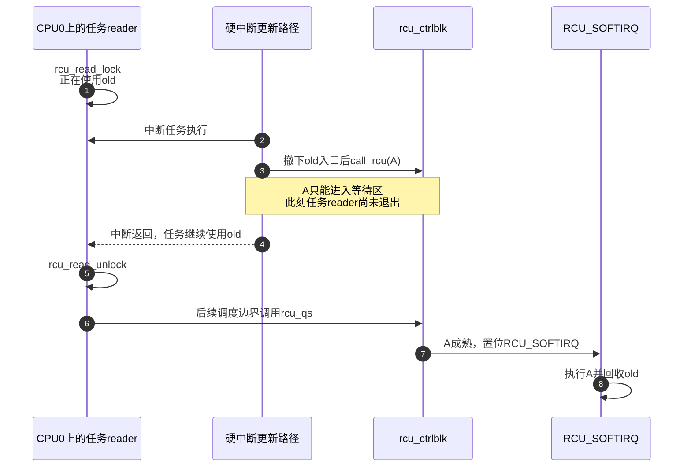
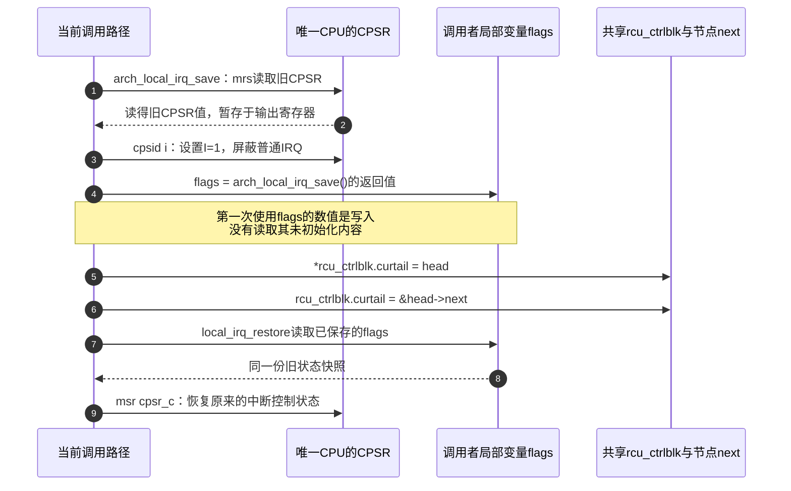
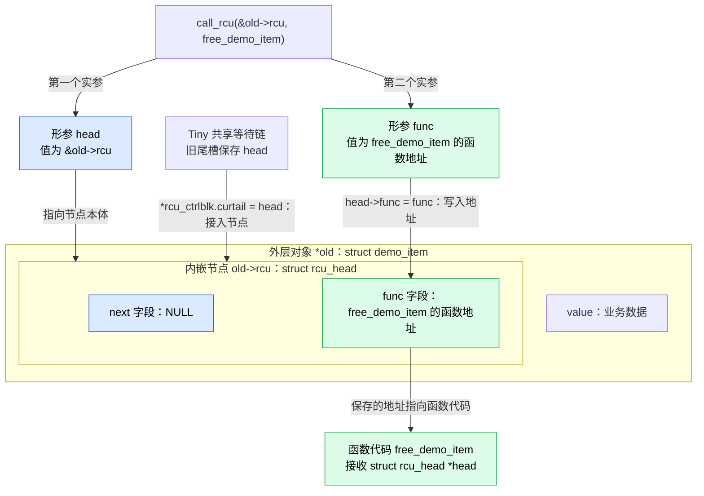
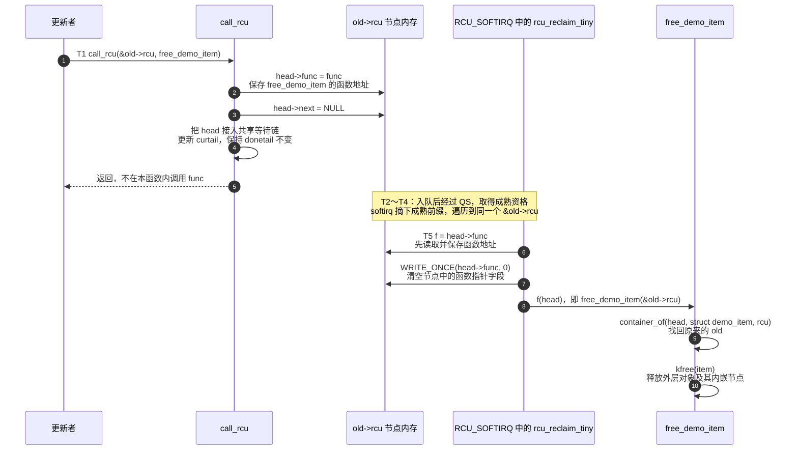
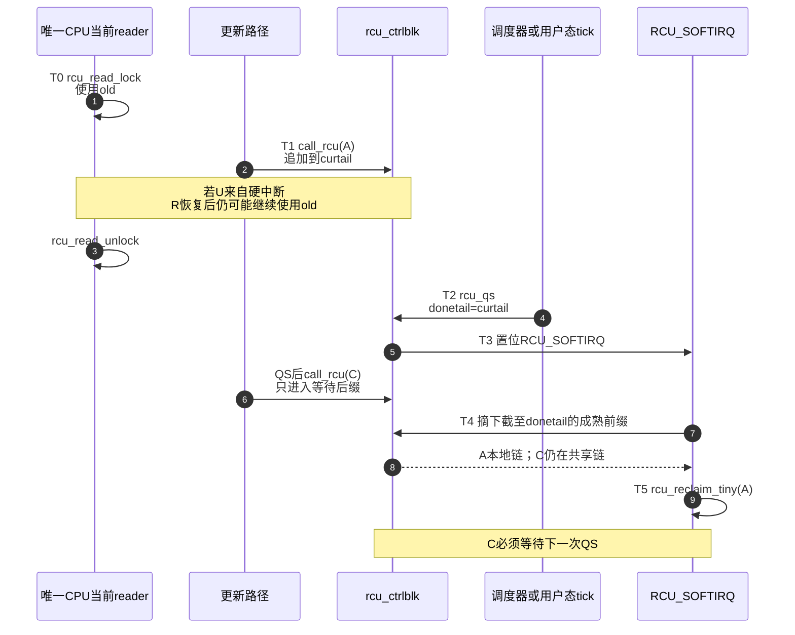

# 第13章\_Linux\_6.12\_Tiny\_RCU源码实现

## 13.1\_实现所有权与本章读者任务

* `RCU` 是英文全称 **Read-Copy Update（读-复制-更新）** 的缩写；
* `CPU` 是 **Central Processing Unit（中央处理器）** 的缩写；
* `UP` 是 **Uniprocessor（单处理器）** 的缩写。

本章先使用两个普通 RCU 公共 C 函数接口：`rcu_read_lock()` / `rcu_read_unlock()` 标出 reader 临界区的进入与退出，`call_rcu()` 把一个 `struct rcu_head` callback 提交给宽限期后的异步执行路径。它们的公共契约不因底层选择 Tiny 而改变，本章只追踪这些调用在 Tiny 配置下落到哪些状态地址和执行事件。

本章只追 Linux 6.12.20 的 **普通 Tiny RCU**。读者不需要先读完 Tree RCU，也不会在这里展开 Tiny SRCU、Tasks RCU 或 Tree RCU 的内部状态。唯一必须带入的公共契约是：

* reader 取得受 RCU 保护的指针；
* 更新者先撤掉旧入口；
* 旧 reader 跨过宽限期后，更新者才可以回收旧对象。

本章要把下面六个问题连成一轮真实运行过程：

1. 单 CPU 为什么仍然需要 RCU，而不只是“串行执行所以直接释放”；
2. `rcu_read_lock()` 没有建立 reader 链表时，旧 reader 为什么仍然不会跨过静止态；
3. `call_rcu()` 怎样用一个单链表和两个二级指针区分“已成熟”与“仍等待”的 callback；
4. 调度切换、用户态时钟中断和 idle 路径怎样共同产生或催促 `rcu_qs()`；
5. `RCU_SOFTIRQ` 怎样只摘下成熟前缀，而不误执行同一静止态之后新入队的 callback；
6. `synchronize_rcu()` 为什么可以立即返回，`rcu_barrier()` 为什么反而必须排队等待。

这里会遇到 **softirq（software interrupt，软件中断）**，它是内核在硬中断返回等检查点执行延期工作的通用子系统。本章只展开 RCU 自己拥有的三个接缝：`open_softirq()` 登记 RCU action、`raise_softirq_irqoff()` 设置本 CPU pending 位，以及通用分派器最终调用 `rcu_process_callbacks()`；pending 位扫描、`irq_exit_rcu()`、`__do_softirq()`、重启预算和 `ksoftirqd` 的完整实现所有权仍属于中断/softirq 专题。现有[中断专题覆盖边界](../../../../knowledge/linux/synchronization_and_asynchrony/asynchrony/interrupts/大纲.md#1.2_当前覆盖边界与源码缺口)已经明确记录这项待补源码闭环，不能把本章的 RCU 接入说明当成整个 softirq 子系统的逐行讲解。

为避免在代码块里第一次撞见私有名字，先登记后文会反复使用的源码术语：

| 名字与源码类型 | 本章中的本地含义 |
| --- | --- |
| `CONFIG_TINY_RCU`、`CONFIG_PREEMPT_RCU`、`CONFIG_PROVE_RCU`、`CONFIG_PROVE_LOCKING`、`CONFIG_RCU_LAZY` | Kconfig 配置符号，分别控制 Tiny 后端、可抢占普通 RCU、RCU 证明检查、Lockdep 证明和 lazy callback |
| `CONFIG_DEBUG_OBJECTS`、`CONFIG_DEBUG_OBJECTS_RCU_HEAD` | Kconfig 配置符号，分别控制通用对象生命周期检查框架和 RCU 节点的检查接入；选择 Tiny 不等于选择这两项 |
| `CONFIG_DEBUG_LOCK_ALLOC`、`CONFIG_RCU_TRACE`、`CONFIG_PREEMPT_COUNT` | Kconfig 配置符号，分别控制锁依赖状态登记、可选 RCU trace 事件和抢占计数维护；三者须分别核对，不能由 Tiny 名称推断 |
| `CONFIG_TASKS_RCU_GENERIC`、`CONFIG_TRACING`、`CONFIG_PRINTK` | Kconfig 配置符号，分别控制 Tasks RCU 公共实现、通用跟踪设施和内核日志输出；通用设施开启不代表每个子系统检查点都开启 |
| `CONFIG_TRACE_IRQFLAGS`、`CONFIG_DEBUG_IRQFLAGS` | Kconfig 配置符号，分别控制中断启闭状态的检查接入和错误恢复中断状态的额外诊断；与 `CONFIG_RCU_TRACE`、节点生命周期检查是不同开关 |
| `SMP` | **Symmetric Multiprocessing（对称多处理）** 的 Kconfig 配置符号；写入生成配置后名为 `CONFIG_SMP`，值为 `n` 表示该内核不构建多 CPU 支持 |
| `CONFIG_PREEMPT_NONE`、`CONFIG_PREEMPT_DYNAMIC`、`CONFIG_PREEMPTION`、`CONFIG_PREEMPT_NONE_BUILD` | 抢占模型的直接选择或内部派生符号；本章会从配置种子追踪到每一项的有效与无效结果 |
| `defconfig` | Kconfig 的配置种子文件；它只保存需要交给求解器的输入，不是最终生效配置的完整副本 |
| Kbuild、`O=` | Kbuild 是 Linux kernel 自身的构建系统专名，`O=` 是它指定独立输出目录的命令行参数；使用以后，`.config`、生成头文件、目标文件和 `vmlinux` 都位于该输出目录，而不是源码根目录 |
| Bear、`compile_commands.json` | Bear 是截获真实编译进程并生成编译数据库的工具；`compile_commands.json` 保存每个 C 翻译单元实际使用的编译目录、编译器、宏和头文件搜索路径，供 clangd 等语言服务器定位源码 |
| `donetail`、`curtail`、`gp_seq` | `struct rcu_ctrlblk` 的 C 字段；分别保存成熟分界、整链队尾槽地址和 poll 观察序列 |
| `next` | `struct rcu_head` 的 C 字段，把 callback 节点串成单链表 |
| `list` | `rcu_process_callbacks()` 的 C 局部变量，临时持有已从共享队列摘下的成熟链 |
| `local_irq_save()` | 关闭并保存本地硬中断状态的 C 宏/底层接口，用于保护 UP 上仍会被硬中断嵌套的共享指针 |
| `update_process_times()` | 调度时钟处理链中的 C 函数，调用 `rcu_sched_clock_irq()` |
| `rcu_softirq_qs_periodic()`、`rcu_softirq_qs()` | 长时间 softirq 处理路径使用的 C 宏和内联函数，满足调用前提与周期后转入 `rcu_qs()` |
| `WRITE_ONCE()`、`READ_ONCE()` | 对单个共享 C 对象执行一次可观察访问的内核宏，防止编译器合并或拆分这里的序列读写 |
| `raise_softirq_irqoff()` | 在本地中断已关闭前提下置 softirq pending 位的 C 函数 |
| `RCU_GET_STATE_COMPLETED` | 表示“无需再等”的 C 宏常量；值为 1，与 Tiny 的偶数 `gp_seq` 更新区分 |
| `RCU_LOCKDEP_WARN()` | 条件成立时交给 RCU Lockdep 报告非法上下文的 C 诊断宏 |
| `synchronize_rcu_expedited()` | 请求 expedited 语义的 C 函数；在 Tiny 条件下内联复用 `synchronize_rcu()` |
| `wait_rcu_gp()`、`call_rcu_hurry()`、`wakeme_after_rcu()` | `rcu_barrier()` 使用的 C 宏/函数：建立等待对象、排入哨兵 callback、完成唤醒 |
| `rcu_synchronize` | 公共等待桥的 C 结构体标签，完整类型写作 `struct rcu_synchronize`，内含 `rcu_head` 与 completion |
| UAF | **Use-After-Free（释放后使用）**，旧 reader 在对象释放后继续解引用造成的生命周期错误 |

模块角色与建议阅读顺序见 [Tiny RCU 模块源码概念导读](../navigation/P11_Linux_6.12_Tiny_RCU模块源码概念导读.md#11.1_模块问题与当前配置前提)，跨版本稳定的机制边界见 [Tiny RCU 单 CPU 实现](../../../../knowledge/linux/synchronization_and_asynchrony/synchronization/rcu/P20_Tiny_RCU_单CPU实现.md#20.1_单CPU删除了什么问题)，源码家族入口见 [Linux 6.12 RCU 源码总阅读索引](../navigation/P01_Linux_6.12_RCU源码总阅读索引.md#1.5_唯一实现讲解入口)。

源码身份固定为 NXP `linux-imx` 官方发布标签 `lf-6.12.20-2.0.0`、提交 `dfaf2136deb2af2e60b994421281ba42f1c087e0`、Linux 6.12.20。2026-09-05 重新核对的开发工作树位于 `lf-6.12.y`，`HEAD=7b60e547d2783f8fee61ff7d7be3e066825b9c3a`，比固定提交前进 3 个提交；本章涉及的 `tiny.c`、`rcutiny.h`、`rcupdate.h`、`update.c`、Kconfig、Makefile、调度切换和时钟入口在这两个提交之间没有差异。因此，函数体仍以固定提交作为长期证据，当前 `.config` 只承担“这次构建实际选择了 Tiny”的配置证据。

主要源码树相对位置如下；其中固定提交中的上游文件与开发树自定义配置种子分开标注：

- [`kernel/rcu/tiny.c`](../../linux/kernel/rcu/tiny.c)：Tiny 控制块、callback、QS、同步与轮询入口；
- [`include/linux/rcutiny.h`](../../linux/include/linux/rcutiny.h)：Tiny 条件下的调度 QS、poll/expedited 包装和空操作边界；
- [`include/linux/rcupdate.h`](../../linux/include/linux/rcupdate.h)：公共读侧包装和实现头文件选择；
- [`kernel/rcu/rcu.h`](../../linux/kernel/rcu/rcu.h) 与 [`lib/Kconfig.debug`](../../linux/lib/Kconfig.debug)：RCU 内部检查帮助器及其配置依赖；本章按当前关闭节点生命周期检查的分支展开；
- [`include/linux/irqflags.h`](../../linux/include/linux/irqflags.h)、[`include/linux/typecheck.h`](../../linux/include/linux/typecheck.h)、[`arch/arm/include/asm/irqflags.h`](../../linux/arch/arm/include/asm/irqflags.h)：队列临界区保存/恢复中断状态的宏、类型检查和当前 ARM 实现；
- [`kernel/rcu/update.c`](../../linux/kernel/rcu/update.c)：公共 early test、等待 callback 和 Lockdep 状态；
- `arch/arm/configs/imx_v7_test_defconfig`：当前开发树中需要长期保存的 ARM 板级配置种子；该文件存在于当前 `lf-6.12.y` 分支头，但不存在于固定发布提交，当前 Tiny 输入又是相对分支头尚未提交的工作树差量，因此只能作为本次开发配置证据；
- `arch/arm/Kconfig` 与 `kernel/Kconfig.preempt`：分别定义 `SMP` 和抢占模型的用户可选入口；
- [`kernel/rcu/Kconfig`](../../linux/kernel/rcu/Kconfig) 与 [`kernel/rcu/Makefile`](../../linux/kernel/rcu/Makefile)：前者根据已选能力派生隐藏的 RCU 后端，后者把派生结果变成实际链接对象；
- `$O/.config`、`$O/include/config/auto.conf` 与 `$O/include/generated/autoconf.h`：Kconfig/Kbuild 生成并实际消费的构建结果，不是应手工长期维护的源码文件。

本章代码块中的 `/** ... */` 中文 Doxygen、中文行内注释和阶段标签均由仓库补充，不是上游原注释。源码展示与配置分析分开：先保留被讲解函数、宏的原始语句和分支，再说明本次生成配置选择了什么、运行条件又决定了什么。当前不生效的检查分支和空操作调用仍保留在源码中，不能用“优化后的等价代码”替换原实现。按阅读任务摘录头文件中的一组定义时，标明所属条件和完整源码入口，不省略影响这些定义的判断来简化结论。

## 13.2\_源码符号覆盖账本

| 唯一展开符号 | 本章标题 | 主要状态副作用 |
| --- | --- | --- |
| `TREE_RCU`、`PREEMPT_RCU`、`TINY_RCU` 与 RCU Makefile | [13.3](#13.3_配置怎样在链接期选择Tiny) | 让普通 RCU 的同名符号只由 `tiny.o` 提供 |
| `__rcu_read_lock()`、`__rcu_read_unlock()`、`rcu_note_context_switch()` | [13.5](#13.5_reader不登记名单但不能跨过调度边界) | 用非抢占执行约束包住 reader，并在调度边界报告 QS |
| `struct rcu_ctrlblk` | [13.6](#13.6_一个链表和两个二级指针怎样表达三种状态) | 保存共享 callback 链表、成熟分界、队尾和 poll 序列 |
| `local_irq_save()` / `local_irq_restore()`、对应 raw 宏和 ARM 保存/恢复函数 | [13.6.3](#13.6.3_flags怎样保存和恢复中断状态) | 向局部变量写入旧中断状态，屏蔽本 CPU 普通 IRQ，保护队列更新后恢复原状态 |
| `call_rcu()` | [13.7](#13.7_call_rcu只入队不宣布安全) | 追加 callback，必要时催促 idle CPU 调度 |
| `debug_rcu_head_queue()`、`debug_rcu_head_unqueue()` | [13.15](#13.15_错误路径与执行上下文不能被短代码掩盖) | 保留原始条件编译两侧；当前分别返回 0、执行空操作，不维护入队检查账本 |
| `rcu_sched_clock_irq()`、`rcu_softirq_qs()` | [13.8](#13.8_谁产生QS谁只催促QS) | 用户态 tick 或满足前提的长 softirq 路径报告 QS；内核态 tick 在有欠账时请求调度 |
| `rcu_qs()` | [13.9](#13.9_rcu_qs一次性冻结当前等待批次) | 把当前队尾发布为成熟分界，置位 softirq，并推进 poll 序列 |
| `rcu_process_callbacks()`、`rcu_reclaim_tiny()` | [13.10](#13.10_RCU_SOFTIRQ只摘成熟前缀再执行) | 摘下成熟前缀，在 softirq 上下文调用普通 callback 或直接 `kvfree()` |
| `debug_rcu_head_callback()` | [13.15](#13.15_错误路径与执行上下文不能被短代码掩盖) | 不受节点生命周期检查开关控制；函数指针为 NULL 时调用对象诊断，不阻止随后的函数调用 |
| `synchronize_rcu()` 与 poll API | [13.12](#13.12_synchronize_rcu立即返回不等于没有宽限期语义) | 利用合法调用现场本身已是 QS，并使轮询者看到序列变化 |
| `rcu_barrier()` | [13.13](#13.13_rcu_barrier等待的是旧callback实际执行) | 在 FIFO 尾部追加 completion 哨兵并等待其执行 |
| `rcu_init()` | [13.14](#13.14_rcu_init的三个动作不是Tiny的全部实现) | 登记 `RCU_SOFTIRQ`、接入早期自检、调用条件化的 Tasks 初始化 |

以后讲解这些 Tiny 函数体时，应链接本表中的唯一标题，不在知识正文或模块导读中再复制一套逐句实现。

本章复核每个函数的 **实现原理** 时统一追问四件事：进入前由哪项 UP/非抢占约束限定上下文；函数修改 `rcu_ctrlblk`、当前执行轨迹还是 softirq pending 位中的哪个地址；后续由哪个调度入口、softirq handler、poll 调用者或等待者读取；这段顺序封住的是旧 reader 跨界、callback 偷代、丢失唤醒还是过早回收。后续各节都按这四项解释，不能用函数名直译代替状态与通信过程。

## 13.3\_配置怎样在链接期选择Tiny

先把“源码树里存在 Tiny”收紧成“当前镜像确实链接 Tiny”。需要依次核对生成配置、Kconfig 推导和 Makefile 目标；三层证据缺一层，都不能只凭文件名判断实际路径。

### 13.3.1\_从内核根目录分清应该修改与只应阅读的文件

以下路径全部以 **Linux kernel 源码根目录** 为起点。切换 Tiny RCU 时，不应看到 `kernel/rcu/Kconfig` 后就直接修改它；先按文件职责确定操作位置：

| 根目录相对路径 | 文件性质 | 本次应该怎样处理 |
| --- | --- | --- |
| `arch/arm/configs/imx_v7_test_defconfig` | 当前项目长期保存的配置种子 | **需要让以后重新生成配置仍选择 Tiny 时，修改这里** |
| `$O/.config` | 某一个输出目录本次构建的最终配置 | 用 `menuconfig` 或 `scripts/config` 做一次性试验；重新执行 `make ... imx_v7_test_defconfig` 会覆盖它 |
| `arch/arm/Kconfig` | `SMP` 等 ARM 构建能力的定义 | 只阅读依赖与提示，不为切换后端而改规则 |
| `kernel/Kconfig.preempt` | `PREEMPT_NONE`、`PREEMPT`、`PREEMPT_DYNAMIC` 等抢占模型的定义 | 只阅读选择关系，不为一个板级配置改全局规则 |
| `kernel/rcu/Kconfig` | `TREE_RCU`、`PREEMPT_RCU`、`TINY_RCU` 等隐藏派生符号的定义 | 只阅读派生关系；不要把修改这里当成配置内核 |
| `kernel/rcu/Makefile` | 把最终配置映射到 `tree.o` 或 `tiny.o` | 只核对链接结果，不在这里硬编码目标文件 |
| `$O/include/config/auto.conf`、`$O/include/generated/autoconf.h` | Kbuild 从 `.config` 生成的消费文件 | 只核对，禁止手工修改；下一次配置同步会重写 |

这里的 `$O` 表示传给 Kbuild 的独立输出目录。若构建时没有使用 `O=...`，表中的 `$O/.config` 就是源码根目录的 `.config`；若使用了 `O=out/tiny_rcu`，则必须检查 `out/tiny_rcu/.config`，不能继续查看源码根目录里可能过期的旧文件。

固定提交中的标准 `arch/arm/configs/imx_v7_defconfig` 同时包含 `CONFIG_SMP=y` 与 `CONFIG_PREEMPT=y`，会派生可抢占 Tree RCU。当前项目为了 i.MX6ULL 单 CPU 验证而使用的 `imx_v7_test_defconfig` 是自定义配置种子；应修改这个专用文件，不能为了得到 Tiny 而把面向多个 i.MX SoC 的标准 `imx_v7_defconfig` 一并改成 UP。

### 13.3.2\_在板级配置种子中写输入而不是硬写隐藏结果

若目标是让 Tiny 配置可以反复生成，打开并修改 `<linux-kernel-root>/arch/arm/configs/imx_v7_test_defconfig`。

在这个文件中删除或改写会选择 SMP、完整抢占或动态抢占的输入，并明确选择无强制抢占模型：

```text
# 文件：arch/arm/configs/imx_v7_test_defconfig

# 若原文件存在下面几行，应删除或改为未启用：
# CONFIG_SMP=y
# CONFIG_PREEMPT=y
# CONFIG_PREEMPT_DYNAMIC=y

# Tiny RCU 这条构建路径需要保留的直接输入：
# CONFIG_SMP is not set
CONFIG_PREEMPT_NONE=y
# CONFIG_PREEMPT_DYNAMIC is not set
```

`choice` 是 Kconfig 用来表达互斥选项组的语法。`CONFIG_PREEMPT_NONE` 与 `CONFIG_PREEMPT`、`CONFIG_PREEMPT_VOLUNTARY`、`CONFIG_PREEMPT_RT` 属于同一个抢占模型 choice，最终只能有一个为 `y`。上面的关键不是机械凑齐所有 `# ... is not set` 注释，而是确保求解后满足 `CONFIG_SMP=n`、`CONFIG_PREEMPTION=n`。如果原配置还显式选择了其他抢占模型，必须先删除冲突项。

不要在这个 defconfig 中把 `CONFIG_PREEMPTION`、`CONFIG_PREEMPT_RCU`、`CONFIG_TREE_RCU`、`CONFIG_TINY_RCU` 四个隐藏结果当成手工输入。

它们没有面向用户的提示字符串，值由 `kernel/Kconfig.preempt` 与 `kernel/rcu/Kconfig` 根据前面的直接输入重新求解。即使把 `CONFIG_TINY_RCU=y` 硬写进配置种子，也不能替代依赖条件；下一次 `olddefconfig` 仍以 Kconfig 规则为准。

修改种子以后，从内核根目录生成一份独立配置：

```bash
kernel_root=$PWD
tiny_rcu_out="$kernel_root/out/tiny_rcu"
mkdir -p "$tiny_rcu_out"
make ARCH=arm O="$tiny_rcu_out" imx_v7_test_defconfig
make ARCH=arm O="$tiny_rcu_out" olddefconfig
```

这两条 `make` 命令读取的是 `arch/arm/configs/imx_v7_test_defconfig`，写入的是 `out/tiny_rcu/.config`。它们不会把最终的几千个配置项反向写回 defconfig。

若只想临时验证，不准备修改长期配置种子，可以在生成 `$O/.config` 后使用根目录自带的 `scripts/config`：

```bash
scripts/config --file "$tiny_rcu_out/.config" \
    --disable SMP \
    --disable PREEMPT \
    --disable PREEMPT_VOLUNTARY \
    --disable PREEMPT_RT \
    --disable PREEMPT_DYNAMIC \
    --enable PREEMPT_NONE

make ARCH=arm O="$tiny_rcu_out" olddefconfig
```

这条临时路径只修改 `$O/.config`。要把结果变成项目配置，仍应审查 `make ARCH=arm O="$tiny_rcu_out" savedefconfig` 生成的 `$O/defconfig`，再把确认后的最小差量写回 `arch/arm/configs/imx_v7_test_defconfig`；不能复制整份 `.config` 冒充可维护的配置种子。

### 13.3.3\_当前真正生效的是生成配置

2026-09-05 核对、2026-09-06 复核 `.config`、`include/config/auto.conf` 和 `include/generated/autoconf.h`，三者共同确认下列配置状态（关闭项按 `.config` 的形式展示，生成头文件中对应宏未定义）：

```text
CONFIG_PREEMPT_NONE_BUILD=y
CONFIG_PREEMPT_NONE=y
CONFIG_TINY_RCU=y
# CONFIG_SMP is not set
CONFIG_PROVE_LOCKING=y
CONFIG_PROVE_RCU=y
CONFIG_DEBUG_LOCK_ALLOC=y
CONFIG_PREEMPT_COUNT=y
# CONFIG_DEBUG_OBJECTS is not set
# CONFIG_RCU_TRACE is not set
```

其中 `CONFIG_DEBUG_OBJECTS_RCU_HEAD` 依赖 `CONFIG_DEBUG_OBJECTS`，当前父开关关闭，子开关也未启用，生成头文件没有定义这两个宏。**`CONFIG_PROVE_RCU=y` 不会代替节点生命周期检查开关。** 后文必须分别判断普通 Tiny 功能路径、Lockdep 检查路径和对象生命周期检查路径，不能把它们合成“调试已开启”。

这里记录的是当时开发工作树的实际结果。读者重新生成时应检查自己的 `$O/.config`，预期的直接输入和派生结果为：

| 符号 | 预期值 | 谁决定它 |
| --- | --- | --- |
| `CONFIG_SMP` | `n` | `arch/arm/configs/imx_v7_test_defconfig` 的直接输入，定义位于 `arch/arm/Kconfig` |
| `CONFIG_PREEMPT_NONE` | `y` | 板级配置种子在 `kernel/Kconfig.preempt` 的抢占 choice 中选择 |
| `CONFIG_PREEMPT_DYNAMIC` | `n` | 板级配置种子的直接输入；避免它再选择 `PREEMPT_BUILD` |
| `CONFIG_PREEMPT_NONE_BUILD` | `y` | `PREEMPT_NONE` 在非动态抢占条件下派生 |
| `CONFIG_PREEMPTION` | `n` | 没有 `PREEMPT_BUILD` 或 `PREEMPT_RT` 选择它 |
| `CONFIG_PREEMPT_RCU` | `n` | `PREEMPTION=n`，其默认条件不成立 |
| `CONFIG_TREE_RCU` | `n` | `SMP=n` 且没有 `PREEMPT_RCU` 选择它 |
| `CONFIG_TINY_RCU` | `y` | `!PREEMPT_RCU && !SMP` 条件成立后由 `kernel/rcu/Kconfig` 派生 |
| `CONFIG_TINY_SRCU` | `y` | 由 `TINY_RCU` 默认派生；它选择另一套 SRCU 后端，不属于本章普通 RCU 状态机 |

板级 defconfig 是 Kconfig 的输入，不必显式写出隐藏符号 `CONFIG_TINY_RCU=y`。真正回答“本次编译选中了什么”的是 Kconfig 求解后的 `$O/.config` 和生成头文件。

还要注意 Kconfig 的输出形式：`CONFIG_SMP` 有用户提示，关闭后在 `.config` 中保留 `# CONFIG_SMP is not set`；`PREEMPTION`、`PREEMPT_RCU` 与 `TREE_RCU` 是没有提示字符串的隐藏布尔符号，值为 `n` 时通常直接不出现在 `.config`、`auto.conf` 和 `autoconf.h` 中。不能因为找不到一行 `# CONFIG_TREE_RCU is not set` 就认为配置证据缺失，应同时确认 Tiny 的正向选择和这些隐藏符号不存在任何 `=y` 定义。

### 13.3.4\_Kconfig先排除多CPU和可抢占普通RCU

`kernel/Kconfig.preempt` 先把用户选择的抢占模型转换成内部能力。下面只保留决定本章分支的语句：

```kconfig
config PREEMPT_NONE_BUILD
	bool

config PREEMPT_BUILD
	bool
	select PREEMPTION

choice
	prompt "Preemption Model"
	default PREEMPT_NONE

config PREEMPT_NONE
	bool "No Forced Preemption (Server)"
	select PREEMPT_NONE_BUILD if !PREEMPT_DYNAMIC

config PREEMPT
	bool "Preemptible Kernel (Low-Latency Desktop)"
	select PREEMPT_BUILD

config PREEMPT_RT
	bool "Fully Preemptible Kernel (Real-Time)"
	select PREEMPTION
endchoice

config PREEMPTION
	bool

config PREEMPT_DYNAMIC
	bool "Preemption behaviour defined on boot"
	select PREEMPT_BUILD
```

因此 `CONFIG_PREEMPT_NONE=y` 还不够；若同时让 `CONFIG_PREEMPT_DYNAMIC=y` 生效，后者仍会通过 `PREEMPT_BUILD` 选中 `PREEMPTION`，进而派生 `PREEMPT_RCU` 与 Tree RCU。当前 Tiny 验证路径明确要求 `CONFIG_PREEMPT_DYNAMIC=n`。

随后，`kernel/rcu/Kconfig` 才根据 `SMP` 与 `PREEMPTION` 的求解结果选择普通 RCU 后端：

```kconfig
# 仓库补充：下面裁剪自kernel/rcu/Kconfig，只保留普通RCU后端选择关系。
config TREE_RCU
	bool
	default y if SMP

config PREEMPT_RCU
	bool
	default y if PREEMPTION
	select TREE_RCU

config TINY_RCU
	bool
	default y if !PREEMPT_RCU && !SMP
```

完整因果链是：

```text
arch/arm/configs/imx_v7_test_defconfig
    ├─ CONFIG_SMP=n
    ├─ CONFIG_PREEMPT_NONE=y
    └─ CONFIG_PREEMPT_DYNAMIC=n
            ↓ kernel/Kconfig.preempt
       CONFIG_PREEMPTION=n
            ↓ kernel/rcu/Kconfig
       CONFIG_PREEMPT_RCU=n
       CONFIG_TREE_RCU=n
       CONFIG_TINY_RCU=y
```

这不是运行时探测在线 CPU 数量。Kconfig 在构建前已经决定后端；同一内核镜像不会运行到一半从 Tiny 切换成 Tree。

### 13.3.5\_Makefile让同名函数互斥进入链接

```makefile
obj-y += update.o sync.o
obj-$(CONFIG_TREE_RCU) += tree.o
obj-$(CONFIG_TINY_RCU) += tiny.o
```

`update.o` 是两种后端共享的公共代码；`tree.o` 与 `tiny.o` 则由配置互斥选择。因此当前构建中的 `call_rcu()`、`synchronize_rcu()`、`rcu_qs()` 和 `rcu_init()` 来自 `kernel/rcu/tiny.c`。Tree 文档里的同名函数是另一种链接结果的证据，不是 Tiny 调用完成后继续执行的下一段代码。

当前配置还会得到 `CONFIG_TINY_SRCU=y`，但 Tiny SRCU 位于 `kernel/rcu/srcutiny.c`，保护的是显式 `srcu_struct` 私有域。本章的 Tiny RCU 没有 `srcu_struct` 参数，两者只因同一 UP 构建条件同时被选中，不能按文件名合并成一套机制。

## 13.4\_单CPU仍然会出现旧reader与更新者的时间交错

“只有一个 CPU”只消除了 **真正同时在两个 CPU 上执行内核代码** 的情形，没有消除任务、硬中断和 softirq 在同一 CPU 上的先后嵌套。下面这条合法交错足以说明 callback 不能立即执行：



若硬中断中的更新路径在 `call_rcu(A)` 后立刻释放旧对象，被中断的任务恢复时就会访问已释放内存。Tiny RCU 的价值正在这里：它不需要跨 CPU 汇聚，却仍要保存“这个回调必须等当前执行轨迹越过 QS”的时间债务。

同步更新者通常从进程上下文调用 `synchronize_rcu()`。在 UP、非抢占构建中，另一个任务中的旧 reader 若不先结束或越过调度边界，当前更新任务根本没有机会开始执行；硬中断中的旧 reader也必须先返回，任务才能继续调用同步接口。这组前提解释了同步入口为何可以退化，但 **不能** 推出异步 callback 也能在任意上下文立即执行。

## 13.5\_reader不登记名单但不能跨过调度边界

Tiny 不保存 reader 名单，但必须保证 reader 不会悄悄跨过被当作 QS 的调度事件。下面先看读侧怎样建立非抢占执行边界，再看调度器怎样消费这条边界。

### 13.5.1\_公共读侧包装保留非抢占执行约束

在 `!CONFIG_PREEMPT_RCU` 分支中，普通读侧最终落到下面两个函数。`IS_ENABLED()` 是把 Kconfig 配置状态变为常量条件的宏；`CONFIG_RCU_STRICT_GRACE_PERIOD` 是严格宽限期行为的 Kconfig 配置符号，源码保留了其解锁检查点，当前未启用。

```c
/**
 * @brief 建立普通 Tiny RCU reader 的执行边界。
 * @note 仓库补充中文说明，裁剪自 include/linux/rcupdate.h。
 */
static inline void __rcu_read_lock(void)
{
	preempt_disable(); /* reader期间不允许发生任务抢占切换。 */
}

static inline void __rcu_read_unlock(void)
{
	preempt_enable();  /* 结束最外层非抢占执行约束。 */
	if (IS_ENABLED(CONFIG_RCU_STRICT_GRACE_PERIOD))
		rcu_read_unlock_strict();
}
```

上面保留 `__rcu_read_unlock()` 的完整函数体。当前 `CONFIG_RCU_STRICT_GRACE_PERIOD` 未启用，该条件不成立；而且同一头文件在 `CONFIG_TINY_RCU` 分支把 `rcu_read_unlock_strict()` 定义为空宏。不能为了说明当前执行结果，就从原函数中删掉这两行。

当前是 `CONFIG_PREEMPT_NONE=y`、`CONFIG_PREEMPT_COUNT=y`、`CONFIG_PREEMPTION=n`。按 `include/linux/preempt.h` 的实际分支，`preempt_disable()` 增加抢占计数并执行编译器屏障，`preempt_enable()` 执行编译器屏障并减少计数，不进入可抢占构建的 `__preempt_schedule()` 分支。因此不能把当前读侧包装说成全空，也不能说解锁会主动触发任务抢占。Tiny 不为每个 reader 分配节点，也不在 `rcu_ctrlblk` 中增加 reader 计数；正确性依赖的约束是：**合法普通 reader 不阻塞，并且不能跨过真正的任务调度切换。**

公共 `rcu_read_lock()` / `rcu_read_unlock()` 还包含 Lockdep 登记与上下文检查。当前 `CONFIG_DEBUG_LOCK_ALLOC=y`，对应 map 登记不是空操作；但 Tiny 的 `rcu_is_watching()` 在 `include/linux/rcutiny.h` 中恒返 `true`，所以包装中的 `RCU_LOCKDEP_WARN(!rcu_is_watching(), ...)` 条件恒假。两者不能混称为“都有检查”或“都没有检查”；公共适配实现见 [RCU 读侧检查包装](P04_Linux_6.12_RCU_Lockdep适配层源码实现.md#4.4.2_三种读侧API为何按这个顺序配对)。

这里的“无 reader 名单”不是“没有通信”。reader 把成本转成执行约束；调度器在上下文切换点读取这条约束已经结束的事实，再调用 Tiny 的 QS 路径。被删除的是逐 reader 登记和跨 CPU 汇聚，不是读侧边界。

### 13.5.2\_调度器把上下文切换变成QS

`include/linux/rcutiny.h` 在 Tiny 配置下提供：

```c
/**
 * @brief 在真实任务切换前报告普通 Tiny RCU 静止态。
 * @note 保留上游宏的两个调用位置；当前配置中的 Tasks 调用为空操作。
 */
#define rcu_note_context_switch(preempt) \
	do { \
		rcu_qs(); \
		rcu_tasks_qs(current, (preempt)); \
	} while (0)
```

`kernel/sched/core.c::__schedule()` 在关闭本地中断后调用这个宏。一个合法非抢占 reader 不可能执行到 `__schedule()` 后仍声称自己处在原临界区，所以这次切换足以排除调用前的旧普通 reader。

当前没有启用 `CONFIG_TASKS_RCU_GENERIC`，`include/linux/rcupdate.h` 选中 `#define rcu_tasks_qs(t, preempt) do { } while (0)`。因此这次构建的宏只产生普通 Tiny 的 `rcu_qs()` 动作，没有额外向 Tasks reader 发送通知。

## 13.6\_一个链表和两个二级指针怎样表达三种状态

确认 reader 不会跨过调度 QS 后，下一步是保存 callback 欠账。Tiny 没有分段队列对象，而是用一个全局控制块在同一条链上表达空、成熟前缀和等待后缀。

### 13.6.1\_控制块只有四个字段

```c
/**
 * @brief Tiny RCU 的全局 callback 控制块。
 * @note 仓库补充中文 Doxygen，字段来自 kernel/rcu/tiny.c。
 */
struct rcu_ctrlblk {
	struct rcu_head *rcucblist; /* 整条共享链表的头指针。 */
	struct rcu_head **donetail; /* 成熟前缀之后那个next槽位的地址。 */
	struct rcu_head **curtail;  /* 当前整条链表尾部next槽位的地址。 */
	unsigned long gp_seq;       /* 无阻塞poll API观察的变化序列。 */
};

static struct rcu_ctrlblk rcu_ctrlblk = {
	.donetail = &rcu_ctrlblk.rcucblist,
	.curtail  = &rcu_ctrlblk.rcucblist,
	.gp_seq   = 0 - 300UL,
};
```

`donetail` 和 `curtail` 都不是“最后一个 `rcu_head *`”，而是 **某个指针槽位的地址**。这种二级指针设计让追加和切断都不需要寻找前驱节点。

### 13.6.2\_三个逻辑区域怎样落到同一条链

| 逻辑状态 | 指针关系 | 含义 |
| --- | --- | --- |
| 空队列 | `rcucblist == NULL`，两个 tail 都指向 `&rcucblist` | 没有 callback |
| 全部等待 | `donetail == &rcucblist`，`curtail` 指向末节点的 `next` | 还没经过入队后的 QS |
| 成熟前缀 + 等待后缀 | `donetail` 指向两段交界处的 `next`，`curtail` 指向全链尾槽 | 前缀可执行，后缀还不能执行 |

设 A、B 已入队，随后发生一次 QS，再在 softirq 执行前入队 C：

```text
rcucblist
    │
    ▼
    A ──next──> B ──next──> C ──next──> NULL
                 ▲           ▲
                 │           │
       donetail=&B.next   curtail=&C.next

       已成熟前缀 A、B     等待后缀 C
```

这就是 Tiny 的“代际”表达：没有 GP kthread，也没有分段 callback 列表，但 `donetail` 仍然把 **QS 之前已经存在的批次** 与 **QS 之后才入队的批次** 隔开。

所有会修改这三个链表指针的短临界区都使用 `local_irq_save()`。UP 消除了远端 CPU 并发，却没有消除本 CPU 硬中断对任务或 softirq 的嵌套；本地关中断正是这里替代自旋锁的互斥手段。

### 13.6.3\_flags怎样保存和恢复中断状态

队列操作中的 `unsigned long flags;` 是本次调用的局部变量，用来接收 **CPU 在进入临界区前的中断状态快照**。它不需要预先初始化，因为 `local_irq_save(flags)` 是会向参数表达式写值的宏，不是把未初始化数值按值传入的普通 C 函数。实际赋值在下一层宏中的 `flags = arch_local_irq_save()`；随后 `local_irq_restore(flags)` 才读取已经保存的值。自动变量未写初始化式，与运行时读取了未初始化值，是两回事；编译器也可能把这个局部值放在寄存器中，不能仅凭局部声明认定它一定是栈内存。

先沿 [`include/linux/irqflags.h`](../../linux/include/linux/irqflags.h) 查看这四个宏的完整定义，保留 `local_irq_*` 的两种配置分支。`typecheck()` 检查实参类型是否为 `unsigned long`；这里通过 `typeof(flags)` 取得类型，不读取 `flags` 的未初始化数值，定义见 [`include/linux/typecheck.h`](../../linux/include/linux/typecheck.h)。`raw_check_bogus_irq_restore()` 是额外的恢复前检查宏，当前 `CONFIG_DEBUG_IRQFLAGS=n`，它定义为空操作；下面仍保留原调用。

```c
/* 仓库补充：摘录完整宏定义；同一头文件中的其他中断API不在本节展开。 */
#define raw_local_irq_save(flags) \
	do { \
		typecheck(unsigned long, flags); \
		flags = arch_local_irq_save(); \
	} while (0)
#define raw_local_irq_restore(flags) \
	do { \
		typecheck(unsigned long, flags); \
		raw_check_bogus_irq_restore(); \
		arch_local_irq_restore(flags); \
	} while (0)

#ifdef CONFIG_TRACE_IRQFLAGS
#define local_irq_save(flags) \
	do { \
		raw_local_irq_save(flags); \
		if (!raw_irqs_disabled_flags(flags)) \
			trace_hardirqs_off(); \
	} while (0)
#define local_irq_restore(flags) \
	do { \
		if (!raw_irqs_disabled_flags(flags)) \
			trace_hardirqs_on(); \
		raw_local_irq_restore(flags); \
	} while (0)
#else /* !CONFIG_TRACE_IRQFLAGS */
#define local_irq_save(flags) do { raw_local_irq_save(flags); } while (0)
#define local_irq_restore(flags) do { raw_local_irq_restore(flags); } while (0)
#endif /* CONFIG_TRACE_IRQFLAGS */
```

当前 `CONFIG_TRACE_IRQFLAGS=y`，所以会选中上面的检查包装。`raw_irqs_disabled_flags(flags)` 检查保存值是否表示“原来已关中断”；只有原来开启时，`trace_hardirqs_off()` / `trace_hardirqs_on()` 才报告关/开状态转换。这些是检查接入，真正操作 CPU 的是 `arch_local_irq_save()` / `arch_local_irq_restore()`。此开关开启与 `CONFIG_RCU_TRACE=n` 并不矛盾，二者控制不同的调用点。

底层要按当前 ARM 架构继续追踪。Kconfig 配置为 `CONFIG_CPU_V7=y`、`CONFIG_CPU_32v7=y`，未启用 `CONFIG_CPU_V7M`；`arch/arm/Makefile` 为这组架构输入设置 `__LINUX_ARM_ARCH__=7`。因此 [`arch/arm/include/asm/irqflags.h`](../../linux/arch/arm/include/asm/irqflags.h) 选择 ARMv6 及以上的保存函数，且 `IRQMASK_REG_NAME_R` 为 `"cpsr"`、`IRQMASK_REG_NAME_W` 为 `"cpsr_c"`，不是 Cortex-M 的 `primask` 路径。

**CPSR（Current Program Status Register，当前程序状态寄存器）** 是 CPU 寄存器；其 I 位控制普通 **IRQ（Interrupt Request，中断请求）** 的屏蔽，I=1 表示屏蔽，I=0 表示不屏蔽。以下保留当前架构分支的两个完整函数；其他 ARM 架构分支保存在链接的原始头文件中：

```c
/**
 * @brief 读取旧CPU状态，然后屏蔽普通IRQ，并返回旧状态。
 * @note 仓库补充中文说明；当前选中 __LINUX_ARM_ARCH__ >= 6 分支。
 */
static inline unsigned long arch_local_irq_save(void)
{
	unsigned long flags;

	asm volatile(
		"	mrs	%0, " IRQMASK_REG_NAME_R "	@ arch_local_irq_save\n"
		"	cpsid	i"
		: "=r" (flags) : : "memory", "cc");
	return flags;
}

/**
 * @brief 使用保存值恢复CPU状态的控制字段，其中包含IRQ屏蔽位。
 * @note 仓库补充中文说明；保留原始汇编语句和操作数约束。
 */
static inline void arch_local_irq_restore(unsigned long flags)
{
	asm volatile(
		"	msr	" IRQMASK_REG_NAME_W ", %0	@ local_irq_restore"
		:
		: "r" (flags)
		: "memory", "cc");
}
```

`mrs` 把旧 CPSR 读入输出寄存器；约束 `"=r" (flags)` 中的 `=` 表示 **只写输出**，不是读取该局部变量的旧值。接着 `cpsid i` 设置 CPU 的 I 位，最后把旧 CPSR 值返回给外层的 `flags`。内联函数里的局部 `flags` 与调用者的 `flags` 是不同 C 作用域的变量，通过返回值和宏内赋值传递同一份快照。恢复函数则用 `"r" (flags)` 读取保存值，`msr cpsr_c, ...` 写回控制字段。`"memory"` 约束阻止编译器把普通队列内存访问随意搬出这段关中断区域；它不是跨 CPU 的锁。

下面只画 CPU 状态、局部快照和共享队列之间的数据流；检查包装的调用位置以上面的原始宏为准。`head` 是本次待入队节点的指针：



图中第 4 步写入 `flags`，第 7 步才读取它；第 5、6 步必须共同维持队列不变量，所以保护的是 **共享队列更新过程**。例如原来空队列的 `curtail=&rcucblist`：任务先把 `rcucblist` 写成 A、尚未更新 `curtail` 时，如果硬中断也入队 B，就会沿旧尾槽把 `rcucblist` 覆盖成 B；中断返回后，任务再把 `curtail` 改成 `&A.next`。结果链头指向 B，尾槽却落在脱链的 A 内。关本地 IRQ 正是为了不让这段交错插入两次更新之间，和“防止局部变量 flags 被别人改写”没有关系。

为什么最后必须恢复，而不能直接开中断，可以用同一组保存/恢复语句比较：

| 进入前的普通 IRQ 状态 | `flags` 保存的 I 位 | 队列更新期间 | `local_irq_restore(flags)` 后 |
| --- | --- | --- | --- |
| 已开启 | 0 | I=1，屏蔽 | 恢复 I=0 |
| 已关闭，例如外层已经关中断 | 1 | I=1，继续屏蔽 | 保持 I=1，不破坏外层约束 |

所以不要给 `flags` 硬编码初值来“修复未初始化”，也不要把 restore 改成无条件 enable；必须在同一控制流中用本次 save 写入的值配对恢复。`mrs` 与 `cpsid` 之间即使先响应了一个 IRQ，队列更新也尚未开始；处理完并返回后才会关 IRQ、进入临界区。这里依赖 UP 与普通 IRQ 屏蔽，不阻止其他 CPU，也不屏蔽 ARM 的 **FIQ（Fast Interrupt Request，快速中断请求）**；不能把这种保护直接用于有其他未屏蔽访问者的共享状态。

## 13.7\_call\_rcu只入队不宣布安全

上一节已经说明节点怎样串成等待链，但队列以后拿到一个节点时，还需要知道“该执行哪个函数、把哪个对象交给它”。`call_rcu()` 的两个参数正好提供这两项信息：

| 参数 | C 类型与实际传入的值 | 在本次登记中的作用 |
| --- | --- | --- |
| `head` | `struct rcu_head *`，指向调用者提供的回调节点 | 指定本次入队的是哪个节点；节点通常内嵌在待回收对象中 |
| `func` | `rcu_callback_t`，是函数指针类型，定义为 `typedef void (*rcu_callback_t)(struct rcu_head *head);` | 指定以后调用哪个函数；该函数接收一个 `struct rcu_head *`，返回 `void` |

`head` 指向的节点中有 `next` 和 `func` 两个字段：`next` 保存后继节点地址，`func` 保存回调函数地址。因此 **绑定发生在 `head->func = func` 这一句**：等号右边是本次调用传入的函数指针，左边是节点内用于保存它的字段。它只保存地址，此时没有调用这个函数。类型声明可在 [`include/linux/types.h`](../../linux/include/linux/types.h) 核对；该版本通过宏把 `rcu_head` 映射为 `callback_head`，二者在这里指同一种节点结构。

下面保留 [`kernel/rcu/tiny.c`](../../linux/kernel/rcu/tiny.c) 中 `call_rcu()` 的完整函数体，以及紧邻它的泄漏占位回调。`doublefrees` 是函数内静态的 `atomic_t` 原子计数器，供错误分支限制打印次数；`tiny_rcu_leak_callback()` 是不做回收的空函数。错误字符串中的 **CB（callback，回调）** 是上游使用的简称。是否进入这些诊断动作，要在读完原函数后按配置判断。

```c
/**
 * @brief 诊断分支使用的空回调，避免继续调用原来的普通回调。
 * @note 仓库补充中文说明；函数体按上游保留为空。
 */
static void tiny_rcu_leak_callback(struct rcu_head *rhp)
{
}

/**
 * @brief 把一个 callback 追加到 Tiny 共享链表。
 * @param head 调用者对象内嵌的 rcu_head。
 * @param func 宽限期后执行的回调。
 * @note 仓库补充中文说明；保留上游完整函数体，配置生效情况在下文解释。
 */
void call_rcu(struct rcu_head *head, rcu_callback_t func)
{
	static atomic_t doublefrees;
	unsigned long flags;

	if (debug_rcu_head_queue(head)) {
		if (atomic_inc_return(&doublefrees) < 4) {
			pr_err("%s(): Double-freed CB %p->%pS()!!!  ", __func__, head, head->func);
			mem_dump_obj(head);
		}

		if (!__is_kvfree_rcu_offset((unsigned long)head->func))
			WRITE_ONCE(head->func, tiny_rcu_leak_callback);
		return;
	}

	head->func = func; /* 把回调函数地址保存到本次入队的节点内。 */
	head->next = NULL; /* 初始化链表后继；这与回调函数地址是两个字段。 */

	local_irq_save(flags); /* 宏先写入旧中断状态，再在关IRQ状态下进入队列操作。 */
	*rcu_ctrlblk.curtail = head;     /* 旧尾槽现在指向新节点。 */
	rcu_ctrlblk.curtail = &head->next; /* 新尾槽变成新节点的next。 */
	local_irq_restore(flags); /* 使用上面保存的值，恢复调用前的中断状态。 */

	if (unlikely(is_idle_task(current))) {
		resched_cpu(0); /* 只催促调度；真正成熟仍由rcu_qs完成。 */
	}
}
```

现在再套入 [13.3.3 的当前配置](#13.3.3_当前真正生效的是生成配置)：`CONFIG_DEBUG_OBJECTS_RCU_HEAD` 未启用，`kernel/rcu/rcu.h` 为 `debug_rcu_head_queue()` 提供恒返 0 的内联定义。所以本次不会进入上面完整保留的错误分支，原子计数、打印、替换回调和提前返回都不会发生。它是 **有定义但不检查**，不是已经检查并确认安全。完整条件编译两侧及其状态含义见 [13.15](#13.15_错误路径与执行上下文不能被短代码掩盖)。

`flags` 的赋值藏在 `local_irq_save()` 的宏展开中，不需要调用者预先初始化；它保存的是 CPU 的旧中断状态，保护对象则是两次共享队列指针更新。具体赋值、ARM 指令与恢复顺序见 [13.6.3](#13.6.3_flags怎样保存和恢复中断状态)。

**把两个实参放回一个具体对象中。** 下面是解释绑定关系的教学片段，省略分配、发布和撤销入口的完整流程。假设 `old` 指向一个用 `kmalloc()` 分配的 `struct demo_item`；更新者已经撤掉它的共享入口，剩余使用者都受普通 RCU 读侧保护，没有额外长期引用。`container_of()` 根据成员地址、所属结构体类型和成员名找回外层对象，`kfree()` 最终释放该对象。

```c
struct demo_item {
	int value;           /* 业务数据。 */
	struct rcu_head rcu; /* 内嵌回调节点，与业务数据处于同一次分配中。 */
};

static void free_demo_item(struct rcu_head *head)
{
	struct demo_item *item = container_of(head, struct demo_item, rcu);

	kfree(item); /* 宽限期后，由内嵌节点找回并释放外层对象。 */
}

static void retire_demo_item(struct demo_item *old)
{
	/* 前提：旧入口已撤销；同一节点尚未入队。 */
	call_rcu(&old->rcu, free_demo_item);
	/* 交给回调回收，此后不再通过 old 访问或释放对象。 */
}
```

调用时，`&old->rcu` 传给形参 `head`，函数名 `free_demo_item` 转换为函数指针后传给形参 `func`。下面画的是 **本次入队完成、还没有后续节点接入时** 的地址关系；箭头表示传参、字段写入或指针指向，不表示回调已经执行。



这次登记保存的是 **一个节点地址，以及该节点内部的一份函数指针**。RCU 不复制整个 `demo_item`，也不在别处建立“对象编号 → 函数”的映射表。`head` 这个形参即使随 `call_rcu()` 返回而结束使用，节点及其 `func` 字段仍然留在 `old` 的内存中，队列可以沿保存的节点地址找到它们。

**以后怎样把同一个节点交回这个函数。** 下图放大 [13.11 的 T1～T5 阶段](#13.11_一次异步回收的统一阶段)，只追踪普通函数回调。`rcu_reclaim_tiny()` 是成熟节点的执行入口，其中局部函数指针 `f` 用于暂存 `head->func`；队列成熟与摘链细节分别见 [13.9](#13.9_rcu_qs一次性冻结当前等待批次) 和 [13.10](#13.10_RCU_SOFTIRQ只摘成熟前缀再执行)。



图中第 2 步建立绑定，第 6～8 步消费绑定：**传入回调的参数仍是当初登记的那个节点地址**。即使第 7 步清空了节点字段，第 6 步保存的局部变量 `f` 仍指向函数代码，所以第 8 步可以正常调用。回调中的 `head` 与 `call_rcu()` 中的 `head` 是不同调用现场的形参，它们承接的是同一个指针值；`container_of()` 再从成员位置找回外层对象，而不是由 RCU 猜测业务类型。

不同对象的节点可以保存同一个 `free_demo_item` 函数地址，回调凭每次收到的 `head` 区分要回收哪个对象。反过来，同一个节点在已有回调尚未执行时不能再次登记：那会改写尚待消费的 `func` 和 `next`，破坏第一次登记。上述图示对应普通函数指针分支；`kfree_rcu()` / `kvfree_rcu()` 的偏移编码分支见 [13.10.2](#13.10.2_恢复硬中断后才调用业务callback)。

`call_rcu()` 本身没有改 `donetail`，也没有 raise `RCU_SOFTIRQ`。因此它的唯一正常结果是“callback 已进入等待后缀”，不是“旧对象已经安全”。

若调用者正是 idle task，系统可能长时间没有普通任务切换。`resched_cpu(0)` 请求唯一 CPU 进入调度路径，以便随后由 `rcu_note_context_switch()` 调用 `rcu_qs()`。它是 **催促 QS 的通信**，不是回调执行通知。

## 13.8\_谁产生QS谁只催促QS

Tiny 有两条日常 QS 来源、一条供长时间 softirq 处理主动让出边界的辅助入口，以及一条催促路径：

| 事件 | 入口 | 动作 | 为什么安全 |
| --- | --- | --- | --- |
| 任务上下文切换 | `__schedule()` → `rcu_note_context_switch()` | 直接调用 `rcu_qs()` | 非抢占 reader 不得跨越该切换 |
| 调度 tick 打断用户态 | `update_process_times()` → `rcu_sched_clock_irq(1)` | 直接调用 `rcu_qs()` | 用户态不可能持有内核普通 RCU reader 临界区 |
| 长时间 softirq 处理显式报告 | `rcu_softirq_qs_periodic()` → `rcu_softirq_qs()` | 满足周期后调用 `rcu_qs()` | 帮助器要求调用处 softirq 与抢占原本均启用，因此不在 BH-disabled 或普通非抢占 reader 中 |
| 调度 tick 打断内核态且有 callback 欠账 | `rcu_sched_clock_irq(0)` | 设置任务与抢占 resched 标志 | 当前内核轨迹可能仍在 reader 中，只能催促后续调度，不能现在宣布 QS |

对应函数为：

```c
/**
 * @brief 根据调度时钟中断打断的位置决定报告还是催促QS。
 * @param user 非零表示中断发生在用户态。
 */
void rcu_sched_clock_irq(int user)
{
	if (user) {
		rcu_qs();
	} else if (rcu_ctrlblk.donetail != rcu_ctrlblk.curtail) {
		set_tsk_need_resched(current);
		set_preempt_need_resched();
	}
}
```

`donetail != curtail` 表示链表中存在尚未跨过 QS 的 callback。没有欠账时，内核态 tick 不必为了 Tiny 额外请求调度；有欠账时，它也不冒充完成证据，只推动 CPU 尽快到达真正的调度边界。

## 13.9\_rcu\_qs一次性冻结当前等待批次

```c
/**
 * @brief 把调用时已经排队的全部callback标记为成熟。
 * @note 该函数不执行callback，只发布分界并置位softirq。
 */
void rcu_qs(void)
{
	unsigned long flags;

	local_irq_save(flags);
	if (rcu_ctrlblk.donetail != rcu_ctrlblk.curtail) {
		rcu_ctrlblk.donetail = rcu_ctrlblk.curtail;
		raise_softirq_irqoff(RCU_SOFTIRQ);
	}
	WRITE_ONCE(rcu_ctrlblk.gp_seq, rcu_ctrlblk.gp_seq + 2);
	local_irq_restore(flags);
}
```

进入前，`curtail` 指向“当时最后一个 callback 的 `next` 槽”。把 `donetail` 赋成这个地址，就冻结了本次 QS 覆盖的批次。之后即使硬中断又调用 `call_rcu(C)`，C 也只会接在这个槽位之后，`donetail` 不再向后移动，所以 C 不会偷用更早的 QS。

`raise_softirq_irqoff()` 只在本 CPU 的 softirq pending 位中置 `RCU_SOFTIRQ`，实际 handler 要到允许处理 softirq 的边界才运行。QS 完成证明与 callback 执行因此仍是两个事件。

`gp_seq` 每次加 2，使无阻塞 poll 调用者看到状态变化，同时保持低位不与 `RCU_GET_STATE_COMPLETED=1` 这个特殊“已经完成”cookie 冲突。它不是 Tree RCU 的完整起止状态机，也不负责决定 callback 分段；成熟资格仍由 `donetail` 决定。

## 13.10\_RCU\_SOFTIRQ只摘成熟前缀再执行

`rcu_qs()` 只发布成熟资格，真正的结果交付由 softirq 完成。为避免业务 callback 长时间占用关中断区，handler 先短暂切断共享链，恢复硬中断后再遍历本地成熟链。

### 13.10.1\_先在关中断区切断共享链

先保留 `rcu_process_callbacks()` 的完整函数体：前半段修改共享链，后半段遍历已经摘下的本地链。这样可以直接看到 `local_irq_restore(flags)` 与 callback 循环的先后位置；本小节解释摘链，下一小节解释执行。

```c
/**
 * @brief 摘下donetail之前的成熟前缀，并在共享链上保留等待后缀。
 * @note 仓库补充中文说明，保留 kernel/rcu/tiny.c 的完整函数体。
 */
static __latent_entropy void rcu_process_callbacks(void)
{
	struct rcu_head *next, *list;
	unsigned long flags;

	local_irq_save(flags);
	if (rcu_ctrlblk.donetail == &rcu_ctrlblk.rcucblist) {
		local_irq_restore(flags);
		return; /* 没有成熟前缀。 */
	}

	list = rcu_ctrlblk.rcucblist;              /* 本地链从旧头开始。 */
	rcu_ctrlblk.rcucblist = *rcu_ctrlblk.donetail; /* 共享头改成等待后缀。 */
	*rcu_ctrlblk.donetail = NULL;              /* 切断成熟前缀与后缀。 */
	if (rcu_ctrlblk.curtail == rcu_ctrlblk.donetail)
		rcu_ctrlblk.curtail = &rcu_ctrlblk.rcucblist; /* 没有等待后缀。 */
	rcu_ctrlblk.donetail = &rcu_ctrlblk.rcucblist;  /* 新共享链暂无成熟项。 */
	local_irq_restore(flags);

	/* 恢复原中断状态后才消费本地成熟链。 */
	while (list) {
		next = list->next;
		prefetch(next);
		debug_rcu_head_unqueue(list); /* 当前配置为空操作，仍保留原调用。 */
		rcu_reclaim_tiny(list);
		list = next;
	}
}
```

套回 A、B 成熟而 C 仍等待的例子：

1. `list` 得到 A；
2. `rcucblist = *donetail` 让共享头变成 C；
3. `*donetail = NULL` 把 `B.next` 清零，本地链只剩 A→B；
4. `donetail` 回到 `&rcucblist`，表示新共享链 C 尚未成熟；
5. `curtail` 仍是 `&C.next`，以后追加 D 仍是 O(1)。

若当时没有 C，`curtail == donetail`，切走 A、B 后队列为空，所以 `curtail` 也必须重置为 `&rcucblist`。漏掉这一步，下一次入队会写入已经脱离共享链的旧节点槽位。

### 13.10.2\_恢复硬中断后才调用业务callback

上一小节完整函数末尾的 `while (list)` 每轮先把后继保存到 `next`，再执行当前节点的回调，最后用 `list = next` 进入下一项。因为回调可能释放包含当前节点的对象，所以必须在调用前读取 `list->next`，不能调用后再访问它。`prefetch(next)` 是预取提示，不承担摘链或判定成熟的职责。

共享链的关中断临界区已经结束，业务 callback 不会把本地硬中断长期关闭；但它仍运行在 `RCU_SOFTIRQ` 上下文，不是可任意睡眠的进程上下文。

`debug_rcu_head_unqueue()` 在当前配置中不做任何事情；真正从共享队列摘下成熟节点的是上一小节的指针修改，不能把函数名中的 `unqueue` 误读成实际摘链动作。之后进入 `rcu_reclaim_tiny()`，它把 `head->func` 解释为普通函数地址或 `kfree_rcu()` / `kvfree_rcu()` 使用的对象内偏移。下面保留该函数的完整原始函数体：

```c
/**
 * @brief 消费一个已经成熟的 Tiny 节点，执行普通回调或按偏移释放对象。
 * @note 仓库补充中文说明；保留 kernel/rcu/tiny.c 的全部分支和 trace 调用。
 */
static inline bool rcu_reclaim_tiny(struct rcu_head *head)
{
	rcu_callback_t f;
	unsigned long offset = (unsigned long)head->func;

	rcu_lock_acquire(&rcu_callback_map); /* 当前有效：登记Lockdep回调上下文。 */
	if (__is_kvfree_rcu_offset(offset)) {
		trace_rcu_invoke_kvfree_callback("", head, offset);
		kvfree((void *)head - offset); /* 偏移分支不调用普通函数指针。 */
		rcu_lock_release(&rcu_callback_map);
		return true;
	}

	trace_rcu_invoke_callback("", head);
	f = head->func;
	debug_rcu_head_callback(head); /* 独立于DEBUG_OBJECTS_RCU_HEAD的检查。 */
	WRITE_ONCE(head->func, (rcu_callback_t)0L);
	f(head);
	rcu_lock_release(&rcu_callback_map);
	return false;
}
```

这里仍有三个必须按当前配置分开的细节：

1. `rcu_lock_acquire()` / `rcu_lock_release()` 由 `CONFIG_DEBUG_LOCK_ALLOC` 控制，当前为 `y`，所以保留对 `rcu_callback_map` 的 Lockdep 影子状态登记。它们不为 Tiny 队列取得一把真实锁，也不建立节点重复入队检查；map 的公共实现见 [回调上下文身份](P04_Linux_6.12_RCU_Lockdep适配层源码实现.md#4.7_rcu_callback_map怎样标记延迟动作上下文)。
2. `debug_rcu_head_callback()` 定义在 `rcu.h` 的 `CONFIG_DEBUG_OBJECTS_RCU_HEAD` 条件块之后，不随该开关关闭而消失。它只在 `rhp->func` 为 NULL 时调用 `kmem_dump_obj(rhp)`，没有返回错误来阻断调用者；当前 `CONFIG_PRINTK=y`，`include/linux/slab.h` 选择实际对象诊断函数的声明，而非恒返 `false` 的空帮助器。Tiny 在此前用 `__is_kvfree_rcu_offset(offset)` 的 `offset < 4096` 条件分流，NULL 对应的零值也属于偏移编码范围，因此合法普通回调走到这里时条件为假；它不是 Tiny 普通回调的重复入队防线，更不能保证损坏指针被安全拦截。
3. `WRITE_ONCE(head->func, 0)` 清的是节点中的函数指针字段，不是 debug objects 账本。先保存到 `f`，再清字段，最后 `f(head)`，正好对应 13.7 图中的绑定消费顺序。偏移分支则直接计算对象起始地址并 `kvfree()`；两种分支都只消费已经成熟的本地链。

源码中的 `trace_rcu_invoke_callback()` 和 `trace_rcu_invoke_kvfree_callback()` 在 `include/trace/events/rcu.h` 中使用 `TRACE_EVENT_RCU` 定义；当前 `CONFIG_RCU_TRACE=n`，该宏选择 `TRACE_EVENT_NOP`。因此不能把这两处 trace 调用当成本次构建已经记录回调执行的证据，也不能由 `CONFIG_TRACING=y` 推出它们开启。

## 13.11\_一次异步回收的统一阶段

| 阶段 | 进入触发 | 关键地址变化 | 写入者 → 后续读取者 | 退出条件 |
| --- | --- | --- | --- | --- |
| T0 旧 reader 活跃 | `rcu_read_lock()` | 当前执行轨迹进入非抢占 reader | reader → 调度器 | reader 结束或至少还未发生合法切换 |
| T1 callback 提交 | `call_rcu(A)` | `*curtail=A`，`curtail=&A.next` | 更新路径 → `rcu_qs()` | A 位于等待后缀 |
| T2 QS 产生 | 切换或用户态 tick | `donetail=curtail`，`gp_seq+=2` | 调度/tick → softirq | 调用前批次获得成熟资格 |
| T3 结果发布 | `raise_softirq_irqoff()` | 本 CPU `RCU_SOFTIRQ` pending 位置位 | `rcu_qs()` → softirq 核心 | handler 获得运行机会 |
| T4 成熟前缀摘链 | `rcu_process_callbacks()` | 共享头移到等待后缀，分界处置 NULL | softirq → 本地 callback 循环 | 本地链与共享链分离 |
| T5 回收执行 | `rcu_reclaim_tiny()` | `head->func` 清零或对象被 `kvfree()` | softirq → 对象生命周期 | 全部本地成熟项执行完成 |



这条时序里的通信全部发生在唯一 CPU 上，但依然有三个不同的状态位置：当前执行轨迹的非抢占边界、`rcu_ctrlblk` 的 callback 分界、本 CPU 的 softirq pending 位。Tiny 是一个紧凑状态机，不是一段串行测试代码。

## 13.12\_synchronize\_rcu立即返回不等于没有宽限期语义

异步路径必须保存被硬中断打断的旧 reader 债务；同步路径却从合法进程上下文开始，调用现场本身已经排除了这类旧轨迹。下面先证明立即返回的前提，再看 poll API 怎样观察这次进展。

### 13.12.1\_合法调用现场本身已经排除了旧reader

```c
/**
 * @brief Tiny配置下同步等待普通RCU旧reader。
 * @note 函数不阻塞，但仍检查非法读侧嵌套并发布poll序列变化。
 */
void synchronize_rcu(void)
{
	RCU_LOCKDEP_WARN(lock_is_held(&rcu_bh_lock_map) ||
			 lock_is_held(&rcu_lock_map) ||
			 lock_is_held(&rcu_sched_lock_map),
			 "Illegal synchronize_rcu() in RCU read-side critical section");
	preempt_disable();
	WRITE_ONCE(rcu_ctrlblk.gp_seq, rcu_ctrlblk.gp_seq + 2);
	preempt_enable();
}
```

证明分两类看：

- 另一个任务中的旧 reader：在 UP、非抢占内核中，它若不先结束，当前任务就不能开始执行到本函数；若通过调度切换交出 CPU，该切换本身就是 QS。
- 硬中断或 softirq 中的旧 reader：当前进程上下文必须等中断/softirq 返回后才能继续调用本函数；它们已经退出旧读侧轨迹。

因此合法调用者到达函数体时，调用前的旧 reader 集合已经为空，不必再创建 GP 线程或等待队列。当前 `CONFIG_PROVE_RCU=y` 使 `RCU_LOCKDEP_WARN()` 的检查分支存在，三个 map 的 held 查询用于发现“自己还在 RCU read-side critical section 内就调用同步接口”的非法情况；真正报告还要求 `debug_lockdep_rcu_enabled()` 成立，且该调用点尚未报告过。它不依赖 `CONFIG_DEBUG_OBJECTS_RCU_HEAD`，也不检查节点是否重复入队；具体告警门控见 [RCU 自等待检查](P04_Linux_6.12_RCU_Lockdep适配层源码实现.md#4.6.3_断言和自等待检查怎样使用map)。

这不是所有配置都成立的编译器优化，也不能成为业务代码在中断上下文调用同步 API 的理由；公共 API 的调用上下文契约仍按可能睡眠的同步接口对待。

### 13.12.2\_poll接口把QS压缩成序列是否变化

```c
unsigned long get_state_synchronize_rcu(void)
{
	return READ_ONCE(rcu_ctrlblk.gp_seq);
}

unsigned long start_poll_synchronize_rcu(void)
{
	unsigned long gp_seq = get_state_synchronize_rcu();

	if (unlikely(is_idle_task(current))) {
		resched_cpu(0);
	}
	return gp_seq;
}

bool poll_state_synchronize_rcu(unsigned long oldstate)
{
	return oldstate == RCU_GET_STATE_COMPLETED ||
	       READ_ONCE(rcu_ctrlblk.gp_seq) != oldstate;
}
```

`get_state_*()` 只取 cookie，适合调用者已经知道以后一定会有 QS 的情况；`start_poll_*()` 在 idle 上额外催促调度；`poll_state_*()` 只判断 cookie 之后是否观察到序列变化。它不扫描 callback 链，也不代表某个 callback 已执行。

Tiny 中 `synchronize_rcu_expedited()` 直接调用 `synchronize_rcu()`，因为这里没有一套更慢的多 CPU normal GP 可以用 IPI 加速；两者共享同一 UP 证明。

## 13.13\_rcu\_barrier等待的是旧callback实际执行

`synchronize_rcu()` 等调用前旧 reader，不保证此前排队 callback 已经运行。模块卸载等场景若要确保旧 callback 不再引用即将消失的代码，必须使用 `rcu_barrier()`：

```c
/**
 * @brief 等待调用边界前已经排队的普通RCU callback执行完毕。
 */
void rcu_barrier(void)
{
	wait_rcu_gp(call_rcu_hurry);
}
```

公共 `wait_rcu_gp()` 在栈上建立 `rcu_synchronize`，通过 `call_rcu_hurry()` 把 `wakeme_after_rcu()` completion callback 追加到 Tiny FIFO 尾部，然后等待 completion。当前未启用 `CONFIG_RCU_LAZY` 时，`call_rcu_hurry()` 内联为普通 `call_rcu()`。

由于成熟前缀按链表顺序执行，哨兵 callback 能执行就说明它之前已经在队列中的 callback 均已执行。barrier 不需要 Tree RCU 的逐 CPU 扫描，但仍必须等一次后续 QS 和 softirq；这正是“等 reader”与“等 callback”的区别。

## 13.14\_rcu\_init的三个动作不是Tiny的全部实现

```c
/**
 * @brief 在start_kernel早期登记Tiny运行入口和公共辅助设施。
 */
void __init rcu_init(void)
{
	open_softirq(RCU_SOFTIRQ, rcu_process_callbacks);
	rcu_early_boot_tests();
	tasks_cblist_init_generic();
}
```

这三个顶层动作分别是：

1. 把 `softirq_vec[RCU_SOFTIRQ].action` 设为 `rcu_process_callbacks()`，接通 Tiny 的长期 callback 消费者；
2. 调用 `update.c` 的公共早期测试入口；当前 `CONFIG_PROVE_RCU=y`，但真正排入测试 callback 还受启动参数 `rcu_self_test` 控制；
3. 保留 `tasks_cblist_init_generic()` 这个公共调用位置；当前 `CONFIG_TASKS_RCU_GENERIC` 未启用，`kernel/rcu/rcu.h` 直接提供空的 `static inline void tasks_cblist_init_generic(void) { }`，本次不会执行 Tasks callback 账本初始化。

它们不包含 `call_rcu()`、`rcu_qs()` 和 `rcu_process_callbacks()` 的运行循环，因为控制块已经静态初始化，函数之间靠以后发生的入队、调度边界和 softirq 事件协作。`rcu_init()` 短，只说明 Tiny 不需要动态构造多 CPU 拓扑和 GP kthread，不能推出“Tiny 只是启动时跑一次串行验证”。

当前配置虽然含 `CONFIG_NEED_TASKS_RCU=y`，却没有启用 `CONFIG_TASKS_RCU`、`CONFIG_TASKS_RUDE_RCU`、`CONFIG_TASKS_TRACE_RCU` 或它们选择的 `CONFIG_TASKS_RCU_GENERIC`。因此应把第三个调用讲成当前头文件中的空定义，而不是让读者以为本次真的进入 Tasks 实现后才逐项跳过初始化；前两个调用也仍须按其自身的编译和运行条件判断。

## 13.15\_错误路径与执行上下文不能被短代码掩盖

13.7 保留了 `call_rcu()` 中的错误处理，但它是否执行，取决于下面的帮助器定义。以下摘自 [`kernel/rcu/rcu.h`](../../linux/kernel/rcu/rcu.h)，保留控制入队检查的 **完整 `#ifdef` / `#else` 两侧**，以及位于条件块之外的 `debug_rcu_head_callback()`。

开启侧的 `rcuhead_debug_descr` 是 RCU 节点的检查类型描述对象，定义在 `kernel/rcu/update.c`；`STATE_RCU_HEAD_READY` / `STATE_RCU_HEAD_QUEUED` 是检查框架记录的就绪/已登记状态值，不是 Tiny 链表中的指针或成熟分界。`debug_object_activate()` 登记对象激活并返回结果，`debug_object_active_state()` 核对并推进这份检查状态，`debug_object_deactivate()` 撤销激活；这些操作与真实链表操作分别进行。

```c
/* 仓库补充：这组原始定义来自 kernel/rcu/rcu.h，两个配置分支均保留。 */
#ifdef CONFIG_DEBUG_OBJECTS_RCU_HEAD
# define STATE_RCU_HEAD_READY  0
# define STATE_RCU_HEAD_QUEUED 1

extern const struct debug_obj_descr rcuhead_debug_descr;

static inline int debug_rcu_head_queue(struct rcu_head *head)
{
	int r1;

	r1 = debug_object_activate(head, &rcuhead_debug_descr);
	debug_object_active_state(head, &rcuhead_debug_descr,
				  STATE_RCU_HEAD_READY,
				  STATE_RCU_HEAD_QUEUED);
	return r1;
}

static inline void debug_rcu_head_unqueue(struct rcu_head *head)
{
	debug_object_active_state(head, &rcuhead_debug_descr,
				  STATE_RCU_HEAD_QUEUED,
				  STATE_RCU_HEAD_READY);
	debug_object_deactivate(head, &rcuhead_debug_descr);
}
#else /* !CONFIG_DEBUG_OBJECTS_RCU_HEAD：当前构建选中这一侧。 */
static inline int debug_rcu_head_queue(struct rcu_head *head)
{
	return 0;
}

static inline void debug_rcu_head_unqueue(struct rcu_head *head)
{
}
#endif /* CONFIG_DEBUG_OBJECTS_RCU_HEAD */

/* 此函数在条件块之外，不能随上面两个帮助器一起判断为空。 */
static inline void debug_rcu_head_callback(struct rcu_head *rhp)
{
	if (unlikely(!rhp->func))
		kmem_dump_obj(rhp);
}
```

当前 `CONFIG_DEBUG_OBJECTS=n`，其子开关 `CONFIG_DEBUG_OBJECTS_RCU_HEAD` 也未启用，所以选中 `#else`：入队帮助器固定返回 0，配套帮助器为空，没有维护节点生命周期检查账本。位于 `#endif` 后面的函数仍保留自己的 NULL 检查；它在 Tiny 回收路径中的位置和限制已在 [13.10.2](#13.10.2_恢复硬中断后才调用业务callback) 逐项解释。

这不是 Tiny 固有的限制。固定版本的 [`lib/Kconfig.debug`](../../linux/lib/Kconfig.debug) 只要求 `DEBUG_OBJECTS_RCU_HEAD` 依赖 `DEBUG_OBJECTS`，没有排除 Tiny；另行启用后才选择上面的检查分支。以下表格把当前行为与可选诊断分开：

| 分支 | 触发条件 | 处理 | 证明边界 |
| --- | --- | --- | --- |
| 当前配置的重复入队 | 同一 `rcu_head` 尚在队列又被提交 | `debug_rcu_head_queue()` 仍返回 0，继续改写节点的 `func`、`next` 和尾槽 | 没有重复入队拦截；调用者违反约束后可能破坏链表、丢失回调或重复执行 |
| 另行启用节点生命周期检查后的诊断分支 | `CONFIG_DEBUG_OBJECTS_RCU_HEAD=y`，且帮助器返回非零 | 前几次错误打印；普通 callback 改成泄漏占位函数并提前返回 | 属于可选配置路径，本次未编入有效调用；检查器还须处于有效状态，不能把它当成功回收 |
| `__is_kvfree_rcu_offset()` | `func` 中编码对象内偏移 | `kvfree(head - offset)` | 只改变结果交付方式，不改变 QS 成熟条件 |
| softirq 运行期间又 `call_rcu()` | callback 或硬中断追加新节点 | 新节点进入共享等待后缀 | 不能复用刚刚消费的成熟资格 |
| idle 中入队或启动 poll | 当前是 idle task | `resched_cpu(0)` | 只保证系统被催促到调度路径，不直接保证 callback 已执行 |
| 内核态 tick 看到欠账 | `donetail != curtail` | 设置 resched 标志 | 当前轨迹可能仍是 reader，不能直接调用回收函数 |

当前 `CONFIG_PROVE_LOCKING=y`、`CONFIG_PROVE_RCU=y` 让部分 Lockdep 与早期检查代码真实编入，但 `CONFIG_DEBUG_OBJECTS_RCU_HEAD=n` 使节点生命周期检查缺席。对于重复入队，**即使错误路径实际发生，也不能期待该帮助器告警**；对于已编入的 Lockdep 检查，“未告警”还要求检查器有效、目标路径已接入并且相关交错确实执行过。Tiny 的正确性仍由调用约束、QS 分界和摘链顺序建立，不能由“启动无告警”代替。

## 13.16\_用Bear和构建产物核对实际编译路径

Bear 不是扫描 `Makefile` 后猜测编译参数，而是在真实构建时截获编译器进程。因此顺序必须是：**先生成 Tiny 的 `$O/.config` → 再让专用输出目录完整重编 → 再把 Bear 生成的数据库交给语言服务器**。如果在旧的增量构建上直接运行 Bear，没有重新编译的文件不会进入数据库。

### 13.16.1\_固定源码根目录与独立输出目录

下面的命令都从 Linux kernel 根目录开始执行，并继续使用 13.3 节生成的专用输出目录：

```bash
kernel_root=$PWD
tiny_rcu_out="$kernel_root/out/tiny_rcu"
compile_db="$tiny_rcu_out/compile_commands.json"

export ARCH=arm
: "${CROSS_COMPILE:?请先把CROSS_COMPILE设置为目标ARM工具链前缀}"
export CROSS_COMPILE

make O="$tiny_rcu_out" imx_v7_test_defconfig
make O="$tiny_rcu_out" olddefconfig
```

若项目的真实输出目录不是 `out/tiny_rcu`，三个变量和后续编辑器配置必须一起改，不能一边构建 `$O`，一边把源码根目录的旧 `.config` 或旧 `compile_commands.json` 交给 clangd。

### 13.16.2\_先验证配置再让Bear截获一次完整构建

先核对 Kconfig 最终结果：

```bash
grep -E '^(CONFIG_(TINY_RCU|TREE_RCU|PREEMPT_RCU|TINY_SRCU|SMP|PREEMPT_NONE|PREEMPT_NONE_BUILD|PREEMPTION|PREEMPT_DYNAMIC|PROVE_RCU)=|# CONFIG_(TINY_RCU|TREE_RCU|PREEMPT_RCU|TINY_SRCU|SMP|PREEMPT_NONE|PREEMPT_NONE_BUILD|PREEMPTION|PREEMPT_DYNAMIC|PROVE_RCU) is not set)' \
    "$tiny_rcu_out/.config"
```

当前 Tiny 路径在 `.config` 中至少应能直接看到：

```text
# CONFIG_SMP is not set
CONFIG_PREEMPT_NONE=y
CONFIG_PREEMPT_NONE_BUILD=y
CONFIG_TINY_RCU=y
CONFIG_TINY_SRCU=y
```

随后单独确认会改走其他后端的符号没有任何有效定义：

```bash
if grep -Eq '^CONFIG_(SMP|PREEMPTION|PREEMPT_DYNAMIC|PREEMPT_RCU|TREE_RCU)=y$' \
    "$tiny_rcu_out/.config"; then
    echo "错误：当前配置不是Tiny RCU的UP非抢占路径" >&2
    exit 1
fi
```

这里没有要求隐藏符号必须以注释行出现；检查的是它们不存在 `=y`。任何一项不符，都先回到 `arch/arm/configs/imx_v7_test_defconfig` 或 `$O/.config` 修正输入并重新执行 `olddefconfig`，不要带着 Tree 配置继续生成名为“Tiny”的编译数据库。

为了让 Bear 看见所有真实编译命令，只清理上面专门建立的输出目录，然后执行完整构建：

```bash
# clean只作用于O=指定的专用输出目录，保留源码树和.config。
make O="$tiny_rcu_out" clean

# Bear自身参数位于--之前，--之后完整保留实际Kbuild命令。
bear --output "$compile_db" -- \
    make -C "$kernel_root" O="$tiny_rcu_out" V=1 -j"$(nproc)"
```

这里不应复用正在承载其他配置的共享输出目录。`make clean` 的目的也不是证明 Tiny，而是确保 `tiny.c`、`update.c`、调度器和 softirq 等翻译单元都会重新调用编译器，从而被 Bear 收进同一份数据库。若构建中途失败，数据库只能覆盖失败前已经执行的编译命令，必须先修复构建再重新生成。

### 13.16.3\_核对数据库并把语言服务器指向正确位置

生成完成后，再检查 Bear 实际截获了哪个普通 RCU 实现文件：

```bash
rg -n 'kernel/rcu/(tiny|tree)\.c' "$compile_db"
```

预期只出现 `kernel/rcu/tiny.c`，不出现 `kernel/rcu/tree.c`。`include/linux/rcutiny.h` 是头文件，本来就不会作为独立 C 翻译单元出现在 `compile_commands.json` 中；clangd 会通过 `tiny.c`、`update.c`、`kernel/sched/core.c` 等条目的真实 `-I`、`-D` 和生成头文件路径解析它。

打开编辑器时应把工作区根目录设为 `kernel_root`，再把 clangd 的编译数据库目录设为：

```text
<linux-kernel-root>/out/tiny_rcu
```

例如 clangd 对应的启动参数是：

```text
--compile-commands-dir=<linux-kernel-root>/out/tiny_rcu
```

不要为了让编辑器“自动发现”而复制一份旧数据库到源码根目录。必须确认编辑器实际加载的文件就是 `$compile_db`；否则界面可能仍按 Tree 的旧宏和旧头文件路径解析，出现源码明明被条件编译排除却还能跳转的假象。

配置正确后，先从数据库条目中的 `kernel/rcu/tiny.c::call_rcu()` 开始，沿下面这条最短链阅读：

```text
call_rcu
  → rcu_ctrlblk.curtail
  → rcu_note_context_switch / rcu_sched_clock_irq
  → rcu_qs
  → rcu_ctrlblk.donetail
  → raise_softirq_irqoff(RCU_SOFTIRQ)
  → rcu_process_callbacks
  → rcu_reclaim_tiny
```

若某一步不能跳转，先检查对应 `.c` 文件是否真的出现在 `$compile_db`，再检查该条目的 `directory`、`arguments` 和 `-I` 路径；不要先猜函数不存在。头文件跳转错误则继续核对编译命令是否引用了 `$O/include/generated` 对应的生成配置。

### 13.16.4\_用最终镜像与运行顺序完成验收

编译数据库只证明“编译器用什么参数处理了哪些翻译单元”，还不能单独证明最终镜像链接了对应符号。继续使用同一个输出目录核对 `vmlinux`：

```bash
${CROSS_COMPILE}nm -n "$tiny_rcu_out/vmlinux" \
    | rg ' (call_rcu|rcu_qs|rcu_sched_clock_irq|rcu_process_callbacks|synchronize_rcu)$'
```

旧目录里的 `tree.o` 可能是前一次配置留下的构建产物，单看文件是否存在不能证明它被当前镜像链接。最终判断必须同时满足：`$O/.config` 选择 Tiny、Bear 数据库包含 `tiny.c` 而不包含 `tree.c`、同一次构建生成的 `$O/vmlinux` 含有预期 RCU 符号。

如果要做最小运行观察，可以给测试模块同时布置：一个由硬中断或定时器打断的普通 reader、一个 `call_rcu()` 回调、一个在回调中置位的计数器。预期顺序必须是“reader 开始 → callback 入队 → reader 结束/调度 QS → callback 计数器变化”；若 callback 在 reader 结束前变化，就直接违反本章 T0～T5 状态机。

## 13.17\_修改边界

1. 不能在 `call_rcu()` 中直接执行 callback。调用者可能是打断旧 reader 的硬中断，立即执行会形成 UAF。
2. 不能把 `donetail` 简化成布尔“有 QS”。它必须冻结当时的队尾，防止 QS 后新入队 callback 偷用旧证据。
3. 不能在遍历业务 callback 时一直关闭本地硬中断。关中断只保护共享链摘取；实际 callback 在 softirq 上下文运行。
4. 不能删除 idle 和内核态 tick 的 resched 催促。否则有 callback 欠账时，唯一 CPU 可能迟迟不到达产生 QS 的调度边界。
5. 不能把 `synchronize_rcu()` 变成完全空函数而忽略 `gp_seq`。阻塞等待可以消失，但 poll API 仍要观察到一次宽限期进展。
6. 不能因 `CONFIG_SMP=n` 删除 `rcu_assign_pointer()`/`rcu_dereference()` 的发布取得约束。编译器、设备、中断和将来配置变化仍要求公共指针契约成立。
7. 改动 `rcu_init()` 时必须分别验证 softirq 登记、`PROVE_RCU` early test 和 Tasks 条件分支；三者共享入口但不属于同一运行状态机。
8. 任何声称支持 SMP 或 `PREEMPT_RCU` 的修改都已经超出 Tiny 的证明前提，应切换到对应后端，而不是给这一个全局控制块补远端 CPU 特例。

## 13.18\_实现不变量与阅读结论

Tiny RCU 的正确性最终压缩成六条必须同时成立的不变量：

1. 普通 reader 不得阻塞或跨越真正的任务调度切换；
2. `call_rcu()` 只追加到 `curtail`，不移动成熟分界；
3. `rcu_qs()` 只把调用时已经存在的等待后缀纳入本批次；
4. `rcu_process_callbacks()` 只摘 `donetail` 之前的成熟前缀；
5. callback 实际执行与 QS 证明分属 softirq 和调度/tick 两个事件；
6. 同步等待、异步 callback、poll cookie 与 barrier 分别等待不同结果，不能按“函数都很短”互换。

因此，Tiny 不是“单 CPU 上做个串行验证”。它是普通 RCU 在 UP、非抢占前提下的完整后端：把 reader 证明从多 CPU 状态汇聚压缩为本地执行边界，把 callback 代际压缩为两个二级指针，把完成通知交给本地 softirq。它删除了跨 CPU 证明成本，却完整保留了旧 reader 边界、异步回收顺序和 callback 生命周期。

模块概念入口：[Tiny RCU 模块源码概念导读](../navigation/P11_Linux_6.12_Tiny_RCU模块源码概念导读.md#11.3_角色状态与通信关系)。

总阅读索引：[Linux 6.12 RCU 源码总阅读索引](../navigation/P01_Linux_6.12_RCU源码总阅读索引.md#1.6_建议的源码阅读顺序)。
