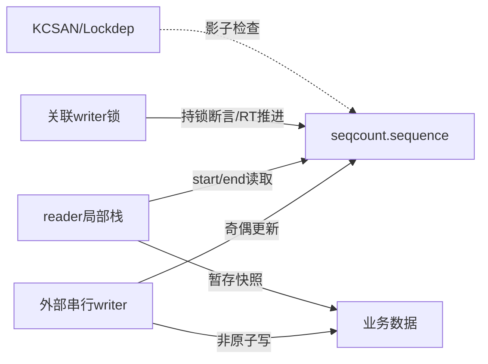

# 第1章\_Linux\_6.12\_序列计数器源码总阅读索引

## 1.1\_版本边界与阅读任务

实现证据固定到 NXP `linux-imx` 标签 `lf-6.12.20-2.0.0` 的提交 `dfaf2136deb2af2e60b994421281ba42f1c087e0`。序列计数器的大部分核心实现在单个 [`include/linux/seqlock.h`](https://github.com/nxp-imx/linux-imx/blob/dfaf2136deb2af2e60b994421281ba42f1c087e0/include/linux/seqlock.h) 中，但应按普通 seqcount、关联锁、latch 与 seqlock 四种职责阅读，不能从文件共址推断为一个状态机。

跨版本模型先读[序列计数器专题](../../../../knowledge/linux/synchronization_and_asynchrony/synchronization/sequence_counters/大纲.md#1.1_专题定位)。

## 1.2\_源码分支地图

| 分支 | 关键符号 | 解决的问题 |
| --- | --- | --- |
| plain seqcount | `read_seqcount_begin/retry`、`write_seqcount_begin/end` | 单副本奇偶代际与读重试 |
| associated lock | `SEQCOUNT_LOCKNAME()`、`seqcount_*_t` | writer 锁断言、抢占属性与 RT 补偿 |
| latch | `seqcount_latch_t`、`write_seqcount_latch*` | reader 可中断非原子 writer |
| seqlock | `seqlock_t`、`read_seqbegin/retry`、`write_seqlock` | seqcount 与 writer spinlock 封装 |
| 检查 | KCSAN 与 `dep_map` 辅助 | 标记有限原子区、验证 writer 契约 |

## 1.3\_状态所有权

sequence 是功能状态；关联锁本身完成 writer 串行；检查器只验证已覆盖路径。latch 还需要两份业务数据，最低位选择稳定副本。

## 1.4\_阅读入口

- [seqcount 与 seqlock 模块源码概念导读](P02_Linux_6.12_seqcount与seqlock模块源码概念导读.md#2.1_模块问题与职责分支)
- [`seqlock.h` 读写与 latch 源码实现](../source_explanations/P01_Linux_6.12_seqlock_h读写与latch源码实现.md#1.2_源码符号覆盖账本)

所有宏和函数体只在实现文档中展开一次；模块导读只组织调用顺序和状态通信。

## 1.5\_建议阅读顺序

1. 先用[一致快照证明模型](../../../../knowledge/linux/synchronization_and_asynchrony/synchronization/sequence_counters/P02_一致快照的证明模型.md#2.4_S0到S6的完整读写周期)写出 writer 串行与 reader 可回滚前提。
2. 读 P02 普通分支，跟随 begin → 数据复制 → retry 和 write begin → 字段更新 → end。
3. writer 使用 mutex/spinlock 时进入关联锁分支，区分功能锁与 Lockdep 关联状态。
4. NMI 等 reader 可中断 writer 时进入 latch 分支，画出两次重定向和双副本更新。
5. 需要封装 writer spinlock 时再读 seqlock 分支；不要把 locking reader 与 retry reader 混为一类。

## 1.6\_配置边界

当前开发工作树未启用 PREEMPT_RT，因此关联锁属性中的 RT lock/unlock 补偿只能作为条件编译实现核对，不能声称已运行验证。KCSAN/Lockdep 是否有效还取决于各自配置和路径覆盖。

## 1.7\_复核问题

- sequence、writer 锁、reader start 和临时快照各归谁所有？
- RT 分支触碰关联锁是保护整个读区，还是帮助奇数 writer 推进？
- latch 的最低位和完整 sequence 分别承担什么？
- seqlock locking reader 与普通 retry reader为什么不是同一读侧？

下一篇：[seqcount 与 seqlock 模块源码概念导读](P02_Linux_6.12_seqcount与seqlock模块源码概念导读.md)。
